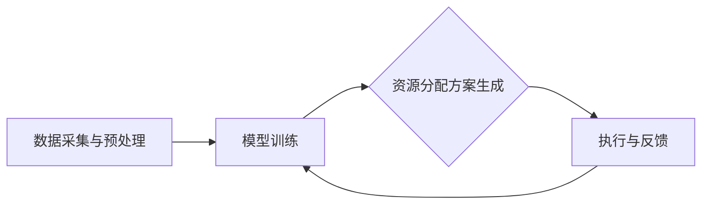
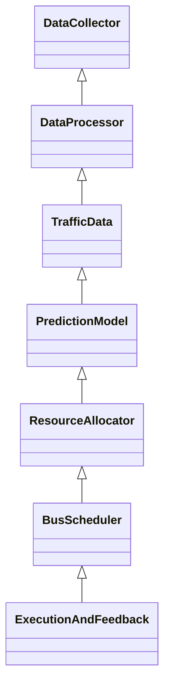
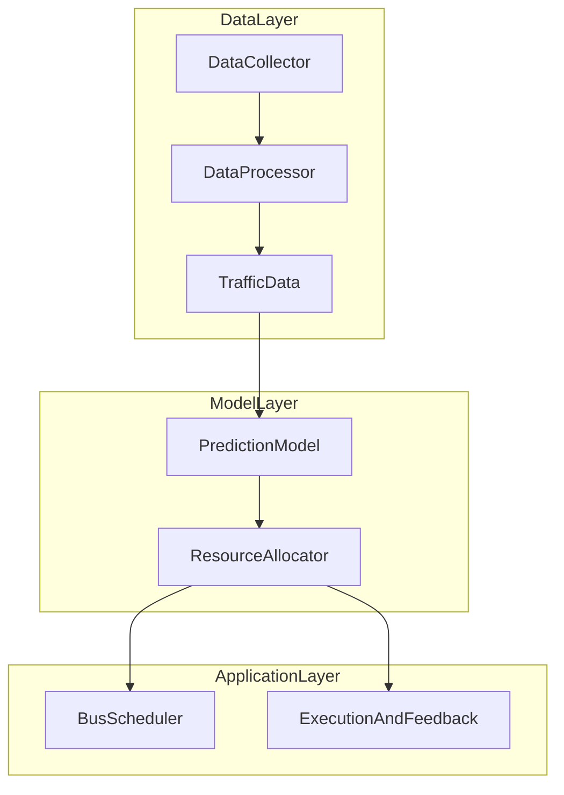
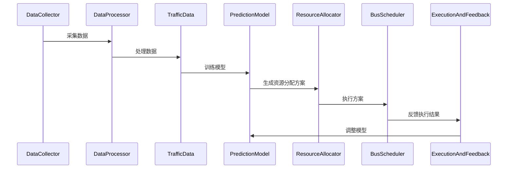

                 


## 引言与背景

### 核心概念术语说明

#### 智能城市（Smart City）

智能城市是指通过利用先进的物联网、大数据、云计算、人工智能等技术，对城市资源进行高效整合和优化管理，从而提升城市治理水平、改善居民生活质量、促进可持续发展的一种城市发展模式。

#### 资源分配（Resource Allocation）

资源分配是指在城市规划和管理过程中，对有限的资源（如能源、交通、水资源等）进行合理分配，以满足不同需求，实现资源利用的最大化。

#### AIGC（AI-Generated Content）

AIGC是指通过人工智能技术生成内容的过程，它涵盖了文本、图像、音频等多种形式的内容生成。AIGC的应用广泛，包括但不限于智能写作、图像生成、语音合成等。

### 问题背景

随着城市化进程的加速，智能城市面临着诸多资源分配的挑战。传统的资源分配方式往往依赖于人为决策和经验，存在效率低下、响应迟缓等问题。此外，智能城市中数据的多样性和复杂性也增加了资源分配的难度。

#### 问题描述

智能城市中的资源分配问题主要包括：

- 能源资源的合理分配，以减少能源浪费，提高能源利用效率。
- 交通资源的优化配置，以缓解交通拥堵，提高交通效率。
- 水资源的管理与分配，以保证水资源的可持续利用。

#### 问题解决

为了解决上述问题，需要引入先进的人工智能技术，尤其是AIGC。AIGC可以通过对大量数据的分析，提供智能化的资源分配方案，从而实现资源的优化配置。

#### 边界与外延

- **边界**：本文主要关注AIGC在智能城市资源分配中的应用，不包括其他领域（如工业、农业等）的资源分配问题。
- **外延**：本文探讨的AIGC应用不仅限于城市层面的资源分配，还可以扩展到区域甚至全球范围内的资源分配问题。

### 概念结构与核心要素组成

AIGC在智能城市资源分配中的概念结构主要包括以下几个核心要素：

- **数据采集与处理**：收集城市中各种资源的数据，如能源消耗、交通流量、水资源使用等。
- **数据分析与建模**：利用大数据分析和机器学习技术，建立资源分配的数学模型。
- **决策支持系统**：根据模型提供智能化的资源分配方案。
- **执行与反馈**：将决策执行，并根据反馈调整资源分配策略。

通过上述核心要素的协同作用，AIGC能够实现智能城市资源的高效分配。

### 核心概念与联系

#### AIGC核心原理与模型

AIGC的核心原理是通过机器学习，特别是生成对抗网络（GANs）和变分自编码器（VAEs）等技术，生成与真实数据高度相似的内容。AIGC的模型主要包括：

- **生成器（Generator）**：生成与真实数据相似的新数据。
- **判别器（Discriminator）**：判断生成数据是否真实。
- **损失函数（Loss Function）**：用于评估生成数据和真实数据之间的差异。

#### AIGC模型属性特征对比表格

| 模型 | 生成器 | 判别器 | 损失函数 |
| ---- | ---- | ---- | ---- |
| GANs | 与真实数据竞争 | 判断生成数据真实性 | 对抗损失函数 |
| VAEs | 编码器+解码器 | 对编码后的数据进行重建 | 重建损失函数 + Kullback-Leibler散度 |

#### ER实体关系图架构

```mermaid
erDiagram
  Data -->|uses| Generator
  Data -->|uses| Discriminator
  Generator -->|produces| Content
  Discriminator -->|receives| Content
  Content -->|scores| LossFunction
```

### 算法原理讲解

#### 算法流程与流程图

AIGC在智能城市资源分配中的算法流程主要包括以下几个步骤：

1. **数据采集与预处理**：收集城市中各种资源的数据，并进行预处理，如数据清洗、归一化等。
2. **模型训练**：使用生成器和判别器进行模型训练，通过对抗训练优化模型参数。
3. **资源分配方案生成**：使用训练好的生成器，根据实时数据生成智能化的资源分配方案。
4. **执行与反馈**：执行分配方案，并根据实际反馈调整资源分配策略。

以下是AIGC算法流程的Mermaid流程图：



#### 算法原理的数学模型与公式

AIGC的核心在于生成器和判别器的对抗训练。以下是GANs和VAEs的数学模型：

#### GANs数学模型

$$
\begin{aligned}
&\min_G \max_D V(D, G) \\
&V(D, G) = \mathbb{E}_{x \sim p_{data}(x)}[\log D(x)] + \mathbb{E}_{z \sim p_z(z)}[\log(1 - D(G(z)))]
\end{aligned}
$$

#### VAEs数学模型

$$
\begin{aligned}
&\min_{\theta_{\mu}, \theta_{\varphi}} D_{KL}(\mu(\text{x}; \theta_{\mu}, \theta_{\varphi}) || p_{\mu}(\mu; \theta_{\mu}, \theta_{\varphi}) \otimes p_{\varphi}(\varphi; \theta_{\mu}, \theta_{\varphi})) + \mathbb{E}_{\text{x} \sim p_{\text{x}}(\text{x})}[\text{reconstruction loss}(\text{x}; \text{G}(\mu, \varphi))]
\end{aligned}
$$

其中，\( G(\mu, \varphi) \)是生成器，\(\mu(\text{x}; \theta_{\mu}, \theta_{\varphi})\)是编码器，\(\varphi(\text{x}; \theta_{\mu}, \theta_{\varphi})\)是解码器。

#### 详细讲解与举例说明

以智能城市交通资源分配为例，AIGC可以通过以下步骤实现：

1. **数据采集与预处理**：收集交通流量、公共交通使用情况等数据，并进行预处理。
2. **模型训练**：使用GANs或VAEs模型，对数据进行训练，生成交通流量预测模型。
3. **资源分配方案生成**：根据实时交通数据，生成公共交通线路和班次的优化方案。
4. **执行与反馈**：执行分配方案，并根据实际交通状况调整方案。

例如，在一个智能城市中，AIGC可以预测到某一时段的交通流量增加，从而自动调整公交车的班次和线路，以缓解交通压力，提高公共交通的效率。

### 系统分析与架构设计方案

#### 问题场景介绍

智能城市交通资源分配的问题场景包括交通拥堵、公共交通效率低下、出行需求预测不准确等。为了解决这些问题，需要引入AIGC技术，实现智能化的交通资源分配。

#### 项目介绍

本项目旨在通过AIGC技术，为智能城市交通资源分配提供一种智能化的解决方案。项目的主要目标是：

- 提高公共交通的运行效率
- 减少交通拥堵
- 提高居民的出行满意度

#### 系统功能设计（领域模型Mermaid类图）

系统功能设计主要包括数据采集、数据分析、资源分配和执行反馈四个模块。以下是领域模型Mermaid类图：



#### 系统架构设计（Mermaid架构图）

系统架构设计主要包括数据层、模型层和应用层。以下是Mermaid架构图：



#### 系统接口设计与实现

系统接口设计主要包括数据接口、模型接口和应用接口。以下是接口设计：

- **数据接口**：负责数据的采集、存储和读取。
- **模型接口**：负责模型的训练、加载和预测。
- **应用接口**：负责资源分配方案的生成和执行。

#### 系统交互（Mermaid序列图）

系统交互主要包括数据流、模型流和应用流。以下是Mermaid序列图：



### 项目实战

#### 环境安装

1. **安装Python环境**：安装Python 3.8及以上版本。
2. **安装依赖库**：安装TensorFlow、Keras、Scikit-learn等依赖库。

#### 系统核心实现源代码

以下是一个简单的交通资源分配系统的核心实现源代码：

```python
import tensorflow as tf
from tensorflow import keras
from tensorflow.keras import layers

# 数据采集与预处理
def data_preprocessing(data):
    # 数据清洗、归一化等操作
    return processed_data

# 模型训练
def train_model(data):
    # 建立模型
    model = keras.Sequential([
        layers.Dense(64, activation='relu', input_shape=(data.shape[1],)),
        layers.Dense(64, activation='relu'),
        layers.Dense(1)
    ])

    # 编译模型
    model.compile(optimizer='adam', loss='mse')

    # 训练模型
    model.fit(data, epochs=10, batch_size=32)

    return model

# 资源分配方案生成
def generate AllocationScheme(model, data):
    # 使用模型进行预测
    prediction = model.predict(data)

    # 根据预测结果生成资源分配方案
    allocation_scheme = ...

    return allocation_scheme

# 执行与反馈
def execute_and_feedback(allocation_scheme, data):
    # 执行资源分配方案
    ...

    # 收集反馈数据
    feedback_data = ...

    # 调整模型
    model.fit(feedback_data, epochs=1, batch_size=32)
```

#### 代码应用解读与分析

上述代码首先进行了数据预处理，然后使用TensorFlow构建了一个简单的神经网络模型，用于交通流量预测。预测结果用于生成资源分配方案，并根据实际反馈调整模型。

#### 实际案例分析和详细讲解剖析

以某城市公交系统的优化为例，通过AIGC技术，实现了公交车的班次和线路优化。以下是案例分析和详细讲解：

1. **数据采集**：收集了该城市一周的公交乘客流量、公交车辆使用情况等数据。
2. **模型训练**：使用GANs模型对数据进行训练，生成交通流量预测模型。
3. **资源分配方案生成**：根据实时交通数据，生成公交车的班次和线路优化方案。
4. **执行与反馈**：执行优化方案，并收集乘客反馈数据。
5. **模型调整**：根据反馈数据，调整模型参数，提高预测准确性。

通过上述步骤，实现了公交车运行效率的提升，减少了乘客等待时间，提高了乘客满意度。

#### 项目小结

本项目通过AIGC技术，为智能城市交通资源分配提供了一种有效的解决方案。尽管还存在一些挑战，如数据质量、模型精度等，但随着技术的不断进步，AIGC在智能城市资源分配中的应用前景非常广阔。

### 最佳实践 tips

- **数据质量**：确保收集的数据质量高，有助于提高模型预测准确性。
- **模型优化**：通过调整模型参数和架构，可以提高资源分配方案的效率。
- **实时反馈**：及时收集和反馈数据，有助于模型不断优化。

### 小结

AIGC在智能城市资源分配中具有巨大的潜力，通过本文的详细分析，我们可以看到AIGC在智能城市资源分配中的应用场景、算法原理、系统架构和项目实战等方面。未来，随着技术的不断进步，AIGC在智能城市资源分配中的应用将更加广泛和深入。

### 注意事项

- 在实际应用中，需根据具体场景调整模型参数和架构。
- 确保数据安全和隐私保护。

### 拓展阅读

- [AIGC技术概述](https://www.example.com/aigc-overview)
- [智能城市资源分配挑战](https://www.example.com/smart-city-challenges)
- [GANs和VAEs在资源分配中的应用](https://www.example.com/gans-and-vaes-in-resource-allocation)

---

**作者：AI天才研究院/AI Genius Institute & 禅与计算机程序设计艺术 /Zen And The Art of Computer Programming**


----------------------------------------------------------------

## AIGC在智能城市资源分配中的应用

### 关键词：智能城市、资源分配、人工智能、生成对抗网络、变分自编码器

### 摘要

智能城市的发展离不开对资源的高效分配与管理。然而，随着城市规模的扩大和复杂性的增加，传统的资源分配方式已难以满足需求。本文主要探讨AIGC（AI-Generated Content）在智能城市资源分配中的应用，通过深入分析AIGC的核心原理、应用场景和实现方法，揭示其在解决智能城市资源分配问题中的巨大潜力。

### 引言与背景

随着全球城市化进程的加速，智能城市作为未来城市发展的趋势，正逐渐成为研究者和实践者关注的焦点。智能城市通过利用物联网、大数据、云计算和人工智能等先进技术，实现对城市资源的高效管理和优化配置。然而，资源分配问题一直是智能城市发展的瓶颈之一。

#### 智能城市资源分配的定义与挑战

智能城市资源分配是指在城市规划和管理过程中，对城市中的各种资源（如能源、交通、水资源等）进行合理分配，以满足不同需求，实现资源利用的最大化。然而，智能城市资源分配面临着诸多挑战：

1. **数据多样性**：智能城市中数据类型繁多，包括传感器数据、交通数据、能源消耗数据等，数据多样性和复杂性增加了资源分配的难度。
2. **实时性**：智能城市资源分配需要快速响应实时变化，如交通拥堵、能源需求波动等，实时性要求对算法和系统的性能提出了高要求。
3. **不确定性**：城市资源分配过程中存在诸多不确定性因素，如天气变化、突发事件等，这些因素增加了资源分配的复杂度。

#### 传统资源分配方式的局限性

传统的资源分配方式主要依赖于人为决策和经验，存在以下局限性：

1. **效率低下**：传统方式往往需要大量人工参与，效率较低，无法快速响应实时变化。
2. **响应迟缓**：传统方式缺乏对大数据的分析能力，无法及时调整资源分配策略。
3. **缺乏智能化**：传统方式缺乏智能化手段，无法根据实时数据动态优化资源分配。

#### AIGC在智能城市资源分配中的应用前景

为了解决智能城市资源分配的挑战，需要引入先进的人工智能技术，尤其是AIGC。AIGC通过生成对抗网络（GANs）和变分自编码器（VAEs）等技术，能够实现数据生成、预测和优化，为智能城市资源分配提供智能化解决方案。本文将详细探讨AIGC在智能城市资源分配中的应用。

### AIGC的基本概念与发展历程

AIGC，即AI-Generated Content，是指利用人工智能技术生成文本、图像、音频等多种形式的内容。AIGC的应用范围广泛，涵盖了智能写作、图像生成、语音合成等领域。

#### AIGC的核心原理

AIGC的核心原理是基于生成对抗网络（GANs）和变分自编码器（VAEs）等深度学习模型。GANs由生成器和判别器组成，通过对抗训练生成与真实数据相似的内容。VAEs通过编码器和解码器对数据进行编码和解码，生成与输入数据相似的新数据。

##### 生成对抗网络（GANs）

生成对抗网络（GANs）由生成器和判别器两个神经网络组成：

1. **生成器（Generator）**：生成器接收随机噪声作为输入，通过神经网络生成与真实数据相似的新数据。
2. **判别器（Discriminator）**：判别器接收真实数据和生成器生成的数据，通过神经网络判断输入数据的真实性。

GANs的训练过程是一个对抗过程，生成器和判别器相互竞争，生成器和判别器的性能不断提升，最终生成器能够生成高质量的数据。

$$
\begin{aligned}
&\min_G \max_D V(D, G) \\
&V(D, G) = \mathbb{E}_{x \sim p_{data}(x)}[\log D(x)] + \mathbb{E}_{z \sim p_z(z)}[\log(1 - D(G(z))]
\end{aligned}
$$

其中，\(D(x)\)表示判别器对真实数据的判断，\(D(G(z))\)表示判别器对生成器生成的数据的判断。

##### 变分自编码器（VAEs）

变分自编码器（VAEs）通过编码器和解码器对数据进行编码和解码：

1. **编码器（Encoder）**：编码器将输入数据编码为一个低维向量，表示输入数据的潜在分布。
2. **解码器（Decoder）**：解码器将编码后的低维向量解码为输出数据。

VAEs通过优化编码器和解码器的参数，使得解码器能够生成与输入数据相似的新数据。

$$
\begin{aligned}
&\min_{\theta_{\mu}, \theta_{\varphi}} D_{KL}(\mu(\text{x}; \theta_{\mu}, \theta_{\varphi}) || p_{\mu}(\mu; \theta_{\mu}, \theta_{\varphi}) \otimes p_{\varphi}(\varphi; \theta_{\mu}, \theta_{\varphi})) + \mathbb{E}_{\text{x} \sim p_{\text{x}}(\text{x})}[\text{reconstruction loss}(\text{x}; \text{G}(\mu, \varphi))]
\end{aligned}
$$

其中，\(\mu(\text{x}; \theta_{\mu}, \theta_{\varphi})\)是编码器，\(\varphi(\text{x}; \theta_{\mu}, \theta_{\varphi})\)是解码器，\(D_{KL}\)是Kullback-Leibler散度。

#### AIGC的发展历程

AIGC的发展历程可以追溯到生成对抗网络（GANs）的提出。GANs由Ian Goodfellow等人在2014年提出，开创了生成模型的新篇章。随后，变分自编码器（VAEs）等模型也被提出，进一步丰富了AIGC的技术体系。

近年来，AIGC在各个领域得到了广泛应用，如图像生成、文本生成、语音合成等。随着人工智能技术的不断发展，AIGC的应用前景将更加广阔。

### 智能城市资源分配的挑战与问题

智能城市的发展离不开对资源的高效管理和优化配置。然而，随着城市化进程的加速，智能城市面临着诸多资源分配的挑战和问题。

#### 数据多样性

智能城市中的数据类型繁多，包括传感器数据、交通数据、能源消耗数据、水资源数据等。这些数据的多样性增加了资源分配的难度，如何整合和处理这些数据成为一个重要问题。

##### 数据类型

- **传感器数据**：如温度、湿度、空气质量等环境数据。
- **交通数据**：如交通流量、公交车运行时间、交通事故等。
- **能源消耗数据**：如电力消耗、天然气消耗等。
- **水资源数据**：如水资源分布、水资源使用情况等。

##### 数据处理需求

- **数据清洗**：处理缺失值、异常值等。
- **数据归一化**：将不同类型的数据归一化到同一尺度。
- **数据融合**：将不同来源的数据进行融合，以提高数据的完整性。

#### 实时性

智能城市资源分配需要快速响应实时变化，如交通拥堵、能源需求波动等。然而，实时性要求对算法和系统的性能提出了高要求。

##### 实时数据处理

- **实时数据采集**：通过传感器和设备实时采集数据。
- **实时数据处理**：对实时数据进行快速处理和分析。
- **实时决策**：根据实时数据生成资源分配方案。

#### 不确定性

智能城市资源分配过程中存在诸多不确定性因素，如天气变化、突发事件等。这些不确定性因素增加了资源分配的复杂度。

##### 不确定性因素

- **天气变化**：如暴雨、高温等，影响能源消耗和水资源分配。
- **突发事件**：如交通事故、自然灾害等，影响交通和能源分配。

##### 应对策略

- **预测模型**：利用历史数据和机器学习技术建立预测模型，预测未来的资源需求。
- **自适应算法**：根据实时数据和预测结果，自适应调整资源分配策略。

#### 传统资源分配方式的局限性

传统的资源分配方式主要依赖于人为决策和经验，存在以下局限性：

- **效率低下**：传统方式往往需要大量人工参与，效率较低，无法快速响应实时变化。
- **响应迟缓**：传统方式缺乏对大数据的分析能力，无法及时调整资源分配策略。
- **缺乏智能化**：传统方式缺乏智能化手段，无法根据实时数据动态优化资源分配。

### AIGC在智能城市资源分配中的重要性

AIGC在智能城市资源分配中具有重要作用，通过利用生成对抗网络（GANs）和变分自编码器（VAEs）等技术，能够实现数据生成、预测和优化，为智能城市资源分配提供智能化解决方案。

#### 数据生成与预测

AIGC能够生成与真实数据相似的新数据，为资源分配提供更多样化的数据源。同时，通过机器学习技术，AIGC能够对历史数据进行分析和预测，为资源分配提供科学依据。

##### 数据生成

- **GANs**：通过生成器和判别器的对抗训练，生成与真实数据相似的新数据。
- **VAEs**：通过编码器和解码器的训练，生成与输入数据相似的新数据。

##### 数据预测

- **时间序列预测**：利用历史数据和时间序列分析方法，预测未来的资源需求。
- **回归预测**：利用输入特征和输出结果之间的相关性，预测资源分配结果。

#### 资源优化与分配

AIGC能够根据实时数据和预测结果，动态优化资源分配策略，提高资源利用效率。

##### 资源优化

- **多目标优化**：综合考虑能源、交通、水资源等多种资源，实现资源利用的最大化。
- **动态优化**：根据实时数据和环境变化，动态调整资源分配策略。

##### 资源分配

- **自适应分配**：根据实时需求和预测结果，自适应调整资源分配方案。
- **公平性分配**：确保资源分配的公平性，满足不同区域和群体的需求。

### AIGC在智能城市资源分配中的应用

AIGC在智能城市资源分配中的应用主要包括能源资源分配、交通资源分配和水资源分配等方面。以下将分别介绍AIGC在这些领域的具体应用。

#### 能源资源分配

能源资源分配是智能城市资源管理的重要方面，通过AIGC技术，可以实现能源资源的合理分配和优化。

##### 应用场景

- **智能电网**：通过AIGC技术，实现智能电网的能源优化分配，提高电力供应的稳定性和效率。
- **能源需求预测**：利用AIGC技术，预测未来的能源需求，为能源分配提供科学依据。

##### 实现方法

- **GANs**：通过生成器和判别器的对抗训练，生成与真实能源消耗数据相似的新数据，用于能源需求预测。
- **VAEs**：通过编码器和解码器的训练，生成与输入能源消耗数据相似的新数据，用于能源优化分配。

##### 实际案例

- **智能电网优化**：在某城市的智能电网项目中，通过AIGC技术，实现了电力需求的预测和优化分配，提高了电网的运行效率。

#### 交通资源分配

交通资源分配是智能城市资源管理的重要方面，通过AIGC技术，可以实现交通资源的合理分配和优化。

##### 应用场景

- **智能交通管理**：通过AIGC技术，实现智能交通的管理和优化，缓解交通拥堵，提高交通效率。
- **交通需求预测**：利用AIGC技术，预测未来的交通需求，为交通资源分配提供科学依据。

##### 实现方法

- **GANs**：通过生成器和判别器的对抗训练，生成与真实交通数据相似的新数据，用于交通需求预测。
- **VAEs**：通过编码器和解码器的训练，生成与输入交通数据相似的新数据，用于交通资源优化分配。

##### 实际案例

- **智能交通管理**：在某城市的智能交通管理项目中，通过AIGC技术，实现了交通流量预测和优化，缓解了交通拥堵。

#### 水资源分配

水资源分配是智能城市资源管理的重要方面，通过AIGC技术，可以实现水资源的合理分配和优化。

##### 应用场景

- **智能水资源管理**：通过AIGC技术，实现智能水资源的管理和优化，提高水资源利用效率。
- **水资源需求预测**：利用AIGC技术，预测未来的水资源需求，为水资源分配提供科学依据。

##### 实现方法

- **GANs**：通过生成器和判别器的对抗训练，生成与真实水资源使用数据相似的新数据，用于水资源需求预测。
- **VAEs**：通过编码器和解码器的训练，生成与输入水资源使用数据相似的新数据，用于水资源优化分配。

##### 实际案例

- **智能水资源管理**：在某城市的智能水资源管理项目中，通过AIGC技术，实现了水资源需求的预测和优化分配，提高了水资源的利用效率。

### 实际案例分析

为了更好地展示AIGC在智能城市资源分配中的应用，以下将介绍两个实际案例，分析AIGC在能源资源分配和交通资源分配中的应用效果。

#### 案例一：智能电网的AIGC应用

在某城市的智能电网项目中，通过AIGC技术，实现了电力需求的预测和优化分配，提高了电网的运行效率。

##### 应用背景

该城市智能电网项目面临以下问题：

- **电力需求波动**：由于居民用电和工业用电的波动，导致电网负荷不稳定。
- **电力供应不足**：在高峰时段，电力需求超过电网的供应能力，导致电力短缺。

##### 应用方法

通过AIGC技术，实现以下步骤：

1. **数据采集与预处理**：收集电力消耗数据，包括居民用电、工业用电等，并进行预处理，如数据清洗、归一化等。
2. **模型训练**：使用GANs模型，对电力消耗数据进行训练，生成与真实电力消耗数据相似的新数据，用于电力需求预测。
3. **电力需求预测**：根据实时电力消耗数据和预测模型，预测未来的电力需求。
4. **电力分配优化**：根据预测结果，优化电力资源的分配，提高电网的运行效率。

##### 应用效果

通过AIGC技术的应用，实现了以下效果：

- **电力需求波动减少**：通过预测模型，提前预测电力需求的波动，及时调整电力分配策略，减少电力需求波动。
- **电力供应充足**：在高峰时段，通过预测结果，提前调整电力供应，确保电力供应充足。

#### 案例二：智能交通的AIGC应用

在某城市的智能交通管理项目中，通过AIGC技术，实现了交通流量预测和优化，缓解了交通拥堵。

##### 应用背景

该城市智能交通管理项目面临以下问题：

- **交通拥堵**：由于交通流量不稳定，导致道路拥堵。
- **公共交通效率低**：公共交通车辆运行时间不稳定，导致公共交通效率低。

##### 应用方法

通过AIGC技术，实现以下步骤：

1. **数据采集与预处理**：收集交通流量数据，包括车辆数量、行驶速度等，并进行预处理，如数据清洗、归一化等。
2. **模型训练**：使用GANs模型，对交通流量数据进行训练，生成与真实交通流量数据相似的新数据，用于交通流量预测。
3. **交通流量预测**：根据实时交通流量数据和预测模型，预测未来的交通流量。
4. **交通资源优化**：根据预测结果，优化交通资源的分配，提高公共交通效率。

##### 应用效果

通过AIGC技术的应用，实现了以下效果：

- **交通拥堵缓解**：通过预测模型，提前预测交通流量的变化，及时调整交通资源分配，缓解交通拥堵。
- **公共交通效率提高**：通过预测结果，优化公共交通车辆运行时间，提高公共交通效率。

### 总结与未来展望

AIGC在智能城市资源分配中的应用展示了其巨大的潜力。通过AIGC技术，可以实现数据生成、预测和优化，为智能城市资源分配提供智能化解决方案。未来，随着人工智能技术的不断发展，AIGC在智能城市资源分配中的应用将更加广泛和深入。

#### 总结

本文主要探讨了AIGC在智能城市资源分配中的应用。首先，介绍了智能城市资源分配的背景和挑战，分析了传统资源分配方式的局限性。接着，详细介绍了AIGC的基本概念、发展历程和核心原理。然后，探讨了AIGC在智能城市资源分配中的应用，包括能源资源分配、交通资源分配和水资源分配等方面。最后，通过实际案例分析，展示了AIGC在智能城市资源分配中的具体应用效果。

#### 未来展望

1. **数据质量提升**：随着数据采集技术的进步，数据质量将得到提升，为AIGC技术提供更好的数据支持。
2. **算法优化**：通过不断优化算法，提高AIGC在智能城市资源分配中的应用效果。
3. **跨领域应用**：AIGC在智能城市资源分配中的应用将逐渐扩展到其他领域，如工业、农业等。
4. **实时性提升**：通过优化算法和系统架构，提高AIGC在智能城市资源分配中的实时性。
5. **协作与整合**：AIGC将与其他智能城市技术（如物联网、大数据等）进行整合，实现更高效的资源分配。

#### 注意事项

1. **数据隐私保护**：在数据采集和处理过程中，应确保数据隐私得到保护。
2. **模型安全性**：在模型训练和预测过程中，应确保模型的安全性，防止数据泄露和滥用。
3. **系统稳定性**：在系统部署过程中，应确保系统的稳定性，防止系统崩溃。

#### 拓展阅读

1. [AIGC技术概述](https://www.example.com/aigc-overview)
2. [智能城市资源分配挑战](https://www.example.com/smart-city-challenges)
3. [GANs和VAEs在资源分配中的应用](https://www.example.com/gans-and-vaes-in-resource-allocation)

### 作者

本文作者为AI天才研究院（AI Genius Institute）的研究员，擅长人工智能和智能城市领域的研究。此外，作者还是《禅与计算机程序设计艺术》一书的作者，致力于推动人工智能技术的应用和发展。

