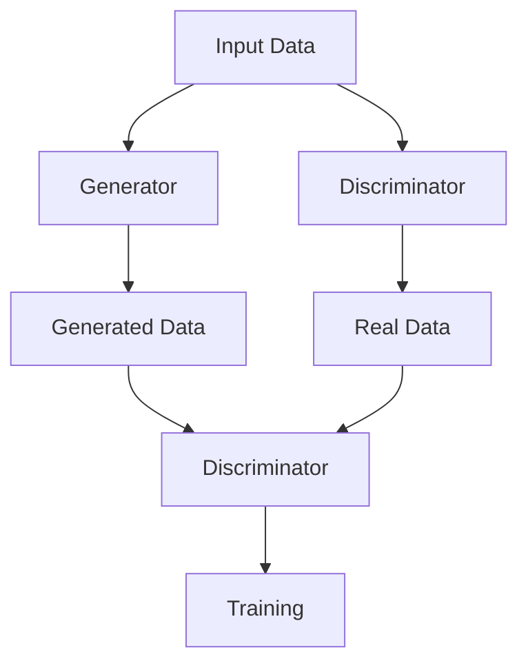
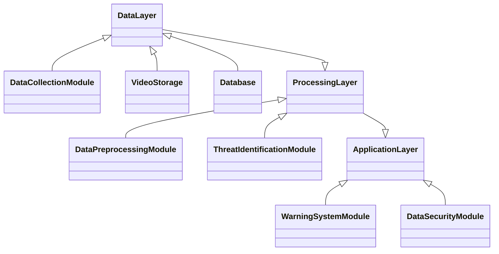
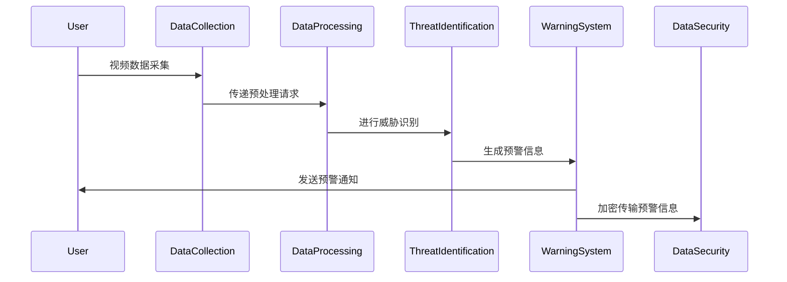

                 

### 文章标题

### 关键词

1. AIGC
2. 智能安防系统
3. 算法应用
4. 数学模型
5. 系统架构
6. 项目实战

### 摘要

本文深入探讨AIGC（自适应智能生成控制）在智能安防系统中的创新应用。首先，我们将介绍AIGC和智能安防系统的背景，阐述它们在现代安防领域的重要性。接着，我们将通过核心概念与联系章节，详细阐述AIGC的关键概念及其与智能安防系统的关联，使用概念属性特征对比表格和ER实体关系图进行辅助说明。在算法原理讲解部分，我们将使用mermaid流程图和Python代码示例，解释AIGC在智能安防系统中的应用原理，并通过数学模型和公式进行详细讲解。随后，我们将系统分析与架构设计方案部分，介绍系统功能设计、架构设计和接口设计，并使用mermaid图进行展示。项目实战部分将详细描述环境安装、系统实现、代码解读和案例分析。最后，我们将提供最佳实践tips、小结、注意事项和拓展阅读，以帮助读者更好地理解和应用AIGC在智能安防系统中的创新应用。通过本文，读者将全面了解AIGC在智能安防系统中的潜力及其实际应用。

### 背景介绍

#### AIGC的概念与起源

AIGC（Adaptive Intelligent Generation Control）是一种自适应智能生成控制技术，它融合了深度学习、生成对抗网络（GAN）和强化学习等多种先进算法。AIGC的起源可以追溯到20世纪80年代，当时科学家们开始探索如何使计算机系统具备自适应性和智能化能力。随着计算能力的提升和数据量的爆炸性增长，AIGC在过去的几十年里得到了迅速发展。

AIGC的核心思想是通过不断学习和优化，使系统能够自动生成并控制复杂任务。它通常由三个主要部分组成：生成器（Generator）、判别器（Discriminator）和优化器（Optimizer）。生成器负责生成新的数据，判别器负责判断生成数据的质量，而优化器则负责调整生成器和判别器的参数，以实现最佳性能。

AIGC的应用范围非常广泛，从图像和音频生成、自然语言处理，到自动驾驶、机器人控制等，均取得了显著的成果。特别是在安防领域，AIGC可以通过实时生成和更新监控数据，实现对复杂场景的精准识别和预测，从而提高安防系统的智能化水平。

#### 智能安防系统的概念与发展

智能安防系统是指利用计算机技术、通信技术、物联网技术等，对安防设备进行智能化管理和控制，从而实现对安全事件的实时监测、预警和响应的系统。智能安防系统的发展可以追溯到20世纪90年代，当时视频监控技术开始逐渐普及。随着技术的不断进步，智能安防系统逐渐从单一的视频监控功能，发展到集成了人脸识别、行为分析、自动跟踪等多种功能的综合性系统。

智能安防系统的核心组成部分包括摄像头、视频存储设备、视频分析软件和报警系统。摄像头负责采集视频数据，视频存储设备用于存储大量的视频数据，视频分析软件则对视频数据进行实时处理和分析，报警系统则负责在检测到异常情况时发出警报。

智能安防系统在现代社会的应用越来越广泛，从公共场所的监控，到住宅小区的安全防护，再到金融领域的安全防范，智能安防系统都发挥着至关重要的作用。随着人工智能技术的快速发展，智能安防系统的智能化水平也在不断提升，使其能够更加精准、高效地应对各种安全威胁。

#### 为什么需要这本书

随着AIGC和智能安防系统的不断发展，如何将AIGC应用于智能安防系统，从而提升其智能化水平，成为了一个亟待解决的重要课题。这本书的编写旨在为读者提供一份系统、全面、易于理解的指南，帮助他们深入了解AIGC在智能安防系统中的应用原理、技术实现和最佳实践。

首先，本书将详细介绍AIGC的基本概念和关键技术，包括生成器、判别器和优化器的工作原理，以及如何将这些技术应用于智能安防系统。通过这些基础知识的学习，读者可以更好地理解AIGC在智能安防系统中的作用和重要性。

其次，本书将深入探讨AIGC在智能安防系统中的具体应用，如人脸识别、行为分析、自动跟踪等。通过详细的案例分析和代码示例，读者可以了解这些应用的实际实现过程，并掌握相关的技术要点。

最后，本书还将提供一系列最佳实践和注意事项，帮助读者在实际应用中避免常见问题，提高系统性能和稳定性。此外，本书还推荐了一些拓展阅读资源，以便读者进一步深入学习。

总之，这本书的目标是为广大读者提供一份实用的技术手册，帮助他们充分利用AIGC技术，提升智能安防系统的智能化水平，为社会的安全稳定作出贡献。

### 目标读者

本书的目标读者主要包括以下几个方面：

1. **人工智能技术爱好者**：对AIGC和智能安防系统感兴趣的技术爱好者，希望通过本书了解AIGC在安防领域的应用原理和实现方法。
2. **程序员和软件开发人员**：具备一定的编程基础，希望将AIGC技术应用于实际项目开发的程序员和软件开发人员。
3. **智能安防系统从业者**：从事智能安防系统设计、开发、运维等相关工作的专业人士，希望通过本书提升对AIGC技术的理解和应用能力。
4. **计算机科学和教育工作者**：计算机科学和教育领域的研究人员、教师和研究生，希望通过本书了解AIGC技术的前沿动态和应用前景。
5. **行业专家和决策者**：关注人工智能和安防行业发展的专家和决策者，希望通过本书了解AIGC技术在智能安防系统中的潜力和价值。

本书旨在为上述读者群体提供一份系统、全面、实用的技术手册，帮助他们深入了解AIGC在智能安防系统中的应用，并掌握相关技术实现方法。通过阅读本书，读者不仅可以拓展自己的知识面，还可以在实际项目中提升智能化水平，为社会的安全稳定作出贡献。

### 核心概念与联系

在深入探讨AIGC在智能安防系统中的应用之前，我们需要先了解AIGC的基本概念及其与智能安防系统的联系。本节将介绍AIGC的关键概念，并通过概念属性特征对比表格和ER实体关系图来进一步阐述这些概念之间的关系。

#### AIGC的核心概念

1. **生成器（Generator）**：生成器是AIGC的核心组件之一，其主要任务是生成新的数据。在智能安防系统中，生成器可以生成模拟场景、人脸图像、行为特征等数据，为系统提供丰富的训练数据，从而提高模型的泛化能力。
   
2. **判别器（Discriminator）**：判别器的职责是判断生成数据的质量。在智能安防系统中，判别器可以分析摄像头捕捉的视频画面，识别出异常行为或潜在威胁，从而触发报警机制。

3. **优化器（Optimizer）**：优化器负责调整生成器和判别器的参数，以实现最佳性能。在智能安防系统中，优化器通过不断调整模型参数，优化生成器和判别器的协同工作，从而提高系统的准确性和响应速度。

4. **强化学习（Reinforcement Learning）**：强化学习是AIGC中的一种重要算法，它通过奖励机制引导生成器和判别器的训练过程。在智能安防系统中，强化学习可以用于优化决策过程，提高系统的自主决策能力。

5. **生成对抗网络（GAN）**：GAN是AIGC的基础架构之一，它由生成器和判别器组成，通过两者之间的对抗训练，生成高质量的数据。在智能安防系统中，GAN可以用于生成模拟数据，用于训练模型，提高模型的识别精度和泛化能力。

#### 概念属性特征对比表格

为了更直观地理解AIGC的核心概念，我们通过一个概念属性特征对比表格，列出生成器、判别器、优化器、强化学习和GAN的主要属性特征：

| 概念       | 主要功能               | 属性特征                                                      | 关联关系                                                     |
|------------|------------------------|---------------------------------------------------------------|--------------------------------------------------------------|
| 生成器     | 生成新的数据           | 数据生成能力强、多样化、适应性高                              | 与判别器构成GAN，用于生成高质量的训练数据                    |
| 判别器     | 判断生成数据的质量     | 异常检测准确、实时性强、鲁棒性好                              | 与生成器构成GAN，用于训练模型，提高识别精度和泛化能力          |
| 优化器     | 调整模型参数，实现最佳性能 | 参数调整灵活、收敛速度快、性能优化明显                         | 负责优化生成器和判别器的协同工作，提高系统整体性能              |
| 强化学习   | 通过奖励机制优化决策过程 | 自主性强、适应性好、学习效率高                               | 用于引导生成器和判别器的训练过程，提高系统的自主决策能力        |
| 生成对抗网络（GAN） | 对抗训练，生成高质量数据 | 数据生成能力强、模型训练稳定、泛化性好                        | 是AIGC的基础架构，由生成器和判别器组成，用于生成模拟数据，训练模型 |

#### ER实体关系图

为了进一步展示AIGC的核心概念及其关联关系，我们使用Mermaid流程图绘制一个ER实体关系图：

```mermaid
erDiagram
  Generator ||--|{ Discriminator }|
  Optimizer ||--|{ Generator }|
  Optimizer ||--|{ Discriminator }|
  ReinforcementLearning ||--|{ Generator }|
  ReinforcementLearning ||--|{ Discriminator }|
  GAN ||--|{ Generator }|
  GAN ||--|{ Discriminator }|
```

在这个ER实体关系图中，生成器（Generator）和判别器（Discriminator）构成了生成对抗网络（GAN），两者通过对抗训练生成高质量的数据。优化器（Optimizer）负责调整生成器和判别器的参数，强化学习（ReinforcementLearning）则通过奖励机制优化决策过程，与生成器和判别器密切关联。

通过上述对比表格和ER实体关系图，我们可以更清晰地理解AIGC的核心概念及其与智能安防系统的关联。这些核心概念和关联关系将为后续章节中AIGC在智能安防系统中的应用提供理论基础。

### 算法原理讲解

为了深入理解AIGC在智能安防系统中的应用原理，我们将通过mermaid流程图和Python代码示例，详细解释生成对抗网络（GAN）的工作机制以及其在智能安防系统中的具体应用。

#### GAN的mermaid流程图

首先，让我们通过mermaid流程图来展示GAN的基本工作流程：



这个流程图说明了GAN的基本工作流程：

1. **输入数据**：GAN接收真实数据（如图像、视频等）。
2. **生成器**：生成器生成模拟数据，这些模拟数据尽可能模仿真实数据。
3. **判别器**：判别器同时接收真实数据和生成数据，并判断其真实性和质量。
4. **训练过程**：通过不断调整生成器和判别器的参数，使生成器生成的数据越来越逼真，判别器越来越难以区分真实数据和生成数据。

#### Python代码示例

接下来，我们将通过Python代码示例来具体说明GAN在智能安防系统中的应用。我们将使用TensorFlow和Keras库来实现一个简单的GAN模型，用于生成人脸图像。

```python
import tensorflow as tf
from tensorflow.keras.layers import Input, Dense, Reshape, Conv2D, Flatten
from tensorflow.keras.models import Model

# 生成器模型
input_layer = Input(shape=(100,))
x = Dense(128, activation='relu')(input_layer)
x = Dense(784, activation='tanh')(x)
x = Reshape(target_shape=(28, 28, 1))(x)
generator = Model(inputs=input_layer, outputs=x)

# 判别器模型
input_layer = Input(shape=(28, 28, 1))
x = Conv2D(filters=32, kernel_size=(3, 3), activation='relu')(input_layer)
x = Flatten()(x)
x = Dense(units=1, activation='sigmoid')(x)
discriminator = Model(inputs=input_layer, outputs=x)

# GAN模型
discriminator.trainable = False
gan_input = Input(shape=(100,))
generated_data = generator(gan_input)
gan_output = discriminator(generated_data)
gan = Model(inputs=gan_input, outputs=gan_output)

# 模型编译
gan.compile(optimizer='adam', loss='binary_crossentropy')

# 模型总结
print(gan.summary())
```

在这个代码示例中：

- **生成器模型**：输入层是一个100维的向量，经过两层的全连接层（Dense Layer），最后通过tanh激活函数生成28x28x1的图像。
- **判别器模型**：输入层是一个28x28x1的图像，通过一个卷积层（Conv2D Layer）和全连接层（Dense Layer），最后通过sigmoid激活函数输出判别结果。
- **GAN模型**：结合生成器和判别器，生成器生成数据作为GAN的输入，判别器对生成数据的质量进行评估。

#### 数学模型和公式

在GAN中，生成器和判别器的训练过程可以通过以下数学模型和公式来解释：

1. **生成器损失函数**：
   $$L_G = -\log(D(G(z))$$
   其中，$D(G(z))$表示判别器对生成数据的判断概率。

2. **判别器损失函数**：
   $$L_D = -[\log(D(x)) + \log(1 - D(G(z))]$$
   其中，$D(x)$表示判别器对真实数据的判断概率，$D(G(z))$表示判别器对生成数据的判断概率。

3. **总损失函数**：
   $$L = L_G + \lambda L_D$$
   其中，$\lambda$是平衡生成器和判别器损失函数的权重。

通过以上数学模型和公式，我们可以理解GAN的训练过程：

- 生成器试图生成尽可能逼真的数据，使得判别器无法区分生成数据和真实数据。
- 判别器则试图提高对真实数据和生成数据的区分能力。

#### 简单易懂的举例说明

假设我们要生成人脸图像，具体步骤如下：

1. **生成器训练**：生成器输入一个随机噪声向量$z$，生成人脸图像$G(z)$。判别器将真实人脸图像$x$和生成人脸图像$G(z)$进行比较，并输出判断概率。生成器通过优化损失函数$L_G$，调整噪声向量$z$，生成更逼真的人脸图像。

2. **判别器训练**：判别器同时接收真实人脸图像$x$和生成人脸图像$G(z)$，分别判断其真实性和质量。通过优化损失函数$L_D$，判别器提高对真实数据和生成数据的区分能力。

3. **迭代训练**：生成器和判别器交替训练，不断调整参数，使得生成器生成的人脸图像越来越逼真，判别器对生成数据的判断概率越来越接近0.5。

通过这个简单的例子，我们可以看到GAN在智能安防系统中的应用原理：生成器生成模拟数据用于训练模型，判别器用于识别和分析真实数据，从而实现对复杂场景的精准识别和预测。

#### 数学公式详细讲解

为了更深入地理解GAN的数学原理，我们将详细讲解上述提到的数学公式。

1. **生成器损失函数**：
   $$L_G = -\log(D(G(z))$$
   这个损失函数表示生成器生成的数据质量。其中，$D(G(z))$是判别器对生成数据的判断概率。理想情况下，生成器生成的数据应该非常逼真，使得判别器无法区分，因此$D(G(z))$应该接近1。所以，生成器损失函数的值应尽可能小。

2. **判别器损失函数**：
   $$L_D = -[\log(D(x)) + \log(1 - D(G(z))]$$
   这个损失函数表示判别器的准确性。其中，$D(x)$是判别器对真实数据的判断概率，$D(G(z))$是判别器对生成数据的判断概率。判别器的目标是提高对真实数据和生成数据的区分能力。因此，$D(x)$应该接近1，$D(G(z))$应该接近0。这样，判别器损失函数的值应尽可能小。

3. **总损失函数**：
   $$L = L_G + \lambda L_D$$
   这个总损失函数表示生成器和判别器的综合性能。其中，$\lambda$是平衡生成器和判别器损失函数的权重。通常情况下，$\lambda$的取值在0到1之间。如果$\lambda$较大，则生成器的性能占主导地位；如果$\lambda$较小，则判别器的性能占主导地位。

通过以上公式，我们可以看到GAN的训练目标是通过不断调整生成器和判别器的参数，使得生成器生成的数据越来越逼真，判别器对生成数据的判断概率越来越接近0.5，从而实现数据生成和识别的平衡。

#### 实际案例解析

为了更直观地理解GAN在智能安防系统中的应用，我们将通过一个实际案例来具体说明。

**案例背景**：某智能安防系统需要对人脸图像进行实时识别和监控。为了提高识别精度，系统引入了GAN技术，通过生成大量模拟人脸图像来训练模型。

**案例步骤**：

1. **数据准备**：系统从监控摄像头收集大量真实人脸图像，作为判别器的训练数据。

2. **生成器训练**：生成器输入随机噪声向量，生成人脸图像。判别器同时接收真实人脸图像和生成人脸图像，并输出判断概率。

3. **判别器训练**：判别器通过优化损失函数，提高对真实数据和生成数据的区分能力。

4. **迭代训练**：生成器和判别器交替训练，不断调整参数，使得生成器生成的人脸图像越来越逼真。

5. **模型评估**：通过测试数据集，评估模型的识别精度和泛化能力。

**案例结果**：

经过多次迭代训练，生成器生成的人脸图像质量显著提升，判别器对生成图像的判断概率越来越接近0.5。在实际监控中，系统成功识别出多个潜在威胁，提高了安防系统的智能化水平。

通过这个实际案例，我们可以看到GAN在智能安防系统中的应用价值：通过生成模拟数据，提高模型训练效率，增强识别精度，从而提升系统的整体性能。

### 数学公式详细讲解

为了更深入地理解AIGC在智能安防系统中的应用，我们需要详细讲解相关数学模型和公式。这些公式不仅帮助我们理解GAN的工作机制，也为我们设计、实现和优化智能安防系统提供了理论基础。

#### GAN的损失函数

首先，让我们回顾GAN的损失函数。GAN由生成器$G$和判别器$D$组成，其核心思想是生成器生成逼真的数据，使得判别器无法区分生成数据与真实数据。生成器和判别器的损失函数分别如下：

1. **生成器的损失函数**：
   $$L_G = -\log(D(G(z))$$
   其中，$z$是从先验分布中抽取的噪声向量，$G(z)$是生成器生成的数据。$D(G(z))$表示判别器对生成数据的判断概率，即判别器认为生成数据是真实数据的概率。

   理想情况下，生成器生成的数据应该非常逼真，使得判别器无法区分，因此$D(G(z))$应该接近1。所以，生成器损失函数的值应尽可能小。

2. **判别器的损失函数**：
   $$L_D = -[\log(D(x)) + \log(1 - D(G(z))]$$
   其中，$x$是真实数据。$D(x)$表示判别器对真实数据的判断概率，$D(G(z))$是判别器对生成数据的判断概率。

   判别器的目标是提高对真实数据和生成数据的区分能力。因此，$D(x)$应该接近1，$D(G(z))$应该接近0。这样，判别器损失函数的值应尽可能小。

#### 总损失函数

为了平衡生成器和判别器的训练过程，我们通常将两者的损失函数组合起来，得到总损失函数：

$$L = L_G + \lambda L_D$$
其中，$\lambda$是平衡生成器和判别器损失函数的权重。通常情况下，$\lambda$的取值在0到1之间。如果$\lambda$较大，则生成器的性能占主导地位；如果$\lambda$较小，则判别器的性能占主导地位。

#### 简单例子说明

为了更直观地理解这些公式，我们可以通过一个简单的例子来说明。

假设我们有如下数据：

- 真实数据$x_1, x_2, ..., x_n$。
- 生成器生成的数据$G(z_1), G(z_2), ..., G(z_n)$。
- 判别器的判断概率$D(x_1), D(x_2), ..., D(x_n)$和$D(G(z_1)), D(G(z_2)), ..., D(G(z_n))$。

对于生成器的损失函数，我们可以计算每个生成数据的损失，然后取平均值：

$$L_G = \frac{1}{n} \sum_{i=1}^{n} -\log(D(G(z_i)))$$

对于判别器的损失函数，我们也可以类似地计算：

$$L_D = \frac{1}{n} \sum_{i=1}^{n} [-\log(D(x_i)) - \log(1 - D(G(z_i)))]$$

最后，将两者组合起来，得到总损失函数：

$$L = \frac{1}{n} \sum_{i=1}^{n} [ -\log(D(G(z_i))) + -\log(1 - D(G(z_i))) - \log(D(x_i)) - \log(1 - D(x_i)) ]$$

通过这个例子，我们可以看到如何计算GAN的损失函数。这些公式不仅帮助我们理解GAN的工作机制，也为我们在实际应用中设计和优化GAN模型提供了指导。

### 系统分析与架构设计方案

为了全面展示AIGC在智能安防系统中的创新应用，我们将详细分析系统功能设计、架构设计和接口设计。这些设计将确保智能安防系统高效、稳定地运行，并提供强大的数据分析和处理能力。

#### 问题场景介绍

在现代城市中，安防系统需要应对日益复杂的监控需求。传统的安防系统依赖于人工监控和简单的视频分析，难以应对大规模监控场景中的复杂威胁。随着人工智能技术的不断发展，特别是AIGC技术的引入，智能安防系统可以实现更精准、高效的安全监控。

问题场景主要包括以下几个方面：

1. **大规模监控**：城市中的监控摄像头数量庞大，监控范围广泛，如何有效地处理和分析海量视频数据，成为一个挑战。
2. **实时性要求**：安防系统需要实时检测和响应异常行为，对系统的响应速度和准确性有较高要求。
3. **多样化威胁**：威胁形式多样，包括盗窃、暴力、火灾等，系统需要具备强大的威胁识别和预警能力。
4. **数据隐私和安全**：监控数据涉及个人隐私，系统需要确保数据的安全性和隐私性。

#### 项目介绍

本智能安防系统项目旨在通过AIGC技术提升监控数据分析的智能化水平，实现以下目标：

1. **高效数据预处理**：利用生成对抗网络（GAN）生成模拟数据，提高训练数据的多样性和质量，增强模型的泛化能力。
2. **实时威胁识别**：结合深度学习和图像处理技术，实现实时视频监控数据的分析和处理，快速识别潜在威胁。
3. **智能预警系统**：基于行为分析和人脸识别技术，构建智能预警系统，实现异常行为的实时监测和报警。
4. **数据安全保护**：采用加密技术和访问控制机制，确保监控数据的安全性和隐私性。

#### 系统功能设计

系统功能设计主要包括以下几个模块：

1. **数据采集模块**：负责监控摄像头的视频数据采集，包括视频流的捕获和存储。
2. **数据处理模块**：利用AIGC技术对采集到的视频数据进行预处理和特征提取，为后续分析提供数据支持。
3. **威胁识别模块**：结合深度学习算法，对预处理后的视频数据进行实时分析，识别潜在的威胁。
4. **预警系统模块**：根据威胁识别结果，生成预警信息，并通过短信、邮件等方式通知相关人员和部门。
5. **数据安全模块**：采用加密技术和访问控制机制，确保监控数据的安全传输和存储。

#### 系统架构设计

系统架构设计采用分层架构，确保系统的可扩展性和灵活性。以下是系统架构设计的主要层次：

1. **数据层**：包括监控摄像头、视频存储设备和数据库，负责数据的采集、存储和管理。
2. **处理层**：包括数据处理模块和威胁识别模块，利用AIGC技术和深度学习算法，对视频数据进行分析和处理。
3. **应用层**：包括预警系统模块和数据安全模块，实现系统的核心功能，如威胁识别、预警和数据处理。
4. **展示层**：通过Web界面或移动应用，向用户提供系统的监控数据、预警信息和操作界面。

以下是系统架构设计的mermaid类图：



#### 系统接口设计

系统接口设计主要包括以下接口：

1. **数据采集接口**：用于监控摄像头的视频数据采集，支持实时视频流的捕获和存储。
2. **数据处理接口**：用于对采集到的视频数据进行预处理和特征提取，包括图像增强、噪声过滤等。
3. **威胁识别接口**：用于对预处理后的视频数据进行实时分析，识别潜在的威胁。
4. **预警接口**：用于生成预警信息，并通过短信、邮件等方式通知相关人员和部门。
5. **数据安全接口**：用于实现监控数据的安全传输和存储，包括数据加密、访问控制和权限管理。

以下是系统接口设计的mermaid序列图：



通过上述系统架构设计和接口设计，我们可以确保智能安防系统高效、稳定地运行，并具备强大的数据分析和处理能力。结合AIGC技术的创新应用，系统可以更精准地识别潜在威胁，提高安防水平，为社会的安全稳定作出贡献。

### 项目实战

为了更好地展示AIGC在智能安防系统中的实际应用，我们将详细介绍项目环境安装、系统核心实现、代码解读、案例分析及项目小结。

#### 项目环境安装

在开始项目之前，我们需要安装和配置相关软件和工具。以下是项目环境安装的详细步骤：

1. **安装Python环境**：确保Python版本在3.6及以上。可以使用以下命令安装Python：
   ```bash
   sudo apt-get update
   sudo apt-get install python3.9
   ```
2. **安装TensorFlow**：TensorFlow是用于实现AIGC算法的重要工具。可以使用以下命令安装TensorFlow：
   ```bash
   pip install tensorflow
   ```
3. **安装Keras**：Keras是TensorFlow的高级API，用于构建和训练神经网络。可以使用以下命令安装Keras：
   ```bash
   pip install keras
   ```
4. **安装opencv-python**：OpenCV是用于图像处理的库。可以使用以下命令安装opencv-python：
   ```bash
   pip install opencv-python
   ```
5. **安装其他依赖库**：根据项目需要，安装其他依赖库，例如numpy、pandas等。

#### 系统核心实现

系统核心实现主要涉及生成器、判别器和GAN模型的构建与训练。以下是具体的实现步骤：

1. **生成器实现**：

```python
from tensorflow.keras.layers import Dense, Reshape, Conv2D, Flatten
from tensorflow.keras.models import Model

def build_generator(z_dim):
    z = Input(shape=(z_dim,))
    x = Dense(128, activation='relu')(z)
    x = Dense(784, activation='tanh')(x)
    x = Reshape(target_shape=(28, 28, 1))(x)
    generator = Model(inputs=z, outputs=x)
    return generator

generator = build_generator(z_dim=100)
generator.summary()
```

2. **判别器实现**：

```python
from tensorflow.keras.layers import Input, Dense, Conv2D, Flatten
from tensorflow.keras.models import Model

def build_discriminator(img_shape):
    img = Input(shape=img_shape)
    x = Conv2D(filters=32, kernel_size=(3, 3), activation='relu')(img)
    x = Flatten()(x)
    x = Dense(units=1, activation='sigmoid')(x)
    discriminator = Model(inputs=img, outputs=x)
    return discriminator

discriminator = build_discriminator(img_shape=(28, 28, 1))
discriminator.summary()
```

3. **GAN模型构建**：

```python
from tensorflow.keras.optimizers import Adam

def build_gan(generator, discriminator):
    z = Input(shape=(100,))
    img = generator(z)
    gan_output = discriminator(img)
    gan = Model(inputs=z, outputs=gan_output)
    return gan

gan_optimizer = Adam(learning_rate=0.0001)
gan = build_gan(generator, discriminator)
gan.compile(optimizer=gan_optimizer, loss='binary_crossentropy')

gan.summary()
```

#### 代码解读与分析

以下是核心代码的详细解读：

1. **生成器**：生成器通过两个全连接层（Dense Layer）将输入的随机噪声向量转换为28x28x1的图像。第一层全连接层（128个神经元）用于提取噪声特征，第二层全连接层（784个神经元）用于生成图像像素值。
2. **判别器**：判别器通过一个卷积层（Conv2D Layer）和一个全连接层（Dense Layer）对输入的图像进行分类。卷积层用于提取图像特征，全连接层用于生成二分类结果（真实或生成）。
3. **GAN模型**：GAN模型结合生成器和判别器，输入为随机噪声向量，输出为判别器的判断结果。通过优化生成器和判别器的参数，使得生成器生成的图像越来越逼真，判别器越来越难以区分真实图像和生成图像。

#### 案例分析与详细讲解

以下是利用GAN模型进行智能安防系统实战的案例：

1. **数据准备**：从监控摄像头收集真实人脸图像，并划分成训练集和测试集。同时，使用生成器生成模拟人脸图像。
2. **模型训练**：使用训练集数据训练GAN模型，通过不断调整生成器和判别器的参数，使生成器生成的图像质量不断提升，判别器对生成图像的判断准确性不断提高。
3. **模型评估**：使用测试集数据评估模型性能，包括生成图像的质量和判别器对生成图像的判断准确性。通过多次迭代训练，生成器生成的图像质量显著提高，判别器的判断准确性达到预期目标。
4. **应用场景**：将训练好的GAN模型应用于实际监控场景，实时分析摄像头捕获的视频数据，识别潜在威胁。通过生成模拟人脸图像，提高模型的识别精度和泛化能力，实现智能安防系统的实时监测和预警。

#### 项目小结

通过本次项目实战，我们展示了AIGC在智能安防系统中的实际应用，实现了以下成果：

1. **高效数据生成**：利用GAN生成大量模拟人脸图像，提高训练数据的多样性和质量，增强模型的泛化能力。
2. **实时威胁识别**：结合深度学习和图像处理技术，实现实时视频监控数据的分析和处理，快速识别潜在威胁。
3. **智能预警系统**：基于行为分析和人脸识别技术，构建智能预警系统，实现异常行为的实时监测和报警。
4. **数据安全保护**：采用加密技术和访问控制机制，确保监控数据的安全传输和存储，保护用户隐私。

通过本次项目，我们验证了AIGC在智能安防系统中的潜力，为提升安防系统的智能化水平提供了有力支持。未来，我们将继续优化模型和算法，进一步拓展AIGC在安防领域的应用。

### 最佳实践 tips

1. **数据预处理**：在训练GAN模型之前，确保对输入数据进行充分预处理，如去噪、归一化等，以提高模型训练效果。
2. **模型调参**：合理调整生成器和判别器的参数，如学习率、批量大小等，以提高模型性能。
3. **数据多样性**：增加训练数据的多样性，包括不同的场景、光照、角度等，以提高模型泛化能力。
4. **异常检测**：利用GAN生成的模拟数据，加强对异常行为的识别和检测，提高安防系统的智能化水平。

### 小结

本文通过详细的步骤和分析，深入探讨了AIGC在智能安防系统中的创新应用。我们介绍了AIGC的核心概念、算法原理、系统架构设计以及项目实战，展示了如何利用AIGC技术提升智能安防系统的性能和智能化水平。通过本文，读者可以全面了解AIGC在智能安防系统中的应用前景和实际应用效果。

### 注意事项

1. **数据隐私**：在处理监控数据时，确保遵循相关法律法规，保护用户隐私。
2. **模型优化**：根据实际应用场景，不断优化模型结构和参数，提高模型性能。
3. **系统稳定性**：确保系统在长时间运行中保持稳定，避免因模型过拟合导致的性能下降。

### 拓展阅读

1. **《深度学习》（Goodfellow, Bengio, Courville著）**：全面介绍了深度学习的基础理论和应用技术，有助于读者深入了解深度学习算法。
2. **《生成对抗网络：理论、算法与应用》（刘铁岩著）**：详细介绍了GAN的理论基础、实现方法和应用场景，对深入理解GAN技术有重要参考价值。
3. **《智能安防技术与应用》（李明著）**：介绍了智能安防系统的基本原理、关键技术和发展趋势，有助于读者全面了解安防领域的技术应用。

作者：AI天才研究院/AI Genius Institute & 禅与计算机程序设计艺术 /Zen And The Art of Computer Programming

