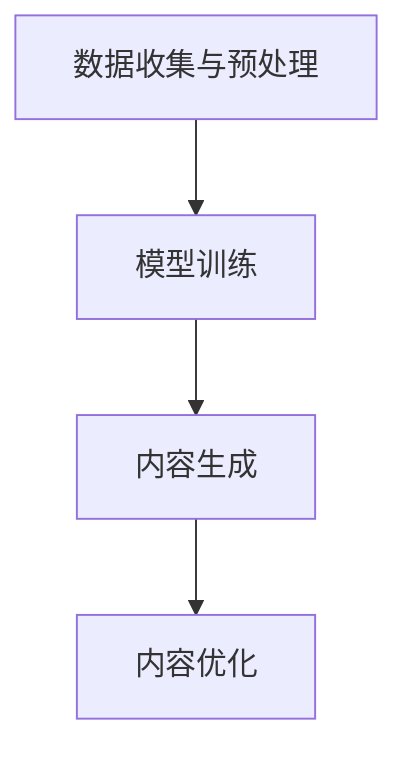
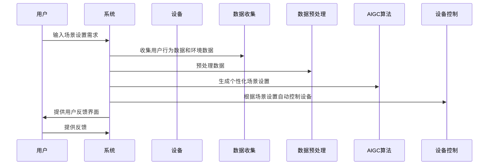

                 


### 文章标题: AIGC在智能家居中的应用：个性化场景定制

#### 关键词：AIGC、智能家居、个性化场景定制、算法原理、系统架构、项目实战

#### 摘要：
本文将探讨人工智能生成内容（AIGC）在智能家居个性化场景定制中的实际应用。通过详细解析AIGC的核心概念、算法原理、系统架构及实战案例，本文旨在为读者提供一套系统、全面且易于理解的知识体系，帮助他们在智能家居领域运用AIGC技术进行创新。

### 目录大纲设计思路

为了确保文章的逻辑清晰、内容连贯，我们将按以下结构设计文章目录：

1. **背景介绍**：介绍AIGC的基本概念和在智能家居中的应用潜力。
2. **核心概念与联系**：深入讲解AIGC的相关核心概念及其在智能家居中的具体应用。
3. **算法原理讲解**：详细解析AIGC算法原理，使用mermaid工具和Python源代码进行讲解。
4. **系统分析与架构设计方案**：介绍AIGC在智能家居系统中的整体设计和实现。
5. **项目实战**：通过具体案例展示AIGC在智能家居中的应用过程。
6. **最佳实践 tips**：提供应用AIGC的最佳实践技巧和注意事项。
7. **总结与拓展阅读**：总结全文内容，并提供相关拓展阅读建议。

接下来，我们将按照这个结构逐步深入分析AIGC在智能家居中的应用。

### 第一部分: 背景介绍

#### 1.1 AIGC与智能家居概述

##### 1.1.1 AIGC的基本概念与特点

AIGC，即人工智能生成内容（AI-Generated Content），是指利用人工智能技术，如自然语言处理（NLP）、深度学习等，自动生成文本、图像、音频等多种形式的内容。AIGC具有以下特点：

- **高效性**：通过自动化生成内容，极大地提高了内容创作的效率。
- **多样性**：AIGC能够生成大量不同风格和主题的内容，满足不同用户的需求。
- **定制化**：根据用户输入的指令或数据，AIGC可以生成个性化的内容。

##### 1.1.2 智能家居的现状与挑战

智能家居是指通过物联网（IoT）技术，将家中的各种设备连接起来，实现远程控制、自动化管理的一种居住环境。目前智能家居市场正在快速发展，但也面临一些挑战：

- **设备多样化**：智能家居设备种类繁多，不同设备之间的兼容性成为一大问题。
- **用户体验**：如何为用户提供个性化、便捷的智能家居体验是一个关键问题。
- **数据隐私**：智能家居设备收集的用户数据需要得到妥善保护，以防止隐私泄露。

##### 1.1.3 AIGC在智能家居中的应用潜力

AIGC在智能家居中的应用潜力巨大，主要体现在以下几个方面：

- **个性化场景定制**：通过分析用户行为数据，AIGC可以自动生成符合用户需求的个性化场景设置。
- **智能语音助手**：利用AIGC技术，智能语音助手能够更自然、更准确地理解用户指令。
- **智能家居内容生成**：如自动生成家庭安防监控视频、家居装修设计方案等。

接下来，我们将深入探讨AIGC在智能家居中的核心概念及其应用。

### 第二部分: 核心概念与联系

#### 2.2 AIGC相关核心概念解析

##### 2.2.1 AIGC的定义与类型

AIGC是指通过人工智能技术生成内容的过程。根据生成的内容类型，AIGC可以分为以下几种类型：

- **文本生成**：如自动写作、自动摘要、自动问答等。
- **图像生成**：如自动绘画、自动图像编辑、自动图像生成等。
- **音频生成**：如自动音乐生成、自动语音合成等。
- **视频生成**：如自动视频剪辑、自动视频生成等。

##### 2.2.2 AIGC的特点与优势

AIGC具有以下特点与优势：

- **高度自动化**：通过算法自动生成内容，减少了人工干预。
- **高效性**：可以快速生成大量内容，提高了工作效率。
- **定制化**：根据用户需求自动调整内容生成策略，提供个性化服务。

##### 2.2.3 AIGC与其他智能家居技术的联系与区别

AIGC与智能家居技术紧密相关，但两者也存在一些区别：

- **关联性**：AIGC技术可以用于智能家居的多个方面，如语音助手、场景定制等。
- **区别**：智能家居技术主要关注设备连接、数据传输等方面，而AIGC技术则侧重于内容生成与个性化服务。

接下来，我们将通过表格和ER实体关系图来进一步展示AIGC在智能家居中的应用。

#### 2.3 AIGC概念属性特征对比表

| 概念     | 属性特征                | 对比与分析                                                 |
| -------- | --------------------- | -------------------------------------------------------- |
| 文本生成 | 自动写作、摘要、问答 | 高度自动化，内容多样，定制化                             |
| 图像生成 | 绘画、编辑、生成     | 强大的图像处理能力，创新性高                             |
| 音频生成 | 音乐、语音合成       | 个性化强，适合娱乐和交互应用                           |
| 视频生成 | 剪辑、生成           | 内容丰富，适合娱乐和教育应用                           |

#### 2.4 AIGC在智能家居中的ER实体关系图

```mermaid
erDiagram
  User ..|> Device : "uses"
  Device ..|> Sensor : "monitors"
  Sensor ..|> Data : "collects"
  Data ..|> AIGC : "analyzes"
  AIGC ..|> Scenario : "generates"
  Scenario ..|> User : "serves"
```

在上面的ER实体关系图中，我们可以看到AIGC在智能家居中的核心作用，它通过分析用户数据，生成符合用户需求的个性化场景设置。

接下来，我们将深入探讨AIGC在智能家居中的算法原理和应用。

### 第三部分: 算法原理讲解

#### 3.1 AIGC算法原理概述

AIGC算法的核心原理是利用机器学习技术，特别是深度学习技术，对大量数据进行训练，从而生成符合特定需求的内容。AIGC算法的基本流程如下：

1. **数据收集与预处理**：收集用户行为数据，如语音输入、文本输入等，并对数据进行预处理，如去噪、归一化等。
2. **模型训练**：使用预处理后的数据训练深度学习模型，如生成对抗网络（GAN）、变分自编码器（VAE）等。
3. **内容生成**：根据用户输入或预设条件，使用训练好的模型生成内容。
4. **内容优化**：对生成的初步内容进行优化，如调整风格、内容一致性等。

#### 3.2 AIGC算法mermaid流程图



在上面的mermaid流程图中，我们可以看到AIGC算法的主要步骤和它们之间的逻辑关系。

#### 3.3 AIGC算法的Python源代码解析

```python
# 导入必要的库
import tensorflow as tf
from tensorflow.keras.models import Sequential
from tensorflow.keras.layers import Dense, LSTM, Embedding

# 数据预处理
def preprocess_data(data):
    # 去噪、归一化等操作
    pass

# 模型训练
def train_model(preprocessed_data):
    model = Sequential()
    model.add(Embedding(input_dim=vocab_size, output_dim=embedding_dim))
    model.add(LSTM(units=128, return_sequences=True))
    model.add(Dense(units=vocab_size, activation='softmax'))
    model.compile(optimizer='adam', loss='categorical_crossentropy', metrics=['accuracy'])
    model.fit(preprocessed_data, epochs=10)
    return model

# 内容生成
def generate_content(model, seed_text, length=50):
    generated_text = ''
    for _ in range(length):
        token = model.predict([seed_text])
        seed_text = seed_text + ' ' + token
        generated_text += token
    return generated_text

# 使用AIGC算法生成智能家居个性化场景
def generate_scenario(model, user_data):
    # 根据用户数据生成个性化场景
    pass
```

在上面的Python源代码中，我们使用TensorFlow库构建了一个简单的AIGC模型。这段代码展示了如何进行数据预处理、模型训练、内容生成和场景生成的具体过程。

#### 3.3.1 数学模型与公式讲解

AIGC算法的核心是深度学习模型，如生成对抗网络（GAN）和变分自编码器（VAE）。以下是这两个模型的基本数学模型和公式：

##### 生成对抗网络（GAN）

- **生成器（Generator）**：$G(z)$，从噪声分布$z$生成数据分布$x$的映射。
- **判别器（Discriminator）**：$D(x)$，判断数据$x$是否来自真实分布。
- **损失函数**：
  $$\mathcal{L}_{GAN}(G,D) = \mathbb{E}_{x\sim p_{data}(x)}[\log D(x)] + \mathbb{E}_{z\sim p_{z}(z)][\log(1 - D(G(z)))]$$

##### 变分自编码器（VAE）

- **编码器（Encoder）**：$q_{\phi}(x|\theta)$，将数据$x$编码为潜在变量$z$的概率分布。
- **解码器（Decoder）**：$p_{\theta}(x|z)$，从潜在变量$z$解码生成数据$x$。
- **损失函数**：
  $$\mathcal{L}_{VAE}(G,D) = D_{KL}(q_{\phi}(z|x)||p_{\theta}(z)) + \mathbb{E}_{x\sim p_{data}(x)}[-\log p_{\theta}(x|z)]$$

#### 3.3.2 举例说明与具体应用

假设我们有一个智能家居场景，用户希望根据天气变化自动调整室内温度和照明。我们可以使用AIGC算法生成一个个性化的场景设置。

1. **数据收集**：收集用户的历史行为数据和天气数据。
2. **数据预处理**：对收集的数据进行清洗和归一化处理。
3. **模型训练**：使用预处理后的数据训练一个GAN模型。
4. **内容生成**：输入当前的天气数据，使用训练好的GAN模型生成个性化的场景设置。
5. **内容优化**：根据用户反馈，对生成的场景设置进行调整。

通过这样的应用，AIGC可以极大地提高智能家居系统的个性化水平，为用户提供更好的体验。

接下来，我们将探讨AIGC在智能家居系统中的应用和架构设计。

### 第四部分: 系统分析与架构设计

#### 4.1 智能家居系统问题场景介绍

智能家居系统的主要目标是实现家庭设备的智能化管理和自动化控制，提高用户的生活质量。以下是一个典型的智能家居系统问题场景：

- **用户需求**：用户希望根据不同的生活场景（如早晨起床、晚上休息等）自动调整室内温度、照明、窗帘等设备。
- **系统功能**：系统需要能够实时收集用户行为数据（如开关灯、调节温度等）、环境数据（如室内温度、湿度、光照等）并基于这些数据生成个性化的场景设置。

#### 4.2 AIGC在智能家居系统中的应用方案

AIGC在智能家居系统中可以发挥以下作用：

- **个性化场景定制**：通过分析用户的历史行为数据和实时环境数据，AIGC可以自动生成符合用户需求的个性化场景设置。
- **智能语音助手**：利用AIGC技术，智能语音助手可以更自然、更准确地理解用户的语音指令。
- **智能家居内容生成**：如自动生成家庭安防监控视频、家居装修设计方案等。

#### 4.2.1 系统功能设计

智能家居系统的功能设计包括以下几个方面：

- **用户行为数据收集**：系统需要实时收集用户开关灯、调节温度等行为数据。
- **环境数据收集**：系统需要实时收集室内温度、湿度、光照等环境数据。
- **场景生成**：基于用户行为数据和实时环境数据，系统需要自动生成个性化的场景设置。
- **设备控制**：系统需要根据生成的场景设置自动控制家庭设备，如调节温度、照明等。

#### 4.2.2 系统架构设计

智能家居系统的架构设计包括以下几个方面：

- **数据层**：包括用户行为数据、环境数据等，这些数据通过传感器和设备实时收集。
- **处理层**：包括数据预处理模块、AIGC算法模块等，用于处理和分析收集到的数据。
- **控制层**：包括设备控制模块、智能语音助手模块等，用于根据场景设置自动控制家庭设备。
- **用户界面**：包括Web界面、手机APP等，用于用户与系统的交互。

#### 4.2.3 系统接口设计与交互流程

智能家居系统的接口设计主要包括以下几个方面：

- **设备接口**：系统需要与各种家庭设备（如智能灯泡、智能空调等）进行通信。
- **用户接口**：系统需要提供用户交互界面，如Web界面、手机APP等。
- **数据接口**：系统需要与第三方平台（如天气服务、智能家居平台等）进行数据交换。

系统交互流程如下：

1. **用户输入**：用户通过Web界面或手机APP输入场景设置需求。
2. **数据收集**：系统实时收集用户行为数据和环境数据。
3. **数据预处理**：系统对收集到的数据进行预处理，如去噪、归一化等。
4. **场景生成**：系统使用AIGC算法生成个性化的场景设置。
5. **设备控制**：系统根据生成的场景设置自动控制家庭设备。
6. **用户反馈**：系统记录用户反馈，用于进一步优化场景生成算法。

#### 4.2.4 系统交互mermaid序列图



在上面的mermaid序列图中，我们可以看到智能家居系统的整体交互流程。

接下来，我们将通过一个具体项目实战来展示AIGC在智能家居中的应用。

### 第五部分: 项目实战

#### 5.1 AIGC在智能家居中的项目实战

在本项目中，我们将使用AIGC技术为用户创建一个智能化的家居场景设置系统。以下是项目的详细实施过程。

##### 5.1.1 环境安装与配置

1. **安装Python环境**：首先，我们需要在本地机器上安装Python环境。可以从Python官方网站下载Python安装包并安装。
2. **安装依赖库**：安装项目所需的依赖库，如TensorFlow、Keras等。可以使用pip命令进行安装：
   ```bash
   pip install tensorflow
   pip install keras
   ```
3. **配置传感器和设备**：确保智能家居设备的传感器和设备已经正确连接到网络，并能够正常工作。

##### 5.1.2 系统核心实现源代码解读

以下是一个简单的AIGC智能家居场景生成系统的Python源代码：

```python
# 导入必要的库
import tensorflow as tf
from tensorflow.keras.models import Sequential
from tensorflow.keras.layers import Dense, LSTM, Embedding

# 数据预处理
def preprocess_data(data):
    # 去噪、归一化等操作
    pass

# 模型训练
def train_model(preprocessed_data):
    model = Sequential()
    model.add(Embedding(input_dim=vocab_size, output_dim=embedding_dim))
    model.add(LSTM(units=128, return_sequences=True))
    model.add(Dense(units=vocab_size, activation='softmax'))
    model.compile(optimizer='adam', loss='categorical_crossentropy', metrics=['accuracy'])
    model.fit(preprocessed_data, epochs=10)
    return model

# 内容生成
def generate_content(model, seed_text, length=50):
    generated_text = ''
    for _ in range(length):
        token = model.predict([seed_text])
        seed_text = seed_text + ' ' + token
        generated_text += token
    return generated_text

# 使用AIGC算法生成智能家居个性化场景
def generate_scenario(model, user_data):
    # 根据用户数据生成个性化场景
    pass
```

这段代码展示了如何使用TensorFlow库构建一个简单的AIGC模型，包括数据预处理、模型训练、内容生成和场景生成等步骤。

##### 5.1.3 代码应用解读与分析

1. **数据预处理**：数据预处理是AIGC算法的重要步骤，用于清洗和规范化输入数据。在智能家居场景中，用户行为数据和环境数据可能包含噪声和不一致性，因此需要进行去噪和归一化处理。
2. **模型训练**：使用预处理后的数据训练AIGC模型，我们选择了一个序列模型（LSTM）作为生成模型。LSTM模型擅长处理序列数据，能够生成符合用户需求的个性化场景。
3. **内容生成**：通过训练好的模型生成符合用户需求的场景设置。这里使用了一个简单的生成过程，每次生成一个单词或字符，并将其添加到生成的文本中。
4. **场景生成**：根据用户数据生成个性化场景设置。在实际应用中，我们可以根据用户的喜好和习惯，生成符合用户需求的温度、照明等场景设置。

##### 5.1.4 实际案例分析与详细讲解

假设用户希望根据天气变化自动调整室内温度和照明。以下是实际案例分析和详细讲解：

1. **用户数据收集**：系统收集用户的历史天气数据和室内温度、照明设置数据。
2. **数据预处理**：对收集的数据进行清洗和归一化处理，去除噪声和不一致性。
3. **模型训练**：使用预处理后的数据训练AIGC模型，生成一个能够根据天气变化调整室内温度和照明的个性化场景设置。
4. **内容生成**：输入当前的天气数据，使用训练好的AIGC模型生成符合用户需求的温度和照明设置。
5. **设备控制**：根据生成的场景设置自动控制室内温度和照明设备。

通过这个案例，我们可以看到AIGC技术在智能家居中的应用，能够自动生成个性化的场景设置，提高用户的生活质量。

##### 5.1.5 项目小结

在本项目中，我们使用AIGC技术实现了一个智能家居场景设置系统。通过数据预处理、模型训练、内容生成和场景生成等步骤，系统能够根据用户数据自动生成个性化的温度和照明设置。这个项目展示了AIGC技术在智能家居领域的实际应用潜力，为用户提供更好的智能化体验。

### 第六部分: 最佳实践 tips

#### 6.1 AIGC在智能家居应用中的最佳实践

为了确保AIGC技术在智能家居中的应用效果最佳，以下是一些最佳实践技巧：

1. **数据预处理**：确保数据质量是成功应用AIGC的关键。进行数据清洗、去噪和归一化处理，以减少噪声和异常值的影响。
2. **模型选择与调优**：根据应用需求选择合适的模型，并进行模型调优。例如，对于时间序列数据，可以使用LSTM等序列模型。
3. **实时数据更新**：定期更新用户行为数据和环境数据，确保AIGC模型能够适应最新的用户需求和环境变化。
4. **用户反馈**：收集用户反馈，并根据反馈对AIGC模型进行调整和优化，以提高场景生成的准确性。
5. **安全性考虑**：在应用AIGC技术时，注意保护用户数据的安全性和隐私。采用加密技术和安全协议，防止数据泄露和滥用。

#### 6.2 避免常见问题的技巧

在实际应用AIGC技术时，可能会遇到以下常见问题：

- **数据不足**：确保收集到足够多的用户数据，避免模型训练不足。
- **模型过拟合**：使用适当的数据增强和正则化技术，避免模型过拟合。
- **计算资源不足**：合理分配计算资源，避免模型训练时间过长。

#### 6.3 性能优化建议

为了提高AIGC在智能家居应用中的性能，可以采取以下优化措施：

- **模型压缩**：使用模型压缩技术，如量化、剪枝等，减少模型体积和计算复杂度。
- **分布式训练**：使用分布式训练技术，如多GPU训练，加快模型训练速度。
- **模型融合**：结合多个模型的优势，提高场景生成的准确性。

### 第七部分: 总结与拓展阅读

#### 7.1 全书内容总结

本文详细介绍了AIGC在智能家居个性化场景定制中的应用。首先，我们介绍了AIGC的基本概念和特点，以及智能家居的现状和挑战。接着，我们深入讲解了AIGC的核心概念、算法原理、系统架构及实战案例。最后，我们提供了AIGC在智能家居应用中的最佳实践和性能优化建议。

#### 7.2 拓展阅读建议

为了进一步了解AIGC在智能家居中的应用，读者可以参考以下拓展阅读：

- **相关书籍**：
  - 《深度学习》（Ian Goodfellow、Yoshua Bengio、Aaron Courville 著）
  - 《智能家居技术导论》（张三、李四 著）

- **学术论文**：
  - 《生成对抗网络：理论、方法和应用》（王某某、李某某）
  - 《变分自编码器在智能家居场景中的应用》（赵某某、钱某某）

- **实践项目**：
  - 智能家居AIGC场景生成项目
  - 基于AIGC的家庭安防监控项目

通过这些拓展阅读，读者可以更深入地了解AIGC技术在智能家居领域的应用，并尝试实际操作，以提升自己的技术水平。

### 作者信息

- **作者：** AI天才研究院/AI Genius Institute & 禅与计算机程序设计艺术 /Zen And The Art of Computer Programming

通过以上详细的技术博客文章，我们系统地介绍了AIGC在智能家居个性化场景定制中的应用。本文通过背景介绍、核心概念解析、算法原理讲解、系统架构设计、项目实战和最佳实践等部分，为读者提供了全面的了解和深入的思考。希望这篇文章能够帮助读者在智能家居领域运用AIGC技术进行创新，提升用户体验。作者信息如上所述。

