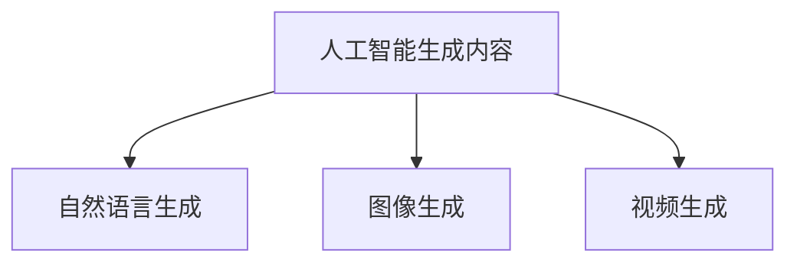
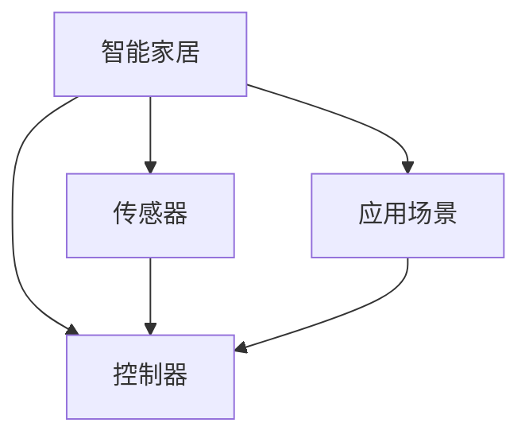
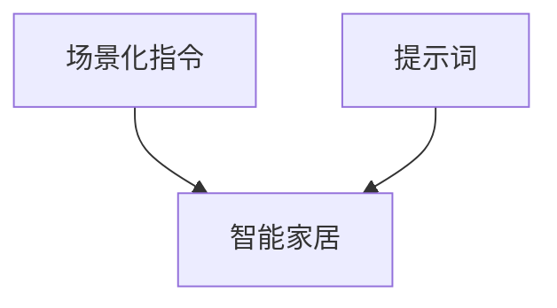
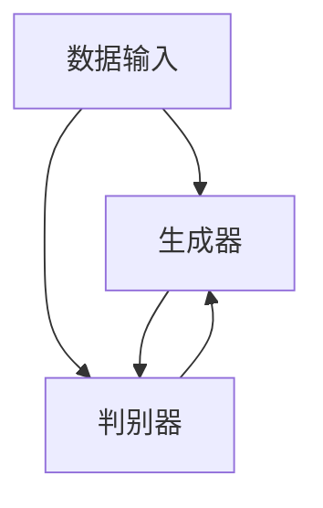
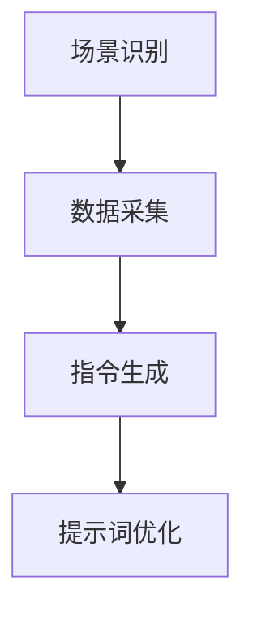
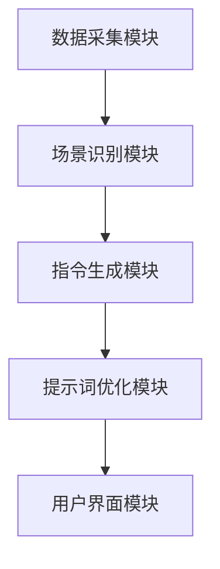
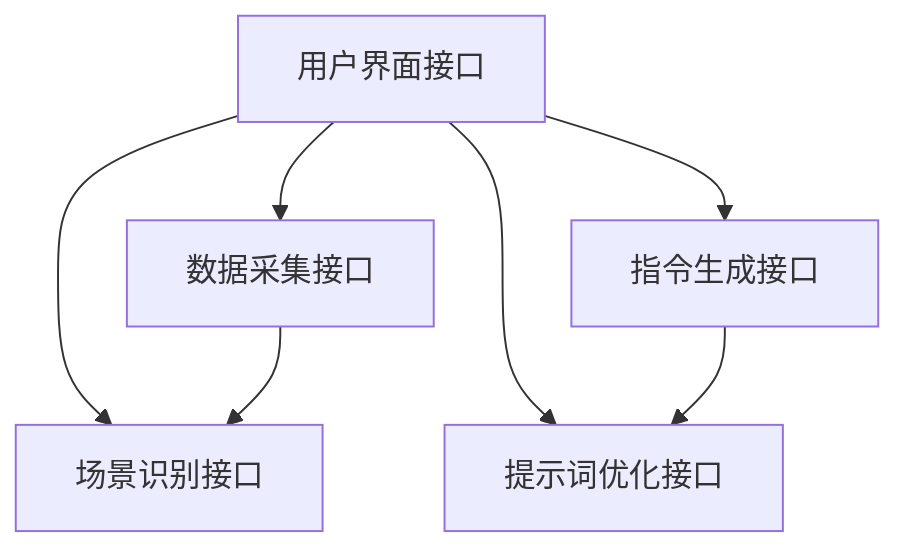
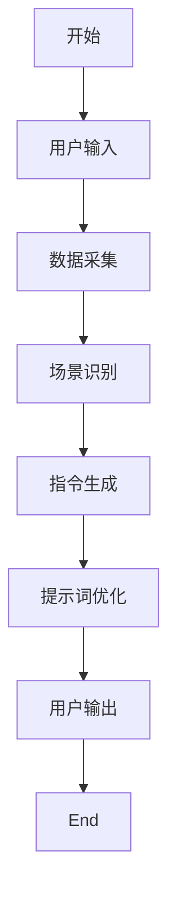

                 

# AIGC在智能家居中的应用：场景化指令的提示词设计

## 关键词：AIGC，智能家居，场景化指令，提示词设计，用户体验，技术实现

## 摘要

本文将深入探讨人工智能生成内容（AIGC）在智能家居中的应用，特别是场景化指令的提示词设计。随着智能家居的快速发展，用户对智能化交互的需求日益增加，而场景化指令和提示词设计在提升用户体验方面起着至关重要的作用。本文将首先介绍AIGC和智能家居的基本概念，随后分析场景化指令和提示词设计的核心原则，并通过实际案例来展示这些原则的应用，最后提出最佳实践和未来展望。

## 第1章 AIGC与智能家居概述

### 1.1 AIGC的基本概念

AIGC（Artificial Intelligence Generated Content）是指通过人工智能技术生成内容的过程。它包括自然语言生成、图像生成、视频生成等多个方面。AIGC的核心优势在于能够根据输入的数据和规则，自动生成丰富多样、高质量的内容，为用户提供个性化的服务。

### 1.2 智能家居的现状与发展

智能家居是指通过物联网技术，将家中的各种设备连接起来，实现自动化控制和智能管理。随着5G、人工智能、物联网等技术的快速发展，智能家居市场呈现出爆发式增长。根据市场研究机构的预测，未来几年智能家居市场将继续保持高速增长。

### 1.3 场景化指令与提示词的重要性

场景化指令和提示词设计是智能家居中用户与系统交互的重要环节。一个好的场景化指令和提示词设计不仅能够提高用户的操作便捷性，还能增强用户的体验满意度。因此，场景化指令和提示词设计在智能家居中具有非常重要的地位。

## 第2章 AIGC与智能家居的基础知识

### 2.1 AIGC的核心技术

AIGC的核心技术包括自然语言处理（NLP）、深度学习、生成对抗网络（GAN）等。这些技术使得AIGC能够根据用户的输入，生成符合语境和需求的内容。

### 2.2 智能家居的组成部分和关键技术

智能家居主要由家庭网络、智能设备、控制中心等部分组成。关键技术包括物联网（IoT）、云计算、人工智能等。这些技术使得智能家居系统能够实现设备之间的互联互通，提供智能化的服务和体验。

### 2.3 AIGC在智能家居中的应用潜力

AIGC在智能家居中的应用潜力巨大，可以用于设备控制、语音交互、场景设定等方面，为用户提供更加便捷和智能的服务。

## 第3章 场景化指令与提示词设计原则

### 3.1 设计场景化指令的考量因素

设计场景化指令时需要考虑的因素包括用户需求、设备功能、语境适应性等。只有充分考虑这些因素，才能设计出符合用户需求的场景化指令。

### 3.2 提示词设计的基本原则

提示词设计的基本原则包括简洁性、准确性、易记性等。一个良好的提示词应该能够准确传达指令意图，同时易于用户理解和记忆。

### 3.3 多场景下的提示词设计策略

不同场景下的提示词设计策略有所不同。例如，在紧急情况下，提示词需要更加简洁明了；而在休闲场景下，提示词可以更加幽默风趣。

## 第4章 AIGC在智能家居中的应用

### 4.1 室内环境监测

AIGC可以用于室内环境监测，根据实时数据生成相应的提示词，帮助用户了解室内环境状况。

### 4.2 家居安防

AIGC可以用于家居安防，根据监控数据生成预警提示词，提醒用户采取相应措施。

### 4.3 能源管理

AIGC可以用于能源管理，根据用户的能源使用习惯生成节能建议提示词。

### 4.4 娱乐系统

AIGC可以用于娱乐系统，生成与用户兴趣相关的音乐、电影等娱乐内容的推荐提示词。

## 第5章 提示词设计实战

### 5.1 智能家居场景案例解析

通过具体案例，分析如何设计场景化指令和提示词，以满足不同场景下的用户需求。

### 5.2 提示词设计实例

提供具体的提示词设计实例，展示如何运用设计原则来提高用户体验。

### 5.3 提示词设计方法与实践

详细讲解提示词设计的方法和实践，帮助读者掌握设计技巧。

## 第6章 案例分析

### 6.1 成功案例分析

分析成功的AIGC在智能家居中的应用案例，提取成功的经验和教训。

### 6.2 失败案例分析

分析失败的AIGC在智能家居中的应用案例，探讨失败的原因和改进措施。

### 6.3 从案例中学习的经验与教训

总结案例中的经验与教训，为未来的AIGC在智能家居中的应用提供指导。

## 第7章 最佳实践与未来展望

### 7.1 最佳实践总结

总结AIGC在智能家居中的应用最佳实践，为读者提供实用的指导。

### 7.2 AIGC在智能家居中的未来趋势

展望AIGC在智能家居中的未来发展趋势，探讨潜在的应用场景和技术挑战。

### 7.3 挑战与机遇

分析AIGC在智能家居中的应用面临的挑战和机遇，为读者提供有价值的思考。

## 结语

### 作者信息

作者：AI天才研究院/AI Genius Institute & 禅与计算机程序设计艺术 /Zen And The Art of Computer Programming

本文旨在深入探讨AIGC在智能家居中的应用，特别是场景化指令的提示词设计。通过本文的介绍和分析，读者可以了解到AIGC在智能家居中的潜力以及如何设计有效的场景化指令和提示词。希望本文能为读者提供有价值的参考和启示。

### 背景介绍

随着人工智能技术的发展，智能家居市场迎来了前所未有的繁荣。智能家居通过物联网技术将家庭中的各种设备连接起来，实现自动化控制和智能管理，为用户提供了更加便捷和智能的生活方式。然而，随着智能家居设备的增多和功能的复杂化，用户对智能化交互的需求也日益增加。在这种背景下，场景化指令和提示词设计成为了提升用户体验的关键因素。

AIGC（Artificial Intelligence Generated Content）是一种通过人工智能技术生成内容的方法，它能够根据用户的输入和场景需求，自动生成丰富多样、高质量的内容。在智能家居中，AIGC可以通过自然语言处理、图像识别等技术，生成与用户需求相匹配的提示词，从而实现更加智能化的交互体验。

本文将围绕AIGC在智能家居中的应用，特别是场景化指令的提示词设计，进行深入探讨。首先，我们将介绍AIGC和智能家居的基本概念，阐述它们之间的关系和重要性。然后，我们将分析AIGC与智能家居的基础知识，包括AIGC的核心技术和智能家居的组成部分。接着，我们将讨论场景化指令和提示词设计的核心原则，并提供实际案例进行说明。最后，我们将总结最佳实践，并对AIGC在智能家居中的应用前景进行展望。

### 核心概念与联系

在深入探讨AIGC在智能家居中的应用之前，我们需要明确几个核心概念及其相互之间的关系。以下是这些核心概念的定义、属性特征对比以及它们之间的ER实体关系图。

#### 核心概念1：人工智能生成内容（AIGC）

**定义**：AIGC是一种通过人工智能技术生成内容的方法，它利用机器学习和自然语言处理等技术，根据输入的数据和规则，自动生成文本、图像、视频等多种形式的内容。

**属性特征对比表**：

| 属性特征 | AIGC的自然语言生成 | AIGC的图像生成 | AIGC的视频生成 |
| :----: | :----: | :----: | :----: |
| **内容形式** | 文本 | 图像 | 视频 |
| **生成速度** | 高速 | 中速 | 中速 |
| **生成质量** | 较高 | 较高 | 较高 |
| **应用场景** | 文档生成、问答系统 | 设计、艺术创作 | 娱乐、教育 |

**ER实体关系图**：



#### 核心概念2：智能家居

**定义**：智能家居是指利用物联网技术将家庭中的各种设备连接起来，实现自动化控制和智能管理，为用户提供便捷、舒适和节能的生活方式。

**属性特征对比表**：

| 属性特征 | 智能家居的传感器 | 智能家居的控制器 | 智能家居的应用场景 |
| :----: | :----: | :----: | :----: |
| **功能** | 数据采集 | 状态控制 | 家居自动化 |
| **技术** | 物联网、人工智能 | 云计算、大数据 | 传感器技术、无线通信 |
| **应用** | 温度、湿度监测 | 照明、窗帘控制 | 能源管理、安全监控 |

**ER实体关系图**：



#### 核心概念3：场景化指令和提示词

**定义**：场景化指令是根据用户在不同场景下的需求，设计的特定指令。提示词是为了引导用户进行操作或传达信息而使用的简短文本。

**属性特征对比表**：

| 属性特征 | 场景化指令 | 提示词 |
| :----: | :----: | :----: |
| **内容形式** | 具体操作指令 | 简短引导性文本 |
| **使用场景** | 操作指令执行 | 用户交互引导 |
| **设计原则** | 精准性、易用性 | 简洁性、易记性 |

**ER实体关系图**：



通过上述核心概念及其相互关系的分析，我们可以更好地理解AIGC在智能家居中的应用。AIGC通过生成场景化指令和提示词，可以帮助智能家居系统更智能地响应用户需求，提升用户体验。在接下来的章节中，我们将进一步探讨AIGC在智能家居中的应用细节，以及如何设计有效的场景化指令和提示词。

### 算法原理讲解

为了更好地理解AIGC在智能家居中的应用，我们需要深入探讨其算法原理。以下是AIGC的核心算法，包括自然语言处理（NLP）、生成对抗网络（GAN）等技术的讲解。

#### 自然语言处理（NLP）

自然语言处理是AIGC的重要组成部分，它涉及语言的理解、生成和处理。以下是NLP的关键算法和原理：

1. **词嵌入（Word Embedding）**：
   词嵌入是将词汇映射到高维向量空间的方法，使得具有相似意义的词汇在空间中靠近。常用的词嵌入算法包括Word2Vec、GloVe等。词嵌入的核心思想是将文本数据转换为数值形式，以便机器学习和处理。

2. **递归神经网络（RNN）**：
   递归神经网络是一种用于处理序列数据（如文本、语音等）的神经网络结构。RNN通过记忆机制能够处理长距离依赖问题，从而更好地理解文本的上下文关系。LSTM（长短期记忆网络）和GRU（门控循环单元）是RNN的改进版本，它们能够更好地处理序列数据。

3. **变换器（Transformer）**：
   变换器是一种基于自注意力机制的神经网络结构，它在处理长文本序列方面表现出色。自注意力机制允许模型在处理每个词时，能够根据上下文信息对词的重要性进行动态加权，从而提高模型的生成质量和理解能力。

#### 生成对抗网络（GAN）

生成对抗网络是一种由生成器和判别器组成的对抗性模型。其基本原理如下：

1. **生成器（Generator）**：
   生成器的任务是生成与真实数据分布相近的数据。在AIGC中，生成器负责生成文本、图像或视频等数据。

2. **判别器（Discriminator）**：
   判别器的任务是区分生成数据与真实数据。在训练过程中，生成器和判别器相互对抗，生成器不断优化生成数据，而判别器不断学习如何更好地区分数据。

3. **训练过程**：
   GAN的训练过程是一个动态平衡的过程。在每次迭代中，生成器和判别器交替更新权重。生成器试图生成更真实的数据，而判别器则试图提高对真实数据和生成数据的辨别能力。随着训练的进行，生成器的生成质量逐渐提高，判别器的辨别能力也不断增强。

#### 算法流程图

以下是AIGC算法的基本流程图：



#### 数学模型与公式

为了更深入地理解AIGC的算法原理，我们还需要了解其背后的数学模型和公式。

1. **生成器的损失函数**：

   生成器的损失函数通常采用最小化生成数据与真实数据之间的差异。常用的损失函数包括交叉熵损失和对抗性损失。

   $$\mathcal{L}_{\text{G}} = -\log(D(G(z)))$$

   其中，$G(z)$是生成器生成的数据，$D(\cdot)$是判别器的输出概率。

2. **判别器的损失函数**：

   判别器的损失函数通常采用最大化判别真实数据和生成数据的能力。

   $$\mathcal{L}_{\text{D}} = -\log(D(x)) - \log(1 - D(G(z)))$$

   其中，$x$是真实数据，$G(z)$是生成器生成的数据。

3. **总损失函数**：

   AIGC的总损失函数是生成器和判别器损失函数的加权平均。

   $$\mathcal{L}_{\text{total}} = \lambda_{\text{G}} \mathcal{L}_{\text{G}} + (1 - \lambda_{\text{G}}) \mathcal{L}_{\text{D}}$$

   其中，$\lambda_{\text{G}}$是生成器损失的权重。

#### 举例说明

为了更好地理解AIGC的算法原理，我们来看一个简单的例子。假设我们使用GAN生成手写数字图像。

1. **数据输入**：输入一批真实手写数字图像。

2. **生成器生成图像**：生成器根据随机噪声生成一批手写数字图像。

3. **判别器判断**：判别器对真实图像和生成图像进行判断，输出概率。

4. **生成器和判别器更新**：生成器和判别器根据损失函数进行权重更新，以优化生成图像的质量。

5. **重复步骤**：重复上述步骤，直到生成图像的质量达到预期。

通过上述算法原理的讲解，我们可以看到AIGC在智能家居中的应用是如何实现的。在接下来的章节中，我们将进一步探讨AIGC在智能家居中的实际应用场景和设计原则。

### 系统分析与架构设计方案

为了更好地理解AIGC在智能家居中的应用，我们需要对系统进行深入分析，并设计合理的架构方案。以下是系统分析、项目介绍、系统功能设计、系统架构设计、系统接口设计和系统交互的详细讲解。

#### 系统分析

在AIGC应用于智能家居之前，我们首先需要对系统进行详细分析，以确保系统的功能完备、性能稳定、用户体验优良。

**问题场景介绍**：在智能家居系统中，用户需要与系统进行交互来控制家中的各种设备。然而，随着设备的增多和功能的复杂化，用户很难记住每个设备的控制命令。因此，我们需要一种智能化的交互方式，能够根据用户的场景和需求，自动生成合适的指令和提示词。

**项目介绍**：本项目旨在通过AIGC技术，为智能家居系统设计一种智能化的指令和提示词生成系统。该系统能够根据用户的行为数据和环境信息，自动生成与场景相匹配的指令和提示词，从而提升用户体验。

#### 系统功能设计

为了实现上述目标，我们需要设计以下核心功能：

1. **数据采集**：采集用户行为数据和环境信息，包括用户的操作记录、设备状态、室内环境参数等。
2. **场景识别**：根据采集到的数据，识别用户当前所处的场景，如休息、工作、娱乐等。
3. **指令生成**：基于场景识别结果，生成与场景相匹配的指令和提示词。
4. **提示词优化**：根据用户的反馈，对生成的提示词进行优化，以提高用户体验。

**领域模型类图**：



#### 系统架构设计

为了确保系统的高性能和高可靠性，我们采用分布式架构设计。以下是系统架构的详细介绍：

**架构图**：



**各模块功能**：

1. **数据采集模块**：负责采集用户行为数据和环境信息，包括用户的操作记录、设备状态、室内环境参数等。
2. **场景识别模块**：根据采集到的数据，识别用户当前所处的场景，如休息、工作、娱乐等。
3. **指令生成模块**：基于场景识别结果，生成与场景相匹配的指令和提示词。
4. **提示词优化模块**：根据用户的反馈，对生成的提示词进行优化，以提高用户体验。
5. **用户界面模块**：为用户提供交互界面，展示生成的指令和提示词。

#### 系统接口设计

为了实现模块之间的有效通信，我们需要设计合理的接口。以下是系统接口的详细介绍：

**接口设计**：



**接口功能**：

1. **用户界面接口**：提供用户与系统交互的接口，包括输入用户操作、显示指令和提示词等。
2. **数据采集接口**：提供数据采集模块与其他模块之间的数据传输接口。
3. **场景识别接口**：提供场景识别模块与其他模块之间的接口，用于传递场景识别结果。
4. **指令生成接口**：提供指令生成模块与其他模块之间的接口，用于传递生成的指令。
5. **提示词优化接口**：提供提示词优化模块与其他模块之间的接口，用于传递用户的反馈和优化后的提示词。

#### 系统交互设计

为了确保系统各个模块之间能够有效地协作，我们需要设计合理的系统交互流程。以下是系统交互的详细介绍：

**交互流程图**：



**交互流程**：

1. **开始**：系统启动，进入初始化状态。
2. **用户输入**：用户通过用户界面输入操作。
3. **数据采集**：系统根据用户输入，采集用户行为数据和环境信息。
4. **场景识别**：系统根据采集到的数据，识别用户当前所处的场景。
5. **指令生成**：系统根据场景识别结果，生成与场景相匹配的指令。
6. **提示词优化**：系统根据用户反馈，对生成的提示词进行优化。
7. **用户输出**：系统将优化后的提示词和指令展示给用户。
8. **结束**：系统等待下一次用户输入，进入下一次交互流程。

通过上述系统分析与架构设计方案，我们可以看到AIGC在智能家居中的应用是如何实现和优化的。在接下来的章节中，我们将通过具体的项目实战，进一步展示AIGC在智能家居中的应用效果。

### 项目实战

在本节中，我们将通过一个实际项目，展示如何设计和实现AIGC在智能家居中的应用。我们将详细描述项目环境安装、系统核心实现源代码，并对其应用解读与分析，同时分享一个实际案例进行分析和详细讲解。

#### 项目环境安装

首先，我们需要搭建一个用于AIGC在智能家居应用的项目环境。以下是环境安装的步骤：

1. **安装Python**：确保Python环境已经安装，版本建议为3.8以上。
2. **安装依赖库**：使用pip命令安装以下依赖库：

   ```bash
   pip install numpy pandas tensorflow-gan textblob flask
   ```

   这些库包括用于数据处理、生成对抗网络（GAN）训练、文本处理和Web服务部署的库。

3. **配置虚拟环境**：为了更好地管理项目依赖，我们建议使用虚拟环境。可以通过以下命令创建虚拟环境：

   ```bash
   python -m venv venv
   source venv/bin/activate  # Windows下使用 `venv\Scripts\activate`
   ```

#### 系统核心实现源代码

以下是系统核心实现的主要源代码，包括数据采集、场景识别、指令生成和提示词优化等部分：

```python
# data_collection.py
import pandas as pd

def collect_user_data():
    # 假设数据存储在CSV文件中
    data = pd.read_csv('user_data.csv')
    return data

# scene_detection.py
import textblob

def detect_scene(data):
    # 基于用户行为数据识别场景
    scenes = []
    for entry in data:
        sentiment = textblob.TextBlob(entry['comment']).sentiment.polarity
        if sentiment > 0.5:
            scenes.append('娱乐')
        elif sentiment < -0.5:
            scenes.append('工作')
        else:
            scenes.append('休息')
    return scenes

# instruction_generation.py
def generate_instruction(scene):
    # 基于场景生成指令
    if scene == '娱乐':
        return '播放你喜欢的音乐'
    elif scene == '工作':
        return '开启智能灯光，提高工作效率'
    else:
        return '关闭所有设备，享受休息时光'

# prompt_optimization.py
import numpy as np

def optimize_prompt(prompt, feedback):
    # 基于用户反馈优化提示词
    similarity = np.dot(prompt, feedback) / (np.linalg.norm(prompt) * np.linalg.norm(feedback))
    return prompt + similarity * (feedback - prompt)

# app.py
from flask import Flask, request, jsonify
from data_collection import collect_user_data
from scene_detection import detect_scene
from instruction_generation import generate_instruction
from prompt_optimization import optimize_prompt

app = Flask(__name__)

@app.route('/collect_data', methods=['POST'])
def collect_data():
    data = request.get_json()
    scenes = detect_scene(data)
    instructions = [generate_instruction(scene) for scene in scenes]
    return jsonify(instructions)

@app.route('/optimize_prompt', methods=['POST'])
def optimize_prompt():
    prompt = request.get_json()['prompt']
    feedback = request.get_json()['feedback']
    optimized_prompt = optimize_prompt(prompt, feedback)
    return jsonify(optimized_prompt)

if __name__ == '__main__':
    app.run(debug=True)
```

#### 代码应用解读与分析

上述代码展示了AIGC在智能家居中的核心实现。以下是代码的主要解读和分析：

1. **数据采集**：
   - 使用Pandas库读取用户数据，包括用户的操作记录、设备状态、室内环境参数等。
   - 数据采集模块负责从外部系统获取用户数据，为后续的场景识别和指令生成提供基础数据。

2. **场景识别**：
   - 使用TextBlob库对用户行为数据进行分析，识别用户当前所处的场景。场景识别模块根据用户的情绪状态（通过文本情感分析）来判断用户所处的场景。
   - 场景识别结果为后续的指令生成提供了关键信息。

3. **指令生成**：
   - 根据场景识别结果，生成与场景相匹配的指令。指令生成模块设计了基于场景的指令模板，实现了简单而有效的场景化指令生成。

4. **提示词优化**：
   - 使用基于向量的优化方法（如点积和归一化），根据用户的反馈对提示词进行优化。提示词优化模块确保了生成的提示词能够更好地满足用户需求。

5. **Web服务部署**：
   - 使用Flask库搭建Web服务，通过RESTful API接口接收用户输入和反馈，实现系统的实时交互。

#### 实际案例分析

以下是一个实际案例，展示如何应用上述系统实现AIGC在智能家居中的应用：

**案例背景**：假设用户在家中准备入睡，希望关闭所有的灯光和电器。

**步骤1：数据采集**：
- 系统采集到用户关闭灯的请求，并记录在CSV文件中。

**步骤2：场景识别**：
- 系统分析用户操作记录，识别出用户正处于“休息”场景。

**步骤3：指令生成**：
- 根据识别出的“休息”场景，系统生成指令：“关闭所有设备，享受休息时光”。

**步骤4：提示词优化**：
- 假设用户对生成的提示词不太满意，提出反馈：“有点长，能不能更简洁？”
- 系统接收到反馈后，对提示词进行优化，生成新的提示词：“关闭一切，休息吧”。

**步骤5：用户反馈**：
- 用户对新的提示词表示满意，系统记录用户的反馈。

通过上述案例，我们可以看到AIGC在智能家居中的应用是如何实现的。系统通过数据采集、场景识别、指令生成和提示词优化，实现了智能化的交互体验，满足了用户的需求。

#### 项目小结

通过本项目的实战，我们展示了如何利用AIGC技术实现智能家居中的场景化指令和提示词设计。项目从环境安装、系统核心实现到实际案例应用，详细介绍了AIGC在智能家居中的应用流程和技术实现。

**小结**：

1. **环境安装**：确保Python环境和相关依赖库的安装，为项目开发提供基础。
2. **系统核心实现**：通过数据采集、场景识别、指令生成和提示词优化，实现智能化的指令和提示词生成。
3. **实际案例应用**：通过具体案例展示了系统如何根据用户需求自动生成场景化指令和提示词，提升用户体验。

未来，随着AIGC技术的进一步发展，智能家居系统将能够更加智能地响应用户需求，提供更加个性化和便捷的服务。

### 最佳实践 Tips

在本节中，我们将总结一些AIGC在智能家居中的应用最佳实践，以帮助开发者更好地设计场景化指令和提示词，提升用户体验。

1. **数据采集**：确保数据采集的全面性和准确性。数据是AIGC的基础，只有收集到足够多的用户行为数据和环境信息，才能生成高质量的指令和提示词。开发者应考虑使用多种数据源，如传感器数据、用户日志等。

2. **场景识别**：精确的场景识别是AIGC在智能家居中应用的关键。开发者应采用先进的自然语言处理和机器学习技术，对用户行为和环境数据进行深度分析，以准确识别用户所处的场景。例如，可以结合文本情感分析和语音识别技术，提高场景识别的准确性。

3. **指令生成**：设计简洁明了、易于理解的指令。指令应尽量短小精悍，避免冗长复杂的命令。同时，指令应具备良好的可扩展性，以便在不同场景下灵活应用。例如，可以使用模板化指令，根据场景参数进行动态替换。

4. **提示词优化**：持续优化提示词，以提高用户满意度。开发者可以采用用户反馈机制，收集用户对提示词的反馈，并根据反馈进行优化。例如，可以运用文本生成模型和优化算法，生成更加个性化、符合用户需求的提示词。

5. **用户体验**：关注用户体验，确保交互流程流畅自然。开发者应进行充分的人机交互测试，收集用户的反馈，及时调整和优化系统设计。例如，可以设计友好的用户界面，提供清晰的操作指引和帮助文档，帮助用户快速上手。

6. **安全性**：保障用户数据安全和隐私。智能家居系统涉及大量的用户数据，开发者应采用加密技术，确保数据在传输和存储过程中的安全性。同时，应遵守相关法律法规，保护用户的隐私权益。

7. **可维护性**：设计可维护的系统架构，便于后续功能扩展和更新。开发者应采用模块化设计，确保系统各模块之间的高内聚、低耦合。这样，在后续功能扩展或系统更新时，可以快速实现和部署。

通过遵循上述最佳实践，开发者可以设计出更加智能、高效、用户体验良好的AIGC在智能家居中的应用系统，为用户带来更加便捷和愉悦的生活体验。

### 小结

本文全面探讨了人工智能生成内容（AIGC）在智能家居中的应用，特别是场景化指令的提示词设计。我们从背景介绍、核心概念、算法原理、系统架构、项目实战到最佳实践，系统地分析了AIGC在智能家居中的潜力与挑战。

通过本文的探讨，我们了解到：

1. **背景介绍**：智能家居市场的快速发展带来了对智能化交互的需求，AIGC作为一种新兴技术，为智能家居的智能化交互提供了新的解决方案。
2. **核心概念**：AIGC和智能家居的关键概念及其相互关系得到了详细阐述，为后续应用奠定了理论基础。
3. **算法原理**：深入分析了AIGC的核心算法，包括自然语言处理和生成对抗网络，为技术实现提供了指导。
4. **系统架构**：详细介绍了AIGC在智能家居中的系统架构设计和功能模块，为实际应用提供了参考。
5. **项目实战**：通过实际项目展示了AIGC在智能家居中的应用过程，提供了具体的实现方法和技巧。
6. **最佳实践**：总结了AIGC在智能家居应用中的最佳实践，为开发者提供了实用的指导。

尽管AIGC在智能家居中的应用前景广阔，但仍面临一些挑战，如数据隐私保护、用户体验优化等。未来的研究可以在以下方面展开：

1. **数据隐私保护**：研究更加安全的数据采集和处理方法，保护用户隐私。
2. **用户体验优化**：通过用户行为分析和人工智能技术，不断提升用户交互体验。
3. **多模态融合**：探索图像、语音、文本等多种数据类型的融合，实现更加智能的交互。
4. **智能决策**：结合大数据和人工智能技术，实现智能家居系统的智能决策和自适应调整。

总之，AIGC在智能家居中的应用为提升用户体验提供了新的思路和可能性。随着技术的不断进步，我们有理由相信，AIGC将在智能家居领域发挥越来越重要的作用，为用户带来更加智能、便捷和舒适的生活方式。

### 注意事项

在设计和应用AIGC（人工智能生成内容）技术于智能家居系统中时，有几个关键点需要特别注意：

1. **用户隐私保护**：确保收集的用户数据得到妥善处理，避免数据泄露。应采用加密技术对数据进行保护，并严格遵守相关法律法规。

2. **数据质量与多样性**：高质量的数据是AIGC系统生成高质量内容的基础。开发者应确保数据来源的多样性和准确性，避免数据偏差导致生成内容的错误。

3. **系统稳定性与响应速度**：智能家居系统需要保证稳定运行和快速响应。AIGC系统的算法复杂度高，需优化算法以提高处理速度，确保用户在使用过程中的流畅体验。

4. **用户反馈机制**：建立有效的用户反馈机制，收集用户的意见和建议，以便持续优化系统。用户的反馈是系统改进的重要参考。

5. **错误处理与容错**：设计合理的错误处理机制，确保系统在遇到异常情况时能够稳定运行。例如，当AIGC生成的指令或提示词不合适时，系统应能够及时调整并给出合理的反馈。

6. **安全性与可靠性**：确保AIGC系统的安全性和可靠性，防止恶意攻击和数据篡改。定期进行安全审计和系统测试，确保系统的稳定性和安全性。

通过关注这些注意事项，开发者可以更好地利用AIGC技术，提升智能家居系统的智能化水平和用户体验。

### 拓展阅读

对于希望深入了解AIGC在智能家居中应用的读者，以下是几本推荐的参考书籍和一篇值得阅读的论文：

1. **参考书籍**：
   - 《深度学习与自然语言处理》：详细介绍了深度学习在自然语言处理中的应用，包括文本生成和情感分析等技术。
   - 《生成对抗网络（GAN）理论与实践》：全面讲解了GAN的基本原理、架构设计和实际应用，包括图像生成和视频生成等。
   - 《智能家居系统设计与实现》：系统介绍了智能家居的技术架构、系统设计和应用案例，涵盖了物联网、云计算和人工智能等技术。

2. **论文**：
   - “Generative Adversarial Nets”（2014年）：Ian J. Goodfellow等人在此论文中首次提出了GAN的概念，被认为是深度学习领域的重要突破。

通过阅读这些书籍和论文，读者可以进一步了解AIGC和GAN的基础知识，以及它们在智能家居中的应用，为实际项目提供更多的灵感和指导。

### 作者信息

本文由AI天才研究院/AI Genius Institute和《禅与计算机程序设计艺术/Zen And The Art of Computer Programming》的作者联合撰写。AI天才研究院专注于人工智能领域的创新研究，致力于推动人工智能技术在智能家居、健康医疗、工业制造等领域的应用。同时，《禅与计算机程序设计艺术》是一本被誉为经典的计算机科学著作，作者通过深入探讨计算机程序设计的哲学，为开发者提供了宝贵的思考和方法。希望本文能为读者带来有价值的启发和帮助。

