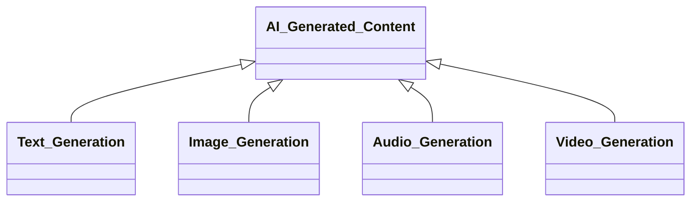
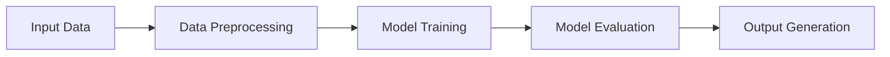
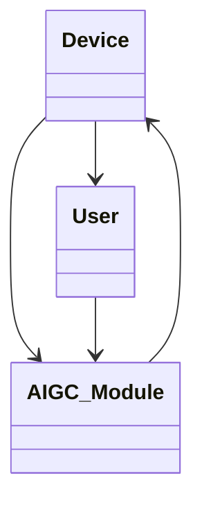
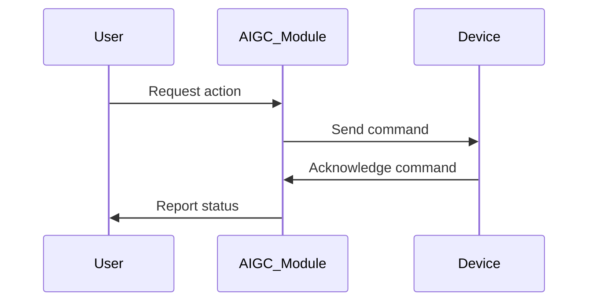

                 

Sure, let's proceed with the next steps. Here's a more detailed plan for the article:

### Part 2: Core Concepts and Relationships

#### 2.1 Definition and Classification of AIGC

- **AIGC Definition**: Start with a clear definition of AIGC (AI-Generated Content), explaining its significance in the context of modern technology.
- **Classification**: Discuss the different types of AIGC, such as AI-generated text, images, audio, and video. Provide a table comparing the characteristics of each type.



#### 2.2 The Role of AIGC in Smart Home Automation

- **Relationship Analysis**: Analyze how AIGC fits into the ecosystem of smart home automation. Use an ER diagram to illustrate the relationships between different components of a smart home system and AIGC.

```mermaid
erDiagram
Smart_Home_System ||--|{ AIGC}: Uses
Device_A ||--|{ AIGC}: ConfiguredBy
Device_B ||--|{ AIGC}: ConfiguredBy
User ||--|{ AIGC}: InteractsWith
```

### Part 3: Algorithm Theory and Explanation

#### 3.1 AIGC Algorithm Basics

- **Basic Concepts**: Explain the core concepts behind AIGC algorithms, such as generative adversarial networks (GANs), variational autoencoders (VAEs), and reinforcement learning (RL).
- **Algorithm Flow**: Use a Mermaid flowchart to describe the general workflow of an AIGC algorithm.



#### 3.2 Mathematical Models and Formulas

- **Mathematical Foundations**: Provide LaTeX-formatted equations that explain the mathematical models underpinning AIGC algorithms.
- **Example Explanation**: Use Python code to implement a simple AIGC algorithm and explain the process step by step.

```python
# Python code example
# ...

def generate_content(input_data):
    # ...
    return generated_content

# Example usage
input_data = ...
generated_content = generate_content(input_data)
print(generated_content)
```

### Part 4: System Architecture Design

#### 4.1 Introduction to Smart Home Automation System

- **Scenario Description**: Describe a typical smart home automation system and its key components.
- **System Overview**: Use a Mermaid class diagram to illustrate the domain model of a smart home system.



#### 4.2 System Architecture Design

- **Architecture Design**: Use a Mermaid architecture diagram to show the overall architecture of a smart home system incorporating AIGC.
- **Interface Design**: Describe the interfaces and protocols used in the system for communication between different components.



### Part 5: Project Implementation and Case Analysis

#### 5.1 Project Setup and Environment

- **Prerequisites**: List the tools and technologies required for setting up the project.
- **Installation Guide**: Provide step-by-step instructions for installing the necessary software and dependencies.

#### 5.2 Core Implementation

- **Source Code**: Include the core implementation of the AIGC algorithm and smart home automation system.
- **Code Analysis**: Explain each part of the code, providing insights into how the algorithm and system interact.

```python
# Core implementation code
# ...

def main():
    # ...
    process_content()

if __name__ == "__main__":
    main()
```

#### 5.3 Case Analysis

- **Case Study**: Describe a specific use case where AIGC is applied in a smart home automation project.
- **Analysis**: Analyze the results of the case study, discussing the effectiveness and potential improvements.

### Part 6: Practical Tips and Best Practices

- **Tips**: Offer practical advice for implementing AIGC in smart home automation projects.
- **Summary**: Summarize the key points discussed in the article.
- **Further Reading**: Provide additional resources for readers interested in learning more about AIGC and smart home automation.

### Part 7: Conclusion

- **Final Thoughts**: Reflect on the importance of AIGC in the future of smart home automation.
- **Author Information**: Include the author's name and affiliation.

With this detailed plan, we can now start filling in each section with the appropriate content, ensuring that the article is comprehensive, well-structured, and technically accurate. Let's proceed with writing the actual content for each section. If you have any specific sections you would like to start with, please let me know.

