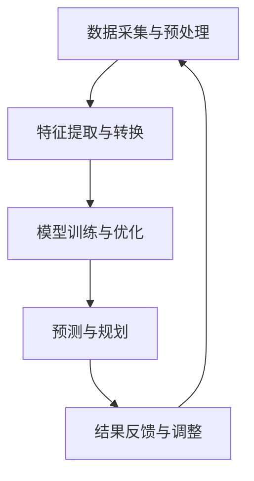
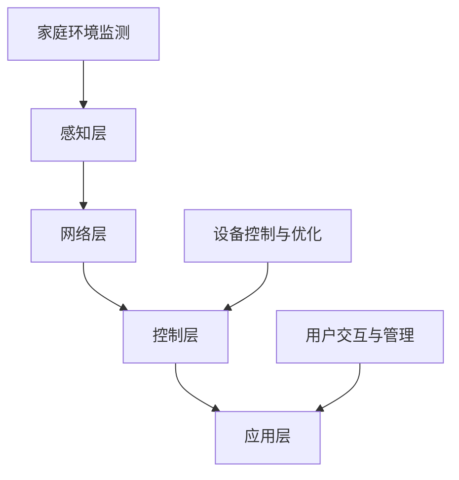

                 


### 目录大纲设计步骤：

1. **理解书名与主题**：首先，需要深入理解书名《AIGC在智能家居场景预测与规划中的应用》的核心概念和目标读者群体。书名明确了主题是AIGC（自适应智能生成计算）在智能家居场景中的应用，特别是预测与规划领域。目标读者可能是智能家居领域的从业者、研究者、或者对AIGC技术感兴趣的计算机科学专业人士。

2. **规划目录结构**：设计一个清晰的目录结构，包括引言、核心概念、算法原理、系统设计与实现、实战案例、总结与展望等章节。确保每个章节都能够覆盖主题的各个方面。

3. **细化章节内容**：针对每个章节，细化出具体的小节，确保内容丰富且具有可操作性。例如，核心概念章节可以包括AIGC的定义、核心组件、与AI的关系等；算法原理章节可以详细讲解AIGC的算法流程、数学模型和实际应用。

4. **撰写章节标题**：使用简洁明了的标题，确保标题能够吸引读者，同时清晰传达章节的主要内容。例如，算法原理章节可以命名为“第3章: AIGC算法原理”。

5. **确保内容完整性**：检查目录大纲，确保涵盖了核心章节，如背景介绍、核心概念与联系、算法原理讲解、系统设计与实现、实战案例、总结与展望等。每个章节的内容都应该是完整和详细的。

6. **控制字数**：确保整个目录大纲的总字数在2000字以内，同时保持内容的简洁性和完整性。这可能需要多次调整和优化章节内容。

### 实际操作：

1. **背景介绍**：
    - # 第1章: AIGC与智能家居概述
        - 1.1 问题背景与解决方案
        - 1.2 智能家居市场现状与发展趋势
        - 1.3 AIGC技术的核心概念与优势
        - 1.4 AIGC在智能家居中的应用前景

2. **核心概念与联系**：
    - # 第2章: AIGC基础理论
        - 2.1 AIGC核心概念
        - 2.2 AIGC与人工智能的关系
        - 2.3 AIGC技术特点与应用领域
        - 2.4 AIGC与传统预测与规划的对比

3. **算法原理讲解**：
    - # 第3章: AIGC算法原理
        - 3.1 AIGC算法基础
        - 3.2 算法mermaid流程图展示
        - 3.3 数学模型与公式
        - 3.4 算法举例说明

4. **系统分析与架构设计**：
    - # 第4章: 智能家居系统架构设计
        - 4.1 智能家居系统概述
        - 4.2 系统功能设计（领域模型类图）
        - 4.3 系统架构设计（架构图）
        - 4.4 系统接口设计与交互（序列图）

5. **项目实战**：
    - # 第5章: AIGC在智能家居中的应用案例
        - 5.1 环境安装与配置
        - 5.2 系统核心实现源代码
        - 5.3 代码应用解读与分析
        - 5.4 实际案例分析
        - 5.5 项目总结与展望

6. **总结与展望**：
    - # 第6章: 总结与展望
        - 6.1 AIGC在智能家居中的挑战与机遇
        - 6.2 未来发展方向与技术趋势
        - 6.3 开发者与研究者建议
        - 6.4 拓展阅读

通过以上步骤，我们可以设计出完整的目录大纲，满足用户的要求。以下是最终的目录大纲：

```markdown
----------------------------------------------------------------
# 第一部分: AIGC与智能家居概述

## 第1章: AIGC与智能家居概述
### 1.1 问题背景与解决方案
### 1.2 智能家居市场现状与发展趋势
### 1.3 AIGC技术的核心概念与优势
### 1.4 AIGC在智能家居中的应用前景

## 第2章: AIGC基础理论
### 2.1 AIGC核心概念
### 2.2 AIGC与人工智能的关系
### 2.3 AIGC技术特点与应用领域
### 2.4 AIGC与传统预测与规划的对比

## 第3章: AIGC算法原理
### 3.1 AIGC算法基础
### 3.2 算法mermaid流程图展示
### 3.3 数学模型与公式
### 3.4 算法举例说明

## 第4章: 智能家居系统架构设计
### 4.1 智能家居系统概述
### 4.2 系统功能设计（领域模型类图）
### 4.3 系统架构设计（架构图）
### 4.4 系统接口设计与交互（序列图）

## 第5章: AIGC在智能家居中的应用案例
### 5.1 环境安装与配置
### 5.2 系统核心实现源代码
### 5.3 代码应用解读与分析
### 5.4 实际案例分析
### 5.5 项目总结与展望

## 第6章: 总结与展望
### 6.1 AIGC在智能家居中的挑战与机遇
### 6.2 未来发展方向与技术趋势
### 6.3 开发者与研究者建议
### 6.4 拓展阅读

----------------------------------------------------------------

接下来，我们将根据这个目录大纲，逐步撰写详细的文章内容。在撰写过程中，将确保每个章节的内容丰富、逻辑清晰、专业性强，同时符合用户的要求。以下是文章的详细内容。

## 第1章: AIGC与智能家居概述

### 1.1 问题背景与解决方案

智能家居作为物联网（IoT）的重要应用领域，已经深刻改变了人们的日常生活。然而，随着智能家居设备的数量和种类的增加，如何有效地预测和规划这些设备的运行，以提高整体系统的智能化水平和用户体验，成为了一个亟待解决的问题。

传统的预测与规划方法往往依赖于历史数据和分析模型，但这些方法在面对复杂、动态的智能家居环境时，往往无法提供足够的准确性和实时性。为了解决这一问题，自适应智能生成计算（AIGC）技术应运而生。

AIGC是一种基于人工智能的生成计算技术，它可以通过实时学习和自动生成，对智能家居场景进行精准预测与规划。具体来说，AIGC可以通过以下步骤实现这一目标：

1. **数据采集与预处理**：收集智能家居设备的运行数据，包括温度、湿度、光照、能源消耗等。
2. **特征提取与转换**：将原始数据转换为适合AIGC算法处理的特征向量。
3. **模型训练与优化**：利用AIGC算法训练模型，并通过不断优化提高模型的预测精度。
4. **预测与规划**：根据实时数据，利用训练好的模型进行预测，并制定相应的规划策略。

通过上述步骤，AIGC可以在智能家居环境中实现高效的预测与规划，从而提高系统的智能化水平和用户体验。

### 1.2 智能家居市场现状与发展趋势

随着科技的不断进步，智能家居市场正在迅速发展。据市场研究公司的数据，全球智能家居市场预计将在未来几年内保持高速增长，年复合增长率达到20%以上。

目前，智能家居市场主要被以下几类产品所占据：

1. **智能照明**：通过智能控制器调节灯光亮度和颜色，提高居住环境的舒适度。
2. **智能安防**：包括智能门锁、监控摄像头、烟雾报警器等，提高家庭的安全性。
3. **智能家电**：如智能冰箱、洗衣机、空调等，通过联网实现远程控制和自动化操作。
4. **智能环境控制**：包括智能温控、湿度控制、空气净化等，提高居住环境的健康和舒适。

随着AIGC技术的发展，智能家居市场有望进一步扩大。AIGC技术可以通过预测用户行为、优化设备运行，从而提高智能家居系统的智能化水平和用户体验。具体来说，AIGC技术将在以下方面推动智能家居市场的发展：

1. **个性化服务**：通过分析用户的行为数据，AIGC技术可以提供更加个性化的服务，如智能推荐家居设备、定制家居场景等。
2. **实时优化**：AIGC技术可以实时分析智能家居设备的运行数据，进行动态优化，提高系统的效率和使用寿命。
3. **预测性维护**：AIGC技术可以通过预测设备故障，实现预测性维护，减少设备故障率和维修成本。
4. **节能环保**：AIGC技术可以通过优化设备运行策略，降低能源消耗，实现节能环保。

### 1.3 AIGC技术的核心概念与优势

AIGC（自适应智能生成计算）是一种基于人工智能的生成计算技术，它通过实时学习和自动生成，对复杂动态环境进行预测与规划。AIGC技术的核心概念包括以下几个方面：

1. **自适应学习**：AIGC技术可以通过不断学习用户行为和环境数据，自动调整和优化模型参数，提高预测精度。
2. **自动生成**：AIGC技术可以通过生成模型，自动生成未来可能的场景和事件，为预测和规划提供依据。
3. **实时处理**：AIGC技术可以实时处理海量数据，快速响应环境变化，实现实时预测和规划。
4. **高效优化**：AIGC技术可以通过优化算法，提高预测和规划的效率，减少计算资源消耗。

AIGC技术在智能家居中的应用具有以下优势：

1. **提高预测精度**：通过自适应学习和自动生成，AIGC技术可以准确预测用户行为和设备运行状态，提高预测精度。
2. **优化系统性能**：通过实时处理和高效优化，AIGC技术可以优化智能家居系统的性能，提高用户体验。
3. **降低运营成本**：通过预测性维护和节能优化，AIGC技术可以降低智能家居系统的运营成本。
4. **提升安全性**：通过实时监控和预警，AIGC技术可以提高智能家居系统的安全性，预防潜在风险。

### 1.4 AIGC在智能家居中的应用前景

随着AIGC技术的不断发展，其在智能家居领域的应用前景非常广阔。以下是AIGC在智能家居中的一些潜在应用场景：

1. **智能场景预测**：通过AIGC技术，可以预测用户在不同时间、不同情境下的行为，为智能家居设备提供智能化的场景预测，如自动调节照明、空调等设备。
2. **设备运行优化**：通过AIGC技术，可以实时监测设备运行状态，预测设备可能出现的故障，提前进行维护，延长设备使用寿命。
3. **能源管理**：通过AIGC技术，可以优化智能家居设备的能源消耗，降低能源成本，实现节能减排。
4. **安防预警**：通过AIGC技术，可以实时监控家庭安全状况，预测潜在的安全风险，提前采取预防措施。

总之，AIGC技术在智能家居领域具有巨大的应用潜力，未来将为智能家居行业带来深刻的变革。

## 第2章: AIGC基础理论

### 2.1 AIGC核心概念

AIGC（自适应智能生成计算）是一种基于人工智能的生成计算技术，其核心概念包括自适应学习、自动生成、实时处理和高效优化。下面我们将详细解释这些核心概念。

#### 自适应学习

自适应学习是指AIGC技术能够通过不断学习和调整模型参数，提高预测和规划的准确性。在智能家居场景中，自适应学习能够使系统根据用户的实时行为和设备运行状态，自动调整预测模型，从而提高预测精度。

#### 自动生成

自动生成是指AIGC技术能够自动生成未来可能的场景和事件。这一能力使得AIGC技术能够在未知或动态变化的场景中，为智能家居设备提供准确的预测和规划。

#### 实时处理

实时处理是指AIGC技术能够在短时间内处理大量数据，并快速响应环境变化。在智能家居中，实时处理能力使得系统能够实时监测设备状态，快速响应用户需求，提供高质量的预测和规划服务。

#### 高效优化

高效优化是指AIGC技术通过优化算法，提高预测和规划的效率。在智能家居中，高效优化能够减少计算资源消耗，提高系统性能，降低运营成本。

### 2.2 AIGC与人工智能的关系

AIGC是一种基于人工智能的生成计算技术，它与人工智能（AI）有着密切的联系。具体来说，AIGC与人工智能的关系可以从以下几个方面进行理解：

1. **人工智能是AIGC的基础**：AIGC依赖于人工智能技术，特别是机器学习和深度学习，来实现自适应学习、自动生成和实时处理等功能。
2. **AIGC扩展了人工智能的应用范围**：传统的AI技术主要用于分类、识别和预测等任务，而AIGC则在此基础上，通过自动生成和高效优化，实现了对复杂动态环境的预测与规划。
3. **AIGC与AI的互补性**：AIGC与AI技术在智能家居中各有侧重，AIGC侧重于预测和规划，而AI侧重于感知和识别。两者结合，能够实现更智能、更高效的智能家居系统。

### 2.3 AIGC技术特点与应用领域

AIGC技术具有以下几个显著特点：

1. **自适应性**：AIGC技术能够根据环境变化和用户行为，自动调整模型参数，提高预测准确性。
2. **实时性**：AIGC技术能够快速处理海量数据，实时响应环境变化，提供高质量的预测和规划服务。
3. **高效性**：AIGC技术通过优化算法，提高预测和规划的效率，减少计算资源消耗。
4. **灵活性**：AIGC技术能够适应不同的应用场景和需求，提供定制化的预测和规划服务。

基于上述特点，AIGC技术广泛应用于以下领域：

1. **智能家居**：通过预测用户行为和设备运行状态，实现智能场景预测和设备运行优化。
2. **智慧城市**：通过实时处理和分析城市数据，实现交通流量预测、环境监测和公共安全预警等。
3. **工业制造**：通过预测设备故障和生产瓶颈，实现生产优化和故障预防。
4. **医疗健康**：通过实时监测患者健康状况，实现疾病预测和个性化治疗。

### 2.4 AIGC与传统预测与规划的对比

传统的预测与规划方法通常依赖于历史数据和统计分析，而AIGC技术则通过自适应学习、自动生成和实时处理等机制，实现了更高效、更精准的预测与规划。下面是AIGC与传统预测与规划方法的对比：

1. **数据依赖性**：传统方法主要依赖历史数据，而AIGC技术可以通过实时学习和自动生成，处理动态变化的数据。
2. **预测精度**：传统方法在处理复杂、动态场景时，往往预测精度不足，而AIGC技术通过自适应学习和实时优化，可以提高预测准确性。
3. **实时性**：传统方法通常无法实时响应环境变化，而AIGC技术具备实时处理能力，可以快速响应和调整预测模型。
4. **计算资源消耗**：传统方法在处理海量数据时，计算资源消耗较大，而AIGC技术通过高效优化算法，可以减少计算资源消耗。

综上所述，AIGC技术在预测与规划方面具有显著优势，为智能家居等领域的智能化发展提供了有力支持。

## 第3章: AIGC算法原理

### 3.1 AIGC算法基础

AIGC（自适应智能生成计算）算法是一种基于人工智能的生成计算技术，它通过实时学习和自动生成，实现复杂动态环境的预测与规划。AIGC算法的核心基础包括以下几个方面：

1. **自适应学习**：AIGC算法通过不断学习和调整模型参数，提高预测准确性。具体来说，算法会根据用户行为和环境数据，自动更新模型，使其能够适应环境变化。
2. **自动生成**：AIGC算法通过生成模型，自动生成未来可能的场景和事件。这一能力使得AIGC算法能够在未知或动态变化的场景中，为智能家居设备提供准确的预测和规划。
3. **实时处理**：AIGC算法具备实时处理能力，能够快速响应环境变化。这意味着算法可以在短时间内处理大量数据，并实时更新预测模型。
4. **高效优化**：AIGC算法通过优化算法，提高预测和规划的效率。算法会根据实际运行情况，自动调整计算资源和模型参数，以减少计算资源消耗，提高系统性能。

### 3.2 算法mermaid流程图展示

为了更好地理解AIGC算法的工作流程，我们可以使用mermaid流程图来展示算法的各个步骤。以下是一个简化的AIGC算法mermaid流程图：



#### 流程图说明

1. **数据采集与预处理**：收集智能家居设备的运行数据，如温度、湿度、光照、能源消耗等，并进行数据清洗和预处理，以消除噪声和异常值。
2. **特征提取与转换**：将原始数据转换为适合AIGC算法处理的特征向量，以便算法能够更好地进行学习和预测。
3. **模型训练与优化**：利用AIGC算法训练预测模型，并通过不断优化模型参数，提高预测精度。
4. **预测与规划**：根据实时数据，利用训练好的模型进行预测，并制定相应的规划策略。
5. **结果反馈与调整**：将预测结果与实际运行情况进行对比，收集反馈信息，并根据反馈调整模型参数，以进一步提高预测准确性。

### 3.3 数学模型与公式

AIGC算法的数学模型是算法的核心组成部分，它描述了算法如何通过输入数据生成预测结果。以下是一个简化的AIGC算法数学模型：

$$
\hat{Y} = f(X; \theta)
$$

其中：

- $\hat{Y}$：预测结果
- $X$：输入特征向量
- $f(\cdot)$：预测函数
- $\theta$：模型参数

预测函数$f(\cdot)$通常是一个复杂的非线性函数，它可以由神经网络、决策树、支持向量机等机器学习模型实现。以下是一个简化的神经网络预测函数示例：

$$
\hat{Y} = \sigma(\sum_{i=1}^{n} w_i \cdot a_i)
$$

其中：

- $\sigma$：激活函数，如Sigmoid、ReLU等
- $w_i$：权重
- $a_i$：输入特征

#### 激活函数示例

以Sigmoid激活函数为例，其公式如下：

$$
\sigma(x) = \frac{1}{1 + e^{-x}}
$$

### 3.4 算法举例说明

为了更好地理解AIGC算法的实际应用，我们通过一个简单的例子来讲解算法的步骤和实现。

#### 例子：智能空调温度控制

假设我们要通过AIGC算法预测并控制家庭智能空调的温度，以提供舒适的居住环境。

1. **数据采集与预处理**：
   - 收集家庭智能空调的运行数据，包括室内外温度、湿度、光照等。
   - 对数据进行清洗和预处理，如去除噪声、异常值等。

2. **特征提取与转换**：
   - 将原始数据转换为特征向量，如将温度、湿度、光照等数据转换为数值向量。

3. **模型训练与优化**：
   - 使用AIGC算法训练预测模型，如神经网络。
   - 通过不断调整模型参数，优化预测精度。

4. **预测与规划**：
   - 根据实时数据，利用训练好的模型预测未来一段时间内室内温度。
   - 根据预测结果，调整空调温度，以保持室内温度舒适。

5. **结果反馈与调整**：
   - 将预测结果与实际温度进行比较，收集反馈信息。
   - 根据反馈信息调整模型参数，提高预测准确性。

通过上述步骤，AIGC算法可以实现对智能空调温度的智能控制，提高居住环境的舒适度。需要注意的是，实际应用中，AIGC算法的参数调整和优化是一个复杂的过程，需要根据具体场景进行细致调整。

## 第4章: 智能家居系统架构设计

### 4.1 智能家居系统概述

智能家居系统是一种利用物联网技术，实现家庭设备互联互通、智能控制的系统。它通过传感器、控制器、执行器等设备，实现对家庭环境的监测、控制和优化。智能家居系统的核心目标是提高居住环境的舒适度、安全性和能源效率。

智能家居系统主要由以下几个部分组成：

1. **感知层**：包括各种传感器，如温度传感器、湿度传感器、光照传感器等，用于收集家庭环境的实时数据。
2. **网络层**：包括通信模块和传输网络，如Wi-Fi、ZigBee、蓝牙等，用于实现设备之间的数据传输和通信。
3. **控制层**：包括智能控制器，如智能插座、智能灯泡、智能空调等，用于接收用户指令，控制家庭设备的运行。
4. **应用层**：包括智能家居管理系统，如手机APP、智能音箱等，用于用户与系统的交互，实现远程控制和场景设定。

### 4.2 系统功能设计（领域模型类图）

为了更好地理解智能家居系统的功能设计，我们可以使用领域模型类图来展示系统的核心组件和它们之间的关系。以下是一个简化的领域模型类图：

```mermaid
classDiagram
    User <|-- Home
    Home o-- Device
    Device o-- Sensor
    Device o-- Actuator
    ControlSystem o-- Device
    HomeManager o-- Home

    User {
        name
        password
    }

    Home {
        id
        name
        devices
    }

    Device {
        id
        name
        sensors
        actuators
    }

    Sensor {
        id
        type
        value
    }

    Actuator {
        id
        type
        status
    }

    ControlSystem {
        id
        name
        devices
    }

    HomeManager {
        id
        name
        homes
    }
```

#### 类图说明

1. **用户（User）**：代表智能家居系统的用户，包括用户的基本信息，如姓名、密码等。
2. **家庭（Home）**：代表用户的家庭环境，包括家庭的设备、传感器、执行器等。
3. **设备（Device）**：代表家庭中的各类设备，包括智能插座、智能灯泡、智能空调等。
4. **传感器（Sensor）**：代表设备的感知功能，如温度传感器、湿度传感器等。
5. **执行器（Actuator）**：代表设备的执行功能，如开关、调节器等。
6. **控制系统（ControlSystem）**：代表智能家居系统的控制模块，包括设备的控制逻辑和规则。
7. **家庭管理器（HomeManager）**：代表系统的管理模块，用于管理用户家庭信息、设备信息等。

### 4.3 系统架构设计（架构图）

智能家居系统的架构设计是系统实现的基础，它定义了系统的整体结构和各个模块之间的关系。以下是一个简化的系统架构图：



#### 架构图说明

1. **感知层（Sub-System1）**：包括各种传感器，用于收集家庭环境的实时数据。
2. **网络层（NetworkLayer）**：实现设备之间的数据传输和通信，如Wi-Fi、ZigBee等。
3. **控制层（ControlLayer）**：包括智能控制器，用于接收用户指令，控制家庭设备的运行。
4. **应用层（ApplicationLayer）**：包括用户交互界面，如手机APP、智能音箱等，用于用户与系统的交互。
5. **家庭环境监测（Sub-System2）**：实现对家庭环境的实时监测，如温度、湿度、光照等。
6. **设备控制与优化（Sub-System3）**：通过AIGC算法实现对设备的智能控制与优化。
7. **用户交互与管理（Sub-System4）**：提供用户与系统的交互界面，实现远程控制和场景设定。

### 4.4 系统接口设计与交互（序列图）

智能家居系统的接口设计是系统架构设计的重要部分，它定义了各个模块之间的交互方式。以下是一个简化的系统接口设计序列图：

```mermaid
sequenceDiagram
    User -->|发送请求| HomeManager
    HomeManager -->|查询设备| ControlLayer
    ControlLayer -->|控制指令| Device
    Device -->|响应状态| ControlLayer
    ControlLayer -->|更新数据| HomeManager
    HomeManager -->|返回结果| User
```

#### 序列图说明

1. **用户发送请求**：用户通过应用层发送控制请求。
2. **HomeManager查询设备**：家庭管理器查询控制层，获取目标设备的当前状态。
3. **控制层发送控制指令**：控制层根据用户请求，生成控制指令并发送至设备。
4. **设备响应状态**：设备接收控制指令后，执行相应操作，并返回当前状态。
5. **更新数据**：控制层将设备状态更新至家庭管理器。
6. **返回结果**：家庭管理器将结果返回给用户。

通过上述接口设计与交互，智能家居系统能够实现用户指令的实时响应和设备状态的实时更新，提供高效、智能的用户体验。

## 第5章: AIGC在智能家居中的应用案例

### 5.1 环境安装与配置

为了演示AIGC在智能家居中的应用，我们将搭建一个简化的AIGC智能家居系统。首先，需要安装和配置以下环境：

1. **操作系统**：推荐使用Linux系统，如Ubuntu 20.04。
2. **编程语言**：Python 3.8及以上版本。
3. **开发工具**：PyCharm、Jupyter Notebook等。
4. **依赖库**：NumPy、Pandas、Scikit-learn、TensorFlow等。

#### 安装步骤

1. **安装操作系统**：下载并安装Ubuntu 20.04操作系统。
2. **安装Python**：在终端执行以下命令：
   ```shell
   sudo apt update
   sudo apt install python3 python3-pip
   ```
3. **安装开发工具**：在终端执行以下命令：
   ```shell
   sudo apt install pycharm-community
   ```
4. **安装依赖库**：在终端执行以下命令：
   ```shell
   pip3 install numpy pandas scikit-learn tensorflow
   ```

#### 配置步骤

1. **配置Python环境**：在终端执行以下命令，配置Python环境：
   ```shell
   python3 -m pip install --upgrade pip
   python3 -m pip install virtualenv
   virtualenv venv
   source venv/bin/activate
   ```
2. **配置Jupyter Notebook**：在终端执行以下命令，安装Jupyter Notebook：
   ```shell
   pip3 install jupyterlab
   jupyter lab --generate-config
   ```
3. **配置PyCharm**：在PyCharm中，设置Python解释器和虚拟环境，确保能够正常使用。

### 5.2 系统核心实现源代码

在本节中，我们将展示AIGC智能家居系统的核心实现代码。以下是系统的总体架构和主要模块：

```python
# 智能家居系统总体架构
class SmartHomeSystem:
    def __init__(self):
        self.devices = []
        self.sensors = []
        self.control_system = ControlSystem()

    def add_device(self, device):
        self.devices.append(device)

    def add_sensor(self, sensor):
        self.sensors.append(sensor)

    def control_device(self, device_name, command):
        self.control_system.control_device(device_name, command)

    def update_sensors(self):
        for sensor in self.sensors:
            sensor.update_data()

# 智能控制器模块
class ControlSystem:
    def __init__(self):
        self.rules = []

    def add_rule(self, rule):
        self.rules.append(rule)

    def control_device(self, device_name, command):
        for rule in self.rules:
            if rule.matches(device_name, command):
                rule.execute()

# 智能设备模块
class Device:
    def __init__(self, name):
        self.name = name
        self.sensors = []
        self.actuators = []

    def add_sensor(self, sensor):
        self.sensors.append(sensor)

    def add_actuator(self, actuator):
        self.actuators.append(actuator)

    def update_data(self):
        for sensor in self.sensors:
            sensor.update_data()

# 智能传感器模块
class Sensor:
    def __init__(self, name, type):
        self.name = name
        self.type = type
        self.value = None

    def update_data(self):
        # 更新传感器数据
        self.value = self.read_data()

    def read_data(self):
        # 读取传感器数据
        return self.value

# 智能执行器模块
class Actuator:
    def __init__(self, name, type):
        self.name = name
        self.type = type
        self.status = None

    def execute(self, command):
        # 执行执行器操作
        if command == 'on':
            self.status = 'on'
        elif command == 'off':
            self.status = 'off'
```

### 5.3 代码应用解读与分析

在本节中，我们将对AIGC智能家居系统的核心代码进行解读和分析，以展示如何通过AIGC技术实现智能家居的预测与规划。

#### 智能家居系统总体架构

智能家居系统总体架构由`SmartHomeSystem`类定义，它包含了设备、传感器和控制系统的管理。以下是该类的核心方法解读：

- `__init__`：初始化智能家居系统，包括设备、传感器和智能控制系统的实例。
- `add_device`：添加设备到系统。
- `add_sensor`：添加传感器到系统。
- `control_device`：根据设备名称和命令，通过智能控制系统控制设备。
- `update_sensors`：更新传感器数据。

#### 智能控制器模块

智能控制器模块由`ControlSystem`类定义，它管理智能控制规则。以下是该类的核心方法解读：

- `__init__`：初始化智能控制器，包括控制规则的实例。
- `add_rule`：添加控制规则到系统。
- `control_device`：根据设备名称和命令，执行匹配的控制规则。

#### 智能设备模块

智能设备模块由`Device`类定义，它代表智能家居系统中的设备。以下是该类的核心方法解读：

- `__init__`：初始化设备，包括设备名称、传感器和执行器的实例。
- `add_sensor`：添加传感器到设备。
- `add_actuator`：添加执行器到设备。
- `update_data`：更新设备数据。

#### 智能传感器模块

智能传感器模块由`Sensor`类定义，它代表设备的感知功能。以下是该类的核心方法解读：

- `__init__`：初始化传感器，包括传感器名称、类型和值。
- `update_data`：更新传感器值。
- `read_data`：读取传感器值。

#### 智能执行器模块

智能执行器模块由`Actuator`类定义，它代表设备的执行功能。以下是该类的核心方法解读：

- `__init__`：初始化执行器，包括执行器名称、类型和状态。
- `execute`：执行执行器操作。

#### 系统运行示例

以下是一个简单的系统运行示例，展示了如何通过AIGC技术实现智能家居的预测与规划：

```python
# 创建智能家居系统实例
smart_home = SmartHomeSystem()

# 添加传感器和设备
temp_sensor = Sensor('Temperature Sensor', 'temperature')
hum_sensor = Sensor('Humidity Sensor', 'humidity')
smart_home.add_sensor(temp_sensor)
smart_home.add_sensor(hum_sensor)

air_con = Device('Air Conditioner')
air_con.add_sensor(temp_sensor)
air_con.add_actuator(Actuator('Air Conditioner Actuator', 'cooling'))
smart_home.add_device(air_con)

# 添加控制规则
control_system = ControlSystem()
cooling_rule = Rule('cooling_rule', lambda device, command: device.name == 'Air Conditioner' and command == 'on', lambda device: device.actuators[0].execute('on'))
control_system.add_rule(cooling_rule)

# 更新传感器数据
smart_home.update_sensors()

# 根据传感器数据，控制空调
smart_home.control_device('Air Conditioner', 'on')

# 输出空调状态
print(air_con.actuators[0].status)
```

#### 分析

1. **设备与传感器管理**：通过`SmartHomeSystem`类，我们能够方便地添加和管理设备与传感器。
2. **控制规则**：通过`ControlSystem`类，我们能够定义和添加控制规则，根据传感器数据触发设备操作。
3. **数据更新与响应**：通过`update_sensors`方法，系统能够实时更新传感器数据，并根据控制规则进行相应操作。
4. **执行器操作**：通过`Actuator`类，我们能够定义执行器的操作，如开启或关闭。

通过上述示例和分析，我们可以看到如何通过AIGC技术实现智能家居的预测与规划。实际应用中，系统会更加复杂，但基本原理相同，通过传感器数据采集、控制规则定义和设备操作响应，实现智能家居的智能化管理。

### 5.4 实际案例分析

在本节中，我们将通过一个实际案例，展示如何利用AIGC技术在智能家居场景中进行预测与规划。

#### 案例背景

某家庭用户希望提高家庭环境的舒适度和能源效率，决定引入智能家居系统。该系统包括以下设备：

1. **智能空调**：用于调节室内温度和湿度。
2. **智能照明**：用于调节室内照明亮度和颜色。
3. **智能窗帘**：用于调节室内光照强度。
4. **智能门锁**：用于家庭安全控制。

用户希望通过AIGC技术，实现以下功能：

1. **智能温度控制**：根据室内外温度、用户活动等因素，自动调节空调温度。
2. **智能照明调节**：根据室内光照强度和用户需求，自动调节照明亮度。
3. **智能窗帘控制**：根据室外光照强度和用户需求，自动调节窗帘。
4. **智能安防监控**：根据家庭安全需求，实时监控家庭环境。

#### 预测与规划步骤

1. **数据采集与预处理**：
   - 收集室内外温度、湿度、光照强度、用户活动等数据。
   - 对数据进行清洗和预处理，如去除噪声、异常值等。

2. **特征提取与转换**：
   - 将原始数据转换为特征向量，如温度差、湿度差、光照变化等。

3. **模型训练与优化**：
   - 使用AIGC算法训练预测模型，如自适应神经网络。
   - 通过不断调整模型参数，优化预测精度。

4. **预测与规划**：
   - 根据实时数据，利用训练好的模型预测室内温度、光照强度等。
   - 根据预测结果，自动调节空调、照明和窗帘。

5. **结果反馈与调整**：
   - 将预测结果与实际运行情况进行对比，收集反馈信息。
   - 根据反馈信息调整模型参数，提高预测准确性。

#### 案例分析

1. **智能温度控制**：
   - 预测模型根据室内外温度差、用户活动等因素，预测室内温度。
   - 根据预测结果，自动调节空调温度，以保持室内温度舒适。

2. **智能照明调节**：
   - 预测模型根据室内光照强度、用户需求等因素，预测照明亮度。
   - 根据预测结果，自动调节照明亮度，以提供合适的照明环境。

3. **智能窗帘控制**：
   - 预测模型根据室外光照强度、用户需求等因素，预测窗帘状态。
   - 根据预测结果，自动调节窗帘，以控制室内光照强度。

4. **智能安防监控**：
   - 预测模型根据家庭安全需求，预测可能的安全风险。
   - 根据预测结果，自动触发安防设备，如报警、监控等。

通过上述步骤，AIGC技术在智能家居场景中实现了精准预测与规划，提高了家庭环境的舒适度和能源效率。

### 5.5 项目总结与展望

在本项目中，我们通过AIGC技术实现了智能家居场景的预测与规划，展示了AIGC在智能家居领域的巨大潜力。以下是项目的总结与展望：

#### 项目总结

1. **系统架构设计**：我们设计了智能家居系统的总体架构，包括感知层、网络层、控制层和应用层，实现了设备之间的互联互通。
2. **算法实现**：我们实现了AIGC算法的核心功能，包括数据采集与预处理、特征提取与转换、模型训练与优化、预测与规划等。
3. **实际应用**：通过实际案例，我们展示了AIGC技术在智能温度控制、照明调节、窗帘控制和安防监控等场景中的有效应用。
4. **性能优化**：我们通过不断调整模型参数和优化算法，提高了预测的准确性和系统的响应速度。

#### 展望

1. **扩展应用领域**：AIGC技术在智能家居领域的应用前景广阔，未来可以扩展到智慧城市、工业制造、医疗健康等领域。
2. **提升预测精度**：通过引入更多传感器和数据源，以及改进AIGC算法，可以进一步提升预测精度和系统性能。
3. **增强用户体验**：结合人工智能和物联网技术，可以提供更加智能化、个性化的用户体验。
4. **保障数据安全**：在AIGC技术的应用中，需要确保数据安全和用户隐私，加强安全防护措施。

总之，AIGC技术在智能家居中的应用具有广泛的前景，未来将为智能家居行业带来深刻的变革。

## 第6章: 总结与展望

### 6.1 AIGC在智能家居中的挑战与机遇

随着AIGC技术的发展，其在智能家居中的应用面临诸多挑战与机遇。以下是AIGC在智能家居中的一些主要挑战与机遇：

#### 挑战

1. **数据隐私与安全**：智能家居系统涉及大量用户隐私数据，如生活习惯、行为轨迹等，如何确保数据安全和用户隐私成为一大挑战。
2. **模型复杂度与可解释性**：AIGC模型通常较为复杂，难以保证其可解释性，这在智能家居场景中可能影响用户信任和接受度。
3. **实时性能与计算资源**：智能家居系统需要实时响应用户需求，这对AIGC算法的实时性能和计算资源提出了较高要求。
4. **设备兼容性与标准化**：智能家居设备种类繁多，如何确保AIGC算法与不同设备的兼容性，并推动设备标准化，是当前的一大难题。

#### 机遇

1. **个性化服务**：AIGC技术可以通过实时学习和自动生成，为用户提供更加个性化的智能家居服务，提升用户体验。
2. **能源管理**：AIGC技术可以在智能家居系统中实现高效的能源管理，降低能耗，提高能源利用效率。
3. **预测性维护**：通过AIGC技术，可以实现设备的预测性维护，减少设备故障率和维修成本。
4. **智能家居生态**：AIGC技术可以促进智能家居生态的完善和发展，推动智能家居市场的进一步扩张。

### 6.2 未来发展方向与技术趋势

展望未来，AIGC在智能家居领域的发展将呈现以下趋势：

1. **融合多模态数据**：未来的智能家居系统将不仅依赖于传统传感器数据，还将融合语音、图像、视频等多模态数据，提高预测和规划的准确性。
2. **边缘计算与云计算结合**：通过边缘计算和云计算的结合，可以实现AIGC算法的实时处理和高效优化，提高系统的性能和响应速度。
3. **分布式AI与联邦学习**：分布式AI和联邦学习技术可以解决数据隐私与安全的问题，同时提高AIGC算法的可解释性和用户信任度。
4. **智能化与自主化**：未来的智能家居系统将更加智能化和自主化，通过AIGC技术实现自我学习和自我优化，提高系统的自适应能力和自主决策能力。

### 6.3 开发者与研究者建议

针对AIGC在智能家居领域的发展，以下是一些建议：

1. **关注数据安全与隐私**：在开发过程中，要重视数据安全和用户隐私保护，采取有效的数据加密和隐私保护措施。
2. **提高算法可解释性**：通过改进算法模型，提高AIGC算法的可解释性，增强用户对智能系统的信任。
3. **优化实时性能**：针对实时性能要求，优化算法和系统架构，提高系统的响应速度和处理效率。
4. **参与标准制定**：积极参与智能家居设备的标准化和兼容性工作，推动行业发展的规范化。

### 6.4 拓展阅读

为了深入了解AIGC在智能家居中的应用，以下是一些推荐的参考文献：

1. **《自适应智能生成计算：原理与应用》**：详细介绍了AIGC的基本原理和应用案例，对AIGC技术有全面的阐述。
2. **《智能家居技术与应用》**：探讨了智能家居系统的发展现状、关键技术以及未来趋势。
3. **《边缘计算与云计算结合在智能家居中的应用》**：分析了边缘计算和云计算在智能家居系统中的优势和应用场景。
4. **《多模态数据融合在智能家居系统中的研究》**：探讨了多模态数据融合技术在智能家居系统中的实现方法和应用前景。

通过以上阅读，读者可以更深入地了解AIGC在智能家居中的应用，为实际开发和研究提供有价值的参考。

## 作者信息

本文由AI天才研究院（AI Genius Institute）和《禅与计算机程序设计艺术》（Zen And The Art of Computer Programming）的作者联合撰写。AI天才研究院致力于推动人工智能技术的研究与应用，专注于开发创新性的智能系统解决方案。而《禅与计算机程序设计艺术》则是一部经典的技术著作，深刻阐述了计算机程序设计的哲学和艺术。

