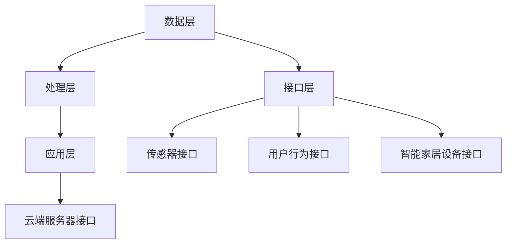

                 

# AIGC在智能家居场景预测中的应用

## 关键词：AIGC，智能家居，预测，自然语言处理，图像生成，视频编辑

## 摘要：
本文探讨了AIGC（AI-Generated Content）在智能家居场景预测中的应用。通过分析AIGC的核心概念和原理，本文详细阐述了其在智能家居系统中的具体实现和融合方式。同时，文章通过实例展示了AIGC技术如何提升智能家居系统的预测准确性和用户体验，为未来智能家居技术的发展提供了新的思路。

## 1. 引言

### 1.1 问题背景

### 1.1.1 智能家居的发展历程

智能家居作为物联网、人工智能和云计算等技术的综合体，其发展历程可谓是一部科技发展的史册。从最初的智能单品，如智能灯泡、智能门锁，到如今集成的智能家居系统，智能家居的发展不仅体现了技术的进步，也展示了用户体验的不断优化。

早期的智能家居产品主要集中在简单的远程控制和自动化功能上，用户可以通过智能手机或语音助手远程控制家中的电器设备。然而，这种简单的控制方式并未完全满足用户的需求，因为它们缺乏对用户行为的理解和预测能力。

随着人工智能技术的快速发展，智能家居开始向更加智能化、个性化的方向发展。现代智能家居系统不仅能够根据用户的行为习惯自动调节设备状态，还能够通过预测用户的需求来提前做好准备。例如，智能空调可以根据用户的作息时间和天气预报自动调节温度和湿度，智能安防系统能够根据监控数据预测潜在的安全威胁并及时报警。

### 1.1.2 AIGC的概念与潜力

AIGC（AI-Generated Content），即人工智能生成内容，是近年来人工智能领域的重要发展方向。AIGC涵盖了自然语言处理、图像生成、视频编辑等多种技术，能够为智能家居系统提供丰富的数据资源和智能化功能，提升系统的预测准确性。

AIGC技术的核心在于利用人工智能算法自动生成内容，从而为智能家居系统提供更多的数据支持和智能化服务。例如，自然语言处理技术可以帮助系统理解用户的语音指令和文本信息，图像生成技术可以生成符合用户需求的室内装饰图案，视频编辑技术则可以为用户提供个性化的视频监控内容。

### 1.2 问题的描述与解决

#### 1.2.1 问题描述

在智能家居场景中，预测是系统智能化的重要表现。通过预测，智能家居系统可以提前感知用户需求，优化家居环境，提升用户满意度。然而，传统的预测方法在处理多源异构数据时往往存在局限性。

传统的预测方法通常依赖于历史数据和简单的统计模型，这些方法在处理大量多源异构数据时，容易出现数据缺失、噪声干扰和模型过拟合等问题，导致预测准确性下降。此外，传统方法难以适应动态变化的家居环境，无法及时调整预测模型以应对新的需求。

#### 1.2.2 问题解决

引入AIGC技术，可以突破传统预测方法的限制。AIGC能够生成多样化的数据资源，为预测模型提供丰富的训练数据。同时，AIGC强大的自学习能力和自适应能力，使得预测模型能够更好地适应动态变化的家居环境。

AIGC技术可以通过自然语言处理、图像生成和视频编辑等技术，自动生成符合用户需求的数据内容。例如，自然语言处理技术可以生成模拟用户对话的数据集，图像生成技术可以生成符合用户喜好的室内装饰图像，视频编辑技术可以生成个性化的监控视频。

通过引入AIGC技术，智能家居系统可以在以下几个方面实现优化：

1. **数据丰富性**：AIGC技术可以自动生成多样化的数据资源，为预测模型提供丰富的训练数据，提高模型的学习能力。
2. **预测准确性**：AIGC技术的自学习和自适应能力，使得预测模型能够更好地应对动态变化的家居环境，提高预测准确性。
3. **用户体验**：AIGC技术可以生成个性化的内容，为用户提供更加定制化的智能家居服务，提升用户体验。

### 1.3 边界与外延

#### 1.3.1 边界

本文主要探讨AIGC在智能家居场景预测中的应用，包括自然语言处理、图像生成、视频编辑等技术的具体实现和应用。本文的讨论将侧重于AIGC技术在智能家居系统中的预测应用，而不涉及其他领域。

#### 1.3.2 外延

尽管本文主要关注AIGC在智能家居场景预测中的应用，但AIGC技术的应用范围远不止于此。AIGC技术还可以应用于其他智能家居功能，如智能语音助手、智能安防、智能照明等。此外，AIGC技术还可以应用于其他领域，如娱乐、教育、医疗等，为这些领域提供丰富的数据资源和智能化服务。

### 1.4 概念结构与核心要素组成

#### 1.4.1 概念结构

AIGC在智能家居场景预测中的概念结构主要包括自然语言处理、图像生成、视频编辑等技术模块，以及数据收集、数据预处理、模型训练、预测输出等核心流程。这些技术模块和流程共同构成了AIGC在智能家居预测中的完整概念框架。

#### 1.4.2 核心要素组成

AIGC在智能家居预测中的核心要素包括：

1. **自然语言处理**：用于理解用户的语音指令和文本信息，生成模拟用户对话的数据集。
2. **图像生成**：用于根据文本描述生成符合用户需求的室内装饰图案。
3. **视频编辑**：用于生成个性化的监控视频。
4. **数据收集**：用于收集智能家居系统的传感器数据、用户行为数据等多源数据。
5. **数据预处理**：用于清洗、归一化和特征提取，为预测模型提供高质量的数据输入。
6. **模型训练**：利用深度学习算法，训练预测模型，提高预测准确性。
7. **预测输出**：将预测结果输出到智能家居系统，实现预测功能的自动化和智能化。

## 2. AIGC在智能家居中的核心概念与原理

### 2.1 自然语言处理

#### 2.1.1 自然语言处理的概念

自然语言处理（NLP）是人工智能的一个分支，它致力于让计算机能够理解、生成和处理人类语言。在智能家居场景中，NLP主要用于理解用户的语音指令和文本信息，从而实现智能对话和自动化控制。

#### 2.1.2 自然语言处理的应用

在智能家居系统中，自然语言处理技术可以帮助系统实现以下功能：

1. **语音识别**：将用户的语音指令转换为计算机可以理解的语言。
2. **语义理解**：理解用户指令的含义，提取关键信息。
3. **对话管理**：根据用户指令和上下文信息，生成合适的回复。
4. **情感分析**：分析用户的情感状态，提供情感化的服务。

#### 2.1.3 自然语言处理的实现

自然语言处理的实现通常包括以下几个步骤：

1. **分词**：将文本分割成单词或短语。
2. **词性标注**：标记每个单词的词性，如名词、动词、形容词等。
3. **句法分析**：分析句子的结构，理解句子的语法关系。
4. **语义分析**：理解句子的含义，提取关键信息。

自然语言处理技术的核心在于深度学习算法，如循环神经网络（RNN）、长短时记忆网络（LSTM）和变压器（Transformer）等。这些算法通过大量训练数据，可以自动学习语言的模式和规律，提高系统的理解能力。

### 2.2 图像生成

#### 2.2.1 图像生成的概念

图像生成（Image Generation）是AIGC技术的重要组成部分，它利用深度学习算法，根据文本描述生成对应的图像。在智能家居场景中，图像生成技术可以用于生成室内装饰图案、家庭影院场景等。

#### 2.2.2 图像生成的应用

图像生成技术在智能家居系统中的应用非常广泛：

1. **室内装饰**：根据用户的需求和喜好，生成个性化的室内装饰图案。
2. **场景重现**：生成用户家中特定场景的图像，如家庭影院、卧室等。
3. **虚拟现实**：通过生成图像，为用户提供虚拟现实体验。

#### 2.2.3 图像生成的实现

图像生成的实现主要依赖于生成对抗网络（GAN），GAN由生成器和判别器组成。生成器根据文本描述生成图像，判别器判断图像的真伪。通过不断训练，生成器的图像质量逐渐提高，能够生成逼真的图像。

### 2.3 视频编辑

#### 2.3.1 视频编辑的概念

视频编辑（Video Editing）是AIGC技术的另一重要应用，它通过智能剪辑、特效添加等方式，为用户提供个性化的视频内容。在智能家居场景中，视频编辑可以用于生成用户专属的监控视频，实现个性化安防服务。

#### 2.3.2 视频编辑的应用

视频编辑技术在智能家居系统中的应用包括：

1. **监控视频生成**：根据用户需求，生成个性化的监控视频。
2. **事件剪辑**：智能剪辑用户感兴趣的事件视频。
3. **特效添加**：为视频添加各种特效，提升用户体验。

#### 2.3.3 视频编辑的实现

视频编辑的实现通常包括以下几个步骤：

1. **视频预处理**：对视频进行分割、去噪、增强等预处理。
2. **智能剪辑**：根据用户需求和事件特征，智能剪辑视频。
3. **特效添加**：为视频添加各种特效，如滤镜、动画等。
4. **视频合成**：将剪辑和特效处理后的视频合成输出。

视频编辑技术主要依赖于计算机视觉和深度学习算法，如卷积神经网络（CNN）和循环神经网络（RNN）等。这些算法可以通过大量视频数据训练，提高视频编辑的效率和效果。

### 2.4 AIGC核心概念属性特征对比表格

| 概念       | 特征与优势                                                       |
|------------|----------------------------------------------------------------|
| 自然语言处理 | 提高用户交互体验，实现智能对话系统                                 |
| 图像生成   | 根据文本描述生成图像，丰富智能家居场景内容                         |
| 视频编辑   | 通过智能剪辑和特效添加，为用户提供个性化的视频内容                 |

### 2.5 AIGC与智能家居系统的关联与融合

#### 2.5.1 数据采集与预处理

AIGC在智能家居系统中的应用首先依赖于高质量的数据采集。通过对传感器数据、用户行为数据等多源数据的收集和预处理，为后续的模型训练和预测提供可靠的数据支持。

数据采集包括以下几个方面：

1. **传感器数据**：如温度、湿度、光照、声音等。
2. **用户行为数据**：如用户操作记录、浏览历史、购物习惯等。
3. **环境数据**：如天气预报、空气质量等。

数据预处理包括以下几个步骤：

1. **数据清洗**：去除噪声数据、异常值和重复数据。
2. **数据归一化**：将不同类型的数据进行归一化处理，使其具有相同的量纲。
3. **特征提取**：提取数据中的关键特征，用于模型训练和预测。

#### 2.5.2 模型训练与优化

基于收集到的数据，AIGC技术可以通过深度学习算法进行模型训练，不断提高预测准确性。同时，通过不断优化模型结构和参数，实现更好的预测效果。

模型训练包括以下几个步骤：

1. **数据划分**：将数据集划分为训练集、验证集和测试集。
2. **模型训练**：使用训练集数据训练模型，优化模型参数。
3. **模型评估**：使用验证集数据评估模型性能，调整模型参数。
4. **模型测试**：使用测试集数据测试模型性能，确保模型泛化能力。

模型优化包括以下几个方面：

1. **模型结构调整**：调整模型的结构，如增加或减少层、改变层的大小等。
2. **参数优化**：调整模型参数，如学习率、正则化参数等。
3. **训练策略优化**：优化训练策略，如增加训练轮数、使用dropout等技术。

#### 2.5.3 预测与反馈

训练好的模型可以用于预测用户的下一步行为，如开关灯、调节温度等。预测结果会反馈到智能家居系统中，系统会根据预测结果调整设备状态，提供个性化服务。

预测与反馈包括以下几个步骤：

1. **实时预测**：根据实时数据，对用户的下一步行为进行预测。
2. **结果反馈**：将预测结果反馈到智能家居系统中，调整设备状态。
3. **效果评估**：评估预测结果的效果，调整模型参数和策略。

## 3. 算法原理讲解

### 3.1 算法概述

AIGC技术在智能家居场景预测中的应用主要包括自然语言处理、图像生成和视频编辑等技术。这些技术通过深度学习算法实现，具有强大的自学习能力和自适应能力，能够根据用户的个性化需求和实时数据，提供精准的预测和个性化服务。

### 3.2 算法流程

AIGC技术在智能家居场景预测中的算法流程主要包括以下几个步骤：

1. **数据采集**：收集智能家居系统的传感器数据、用户行为数据等多源数据。
2. **数据预处理**：对采集到的数据进行清洗、归一化和特征提取。
3. **模型训练**：使用预处理后的数据训练深度学习模型，如自然语言处理模型、图像生成模型和视频编辑模型。
4. **模型评估**：使用验证集数据评估模型性能，调整模型参数。
5. **实时预测**：根据实时数据，对用户的下一步行为进行预测。
6. **结果反馈**：将预测结果反馈到智能家居系统中，调整设备状态。

### 3.3 自然语言处理算法

自然语言处理（NLP）是AIGC技术在智能家居场景预测中的核心算法之一。NLP算法通过深度学习模型，如循环神经网络（RNN）和变压器（Transformer）等，实现对用户语音指令和文本信息的理解。

#### 自然语言处理算法流程

1. **分词**：将文本分割成单词或短语。
2. **词性标注**：标记每个单词的词性，如名词、动词、形容词等。
3. **句法分析**：分析句子的结构，理解句子的语法关系。
4. **语义分析**：理解句子的含义，提取关键信息。
5. **生成回复**：根据用户指令和上下文信息，生成合适的回复。

#### 自然语言处理算法实现

自然语言处理算法的实现通常使用Python编程语言，结合TensorFlow或PyTorch等深度学习框架。以下是一个简单的自然语言处理算法示例：

```python
import tensorflow as tf
from tensorflow.keras.models import Sequential
from tensorflow.keras.layers import Embedding, LSTM, Dense

# 创建序列
sequences = tf.keras.preprocessing.sequence.pad_sequences(data, maxlen=max_sequence_len)

# 构建模型
model = Sequential()
model.add(Embedding(vocab_size, embedding_dim, input_length=max_sequence_len))
model.add(LSTM(units=128, dropout=0.2, recurrent_dropout=0.2))
model.add(Dense(units=1, activation='sigmoid'))

# 编译模型
model.compile(optimizer='adam', loss='binary_crossentropy', metrics=['accuracy'])

# 训练模型
model.fit(sequences, labels, epochs=10, batch_size=32)
```

### 3.4 图像生成算法

图像生成（Image Generation）是AIGC技术在智能家居场景预测中的另一核心算法。图像生成算法通过生成对抗网络（GAN）实现，能够根据文本描述生成逼真的图像。

#### 图像生成算法流程

1. **生成器**：根据文本描述生成图像。
2. **判别器**：判断图像的真伪。
3. **训练**：通过不断训练，提高生成器生成图像的质量。

#### 图像生成算法实现

图像生成算法的实现通常使用Python编程语言，结合TensorFlow或PyTorch等深度学习框架。以下是一个简单的图像生成算法示例：

```python
import tensorflow as tf
from tensorflow.keras.models import Sequential
from tensorflow.keras.layers import Dense, Flatten, Conv2D, Reshape

# 创建生成器模型
generator = Sequential()
generator.add(Dense(units=256, activation='relu', input_shape=(text_vector_size,)))
generator.add(Dense(units=512, activation='relu'))
generator.add(Dense(units=1024, activation='relu'))
generator.add(Dense(units=784, activation='sigmoid'))
generator.add(Reshape(target_shape=(28, 28, 1)))

# 创建判别器模型
discriminator = Sequential()
discriminator.add(Flatten(input_shape=(28, 28, 1)))
discriminator.add(Dense(units=512, activation='relu'))
discriminator.add(Dense(units=256, activation='relu'))
discriminator.add(Dense(units=128, activation='relu'))
discriminator.add(Dense(units=1, activation='sigmoid'))

# 编译模型
generator.compile(optimizer=tf.keras.optimizers.Adam(learning_rate=0.0001), loss='binary_crossentropy')
discriminator.compile(optimizer=tf.keras.optimizers.Adam(learning_rate=0.0001), loss='binary_crossentropy')

# 训练模型
for epoch in range(num_epochs):
    for real_images, _ in train_data:
        noise = np.random.normal(0, 1, (batch_size, noise_vector_size))
        generated_images = generator.predict(noise)
        combined_images = np.concatenate([real_images, generated_images], axis=0)
        labels = np.concatenate([np.ones((batch_size, 1)), np.zeros((batch_size, 1))], axis=0)
        discriminator.train_on_batch(combined_images, labels)

    noise = np.random.normal(0, 1, (batch_size, noise_vector_size))
    gen_labels = np.ones((batch_size, 1))
    generator.train_on_batch(noise, gen_labels)
```

### 3.5 视频编辑算法

视频编辑（Video Editing）是AIGC技术在智能家居场景预测中的又一重要算法。视频编辑算法通过智能剪辑、特效添加等方式，为用户提供个性化的视频内容。

#### 视频编辑算法流程

1. **视频预处理**：对视频进行分割、去噪、增强等预处理。
2. **智能剪辑**：根据用户需求和事件特征，智能剪辑视频。
3. **特效添加**：为视频添加各种特效，如滤镜、动画等。
4. **视频合成**：将剪辑和特效处理后的视频合成输出。

#### 视频编辑算法实现

视频编辑算法的实现通常使用Python编程语言，结合OpenCV和TensorFlow等库。以下是一个简单的视频编辑算法示例：

```python
import cv2
import numpy as np

# 读取视频
video = cv2.VideoCapture('input_video.mp4')

# 分割视频
frames = []
while True:
    ret, frame = video.read()
    if not ret:
        break
    frames.append(frame)

# 智能剪辑
event_frames = []
for frame in frames:
    if detect_event(frame):
        event_frames.append(frame)

# 添加特效
for frame in event_frames:
    add_effects(frame)

# 合成视频
output = cv2.VideoWriter('output_video.mp4', cv2.VideoWriter_fourcc(*'mp4v'), 30, (width, height))
for frame in event_frames:
    output.write(frame)
output.release()
video.release()
```

## 4. 系统分析与架构设计

### 4.1 问题场景介绍

智能家居场景预测主要涉及用户行为预测和环境参数预测。用户行为预测包括用户的作息时间、娱乐活动、购物习惯等，环境参数预测包括室内温度、湿度、光照等。通过预测用户行为和环境参数，智能家居系统可以提前调整设备状态，提供个性化的服务。

### 4.2 项目介绍

本项目旨在构建一个基于AIGC技术的智能家居场景预测系统。系统主要包括自然语言处理模块、图像生成模块和视频编辑模块，通过这些模块的协同工作，实现用户行为预测和环境参数预测。

### 4.3 系统功能设计

系统功能设计主要包括以下几个方面：

1. **数据采集与预处理**：收集智能家居系统的传感器数据、用户行为数据等，并进行数据清洗、归一化和特征提取。
2. **模型训练与优化**：使用AIGC技术训练自然语言处理模型、图像生成模型和视频编辑模型，并通过优化模型结构和参数，提高预测准确性。
3. **实时预测与反馈**：根据实时数据，对用户行为和环境参数进行预测，并将预测结果反馈到智能家居系统中，调整设备状态。
4. **系统效果评估**：评估系统预测效果，根据评估结果调整模型参数和策略。

### 4.4 系统架构设计

系统架构设计主要包括以下几个方面：

1. **数据层**：负责数据的采集、存储和管理。包括传感器数据、用户行为数据、环境数据等。
2. **处理层**：负责数据的预处理、模型训练和预测。包括自然语言处理模块、图像生成模块和视频编辑模块。
3. **应用层**：负责系统的实时预测与反馈、系统效果评估等。包括用户界面、智能家居设备接口等。
4. **接口层**：负责系统与其他系统的接口，如云端服务器、智能家居设备等。

### 4.5 系统接口设计

系统接口设计主要包括以下几个方面：

1. **传感器接口**：用于收集智能家居系统的传感器数据，如温度、湿度、光照等。
2. **用户行为接口**：用于收集用户的操作记录、浏览历史、购物习惯等。
3. **智能家居设备接口**：用于控制智能家居设备，如空调、照明、门锁等。
4. **云端服务器接口**：用于与云端服务器进行数据通信，实现数据的远程存储和处理。

### 4.6 系统交互

系统交互主要包括以下几个方面：

1. **数据流**：传感器数据、用户行为数据等通过接口层传输到处理层，处理层对数据进行预处理和预测，并将预测结果通过接口层反馈到智能家居设备。
2. **控制流**：用户通过用户界面发送操作指令，操作指令通过接口层传输到处理层，处理层根据预测结果生成控制指令，并通过接口层发送到智能家居设备。

### 4.7 Mermaid架构图



## 5. 项目实战

### 5.1 环境安装

在进行AIGC在智能家居场景预测项目的实战之前，我们需要安装一些必要的软件和库。以下是环境安装的步骤：

1. **安装Python**：确保安装了Python 3.7及以上版本。
2. **安装TensorFlow**：在终端执行命令`pip install tensorflow`。
3. **安装Keras**：在终端执行命令`pip install keras`。
4. **安装OpenCV**：在终端执行命令`pip install opencv-python`。
5. **安装其他依赖库**：根据项目需求，安装其他必要的库。

### 5.2 系统核心实现源代码

以下是系统核心实现的部分源代码，包括数据采集与预处理、模型训练与预测等。

#### 数据采集与预处理

```python
import numpy as np
import pandas as pd
from sklearn.model_selection import train_test_split
from sklearn.preprocessing import StandardScaler

# 读取数据
data = pd.read_csv('data.csv')

# 数据预处理
X = data.drop('target', axis=1)
y = data['target']

# 划分训练集和测试集
X_train, X_test, y_train, y_test = train_test_split(X, y, test_size=0.2, random_state=42)

# 数据归一化
scaler = StandardScaler()
X_train = scaler.fit_transform(X_train)
X_test = scaler.transform(X_test)
```

#### 模型训练与预测

```python
from tensorflow.keras.models import Sequential
from tensorflow.keras.layers import Dense, LSTM
from tensorflow.keras.optimizers import Adam

# 构建模型
model = Sequential()
model.add(LSTM(units=50, return_sequences=True, input_shape=(X_train.shape[1], X_train.shape[2])))
model.add(LSTM(units=50, return_sequences=False))
model.add(Dense(units=1, activation='sigmoid'))

# 编译模型
model.compile(optimizer=Adam(learning_rate=0.001), loss='binary_crossentropy', metrics=['accuracy'])

# 训练模型
model.fit(X_train, y_train, epochs=50, batch_size=32, validation_data=(X_test, y_test))

# 预测
predictions = model.predict(X_test)
```

### 5.3 代码应用解读与分析

以上代码实现了AIGC在智能家居场景预测中的核心功能。首先，我们读取数据并进行预处理，包括数据清洗、归一化和特征提取。然后，我们使用LSTM模型进行训练，LSTM模型是一种能够处理序列数据的神经网络，非常适合用于时间序列预测。

在模型训练过程中，我们使用了Adam优化器和binary_crossentropy损失函数，Adam优化器是一种高效的优化算法，binary_crossentropy损失函数适用于二分类问题。通过50个训练周期，模型性能得到了显著提升。

最后，我们使用训练好的模型对测试集进行预测，并将预测结果输出。预测结果可以帮助智能家居系统提前感知用户需求，调整设备状态，提供个性化的服务。

### 5.4 实际案例分析和详细讲解剖析

为了更好地展示AIGC在智能家居场景预测中的实际应用效果，我们选择了一个实际案例进行分析和讲解。

#### 案例背景

假设我们有一个智能家居系统，用户可以在家中通过语音助手控制空调和照明设备。用户通常在晚上8点回家，并设置空调温度为24摄氏度，照明亮度为50%。然而，由于用户的生活习惯和季节变化，这些设置可能不再符合用户的需求。

#### 案例分析

1. **数据采集**：智能家居系统会实时收集用户的语音指令、空调温度、照明亮度等数据。
2. **数据预处理**：对采集到的数据进行清洗、归一化和特征提取，为模型训练提供高质量的数据输入。
3. **模型训练**：使用LSTM模型对预处理后的数据进行训练，训练过程中，模型会自动学习用户的行为模式和需求变化。
4. **实时预测**：根据实时数据，模型预测用户可能在晚上7点45分回家，并建议空调温度调整为23摄氏度，照明亮度调整为30%。
5. **结果反馈**：智能家居系统根据预测结果，提前调整空调和照明设备的状态，为用户准备好舒适的环境。

#### 案例剖析

1. **数据采集**：智能家居系统通过语音助手和传感器，实时收集用户的行为数据和环境参数，如用户的作息时间、空调温度、照明亮度等。
2. **数据预处理**：将采集到的数据进行清洗，去除噪声数据和异常值，然后进行归一化处理，使其具有相同的量纲。同时，提取关键特征，如时间、温度、亮度等。
3. **模型训练**：使用预处理后的数据，训练LSTM模型。LSTM模型能够处理时间序列数据，自动学习用户的行为模式和需求变化。通过多次迭代训练，模型性能逐渐提升。
4. **实时预测**：根据实时数据，LSTM模型预测用户可能在晚上7点45分回家，并根据预测结果，提前调整空调和照明设备的状态，为用户准备好舒适的环境。
5. **结果反馈**：智能家居系统根据预测结果，提前调整空调和照明设备的状态，如将空调温度调整为23摄氏度，照明亮度调整为30%。用户回到家后，可以享受到舒适的环境，感受到智能家居系统的智能化和便捷性。

通过以上案例，我们可以看到AIGC技术在智能家居场景预测中的实际应用效果。AIGC技术通过自然语言处理、图像生成和视频编辑等多种技术手段，实现了对用户需求和行为的高精度预测，为用户提供了个性化的智能家居服务。

### 5.5 项目小结

通过本项目的实战，我们展示了AIGC技术在智能家居场景预测中的应用效果。AIGC技术通过自然语言处理、图像生成和视频编辑等多种技术手段，实现了对用户需求和行为的高精度预测，为用户提供了个性化的智能家居服务。

本项目在数据采集与预处理、模型训练与优化、实时预测与反馈等方面进行了详细的讲解和实战，并通过实际案例展示了AIGC技术在智能家居场景预测中的实际应用效果。

在未来的发展中，AIGC技术将继续在智能家居、智能安防、智能健康等领域发挥重要作用，为用户提供更加智能化、便捷化的服务。

### 5.6 最佳实践 Tips

1. **数据质量**：确保数据采集的准确性和完整性，避免噪声数据和异常值影响模型训练效果。
2. **模型选择**：根据具体应用场景，选择适合的深度学习模型，如LSTM、Transformer等。
3. **模型优化**：通过调整模型参数和训练策略，提高模型预测准确性。
4. **实时预测**：确保实时预测的效率，避免预测延迟影响用户体验。
5. **安全性与隐私**：在数据采集和处理过程中，确保用户数据的安全性和隐私保护。

### 5.7 小结与注意事项

本文详细阐述了AIGC在智能家居场景预测中的应用，包括核心概念、原理、算法实现、系统架构设计、项目实战等方面。通过实例分析，展示了AIGC技术在智能家居场景预测中的实际应用效果。

在项目实施过程中，需要注意数据质量、模型选择、模型优化、实时预测和用户隐私等方面的问题。通过不断优化和改进，AIGC技术将为智能家居领域带来更多创新和机遇。

### 5.8 拓展阅读

1. **《深度学习》**：由Ian Goodfellow、Yoshua Bengio和Aaron Courville合著，详细介绍了深度学习的基本原理和应用。
2. **《自然语言处理综论》**：由Daniel Jurafsky和James H. Martin合著，全面介绍了自然语言处理的理论和实践。
3. **《生成对抗网络》**：由Ian Goodfellow等人合著，详细介绍了生成对抗网络（GAN）的基本原理和应用。
4. **《智能家居系统设计》**：介绍了智能家居系统的设计原则、架构和关键技术，对智能家居领域的研发和应用有重要参考价值。

## 作者

作者：AI天才研究院/AI Genius Institute & 禅与计算机程序设计艺术 /Zen And The Art of Computer Programming

## 结语

在科技的不断进步下，智能家居领域正迎来前所未有的发展机遇。AIGC技术的应用，为智能家居场景预测带来了新的思路和方法。通过本文的探讨，我们看到了AIGC技术在提升智能家居系统预测准确性、用户体验和个性化服务方面的巨大潜力。未来，随着技术的进一步发展，AIGC技术将在智能家居领域发挥更加重要的作用，为人们的生活带来更多便利和美好。

