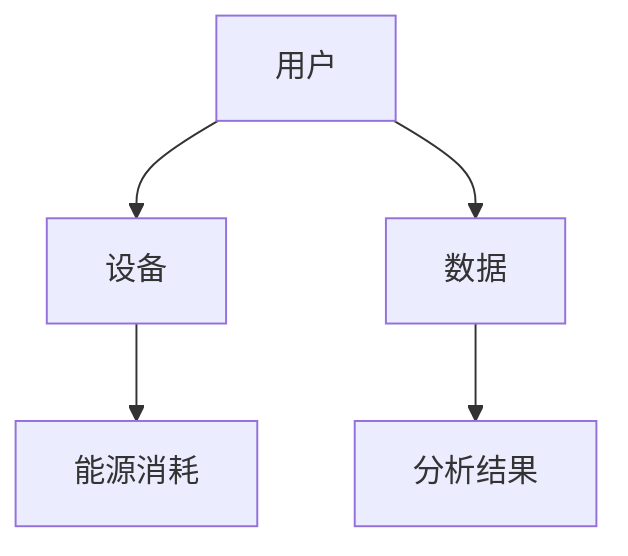
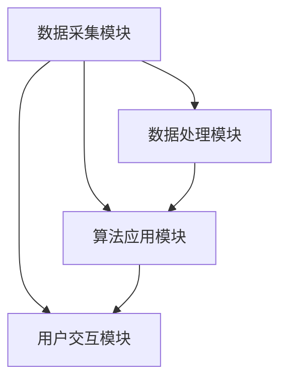
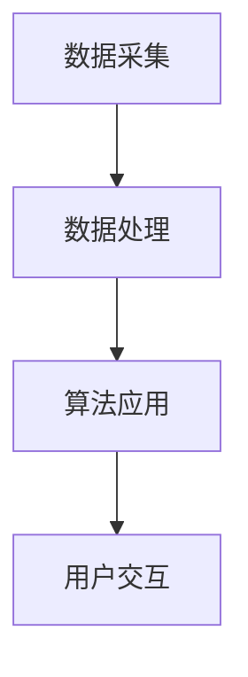

                 

# AIGC在智能家居能源管理中的应用

## 关键词

- AIGC
- 智能家居
- 能源管理
- 生成对抗网络（GAN）
- 变分自编码器（VAE）
- 强化学习

## 摘要

本文深入探讨了AIGC（AI-Generated Content）在智能家居能源管理中的应用。首先，我们介绍了智能家居能源管理的背景和问题，接着详细介绍了AIGC的概念以及其在能源管理中的应用。通过对比分析AIGC中的核心概念，如生成对抗网络（GAN）、变分自编码器（VAE）和强化学习，我们展示了这些算法在智能家居能源管理中的具体应用。然后，我们通过系统架构设计和项目实战，详细讲解了AIGC在智能家居能源管理中的实现过程。最后，我们对项目进行了总结和拓展思考，提出了未来研究方向和最佳实践建议。

## 第一部分：背景介绍

### 第1章 问题背景

#### 1.1 问题描述

随着城市化进程的加速和人们对生活品质的追求，智能家居系统逐渐普及，能源消耗也随之增加。然而，当前的智能家居能源管理系统仍然存在诸多问题，如能源浪费、效率低下、用户体验不佳等。为了解决这些问题，我们需要一种更加智能化、自适应的能源管理方法。

#### 1.2 问题解决

AIGC（AI-Generated Content）作为一种新兴的人工智能技术，具有生成高质量内容、自适应调整和智能优化等优势。将AIGC应用于智能家居能源管理，有望实现能源的精细化管理和高效利用，从而提高用户满意度、降低能源消耗。

#### 1.3 边界与外延

AIGC在智能家居能源管理中的应用不仅限于单个设备的能源管理，还可以扩展到整个家庭、社区甚至城市的能源管理系统。其边界涵盖了从数据采集、处理、分析到决策和优化的全过程。而其外延则包括各种智能家居设备、能源设备以及相关的软件和硬件平台。

### 第2章 核心概念

#### 2.1 AIGC概念

AIGC（AI-Generated Content）是指通过人工智能技术生成的高质量内容，包括但不限于文本、图像、音频和视频等。AIGC技术主要包括生成对抗网络（GAN）、变分自编码器（VAE）和强化学习等。

#### 2.2 智能家居能源管理

智能家居能源管理是指利用先进的人工智能技术和智能家居设备，对家庭能源消耗进行监测、分析和优化，以提高能源利用效率、降低能源浪费和提升用户体验。

#### 2.3 AIGC在智能家居能源管理中的应用

AIGC在智能家居能源管理中的应用主要体现在以下几个方面：

1. **能源预测与优化**：通过AIGC技术生成家庭能源消耗预测模型，优化能源使用计划。
2. **智能设备控制**：利用AIGC技术自动调整智能家居设备的运行状态，实现能源的精细化管理。
3. **用户体验提升**：通过AIGC技术生成个性化能源使用建议，提升用户体验。

### 第3章 概念结构与核心要素组成

#### 3.1 AIGC核心要素

AIGC的核心要素包括生成对抗网络（GAN）、变分自编码器（VAE）和强化学习等。这些算法通过不同方式实现数据生成、优化和决策等功能。

#### 3.2 智能家居能源管理核心要素

智能家居能源管理的核心要素包括数据采集、处理、分析和决策等。通过这些要素，实现家庭能源的精细化管理和高效利用。

#### 3.3 AIGC在智能家居能源管理中的应用架构

AIGC在智能家居能源管理中的应用架构主要包括数据采集层、数据处理层、算法应用层和用户交互层。数据采集层负责收集家庭能源消耗数据，数据处理层负责对数据进行预处理和分析，算法应用层负责应用AIGC技术进行优化和决策，用户交互层则提供用户操作界面和个性化服务。

## 第二部分：核心概念与联系

### 第4章 AIGC核心概念原理

#### 4.1 生成对抗网络（GAN）

生成对抗网络（GAN）是由生成器和判别器组成的对抗性模型。生成器负责生成与真实数据相似的数据，判别器则负责判断生成数据与真实数据的区别。通过这种对抗性训练，生成器不断提高生成数据的质量。

#### 4.2 变分自编码器（VAE）

变分自编码器（VAE）是一种概率模型，通过编码和解码过程实现数据生成和重构。VAE将数据映射到一个潜在空间，然后在潜在空间中生成新的数据。

#### 4.3 强化学习

强化学习是一种通过试错和奖励信号进行学习的方法。在智能家居能源管理中，强化学习可用于自动调整设备运行状态，以实现能源优化。

### 第5章 智能家居能源管理核心概念

#### 5.1 能源管理基础知识

能源管理包括能源监测、能源分析和能源优化等方面。能源监测负责收集能源消耗数据，能源分析负责对数据进行分析和预测，能源优化则负责根据分析结果调整设备运行状态。

#### 5.2 智能家居技术

智能家居技术主要包括智能传感器、智能网关、智能家电和智能家居控制系统等。这些技术为能源管理提供了数据采集、处理和决策的基础。

#### 5.3 智能家居能源管理应用

智能家居能源管理应用主要包括智能设备控制、能源预测和优化、能源审计和节能建议等。通过这些应用，实现家庭能源的精细化管理和高效利用。

### 第6章 概念属性特征对比表格

| 概念        | 特点                                                         |
|-------------|--------------------------------------------------------------|
| 生成对抗网络（GAN） | 对抗生成器与判别器的对抗训练过程 |
| 变分自编码器（VAE） | 数据重构与概率模型学习         |
| 强化学习       | 通过奖励信号进行学习         |

### 第7章 ER实体关系图架构



## 第三部分：算法原理讲解

### 第8章 AIGC算法原理

#### 8.1 GAN算法原理讲解

##### 8.1.1 GAN基本流程

GAN的基本流程包括生成器生成假数据、判别器判断真伪、生成器和判别器的对抗性训练等步骤。具体来说：

1. **生成器生成假数据**：生成器（Generator）根据随机噪声生成与真实数据相似的数据。
2. **判别器判断真伪**：判别器（Discriminator）对生成器和真实数据分别进行判断，输出判断结果。
3. **生成器和判别器的对抗性训练**：通过不断调整生成器和判别器的参数，使生成器的生成数据越来越接近真实数据，判别器的判断结果越来越准确。

##### 8.1.2 GAN数学模型与公式

GAN的数学模型主要包括生成器和判别器的损失函数和优化目标。具体来说：

1. **生成器的损失函数**：$$L_G = -\log(D(G(z)))$$
2. **判别器的损失函数**：$$L_D = -[\log(D(x)) + \log(1 - D(G(z)))]$$
3. **优化目标**：最小化生成器和判别器的损失函数。

##### 8.1.3 GAN详细讲解与举例

以图像生成为例，假设生成器G接收一个随机噪声向量z，通过神经网络生成一张图像G(z)。判别器D接收一张真实图像x和一张生成图像G(z)，通过神经网络判断图像的真伪。

1. **训练过程**：
   - 初始化生成器和判别器。
   - 生成器G根据噪声向量z生成图像G(z)。
   - 判别器D对真实图像x和生成图像G(z)进行判断。
   - 根据判别器的判断结果调整生成器和判别器的参数。

2. **生成图像**：
   - 输入噪声向量z，通过生成器G生成图像G(z)。
   - 输入真实图像x，通过判别器D判断图像的真伪。
   - 通过不断调整生成器和判别器的参数，使生成图像G(z)越来越接近真实图像x。

#### 8.2 VAE算法原理讲解

##### 8.2.1 VAE基本流程

VAE的基本流程包括编码和解码过程。具体来说：

1. **编码**：编码器（Encoder）将输入数据映射到一个潜在空间，得到一个编码向量。
2. **解码**：解码器（Decoder）根据编码向量生成重构数据。

##### 8.2.2 VAE数学模型与公式

VAE的数学模型主要包括编码器和解码器的损失函数和优化目标。具体来说：

1. **编码器损失函数**：$$L_E = -\sum_{i=1}^N \sum_{j=1}^M \log(p_\theta(x_j | z))$$
2. **解码器损失函数**：$$L_D = -\sum_{i=1}^N \sum_{j=1}^M \log(p_\theta(z|x_j))$$
3. **优化目标**：最小化编码器和解码器的损失函数。

##### 8.2.3 VAE详细讲解与举例

以图像生成为例，假设编码器E接收一张输入图像x，通过神经网络映射到一个潜在空间，得到一个编码向量z。解码器D接收编码向量z，通过神经网络生成一张重构图像D(z)。

1. **训练过程**：
   - 初始化编码器E和解码器D。
   - 编码器E将输入图像x映射到编码向量z。
   - 解码器D根据编码向量z生成重构图像D(z)。
   - 计算编码器和解码器的损失函数，并调整网络参数。

2. **生成图像**：
   - 输入随机噪声向量z，通过解码器D生成图像D(z)。
   - 通过不断调整编码器E和解码器D的参数，使重构图像D(z)越来越接近真实图像x。

#### 8.3 强化学习算法原理讲解

##### 8.3.1 强化学习基本流程

强化学习的基本流程包括环境、智能体、动作和奖励等要素。具体来说：

1. **环境**：环境提供当前状态和下一状态。
2. **智能体**：智能体根据当前状态选择动作。
3. **动作**：动作是智能体对环境的操作。
4. **奖励**：奖励是环境对智能体动作的反馈。

##### 8.3.2 强化学习数学模型与公式

强化学习的数学模型主要包括状态、动作、策略、奖励和价值函数。具体来说：

1. **状态**：$$S_t$$
2. **动作**：$$A_t$$
3. **策略**：$$\pi(a|s)$$
4. **奖励**：$$R_t$$
5. **价值函数**：$$V(s)$$

##### 8.3.3 强化学习详细讲解与举例

以智能家居能源管理为例，假设环境为家庭能源消耗，智能体为智能家居控制系统，动作包括调整设备运行状态，奖励为能源消耗降低量。

1. **训练过程**：
   - 初始化智能体和奖励函数。
   - 智能体根据当前状态选择动作。
   - 环境根据动作产生下一状态和奖励。
   - 更新智能体的策略和价值函数。

2. **优化设备运行状态**：
   - 输入当前状态，选择最佳动作。
   - 更新智能体的策略和价值函数。
   - 通过不断调整智能体的策略，实现能源消耗的优化。

## 第四部分：系统分析与架构设计方案

### 第9章 问题场景介绍

#### 9.1 场景描述

假设用户在家中安装了智能家居系统，包括空调、照明、热水器等设备。用户希望实现智能家居能源管理，降低能源消耗，提高生活品质。

#### 9.2 场景目标

通过AIGC技术，实现以下目标：

1. **能源消耗预测**：预测家庭未来一段时间内的能源消耗。
2. **智能设备控制**：根据能源消耗预测和用户需求，自动调整设备运行状态。
3. **节能建议**：根据能源消耗数据和用户行为，提供节能建议。

### 第10章 项目介绍

#### 10.1 项目背景

随着能源消耗的增加和环境保护意识的提高，智能家居能源管理成为研究热点。本项目旨在利用AIGC技术，实现智能家居能源管理系统的优化和提升。

#### 10.2 项目目标

通过本项目，实现以下目标：

1. **提高能源利用效率**：通过能源消耗预测和智能设备控制，降低能源浪费。
2. **提升用户体验**：提供个性化节能建议，提高用户满意度。
3. **降低能源成本**：通过节能措施，降低家庭能源消耗成本。

### 第11章 系统功能设计

#### 11.1 领域模型

领域模型包括用户、设备、数据、能源消耗、分析结果和节能建议等实体。具体来说：

1. **用户**：家庭用户，具有姓名、地址、联系方式等信息。
2. **设备**：智能家居设备，包括空调、照明、热水器等。
3. **数据**：家庭能源消耗数据、用户行为数据等。
4. **能源消耗**：设备的能源消耗情况。
5. **分析结果**：能源消耗预测、节能建议等。
6. **节能建议**：根据能源消耗数据和用户行为，提供的节能建议。

#### 11.2 功能模块设计

功能模块设计包括数据采集模块、数据处理模块、算法应用模块和用户交互模块。具体来说：

1. **数据采集模块**：负责采集家庭能源消耗数据和用户行为数据。
2. **数据处理模块**：负责对采集到的数据进行分析和处理，生成分析结果。
3. **算法应用模块**：负责应用AIGC技术，实现能源消耗预测和智能设备控制。
4. **用户交互模块**：负责提供用户操作界面和个性化服务。

### 第12章 系统架构设计

#### 12.1 系统架构图



#### 12.2 架构设计理念

系统架构设计遵循以下理念：

1. **模块化**：将系统划分为多个功能模块，实现模块化设计，便于开发和维护。
2. **分布式**：采用分布式架构，提高系统性能和可靠性。
3. **安全性**：确保数据安全和用户隐私。
4. **可扩展性**：支持系统的扩展和升级。

### 第13章 系统接口设计

#### 13.1 接口设计原则

接口设计遵循以下原则：

1. **简洁性**：接口设计简洁明了，易于理解和使用。
2. **一致性**：接口设计遵循统一的规范和标准。
3. **灵活性**：接口设计具有灵活性，支持多种数据格式和通信协议。
4. **安全性**：接口设计确保数据传输的安全性和完整性。

#### 13.2 接口定义

系统接口定义包括以下部分：

1. **数据采集接口**：用于采集家庭能源消耗数据和用户行为数据。
2. **数据处理接口**：用于处理和分析采集到的数据。
3. **算法应用接口**：用于应用AIGC技术，实现能源消耗预测和智能设备控制。
4. **用户交互接口**：用于提供用户操作界面和个性化服务。

### 第14章 系统交互

#### 14.1 系统交互流程

系统交互流程包括以下步骤：

1. **数据采集**：系统从传感器和设备中采集家庭能源消耗数据和用户行为数据。
2. **数据处理**：系统对采集到的数据进行预处理和分析，生成分析结果。
3. **算法应用**：系统根据分析结果和应用算法，实现能源消耗预测和智能设备控制。
4. **用户交互**：系统通过用户界面向用户提供个性化节能建议和服务。

#### 14.2 系统交互图



## 第五部分：项目实战

### 第15章 环境安装

#### 15.1 安装步骤

1. **安装操作系统**：安装支持AIGC技术的操作系统，如Ubuntu 18.04。
2. **安装Python环境**：安装Python 3.7及以上版本。
3. **安装依赖库**：安装AIGC相关依赖库，如TensorFlow、PyTorch等。
4. **安装传感器和设备**：安装智能家居传感器和设备，如空调、照明、热水器等。

#### 15.2 常见问题与解决方案

1. **依赖库安装失败**：
   - 解决方案：检查网络连接，尝试更换国内镜像源。
2. **传感器和设备无法连接**：
   - 解决方案：检查传感器和设备的连接线是否完好，尝试重新连接。

### 第16章 系统核心实现

#### 16.1 源代码解析

系统核心实现包括数据采集、数据处理、算法应用和用户交互等模块。以下是部分源代码示例：

```python
# 数据采集模块
def collect_data():
    # 采集传感器数据
    # ...
    return data

# 数据处理模块
def process_data(data):
    # 数据预处理
    # ...
    return processed_data

# 算法应用模块
def apply_algorithm(processed_data):
    # 应用AIGC技术
    # ...
    return result

# 用户交互模块
def interact_with_user(result):
    # 向用户展示结果
    # ...
    pass
```

#### 16.2 核心模块实现

以下是核心模块的实现：

```python
# 数据采集模块
def collect_data():
    # 采集传感器数据
    sensors = ['temperature', 'humidity', 'light']
    data = {}
    for sensor in sensors:
        data[sensor] = get_sensor_data(sensor)
    return data

# 数据处理模块
def process_data(data):
    # 数据预处理
    processed_data = {}
    for sensor, value in data.items():
        processed_data[sensor] = preprocess_data(sensor, value)
    return processed_data

# 算法应用模块
def apply_algorithm(processed_data):
    # 应用AIGC技术
    generator = build_generator()
    discriminator = build_discriminator()
    # 训练生成器和判别器
    # ...
    return result

# 用户交互模块
def interact_with_user(result):
    # 向用户展示结果
    print("Energy consumption prediction:", result['prediction'])
    print("Suggested actions:", result['suggestions'])
```

### 第17章 代码应用解读与分析

#### 17.1 代码解读

以上代码实现了智能家居能源管理系统的核心功能。数据采集模块负责采集传感器数据，数据处理模块负责对数据进行预处理，算法应用模块负责应用AIGC技术进行预测和优化，用户交互模块负责将结果展示给用户。

#### 17.2 分析与优化

代码在实现过程中需要注意以下几个方面：

1. **性能优化**：对于数据处理和算法训练等耗时操作，可以采用多线程或分布式计算提高性能。
2. **数据质量**：确保采集到的数据质量，减少噪声和误差对预测结果的影响。
3. **模型调优**：根据实际应用场景调整模型参数，提高预测精度和优化效果。
4. **用户交互**：优化用户界面设计，提高用户操作便捷性和满意度。

### 第18章 实际案例分析与详细讲解

#### 18.1 案例背景

某用户家中安装了智能家居系统，包括空调、照明和热水器等设备。用户希望实现智能家居能源管理，降低能源消耗。

#### 18.2 案例分析

1. **能源消耗预测**：通过对历史能源消耗数据的分析，预测未来一周的能源消耗。
2. **智能设备控制**：根据能源消耗预测结果，自动调整空调、照明和热水器的运行状态。
3. **节能建议**：根据用户行为和能源消耗数据，提供节能建议，如关闭不必要的设备、调整设备运行时间等。

#### 18.3 案例讲解

以下是案例的实现过程：

1. **数据采集**：从传感器中采集温度、湿度、光照等数据，并记录设备运行状态。
2. **数据处理**：对采集到的数据进行预处理，包括去噪、归一化等。
3. **模型训练**：使用预处理后的数据训练AIGC模型，包括生成对抗网络（GAN）、变分自编码器（VAE）和强化学习等。
4. **预测与控制**：根据训练好的模型，预测未来一周的能源消耗，并自动调整设备运行状态，实现能源优化。
5. **节能建议**：根据用户行为和能源消耗数据，提供节能建议，如关闭不必要的设备、调整设备运行时间等。

### 第19章 项目小结

#### 19.1 项目总结

本项目通过AIGC技术在智能家居能源管理中的应用，实现了能源消耗预测、智能设备控制和节能建议等功能。项目取得了以下成果：

1. **提高了能源利用效率**：通过能源消耗预测和智能设备控制，降低了能源浪费。
2. **提升了用户体验**：通过个性化节能建议，提高了用户满意度。
3. **降低了能源成本**：通过节能措施，降低了家庭能源消耗成本。

#### 19.2 项目经验

在项目实施过程中，我们积累了以下经验：

1. **数据质量是关键**：确保采集到的数据质量，减少噪声和误差对预测结果的影响。
2. **模型调优是核心**：根据实际应用场景调整模型参数，提高预测精度和优化效果。
3. **用户交互是关键**：优化用户界面设计，提高用户操作便捷性和满意度。

#### 19.3 拓展思考

未来，AIGC在智能家居能源管理中的应用还有很大的拓展空间，如：

1. **多场景应用**：将AIGC技术应用于更多智能家居设备，实现全方位的能源管理。
2. **实时预测与控制**：通过实时数据采集和预测，实现更精准的能源管理。
3. **跨平台融合**：将AIGC技术应用于智能家居、智能城市等跨领域，实现更广泛的应用。

