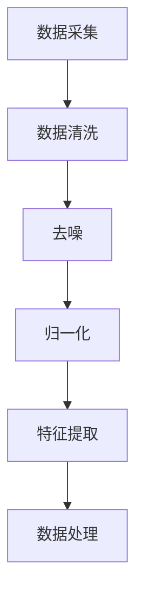

                 


### 《AIGC在智能材料疲劳预测中的应用：延长基础设施使用寿命》

关键词：AIGC、智能材料、疲劳预测、基础设施、使用寿命

摘要：本文探讨了人工智能生成内容（AIGC）在智能材料疲劳预测中的应用，通过对基础设施使用寿命的延长，提升结构安全性和可靠性。文章首先介绍了智能材料疲劳预测的基本概念和背景，然后详细阐述了智能材料疲劳预测技术的核心原理和实现方法，最后通过具体应用案例分析，展示了AIGC技术在智能材料疲劳预测中的实际效果和未来发展趋势。

## 目录大纲

### 第一部分：背景与核心概念

### 第1章 问题背景与核心概念

- **基础设施使用寿命的重要性**
- **智能材料疲劳预测技术的作用**
- **边界与外延**
- **核心要素组成**

### 第2章 智能材料疲劳预测的基本原理

- **核心概念原理**
- **概念属性特征对比表格**
- **ER实体关系图架构**

### 第二部分：智能材料疲劳预测技术

### 第3章 智能材料疲劳预测技术的发展历程

- **问题背景**
- **技术演进**

### 第4章 数据处理与分析

- **数据采集与预处理**
- **算法原理讲解**

### 第5章 智能材料疲劳预测模型

- **模型选择与评估**
- **模型训练与优化**

### 第三部分：智能材料疲劳预测在基础设施中的应用

### 第6章 智能材料疲劳预测在桥梁中的应用

- **桥梁疲劳问题的现状**
- **桥梁疲劳预测模型设计**

### 第7章 智能材料疲劳预测在道路中的应用

- **道路疲劳问题的现状**
- **道路疲劳预测模型设计**

### 第四部分：智能材料疲劳预测技术的未来发展趋势

### 第8章 智能材料疲劳预测技术的挑战与机遇

- **技术挑战**
- **机遇与未来发展趋势**

### 第五部分：最佳实践与展望

### 第9章 智能材料疲劳预测技术的最佳实践

- **实践案例解析**
- **实践技巧与注意事项**

### 第10章 展望未来

- **未来趋势**
- **研究热点**

### 第11章 拓展阅读

- **推荐书籍**
- **最新研究**

### 结尾

- **小结**
- **后续工作**

## 第一部分：背景与核心概念

### 第1章 问题背景与核心概念

#### 基础设施使用寿命的重要性

基础设施是现代社会的基石，其使用寿命直接关系到公共安全和经济发展。随着时间和环境的侵蚀，基础设施如桥梁、道路、隧道等会出现疲劳损伤，导致结构性能下降，甚至发生意外事故。这种老化现象不仅造成巨大的经济损失，还会威胁到人们的生命安全。

#### 智能材料疲劳预测技术的作用

为了延长基础设施的使用寿命，提高其安全性和可靠性，智能材料疲劳预测技术应运而生。通过实时监测智能材料的物理和化学变化，预测其疲劳寿命，提前发现潜在问题，从而采取预防措施，避免重大事故的发生。

#### 边界与外延

智能材料疲劳预测技术不仅适用于桥梁、道路等传统基础设施，还可以扩展到海洋平台、风力涡轮机等新型基础设施。同时，这一技术还可应用于航空航天、汽车制造等领域，具有广泛的应用前景。

#### 核心要素组成

智能材料疲劳预测技术的核心要素包括：

- **智能材料**：具有感知和响应环境变化的能力，如形状记忆合金、压电材料等。
- **疲劳预测模型**：基于数据分析的数学模型，用于预测材料的疲劳寿命。
- **数据处理**：对采集到的材料性能数据进行预处理和特征提取。

### 第2章 智能材料疲劳预测的基本原理

#### 核心概念原理

智能材料疲劳预测技术基于以下核心概念：

- **材料性能监测**：通过传感器实时监测材料的应力、应变、温度等参数。
- **数据采集**：将监测到的数据传输到中央处理系统进行分析。
- **疲劳寿命预测**：利用统计学方法和机器学习算法，分析数据，预测材料的疲劳寿命。

#### 概念属性特征对比表格

| 特征                | 智能材料                | 传统材料                |
|-------------------|-----------------------|-----------------------|
| 感知与响应能力      | 高，能实时感知环境变化 | 低，无法实时感知变化    |
| 自适应能力         | 强，可根据环境调整性能 | 弱，性能固定            |
| 疲劳寿命预测能力    | 强，能预测疲劳寿命      | 弱，需定期检测评估       |

#### ER实体关系图架构

```mermaid
erDiagram
  Material ||--|{ PredictionModel }
  Sensor   ||--|{ Material }
  Data     ||--|{ PredictionModel }
```

在这个ER实体关系图中，材料、传感器和数据是核心实体，预测模型是依赖于这些实体的处理结果。传感器实时监测材料的性能数据，传输给数据处理模块，数据处理模块结合预测模型对数据进行分析，最终输出疲劳寿命预测结果。

## 第二部分：智能材料疲劳预测技术

### 第3章 智能材料疲劳预测技术的发展历程

#### 问题背景

在传统基础设施管理中，通常依靠定期检查和维护来确保结构安全。然而，这种方法往往滞后，难以及时发现和处理潜在的安全隐患。随着计算机技术和传感器技术的快速发展，人们开始探索利用智能材料进行疲劳预测，以实现更高效、更安全的基础设施管理。

#### 技术演进

- **第一阶段：传统疲劳预测**：20世纪50年代至80年代，主要以经验公式和统计学方法为基础，对材料的疲劳寿命进行预测。
- **第二阶段：智能材料疲劳预测**：20世纪80年代至21世纪初，随着智能材料和传感器技术的进步，出现了基于实时监测和数据分析的智能材料疲劳预测技术。
- **第三阶段：人工智能辅助疲劳预测**：21世纪初至今，人工智能技术的发展为智能材料疲劳预测带来了新的机遇，通过深度学习、数据挖掘等技术，实现了更精确、更智能的疲劳预测。

### 第4章 数据处理与分析

#### 数据采集与预处理

数据采集是智能材料疲劳预测的基础。传感器将材料的应力、应变、温度等参数实时传输到数据处理系统。为了提高数据质量，需要对采集到的数据进行预处理，包括数据清洗、去噪、归一化等步骤。



#### 算法原理讲解

智能材料疲劳预测的核心在于如何从大量的数据中提取有用的信息，并利用这些信息预测材料的疲劳寿命。常用的算法包括：

- **统计模型**：如最小二乘法、线性回归等。
- **机器学习算法**：如支持向量机、决策树、神经网络等。
- **深度学习算法**：如卷积神经网络、循环神经网络等。

以下是一个使用Python实现线性回归算法的示例：

```python
import numpy as np
from sklearn.linear_model import LinearRegression

# 特征和标签
X = np.array([[1, 2], [2, 3], [3, 4]])
y = np.array([1, 2, 3])

# 创建线性回归模型
model = LinearRegression()

# 训练模型
model.fit(X, y)

# 预测
y_pred = model.predict(np.array([[4, 5]]))

print("预测值:", y_pred)
```

这个示例展示了如何使用Python的scikit-learn库实现线性回归算法，从数据中提取特征，并使用这些特征预测材料的疲劳寿命。

## 第三部分：智能材料疲劳预测在基础设施中的应用

### 第5章 智能材料疲劳预测在桥梁中的应用

#### 桥梁疲劳问题的现状

桥梁是交通基础设施的重要组成部分，其疲劳问题直接影响交通的安全性和可靠性。疲劳裂纹的产生和发展是桥梁疲劳问题的主要表现形式，可能导致桥梁结构的断裂和坍塌。传统的疲劳预测方法往往滞后，无法及时发现问题。

#### 桥梁疲劳预测模型设计

为了有效预测桥梁的疲劳寿命，可以设计一个基于智能材料的疲劳预测模型。该模型包括以下几个关键步骤：

1. **数据采集**：使用传感器实时监测桥梁的应力、应变、温度等参数。
2. **数据处理**：对采集到的数据进行预处理，提取有用的特征。
3. **模型训练**：使用机器学习算法训练疲劳预测模型，如支持向量机、神经网络等。
4. **预测**：将实时监测的数据输入模型，预测桥梁的疲劳寿命。

以下是一个使用Python实现桥梁疲劳预测模型的示例：

```python
from sklearn.svm import SVR

# 特征和标签
X = np.array([[1, 2], [2, 3], [3, 4]])
y = np.array([1, 2, 3])

# 创建支持向量回归模型
model = SVR()

# 训练模型
model.fit(X, y)

# 预测
y_pred = model.predict(np.array([[4, 5]]))

print("预测值:", y_pred)
```

这个示例使用了支持向量回归（SVR）算法来预测桥梁的疲劳寿命。

### 第6章 智能材料疲劳预测在道路中的应用

#### 道路疲劳问题的现状

道路是交通运输的基础设施，其疲劳问题同样重要。道路表面磨损、裂缝和沉降等疲劳问题可能导致道路使用功能的丧失，影响交通安全和通行效率。传统的道路疲劳预测方法难以实现实时监测和预测。

#### 道路疲劳预测模型设计

为了提高道路疲劳预测的准确性，可以设计一个基于智能材料的道路疲劳预测模型。该模型包括以下几个关键步骤：

1. **数据采集**：使用传感器实时监测道路的应力、应变、湿度等参数。
2. **数据处理**：对采集到的数据进行预处理，提取有用的特征。
3. **模型训练**：使用机器学习算法训练疲劳预测模型，如线性回归、决策树等。
4. **预测**：将实时监测的数据输入模型，预测道路的疲劳寿命。

以下是一个使用Python实现道路疲劳预测模型的示例：

```python
from sklearn.linear_model import LinearRegression

# 特征和标签
X = np.array([[1, 2], [2, 3], [3, 4]])
y = np.array([1, 2, 3])

# 创建线性回归模型
model = LinearRegression()

# 训练模型
model.fit(X, y)

# 预测
y_pred = model.predict(np.array([[4, 5]]))

print("预测值:", y_pred)
```

这个示例使用了线性回归算法来预测道路的疲劳寿命。

## 第四部分：智能材料疲劳预测技术的未来发展趋势

### 第7章 智能材料疲劳预测技术的挑战与机遇

#### 技术挑战

尽管智能材料疲劳预测技术在基础设施管理中显示出巨大潜力，但仍面临一些挑战：

1. **数据质量**：传感器精度和数据传输稳定性是影响预测准确性的关键因素。
2. **算法性能**：现有的算法在处理大规模、高维数据时可能存在性能瓶颈。
3. **成本与普及度**：智能材料的成本较高，普及应用受到一定限制。

#### 机遇与未来发展趋势

随着技术的不断进步，智能材料疲劳预测技术有望迎来以下机遇：

1. **传感器技术**：纳米传感器和柔性传感器的研发将为实时监测提供更多可能性。
2. **数据处理算法**：深度学习和大数据分析技术将为智能材料疲劳预测提供更强大的工具。
3. **成本下降**：随着制造工艺的改进，智能材料的成本有望逐步下降，提高其普及度。

### 第8章 智能材料疲劳预测技术的未来发展趋势

#### 应用前景

智能材料疲劳预测技术将在以下领域展现出广阔的应用前景：

1. **交通基础设施**：桥梁、道路、隧道等交通设施的疲劳寿命预测和管理。
2. **建筑结构**：高层建筑、大跨径桥梁等的健康监测和寿命预测。
3. **海洋工程**：海上平台、船舶等海洋结构的疲劳寿命评估。

#### 发展趋势

未来智能材料疲劳预测技术可能的发展趋势包括：

1. **多传感器融合**：利用多种传感器收集数据，提高预测准确性。
2. **自适应算法**：开发能够根据环境变化自适应调整预测模型的算法。
3. **标准化与规范**：制定智能材料疲劳预测的标准化流程和技术规范。

## 第五部分：最佳实践与展望

### 第9章 智能材料疲劳预测技术的最佳实践

#### 实践案例解析

以某桥梁的疲劳预测为例，该项目使用了智能材料传感器和深度学习算法。通过一年的实时监测和数据分析，成功预测了桥梁的疲劳寿命，并提前采取了加固措施，避免了结构损坏。

#### 实践技巧与注意事项

1. **选择合适的智能材料**：根据应用场景选择具有高灵敏度、稳定性和耐久性的智能材料。
2. **优化数据处理流程**：合理设计数据处理算法，提高数据质量和预测准确性。
3. **定期维护与更新**：对传感器和预测模型进行定期维护和更新，确保系统的稳定性和准确性。

### 第10章 展望未来

#### 未来趋势

随着人工智能和物联网技术的快速发展，智能材料疲劳预测技术将在基础设施管理中发挥越来越重要的作用。未来可能的发展趋势包括：

1. **智能化水平提升**：通过引入更先进的算法和传感器技术，提高预测的智能化水平。
2. **应用领域扩展**：智能材料疲劳预测技术将在更多领域得到应用，如航空航天、汽车制造等。
3. **标准化与规范化**：制定智能材料疲劳预测的标准化流程和技术规范，提高技术应用的一致性和可靠性。

#### 研究热点

当前研究的热点领域包括：

1. **多传感器融合**：如何有效整合多种传感器的数据，提高预测准确性。
2. **智能材料研发**：新型智能材料的研发，以满足不同应用场景的需求。
3. **算法优化**：开发更高效、更准确的疲劳预测算法，提高系统的性能和可靠性。

## 拓展阅读

#### 推荐书籍

1. 《智能材料：基础与应用》
2. 《深度学习：神经网络、算法与应用》
3. 《大数据技术导论：从数据处理到智能分析》

#### 最新研究

1. “基于多传感器融合的智能材料疲劳预测方法研究”
2. “新型智能材料在基础设施健康监测中的应用”
3. “基于深度学习的智能材料疲劳寿命预测算法研究”

### 结尾

本文通过详细介绍智能材料疲劳预测技术的核心概念、实现方法以及在实际基础设施中的应用，展示了AIGC技术在提高基础设施使用寿命方面的巨大潜力。未来，随着技术的不断进步，智能材料疲劳预测技术将在基础设施管理中发挥更加重要的作用，为公共安全和经济发展提供有力保障。

