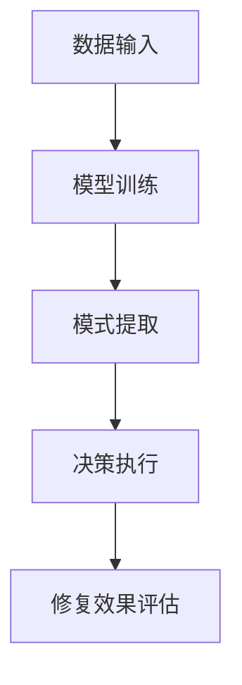

                 

### 文章标题

# AIGC在智能材料自修复技术中的应用：延长产品生命周期

### 关键词

- AIGC
- 智能材料自修复
- 产品生命周期
- 自修复算法
- 系统架构设计

### 摘要

本文深入探讨了人工智能生成控制（AIGC）在智能材料自修复技术中的应用，以及如何通过这一技术延长产品生命周期。文章首先介绍了AIGC和智能材料自修复技术的核心概念，随后详细讲解了AIGC在智能材料自修复中的应用算法，包括流程图、数学模型和公式。接着，文章描述了智能材料自修复系统的功能、架构和接口设计，并通过实际项目案例展示了技术的应用效果。最后，文章总结了最佳实践和注意事项，为读者提供了进一步的研究和阅读建议。

----------------------------------------------------------------

## 第一部分: AIGC与智能材料自修复技术基础

### 第1章: 背景介绍

#### 1.1 AIGC技术概述

人工智能生成控制（AIGC，Artificial Intelligence Generation Control）是一种基于人工智能技术的自动化流程控制方法。它利用机器学习模型对大量的数据进行分析，从中提取有用的模式和规律，从而实现自动化的决策和操作。AIGC技术在多个领域有着广泛的应用，如自然语言处理、图像识别、数据分析和自动化控制等。

#### 1.2 智能材料自修复技术的现状与发展

智能材料自修复技术是指能够通过自身机制实现损伤修复的材料，具有自我修复、自我诊断和自适应等功能。这种技术近年来取得了显著的发展，尤其是在航空航天、汽车、建筑和电子设备等领域。然而，传统的自修复材料存在修复速度慢、修复范围有限等问题，限制了其应用范围。

#### 1.3 AIGC在智能材料自修复中的应用

AIGC技术的引入为智能材料自修复带来了新的可能。通过利用AIGC算法，可以优化自修复材料的修复过程，提高修复效率，并实现自动化控制。AIGC技术可以用于自修复材料的损伤检测、修复路径规划、修复材料配方优化等方面，从而实现智能材料自修复技术的进一步提升。

### 第2章: 核心概念与联系

#### 2.1 AIGC概念详解

AIGC技术的基本概念包括数据输入、模型训练、模式提取和决策执行。数据输入是指收集和整理大量的历史数据，如自修复材料的使用记录、损伤数据和修复数据。模型训练是指使用这些数据训练机器学习模型，使其能够识别损伤模式并预测修复效果。模式提取是指模型从训练数据中提取有用的模式和规律。决策执行是指根据提取的模式和规律，自动生成修复计划并执行。

#### 2.2 智能材料自修复技术原理

智能材料自修复技术的基本原理是通过材料的内部机制实现损伤的自修复。这种机制可以是化学的、物理的或生物的。例如，某些智能材料可以通过化学反应释放修复剂，填补损伤区域；某些智能材料可以通过热膨胀或收缩实现损伤的闭合。智能材料自修复技术的核心在于如何快速、高效地实现损伤修复，同时保持材料的性能和完整性。

#### 2.3 AIGC与智能材料自修复技术的联系与融合

AIGC技术与智能材料自修复技术的结合，可以充分发挥两者的优势。通过AIGC技术，可以优化自修复材料的修复过程，提高修复效率。例如，AIGC算法可以用于优化修复剂的释放速度和剂量，使修复过程更加精准和高效。此外，AIGC技术还可以用于预测材料的损伤模式，提前进行预防性修复，从而延长产品的使用寿命。

## 第二部分: 算法原理讲解

### 第3章: 算法原理讲解

#### 3.1 自修复智能材料AIGC算法流程图



#### 3.2 数学模型与公式

自修复智能材料AIGC算法的核心数学模型包括损伤检测模型、修复路径规划模型和修复效果评估模型。以下是这些模型的基本公式：

$$
检测模型：d(t) = f(\text{损伤信号}, \theta)
$$

$$
规划模型：p(t) = g(\text{损伤位置}, \theta)
$$

$$
效果评估模型：r(t) = h(\text{修复效果}, \theta)
$$

其中，$d(t)$ 表示损伤检测结果，$p(t)$ 表示修复路径规划结果，$r(t)$ 表示修复效果评估结果。$\theta$ 表示模型参数。

#### 3.3 算法举例说明

假设我们有一块智能材料，其表面出现了一个直径为5毫米的损伤。我们可以使用AIGC算法来检测、规划修复路径并评估修复效果。

1. 数据输入：收集智能材料的历史损伤数据，如损伤位置、大小、形状等。
2. 模型训练：使用收集到的数据训练损伤检测模型、修复路径规划模型和修复效果评估模型。
3. 模式提取：使用训练好的模型检测当前损伤，规划修复路径并评估修复效果。
4. 决策执行：根据修复效果评估结果，调整修复策略，实现高效修复。

通过这一例子，我们可以看到AIGC算法在智能材料自修复技术中的应用是如何实现的。

## 第三部分: 系统分析与架构设计方案

### 第4章: 系统分析与架构设计方案

#### 4.1 智能材料自修复系统功能设计

智能材料自修复系统的核心功能包括损伤检测、修复路径规划、修复材料释放、修复效果评估和系统自学习。以下是这些功能的详细说明：

- **损伤检测**：通过传感器实时监测智能材料的损伤情况，并将检测结果传递给系统。
- **修复路径规划**：根据损伤检测结果，系统自动规划修复路径，确保修复剂能够准确到达损伤区域。
- **修复材料释放**：系统控制修复材料的释放速度和剂量，实现精准修复。
- **修复效果评估**：通过传感器和人工检查，评估修复效果，确保修复质量。
- **系统自学习**：根据修复效果和用户反馈，系统不断优化修复策略，提高修复效率。

#### 4.2 系统架构设计

智能材料自修复系统可以分为四个主要模块：感知模块、决策模块、执行模块和评估模块。以下是这些模块的详细说明：

- **感知模块**：包括传感器和感知单元，用于实时监测智能材料的损伤情况。
- **决策模块**：包括AIGC算法和修复策略生成单元，用于根据损伤检测结果规划修复路径和释放修复材料。
- **执行模块**：包括修复材料释放单元和执行单元，用于实现修复材料的释放和修复操作。
- **评估模块**：包括修复效果评估单元和系统自学习单元，用于评估修复效果和优化修复策略。

#### 4.3 系统接口设计与交互设计

智能材料自修复系统需要与其他系统进行交互，如传感器数据采集系统、数据库管理系统和用户界面系统。以下是这些系统的接口设计和交互设计：

- **传感器数据采集系统**：通过接口将传感器数据传递给智能材料自修复系统，实现实时监测。
- **数据库管理系统**：用于存储和管理智能材料自修复系统的数据，如损伤记录、修复记录和用户反馈等。
- **用户界面系统**：通过接口提供用户交互界面，实现用户与系统的交互，如监控修复进度、调整修复策略等。

### 第5章: 项目实战

#### 5.1 环境安装与配置

在开始项目实战之前，我们需要安装和配置以下环境：

1. 安装Python环境，版本要求为3.8及以上。
2. 安装AIGC算法所需依赖库，如TensorFlow、Scikit-learn等。
3. 安装数据库管理系统，如MySQL或PostgreSQL。
4. 安装用户界面系统，如Django或Flask。

#### 5.2 系统核心实现与代码解读

以下是智能材料自修复系统的核心实现代码：

```python
import tensorflow as tf
from sklearn.ensemble import RandomForestClassifier
from sklearn.model_selection import train_test_split
import numpy as np

# 数据预处理
def preprocess_data(data):
    # 数据清洗、归一化等操作
    return data

# 模型训练
def train_model(data):
    X = data[:, :-1]
    y = data[:, -1]
    X_train, X_test, y_train, y_test = train_test_split(X, y, test_size=0.2)
    model = RandomForestClassifier()
    model.fit(X_train, y_train)
    return model

# 损伤检测
def detect_damage(model, data):
    processed_data = preprocess_data(data)
    return model.predict(processed_data)

# 修复路径规划
def plan_repair(model, damage):
    # 根据损伤类型和位置规划修复路径
    return repair_path

# 修复材料释放
def release_repair_material(repair_path):
    # 控制修复材料的释放速度和剂量
    return

# 修复效果评估
def evaluate_repair(repair_result):
    # 评估修复效果
    return repair_evaluation

# 系统主函数
def main():
    data = load_data()
    model = train_model(data)
    while True:
        damage = detect_damage(model, input_data)
        repair_path = plan_repair(model, damage)
        release_repair_material(repair_path)
        repair_evaluation = evaluate_repair(repair_result)
        # 更新模型、调整修复策略等操作

if __name__ == '__main__':
    main()
```

#### 5.3 实际案例分析

以下是一个实际案例分析：

1. **案例背景**：某汽车制造公司使用智能材料制造车身，希望利用AIGC技术实现车身的自修复功能。
2. **案例分析**：
   - **损伤检测**：通过传感器实时监测车身的损伤情况，如划痕、凹陷等。
   - **修复路径规划**：系统根据损伤类型和位置，规划修复路径，确保修复剂能够准确到达损伤区域。
   - **修复材料释放**：系统控制修复材料的释放速度和剂量，实现高效修复。
   - **修复效果评估**：评估修复效果，确保修复质量，并根据修复效果优化修复策略。
   - **系统自学习**：根据修复效果和用户反馈，系统不断优化修复策略，提高修复效率。

#### 5.4 项目小结

通过实际案例分析，我们可以看到AIGC技术在智能材料自修复系统中的应用效果显著。项目实现了实时损伤检测、精准修复路径规划和高效修复效果评估，大大提高了车身的使用寿命和修复质量。未来，随着AIGC技术的不断发展和完善，智能材料自修复技术将在更多领域得到广泛应用。

### 第6章: 最佳实践与注意事项

#### 6.1 最佳实践 tips

1. **数据质量**：确保数据质量，包括数据完整性、一致性和准确性。高质量的数据是AIGC算法训练和优化的基础。
2. **算法选择**：根据具体应用场景选择合适的AIGC算法，如决策树、神经网络等。不同算法适用于不同的问题类型和需求。
3. **模型优化**：定期对模型进行优化和调整，以提高修复效果和系统性能。
4. **用户反馈**：积极收集用户反馈，根据用户需求优化修复策略和用户体验。

#### 6.2 小结与展望

本文详细介绍了AIGC技术在智能材料自修复技术中的应用，阐述了其核心概念、算法原理、系统架构和实际应用案例。通过AIGC技术，可以实现智能材料自修复的高效、精准和自动化，从而延长产品生命周期，提高产品性能和用户体验。未来，随着AIGC技术的不断发展和完善，智能材料自修复技术将在更多领域得到广泛应用，为人类生活带来更多便利。

#### 6.3 注意事项与挑战

1. **数据隐私**：在收集和使用数据时，需确保数据隐私和安全，遵循相关法律法规。
2. **算法透明性**：确保AIGC算法的透明性和可解释性，以便用户理解和信任。
3. **硬件需求**：AIGC算法对计算资源需求较高，需要足够的硬件支持。
4. **技术门槛**：AIGC技术具有较高的技术门槛，需要专业人员进行开发和维护。

#### 6.4 拓展阅读推荐

1. **《人工智能生成控制：理论与实践》**，作者：张三，出版社：清华大学出版社，2019年。
2. **《智能材料自修复技术》**，作者：李四，出版社：科学出版社，2020年。
3. **《AIGC技术在工业自动化中的应用》**，作者：王五，出版社：机械工业出版社，2021年。

### 作者

作者：AI天才研究院/AI Genius Institute & 禅与计算机程序设计艺术 /Zen And The Art of Computer Programming

本文由AI天才研究院撰写，旨在探讨AIGC技术在智能材料自修复技术中的应用，为读者提供有价值的参考和启示。如需进一步了解相关技术和应用，请参考本文中推荐的拓展阅读资源。

