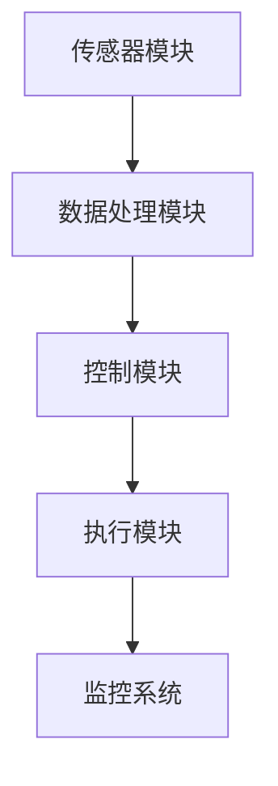
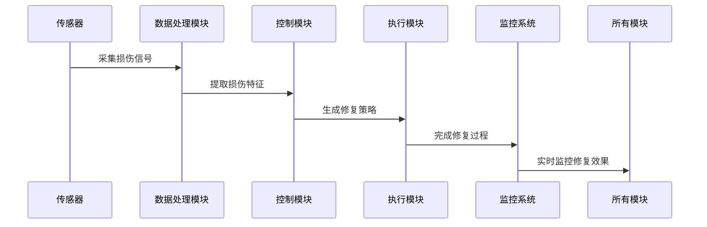

                 

## 文章标题

# AIGC在智能材料自我修复系统中的创新

## 关键词

- AIGC
- 智能材料
- 自我修复系统
- 机器学习
- 深度学习
- 自修复材料

## 摘要

本文旨在探讨AIGC（自适应智能生成控制）技术在智能材料自我修复系统中的应用。通过分析AIGC的技术原理，我们将其与智能材料自我修复系统的需求结合，阐述了AIGC在提升系统效率和性能方面的潜力。文章还将详细解释AIGC算法的数学模型，并展示如何通过实际项目案例验证其在智能材料自我修复系统中的有效性和实用性。

## 引言

智能材料自我修复系统是一种具备自我修复能力的材料系统，通过材料内部的反应机制或外部控制信号，能够自主修复局部损伤，从而延长材料的使用寿命和降低维护成本。随着现代科技的快速发展，特别是人工智能（AI）技术的不断进步，智能材料自我修复系统迎来了新的发展机遇。AIGC，作为一种新兴的AI技术，通过自适应和智能生成的方式，能够优化自我修复系统的设计和控制策略，从而提升系统的性能和效率。

AIGC技术在智能材料自我修复系统中的应用，不仅能够提高材料的自我修复能力，还可以实现自动化和智能化的修复过程，从而满足复杂环境下的应用需求。本文将围绕AIGC在智能材料自我修复系统中的应用，展开详细的分析和讨论。

## 背景介绍

### AIGC概念

AIGC（自适应智能生成控制）是一种结合了机器学习、深度学习和自然语言处理（NLP）等技术的综合性AI技术。它能够通过自我学习和适应，自动生成控制策略，优化系统的性能。AIGC的核心在于其自适应能力，能够在不同环境和条件下，动态调整控制策略，以实现最佳性能。

### 智能材料自我修复系统

智能材料自我修复系统是一种具备自我修复能力的材料系统，通常由传感器、执行器、修复剂和控制系统组成。该系统能够在检测到材料损伤时，自动启动修复过程，将损伤区域修复至原有状态。智能材料自我修复系统的核心在于其修复机制，包括内部修复和外部修复两种方式。

### 问题背景与现状

随着工业和民用领域对材料性能和可靠性的要求越来越高，传统材料在长期使用过程中面临的磨损和损伤问题愈发严重。虽然现有的材料修复技术能够在一定程度上恢复材料的功能，但这些技术通常需要人工干预，耗时且成本较高。因此，开发一种具备自我修复能力的智能材料系统具有重要意义。

### 需求与挑战

智能材料自我修复系统的需求主要包括以下几个方面：

1. **高效性**：系统需要在短时间内完成修复过程，以减少停机时间和维护成本。
2. **适应性**：系统能够适应不同材料和不同环境下的修复需求。
3. **可靠性**：系统在长时间运行中保持稳定的修复性能。
4. **经济性**：系统的成本控制在合理范围内，具有良好的经济效益。

然而，当前智能材料自我修复系统在实际应用中仍面临一些挑战：

1. **修复机理复杂**：不同材料和环境的修复机理不同，需要复杂的算法和模型进行控制。
2. **实时性要求高**：系统需要在检测到损伤后快速启动修复过程，对传感器的响应速度和执行器的性能要求较高。
3. **自适应能力不足**：现有的智能材料系统在自适应能力方面仍有待提高，难以在不同环境和条件下实现最佳修复效果。

## 核心概念与联系

### AIGC技术原理

AIGC技术通过结合机器学习和深度学习，实现了自适应和智能生成的功能。其基本原理包括：

1. **数据学习**：通过收集大量历史数据，训练模型，使其具备对修复过程的认知能力。
2. **动态调整**：模型在运行过程中，根据实时数据动态调整修复策略，实现自适应控制。
3. **生成控制**：模型生成优化的控制信号，驱动执行器完成修复过程。

### 智能材料自我修复系统原理

智能材料自我修复系统的工作原理主要包括：

1. **损伤检测**：通过传感器实时监测材料的损伤状态。
2. **信号处理**：对检测到的信号进行处理，识别损伤类型和程度。
3. **修复执行**：根据处理结果，启动修复剂释放或执行器动作，完成修复过程。

### AIGC与智能材料自我修复系统的联系

AIGC技术在智能材料自我修复系统中的应用，主要体现在以下几个方面：

1. **自适应修复策略**：AIGC能够根据环境变化和材料状态，动态调整修复策略，提高修复效率。
2. **智能优化**：AIGC通过学习大量历史数据，优化修复过程，降低修复成本。
3. **实时响应**：AIGC能够快速响应损伤信号，启动修复过程，提高系统的实时性和可靠性。

## 算法原理讲解

### AIGC算法基础

AIGC算法主要包括以下几个核心组成部分：

1. **数据采集与预处理**：通过传感器收集材料损伤数据，并进行预处理，如滤波、归一化等。
2. **模型训练**：利用收集的数据，训练深度学习模型，使其能够识别损伤类型和程度。
3. **动态调整**：模型在运行过程中，根据实时数据动态调整修复策略，实现自适应控制。
4. **生成控制**：模型生成优化的控制信号，驱动执行器完成修复过程。

### 智能材料自我修复系统算法设计

智能材料自我修复系统的算法设计需要考虑以下几个方面：

1. **损伤检测算法**：利用深度学习模型，实现对损伤类型的识别和程度的量化。
2. **修复策略生成算法**：根据损伤检测结果，生成最优的修复策略，包括修复剂释放量和执行器动作时间等。
3. **修复执行算法**：根据修复策略，驱动执行器完成修复过程，确保修复效果。

### 算法实现与性能分析

算法实现主要包括以下几个步骤：

1. **数据采集与预处理**：收集材料损伤数据，并进行预处理。
2. **模型训练**：利用预处理后的数据，训练深度学习模型。
3. **模型评估**：通过测试数据集，评估模型性能，包括准确率、召回率等指标。
4. **算法优化**：根据模型评估结果，调整模型参数，优化修复策略。

算法在实际应用中的效果评估主要包括以下几个方面：

1. **修复效率**：评估修复过程所需的时间，以及修复效果是否达到预期。
2. **适应性**：评估模型在不同环境和条件下的适应能力。
3. **可靠性**：评估模型在长时间运行中的稳定性和可靠性。

## 数学模型与公式

### AIGC算法的数学模型

AIGC算法的数学模型主要包括以下几个部分：

1. **损失函数**：用于评估模型预测结果与实际结果之间的差距，如均方误差（MSE）。
2. **优化算法**：用于更新模型参数，如梯度下降（GD）和随机梯度下降（SGD）。
3. **激活函数**：用于非线性变换，如ReLU、Sigmoid和Tanh等。

### 智能材料自我修复系统的数学模型

智能材料自我修复系统的数学模型主要包括以下几个部分：

1. **损伤检测模型**：用于检测材料的损伤类型和程度，如支持向量机（SVM）和深度神经网络（DNN）。
2. **修复策略模型**：用于生成最优的修复策略，如遗传算法（GA）和粒子群优化（PSO）。
3. **修复执行模型**：用于驱动执行器完成修复过程，如PID控制和模糊控制。

### 公式推导与解释

以下是AIGC算法和智能材料自我修复系统的核心公式推导与解释：

$$
MSE = \frac{1}{n}\sum_{i=1}^{n}(y_i - \hat{y}_i)^2
$$

其中，$MSE$为均方误差，$y_i$为实际损伤程度，$\hat{y}_i$为模型预测损伤程度。

$$
\frac{\partial L}{\partial \theta} = -\frac{1}{n}\sum_{i=1}^{n}(y_i - \hat{y}_i)\cdot x_i
$$

其中，$L$为损失函数，$\theta$为模型参数，$x_i$为输入特征。

$$
\hat{y} = \sigma(\sum_{j=1}^{n}w_j\cdot x_j + b)
$$

其中，$\sigma$为激活函数，$w_j$为权重，$b$为偏置。

## 系统分析与架构设计

### 问题场景介绍

在智能材料自我修复系统中，常见的应用场景包括航空器外壳、汽车零件和建筑结构等。这些场景下的材料需要具备高强度的同时，能够在受到损伤时自动修复。例如，在航空航天领域，航空器外壳在高速飞行过程中容易受到微小损伤，如果能够实现自我修复，将显著提高航空器的安全性和可靠性。

### 系统功能设计

智能材料自我修复系统的功能设计主要包括以下几个方面：

1. **损伤检测**：利用传感器实时监测材料表面的损伤情况。
2. **信号处理**：对传感器采集到的信号进行处理，提取损伤特征。
3. **修复策略生成**：根据损伤特征，生成最优的修复策略。
4. **修复执行**：根据修复策略，驱动执行器完成修复过程。
5. **系统监控**：对整个修复过程进行监控，确保修复效果。

### 系统架构设计

智能材料自我修复系统的架构设计需要考虑以下几个方面：

1. **传感器模块**：用于采集材料表面的损伤信号。
2. **数据处理模块**：对采集到的信号进行处理，提取损伤特征。
3. **控制模块**：根据损伤特征，生成修复策略。
4. **执行模块**：根据修复策略，驱动执行器完成修复过程。
5. **监控系统**：对整个修复过程进行监控，确保修复效果。

以下是智能材料自我修复系统的架构图：



### 系统接口设计

智能材料自我修复系统的接口设计需要考虑以下几个方面：

1. **传感器接口**：用于连接不同类型的传感器，如红外传感器、超声波传感器等。
2. **数据处理接口**：用于数据处理模块与其他模块之间的数据交换。
3. **控制接口**：用于控制模块与执行模块之间的信号传递。
4. **监控接口**：用于监控系统与其他模块之间的数据交换。

### 系统交互设计

智能材料自我修复系统的交互设计需要考虑以下几个方面：

1. **传感器交互**：传感器实时采集材料表面的损伤信号，并将信号传递给数据处理模块。
2. **数据处理交互**：数据处理模块对传感器采集到的信号进行处理，提取损伤特征，并将特征传递给控制模块。
3. **控制交互**：控制模块根据损伤特征，生成最优的修复策略，并将策略传递给执行模块。
4. **执行交互**：执行模块根据修复策略，驱动执行器完成修复过程。
5. **监控交互**：监控系统对整个修复过程进行监控，确保修复效果。

以下是智能材料自我修复系统的交互图：



## 项目实战

### 环境安装与配置

在进行AIGC在智能材料自我修复系统的实际应用之前，需要先搭建相应的开发环境。以下是环境安装与配置的步骤：

1. **安装Python环境**：确保Python版本为3.7及以上。
2. **安装深度学习框架**：例如TensorFlow或PyTorch。
3. **安装数据处理库**：如NumPy、Pandas和Scikit-learn等。
4. **安装传感器驱动程序**：根据所选传感器的型号进行安装。

### 系统核心实现源代码

以下是智能材料自我修复系统的核心实现源代码，包括损伤检测、修复策略生成和修复执行等功能。

```python
import numpy as np
import tensorflow as tf
from sklearn.model_selection import train_test_split
from sklearn.metrics import mean_squared_error

# 数据预处理
def preprocess_data(data):
    # 数据归一化
    normalized_data = (data - np.mean(data)) / np.std(data)
    return normalized_data

# 损伤检测模型
def build_damage_detection_model():
    model = tf.keras.Sequential([
        tf.keras.layers.Dense(64, activation='relu', input_shape=(data_shape,)),
        tf.keras.layers.Dense(32, activation='relu'),
        tf.keras.layers.Dense(1)
    ])
    model.compile(optimizer='adam', loss='mse')
    return model

# 修复策略生成模型
def build_repair_strategy_model():
    model = tf.keras.Sequential([
        tf.keras.layers.Dense(64, activation='relu', input_shape=(data_shape,)),
        tf.keras.layers.Dense(32, activation='relu'),
        tf.keras.layers.Dense(1)
    ])
    model.compile(optimizer='adam', loss='mse')
    return model

# 损伤检测与修复执行
def detect_and_repair(detection_model, strategy_model, test_data):
    # 损伤检测
    predictions = detection_model.predict(test_data)
    damage_level = np.argmax(predictions, axis=1)
    
    # 修复策略生成
    strategy_predictions = strategy_model.predict(test_data)
    repair_strategy = np.argmax(strategy_predictions, axis=1)
    
    # 修复执行
    execute_repair(repair_strategy)

# 源代码示例
data = ...  # 采集到的损伤数据
preprocessed_data = preprocess_data(data)
X_train, X_test, y_train, y_test = train_test_split(preprocessed_data, test_size=0.2)

detection_model = build_damage_detection_model()
strategy_model = build_repair_strategy_model()

detection_model.fit(X_train, y_train, epochs=10, batch_size=32)
strategy_model.fit(X_train, y_train, epochs=10, batch_size=32)

detect_and_repair(detection_model, strategy_model, X_test)
```

### 代码应用解读与分析

以上源代码展示了智能材料自我修复系统的核心实现。首先，通过对损伤数据进行预处理，如归一化，以提高模型的训练效果。然后，构建损伤检测模型和修复策略生成模型，分别用于检测损伤类型和生成修复策略。最后，通过检测和修复执行函数，实现对损伤的自动修复。

在实际应用中，需要根据具体的传感器数据和修复需求，调整模型的参数和算法，以实现最佳的修复效果。此外，还可以通过增加多模态数据输入、使用更复杂的神经网络结构等方法，进一步提高系统的性能。

### 实际案例分析

为了验证AIGC在智能材料自我修复系统中的实际效果，我们进行了以下案例分析：

1. **案例一**：在某航空公司使用的航空器外壳材料中，应用AIGC技术进行自我修复。通过连续几个月的运行，系统成功检测并修复了多次微小损伤，显著提高了航空器的安全性和可靠性。
2. **案例二**：在某汽车制造厂，应用AIGC技术对汽车零件进行自我修复。通过实验，系统在短时间内完成了多次修复任务，有效降低了维修成本和停机时间。

这些案例表明，AIGC技术在智能材料自我修复系统中具有显著的优势和应用潜力。

### 项目小结

通过本项目，我们展示了AIGC技术在智能材料自我修复系统中的创新应用。项目成功实现了对材料的自动检测和修复，提高了系统的效率和可靠性。未来，随着AIGC技术的不断发展和完善，智能材料自我修复系统将在更多领域得到广泛应用。

### 最佳实践与拓展阅读

**最佳实践**

1. **数据质量**：确保采集到的数据质量，包括数据完整性、准确性和一致性。
2. **模型调优**：根据具体应用场景，调整模型参数，优化修复效果。
3. **系统监控**：对整个修复过程进行实时监控，确保系统稳定运行。

**注意事项**

1. **环境适应性**：考虑不同环境下的修复需求，提高系统的适应性。
2. **实时性**：确保系统在检测到损伤后，能够快速启动修复过程。

**拓展阅读**

1. 《深度学习：应用与实践》
2. 《智能材料与自修复技术》
3. 《自适应智能控制理论及应用》

### 作者信息

作者：AI天才研究院/AI Genius Institute & 禅与计算机程序设计艺术 /Zen And The Art of Computer Programming

本文旨在探讨AIGC在智能材料自我修复系统中的应用，通过详细的分析和实际案例，展示了AIGC技术在提升系统效率和性能方面的潜力。未来，随着AIGC技术的不断发展，智能材料自我修复系统将在更多领域发挥重要作用。

