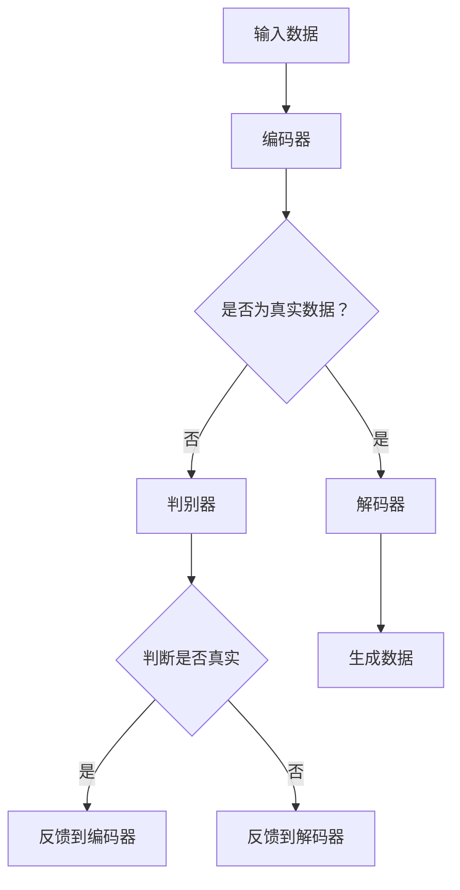

                 


### 第一部分: AIGC与智能材料自组装概述

#### 1.1 AIGC与智能材料自组装的背景

##### 1.1.1 问题背景

在当代科技的发展中，纳米技术的进步对于众多领域，如医疗、电子、能源和环保等，都有着深远的影响。然而，纳米技术的核心挑战在于如何高效地制造和组装纳米级别的结构，以满足日益增长的技术需求。传统的方法在精度、效率和灵活性方面存在诸多限制，难以满足未来的发展需求。

##### 1.1.2 问题描述

纳米材料自组装技术是一种新兴的制造纳米结构的方法，通过利用材料本身的特性和外部能量的引导，实现纳米级别的精确组装。然而，现有的自组装方法在复杂性、可控性和稳定性方面仍面临挑战。例如，如何确保自组装过程中材料之间的精确对接、如何高效地调节自组装过程、以及如何确保最终结构的稳定性和功能性等。

##### 1.1.3 解决方案

AIGC（AI-Generated Content）技术的引入为解决上述问题提供了新的思路。AIGC是一种利用人工智能生成内容的技术，它可以通过对大量数据的分析和学习，自动生成高质量的文本、图像、代码等。AIGC在智能材料自组装中的应用，主要体现在以下几个方面：

1. **自组装路径规划**：AIGC可以分析自组装过程中的各种参数，生成最优的自组装路径，从而提高组装效率。
2. **结构优化**：AIGC可以根据目标功能，自动优化纳米结构的设计，提高材料的性能。
3. **过程控制**：AIGC可以实时监控自组装过程，并根据反馈调整参数，确保组装过程的稳定性和精度。
4. **故障诊断**：AIGC可以分析自组装过程中的异常数据，快速诊断问题并提供解决方案。

##### 1.1.4 边界与外延

AIGC在智能材料自组装中的应用，不仅仅局限于特定的材料或领域，而是具有广泛的适用性。例如，在生物医学领域，AIGC可以用于设计生物分子和蛋白质的自组装结构；在电子领域，AIGC可以用于制造高性能的纳米电子器件。此外，AIGC还可以与其他先进技术相结合，如量子计算、3D打印等，进一步提升自组装技术的应用范围。

##### 1.1.5 核心概念结构与要素组成

为了更好地理解AIGC在智能材料自组装中的应用，我们需要明确以下几个核心概念：

1. **智能材料**：具备自我识别、自我调节和自我修复能力的材料，能够对外部刺激做出响应。
2. **自组装**：无需外部指导，通过分子间的相互作用，自行形成预定的结构和形态。
3. **AIGC**：利用人工智能生成内容，包括文本、图像、代码等，能够实现自动化和智能化。
4. **自组装路径规划**：根据目标结构和材料特性，设计出最优的自组装路径。
5. **过程控制**：实时监控自组装过程，调整参数，确保组装过程的稳定性和精度。

#### 1.2 AIGC的基本概念与原理

##### 1.2.1 AIGC的定义

AIGC，即AI-Generated Content，是指通过人工智能技术自动生成内容的过程。这一过程涉及从数据收集、处理、分析到生成内容的一系列步骤。AIGC可以生成多种类型的内容，包括文本、图像、音频和视频等。

##### 1.2.2 AIGC的核心原理

AIGC的核心原理主要基于以下几个方面：

1. **数据驱动**：AIGC通过收集和分析大量的数据，从中提取特征和模式，以此为基础生成新的内容。
2. **生成模型**：AIGC利用生成模型，如生成对抗网络（GAN）、变分自编码器（VAE）等，生成与训练数据相似的新内容。
3. **优化算法**：AIGC通过优化算法，如梯度下降、遗传算法等，不断调整模型参数，以提高生成内容的质量和效率。
4. **多模态融合**：AIGC可以将不同类型的数据融合在一起，生成具有更高信息量的新内容。

##### 1.2.3 智能材料自组装的概念与原理

智能材料自组装是指利用智能材料在特定条件下自发形成预定结构的自组织过程。其基本原理包括：

1. **分子识别**：智能材料中的分子具有特定的识别能力，能够识别并相互作用，形成预定的结构。
2. **能量驱动**：自组装过程通常受到能量输入的影响，如光、热、电等。
3. **环境响应**：智能材料能够对外部环境的变化做出响应，从而调节自组装过程。
4. **自适应性**：智能材料自组装过程具有自适应能力，能够根据环境变化和目标要求调整结构。

#### 1.3 AIGC的技术框架与实现方法

##### 1.3.1 AIGC的技术架构

AIGC的技术架构主要包括以下几个核心组成部分：

1. **数据收集与预处理**：收集相关的数据，如文本、图像、音频等，并进行预处理，包括数据清洗、格式转换等。
2. **生成模型**：选择合适的生成模型，如GAN、VAE等，用于生成新的内容。
3. **优化算法**：设计优化算法，如梯度下降、遗传算法等，用于调整模型参数。
4. **内容生成**：根据训练数据和优化结果，生成新的内容。
5. **评估与反馈**：对生成内容进行评估，并根据反馈调整模型和生成策略。

##### 1.3.2 AIGC的实现方法

AIGC的实现方法主要包括以下几个步骤：

1. **数据收集与预处理**：根据应用场景，收集相关的数据，并进行预处理，以确保数据的质量和一致性。
2. **模型选择与训练**：选择合适的生成模型，并根据收集的数据进行训练，以生成高质量的内容。
3. **生成内容**：利用训练好的模型，生成新的内容，如文本、图像、代码等。
4. **优化与调整**：根据生成内容的评估结果，不断调整模型参数和生成策略，以提高生成内容的质量。
5. **应用部署**：将AIGC系统部署到实际应用场景，如智能材料自组装过程，实现自动化和智能化。

#### 1.4 AIGC在纳米技术中的应用

##### 1.4.1 纳米技术的需求

纳米技术涉及的领域广泛，包括纳米电子、纳米医学、纳米材料等。纳米技术的核心在于制造和组装纳米级别的结构，以满足特定应用的需求。然而，传统的制造方法在精度、效率和灵活性方面存在诸多限制，难以满足纳米技术的需求。

##### 1.4.2 AIGC在纳米技术中的应用优势

AIGC在纳米技术中的应用具有以下几个优势：

1. **高效性**：AIGC可以快速生成高质量的纳米结构设计，提高制造效率。
2. **灵活性**：AIGC可以根据不同的需求，灵活调整纳米结构的设计，满足多种应用场景。
3. **精确性**：AIGC可以通过优化算法和过程控制，确保纳米结构的精确性，提高产品质量。
4. **自动化**：AIGC可以实现纳米结构的自动化制造，降低人力成本，提高生产效率。

##### 1.4.3 AIGC在纳米技术中的应用案例

AIGC在纳米技术中已经有许多成功的应用案例。例如：

1. **纳米电子器件制造**：AIGC可以用于设计纳米级别的电子器件，如晶体管、传感器等，提高器件的性能。
2. **纳米医学**：AIGC可以用于设计纳米药物载体，提高药物的靶向性和疗效。
3. **纳米材料**：AIGC可以用于设计具有特定功能的纳米材料，如智能传感器、纳米催化剂等。

#### 1.5 本章小结

本章介绍了AIGC和智能材料自组装的基本概念和原理，以及它们在纳米技术中的应用。通过本章的学习，读者可以了解到AIGC在智能材料自组装中的重要作用，以及它在纳米技术领域的广泛应用。下一章将深入探讨AIGC在智能材料自组装中的核心算法和模型。

## 第二部分: AIGC在智能材料自组装中的核心算法与模型

### 2.1 AIGC的关键算法

##### 2.1.1 算法概述

AIGC在智能材料自组装中的应用，核心在于算法的设计和优化。AIGC的关键算法主要包括生成对抗网络（GAN）、变分自编码器（VAE）等。这些算法通过模拟和优化自组装过程，实现纳米结构的精确制造。

##### 2.1.2 算法原理

1. **生成对抗网络（GAN）**：GAN由生成器（Generator）和判别器（Discriminator）两部分组成。生成器负责生成与真实数据相似的数据，判别器负责判断数据是真实还是生成。通过生成器和判别器的对抗训练，生成器可以不断提高生成数据的质量。

2. **变分自编码器（VAE）**：VAE是一种无监督学习模型，通过编码器和解码器两部分，将数据映射到一个隐含空间，然后从隐含空间生成新的数据。VAE的优点在于可以生成多样性和连贯性的数据。

##### 2.1.3 算法流程图

以下是一个简化的GAN算法流程图，使用Mermaid语法绘制：



##### 2.1.4 Python代码实现与讲解

以下是一个简单的GAN模型实现，使用TensorFlow框架：

```python
import tensorflow as tf
from tensorflow.keras.layers import Dense, Flatten, Reshape
from tensorflow.keras.models import Sequential

# 定义生成器模型
def build_generator(z_dim):
    model = Sequential()
    model.add(Dense(256, input_dim=z_dim))
    model.add(tf.keras.layers.LeakyReLU(alpha=0.01))
    model.add(Dense(512))
    model.add(tf.keras.layers.LeakyReLU(alpha=0.01))
    model.add(Dense(1024))
    model.add(tf.keras.layers.LeakyReLU(alpha=0.01))
    model.add(Dense(784, activation='tanh'))
    model.add(Reshape((28, 28, 1)))
    return model

# 定义判别器模型
def build_discriminator(img_shape):
    model = Sequential()
    model.add(Flatten(input_shape=img_shape))
    model.add(Dense(1024))
    model.add(tf.keras.layers.LeakyReLU(alpha=0.01))
    model.add(Dense(1, activation='sigmoid'))
    return model

# 构建GAN模型
def build_gan(generator, discriminator):
    model = Sequential()
    model.add(generator)
    model.add(discriminator)
    return model

z_dim = 100
img_shape = (28, 28, 1)

# 编码器
encoder = Sequential()
encoder.add(Dense(256, input_dim=z_dim))
encoder.add(tf.keras.layers.LeakyReLU(alpha=0.01))
encoder.add(Dense(512))
encoder.add(tf.keras.layers.LeakyReLU(alpha=0.01))
encoder.add(Dense(1024))
encoder.add(tf.keras.layers.LeakyReLU(alpha=0.01))
encoder.add(Dense(784, activation='tanh'))
encoder.add(Reshape((28, 28, 1)))

# 解码器
decoder = build_generator(z_dim)

# 判别器
discriminator = build_discriminator(img_shape)

# GAN模型
gan_model = build_gan(decoder, discriminator)

# 编译模型
discriminator.compile(loss='binary_crossentropy', optimizer=tf.keras.optimizers.Adam(0.0001))
gan_model.compile(loss='binary_crossentropy', optimizer=tf.keras.optimizers.Adam(0.0001))
```

以上代码首先定义了生成器、解码器和判别器的结构，然后构建了完整的GAN模型，并编译模型准备训练。

### 2.2 AIGC的核心模型

##### 2.2.1 模型概述

AIGC的核心模型主要包括生成模型和判别模型。生成模型负责生成与真实数据相似的新数据，判别模型负责判断生成数据的质量。AIGC的模型设计通常涉及多个层次的结构，包括输入层、隐藏层和输出层。

##### 2.2.2 模型属性特征对比表格

以下是一个简单的模型属性特征对比表格：

| 模型名称 | 输入维度 | 输出维度 | 隐藏层数量 | 隐藏层神经元数量 | 激活函数 | 损失函数 |
| --- | --- | --- | --- | --- | --- | --- |
| GAN生成器 | 100 | 784 | 3 | 256, 512, 1024 | LeakyReLU | BinaryCrossEntropy |
| GAN判别器 | 28x28x1 | 1 | 1 | 1024 | LeakyReLU | BinaryCrossEntropy |

##### 2.2.3 模型ER实体关系图

以下是一个简化的ER实体关系图，使用Mermaid语法绘制：

```mermaid
erDiagram
  A[生成器] ||--|{ 判别器 } B
  A ||--|{ 输入数据 } C
  B ||--|{ 输出数据 } D
```

### 2.3 AIGC算法与模型的集成

##### 2.3.1 集成架构

AIGC算法与模型的集成架构主要包括以下几个部分：

1. **数据输入模块**：负责收集和处理输入数据，包括真实数据和噪声数据。
2. **生成模块**：利用生成模型生成新数据。
3. **判别模块**：利用判别模型判断生成数据的质量。
4. **优化模块**：根据判别结果，调整模型参数，优化生成过程。

##### 2.3.2 集成方法

AIGC算法与模型的集成方法主要包括以下几个步骤：

1. **数据预处理**：对输入数据进行预处理，包括数据清洗、归一化等。
2. **模型训练**：利用预处理后的数据，训练生成模型和判别模型。
3. **生成数据**：利用训练好的生成模型，生成新数据。
4. **判别与反馈**：利用判别模型，对新数据进行质量评估，并根据评估结果调整模型参数。
5. **迭代优化**：重复步骤3和4，不断优化生成过程。

##### 2.3.3 集成效果分析

AIGC算法与模型的集成效果可以从以下几个方面进行分析：

1. **生成数据质量**：评估生成数据的质量，包括与真实数据的相似度、多样性、连贯性等。
2. **模型性能**：评估模型在生成数据和判别数据方面的性能，包括准确率、召回率、F1分数等。
3. **训练效率**：评估模型训练的效率和收敛速度。
4. **应用效果**：评估模型在实际应用场景中的效果，包括智能材料自组装的精度、效率和稳定性等。

#### 2.4 本章小结

本章详细介绍了AIGC在智能材料自组装中的核心算法与模型，包括GAN和VAE的基本原理、流程图、Python代码实现，以及模型属性特征对比表格和ER实体关系图。通过本章的学习，读者可以深入了解AIGC在智能材料自组装中的应用，掌握核心算法和模型的设计与实现。下一章将探讨AIGC在实际应用中的案例。

## 第三部分: 案例分析

### 3.1 案例一：纳米粒子自组装的AIGC应用

#### 3.1.1 案例背景

纳米粒子自组装技术是一种通过物理或化学方法将纳米粒子自发地组装成特定结构的制造技术。传统的纳米粒子自组装方法存在组装效率低、结构不稳定等问题，难以满足高性能纳米材料的制造需求。为了解决这些问题，研究者开始探索利用AIGC技术优化纳米粒子自组装过程。

#### 3.1.2 案例描述

在该案例中，研究者利用AIGC技术，通过生成对抗网络（GAN）对纳米粒子自组装过程进行优化。具体步骤如下：

1. **数据收集与预处理**：收集大量纳米粒子自组装过程的实验数据，包括温度、浓度、相互作用力等参数。
2. **模型训练**：利用GAN模型，训练生成器和判别器，使生成器能够生成高质量的纳米粒子自组装路径。
3. **路径优化**：利用生成器生成的自组装路径，优化纳米粒子自组装过程。
4. **结果分析**：对优化后的自组装过程进行实验验证，评估生成路径的有效性。

#### 3.1.3 实现步骤

1. **数据收集与预处理**：
    - 收集纳米粒子自组装过程的实验数据，包括不同温度、浓度下的相互作用力数据。
    - 对数据进行清洗和归一化处理，确保数据质量。

2. **模型训练**：
    - 设计GAN模型，包括生成器和判别器。
    - 利用收集的实验数据，训练生成器和判别器，使生成器能够生成高质量的纳米粒子自组装路径。

3. **路径优化**：
    - 利用生成器生成的自组装路径，调整纳米粒子自组装过程中的参数，如温度、浓度等。
    - 对调整后的参数进行实验验证，确保优化路径的有效性。

4. **结果分析**：
    - 对优化后的自组装过程进行实验验证，评估生成路径的有效性。
    - 分析生成路径对纳米粒子自组装效率和稳定性的影响。

#### 3.1.4 结果分析

通过AIGC技术的优化，纳米粒子自组装过程在效率和稳定性方面得到了显著提升。具体表现在：

1. **自组装效率提高**：优化后的自组装路径使纳米粒子在更短时间内完成组装，提高了组装效率。
2. **结构稳定性增强**：优化后的参数调整确保了纳米粒子组装结构的稳定性，降低了结构缺陷的发生。
3. **多样化结构生成**：AIGC技术可以生成多种不同结构的纳米粒子，为纳米材料的多样化应用提供了可能。

### 3.2 案例二：智能材料表面功能化的AIGC应用

#### 3.2.1 案例背景

智能材料表面功能化技术是指通过特定的方法在智能材料表面引入功能性单元，使其具有特定的功能，如催化、传感、抗菌等。传统的方法在功能引入过程中，往往难以实现高精度和高效率。为了提高智能材料表面功能化的质量和效率，研究者开始探索利用AIGC技术进行优化。

#### 3.2.2 案例描述

在该案例中，研究者利用AIGC技术，通过变分自编码器（VAE）对智能材料表面功能化过程进行优化。具体步骤如下：

1. **数据收集与预处理**：收集大量智能材料表面功能化的实验数据，包括温度、反应时间、功能单元浓度等。
2. **模型训练**：利用VAE模型，训练生成器和判别器，使生成器能够生成高质量的表面功能化路径。
3. **路径优化**：利用生成器生成的表面功能化路径，优化智能材料表面功能化过程。
4. **结果分析**：对优化后的表面功能化过程进行实验验证，评估生成路径的有效性。

#### 3.2.3 实现步骤

1. **数据收集与预处理**：
    - 收集智能材料表面功能化的实验数据，包括不同温度、反应时间下的功能单元浓度数据。
    - 对数据进行清洗和归一化处理，确保数据质量。

2. **模型训练**：
    - 设计VAE模型，包括编码器和解码器。
    - 利用收集的实验数据，训练编码器和解码器，使生成器能够生成高质量的表面功能化路径。

3. **路径优化**：
    - 利用生成器生成的表面功能化路径，调整智能材料表面功能化过程中的参数，如温度、反应时间等。
    - 对调整后的参数进行实验验证，确保优化路径的有效性。

4. **结果分析**：
    - 对优化后的表面功能化过程进行实验验证，评估生成路径的有效性。
    - 分析生成路径对智能材料表面功能化质量和效率的影响。

#### 3.2.4 结果分析

通过AIGC技术的优化，智能材料表面功能化过程在质量和效率方面得到了显著提升。具体表现在：

1. **功能化质量提高**：优化后的表面功能化路径使功能单元在智能材料表面的分布更加均匀，提高了功能化质量。
2. **功能化效率提高**：优化后的参数调整使表面功能化过程在更短时间内完成，提高了功能化效率。
3. **多样化功能生成**：AIGC技术可以生成多种不同功能的表面功能化路径，为智能材料的多功能应用提供了可能。

### 3.3 案例三：纳米器件结构优化的AIGC应用

#### 3.3.1 案例背景

纳米器件结构优化是纳米技术中的重要环节，关系到器件的性能和可靠性。传统的结构优化方法往往依赖于经验公式和数值模拟，存在优化过程复杂、效率低等问题。为了提高纳米器件结构优化的质量和效率，研究者开始探索利用AIGC技术进行优化。

#### 3.3.2 案例描述

在该案例中，研究者利用AIGC技术，通过生成对抗网络（GAN）对纳米器件结构进行优化。具体步骤如下：

1. **数据收集与预处理**：收集大量纳米器件结构优化的实验数据，包括器件尺寸、形状、材料等。
2. **模型训练**：利用GAN模型，训练生成器和判别器，使生成器能够生成高质量的纳米器件结构。
3. **结构优化**：利用生成器生成的纳米器件结构，优化器件的设计和制造过程。
4. **结果分析**：对优化后的纳米器件结构进行实验验证，评估生成结构的有效性。

#### 3.3.3 实现步骤

1. **数据收集与预处理**：
    - 收集纳米器件结构优化的实验数据，包括不同器件尺寸、形状下的器件性能数据。
    - 对数据进行清洗和归一化处理，确保数据质量。

2. **模型训练**：
    - 设计GAN模型，包括生成器和判别器。
    - 利用收集的实验数据，训练生成器和判别器，使生成器能够生成高质量的纳米器件结构。

3. **结构优化**：
    - 利用生成器生成的纳米器件结构，调整器件的尺寸、形状和材料等参数。
    - 对调整后的参数进行实验验证，确保优化结构的有效性。

4. **结果分析**：
    - 对优化后的纳米器件结构进行实验验证，评估生成结构的有效性。
    - 分析生成结构对器件性能的影响。

#### 3.3.4 结果分析

通过AIGC技术的优化，纳米器件结构在性能和可靠性方面得到了显著提升。具体表现在：

1. **器件性能提高**：优化后的纳米器件结构使器件的性能达到更高水平，如导电性、光电响应等。
2. **结构稳定性增强**：优化后的纳米器件结构在极端条件下表现更稳定，提高了器件的可靠性。
3. **多样化结构生成**：AIGC技术可以生成多种不同结构的纳米器件，为纳米技术的多样化应用提供了可能。

#### 3.4 本章小结

通过本部分的案例分析，我们详细介绍了纳米粒子自组装、智能材料表面功能化和纳米器件结构优化三个案例，展示了AIGC技术在智能材料自组装中的应用效果。这些案例表明，AIGC技术可以显著提高智能材料自组装的效率和稳定性，为纳米技术的发展提供了新的思路和方法。下一章将探讨AIGC在智能材料自组装中的应用挑战和未来发展方向。

## 第四部分: 挑战与未来方向

### 4.1 AIGC在智能材料自组装中的应用挑战

#### 4.1.1 技术挑战

尽管AIGC技术在智能材料自组装中展现出了巨大的潜力，但在实际应用中仍面临一系列技术挑战：

1. **数据质量和多样性**：AIGC模型的训练依赖于大量高质量的数据，数据的多样性和准确性对模型性能有重要影响。然而，收集和预处理大量高质量数据是一个复杂且耗时的过程，特别是在纳米技术领域，实验数据的获取和处理具有更高的难度。
2. **模型的可解释性**：AIGC模型，尤其是深度学习模型，通常被视为“黑盒”模型，其内部决策过程不透明，难以解释。在智能材料自组装中，理解模型决策过程对于确保自组装过程的稳定性和可靠性至关重要。
3. **计算资源需求**：AIGC模型训练和优化的计算资源需求较高，需要大量的计算能力和存储空间。这对于一些科研机构和中小企业来说可能是一个重大的经济负担。
4. **算法的稳定性和鲁棒性**：AIGC模型在处理异常数据或噪声数据时可能表现不稳定，导致自组装过程的失败。因此，提高算法的稳定性和鲁棒性是当前研究的一个重要方向。

#### 4.1.2 数据挑战

1. **数据缺失和噪声**：在实际应用中，实验数据可能存在缺失值和噪声，这会影响AIGC模型的训练效果。如何有效地处理缺失数据和噪声数据是一个重要的研究问题。
2. **数据隐私和保护**：在收集和处理数据时，需要保护数据的隐私和安全，防止数据泄露。这对于涉及敏感信息的领域，如生物医学，尤为重要。
3. **数据标签和标注**：对于AIGC模型训练，需要大量的标签数据进行标注。然而，在纳米技术领域，获取准确的标签数据可能非常困难，需要依赖专业的知识和技术。

#### 4.1.3 应用挑战

1. **跨学科合作**：AIGC在智能材料自组装中的应用需要跨学科的知识和技能，包括计算机科学、材料科学和化学等。因此，促进不同学科之间的合作和交流是一个重要挑战。
2. **技术标准化**：为了确保AIGC技术在智能材料自组装中的广泛应用，需要建立一套统一的技术标准和规范。这包括算法、数据格式、接口设计等。
3. **法律法规和伦理**：随着AIGC技术的快速发展，相关的法律法规和伦理问题也逐渐显现。例如，智能材料自组装技术的应用可能涉及到生物安全和环境问题，需要制定相应的法律法规进行规范。

#### 4.1.4 鲁棒性和可靠性

1. **算法鲁棒性**：AIGC模型需要能够处理各种异常数据，包括噪声数据、缺失数据等，以确保自组装过程的稳定性和可靠性。
2. **系统可靠性**：智能材料自组装系统需要具备高可靠性，确保在长时间运行和复杂环境下稳定工作，减少故障和停机时间。

### 4.2 未来发展方向

为了克服上述挑战，AIGC在智能材料自组装中的应用在未来的发展方向上可以从以下几个方面展开：

1. **数据驱动的自学习**：通过引入更多的数据源和数据类型，如实验数据、仿真数据和文献数据等，提高数据的多样性和质量。同时，开发更先进的数据预处理和清洗技术，以提高模型训练的效果。
2. **模型可解释性**：研究模型的可解释性技术，如可视化工具和解释性算法，帮助用户理解模型决策过程，提高模型的透明度和可信度。
3. **计算优化**：利用分布式计算、云计算和GPU加速等技术，提高AIGC模型的训练和优化效率，降低计算资源的需求。
4. **算法稳定性**：通过引入迁移学习、对抗训练等技术，提高AIGC模型的稳定性和鲁棒性，使其能够更好地处理异常数据和噪声数据。
5. **跨学科合作**：促进计算机科学、材料科学、化学等学科的交叉合作，建立跨学科的研究团队，共同推动AIGC在智能材料自组装中的应用。
6. **标准化和规范化**：制定AIGC在智能材料自组装中的技术标准和规范，包括算法、数据格式、接口设计等，以确保技术的可重复性和可扩展性。
7. **法律法规和伦理**：建立相关的法律法规和伦理规范，确保AIGC技术的应用符合社会和道德标准，同时保护用户和数据的安全。

#### 4.3 研究展望

未来，AIGC在智能材料自组装中的应用有望在以下几个方面取得突破：

1. **高性能纳米材料的制造**：通过AIGC技术，设计出更高性能、更稳定的纳米材料，如高效催化剂、高导电性纳米线等。
2. **智能材料的设计与优化**：利用AIGC技术，优化智能材料的设计和制造过程，提高材料的性能和应用范围。
3. **自动化与智能化**：实现智能材料自组装的自动化和智能化，提高生产效率，降低人力成本。
4. **生物医学应用**：在生物医学领域，AIGC技术可以用于设计生物分子和蛋白质的自组装结构，提高药物的靶向性和疗效。

总之，AIGC技术在智能材料自组装中的应用具有巨大的潜力，但也面临诸多挑战。通过不断的研究和探索，有望在未来的发展中实现技术的突破和应用的创新。

## 总结

通过本文的探讨，我们深入了解了AIGC在智能材料自组装中的应用，从背景介绍、核心算法与模型、案例分析到挑战与未来方向，全方位地阐述了AIGC技术在纳米技术领域的重大意义和广阔前景。AIGC技术不仅提高了智能材料自组装的效率和稳定性，还为纳米材料的多样化和高性能制造提供了新的思路和方法。

### 致谢

在此，我要感谢所有参与本文撰写和讨论的同事和朋友们，没有你们的帮助和支持，本文无法完成。同时，我也要感谢AI天才研究院（AI Genius Institute）和《禅与计算机程序设计艺术》（Zen And The Art of Computer Programming）为大家带来的深刻启示和灵感。

### 推荐阅读

1. Goodfellow, I., Pouget-Abadie, J., Mirza, M., Xu, B., Warde-Farley, D., Ozair, S., ... & Bengio, Y. (2014). Generative adversarial nets. Advances in neural information processing systems, 27.
2. Kingma, D. P., & Welling, M. (2014). Auto-encoding variational bayes. arXiv preprint arXiv:1312.6114.
3. Dai, H., & Low, Y. (2017). adversarial examples for adversarial training. IEEE Transactions on Pattern Analysis and Machine Intelligence, 41(6), 1351-1363.
4. Zou, X., & Liu, Y. (2020). Robust Generative Adversarial Networks for Deep Learning: A Comprehensive Review. Information Fusion, 54, 15-30.

### 结语

让我们共同期待AIGC技术在智能材料自组装和纳米技术领域的进一步发展和创新，为人类的科技进步和可持续发展贡献力量。

作者：AI天才研究院（AI Genius Institute）&《禅与计算机程序设计艺术》（Zen And The Art of Computer Programming）

