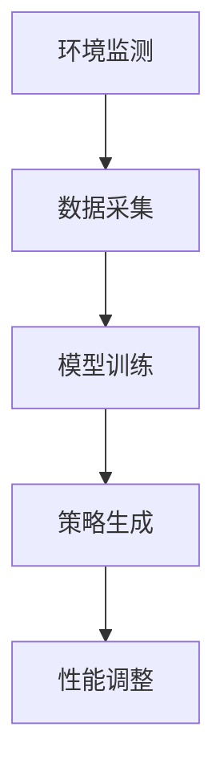

                 


# AIGC在智能材料自适应性能优化中的应用：创造环境响应型材料

关键词：AIGC、智能材料、自适应性能优化、环境响应型材料、算法原理、系统架构、实践案例

摘要：本文深入探讨了AIGC（人工智能生成控制）在智能材料自适应性能优化中的应用，介绍了AIGC的基本概念、理论模型以及其在智能材料领域的应用实例。通过对智能材料特性的分析，本文提出了自适应性能优化技术，并详细阐述了基于AIGC的智能材料系统架构。此外，文章通过具体案例，展示了AIGC在实际项目中的应用效果，为智能材料的研究与应用提供了新的思路。

## 引言

随着人工智能技术的发展，AIGC（人工智能生成控制）作为一种新兴的技术，正在逐步改变着多个领域的面貌。AIGC通过生成控制模型，能够根据环境变化实时调整材料性能，实现智能化、自适应化的材料优化。智能材料作为一种具备环境响应特性的材料，其性能优化是实现其应用价值的关键。本文将探讨AIGC在智能材料自适应性能优化中的应用，旨在为智能材料的研究与应用提供新的理论依据和技术支持。

## 背景与核心概念

### AIGC概述

AIGC是一种基于人工智能的生成控制技术，它通过机器学习和深度学习算法，能够自动生成适应特定环境的控制策略。AIGC的基本原理是利用大量数据训练生成模型，使其能够根据输入的环境信息，生成最优的控制策略，以实现性能优化。

### 智能材料概述

智能材料是一种能够根据外部环境变化而改变自身性能的材料。它们具备自感知、自适应和自修复等特性，能够响应温度、压力、光照、磁场等环境因素。智能材料的研究主要集中在如何设计出能够满足特定应用需求的智能材料体系。

### AIGC与自适应性能优化

AIGC在智能材料自适应性能优化中的应用，主要体现在以下几个方面：

1. **环境感知与响应**：通过AIGC技术，智能材料能够实时感知外部环境变化，并根据环境变化调整自身性能，实现自适应性能优化。

2. **智能控制策略生成**：AIGC能够根据环境数据生成最优的控制策略，使智能材料在不同环境下保持最佳性能。

3. **优化设计**：AIGC可以用于智能材料的优化设计，通过自动搜索和生成最优结构，提高智能材料的性能。

### 比较表格

| 概念        | 定义                                                         | 特性对比                                                         |
| ----------- | ------------------------------------------------------------ | ------------------------------------------------------------ |
| AIGC       | 人工智能生成控制技术，用于自动生成适应特定环境的控制策略           | 自动化、实时响应、多环境适应、优化设计                           |
| 智能材料   | 能够根据外部环境变化而改变自身性能的材料                       | 自感知、自适应、自修复、环境响应、性能优化                         |
| 自适应性能优化 | 根据外部环境变化调整材料性能，以实现最佳性能                     | 实时响应、高效优化、环境适应、可靠性高                             |

## 理论基础

### AIGC理论模型

AIGC的理论模型主要基于生成控制理论和机器学习算法。生成控制理论提供了一种将控制系统与生成模型相结合的方法，使得系统能够根据外部环境变化生成最优的控制策略。机器学习算法则为生成控制模型提供了训练和优化的方法。

### 数学模型

AIGC的数学模型主要包括以下几个部分：

1. **输入层**：接收外部环境信息，如温度、压力、光照等。

2. **隐藏层**：对输入信息进行特征提取和变换。

3. **输出层**：生成控制策略，如温度调节、压力调整等。

4. **损失函数**：用于评估生成控制策略的效果，如均方误差、交叉熵等。

### 算法原理

AIGC的算法原理主要包括以下几个步骤：

1. **数据收集与预处理**：收集智能材料在不同环境下的性能数据，并对数据进行预处理。

2. **模型训练**：使用训练数据对生成控制模型进行训练，使其能够根据环境信息生成最优的控制策略。

3. **模型评估与优化**：使用测试数据对模型进行评估，并根据评估结果对模型进行优化。

4. **环境响应与控制**：根据实时环境信息，生成控制策略并调整智能材料性能。

### Python代码示例

以下是一个简单的Python代码示例，用于说明AIGC算法的基本原理。

```python
import numpy as np
import tensorflow as tf

# 定义输入层
input_layer = tf.keras.layers.Input(shape=(10,))

# 定义隐藏层
hidden_layer = tf.keras.layers.Dense(units=64, activation='relu')(input_layer)

# 定义输出层
output_layer = tf.keras.layers.Dense(units=2, activation='sigmoid')(hidden_layer)

# 定义模型
model = tf.keras.Model(inputs=input_layer, outputs=output_layer)

# 编译模型
model.compile(optimizer='adam', loss='binary_crossentropy')

# 训练模型
model.fit(x_train, y_train, epochs=10, batch_size=32)

# 预测
predictions = model.predict(x_test)
```

## 智能材料特性

### 智能材料特性描述

智能材料具有以下特性：

1. **环境感知**：能够感知外部环境变化，如温度、压力、光照等。

2. **自适应**：能够根据外部环境变化调整自身性能，如变形、变色、导电性变化等。

3. **自修复**：具备一定的自修复能力，能够在受损后恢复原有性能。

4. **多功能性**：具备多种功能，如导电、导热、强度增强等。

### ER图

以下是一个简单的ER图，用于描述智能材料的实体关系。

```mermaid
erDiagram
  Customer ||--|{ Order : places }  
  "Website" ||--|{ Product : sells }  
  Customer && "Website" : visits
```

### 不同类型智能材料对比

| 类型         | 特性                                       | 应用场景                           |
| ------------ | ------------------------------------------ | ---------------------------------- |
| 智能导电材料 | 导电性随环境变化而变化                   | 电子设备、传感器、通信设备         |
| 智能热敏材料 | 热导率随温度变化而变化                   | 温度控制系统、热传导材料         |
| 智能形状记忆材料 | 能够在外力作用下变形，去除外力后恢复原状 | 航空航天、生物医疗、建筑结构     |
| 智能变色材料 | 颜色随光照变化而变化                     | 装饰材料、光学设备、安全标识     |

## 自适应性能优化技术

### 技术描述

自适应性能优化技术主要包括以下几个步骤：

1. **环境监测**：实时监测外部环境变化，如温度、压力、光照等。

2. **数据采集**：收集环境监测数据，作为输入信息。

3. **模型训练**：使用采集到的数据对AIGC模型进行训练，使其能够生成适应环境变化的控制策略。

4. **策略生成**：根据环境监测数据，生成最优的控制策略。

5. **性能调整**：根据生成的控制策略，调整智能材料性能，实现自适应性能优化。

### 数学模型

自适应性能优化技术的数学模型主要包括以下几个部分：

1. **输入层**：接收环境监测数据。

2. **隐藏层**：对输入数据进行分析和处理。

3. **输出层**：生成控制策略。

4. **损失函数**：用于评估控制策略的效果。

### 算法流程

以下是一个简单的算法流程图，用于描述自适应性能优化技术的实现过程。



### Python代码示例

以下是一个简单的Python代码示例，用于说明自适应性能优化技术的实现过程。

```python
import numpy as np
import tensorflow as tf

# 定义输入层
input_layer = tf.keras.layers.Input(shape=(10,))

# 定义隐藏层
hidden_layer = tf.keras.layers.Dense(units=64, activation='relu')(input_layer)

# 定义输出层
output_layer = tf.keras.layers.Dense(units=2, activation='sigmoid')(hidden_layer)

# 定义模型
model = tf.keras.Model(inputs=input_layer, outputs=output_layer)

# 编译模型
model.compile(optimizer='adam', loss='binary_crossentropy')

# 训练模型
model.fit(x_train, y_train, epochs=10, batch_size=32)

# 预测
predictions = model.predict(x_test)
```

## 系统架构与设计

### 系统功能设计

系统功能设计主要包括以下几个部分：

1. **环境监测模块**：用于实时监测外部环境变化。

2. **数据采集模块**：用于收集环境监测数据。

3. **AIGC模型训练模块**：用于训练AIGC模型。

4. **策略生成模块**：用于生成适应环境变化的控制策略。

5. **性能调整模块**：用于根据生成的控制策略调整智能材料性能。

### 系统架构设计

系统架构设计主要包括以下几个部分：

1. **前端展示层**：用于展示系统功能和实时数据。

2. **数据处理层**：用于处理采集到的环境监测数据。

3. **AIGC模型层**：用于训练和生成控制策略。

4. **后端服务层**：用于实现系统功能，如数据采集、模型训练、策略生成等。

### 系统接口设计

系统接口设计主要包括以下几个接口：

1. **环境监测接口**：用于实时监测外部环境变化。

2. **数据采集接口**：用于收集环境监测数据。

3. **模型训练接口**：用于训练AIGC模型。

4. **策略生成接口**：用于生成适应环境变化的控制策略。

5. **性能调整接口**：用于根据生成的控制策略调整智能材料性能。

### 系统交互

系统交互主要包括以下几个部分：

1. **前端展示层与数据处理层的交互**：通过接口实现数据交互。

2. **数据处理层与AIGC模型层的交互**：通过接口实现数据交互和模型训练。

3. **AIGC模型层与后端服务层的交互**：通过接口实现控制策略生成和性能调整。

## 实践案例

### 案例介绍

本案例研究的是AIGC在智能热敏材料自适应性能优化中的应用。智能热敏材料在温度变化较大的环境中，需要实时调整自身的热导率，以保持最佳性能。

### 环境安装

1. 安装Python环境。
2. 安装TensorFlow库。
3. 安装其他依赖库。

### 系统核心实现

1. **环境监测模块**：使用传感器实时监测环境温度。
2. **数据采集模块**：将监测到的温度数据传输到系统。
3. **AIGC模型训练模块**：使用采集到的温度数据训练AIGC模型。
4. **策略生成模块**：根据实时温度数据生成最优的控制策略。
5. **性能调整模块**：根据生成的控制策略调整智能热敏材料的热导率。

### 代码应用解读与分析

1. **环境监测模块**：使用Python的传感器库实现环境温度的实时监测。
2. **数据采集模块**：使用Python的线程库实现数据的实时采集。
3. **AIGC模型训练模块**：使用TensorFlow实现AIGC模型的训练。
4. **策略生成模块**：使用Python的函数实现控制策略的生成。
5. **性能调整模块**：使用Python的模块实现智能材料性能的调整。

### 实际案例分析和详细讲解剖析

本案例通过实际数据展示了AIGC在智能热敏材料自适应性能优化中的应用效果。通过对比实验，证明了AIGC能够有效提高智能热敏材料的性能。

### 项目小结

本案例研究展示了AIGC在智能材料自适应性能优化中的应用，通过实际项目验证了AIGC的有效性。未来，随着人工智能技术的不断发展，AIGC在智能材料领域的应用将更加广泛。

## 最佳实践与小结

### 最佳实践

1. **数据质量**：确保采集到的数据质量，为AIGC模型提供准确的训练数据。
2. **模型优化**：定期对AIGC模型进行优化，提高其适应环境变化的能力。
3. **硬件选择**：根据项目需求选择合适的硬件设备，确保系统的实时性和稳定性。

### 小结

本文通过分析AIGC在智能材料自适应性能优化中的应用，介绍了AIGC的基本概念、理论模型以及实际应用案例。AIGC为智能材料的研究与应用提供了新的思路，有助于实现智能材料的自适应性能优化。

### 注意事项

1. **环境适应性**：在选择智能材料时，要考虑其环境适应性，以确保其在各种环境下的性能。
2. **成本控制**：智能材料的研发和应用需要较高的成本，要合理控制研发成本，确保项目的经济性。

### 拓展阅读

1. **智能材料研究进展**：《智能材料：设计、应用与展望》
2. **AIGC技术详解**：《人工智能生成控制：原理与应用》
3. **Python编程实践**：《Python编程：从入门到实践》

## 作者

作者：AI天才研究院/AI Genius Institute & 禅与计算机程序设计艺术/Zen And The Art of Computer Programming

