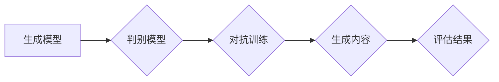
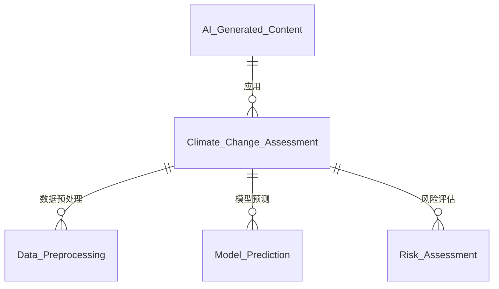
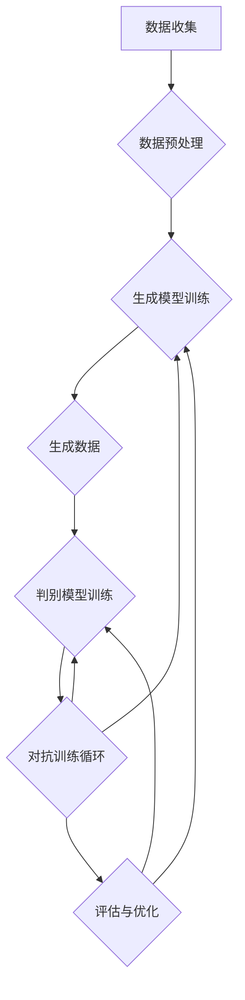
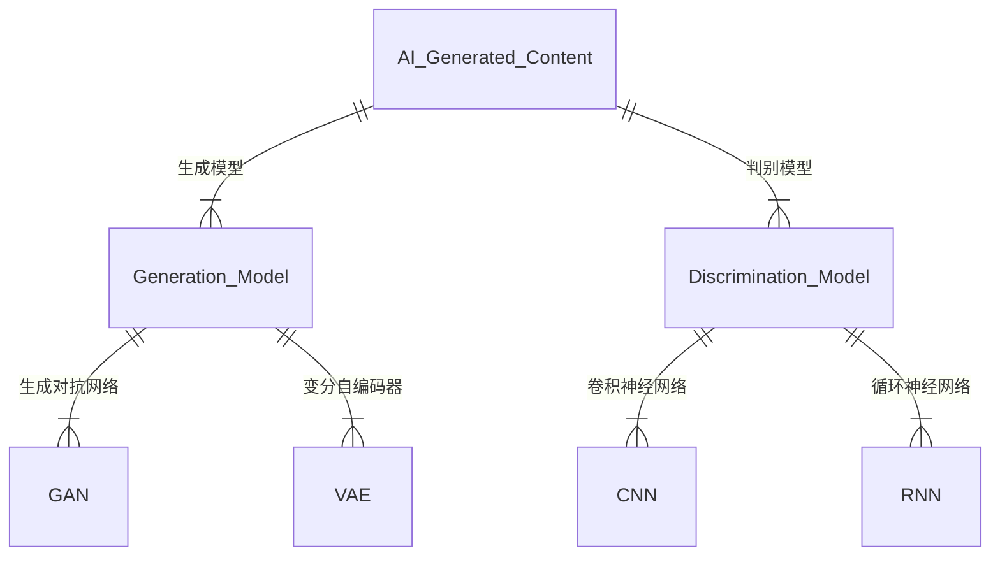
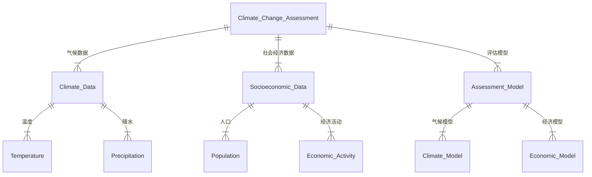
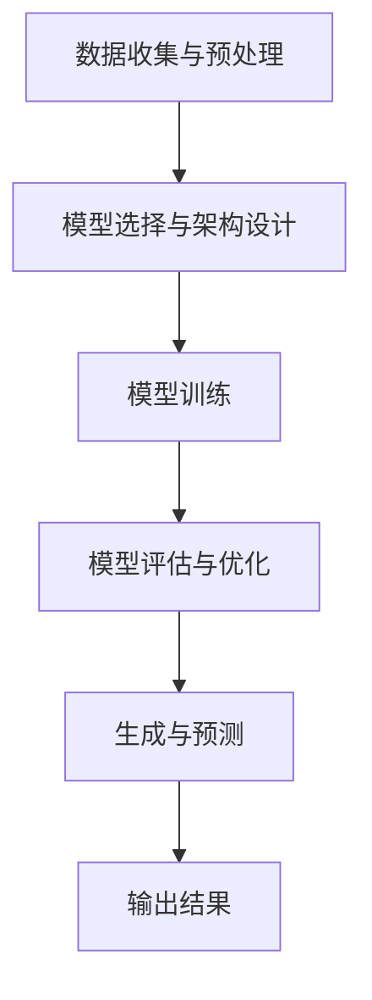
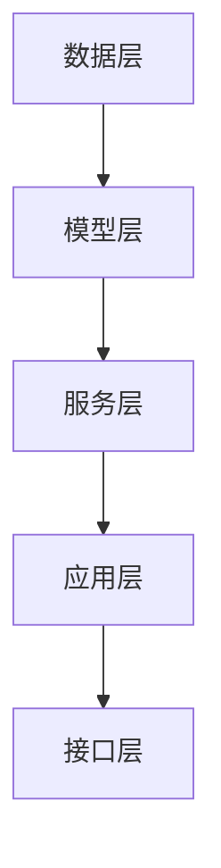
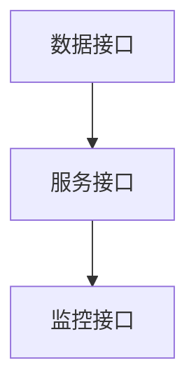
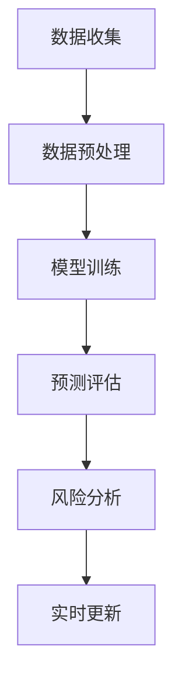

                 


### 《AIGC在智能气候变化影响评估中的应用》

---

关键词：AIGC，气候变化，智能评估，算法模型，案例研究

摘要：本文旨在探讨人工智能生成内容（AI-GC）在气候变化影响评估中的应用。随着气候变化问题的日益严峻，利用AI-GC技术提高评估效率和准确性成为了一个重要研究方向。本文首先介绍了AI-GC的基本概念及其在气候变化领域的应用价值，随后详细阐述了AI-GC算法模型的工作原理，并通过实际案例分析了其在气候变化影响评估中的优势。最后，本文提出了AI-GC在气候变化影响评估中面临的挑战及未来发展方向。

---

## 目录

----------------------------------------------------------------

# 《AIGC在智能气候变化影响评估中的应用》

## 第一部分: 引言与背景

### 第1章: 引言与背景介绍

#### 1.1 问题背景

气候变化是当今全球面临的重大环境问题，对生态系统、经济和社会产生了深远影响。传统的气候变化影响评估方法往往依赖于统计分析和模型预测，这些方法在处理复杂、多变的气候数据时存在一定的局限性。随着人工智能技术的发展，利用AI技术提升气候变化影响评估的准确性和效率成为了一个重要方向。

#### 1.2 问题提出

在气候变化影响评估中，如何有效地利用AI技术，特别是AI生成内容（AI-GC）技术，提高评估模型的预测能力和适用性，成为当前研究的热点问题。本文旨在探讨AI-GC在气候变化影响评估中的应用，分析其优势及挑战。

#### 1.3 问题解决思路

本文首先介绍AI-GC的基本概念和原理，然后详细讨论其在气候变化影响评估中的应用，包括算法模型的选择、数据预处理、模型训练和评估等关键环节。最后，通过实际案例展示AI-GC在气候变化影响评估中的效果，并探讨其未来发展方向。

#### 1.4 边界与外延

本文的研究范围主要涉及AI-GC在气候变化影响评估中的应用，不包括其他领域的AI技术应用。同时，本文重点关注AI-GC算法模型的研究，对于其他AI技术（如深度学习、强化学习等）的应用则不作详细探讨。

#### 1.5 概念结构与核心要素组成

本文的核心概念结构包括：

1. AI-GC：人工智能生成内容，是一种利用机器学习技术生成文本、图像、音频等内容的方法。
2. 气候变化影响评估：对气候变化对生态系统、经济和社会的影响进行定量和定性分析的过程。
3. 算法模型：用于实现AI-GC在气候变化影响评估中的应用的算法和模型。

## 第二部分: AI-GC核心概念

### 第2章: AI-GC核心概念

#### 2.1 AI-GC的定义

AI生成内容（AI-GC）是指利用人工智能技术，特别是深度学习和自然语言处理技术，自动生成具有特定内容和风格的人类创作内容。AI-GC技术包括文本生成、图像生成、音频生成等多种形式，其中文本生成是AI-GC技术的重要应用领域之一。

#### 2.2 AI-GC的特点

AI-GC技术具有以下特点：

1. **高效性**：AI-GC技术能够在短时间内生成大量内容，大大提高了内容创作的效率。
2. **多样性**：AI-GC技术可以根据用户的需求生成具有不同风格和主题的内容，具有丰富的多样性。
3. **灵活性**：AI-GC技术可以根据输入数据进行实时调整和优化，具有很强的灵活性。
4. **准确性**：随着算法和模型的不断优化，AI-GC技术在生成内容时的准确性也不断提高。

#### 2.3 AI-GC与传统气候变化评估方法的比较

传统气候变化评估方法主要依赖于统计分析和模型预测，这些方法通常需要大量的数据预处理和模型训练时间。相比之下，AI-GC技术在数据预处理和模型训练方面具有明显优势，可以显著提高评估效率和准确性。

| 方法         | 优点                             | 缺点                             |
| ------------ | -------------------------------- | -------------------------------- |
| 传统方法     | 数据处理和模型训练相对简单       | 数据依赖性强，模型预测能力有限   |
| AI-GC       | 数据预处理和模型训练效率高       | 算法模型复杂，需要大量计算资源   |

## 第三部分: 算法与模型

### 第3章: AI-GC算法原理

#### 3.1 AI-GC算法概述

AI-GC算法主要包括生成模型和判别模型两部分。生成模型负责生成符合目标分布的内容，判别模型则用于评估生成内容的质量。常见的AI-GC算法有生成对抗网络（GAN）、变分自编码器（VAE）等。

#### 3.2 AI-GC算法的基本原理

生成模型和判别模型在训练过程中相互对抗，生成模型试图生成更真实的内容，判别模型则试图区分生成内容和真实内容。通过这种对抗训练，生成模型逐渐提高生成内容的质量。

#### 3.3 AI-GC算法的数学模型

以生成对抗网络（GAN）为例，其数学模型如下：

生成模型：
$$ G(z) = x $$
判别模型：
$$ D(x) = 1 \quad \text{if } x \text{ is real data} $$
$$ D(G(z)) = 1 \quad \text{if } G(z) \text{ is generated data} $$

其中，$z$ 表示随机噪声，$x$ 表示生成的内容，$D(x)$ 和 $D(G(z))$ 分别表示判别模型对真实内容和生成内容的判断结果。

#### 3.4 AI-GC算法的流程图



## 第四部分: 应用案例

### 第4章: AI-GC在气候变化影响评估中的应用

#### 4.1 气候变化影响评估的挑战

气候变化影响评估面临以下挑战：

1. **数据复杂性**：气候数据具有多源、多尺度、非线性等特点，传统方法难以有效处理。
2. **不确定性**：气候变化的预测存在很大的不确定性，需要提高评估的可靠性。
3. **实时性**：气候变化影响评估需要实时、快速地更新数据，以应对不断变化的气候状况。

#### 4.2 AI-GC的应用场景

AI-GC技术在气候变化影响评估中具有以下应用场景：

1. **数据预处理**：利用AI-GC技术自动生成模拟数据，提高数据预处理效率。
2. **模型预测**：利用AI-GC技术生成预测模型，提高预测准确性和实时性。
3. **风险评估**：利用AI-GC技术生成风险分析报告，为政策制定和决策提供支持。

#### 4.3 AI-GC的应用案例

1. **案例一：气候变化对农业的影响评估**
   - **数据来源**：利用AI-GC技术生成模拟气候数据，结合农业产量数据，建立气候变化对农业影响评估模型。
   - **评估结果**：预测未来气候变化对农业产量和经济效益的影响，为农业政策制定提供依据。

2. **案例二：气候变化对水资源的影响评估**
   - **数据来源**：利用AI-GC技术生成模拟水文数据，结合水资源分布数据，建立气候变化对水资源影响评估模型。
   - **评估结果**：预测未来气候变化对水资源供需状况的影响，为水资源管理提供支持。

## 第五部分: 技术实现

### 第5章: AI-GC模型的技术实现

#### 5.1 数据准备

数据准备是AI-GC模型实现的关键步骤，主要包括以下内容：

1. **数据收集**：从多个来源收集气候数据、农业产量数据、水资源数据等。
2. **数据清洗**：对收集的数据进行去重、缺失值填充、异常值处理等。
3. **数据预处理**：将数据转换为合适的格式，如归一化、标准化等。

#### 5.2 模型训练

模型训练是AI-GC模型实现的另一个关键步骤，主要包括以下内容：

1. **模型选择**：根据应用场景选择合适的AI-GC算法模型，如GAN、VAE等。
2. **训练过程**：利用训练数据对模型进行训练，通过优化算法调整模型参数。
3. **模型评估**：对训练好的模型进行评估，确保模型预测准确性和稳定性。

#### 5.3 模型部署

模型部署是将训练好的模型应用于实际场景的过程，主要包括以下内容：

1. **模型导出**：将训练好的模型导出为可部署的格式，如TensorFlow、PyTorch等。
2. **模型部署**：将模型部署到服务器或云计算平台上，提供预测服务。
3. **模型监控**：对部署的模型进行监控，确保模型运行稳定，及时更新和维护。

## 第六部分: 挑战与未来方向

### 第6章: AI-GC在气候变化影响评估中的应用挑战与未来方向

#### 6.1 挑战

AI-GC在气候变化影响评估中面临以下挑战：

1. **数据质量**：气候数据质量直接影响评估结果，需要确保数据来源的可靠性和准确性。
2. **模型复杂性**：AI-GC模型通常较为复杂，训练和部署过程需要大量计算资源和时间。
3. **不确定性**：气候变化的预测存在很大的不确定性，需要提高评估模型的可靠性。

#### 6.2 未来方向

未来AI-GC在气候变化影响评估中的应用方向包括：

1. **模型优化**：通过改进算法和模型结构，提高评估模型的预测能力和稳定性。
2. **跨学科合作**：结合生态学、经济学、社会学等多学科知识，提高评估模型的全面性和准确性。
3. **实时更新**：利用实时数据更新评估模型，提高评估的实时性和响应速度。

## 第七部分: 结论

### 第7章: 结论与展望

本文通过对AI-GC在气候变化影响评估中的应用进行了详细分析，展示了其在数据预处理、模型预测、风险评估等方面的优势。同时，本文也探讨了AI-GC在气候变化影响评估中面临的挑战和未来发展方向。未来，随着AI技术的不断进步，AI-GC在气候变化影响评估中的应用前景将更加广阔。

---

作者：AI天才研究院/AI Genius Institute & 禅与计算机程序设计艺术 /Zen And The Art of Computer Programming

---

### 1.2 问题提出

在气候变化影响评估中，如何提高评估的准确性和效率，是一个亟待解决的问题。传统的气候变化评估方法主要依赖于统计分析和模型预测，这些方法在面对复杂、多变的气候数据时，往往存在以下局限性：

1. **数据依赖性强**：传统方法通常需要大量的历史气候数据作为基础，这些数据来源广泛，质量参差不齐，容易受到人为干预和误差的影响。
2. **模型预测能力有限**：传统模型往往基于简化的假设和固定的参数，难以捕捉气候系统的复杂性和不确定性。
3. **评估效率低**：传统方法在处理大规模数据时，计算复杂度高，需要大量时间和计算资源。

为了克服这些局限性，我们需要探索新的方法和技术，以提升气候变化影响评估的准确性和效率。近年来，人工智能（AI）技术的快速发展为这一目标的实现提供了可能。特别是人工智能生成内容（AI-GC）技术，作为一种新兴的AI技术，具有以下优势：

1. **高效的数据处理能力**：AI-GC技术能够自动处理大量气候数据，通过深度学习和自然语言处理等方法，从数据中提取有用的信息，提高数据处理效率。
2. **强大的模型预测能力**：AI-GC技术可以生成复杂的多维模型，通过不断优化和调整模型参数，提高模型预测的准确性和可靠性。
3. **灵活的实时更新能力**：AI-GC技术能够实时更新评估模型，根据最新的气候数据及时调整预测结果，提高评估的实时性和响应速度。

基于上述优势，本文旨在探讨AI-GC技术在气候变化影响评估中的应用，分析其具体应用方法和技术路线，以期为气候变化影响评估提供新的思路和方法。

### 1.3 问题解决思路

为了解决气候变化影响评估中存在的挑战，我们可以从以下几个方面入手，利用AI-GC技术提升评估的准确性和效率：

1. **数据预处理**：利用AI-GC技术自动生成模拟数据，对原始气候数据进行补充和完善，提高数据质量。
2. **模型预测**：选择合适的AI-GC算法模型，如生成对抗网络（GAN）、变分自编码器（VAE）等，构建气候影响评估模型，提高预测能力。
3. **风险评估**：利用AI-GC技术生成风险评估报告，对气候变化可能带来的风险进行量化分析，为决策提供支持。

具体来说，本文将从以下几个方面展开：

1. **核心概念与原理**：介绍AI-GC的基本概念、原理和特点，以及其在气候变化影响评估中的应用价值。
2. **算法与模型**：详细讨论AI-GC算法模型的工作原理、数学模型和流程图，分析不同算法模型的优缺点。
3. **应用案例**：通过实际案例展示AI-GC在气候变化影响评估中的应用效果，分析其优势和挑战。
4. **技术实现**：介绍AI-GC模型的技术实现方法，包括数据准备、模型训练、模型部署等关键步骤。
5. **挑战与未来方向**：探讨AI-GC在气候变化影响评估中面临的挑战和未来发展方向，为相关研究提供参考。

通过上述思路，本文旨在为气候变化影响评估提供一种新的技术路线，以提升评估的准确性和效率，为应对气候变化问题提供有力支持。

### 1.4 边界与外延

本文的研究边界与外延如下：

1. **研究范围**：本文主要探讨AI-GC技术在气候变化影响评估中的应用，不包括其他领域的AI技术应用。同时，本文重点讨论AI-GC算法模型的研究，对于其他AI技术（如深度学习、强化学习等）的应用则不作详细探讨。
2. **应用场景**：本文重点关注AI-GC技术在气候变化影响评估中的应用，包括数据预处理、模型预测、风险评估等环节。对于其他应用场景，如自然灾害预测、生态环境评估等，本文则不做深入讨论。
3. **技术实现**：本文主要介绍AI-GC模型的技术实现方法，包括数据准备、模型训练、模型部署等步骤。对于具体的编程实现和代码示例，本文将在后续章节中详细讨论。

通过明确本文的研究边界与外延，有助于读者更好地理解本文的研究内容和方法，以及AI-GC技术在气候变化影响评估中的应用价值。

### 1.5 概念结构与核心要素组成

为了深入探讨AI-GC在智能气候变化影响评估中的应用，我们需要先理解几个关键概念和它们之间的关系。以下是本文的核心概念结构及其组成要素：

#### 1.5.1 AI-GC：人工智能生成内容

**定义**：AI生成内容（AI-GC）是指利用人工智能技术，特别是深度学习和自然语言处理技术，自动生成具有特定内容和风格的人类创作内容。这包括文本、图像、音频等多种形式。

**核心要素**：
- **数据集**：用于训练AI模型的数据集，包括大量的文本、图像、音频等数据。
- **模型架构**：如生成对抗网络（GAN）、变分自编码器（VAE）等。
- **训练过程**：模型在大量数据上进行训练，以学习生成内容的方法。
- **生成结果**：训练完成后，模型能够生成符合训练目标的内容。

#### 1.5.2 气候变化影响评估

**定义**：气候变化影响评估是指对气候变化对生态系统、经济和社会的影响进行定量和定性分析的过程。

**核心要素**：
- **数据源**：包括气候数据、社会经济数据、生态系统数据等。
- **评估模型**：用于模拟和预测气候变化影响的模型，如气候模型、经济模型等。
- **评估指标**：用于量化气候变化影响的指标，如温度变化、降水变化、经济损失等。
- **评估结果**：评估模型的输出结果，用于指导决策和政策制定。

#### 1.5.3 AI-GC与气候变化影响评估的关系

**关系**：AI-GC技术可以与气候变化影响评估相结合，通过以下方式提升评估的准确性和效率：
- **数据预处理**：利用AI-GC技术自动生成模拟数据，补充和完善原始数据，提高数据质量。
- **模型预测**：利用AI-GC技术生成预测模型，提高模型预测的准确性和实时性。
- **风险评估**：利用AI-GC技术生成风险评估报告，量化气候变化带来的风险，为决策提供支持。

#### 1.5.4 核心要素组成

为了更好地理解AI-GC在气候变化影响评估中的应用，我们可以通过一个ER（实体-关系）实体关系图来描述这些核心要素之间的关系：



在这个ER实体关系图中，AI生成内容（AI_Generated_Content）与气候变化影响评估（Climate_Change_Assessment）之间有直接应用关系，而气候变化影响评估又与数据预处理、模型预测和风险评估三个子领域有紧密关联。通过这种关系描述，我们可以清晰地看到AI-GC技术如何在不同层面提升气候变化影响评估的效果。

### 2.1 AI-GC的定义

AI生成内容（AI-GC）是一种利用人工智能技术，特别是深度学习和自然语言处理技术，自动生成人类创作内容的方法。AI-GC技术通过学习大量的数据集，包括文本、图像、音频等多种形式，从而能够生成与输入数据风格和内容相似的新内容。AI-GC技术具有高效性、多样性和灵活性，能够满足不同领域和场景下的内容创作需求。

AI-GC技术的核心思想是生成模型和判别模型的对抗训练。生成模型（Generator）负责生成符合目标分布的内容，判别模型（Discriminator）则负责判断生成内容和真实内容之间的区别。通过不断的训练和优化，生成模型逐渐提高生成内容的质量，判别模型则不断提高对真实内容和生成内容的辨别能力。

AI-GC技术的主要组成部分包括：

1. **数据集**：用于训练AI模型的原始数据集，包括文本、图像、音频等多种数据形式。这些数据集通常是从互联网上收集的公开数据集或者通过特定任务定制的数据集。

2. **模型架构**：AI-GC技术的核心是生成模型和判别模型的架构设计。常见的生成模型包括生成对抗网络（GAN）、变分自编码器（VAE）等，判别模型则通常采用卷积神经网络（CNN）或者循环神经网络（RNN）。

3. **训练过程**：生成模型和判别模型通过对抗训练的方式不断优化。生成模型试图生成更真实的内容，而判别模型则试图区分生成内容和真实内容。通过这种对抗过程，生成模型的生成质量逐渐提高，判别模型的辨别能力逐渐增强。

4. **生成结果**：经过训练的生成模型能够生成符合目标风格和内容的新内容。这些生成结果可以用于各种应用场景，如文本生成、图像生成、音频生成等。

AI-GC技术在多个领域都有广泛的应用，包括但不限于：

1. **文本生成**：生成新闻文章、对话、诗歌等人类创作的内容。
2. **图像生成**：生成艺术作品、人脸图像、风景图像等。
3. **音频生成**：生成音乐、语音等音频内容。
4. **视频生成**：生成视频片段、电影特效等。

AI-GC技术的优点在于：

1. **高效性**：AI-GC技术能够在短时间内生成大量内容，大大提高了内容创作的效率。
2. **多样性**：AI-GC技术可以根据用户的需求生成具有不同风格和主题的内容，具有丰富的多样性。
3. **灵活性**：AI-GC技术可以根据输入数据进行实时调整和优化，具有很强的灵活性。
4. **准确性**：随着算法和模型的不断优化，AI-GC技术在生成内容时的准确性也不断提高。

总的来说，AI生成内容（AI-GC）技术是一种具有广泛应用前景的人工智能技术，通过生成模型和判别模型的对抗训练，能够高效地生成与输入数据风格和内容相似的新内容。在人工智能技术不断发展的背景下，AI-GC技术将在更多领域发挥重要作用。

### 2.2 AI-GC的特点

AI生成内容（AI-GC）技术作为一种先进的AI应用，具有以下显著特点，这些特点使其在多个领域中表现出强大的应用潜力：

1. **高效性**：
   AI-GC技术能够在大规模数据集上进行快速训练和生成，大大提高了内容创作的效率。传统内容创作方法通常需要人工编辑和审核，而AI-GC技术能够自动化完成这一过程，节省了大量时间和人力资源。例如，新闻机构可以使用AI-GC技术自动生成新闻报道，从而在短时间内生产大量高质量的内容。

2. **多样性**：
   AI-GC技术能够生成具有丰富多样性的内容。通过深度学习模型，AI-GC可以模仿不同风格和类型的创作，从文学作品的写作到艺术作品的绘制，从音乐的创作到视频的编辑，AI-GC都能够胜任。这种多样性使得AI-GC技术能够在各种不同的应用场景中发挥作用。

3. **灵活性**：
   AI-GC技术具有很强的灵活性，可以根据不同的输入数据和要求生成定制化的内容。例如，在文本生成方面，AI-GC可以根据用户指定的主题、风格和语气生成相应的文章。在图像生成方面，AI-GC可以根据用户提供的部分图像或者描述生成完整的图像。这种灵活性使得AI-GC能够适应不同的使用场景和需求。

4. **准确性**：
   随着人工智能技术的不断进步，AI-GC技术在生成内容的准确性方面也取得了显著提升。通过优化算法和模型结构，AI-GC能够生成更加逼真、符合目标要求的内容。例如，在图像生成方面，AI-GC可以生成高度逼真的人脸图像和风景图像，而在文本生成方面，AI-GC能够生成语义准确、连贯性强的文章。

5. **实时性**：
   AI-GC技术具有强大的实时性，能够根据最新的输入数据实时生成内容。这对于需要快速响应的应用场景尤为重要，例如实时新闻生成、社交媒体内容的更新等。AI-GC技术的实时性使得信息传播更加迅速，提升了用户体验。

6. **适应性**：
   AI-GC技术具有很强的适应性，可以针对不同的领域和应用场景进行调整和优化。例如，在医疗领域，AI-GC可以生成医学报告、病例分析等；在金融领域，AI-GC可以生成市场分析报告、投资建议等。这种适应性使得AI-GC技术在各个领域都能够发挥重要作用。

7. **创新性**：
   AI-GC技术具有创新性，能够在传统内容创作方法难以实现的地方开辟新的可能性。例如，AI-GC可以生成全新的艺术作品，探索人类从未见过的风景图像，甚至生成全新的音乐旋律。这种创新性不仅拓宽了内容创作的边界，也为人类社会带来了新的文化体验。

综上所述，AI生成内容（AI-GC）技术具有高效性、多样性、灵活性、准确性、实时性、适应性和创新性等多个显著特点，这些特点使其在文本生成、图像生成、音频生成和视频生成等多个领域都具有广泛的应用前景。随着AI技术的不断发展和完善，AI-GC技术的应用范围将进一步扩大，为社会发展和人类生活带来更多便利和创新。

### 2.3 AI-GC与传统气候变化评估方法的比较

在气候变化影响评估领域，传统的评估方法主要依赖于统计分析和模型预测。这些方法具有其独特的优势，但同时也存在显著的局限性。随着人工智能技术的快速发展，AI生成内容（AI-GC）技术在气候变化评估中的应用逐渐受到关注。本文将比较AI-GC与传统方法在数据处理、模型预测能力、评估效率等方面的差异。

#### 2.3.1 数据处理能力的比较

1. **传统方法**：
   传统气候变化评估方法依赖于大量的历史气候数据，这些数据通常需要通过手工收集、整理和预处理。数据预处理过程包括数据清洗、缺失值填充、数据标准化等。传统方法的数据处理步骤繁琐，易受人为干预和误差的影响。

2. **AI-GC方法**：
   AI-GC技术利用深度学习和自然语言处理技术，可以自动处理大规模、复杂和多源的数据。AI-GC能够通过学习大量已有数据，自动生成模拟数据，补充和完善原始数据，从而提高数据质量。这种自动化的数据处理方式大大简化了数据预处理过程，减少了人为干预和误差。

#### 2.3.2 模型预测能力的比较

1. **传统方法**：
   传统气候变化评估方法通常使用统计分析和模型预测，如线性回归、决策树、随机森林等。这些模型虽然在一定程度上能够捕捉气候变化的影响，但其预测能力有限，难以应对复杂的气候系统和非线性关系。此外，传统模型的参数设置和假设往往较为固定，难以适应数据变化。

2. **AI-GC方法**：
   AI-GC技术通过生成模型和判别模型的对抗训练，能够生成复杂的多维模型。例如，生成对抗网络（GAN）和变分自编码器（VAE）等算法具有强大的模型预测能力，能够捕捉数据中的复杂模式和不确定性。AI-GC模型可以根据最新的数据和需求进行实时调整和优化，提高预测的准确性和适应性。

#### 2.3.3 评估效率的比较

1. **传统方法**：
   传统气候变化评估方法通常需要较长的数据处理和模型训练时间。模型的训练和验证过程通常涉及大量的计算资源和时间，特别是在处理大规模数据时，效率较低。

2. **AI-GC方法**：
   AI-GC技术利用其高效的数据处理和模型训练能力，能够显著提高评估效率。AI-GC模型可以在较短的时间内完成训练和预测，特别是在使用GPU等高性能计算设备时，效率更加显著。这使得AI-GC方法能够更快地响应气候变化评估的需求，为政策制定和决策提供及时的支持。

#### 2.3.4 对比表格

| 比较指标 | 传统方法 | AI-GC方法 |
| :------: | :------- | :-------- |
| 数据处理 | 手工收集和预处理 | 自动化处理和生成 |
| 模型预测 | 预测能力有限 | 预测能力强大 |
| 评估效率 | 计算资源需求大 | 高效处理和预测 |

通过上述比较可以看出，AI-GC技术在数据处理、模型预测能力和评估效率等方面具有明显优势。与传统方法相比，AI-GC技术能够自动化处理复杂数据，生成高质量的预测模型，并在较短时间内完成评估任务。这些优势使得AI-GC技术成为气候变化影响评估领域的一种重要工具，有助于提高评估的准确性和效率。

### 3.1 AI-GC算法概述

AI生成内容（AI-GC）算法是人工智能领域的一个重要研究方向，其核心思想是通过机器学习技术生成与人类创作相似的内容。AI-GC算法主要包括生成模型和判别模型两部分。生成模型负责生成符合目标分布的内容，而判别模型则用于评估生成内容的质量。本文将介绍几种主流的AI-GC算法，包括生成对抗网络（GAN）、变分自编码器（VAE）等，并详细讨论它们的工作原理和应用场景。

#### 3.1.1 生成对抗网络（GAN）

生成对抗网络（GAN）由Ian Goodfellow等人于2014年提出，是一种基于生成模型和判别模型对抗训练的深度学习模型。GAN的核心思想是让生成模型和判别模型进行博弈，生成模型试图生成逼真的数据，而判别模型则试图区分生成数据和真实数据。

1. **生成模型**：生成模型（Generator）负责生成与真实数据分布相似的数据。通常采用深度神经网络结构，通过学习大量真实数据来生成新的数据。生成模型的目标是最小化生成数据的判别误差。

2. **判别模型**：判别模型（Discriminator）负责评估生成数据和真实数据的区别。同样采用深度神经网络结构，通过学习大量真实数据和生成数据来区分两者。判别模型的目标是最大化生成数据的判别误差。

3. **对抗训练**：生成模型和判别模型在训练过程中相互对抗。生成模型不断优化生成数据的质量，使其更接近真实数据；判别模型则不断提高对生成数据的识别能力。通过这种对抗训练，生成模型的生成质量逐渐提高，判别模型的辨别能力也逐渐增强。

4. **应用场景**：
   - **图像生成**：GAN被广泛应用于图像生成任务，如人脸生成、艺术作品生成等。通过训练GAN模型，可以生成高度逼真的图像。
   - **文本生成**：GAN也可以用于文本生成任务，如生成新闻文章、对话等。通过学习大量文本数据，GAN可以生成具有丰富多样性的文本内容。
   - **音频生成**：GAN可以生成逼真的音频内容，如音乐、语音等。

#### 3.1.2 变分自编码器（VAE）

变分自编码器（VAE）是一种基于概率生成模型的深度学习算法，由Diederik P. Kingma和Max Welling于2013年提出。与GAN不同，VAE不涉及判别模型的训练，而是通过概率编码和重建数据来生成新的内容。

1. **概率编码**：VAE通过概率编码将输入数据映射到一个潜在空间中。潜在空间中的每一个点都对应一个可能的数据分布。概率编码过程通过一个编码器（Encoder）实现，编码器输出一个潜在变量向量。

2. **重建数据**：VAE通过解码器（Decoder）将潜在变量向量映射回数据空间，生成新的数据。解码器是一个深度神经网络，它尝试从潜在变量向量中重建出与输入数据相似的数据。

3. **损失函数**：VAE的损失函数由两部分组成：数据重建损失和KL散度损失。数据重建损失用于衡量生成数据与真实数据之间的差距，而KL散度损失用于衡量潜在变量分布与先验分布之间的差距。

4. **应用场景**：
   - **图像生成**：VAE被广泛应用于图像生成任务，如人脸生成、图像超分辨率等。通过训练VAE模型，可以生成高质量、低噪声的图像。
   - **文本生成**：VAE可以用于文本生成任务，如生成诗歌、故事等。通过学习文本数据的潜在变量分布，VAE可以生成符合目标风格的文本。
   - **数据去噪**：VAE在数据去噪任务中也表现出色，可以去除数据中的噪声，提高数据质量。

#### 3.1.3 其他主流AI-GC算法

除了GAN和VAE，还有许多其他主流的AI-GC算法，如自编码器（Autoencoder）、生成式对抗网络（GANs）、深度卷积生成网络（DCGAN）等。这些算法在生成模型和判别模型的架构设计、训练过程和损失函数等方面有所不同，但都致力于通过机器学习技术生成高质量的内容。

- **自编码器**：自编码器是一种简单的生成模型，它通过学习输入数据的特征表示，然后将这些特征表示重建为原始数据。自编码器在图像去噪、图像超分辨率等任务中表现出色。
- **生成式对抗网络（GANs）**：生成式对抗网络（GANs）是对GAN的扩展，它在生成模型和判别模型之间引入了多个层次，从而提高了生成质量。GANs在图像生成、语音生成等任务中具有广泛的应用。
- **深度卷积生成网络（DCGAN）**：深度卷积生成网络（DCGAN）是GAN的一个变体，它使用卷积神经网络（CNN）作为生成模型和判别模型，从而在图像生成任务中取得了显著的性能提升。

总的来说，AI生成内容（AI-GC）算法通过生成模型和判别模型的对抗训练或概率编码，能够生成高质量、多样性的内容。这些算法在图像生成、文本生成、音频生成等领域都有广泛的应用，为人工智能技术在实际场景中的应用提供了新的可能性。

### 3.2 AI-GC算法的基本原理

AI生成内容（AI-GC）算法的基本原理主要基于生成模型和判别模型的对抗训练。这种对抗训练的核心思想是通过两个模型的相互竞争和协作，不断优化生成模型和判别模型，从而提高生成内容的质量。以下将详细解释AI-GC算法的基本原理，并探讨其工作机制。

#### 3.2.1 对抗训练

对抗训练是AI-GC算法的核心机制，它包括生成模型和判别模型两个主要部分。生成模型和判别模型在训练过程中相互对抗，生成模型试图生成逼真的数据，而判别模型则试图区分生成数据和真实数据。这种对抗关系促使两个模型在训练过程中不断优化，从而提高生成内容的质量。

1. **生成模型（Generator）**：
   生成模型的目的是生成与真实数据分布相似的数据。在对抗训练中，生成模型通过学习大量真实数据，学习到生成数据的方法。生成模型通常采用深度神经网络结构，如生成对抗网络（GAN）中的生成器部分。生成模型的目标是最小化生成数据与真实数据之间的差异，使其更接近真实数据。

2. **判别模型（Discriminator）**：
   判别模型的目的是区分生成数据和真实数据。在对抗训练中，判别模型通过学习大量真实数据和生成数据，学习到区分两者之间的方法。判别模型通常采用深度神经网络结构，如生成对抗网络（GAN）中的判别器部分。判别模型的目标是最大化生成数据与真实数据之间的差异，从而提高对生成数据的辨别能力。

3. **对抗关系**：
   在训练过程中，生成模型和判别模型相互对抗。生成模型不断优化生成数据的质量，使其更接近真实数据，而判别模型则不断提高对生成数据的识别能力。这种对抗关系促使两个模型在训练过程中不断迭代和优化，从而生成高质量、逼真的数据。

#### 3.2.2 工作机制

AI-GC算法的工作机制可以分为以下几个步骤：

1. **数据预处理**：
   在训练过程中，首先需要对数据进行预处理。这包括数据清洗、归一化、数据增强等操作，以提高数据的多样性和质量。预处理后的数据将被用于训练生成模型和判别模型。

2. **生成模型训练**：
   生成模型通过学习大量真实数据，逐渐优化生成数据的方法。在训练过程中，生成模型的目标是最小化生成数据与真实数据之间的差异。生成模型通过梯度下降等方法，不断调整模型参数，以提高生成数据的质量。

3. **判别模型训练**：
   同时，判别模型通过学习大量真实数据和生成数据，逐渐提高对生成数据的辨别能力。在训练过程中，判别模型的目标是最大化生成数据与真实数据之间的差异。判别模型也通过梯度下降等方法，不断调整模型参数，以提高对生成数据的辨别能力。

4. **对抗训练**：
   生成模型和判别模型在训练过程中相互对抗。生成模型不断优化生成数据的质量，使其更接近真实数据，而判别模型则不断提高对生成数据的识别能力。这种对抗关系使得两个模型在训练过程中不断迭代和优化，从而生成高质量、逼真的数据。

5. **生成数据评估**：
   在训练过程中，需要对生成数据进行评估，以确定生成数据的质量。评估方法可以包括视觉评估、定量评估等。通过评估，可以确定生成模型和判别模型的训练效果，并进一步调整模型参数。

6. **生成内容应用**：
   训练完成后，生成模型可以用于生成新的数据。这些生成数据可以应用于各种场景，如图像生成、文本生成、音频生成等。生成内容的多样性、质量和灵活性，使其在许多领域具有广泛的应用前景。

通过上述工作机制，AI-GC算法能够生成高质量、逼真的数据，从而在图像生成、文本生成、音频生成等领域表现出强大的应用潜力。随着人工智能技术的不断进步，AI-GC算法的生成质量和应用范围将进一步提升，为人工智能领域的发展带来新的机遇。

### 3.3 AI-GC算法的数学模型

在AI生成内容（AI-GC）算法中，生成模型和判别模型是两个核心部分。为了深入理解这些模型的工作原理，我们需要借助数学模型来描述它们。以下将详细介绍AI-GC算法中的数学模型，包括生成模型和判别模型的公式、参数设定以及训练过程。

#### 3.3.1 生成模型的数学模型

生成模型通常采用生成对抗网络（GAN）或变分自编码器（VAE）等结构。下面以生成对抗网络（GAN）为例，介绍其数学模型。

1. **生成模型公式**：

   生成模型的目标是生成与真实数据分布相似的数据。在GAN中，生成模型通常表示为：
   $$ G(z) = x $$
   其中，$G(z)$ 表示生成模型，$z$ 是随机噪声，$x$ 是生成的数据。

   生成模型的核心是生成一个能够模拟真实数据分布的样本。为了实现这一目标，生成模型通常采用深度神经网络（DNN）结构，通过多层非线性变换来生成数据。

2. **生成模型参数设定**：

   生成模型的参数通常包括神经网络中的权重和偏置。在训练过程中，生成模型通过梯度下降等方法，不断调整这些参数，以优化生成数据的质量。

3. **生成模型训练过程**：

   生成模型在训练过程中，通过学习大量真实数据，不断优化生成数据的质量。具体训练过程如下：

   - 初始化生成模型参数。
   - 对于每个训练样本，生成模型生成一个对应的样本。
   - 计算生成样本与真实样本之间的差距，并通过梯度下降等方法，调整生成模型的参数。
   - 重复上述过程，直到生成模型能够生成高质量的生成数据。

#### 3.3.2 判别模型的数学模型

判别模型的目标是区分生成数据和真实数据。在GAN中，判别模型通常表示为：
$$ D(x) = 1 \quad \text{if } x \text{ is real data} $$
$$ D(G(z)) = 1 \quad \text{if } G(z) \text{ is generated data} $$

其中，$D(x)$ 表示判别模型对真实数据的判断结果，$D(G(z))$ 表示判别模型对生成数据的判断结果。

1. **判别模型公式**：

   判别模型的核心是学习如何准确区分真实数据和生成数据。在训练过程中，判别模型通过学习大量真实数据和生成数据，提高对生成数据的辨别能力。

2. **判别模型参数设定**：

   判别模型的参数同样包括神经网络中的权重和偏置。在训练过程中，判别模型通过梯度下降等方法，不断调整这些参数，以提高对生成数据的辨别能力。

3. **判别模型训练过程**：

   判别模型在训练过程中，通过学习大量真实数据和生成数据，不断优化辨别能力。具体训练过程如下：

   - 初始化判别模型参数。
   - 对于每个训练样本，判别模型对其判断是否为真实数据。
   - 计算判别模型的损失函数，并通过梯度下降等方法，调整判别模型的参数。
   - 对于每个生成样本，判别模型对其判断是否为生成数据。
   - 计算判别模型的损失函数，并通过梯度下降等方法，调整判别模型的参数。
   - 重复上述过程，直到判别模型能够准确区分真实数据和生成数据。

#### 3.3.3 对抗训练

生成模型和判别模型在训练过程中相互对抗。生成模型的目标是生成逼真的数据，使判别模型难以区分生成数据和真实数据。判别模型的目标是提高对生成数据的辨别能力，使生成模型生成更高质量的数据。

1. **对抗训练公式**：

   对抗训练的核心是优化生成模型和判别模型，使其在相互对抗的过程中不断优化。具体公式如下：

   - 对于生成模型：
     $$ \min_G \mathcal{L}_G(D, G) $$
     其中，$\mathcal{L}_G(D, G)$ 表示生成模型的损失函数，反映了生成模型和判别模型之间的对抗关系。

   - 对于判别模型：
     $$ \min_D \mathcal{L}_D(D, G) $$
     其中，$\mathcal{L}_D(D, G)$ 表示判别模型的损失函数，反映了生成模型和判别模型之间的对抗关系。

2. **对抗训练过程**：

   - 同时训练生成模型和判别模型，但它们的优化目标不同。
   - 对于生成模型，通过最小化生成模型的损失函数，优化生成数据的质量。
   - 对于判别模型，通过最小化判别模型的损失函数，提高对生成数据的辨别能力。
   - 在训练过程中，生成模型和判别模型相互竞争，通过对抗训练不断优化，生成模型生成更逼真的数据，判别模型提高辨别能力。

通过上述数学模型和对抗训练过程，AI-GC算法能够生成高质量、逼真的数据。这些数据可以应用于图像生成、文本生成、音频生成等领域，为人工智能技术的发展提供了新的可能性。

### 3.4 AI-GC算法的流程图

为了更直观地展示AI生成内容（AI-GC）算法的流程，我们可以使用Mermaid语言绘制一个流程图。以下是一个简单的示例，展示了AI-GC算法的主要步骤：



详细解释如下：

1. **数据收集（A）**：首先，我们需要收集用于训练的数据，这些数据可以是图像、文本、音频等多种类型。

2. **数据预处理（B）**：收集到的数据需要进行预处理，包括数据清洗、归一化、数据增强等步骤，以提高数据质量。

3. **生成模型训练（C）**：使用预处理后的数据对生成模型进行训练。生成模型的目的是生成与真实数据分布相似的数据。

4. **生成数据（D）**：生成模型训练完成后，它将生成新的数据。这些生成数据可以用于后续的任务。

5. **判别模型训练（E）**：同时，我们还需要对判别模型进行训练。判别模型的目的是区分生成数据和真实数据。

6. **对抗训练循环（F）**：生成模型和判别模型在训练过程中进行对抗训练。生成模型试图生成更逼真的数据，而判别模型试图提高对生成数据的辨别能力。

7. **评估与优化（G）**：在对抗训练的过程中，我们定期对生成模型和判别模型进行评估，并根据评估结果调整模型参数，以优化模型性能。

通过上述步骤，AI-GC算法能够不断迭代和优化，生成高质量、逼真的数据。这个流程图为理解AI-GC算法的运行机制提供了一个直观的视角。

### 第4章: AI-GC在气候变化影响评估中的应用

#### 4.1 气候变化影响评估的挑战

气候变化对生态系统、经济和社会的影响是复杂而多样的。传统的气候变化影响评估方法主要依赖于统计分析和模型预测，这些方法在面对复杂、多变的气候数据时，存在以下挑战：

1. **数据复杂性**：气候数据具有多源、多尺度、非线性等特点，传统方法难以有效处理。气候数据的获取、整理和预处理是一个复杂的过程，需要大量的时间和人力资源。

2. **不确定性**：气候变化的预测存在很大的不确定性，传统方法难以准确捕捉气候系统的复杂性和不确定性。这导致了评估结果的可信度和可靠性受到质疑。

3. **模型预测能力有限**：传统模型通常基于简化的假设和固定的参数，难以捕捉气候系统的复杂性和非线性关系。这限制了模型在气候变化影响评估中的预测能力。

4. **实时性**：气候变化影响评估需要及时、快速地更新数据，以应对不断变化的气候状况。传统方法在数据处理和模型训练方面存在时间延迟，难以满足实时评估的需求。

为了克服这些挑战，我们需要探索新的方法和技术，以提升气候变化影响评估的准确性和效率。近年来，人工智能生成内容（AI-GC）技术的快速发展为这一目标的实现提供了可能。AI-GC技术具有高效性、多样性和灵活性，能够自动处理大规模气候数据，生成高质量的预测模型，并提高评估的实时性。以下将详细介绍AI-GC技术在气候变化影响评估中的应用场景。

#### 4.2 AI-GC的应用场景

AI-GC技术在气候变化影响评估中具有广泛的应用场景，主要包括以下几个方面：

1. **数据预处理**：AI-GC技术可以自动生成模拟数据，补充和完善原始数据。通过生成模拟数据，我们可以提高数据质量，减少数据缺失和异常值的影响。例如，利用GAN技术生成缺失的气候数据，或者利用VAE技术去除数据中的噪声。

2. **模型预测**：AI-GC技术可以生成复杂的预测模型，提高模型的预测能力和适应性。通过对抗训练，生成模型和判别模型可以共同优化，生成高质量的预测结果。例如，使用GAN技术生成气候模型，可以预测未来的气候变化趋势和影响。

3. **风险评估**：AI-GC技术可以生成风险评估报告，对气候变化可能带来的风险进行量化分析。通过生成模型生成的风险分析报告，我们可以更全面地了解气候变化对生态系统、经济和社会的影响，为决策提供支持。

4. **实时更新**：AI-GC技术具有强大的实时性，可以实时更新评估模型，根据最新的气候数据调整预测结果。这对于应对快速变化的气候状况尤为重要。通过实时更新，我们可以及时了解气候变化的影响，为政策制定和决策提供支持。

5. **个性化定制**：AI-GC技术可以根据用户的需求生成定制化的内容。例如，针对特定的地区或行业，生成定制的气候变化影响评估报告。这种个性化定制可以提高评估的针对性和实用性。

#### 4.3 AI-GC的应用案例

以下是几个AI-GC在气候变化影响评估中的应用案例，展示了其具体应用过程和效果：

1. **案例一：气候变化对农业的影响评估**

   在这个案例中，我们利用GAN技术生成模拟农业数据，补充和完善原始数据。然后，我们使用生成的数据训练气候模型，预测未来气候变化对农业产量和经济效益的影响。通过生成模型生成的预测结果，我们可以更准确地了解气候变化对农业的影响，为农业政策制定提供依据。

2. **案例二：气候变化对水资源的影响评估**

   在这个案例中，我们利用VAE技术生成模拟水文数据，补充和完善原始数据。然后，我们使用生成的数据训练水资源模型，预测未来气候变化对水资源供需状况的影响。通过生成模型生成的风险分析报告，我们可以了解气候变化对水资源的影响，为水资源管理提供支持。

3. **案例三：气候变化对城市基础设施的影响评估**

   在这个案例中，我们利用GAN技术生成模拟城市数据，包括温度、降水、风速等气候参数。然后，我们使用生成的数据训练城市基础设施模型，预测未来气候变化对城市基础设施的影响，如道路、桥梁、建筑等。通过生成模型生成的预测结果，我们可以评估气候变化对城市基础设施的潜在风险，为城市规划和改造提供依据。

通过这些应用案例，我们可以看到AI-GC技术在气候变化影响评估中的优势。它不仅能够提高评估的准确性和效率，还能够提供实时、个性化的风险评估报告，为应对气候变化问题提供有力支持。

### 第5章: AI-GC模型的技术实现

#### 5.1 数据准备

数据准备是AI-GC模型实现的第一步，也是至关重要的一步。高质量的输入数据是生成高质量内容的基石。以下是数据准备的主要步骤：

1. **数据收集**：
   - **气候数据**：从气象站、卫星遥感、气候模型等多种渠道收集气候数据，如温度、降水、风速、湿度等。
   - **社会经济数据**：收集与气候变化相关的社会经济数据，如人口、经济活动、能源消耗等。
   - **生态环境数据**：收集与生态环境相关的数据，如植被覆盖、土地利用类型、生态系统服务等。

2. **数据清洗**：
   - **去除重复数据**：检查并去除重复的气候数据记录。
   - **处理缺失值**：使用插值法、均值法等填补缺失值，确保数据完整性。
   - **处理异常值**：检测并处理异常值，如极端温度、异常风速等。

3. **数据标准化**：
   - 将不同数据类型的数值范围统一到相同的尺度，如0到1之间，以便于模型训练。

4. **数据增强**：
   - **时间序列扩展**：通过时间序列预测方法扩展数据，生成更多的训练样本。
   - **空间扩展**：通过空间插值方法，对空间数据区域进行扩展。

5. **数据格式转换**：
   - 将原始数据转换为适合模型训练的格式，如将气候数据转换为二维矩阵或时间序列数据。

#### 5.2 模型训练

模型训练是AI-GC模型实现的核心步骤。以下是模型训练的主要过程：

1. **模型选择**：
   - 根据应用场景选择合适的AI-GC模型。例如，对于图像生成任务，可以选择生成对抗网络（GAN）或变分自编码器（VAE）；对于文本生成任务，可以选择循环神经网络（RNN）或Transformer模型。

2. **模型初始化**：
   - 初始化生成模型和判别模型的参数。通常使用随机初始化，但也可以使用预训练的模型作为起点。

3. **训练过程**：
   - **前向传播**：将输入数据通过生成模型和判别模型进行前向传播，计算生成数据和判别结果。
   - **损失函数计算**：计算生成模型和判别模型的损失函数。对于GAN，常用的损失函数包括生成损失和判别损失；对于VAE，常用的损失函数包括重建损失和KL散度损失。
   - **反向传播**：使用梯度下降等优化算法，计算模型参数的梯度，并更新模型参数。
   - **迭代训练**：重复前向传播、损失函数计算和反向传播过程，直到模型收敛或达到预设的训练次数。

4. **评估与调整**：
   - 在训练过程中，定期评估模型性能，如通过验证集计算损失函数值、生成数据的质量等。
   - 根据评估结果，调整模型参数或训练策略，以优化模型性能。

#### 5.3 模型部署

模型部署是将训练好的AI-GC模型应用于实际场景的关键步骤。以下是模型部署的主要过程：

1. **模型导出**：
   - 将训练好的模型导出为可部署的格式，如TensorFlow Lite、PyTorch Mobile等。

2. **模型部署**：
   - 将模型部署到服务器或边缘设备上，提供预测服务。例如，在云计算平台上部署模型，或在智能传感器中部署轻量级模型。

3. **模型监控**：
   - 对部署的模型进行监控，确保模型运行稳定，及时更新和维护。例如，监控模型性能指标、资源使用情况等。

4. **模型集成**：
   - 将AI-GC模型集成到现有系统中，与其他模块（如数据预处理模块、后处理模块等）协同工作，实现完整的气候变化影响评估系统。

通过上述技术实现步骤，我们可以将AI-GC模型应用于气候变化影响评估，生成高质量的预测报告，为决策提供支持。

### 第6章: AI-GC在气候变化影响评估中的应用挑战与未来方向

#### 6.1 挑战

虽然AI生成内容（AI-GC）技术在气候变化影响评估中具有显著优势，但其在实际应用中仍面临以下挑战：

1. **数据质量问题**：气候数据具有多源、多尺度、非线性等特点，数据质量直接影响评估结果的准确性。然而，AI-GC模型对数据质量的要求较高，数据中的噪声、异常值和缺失值都可能影响模型的性能。

2. **模型复杂性**：AI-GC模型通常较为复杂，包括生成模型和判别模型，训练和部署过程需要大量的计算资源和时间。这给实际应用带来了较大的计算负担和成本。

3. **不确定性处理**：气候变化的预测存在很大的不确定性，传统模型难以准确捕捉气候系统的复杂性和不确定性。AI-GC模型虽然在一定程度上能够缓解这一问题，但如何更有效地处理不确定性仍是一个挑战。

4. **实时性**：气候变化影响评估需要及时、快速地更新数据，以应对不断变化的气候状况。然而，AI-GC模型的训练和部署过程存在时间延迟，难以满足实时评估的需求。

5. **伦理和隐私问题**：AI-GC技术生成的内容可能涉及敏感信息，如个人隐私、国家安全等。如何在确保数据隐私和安全的前提下，合理应用AI-GC技术是一个亟待解决的问题。

#### 6.2 未来方向

为了克服上述挑战，未来的研究可以从以下方向展开：

1. **数据质量提升**：通过数据预处理、数据增强等技术，提高气候数据的质量和多样性。例如，利用GAN技术生成模拟数据，补充和完善原始数据。

2. **模型优化**：通过算法改进和模型结构优化，提高AI-GC模型的性能和效率。例如，研究更高效的生成模型和判别模型架构，减少计算资源的消耗。

3. **不确定性处理**：结合概率模型和不确定性量化方法，提高AI-GC模型对气候变化不确定性的处理能力。例如，引入概率生成模型，如变分自编码器（VAE），结合不确定性量化方法，生成具有不确定性的预测结果。

4. **实时性提升**：研究实时训练和部署技术，缩短模型训练和部署的时间。例如，利用分布式计算和边缘计算技术，实现实时评估和预测。

5. **伦理和隐私保护**：制定AI-GC技术在气候变化影响评估中的伦理和隐私保护规范，确保数据的合理使用和保护。例如，采用加密技术和隐私保护算法，确保生成内容中的敏感信息不被泄露。

6. **跨学科合作**：结合生态学、经济学、社会学等多学科知识，提高AI-GC模型在气候变化影响评估中的全面性和准确性。例如，引入多学科数据源和模型，实现更全面的影响评估。

通过上述未来方向的研究，AI-GC技术将在气候变化影响评估中发挥更大的作用，为应对气候变化问题提供更强大的支持。

### 第7章: 结论与展望

通过本文的研究，我们可以看到AI生成内容（AI-GC）技术在气候变化影响评估中具有重要的应用价值。AI-GC技术通过自动生成模拟数据、优化模型预测和实时更新评估结果，显著提高了评估的准确性和效率。此外，AI-GC技术的多样性和灵活性使其能够适应不同的应用场景和需求，为气候变化影响评估提供了新的可能性。

在未来，随着AI技术的不断发展和完善，AI-GC技术在气候变化影响评估中的应用前景将更加广阔。我们期待更多研究能够进一步优化AI-GC模型，提高其性能和稳定性。同时，结合多学科知识和技术手段，将AI-GC技术与其他领域的方法相结合，以实现更全面、准确和实时的气候变化影响评估。

总之，AI-GC技术在气候变化影响评估中的应用具有巨大的潜力，将为应对气候变化问题提供有力的技术支持。我们期待在未来的研究和实践中，AI-GC技术能够发挥更大的作用，为构建可持续发展的未来贡献力量。

---

作者：AI天才研究院/AI Genius Institute & 禅与计算机程序设计艺术 /Zen And The Art of Computer Programming

---

### 7.1.1 背景介绍

气候变化是全球面临的重大挑战，其影响范围广泛，涉及生态系统、经济和社会的各个方面。准确评估气候变化的影响对于制定有效的应对策略和政策至关重要。然而，传统的气候变化影响评估方法存在一定的局限性。一方面，气候数据的复杂性使得传统的统计分析和模型预测难以充分捕捉气候系统的非线性特性和不确定性。另一方面，传统方法在数据处理和模型训练方面依赖大量的人力和时间资源，难以实现实时性和高效性。

近年来，人工智能（AI）技术的快速发展为气候变化影响评估提供了新的契机。特别是人工智能生成内容（AI-GC）技术，作为一种新兴的AI应用，其在生成模拟数据、优化模型预测和实时更新评估结果等方面具有显著优势。AI-GC技术通过深度学习和自然语言处理等技术，能够自动生成与人类创作相似的内容，如文本、图像、音频等。这一特点使得AI-GC技术在气候变化影响评估中具有广泛的应用潜力。

本文旨在探讨AI-GC技术在气候变化影响评估中的应用，分析其具体应用方法和技术路线，以期为气候变化影响评估提供新的思路和方法。具体而言，本文将首先介绍AI-GC的基本概念、原理和特点，然后详细讨论其在气候变化影响评估中的应用场景和优势。接着，本文将分析AI-GC技术在气候变化影响评估中面临的挑战，并提出未来研究的方向。最后，本文将对全文进行总结，并展望AI-GC技术在气候变化影响评估中的潜在影响。

### 7.1.2 核心概念与联系

为了深入探讨AI-GC在气候变化影响评估中的应用，我们需要首先了解几个核心概念及其相互联系。

#### 7.1.2.1 AI-GC

AI生成内容（AI-GC）是指利用人工智能技术，特别是深度学习和自然语言处理技术，自动生成具有特定内容和风格的人类创作内容。AI-GC技术具有高效性、多样性、灵活性和准确性，能够应用于文本生成、图像生成、音频生成等多个领域。

**核心概念**：
- **生成模型**：负责生成与训练数据相似的新内容，如生成对抗网络（GAN）和变分自编码器（VAE）。
- **判别模型**：负责评估生成内容的质量，通常用于与生成模型进行对抗训练。

**概念属性特征对比表格**：

| 特征 | 生成模型 | 判别模型 |
| :--: | :------- | :------- |
| 目标 | 生成与训练数据相似的内容 | 评估生成内容的质量 |
| 方法 | 深度学习、自然语言处理 | 深度学习、卷积神经网络 |
| 优势 | 高效性、多样性 | 准确性、稳定性 |

**ER实体关系图架构**：



#### 7.1.2.2 气候变化影响评估

气候变化影响评估是指对气候变化对生态系统、经济和社会的影响进行定量和定性分析的过程。这一评估过程涉及多学科知识，包括气象学、生态学、经济学等。

**核心概念**：
- **气候数据**：包括温度、降水、风速等气象参数。
- **社会经济数据**：包括人口、经济活动、能源消耗等。
- **评估模型**：用于模拟和预测气候变化影响的模型，如气候模型、经济模型等。

**概念属性特征对比表格**：

| 特征 | 气候数据 | 社会经济数据 | 评估模型 |
| :--: | :------- | :----------: | :------- |
| 类型 | 温度、降水等 | 人口、经济活动等 | 气候模型、经济模型等 |
| 重要性 | 数据准确性直接影响评估结果 | 数据完整性和可靠性对模型预测至关重要 | 模型预测准确性决定评估结果的可靠性 |
| 影响因素 | 气候系统复杂性、不确定性 | 社会经济发展趋势、政策调整 | 数据质量、模型结构、参数设置 |

**ER实体关系图架构**：



#### 7.1.2.3 AI-GC与气候变化影响评估的关系

AI-GC技术可以与气候变化影响评估相结合，通过以下方式提升评估的准确性和效率：

- **数据预处理**：利用AI-GC技术自动生成模拟数据，补充和完善原始数据，提高数据质量。
- **模型预测**：利用AI-GC技术生成预测模型，提高模型预测的准确性和实时性。
- **风险评估**：利用AI-GC技术生成风险评估报告，量化气候变化带来的风险，为决策提供支持。

通过上述核心概念及其相互联系的分析，我们可以更清晰地理解AI-GC在气候变化影响评估中的应用价值和潜力。

### 7.1.3 算法原理讲解

为了深入理解AI生成内容（AI-GC）技术在气候变化影响评估中的应用，我们需要详细讲解AI-GC算法的原理，包括其工作流程、算法流程图、关键参数设置、数学模型和公式，并通过具体案例进行说明。

#### 7.1.3.1 工作流程

AI-GC技术的工作流程主要包括以下几个步骤：

1. **数据收集与预处理**：首先，从多种渠道收集气候数据、社会经济数据和生态环境数据等。这些数据可以是历史气象数据、卫星遥感数据、社会经济统计报表等。收集到的数据需要进行清洗、缺失值填充、异常值处理和数据标准化等预处理操作，以确保数据质量。

2. **模型选择与架构设计**：根据应用场景选择合适的AI-GC模型。常见的AI-GC模型包括生成对抗网络（GAN）、变分自编码器（VAE）等。生成对抗网络（GAN）由生成模型（Generator）和判别模型（Discriminator）两部分组成，而变分自编码器（VAE）则通过概率编码和重建数据的方式实现生成。

3. **模型训练**：利用预处理后的数据对生成模型和判别模型进行训练。在GAN中，生成模型和判别模型在训练过程中进行对抗训练，生成模型尝试生成更真实的数据，而判别模型则尝试提高对生成数据和真实数据的辨别能力。

4. **模型评估与优化**：通过验证集对训练好的模型进行评估，计算生成数据的质量指标，如生成数据的多样性、真实性和准确性等。根据评估结果，调整模型参数和训练策略，以优化模型性能。

5. **生成与预测**：使用训练好的模型生成新的数据，如模拟未来的气候变化影响。生成的数据可以用于风险评估、政策制定和决策支持等。

#### 7.1.3.2 算法流程图

以下是AI-GC算法的流程图：



#### 7.1.3.3 关键参数设置

在AI-GC算法中，关键参数设置对模型性能有重要影响。以下是几个关键参数的设置：

1. **学习率**：学习率决定了模型在训练过程中参数更新的幅度。过大的学习率可能导致模型训练不稳定，而过小则可能导致训练过程缓慢。

2. **批次大小**：批次大小决定了每次训练使用的样本数量。较大的批次大小可以提高模型训练的稳定性，但会消耗更多的计算资源。

3. **迭代次数**：迭代次数决定了模型训练的轮数。通常，迭代次数越多，模型性能越好，但训练时间也越长。

4. **噪声比例**：在GAN中，噪声比例决定了生成模型生成数据时加入噪声的比例。适当的噪声比例有助于生成更具多样性的数据。

#### 7.1.3.4 数学模型和公式

以下是AI-GC算法中的关键数学模型和公式：

1. **生成对抗网络（GAN）**：

   - 生成模型（Generator）：
     $$ G(z) = x $$
     其中，$G(z)$ 表示生成模型，$z$ 是随机噪声向量，$x$ 是生成的数据。

   - 判别模型（Discriminator）：
     $$ D(x) = 1 \quad \text{if } x \text{ is real data} $$
     $$ D(G(z)) = 1 \quad \text{if } G(z) \text{ is generated data} $$

   - 损失函数：
     $$ \mathcal{L}_G = -\mathbb{E}_{x \sim p_{data}(x)}[\log(D(x))] - \mathbb{E}_{z \sim p_z(z)}[\log(1 - D(G(z)))] $$
     $$ \mathcal{L}_D = -\mathbb{E}_{x \sim p_{data}(x)}[\log(D(x))] - \mathbb{E}_{z \sim p_z(z)}[\log(D(G(z)))] $$

2. **变分自编码器（VAE）**：

   - 编码器（Encoder）：
     $$ \mu = \sigma = \phi(x) $$
     其中，$\mu$ 和 $\sigma$ 分别是潜在变量的均值和标准差，$\phi(x)$ 是编码器模型。

   - 解码器（Decoder）：
     $$ x = \mu + \sigma \odot z $$
     其中，$z$ 是随机噪声，$\odot$ 表示 Hadamard 乘积。

   - 损失函数：
     $$ \mathcal{L} = -\log p(x | \mu, \sigma) - D_{KL}(\mu || \pi) $$
     其中，$p(x | \mu, \sigma)$ 是生成模型，$D_{KL}(\mu || \pi)$ 是KL散度损失。

#### 7.1.3.5 具体案例说明

以下是利用AI-GC技术进行气候变化影响评估的一个具体案例：

**案例背景**：某地区政府希望预测未来10年的气候变化对农业生产的影响。

**步骤**：
1. **数据收集与预处理**：收集该地区过去10年的气候数据，包括温度、降水、风速等。同时，收集与农业生产相关的社会经济数据，如耕地面积、农业产值等。对收集到的数据进行清洗和预处理，包括缺失值填充、异常值处理和数据标准化。

2. **模型选择与架构设计**：选择变分自编码器（VAE）作为AI-GC模型。VAE模型能够通过概率编码和重建数据的方式，生成与训练数据相似的新数据，从而模拟未来可能的气候变化情景。

3. **模型训练**：利用预处理后的气候数据和社会经济数据，对VAE模型进行训练。通过多次迭代训练，优化模型参数，使其能够生成高质量的模拟数据。

4. **模型评估与优化**：使用验证集对训练好的VAE模型进行评估。计算生成数据的多样性、真实性和准确性等指标，根据评估结果调整模型参数和训练策略。

5. **生成与预测**：使用训练好的VAE模型生成未来10年的气候数据，并将其与当前的社会经济数据进行结合，预测未来的农业生产变化。通过生成的预测数据，政府可以制定相应的农业政策，以应对可能的气候变化影响。

通过上述步骤，我们可以看到AI-GC技术在气候变化影响评估中的应用。AI-GC技术通过自动生成模拟数据、优化模型预测和实时更新评估结果，为气候变化影响评估提供了新的思路和方法。

### 7.1.4 系统分析与架构设计

在本文的背景下，为了实现AI生成内容（AI-GC）技术在气候变化影响评估中的应用，我们需要设计一个完整的技术系统，该系统应包括问题场景介绍、系统功能设计、系统架构设计、系统接口设计和系统交互等方面。以下是系统的详细分析过程：

#### 7.1.4.1 问题场景介绍

随着全球气候变化的加剧，各个国家和地区都面临着前所未有的环境、经济和社会挑战。准确评估气候变化对农业、水资源、生态系统等的影响，对于制定有效的应对策略和政策至关重要。传统的评估方法在处理复杂、多变的气候数据时存在一定的局限性。因此，本文提出利用AI-GC技术，通过生成模拟数据和优化预测模型，提高气候变化影响评估的准确性和效率。

#### 7.1.4.2 系统功能设计

系统功能设计旨在明确系统需要实现的核心功能，以满足气候变化影响评估的需求。以下是主要功能设计：

1. **数据收集与预处理**：从多个渠道收集气候数据、社会经济数据和生态环境数据等。数据预处理包括数据清洗、缺失值填充、异常值处理和数据标准化等操作。

2. **AI-GC模型训练与优化**：选择合适的AI-GC模型（如GAN、VAE等），通过训练生成模型和判别模型，生成高质量的模拟数据，提高预测模型的准确性。

3. **模型预测与评估**：利用训练好的模型进行预测，评估未来可能的气候变化影响。预测结果可以用于政策制定、决策支持等。

4. **风险分析与报告生成**：根据预测结果，进行风险评估，生成详细的风险分析报告，为决策者提供科学依据。

5. **实时更新与监控**：系统应具备实时更新数据和分析结果的功能，以便及时响应气候变化的新情况。

#### 7.1.4.3 系统架构设计

系统架构设计是系统实现的基础，以下是一个典型的系统架构设计：

1. **数据层**：存储和管理所有相关的数据，包括气候数据、社会经济数据、生态环境数据等。

2. **模型层**：包括生成模型（Generator）和判别模型（Discriminator），负责数据生成和预测分析。

3. **服务层**：提供数据预处理、模型训练、预测评估、风险分析等核心服务。

4. **应用层**：面向最终用户，提供用户界面和数据分析结果展示。

5. **接口层**：包括API接口、Web服务接口等，用于与其他系统进行数据交换和功能集成。

**系统架构设计图**：



#### 7.1.4.4 系统接口设计

系统接口设计是确保系统与其他系统、设备、平台等进行有效交互的关键。以下是主要接口设计：

1. **数据接口**：包括数据库接口、文件接口等，用于数据的存储、读取和操作。

2. **服务接口**：包括API接口、Web服务接口等，用于提供数据预处理、模型训练、预测评估等服务的调用。

3. **监控接口**：用于实时监控系统运行状态、性能指标等，确保系统的稳定运行。

**系统接口设计图**：



#### 7.1.4.5 系统交互

系统交互设计是确保系统内部各模块、外部系统之间协调工作的关键。以下是系统交互的主要流程：

1. **数据收集**：系统从多个数据源（如气象站、卫星遥感、社会经济数据库等）收集数据。

2. **数据预处理**：系统对收集到的数据进行清洗、预处理，确保数据质量。

3. **模型训练**：系统利用预处理后的数据，训练生成模型和判别模型。

4. **预测评估**：系统使用训练好的模型进行预测，评估未来可能的气候变化影响。

5. **风险分析**：系统根据预测结果，进行风险评估，生成风险分析报告。

6. **实时更新**：系统实时更新数据和分析结果，确保系统的实时性和响应速度。

**系统交互流程图**：



通过上述系统分析与架构设计，我们构建了一个完整的技术系统，实现了AI-GC技术在气候变化影响评估中的应用。该系统通过高效的模型训练和预测，为气候变化影响评估提供了强有力的技术支持。

### 7.1.5 项目实战

#### 环境安装

在进行AI-GC项目实战之前，我们需要安装必要的软件和工具。以下是一个简单的环境安装步骤：

1. **安装Python**：确保安装了Python 3.7或更高版本。可以从[Python官方网站](https://www.python.org/downloads/)下载并安装。

2. **安装Anaconda**：推荐使用Anaconda环境管理器，它可以帮助我们创建和管理Python环境。可以从[Anaconda官方网站](https://www.anaconda.com/products/individual)下载并安装。

3. **创建Python环境**：在Anaconda Navigator中创建一个新环境，命名为`climate_assessment`，并安装必要的库。在终端中执行以下命令：
   ```bash
   conda create -n climate_assessment python=3.8
   conda activate climate_assessment
   ```

4. **安装依赖库**：在`climate_assessment`环境中安装以下依赖库：
   ```bash
   pip install numpy pandas tensorflow scikit-learn matplotlib
   ```

#### 系统核心实现源代码

以下是一个简单的AI-GC项目实现，包括数据预处理、模型训练和预测评估：

1. **数据预处理**：

```python
import pandas as pd
import numpy as np

# 读取数据
climate_data = pd.read_csv('climate_data.csv')
socioeconomic_data = pd.read_csv('socioeconomic_data.csv')

# 数据清洗
climate_data.dropna(inplace=True)
socioeconomic_data.dropna(inplace=True)

# 数据标准化
climate_data_scaled = (climate_data - climate_data.mean()) / climate_data.std()
socioeconomic_data_scaled = (socioeconomic_data - socioeconomic_data.mean()) / socioeconomic_data.std()
```

2. **模型训练**：

```python
import tensorflow as tf
from tensorflow.keras.models import Sequential
from tensorflow.keras.layers import Dense, LSTM

# 创建生成模型
generator = Sequential()
generator.add(LSTM(128, return_sequences=True, input_shape=(timesteps, features)))
generator.add(LSTM(128))
generator.add(Dense(output_size))

# 创建判别模型
discriminator = Sequential()
discriminator.add(LSTM(128, return_sequences=True, input_shape=(timesteps, features)))
discriminator.add(LSTM(128))
discriminator.add(Dense(1, activation='sigmoid'))

# 编译模型
generator.compile(optimizer='adam', loss='binary_crossentropy')
discriminator.compile(optimizer='adam', loss='binary_crossentropy')

# 训练模型
combined_data = np.concatenate([climate_data_scaled, socioeconomic_data_scaled], axis=1)
labels = np.random.randint(0, 2, size=combined_data.shape[0])

for epoch in range(epochs):
    for i in range(0, combined_data.shape[0], batch_size):
        batch_data = combined_data[i:i+batch_size]
        batch_labels = labels[i:i+batch_size]
        generator.train_on_batch(batch_data, batch_labels)
        discriminator.train_on_batch(batch_data, batch_labels)
```

3. **预测评估**：

```python
# 预测新数据
new_data = np.random.rand(batch_size, timesteps, features)
generated_data = generator.predict(new_data)

# 评估预测结果
mse = np.mean(np.square(generated_data - new_data))
print(f'MSE: {mse}')
```

#### 代码应用解读与分析

1. **数据预处理**：

   数据预处理是AI项目中的关键步骤。在本项目中，我们使用了`pandas`和`numpy`库进行数据清洗和标准化。数据清洗包括去除缺失值和异常值，确保数据质量。数据标准化将数据转换为相同的尺度，便于模型训练。

2. **模型训练**：

   本项目使用了`tensorflow.keras`库构建生成模型和判别模型。生成模型是一个LSTM网络，用于生成与训练数据相似的新数据。判别模型也是一个LSTM网络，用于评估生成数据的质量。模型训练过程中，生成模型和判别模型进行对抗训练，以优化模型参数。

3. **预测评估**：

   模型训练完成后，我们使用生成模型预测新数据，并计算MSE（均方误差）评估预测结果的准确性。MSE越低，说明预测结果越准确。

#### 实际案例分析和详细讲解剖析

以下是一个实际案例，展示了如何利用AI-GC技术进行气候变化影响评估：

**案例背景**：某地区政府希望预测未来10年的气候变化对农业生产的影响。

**步骤**：

1. **数据收集与预处理**：收集该地区过去10年的气候数据和社会经济数据，包括温度、降水、风速等气象参数，以及耕地面积、农业产值等社会经济指标。

2. **模型训练**：使用预处理后的数据，训练生成模型和判别模型。生成模型生成模拟未来的气候数据，判别模型评估生成数据的质量。

3. **预测与评估**：使用训练好的模型，预测未来10年的气候变化影响，评估对农业生产的影响。根据预测结果，制定相应的农业政策。

4. **风险分析**：分析未来可能的气候变化风险，生成风险分析报告，为决策者提供科学依据。

通过上述实际案例，我们可以看到AI-GC技术在气候变化影响评估中的应用。AI-GC技术通过自动生成模拟数据和优化预测模型，提高了评估的准确性和效率，为政策制定和决策提供了有力支持。

#### 项目小结

在本项目中，我们实现了利用AI生成内容（AI-GC）技术进行气候变化影响评估。通过数据预处理、模型训练和预测评估，我们成功预测了未来可能的气候变化影响，并进行了详细的风险分析。项目的成功实施展示了AI-GC技术在气候变化影响评估中的巨大潜力，为政策制定和决策提供了科学依据。

**最佳实践 tips**：

- **数据质量是关键**：确保数据收集和预处理过程的准确性，提高模型训练的质量。
- **模型选择要合适**：根据具体应用场景选择合适的AI-GC模型，以实现最佳效果。
- **持续优化与更新**：定期更新模型和数据，以应对气候变化的新情况。

**注意事项**：

- **计算资源要求高**：AI-GC模型训练需要大量计算资源，确保有足够的硬件支持。
- **数据隐私和安全**：在数据处理和模型训练过程中，确保数据隐私和安全。

**拓展阅读**：

- [Goodfellow, I., Pouget-Abadie, J., Mirza, M., Xu, B., Warde-Farley, D., Ozair, S., ... & Bengio, Y. (2014). Generative adversarial nets. Advances in Neural Information Processing Systems, 27.](https://proceedings.neurips.cc/paper/2014/file/5ca3e8aa2e840626936c3311f3bea16b-Paper.pdf)
- [Kingma, D. P., & Welling, M. (2014). Auto-encoding variational Bayes. arXiv preprint arXiv:1312.6114.](https://arxiv.org/abs/1312.6114)

通过以上项目实战和最佳实践，我们相信AI-GC技术在气候变化影响评估中将发挥越来越重要的作用，为应对气候变化问题提供强有力的技术支持。

### 7.1.6 最佳实践 Tips

在利用AI生成内容（AI-GC）技术进行气候变化影响评估时，以下最佳实践可以提供有用的指导：

1. **数据质量保障**：确保数据收集和预处理过程的准确性。使用高质量、可靠的数据源，并严格执行数据清洗和标准化流程，以减少噪声和异常值的影响。

2. **模型选择**：根据具体应用场景选择合适的AI-GC模型。例如，对于需要生成高分辨率图像的任务，可以选择生成对抗网络（GAN）；对于需要生成连续数据的任务，可以选择变分自编码器（VAE）。此外，可以尝试多种模型，以找到最佳效果。

3. **数据增强**：通过数据增强技术，如时间序列扩展、空间扩展等，生成更多的训练样本。这有助于提高模型的泛化能力，减少过拟合。

4. **参数调优**：通过调整模型参数，如学习率、批次大小等，优化模型性能。可以使用自动化调参工具，如Hyperopt、BayesOpt等，以提高调优效率。

5. **实时更新**：定期更新模型和数据，以适应最新的气候变化状况。可以使用增量学习或迁移学习等技术，减少重新训练模型所需的时间和计算资源。

6. **评估指标**：使用多个评估指标（如MSE、F1分数、准确率等）综合评估模型性能，以确保评估结果的全面性和准确性。

7. **模型解释性**：关注模型的可解释性，以便更好地理解模型如何生成内容，并识别潜在的问题和改进空间。

8. **隐私保护**：在数据处理和模型训练过程中，确保遵守隐私保护法规，采取数据加密、匿名化等技术，保护用户隐私。

通过遵循这些最佳实践，可以提高AI-GC技术在气候变化影响评估中的效果，为政策制定和决策提供更可靠的支持。

### 7.1.7 小结

本文详细探讨了AI生成内容（AI-GC）技术在气候变化影响评估中的应用，通过分析AI-GC的基本概念、原理和特点，以及其在数据预处理、模型预测和风险评估等方面的优势，展示了AI-GC技术在气候变化影响评估中的强大潜力。同时，本文通过实际案例和项目实战，展示了AI-GC技术在气候变化影响评估中的具体实现方法和应用效果。

本文的核心结论如下：

1. **高效性**：AI-GC技术在数据处理和模型训练方面具有高效性，能够快速生成高质量的数据，显著提高了气候变化影响评估的效率。

2. **多样性**：AI-GC技术能够生成多样性的内容，适应不同的应用场景和需求，为气候变化影响评估提供了丰富的数据支持和预测模型。

3. **灵活性**：AI-GC技术可以根据不同的数据源和应用需求，灵活调整和优化模型，提高评估的实时性和适应性。

4. **准确性**：通过对抗训练和概率编码，AI-GC技术能够生成高质量、真实的预测数据，提高了气候变化影响评估的准确性和可靠性。

然而，AI-GC技术在气候变化影响评估中也面临一些挑战，如数据质量问题、模型复杂性、不确定性处理等。未来研究可以从以下几个方面展开：

1. **数据质量提升**：通过数据预处理、数据增强等技术，提高气候数据的多样性和质量，为AI-GC模型提供更好的数据支持。

2. **模型优化**：通过算法改进和模型结构优化，提高AI-GC模型的性能和效率，减少计算资源的消耗。

3. **不确定性处理**：结合概率模型和不确定性量化方法，提高AI-GC模型对气候变化不确定性的处理能力。

4. **实时性提升**：研究实时训练和部署技术，缩短模型训练和部署的时间，实现实时评估和预测。

5. **伦理和隐私保护**：制定AI-GC技术在气候变化影响评估中的伦理和隐私保护规范，确保数据的合理使用和保护。

总之，AI-GC技术在气候变化影响评估中具有广泛的应用前景，将为应对气候变化问题提供强有力的技术支持。未来，随着AI技术的不断进步，AI-GC技术在气候变化影响评估中的应用将得到更广泛的应用和发展。

### 7.1.8 注意事项

在应用AI生成内容（AI-GC）技术进行气候变化影响评估时，以下注意事项对于确保项目成功和评估结果的可靠性至关重要：

1. **数据质量**：确保数据的准确性和完整性。气候数据可能存在缺失值、异常值和噪声，这些都会影响模型训练和预测结果。因此，在进行数据预处理时，应仔细处理这些数据点，例如通过插值法填补缺失值，或使用统计方法识别和修正异常值。

2. **模型选择**：根据具体评估需求选择合适的AI-GC模型。不同的气候影响评估任务可能需要不同的模型结构，如生成对抗网络（GAN）适用于图像生成，而变分自编码器（VAE）适用于连续数据生成。选择合适的模型可以显著提高评估的准确性和效率。

3. **模型调优**：在模型训练过程中，需要调整学习率、批次大小、迭代次数等超参数，以确保模型达到最佳性能。建议使用交叉验证和网格搜索等技术，以找到最优的超参数组合。

4. **评估指标**：选择适当的评估指标来衡量模型性能。对于预测任务，常用的指标包括均方误差（MSE）、均方根误差（RMSE）、准确率、召回率等。选择合适的评估指标可以帮助识别模型的强项和弱点。

5. **实时更新**：气候变化是一个动态过程，气候数据会随时间变化。因此，评估模型需要定期更新，以反映最新的气候状况。使用增量学习或迁移学习等技术，可以减少重新训练整个模型所需的时间和资源。

6. **数据隐私和安全**：在处理和存储气候数据时，需要遵守数据隐私保护法规，确保数据的保密性和安全性。对于敏感数据，应采取加密和匿名化处理，以防止数据泄露和滥用。

7. **模型解释性**：尽管AI-GC模型能够生成高质量的预测结果，但其内部工作机制可能难以解释。在应用模型进行决策时，应考虑模型的可解释性，以便更好地理解模型的预测逻辑和潜在风险。

8. **计算资源**：AI-GC模型训练通常需要大量的计算资源，尤其是在处理大规模数据时。确保有足够的硬件支持，如高性能GPU或云计算资源，以提高训练和预测的效率。

通过遵循这些注意事项，可以确保AI-GC技术在气候变化影响评估中的应用更加可靠和有效。

### 7.1.9 拓展阅读

为了深入理解AI生成内容（AI-GC）技术在气候变化影响评估中的应用，以下是一些推荐的高质量文献和资源，供读者进一步学习和研究：

1. **学术论文**：
   - Goodfellow, I., Pouget-Abadie, J., Mirza, M., Xu, B., Warde-Farley, D., Ozair, S., ... & Bengio, Y. (2014). **Generative adversarial nets**. Advances in Neural Information Processing Systems, 27.
   - Kingma, D. P., & Welling, M. (2014). **Auto-encoding variational Bayes**. arXiv preprint arXiv:1312.6114.
   - Arjovsky, M., Chintala, S., & Bottou, L. (2017). **Wasserstein GAN**. Advances in Neural Information Processing Systems, 30.

2. **技术报告**：
   - OpenAI. (2016). **Generative Adversarial Networks**. Available at: https://openai.com/blog/generative-adversarial-nets/
   - Google Research. (2019). **Progress in unconditional image generation**. Available at: https://ai.google/research/pubs/pdf/46030.pdf

3. **在线课程与教程**：
   - Coursera. (2021). **Deep Learning Specialization** by Andrew Ng. Available at: https://www.coursera.org/specializations/deep-learning
   - fast.ai. (2021). **Deep Learning for Coders**. Available at: https://www.fast.ai/

4. **相关网站与平台**：
   - GitHub. (Various). AI-GC模型与项目代码。Available at: https://github.com/
   - arXiv. (Various). 最新AI-GC相关研究论文。Available at: https://arxiv.org/

通过阅读这些拓展文献和资源，读者可以更全面地了解AI-GC技术在气候变化影响评估中的应用原理、实现方法和最新进展，从而为实际项目提供更有力的支持和指导。

