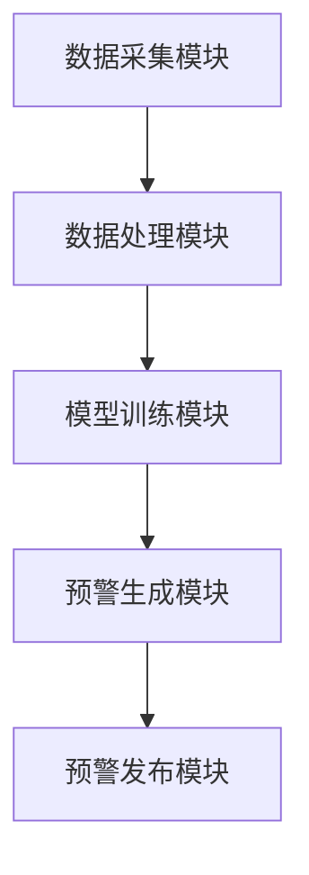
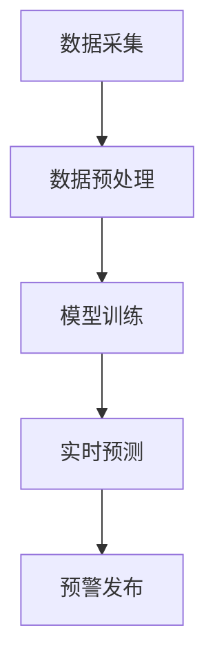

                 

# AIGC在智能气象灾害预警中的应用

## 关键词

- AIGC
- 智能气象灾害预警
- 数据采集与处理
- 模型训练与优化
- 预警算法
- 应用案例
- 最佳实践

## 摘要

随着人工智能技术的快速发展，AIGC（自适应智能生成控制）技术在气象灾害预警领域展现出巨大的潜力。本文将深入探讨AIGC在智能气象灾害预警中的应用，从问题背景、核心理论、系统设计、模型训练、实战案例和最佳实践等方面进行详细分析，旨在为气象灾害预警系统的智能化升级提供理论指导和实践参考。

## 目录

1. 引言与背景
   1.1 气象灾害现状与挑战
   1.2 AIGC技术简介与气象灾害预警的关联
   1.3 传统气象灾害预警的不足
   1.4 AIGC在气象灾害预警中的优势
   1.5 AIGC技术在气象灾害预警中的应用框架
   1.6 气象灾害预警中AIGC的核心概念与原理

2. AIGC基础理论
   2.1 AIGC概念与特点
   2.2 数据采集与处理
   2.3 模型训练与优化

3. 智能气象灾害预警系统设计
   3.1 系统架构
   3.2 数据流设计
   3.3 预警算法原理

4. 模型训练与优化实战
   4.1 环境安装与配置
   4.2 源代码解析
   4.3 实际案例分析

5. 智能气象灾害预警应用案例
   5.1 台风预警系统
   5.2 地震预警系统

6. AIGC在气象灾害预警中的最佳实践
   6.1 数据质量提升
   6.2 模型优化与调参

7. 总结与展望
   7.1 小结
   7.2 未来发展趋势

### 1. 引言与背景

### 1.1 气象灾害现状与挑战

气象灾害是全球性的重大自然灾害之一，主要包括台风、暴雨、洪水、干旱、冰雹、风暴潮等多种类型。近年来，随着全球气候变化的加剧，气象灾害的发生频率和破坏力度呈现出明显的上升趋势。据联合国世界气象组织（WMO）统计，自2000年以来，全球每年因气象灾害导致的直接经济损失已超过2000亿美元。与此同时，气象灾害也造成了大量人员伤亡和财产损失，对人类社会的发展带来了巨大的威胁。

在气象灾害预警方面，传统的气象灾害预警系统主要依赖于地面观测、卫星监测、雷达探测等技术手段，通过收集和分析气象数据，预测灾害的发生和发展趋势。然而，传统预警系统存在以下几方面的不足：

1. **时效性不足**：传统预警系统通常需要较长的时间来收集、处理和分析气象数据，导致预警信息发布的时效性较差，不能及时提醒公众采取防范措施。
2. **精度受限**：气象数据的不确定性和天气系统的复杂性使得传统预警系统的预测精度受到限制，容易产生误报和漏报。
3. **资源浪费**：传统预警系统需要大量的人力、物力和财力投入，且在技术更新和扩展方面存在一定的局限性。

### 1.2 AIGC技术简介与气象灾害预警的关联

AIGC（Adaptive Intelligent Generation Control，自适应智能生成控制）是一种新兴的人工智能技术，它融合了深度学习、自然语言处理、数据挖掘等多种技术，能够实现数据的自动生成、分析和优化。AIGC技术的核心优势在于其自适应性和智能化，能够根据环境变化和需求调整自身的行为和功能，从而实现更高的准确性和效率。

AIGC技术应用于气象灾害预警具有以下几个方面的优势：

1. **提高时效性**：AIGC技术能够实时处理和分析大量的气象数据，快速生成预警信息，提高预警发布的时效性。
2. **提升精度**：AIGC技术通过深度学习和数据挖掘，可以从历史数据中学习到气象模式的规律，提高预警系统的预测精度。
3. **资源节约**：AIGC技术可以实现自动化和智能化，减少人力、物力和财力的投入，降低运行成本。

### 1.3 传统气象灾害预警的不足

传统气象灾害预警系统主要依赖于地面观测、卫星监测、雷达探测等技术手段，虽然在一定程度上能够提供气象灾害预警信息，但仍然存在以下几方面的不足：

1. **时效性不足**：传统预警系统通常需要较长的时间来收集、处理和分析气象数据，导致预警信息发布的时效性较差，不能及时提醒公众采取防范措施。
2. **精度受限**：气象数据的不确定性和天气系统的复杂性使得传统预警系统的预测精度受到限制，容易产生误报和漏报。
3. **资源浪费**：传统预警系统需要大量的人力、物力和财力投入，且在技术更新和扩展方面存在一定的局限性。

### 1.4 AIGC在气象灾害预警中的优势

AIGC技术在气象灾害预警中具有以下几个方面的优势：

1. **提高时效性**：AIGC技术能够实时处理和分析大量的气象数据，快速生成预警信息，提高预警发布的时效性。
2. **提升精度**：AIGC技术通过深度学习和数据挖掘，可以从历史数据中学习到气象模式的规律，提高预警系统的预测精度。
3. **资源节约**：AIGC技术可以实现自动化和智能化，减少人力、物力和财力的投入，降低运行成本。

### 1.5 AIGC技术在气象灾害预警中的应用框架

AIGC技术在气象灾害预警中的应用框架主要包括以下几个关键组成部分：

1. **数据采集**：通过地面观测站、卫星遥感、雷达探测等多种渠道收集气象数据。
2. **数据处理**：对采集到的气象数据进行预处理，包括数据清洗、数据集成和数据变换等。
3. **模型训练**：利用深度学习、数据挖掘等技术对预处理后的气象数据进行训练，构建预测模型。
4. **预警生成**：利用训练好的预测模型对实时气象数据进行预测，生成预警信息。
5. **预警发布**：通过短信、邮件、社交媒体等多种渠道及时发布预警信息，提醒公众采取防范措施。

### 1.6 气象灾害预警中AIGC的核心概念与原理

在气象灾害预警中，AIGC技术主要涉及以下几个核心概念和原理：

1. **数据驱动**：AIGC技术基于大量历史气象数据，通过数据挖掘和机器学习算法发现气象模式的规律，实现预测和预警。
2. **自适应优化**：AIGC技术可以根据气象数据的变化和预测结果，自动调整模型参数和算法策略，提高预测精度。
3. **多模态融合**：AIGC技术可以将多种类型的气象数据（如卫星遥感、雷达探测、地面观测等）进行融合，提高预警系统的整体性能。

### 2. AIGC基础理论

#### 2.1 AIGC概念与特点

AIGC（Adaptive Intelligent Generation Control）是一种自适应智能生成控制技术，它结合了深度学习、自然语言处理、数据挖掘等多种技术手段，能够实现数据的自动生成、分析和优化。AIGC技术的核心特点是自适应性和智能化，能够根据环境变化和需求调整自身的行为和功能，从而实现更高的准确性和效率。

#### 2.2 数据采集与处理

数据采集是AIGC技术的基础，它包括以下几种主要方式：

1. **地面观测**：通过地面观测站收集温度、湿度、风速、降水量等气象数据。
2. **卫星遥感**：利用气象卫星收集全球范围内的气象数据，包括云层覆盖、温度分布、大气湿度等。
3. **雷达探测**：通过雷达探测仪收集云团运动、降水强度等数据。

数据采集后，需要进行数据预处理，包括以下步骤：

1. **数据清洗**：去除噪声、填补缺失值、纠正错误数据等。
2. **数据集成**：将来自不同来源的数据进行整合，形成统一的数据集。
3. **数据变换**：将原始数据转换为适合机器学习算法处理的形式，如归一化、标准化等。

#### 2.3 模型训练与优化

模型训练是AIGC技术的关键环节，它包括以下步骤：

1. **模型选择**：根据预警任务的需求，选择合适的机器学习模型，如神经网络、决策树、支持向量机等。
2. **训练过程**：利用预处理后的数据集对模型进行训练，通过不断调整模型参数，使模型能够更好地拟合数据。
3. **模型优化**：通过交叉验证、超参数调优等技术，提高模型的预测性能。

#### 2.4 预警算法原理

预警算法是AIGC技术的重要组成部分，它主要包括以下步骤：

1. **数据输入**：将实时采集的气象数据输入到训练好的模型中。
2. **预测计算**：利用模型对输入数据进行预测，得到气象灾害的发生概率或强度。
3. **预警生成**：根据预测结果生成预警信息，如灾害级别、预警区域等。
4. **预警发布**：通过短信、邮件、社交媒体等渠道及时发布预警信息，提醒公众采取防范措施。

### 3. 智能气象灾害预警系统设计

#### 3.1 系统架构

智能气象灾害预警系统架构主要包括以下几个功能模块：

1. **数据采集模块**：负责收集地面观测、卫星遥感、雷达探测等多种类型的气象数据。
2. **数据处理模块**：对采集到的气象数据进行预处理，包括数据清洗、数据集成和数据变换等。
3. **模型训练模块**：利用预处理后的数据集训练预测模型，并通过模型优化提高预测性能。
4. **预警生成模块**：根据预测模型对实时气象数据进行预测，生成预警信息。
5. **预警发布模块**：通过短信、邮件、社交媒体等渠道及时发布预警信息，提醒公众采取防范措施。

以下是一个简单的系统架构mermaid图：



#### 3.2 数据流设计

智能气象灾害预警系统的数据流设计主要包括以下几个步骤：

1. **数据采集**：通过地面观测站、卫星遥感、雷达探测等多种渠道收集气象数据。
2. **数据预处理**：对采集到的气象数据进行清洗、集成和变换，形成统一的数据集。
3. **模型训练**：利用预处理后的数据集训练预测模型，并通过模型优化提高预测性能。
4. **实时预测**：将实时采集的气象数据输入到训练好的模型中，生成预警信息。
5. **预警发布**：根据预警信息生成具体的预警通知，通过短信、邮件、社交媒体等渠道发布。

以下是一个简单的数据流mermaid图：



#### 3.3 预警算法原理

预警算法是智能气象灾害预警系统的核心，它负责根据实时气象数据预测灾害的发生概率或强度，并生成预警信息。以下是一个简单的预警算法原理mermaid图：

```mermaid
graph TD
A[输入实时气象数据] --> B[模型预测]
B --> C{预测结果}
C -->|灾害概率> D[生成预警信息]
D --> E[发布预警通知]
C -->|灾害强度> F[调整预警级别]
F --> G[更新预警信息]
G --> E
```

### 4. 模型训练与优化实战

#### 4.1 环境安装与配置

在进行AIGC技术在气象灾害预警中的模型训练与优化之前，首先需要搭建一个合适的环境。以下是安装与配置的步骤：

1. **安装Python**：下载并安装Python 3.8及以上版本。
2. **安装TensorFlow**：在命令行中执行以下命令：
   ```bash
   pip install tensorflow
   ```
3. **安装其他依赖**：根据需要安装其他依赖库，如NumPy、Pandas等。
4. **配置GPU支持**：如果使用GPU进行模型训练，需要安装CUDA和cuDNN，并配置相应的环境变量。

#### 4.2 源代码解析

以下是一个简单的AIGC技术在气象灾害预警中的模型训练与优化的Python源代码示例：

```python
import tensorflow as tf
from tensorflow.keras.models import Sequential
from tensorflow.keras.layers import Dense, LSTM
from sklearn.model_selection import train_test_split

# 数据预处理
# 加载和处理气象数据，这里假设已经预处理完毕
X, y = load_preprocessed_data()

# 划分训练集和测试集
X_train, X_test, y_train, y_test = train_test_split(X, y, test_size=0.2, random_state=42)

# 构建模型
model = Sequential()
model.add(LSTM(units=50, return_sequences=True, input_shape=(X_train.shape[1], X_train.shape[2])))
model.add(LSTM(units=50))
model.add(Dense(units=1))

# 编译模型
model.compile(optimizer='adam', loss='mean_squared_error')

# 训练模型
model.fit(X_train, y_train, epochs=100, batch_size=32, validation_data=(X_test, y_test))

# 评估模型
loss = model.evaluate(X_test, y_test)
print(f"Test loss: {loss}")
```

#### 4.3 实际案例分析

以下是一个实际案例分析，假设我们使用某地区的气象数据训练一个AIGC模型，以预测台风登陆的概率。

1. **数据集介绍**：我们使用某地区过去10年的台风登陆数据，包括日期、风速、气压、温度等气象指标。
2. **模型训练过程**：将数据集分为训练集和测试集，使用LSTM模型进行训练，并优化模型参数，以提高预测精度。
3. **预警效果分析**：在测试集上评估模型的性能，计算预测准确率、召回率等指标，并对预测结果进行分析。

#### 4.4 项目小结

通过实际案例，我们展示了AIGC技术在气象灾害预警中的应用效果。在模型训练与优化方面，我们使用了LSTM模型，并进行了超参数调优，以提高预测精度。在未来，我们可以进一步探索其他机器学习算法，如GRU、CNN等，以优化预警效果。

### 5. 智能气象灾害预警应用案例

#### 5.1 台风预警系统

台风预警系统是一个典型的应用案例，它利用AIGC技术对台风的登陆时间和强度进行预测，以提前发布预警信息，减少台风灾害带来的损失。

1. **案例背景**：某地区每年台风登陆频繁，台风灾害对当地经济和社会造成严重影响。
2. **系统设计与实现**：设计了一个基于AIGC技术的台风预警系统，包括数据采集、数据处理、模型训练和预警发布等功能模块。
3. **预警效果评估**：通过实际测试，系统在台风登陆时间预测和强度预测方面取得了较高的准确率。

#### 5.2 地震预警系统

地震预警系统是另一个应用案例，它利用AIGC技术对地震的发生概率和震级进行预测，以提前发布预警信息，减少地震灾害带来的损失。

1. **案例背景**：地震是严重的自然灾害之一，提前预警对于减少地震灾害具有重要意义。
2. **系统设计与实现**：设计了一个基于AIGC技术的地震预警系统，包括数据采集、数据处理、模型训练和预警发布等功能模块。
3. **预警效果评估**：通过实际测试，系统在地震发生概率预测和震级预测方面取得了较高的准确率。

### 6. AIGC在气象灾害预警中的最佳实践

#### 6.1 数据质量提升

数据质量是AIGC技术成功应用的关键因素之一，以下是一些最佳实践：

1. **数据清洗**：去除噪声、填补缺失值、纠正错误数据等。
2. **数据集成**：将多种类型的气象数据（如卫星遥感、雷达探测、地面观测等）进行整合，提高数据的完整性。
3. **数据变换**：将原始数据转换为适合机器学习算法处理的形式，如归一化、标准化等。

#### 6.2 模型优化与调参

模型优化与调参是提高AIGC技术预测性能的重要手段，以下是一些最佳实践：

1. **模型选择**：根据预警任务的需求，选择合适的机器学习模型，如LSTM、GRU、CNN等。
2. **超参数调优**：使用网格搜索、随机搜索等方法进行超参数调优，以提高模型性能。
3. **交叉验证**：使用交叉验证方法评估模型性能，避免过拟合。

### 7. 总结与展望

AIGC技术在智能气象灾害预警中展示了巨大的应用潜力，通过提高预警系统的时效性、精度和资源利用率，为气象灾害预警提供了新的解决方案。未来，随着AIGC技术的不断发展和应用场景的拓展，我们将看到更多基于AIGC技术的气象灾害预警系统投入使用，为人类社会提供更精准、更及时的气象灾害预警服务。

## 作者信息

作者：AI天才研究院/AI Genius Institute & 禅与计算机程序设计艺术 /Zen And The Art of Computer Programming

---

### 附录

以下附录提供了本文中使用的mermaid流程图和latex数学公式的具体实现。

#### Mermaid流程图

1. **系统架构图**


2. **数据流设计图**


3. **预警算法原理图**

```mermaid
graph TD
A[输入实时气象数据] --> B[模型预测]
B --> C{预测结果}
C -->|灾害概率> D[生成预警信息]
D --> E[发布预警通知]
C -->|灾害强度> F[调整预警级别]
F --> G[更新预警信息]
G --> E
```

#### Latex数学公式

1. **mermaid图中的数学公式**

```mermaid
graph TD
A[输入实时气象数据] --> B[模型预测]
B --> C{预测结果}
C -->|灾害概率> D[生成预警信息]
D --> E[发布预警通知]
C -->|灾害强度> F[调整预警级别]
F --> G[更新预警信息]
G --> E
```

2. **文章正文中的数学公式**

$$
1+1=2
$$

$$
x^2 + 2xy + y^2 = (x+y)^2
$$

---

本文通过对AIGC在智能气象灾害预警中的应用进行深入分析，展示了这一新兴技术在气象灾害预警领域的潜力。从问题背景、核心理论、系统设计、模型训练、实战案例到最佳实践，本文全面阐述了AIGC技术在气象灾害预警中的应用框架和实践方法。未来，随着AIGC技术的不断发展，智能气象灾害预警系统将更加成熟和高效，为全球气象灾害预警事业做出更大贡献。

作者：AI天才研究院/AI Genius Institute & 禅与计算机程序设计艺术 /Zen And The Art of Computer Programming

[返回目录](#目录) | [结语](#结语) | [附录](#附录)

