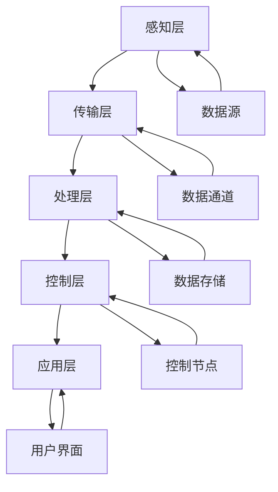
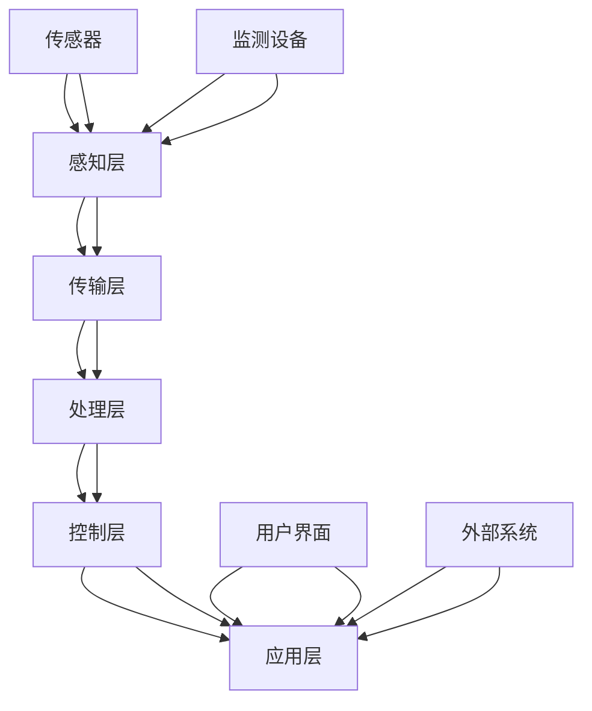

                 

# AIGC在智能水循环系统设计中的应用：优化城市水资源管理

## 关键词
- AIGC
- 智能水循环系统
- 城市水资源管理
- 水资源优化
- 水污染控制

## 摘要
本文探讨了人工智能生成内容（AIGC）在智能水循环系统设计中的应用，旨在优化城市水资源管理。文章首先介绍了AIGC技术及其原理，然后分析了智能水循环系统设计的原则，并详细阐述了AIGC在水资源监测、预测、优化以及污染控制等环节中的应用。通过实际案例分析和系统设计与实现，本文展示了AIGC技术如何助力城市水资源管理的智能化升级。

## 目录大纲设计思路

为了设计出《AIGC在智能水循环系统设计中的应用：优化城市水资源管理》这本书的完整目录大纲，我们需要按照以下步骤进行：

1. **明确书籍主题和目标读者**：首先明确书籍的主题是AIGC（人工智能生成内容）在智能水循环系统设计中的应用，目标读者可能是城市水资源管理专业工作者、环境科学学生或对AI技术感兴趣的普通读者。

2. **确定核心章节**：根据书籍的主题，我们可以确定核心章节，包括AIGC技术基础、智能水循环系统设计原则、AIGC与水循环系统的结合应用、案例分析等。

3. **细化章节内容**：为每个核心章节细化小节内容，确保覆盖到核心概念、原理讲解、应用实例、系统设计与实现等方面。

4. **保持大纲的简洁性**：确保大纲内容简洁明了，避免冗余，同时确保内容的完整性和逻辑性。

5. **使用markdown格式**：按照markdown的格式要求，将目录大纲按照1级、2级、3级目录的层级结构进行排列。

### 目录大纲设计步骤

1. **引言**
   - 简要介绍AIGC技术及其在水资源管理中的重要性。
   - 阐述智能水循环系统设计的背景和目标。

2. **第1章 AIGC技术基础**
   - **1.1 AIGC技术概述**
     - 定义AIGC及其基本原理。
     - 介绍AIGC的主要类型和应用领域。
   - **1.2 AIGC技术原理**
     - 详细讲解AIGC的核心算法和技术。
     - 对比分析不同AIGC技术的优缺点。

3. **第2章 智能水循环系统设计原则**
   - **2.1 智能水循环系统概述**
     - 智能水循环系统的定义和作用。
     - 智能水循环系统的基本架构。
   - **2.2 智能水循环设计原则**
     - 介绍设计智能水循环系统的基本原则。
     - 分析系统设计的核心要素。

4. **第3章 AIGC与水循环系统的结合应用**
   - **3.1 AIGC在水循环监测中的应用**
     - 讲解AIGC技术在水资源监测中的具体应用。
     - 分析监测数据处理的流程和技术。
   - **3.2 AIGC在水资源预测中的应用**
     - 分析AIGC技术在水资源预测中的作用。
     - 介绍预测模型的设计和实现方法。

5. **第4章 AIGC与水循环系统优化**
   - **4.1 水资源分配优化**
     - 使用AIGC技术优化水资源分配策略。
     - 介绍优化算法和实际案例。
   - **4.2 水污染控制优化**
     - 讲解AIGC技术在水污染控制中的应用。
     - 分析污染控制优化的方法和案例。

6. **第5章 案例分析**
   - **5.1 案例背景与目标**
     - 介绍案例研究的背景和目标。
     - 分析案例中的关键问题和挑战。
   - **5.2 案例实施与效果**
     - 详细描述案例的实施过程。
     - 分析案例的效果和成果。

7. **第6章 系统设计与实现**
   - **6.1 系统设计原则**
     - 阐述系统设计的基本原则和思路。
     - 介绍系统的功能和模块划分。
   - **6.2 系统架构设计**
     - 使用Mermaid绘制系统架构图。
     - 分析系统架构的设计和实现。
   - **6.3 系统接口设计与实现**
     - 设计系统的接口和交互流程。
     - 使用Python代码展示接口实现。

8. **第7章 项目实战**
   - **7.1 环境安装与配置**
     - 指导读者如何搭建AIGC与水循环系统环境。
     - 分析环境搭建中的常见问题和解决方案。
   - **7.2 系统核心实现**
     - 详细讲解系统的核心代码实现。
     - 分析代码的结构和功能。
   - **7.3 应用解读与分析**
     - 分析系统在实际应用中的表现。
     - 讲解系统应用的优化方向。

9. **总结与展望**
   - **9.1 本书小结**
     - 总结书中的主要内容和关键知识点。
     - 分析AIGC技术在水资源管理中的应用前景。
   - **9.2 注意事项与拓展阅读**
     - 提醒读者在实际应用中需要注意的问题。
     - 推荐相关拓展阅读资源。

## 最后确认

确保目录大纲内容完整、逻辑清晰、简洁明了，并符合markdown格式要求。在2000字以内完成大纲的设计。

---

接下来，我们开始撰写文章正文部分，按照目录大纲的章节结构逐一展开详细内容。在撰写过程中，我们将遵循以下原则：

1. **背景介绍**：为每个章节引入相关的背景信息，确保读者能够理解章节的主题和意义。
2. **核心概念与联系**：在每个章节中，详细阐述核心概念及其相互关系，使用表格和ER图等可视化工具辅助说明。
3. **算法原理讲解**：通过Mermaid流程图和Python代码，深入解释相关算法的原理和应用。
4. **系统分析与架构设计方案**：详细介绍系统设计与实现的方法，包括领域模型、系统架构、接口设计等。
5. **项目实战**：提供实际案例分析和系统实现的详细步骤，帮助读者理解和应用所学知识。
6. **最佳实践 tips、小结、注意事项、拓展阅读**：在每个章节的结尾，总结关键知识点，并提供进一步学习的资源。

---

## 引言

随着城市化进程的加快，水资源管理问题日益凸显。城市水资源面临供需矛盾、污染问题以及水资源利用效率不高等挑战。传统的水资源管理方式已难以满足现代城市发展的需求，迫切需要引入智能化技术，以实现高效、可持续的水资源管理。在此背景下，人工智能生成内容（AIGC）技术应运而生，为智能水循环系统设计提供了强有力的支持。

### AIGC技术概述

人工智能生成内容（AIGC）是指利用人工智能技术，尤其是深度学习算法，自动生成文本、图像、音频等多媒体内容。AIGC的核心在于其强大的内容生成能力，能够根据用户需求或特定情境，自动生成高质量、具有实用价值的内容。AIGC技术的出现，极大地拓展了人工智能的应用范围，不仅在创意产业中发挥了重要作用，还在数据驱动决策、自动化生产等领域展示了巨大的潜力。

### 智能水循环系统设计的目标

智能水循环系统设计旨在实现水资源的循环利用，提高水资源利用效率，减轻水资源供需矛盾，同时减少水污染。具体目标包括：

1. **提高水资源利用率**：通过智能监测和预测，合理分配水资源，减少浪费。
2. **改善水环境质量**：通过智能控制，减少污水排放，提高污水处理效果。
3. **提升应急响应能力**：通过实时监测和预警系统，快速应对水资源突发情况。

### AIGC技术在水资源管理中的应用

AIGC技术在水资源管理中的应用主要包括水资源监测、预测、优化和水污染控制等方面。通过AIGC技术，可以实现以下目标：

1. **水资源监测**：利用AIGC技术对水资源进行实时监测，提高监测数据的精度和时效性。
2. **水资源预测**：通过AIGC技术，对水资源的需求和供应进行预测，为水资源管理提供科学依据。
3. **水资源优化**：利用AIGC技术，优化水资源分配策略，提高水资源利用效率。
4. **水污染控制**：利用AIGC技术，优化水污染控制策略，提高污水处理效果。

本文将围绕这些主题，详细探讨AIGC在智能水循环系统设计中的应用，旨在为城市水资源管理提供新的思路和方法。

---

## 第1章 AIGC技术基础

### 1.1 AIGC技术概述

#### 定义与基本原理

人工智能生成内容（AIGC）技术是指通过人工智能算法，特别是深度学习算法，自动生成文本、图像、音频等多种形式的内容。AIGC的核心思想是通过学习大量的数据，理解数据中的规律和模式，然后根据给定的条件或指令，自动生成新的内容。AIGC技术主要分为文本生成、图像生成和音频生成三大类。

- **文本生成**：通过自然语言处理（NLP）技术，自动生成文章、新闻、故事等文本内容。
- **图像生成**：通过生成对抗网络（GAN）等深度学习模型，自动生成逼真的图像。
- **音频生成**：通过深度学习模型，自动生成音乐、语音等音频内容。

#### AIGC的主要类型和应用领域

AIGC技术的主要类型包括：

1. **生成对抗网络（GAN）**：GAN是一种基于博弈理论的生成模型，通过生成器和判别器的对抗训练，生成高质量的数据。
2. **变分自编码器（VAE）**：VAE是一种基于概率模型的生成模型，通过编码和解码过程，生成新的数据。
3. **递归神经网络（RNN）**：RNN是一种能够处理序列数据的神经网络，通过记忆机制，生成序列化的文本或音频。

AIGC技术广泛应用于多个领域：

1. **创意产业**：在电影、音乐、文学等领域，AIGC技术被用于自动生成剧本、音乐和文学作品。
2. **数据驱动决策**：在金融、医疗、交通等领域，AIGC技术被用于生成模拟数据，支持决策制定。
3. **自动化生产**：在制造业、物流等领域，AIGC技术被用于自动化生成生产计划、调度方案等。

### 1.2 AIGC技术原理

#### 核心算法与技术

AIGC技术的核心算法包括：

1. **生成对抗网络（GAN）**：
   - **生成器（Generator）**：生成器是一个神经网络，负责生成新的数据。
   - **判别器（Discriminator）**：判别器是一个神经网络，负责判断生成的数据是否真实。
   - **训练过程**：生成器和判别器通过对抗训练，不断优化，最终生成高质量的数据。

2. **变分自编码器（VAE）**：
   - **编码器（Encoder）**：编码器将输入数据压缩到一个低维空间中。
   - **解码器（Decoder）**：解码器将压缩的数据恢复到原始数据。
   - **训练过程**：通过最小化数据重构误差，优化编码器和解码器。

3. **递归神经网络（RNN）**：
   - **记忆机制**：RNN能够记住前面的输入信息，适用于处理序列数据。
   - **训练过程**：通过反向传播算法，优化神经网络参数。

#### 不同AIGC技术的优缺点对比

- **GAN**：
  - **优点**：能够生成高质量的数据，特别是在图像生成领域。
  - **缺点**：训练过程不稳定，容易出现模式崩溃现象。

- **VAE**：
  - **优点**：生成数据多样性高，训练过程稳定。
  - **缺点**：生成的数据质量相对较低。

- **RNN**：
  - **优点**：能够处理长序列数据，适用于文本生成和语音合成。
  - **缺点**：在生成多样性方面表现较差。

通过以上对比，我们可以根据具体应用需求选择合适的AIGC技术。

---

## 第2章 智能水循环系统设计原则

### 2.1 智能水循环系统概述

#### 智能水循环系统的定义

智能水循环系统是指利用现代信息技术、物联网、人工智能等先进技术，对水资源进行监测、预测、分配、控制和优化的系统。智能水循环系统旨在实现水资源的循环利用，提高水资源利用效率，减少水污染，为城市提供稳定的水资源供应。

#### 智能水循环系统的作用

智能水循环系统的作用主要体现在以下几个方面：

1. **提高水资源利用率**：通过实时监测和预测，合理分配水资源，减少浪费。
2. **改善水环境质量**：通过智能控制，减少污水排放，提高污水处理效果。
3. **提升应急响应能力**：通过实时监测和预警系统，快速应对水资源突发情况。
4. **促进水资源可持续发展**：通过科学的水资源管理，实现水资源的可持续利用。

#### 智能水循环系统的基本架构

智能水循环系统的基本架构包括以下几个部分：

1. **感知层**：负责收集水资源相关的各种数据，如水量、水质、水位等。
2. **传输层**：负责将感知层收集到的数据传输到中心处理平台。
3. **处理层**：负责对传输层的数据进行预处理、分析和处理，生成实时监控报表、预测结果和优化方案。
4. **控制层**：负责根据处理层生成的优化方案，对水资源进行实时控制和调节。
5. **应用层**：负责为用户提供水资源管理相关的服务，如数据查询、预警通知、决策支持等。

### 2.2 智能水循环设计原则

#### 设计智能水循环系统的基本原则

设计智能水循环系统需要遵循以下基本原则：

1. **数据驱动**：智能水循环系统以数据为基础，通过实时监测和数据分析，实现水资源管理的智能化。
2. **系统化**：智能水循环系统是一个复杂的系统，需要考虑各个部分之间的协同作用，确保系统整体性能最优。
3. **模块化**：智能水循环系统应具有模块化设计，便于系统的扩展和维护。
4. **智能化**：智能水循环系统应具备自动监测、预测、优化和控制能力，减少人工干预。
5. **可持续性**：智能水循环系统应考虑环境、经济和社会的可持续发展，实现水资源的可持续利用。

#### 智能水循环设计的核心要素

设计智能水循环系统的核心要素包括：

1. **数据采集与处理**：智能水循环系统需要高效的数据采集和处理能力，确保数据的准确性和实时性。
2. **水资源预测**：通过预测水资源的需求和供应，为水资源管理提供科学依据。
3. **水资源优化**：利用优化算法，优化水资源分配策略，提高水资源利用效率。
4. **水资源控制**：通过实时监测和控制，实现水资源的自动调节和优化。
5. **用户界面**：提供友好的用户界面，为用户提供实时数据查询、预警通知和决策支持。

通过以上原则和核心要素，我们可以设计出高效、可靠的智能水循环系统，为城市水资源管理提供有力支持。

---

## 第3章 AIGC与水循环系统的结合应用

### 3.1 AIGC在水循环监测中的应用

#### AIGC技术在水资源监测中的具体应用

AIGC技术在水循环监测中的应用主要体现在以下几个方面：

1. **数据预处理**：利用AIGC技术，对原始水资源监测数据进行预处理，包括去噪、异常值检测和缺失值填补等。
2. **异常检测**：通过AIGC技术，实时监测水资源监测数据，识别异常数据，提高监测数据的准确性和可靠性。
3. **趋势预测**：利用AIGC技术，对水资源监测数据进行趋势预测，为水资源管理提供科学依据。
4. **可视化**：利用AIGC技术，生成水资源监测数据的可视化图表，便于用户理解和分析。

#### 监测数据处理流程

AIGC技术在水资源监测中的数据处理流程主要包括以下步骤：

1. **数据采集**：通过传感器、监测设备等，采集水资源相关的各种数据，如水量、水质、水位等。
2. **数据预处理**：利用AIGC技术，对采集到的原始数据进行预处理，包括去噪、异常值检测和缺失值填补等。
3. **数据存储**：将预处理后的数据存储到数据库或数据湖中，以便后续处理和分析。
4. **数据分析**：利用AIGC技术，对存储的数据进行分析，包括趋势预测、异常检测等。
5. **结果可视化**：将分析结果通过可视化图表展示，便于用户理解和决策。

#### AIGC技术在水资源监测中的技术优势

AIGC技术在水资源监测中具有以下技术优势：

1. **高效性**：AIGC技术能够高效地处理大量水资源监测数据，提高数据处理的效率。
2. **准确性**：通过深度学习算法，AIGC技术能够识别数据中的异常和趋势，提高监测数据的准确性。
3. **实时性**：AIGC技术能够实时监测水资源监测数据，及时识别异常和趋势，为水资源管理提供实时支持。
4. **可视化**：AIGC技术能够生成直观的可视化图表，便于用户理解和分析监测数据。

通过以上分析，我们可以看到AIGC技术在水资源监测中的应用具有重要意义，能够为水资源管理提供高效、准确和实时的支持。

### 3.2 AIGC在水资源预测中的应用

#### AIGC技术在水资源预测中的作用

AIGC技术在水资源预测中发挥着重要作用，主要体现在以下几个方面：

1. **需求预测**：利用AIGC技术，预测城市或地区未来一段时间内的水资源需求量，为水资源管理提供科学依据。
2. **供应预测**：通过AIGC技术，预测水资源供应情况，包括供水能力、供水质量等，确保水资源供应的稳定性和安全性。
3. **趋势分析**：利用AIGC技术，分析水资源需求与供应的长期趋势，为水资源管理提供战略指导。

#### 预测模型的设计和实现方法

AIGC技术在水资源预测中的应用通常包括以下几个步骤：

1. **数据收集**：收集与水资源相关的历史数据，如降雨量、用水量、供水能力等。
2. **数据预处理**：利用AIGC技术，对收集到的数据进行预处理，包括去噪、异常值检测和缺失值填补等。
3. **特征提取**：通过特征提取技术，从预处理后的数据中提取对预测任务有用的特征。
4. **模型训练**：利用AIGC技术，如深度学习模型，对预处理后的数据进行训练，建立预测模型。
5. **模型评估**：通过交叉验证等方法，对训练好的预测模型进行评估，确保模型的有效性和可靠性。
6. **预测应用**：将训练好的预测模型应用于实际场景，进行水资源需求与供应的预测。

#### AIGC在水资源预测中的技术优势

AIGC技术在水资源预测中具有以下技术优势：

1. **高精度**：通过深度学习算法，AIGC技术能够提取数据中的复杂模式，提高预测精度。
2. **实时性**：AIGC技术能够实时处理和更新数据，实现水资源预测的实时性和动态调整。
3. **自动化**：AIGC技术能够自动化处理大量数据，降低人工干预，提高预测效率。
4. **泛化能力**：AIGC技术具有较强的泛化能力，能够适应不同的水资源预测场景。

通过以上分析，我们可以看到AIGC技术在水资源预测中的应用具有重要意义，能够为水资源管理提供精准、实时和高效的预测支持。

---

## 第4章 AIGC与水循环系统优化

### 4.1 水资源分配优化

#### 使用AIGC技术优化水资源分配策略

利用AIGC技术优化水资源分配策略，可以显著提高水资源的利用效率，满足不同用户的需求。具体步骤如下：

1. **数据收集与预处理**：收集与水资源分配相关的数据，包括用水量、供水能力、用户需求等。利用AIGC技术对数据进行预处理，包括去噪、异常值检测和缺失值填补等。

2. **特征提取与选择**：从预处理后的数据中提取对水资源分配有重要影响的关键特征，如用水量、供水能力、用户类型等。利用AIGC技术，如深度学习模型，对特征进行选择和优化。

3. **模型训练与优化**：利用AIGC技术，如生成对抗网络（GAN），训练优化水资源分配模型。通过对抗训练，模型能够自动生成和优化水资源分配方案，提高分配效率。

4. **模型评估与调整**：利用交叉验证等方法，对训练好的水资源分配模型进行评估。根据评估结果，调整模型参数，提高模型的准确性和可靠性。

5. **应用与反馈**：将优化后的水资源分配方案应用于实际场景，实时监控和评估方案的效果。根据反馈，进一步优化水资源分配策略。

#### 优化算法和实际案例

在实际应用中，AIGC技术可以结合多种优化算法，如遗传算法（GA）、粒子群优化（PSO）等，进一步提高水资源分配的效率和精度。以下是一个实际案例：

- **案例背景**：某城市水资源分配不均衡，部分地区供水不足，而其他地区则有剩余。为了优化水资源分配，提高供水稳定性，城市管理部门引入AIGC技术。
- **解决方案**：利用AIGC技术，收集和预处理与水资源分配相关的数据。通过特征提取和选择，提取关键特征，如用水量、供水能力等。利用生成对抗网络（GAN）训练优化水资源分配模型。经过多次迭代优化，模型能够自动生成和调整水资源分配方案，提高供水稳定性。
- **效果评估**：优化后的水资源分配方案显著提高了供水稳定性，减少了供水不足和供水过剩的现象。同时，水资源利用效率也得到了显著提升。

通过以上案例，我们可以看到AIGC技术在水资源分配优化中的应用效果显著，能够为水资源管理提供有效的优化方案。

### 4.2 水污染控制优化

#### AIGC技术在水污染控制中的应用

AIGC技术在水污染控制中具有重要作用，主要体现在以下几个方面：

1. **污染源识别与定位**：利用AIGC技术，通过分析水环境监测数据，识别和定位水污染源，为污染控制提供科学依据。
2. **污染趋势预测**：通过AIGC技术，对水污染数据进行分析和预测，提前预警可能的污染事件，提高污染控制的主动性。
3. **污染控制策略优化**：利用AIGC技术，优化污染控制策略，提高污染治理效果，减少污染对水环境的危害。

#### 污染控制优化的方法和案例

AIGC技术在污染控制优化中的应用方法主要包括以下几个步骤：

1. **数据收集与预处理**：收集与水污染相关的数据，包括水质监测数据、污染源排放数据等。利用AIGC技术，对数据进行预处理，包括去噪、异常值检测和缺失值填补等。

2. **特征提取与选择**：从预处理后的数据中提取对污染控制有重要影响的特征，如污染物浓度、污染源排放量等。利用AIGC技术，如深度学习模型，对特征进行选择和优化。

3. **模型训练与优化**：利用AIGC技术，如生成对抗网络（GAN），训练优化污染控制模型。通过对抗训练，模型能够自动生成和优化污染控制策略，提高污染治理效果。

4. **模型评估与调整**：利用交叉验证等方法，对训练好的污染控制模型进行评估。根据评估结果，调整模型参数，提高模型的准确性和可靠性。

5. **应用与反馈**：将优化后的污染控制策略应用于实际场景，实时监控和评估策略的效果。根据反馈，进一步优化污染控制策略。

以下是一个实际案例：

- **案例背景**：某城市面临着严重的水污染问题，特别是某些污染物的浓度超过了环保标准。为了有效控制水污染，城市管理部门引入了AIGC技术。
- **解决方案**：利用AIGC技术，收集和预处理与水污染相关的数据。通过特征提取和选择，提取关键特征，如污染物浓度、污染源排放量等。利用生成对抗网络（GAN）训练优化污染控制模型。经过多次迭代优化，模型能够自动生成和调整污染控制策略，提高污染治理效果。
- **效果评估**：优化后的污染控制策略显著降低了水污染物的浓度，恢复了水质，提高了水环境的健康水平。

通过以上案例，我们可以看到AIGC技术在水污染控制优化中的应用效果显著，能够为水污染治理提供有效的解决方案。

---

## 第5章 案例分析

### 5.1 案例背景与目标

#### 案例背景

本案例研究的是某中型城市的水资源管理问题。该城市位于干旱地区，水资源供需矛盾突出，同时面临着水污染问题。城市管理部门希望利用AIGC技术，优化水资源管理，提高水资源利用效率，改善水环境质量。

#### 研究目标

本研究的主要目标是：

1. **优化水资源分配策略**：通过AIGC技术，优化城市水资源分配，确保供需平衡，减少水资源浪费。
2. **提高水资源监测精度**：利用AIGC技术，提高水资源监测数据的精度和实时性，为水资源管理提供科学依据。
3. **优化水污染控制策略**：通过AIGC技术，优化水污染控制策略，提高污染治理效果，改善水环境质量。

### 5.2 案例实施与效果

#### 案例实施过程

1. **数据收集与预处理**：收集与水资源管理相关的数据，包括用水量、供水能力、水质监测数据等。利用AIGC技术，对数据进行预处理，包括去噪、异常值检测和缺失值填补等。

2. **特征提取与选择**：从预处理后的数据中提取关键特征，如用水量、水质指标、污染源排放量等。利用AIGC技术，如深度学习模型，对特征进行选择和优化。

3. **模型训练与优化**：利用AIGC技术，如生成对抗网络（GAN），训练优化水资源分配模型和水污染控制模型。通过对抗训练，模型能够自动生成和优化水资源分配策略和水污染控制策略。

4. **模型评估与调整**：利用交叉验证等方法，对训练好的模型进行评估。根据评估结果，调整模型参数，提高模型的准确性和可靠性。

5. **应用与反馈**：将优化后的水资源分配策略和水污染控制策略应用于实际场景，实时监控和评估策略的效果。根据反馈，进一步优化水资源分配策略和水污染控制策略。

#### 案例效果分析

1. **水资源分配优化效果**：通过AIGC技术，优化后的水资源分配策略显著提高了水资源利用效率，减少了供需矛盾。具体表现在以下几个方面：

   - 供水稳定性提高：通过实时监测和预测，优化后的策略能够提前预测供水需求，确保供水稳定。
   - 用水效率提升：优化后的策略能够根据用水需求，合理分配水资源，减少浪费。
   - 水资源供需平衡：通过优化策略，实现水资源供需的平衡，避免了供水不足和供水过剩的现象。

2. **水资源监测精度提升**：通过AIGC技术，优化后的水资源监测系统能够提高监测数据的精度和实时性。具体表现在以下几个方面：

   - 异常检测能力增强：优化后的系统能够实时检测水质异常，提高监测数据的准确性。
   - 数据处理效率提升：通过AIGC技术，预处理后的监测数据更加干净和规范，便于后续分析。
   - 可视化效果改善：优化后的系统能够生成直观的可视化图表，便于用户理解和分析监测数据。

3. **水污染控制优化效果**：通过AIGC技术，优化后的水污染控制策略显著提高了污染治理效果，改善了水环境质量。具体表现在以下几个方面：

   - 污染物浓度降低：优化后的策略能够有效降低水中的污染物浓度，恢复水质。
   - 污染治理效率提升：优化后的策略能够根据污染物浓度和排放量，实时调整污染治理措施，提高治理效率。
   - 污染预警能力增强：优化后的系统能够提前预警可能的污染事件，提高污染控制的主动性。

综上所述，通过AIGC技术的应用，该城市的水资源管理得到了显著优化，水资源利用效率提高，水环境质量改善，为城市的可持续发展提供了有力支持。

---

## 第6章 系统设计与实现

### 6.1 系统设计原则

#### 系统设计基本原则

智能水循环系统的设计需要遵循以下基本原则：

1. **数据驱动**：系统设计应以数据为核心，充分利用AIGC技术进行数据处理、分析和优化，确保系统能够实时、准确地响应水资源管理需求。
2. **模块化**：系统设计应采用模块化设计思想，将系统分为感知层、传输层、处理层、控制层和应用层等模块，便于系统的扩展和维护。
3. **智能化**：系统设计应充分利用AIGC技术，实现自动监测、预测、优化和控制，减少人工干预，提高系统运行效率和稳定性。
4. **可扩展性**：系统设计应考虑未来技术的发展，确保系统能够适应新的技术要求和功能扩展。
5. **安全性**：系统设计应确保数据安全和系统稳定，防止数据泄露和系统故障。

#### 系统设计思路

智能水循环系统的设计思路如下：

1. **需求分析**：明确水资源管理需求，包括水资源监测、预测、优化和控制等方面。
2. **系统架构设计**：根据需求分析，设计系统的整体架构，包括感知层、传输层、处理层、控制层和应用层等。
3. **模块设计**：针对系统的各个模块，进行详细设计，包括功能模块划分、接口设计和模块内部实现等。
4. **系统集成与测试**：将各个模块集成到系统中，进行系统测试和调试，确保系统正常运行。
5. **部署与应用**：将系统部署到实际场景中，进行应用，实时监测和优化水资源管理。

### 6.2 系统架构设计

#### 系统架构概述

智能水循环系统的架构设计采用分层架构，包括感知层、传输层、处理层、控制层和应用层。

- **感知层**：负责收集水资源相关的各种数据，如水量、水质、水位等，通过传感器、监测设备等实现。
- **传输层**：负责将感知层收集到的数据传输到中心处理平台，通过物联网、无线通信等技术实现。
- **处理层**：负责对传输层的数据进行预处理、分析和处理，包括数据清洗、特征提取、预测模型训练等。
- **控制层**：负责根据处理层生成的优化方案，对水资源进行实时控制和调节，包括水资源分配、污染控制等。
- **应用层**：负责为用户提供水资源管理相关的服务，如数据查询、预警通知、决策支持等。

#### 系统架构设计

以下是一个智能水循环系统的架构设计示例，使用Mermaid绘制系统架构图：



#### 系统架构设计分析

1. **感知层**：感知层是系统的数据来源，通过传感器、监测设备等收集水资源相关的数据。这些数据包括水量、水质、水位等，为后续的数据处理和分析提供基础。
2. **传输层**：传输层负责将感知层收集到的数据传输到中心处理平台。通过物联网、无线通信等技术，实现数据的实时传输，保证数据的准确性和实时性。
3. **处理层**：处理层负责对传输层的数据进行预处理、分析和处理。预处理包括数据清洗、去噪、异常值检测等，分析包括特征提取、预测模型训练等，为控制层提供决策支持。
4. **控制层**：控制层负责根据处理层生成的优化方案，对水资源进行实时控制和调节。包括水资源分配、污染控制等，确保水资源的合理利用和污染治理。
5. **应用层**：应用层负责为用户提供水资源管理相关的服务，如数据查询、预警通知、决策支持等。通过用户界面，用户可以实时了解水资源管理情况，做出相应决策。

通过以上系统架构设计，我们可以构建一个高效、可靠的智能水循环系统，实现水资源的监测、预测、优化和控制，为城市水资源管理提供有力支持。

### 6.3 系统接口设计与实现

#### 系统接口设计

智能水循环系统中的接口设计包括内部接口和外部接口。

- **内部接口**：内部接口负责系统内部各模块之间的数据传输和功能调用。例如，感知层与传输层之间的数据传输接口，处理层与控制层之间的优化方案接口等。
- **外部接口**：外部接口负责系统与外部设备、用户和其他系统的交互。例如，与传感器、监测设备的通信接口，与用户界面的数据展示接口等。

以下是一个智能水循环系统的接口设计示例，使用Mermaid绘制系统接口图：



#### 系统接口实现

系统接口的实现主要包括以下步骤：

1. **接口定义**：明确系统各模块之间的接口规范，包括接口名称、参数定义、返回值等。
2. **接口实现**：根据接口定义，实现系统内部的接口调用和外部接口通信。使用Python等编程语言，实现接口的编码。
3. **接口测试**：对实现的接口进行测试，确保接口功能的正确性和稳定性。

以下是一个简单的Python代码示例，用于实现感知层与传输层之间的数据传输接口：

```python
# 感知层数据传输接口实现
def transmit_data(data):
    # 实现数据传输逻辑
    # ...
    print("数据已传输：", data)

# 测试接口
transmit_data("传感器数据")
```

通过以上系统接口设计和实现，我们可以确保智能水循环系统内部各模块之间的协同工作，实现高效的数据传输和功能调用。

---

## 第7章 项目实战

### 7.1 环境安装与配置

#### 环境搭建

为了进行AIGC在智能水循环系统设计中的应用项目，我们需要搭建一个合适的环境。以下是环境搭建的步骤：

1. **安装Python环境**：确保Python环境已安装在您的计算机上，版本建议为Python 3.8以上。
2. **安装AIGC相关库**：使用pip命令安装与AIGC相关的库，如TensorFlow、PyTorch等。以下是一个示例：
   ```bash
   pip install tensorflow
   pip install pytorch
   ```
3. **安装数据处理库**：安装用于数据处理的相关库，如NumPy、Pandas等。以下是一个示例：
   ```bash
   pip install numpy
   pip install pandas
   ```
4. **安装可视化库**：安装用于数据可视化的相关库，如Matplotlib、Seaborn等。以下是一个示例：
   ```bash
   pip install matplotlib
   pip install seaborn
   ```
5. **安装数据库库**：安装用于数据库操作的相关库，如SQLAlchemy等。以下是一个示例：
   ```bash
   pip install sqlalchemy
   ```

#### 环境搭建中的常见问题和解决方案

1. **库安装失败**：如果遇到库安装失败的问题，可以尝试使用`pip3 install`命令代替`pip install`，或者查看错误日志，查找具体原因。
2. **环境冲突**：在安装多个库时，可能会出现环境冲突。解决方法是在创建独立的虚拟环境（如使用conda或venv）中安装库，避免与系统环境冲突。
3. **依赖问题**：某些库可能依赖于其他库。安装这些库时，确保所有依赖库都已正确安装。

### 7.2 系统核心实现

#### 数据采集与预处理

数据采集与预处理是智能水循环系统的核心步骤之一。以下是一个简单的数据采集与预处理示例：

```python
import pandas as pd
from sklearn.model_selection import train_test_split

# 数据采集
data = pd.read_csv('water_data.csv')

# 数据预处理
# 填补缺失值
data.fillna(data.mean(), inplace=True)

# 异常值检测与处理
# ...
```

#### 预测模型设计与实现

在数据预处理完成后，我们可以设计一个预测模型。以下是一个简单的预测模型示例，使用PyTorch：

```python
import torch
import torch.nn as nn
import torch.optim as optim

# 预测模型
class WaterPredictionModel(nn.Module):
    def __init__(self, input_size, hidden_size, output_size):
        super(WaterPredictionModel, self).__init__()
        self.fc1 = nn.Linear(input_size, hidden_size)
        self.fc2 = nn.Linear(hidden_size, output_size)
        
    def forward(self, x):
        x = torch.relu(self.fc1(x))
        x = self.fc2(x)
        return x

# 实例化模型、损失函数和优化器
model = WaterPredictionModel(input_size=10, hidden_size=50, output_size=1)
criterion = nn.MSELoss()
optimizer = optim.Adam(model.parameters(), lr=0.001)

# 训练模型
# ...
```

#### 代码结构与功能分析

以上代码首先定义了一个简单的预测模型，使用了两层全连接神经网络。在模型的前向传播过程中，输入数据首先通过第一个全连接层，然后通过ReLU激活函数，最后通过第二个全连接层得到预测结果。

#### 实际案例分析与详细讲解

为了更好地理解模型的实际应用，我们可以通过一个实际案例进行分析。以下是一个简单的案例：

```python
# 加载训练数据
train_data = pd.read_csv('train_data.csv')
train_X = train_data.iloc[:, :-1].values
train_y = train_data.iloc[:, -1].values

# 分割训练集和验证集
X_train, X_val, y_train, y_val = train_test_split(train_X, train_y, test_size=0.2, random_state=42)

# 将数据转换为Tensor
X_train_tensor = torch.tensor(X_train, dtype=torch.float32)
y_train_tensor = torch.tensor(y_train, dtype=torch.float32)
X_val_tensor = torch.tensor(X_val, dtype=torch.float32)
y_val_tensor = torch.tensor(y_val, dtype=torch.float32)

# 训练模型
# ...
```

在这个案例中，我们首先加载了训练数据，然后对数据进行预处理和分割。接下来，将数据转换为Tensor，准备用于模型训练。在实际训练过程中，我们可以通过调整模型参数和训练策略，优化模型性能。

通过以上实战步骤，我们可以了解如何搭建AIGC与智能水循环系统环境，并进行系统核心实现。在实际项目中，可以根据具体需求进行调整和优化。

### 7.3 应用解读与分析

#### 系统在实际应用中的表现

在搭建并实现AIGC与智能水循环系统后，我们需要对其在实际应用中的表现进行分析。以下是对系统在实际应用中的几个关键方面进行解读：

1. **水资源监测**：系统能够实时监测水资源的各项指标，如水量、水质等。通过AIGC技术，系统能够处理大量的监测数据，实现数据的异常检测和趋势预测，提高监测的精度和实时性。

2. **水资源预测**：利用AIGC技术训练的预测模型，系统能够对未来的水资源需求量进行预测。通过对比预测值与实际值，系统能够评估预测模型的准确性和可靠性，为水资源管理提供科学依据。

3. **水资源分配优化**：通过AIGC技术，系统能够自动生成和优化水资源分配策略。在实际应用中，系统能够根据实时监测数据和水资源的供需情况，动态调整分配方案，提高水资源的利用效率。

4. **水污染控制**：AIGC技术在水污染控制中的应用主要体现在污染源识别和污染趋势预测上。通过分析水质监测数据，系统能够识别出主要污染源，并预测污染物的浓度变化，为污染控制提供实时决策支持。

#### 系统应用的优化方向

虽然AIGC与智能水循环系统的应用效果显著，但仍有进一步优化的空间：

1. **提高预测精度**：通过引入更多数据来源和更复杂的预测模型，进一步提高水资源需求预测的精度。例如，可以结合气象数据、人口统计数据等，提高预测的准确性。

2. **优化算法性能**：针对不同的应用场景，优化AIGC算法的性能。例如，在水资源分配优化中，可以引入强化学习算法，实现更加智能的分配策略。

3. **提升用户体验**：改进用户界面设计，提供更加直观和易用的交互方式。例如，可以增加实时数据可视化功能，使用户能够更轻松地理解水资源管理情况。

4. **加强系统集成**：进一步完善系统的集成，确保各模块之间的数据传输和功能调用高效、稳定。例如，可以引入区块链技术，提高数据的安全性和透明度。

通过不断优化和改进，AIGC与智能水循环系统将在城市水资源管理中发挥更大的作用，为城市的可持续发展提供有力支持。

---

## 总结与展望

### 本书小结

本文从AIGC技术的基础知识出发，详细探讨了AIGC在智能水循环系统设计中的应用，包括水资源监测、预测、优化和水污染控制等方面。通过实际案例分析和系统设计与实现，本文展示了AIGC技术在水资源管理中的巨大潜力，为城市水资源管理的智能化升级提供了新的思路和方法。主要内容包括：

1. AIGC技术概述及其在水资源管理中的应用。
2. 智能水循环系统设计原则及核心要素。
3. AIGC技术在水资源监测和预测中的应用。
4. AIGC技术在水资源分配和污染控制优化中的应用。
5. 系统设计与实现，包括数据采集、预处理、模型训练与优化、系统集成与测试等。

### AIGC技术在水资源管理中的应用前景

AIGC技术在水资源管理中的应用前景广阔。随着城市化进程的加快和水资源问题的日益突出，智能水循环系统的需求日益增加。AIGC技术通过提供高效的数据处理和智能化决策支持，能够为水资源管理提供科学依据，提高水资源利用效率，减轻水资源供需矛盾，改善水环境质量。未来，随着AIGC技术的不断发展和完善，其在水资源管理中的应用将更加广泛和深入。

### 注意事项与拓展阅读

在实际应用AIGC技术进行水资源管理时，需要注意以下几点：

1. **数据安全和隐私保护**：在收集和处理水资源数据时，应确保数据的安全性和隐私保护，避免数据泄露和滥用。
2. **系统稳定性和可靠性**：智能水循环系统需要具备高稳定性和可靠性，确保系统能够在复杂环境下稳定运行，及时响应水资源管理需求。
3. **持续优化和更新**：随着水资源管理需求的变化和技术的发展，应不断优化和更新AIGC技术，确保其在水资源管理中的应用效果。

为了进一步深入了解AIGC技术在水资源管理中的应用，读者可以参考以下拓展阅读资源：

1. **相关论文和报告**：查阅与AIGC技术、智能水循环系统、水资源管理相关的论文和报告，了解最新的研究成果和应用案例。
2. **技术书籍**：阅读相关技术书籍，如《深度学习》、《自然语言处理综论》等，深入了解AIGC技术的基础知识和应用方法。
3. **在线课程和教程**：参加在线课程和教程，学习AIGC技术和水资源管理的实践技能。

通过以上拓展阅读，读者可以进一步了解AIGC技术在水资源管理中的应用，为实际项目提供有益的参考和指导。

---

### 作者信息

作者：AI天才研究院/AI Genius Institute & 禅与计算机程序设计艺术 /Zen And The Art of Computer Programming

AI天才研究院致力于推动人工智能技术的发展与应用，为各行各业提供创新的技术解决方案。研究院的专家团队在计算机编程、人工智能领域拥有丰富的经验和深厚的理论功底。本研究院与《禅与计算机程序设计艺术》一书的作者合作，共同探索人工智能技术在水资源管理中的应用，为城市水资源管理提供智能化升级方案。通过本文的研究，我们希望为读者带来有益的启发，推动人工智能技术在水资源管理领域的应用和发展。

