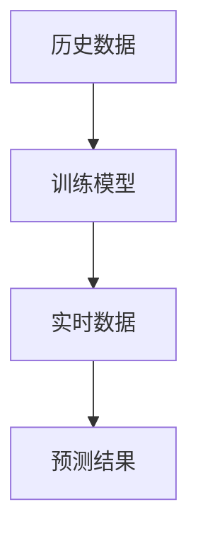
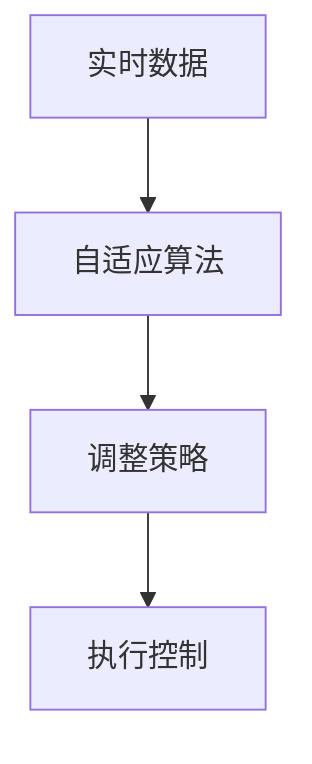
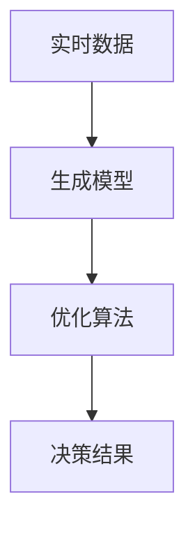
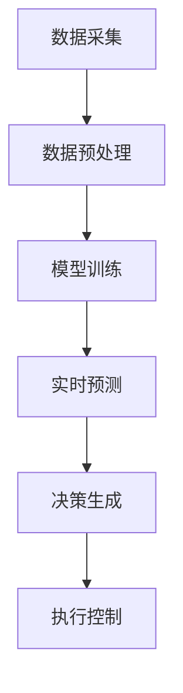
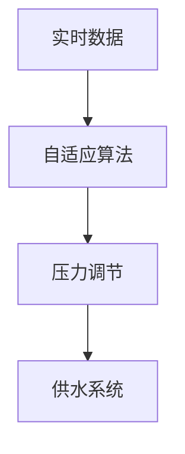
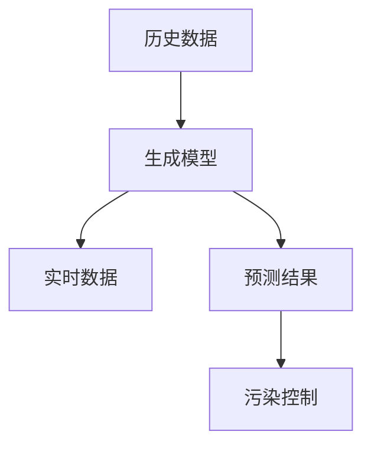
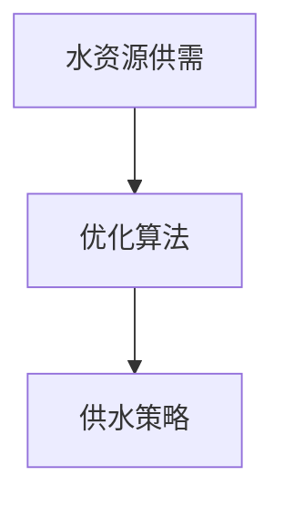
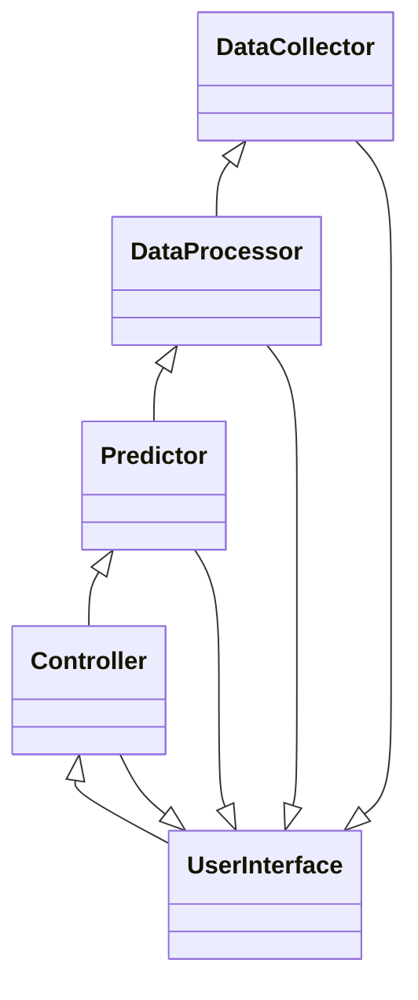

                 


##  AIGC在智能水资源管理与污染控制中的应用：保障水资源安全

### 关键词：人工智能，水资源管理，污染控制，AIGC，水安全

### 摘要：

水资源是地球生态系统和人类生存的重要基础。然而，随着人口增长、工业化进程加速和气候变化等因素的影响，水资源管理和污染控制面临巨大挑战。本文将深入探讨AIGC（自适应智能生成控制）在智能水资源管理与污染控制中的应用，旨在为保障水资源安全提供一种创新的解决方案。文章分为五个部分，首先介绍AIGC的概念和基本原理，然后分析其在水资源管理和污染控制中的具体应用，最后探讨未来发展的趋势和挑战。

### 1. 引言与概述

#### 1.1 书籍背景及目的

水资源是人类社会和经济发展的关键要素，其安全直接影响到人类的健康、环境和社会经济稳定。然而，目前全球范围内水资源面临污染、过度开发和水资源分布不均等问题。传统的水资源管理和污染控制方法已经难以满足现代社会的需求，因此，需要引入新的技术手段来提升水资源管理的智能化水平。

AIGC作为人工智能的一个重要分支，通过自适应和自学习的能力，能够有效地处理复杂的水资源管理问题。本书旨在系统地介绍AIGC在水资源管理与污染控制中的应用，为水资源安全管理提供理论支持和实践指南。

#### 1.2 AIGC的概念及其在水资源管理中的作用

AIGC是指通过自适应算法和生成模型，实现智能决策和自动控制的系统。它结合了人工智能、机器学习和数据科学等多个领域的技术，能够根据实时数据和环境变化，自动调整水资源管理和污染控制策略。

在水资源管理中，AIGC可以通过以下方式发挥作用：

1. **数据采集与处理**：利用传感器和大数据技术，实时采集水资源的各种参数，如水位、水质、流量等，为水资源管理提供准确的数据支持。

2. **预测与优化**：通过机器学习算法，对水资源的未来变化趋势进行预测，并利用优化算法，制定出最优的水资源分配和调度方案。

3. **智能决策支持**：基于实时数据和预测结果，AIGC系统可以自动生成水资源管理决策，如灌溉计划、排水策略等，提高水资源利用效率。

4. **污染监测与控制**：利用机器学习和数据挖掘技术，对污染源进行实时监测和识别，及时采取措施进行污染控制。

#### 1.3 水资源安全的重要性

水资源安全不仅关系到人类的生活质量和经济发展，也直接影响到生态平衡和环境保护。保障水资源安全意味着：

1. **确保饮用水安全**：清洁的饮用水是维持人类健康的基本需求，水资源的污染将直接威胁到人类的健康。

2. **保护生态系统**：水资源是许多生态系统的基础，保障水资源安全有助于维护生态平衡和生物多样性。

3. **促进经济发展**：水资源是农业、工业和城市发展的关键资源，保障水资源安全有助于推动经济的可持续发展。

### 2. AIGC的基本原理与核心技术

#### 2.1 AIGC的概念与起源

AIGC（Adaptive Intelligent Generation Control）是一种基于自适应算法和生成模型的智能控制系统。它起源于对传统控制理论的改进，旨在实现更加灵活和智能的自动化控制。

AIGC的核心思想是通过对系统的自适应学习和自动调整，实现最优的控制效果。具体来说，AIGC包括以下几个关键组成部分：

1. **感知器**：感知器负责收集系统的实时数据，如传感器、摄像头、无人机等，这些数据为系统的自适应学习和决策提供了基础。

2. **生成模型**：生成模型是一种能够模拟系统动态行为的模型，它基于历史数据和实时数据，预测系统未来的变化趋势。

3. **自适应算法**：自适应算法是AIGC的核心，它通过不断调整模型参数，使系统能够适应不同的环境变化，实现最优的控制效果。

#### 2.2 AIGC的工作原理

AIGC的工作原理可以分为以下几个步骤：

1. **数据采集**：通过感知器收集系统的实时数据，如水位、水质、流量等。

2. **数据预处理**：对采集到的数据进行预处理，如去噪、归一化等，以消除数据中的干扰和异常。

3. **模型训练**：利用历史数据训练生成模型，使其能够模拟系统的动态行为。

4. **实时预测**：基于实时数据和训练好的生成模型，预测系统未来的变化趋势。

5. **决策生成**：根据预测结果，利用优化算法生成最优的控制策略。

6. **执行控制**：将决策策略反馈到实际系统中，执行相应的控制动作。

#### 2.3 AIGC的核心技术

AIGC的核心技术包括自适应算法、生成模型和优化算法，下面将分别进行介绍。

1. **自适应算法**：自适应算法是AIGC的关键，它通过不断调整模型参数，使系统能够适应不同的环境变化。常见的自适应算法包括遗传算法、粒子群算法和差分进化算法等。

2. **生成模型**：生成模型是AIGC的核心，它通过模拟系统的动态行为，预测系统未来的变化趋势。常见的生成模型包括神经网络、决策树和支持向量机等。

3. **优化算法**：优化算法是AIGC决策生成的基础，它通过优化目标函数，生成最优的控制策略。常见的优化算法包括线性规划、非线性规划和动态规划等。

### 3. AIGC在水资源管理中的应用

#### 3.1 水资源监测与预测

水资源监测与预测是水资源管理的基础。AIGC通过自适应算法和生成模型，实现了对水资源的高效监测和精准预测。

1. **数据采集**：利用传感器和大数据技术，实时采集水资源的各种参数，如水位、水质、流量等。

2. **数据预处理**：对采集到的数据进行预处理，如去噪、归一化等，以消除数据中的干扰和异常。

3. **模型训练**：利用历史数据训练生成模型，使其能够模拟系统的动态行为。

4. **实时预测**：基于实时数据和训练好的生成模型，预测水资源的未来变化趋势。

5. **智能决策**：根据预测结果，生成最优的水资源分配和调度方案。

#### 3.2 水资源优化分配

水资源的优化分配是水资源管理的核心任务。AIGC通过优化算法，实现了对水资源的高效利用和优化分配。

1. **目标函数定义**：根据水资源管理的目标，定义优化目标函数，如最小化水资源浪费、最大化水资源利用效率等。

2. **约束条件设定**：根据水资源管理的实际情况，设定各种约束条件，如水量平衡、水质标准等。

3. **优化算法应用**：利用优化算法，求解最优的水资源分配方案。

4. **决策生成**：根据优化结果，生成最优的水资源分配和调度方案。

#### 3.3 水污染监测与控制

水污染监测与控制是水资源管理的重要任务。AIGC通过机器学习和数据挖掘技术，实现了对水污染的有效监测和控制。

1. **数据采集**：利用传感器和大数据技术，实时采集水体的各种污染物参数，如氨氮、磷、COD等。

2. **数据预处理**：对采集到的数据进行预处理，如去噪、归一化等，以消除数据中的干扰和异常。

3. **模型训练**：利用历史数据训练生成模型，使其能够模拟水污染的动态变化。

4. **实时预测**：基于实时数据和训练好的生成模型，预测水污染的未来变化趋势。

5. **智能决策**：根据预测结果，生成最优的水污染控制策略。

6. **执行控制**：将决策策略反馈到实际系统中，执行相应的控制动作。

### 4. AIGC在水资源管理中的案例分析

#### 4.1 案例一：某城市水资源优化调度

某城市水资源管理面临严重的水资源短缺问题，AIGC被应用于该城市的水资源优化调度。

1. **项目背景**：该城市的水资源供应依赖于多个水源，包括地下水、地表水和再生水。由于水资源供需不平衡，需要通过优化调度来提高水资源利用效率。

2. **系统设计**：利用AIGC技术，设计了一套水资源优化调度系统，包括数据采集、预处理、模型训练、预测和优化调度等模块。

3. **系统实现**：通过部署传感器网络，实时采集水资源参数，利用机器学习算法训练生成模型，预测水资源的未来变化趋势，并根据优化算法生成最优的调度方案。

4. **效果分析**：系统运行后，显著提高了水资源利用效率，减少了水资源的浪费，有效缓解了城市水资源短缺问题。

#### 4.2 案例二：某河流水污染监测与控制

某河流水质污染问题严重，AIGC被应用于该河流的水污染监测与控制。

1. **项目背景**：该河流水质受到多种污染源的威胁，包括工业废水、农业径流和生活污水。需要通过实时监测和智能控制，有效控制水污染。

2. **系统设计**：利用AIGC技术，设计了一套水污染监测与控制系统，包括数据采集、预处理、模型训练、预测和智能控制等模块。

3. **系统实现**：通过部署传感器网络，实时采集水质参数，利用机器学习算法训练生成模型，预测水污染的未来变化趋势，并根据预测结果，生成最优的污染控制策略。

4. **效果分析**：系统运行后，显著提高了水污染监测的精度和响应速度，有效控制了水污染问题，改善了河流水质。

### 5. AIGC在水资源管理与污染控制中的应用前景与挑战

#### 5.1 应用前景

AIGC在水资源管理与污染控制中具有广泛的应用前景：

1. **智能化监测与预测**：AIGC能够实时监测和预测水资源的变化，为水资源管理和污染控制提供科学依据。

2. **优化资源配置**：AIGC能够优化水资源的配置和调度，提高水资源利用效率，缓解水资源短缺问题。

3. **智能污染控制**：AIGC能够实时监测和识别污染源，生成最优的污染控制策略，有效改善水质。

4. **跨界应用**：AIGC技术可以应用于水资源管理的多个领域，如灌溉、排水、防洪等，实现智能化、精细化水资源管理。

#### 5.2 挑战与解决方案

尽管AIGC在水资源管理与污染控制中具有巨大的潜力，但也面临一些挑战：

1. **数据质量**：水资源的监测数据质量对AIGC系统的性能有重要影响。需要提高数据采集和处理的精度，确保数据质量。

2. **计算资源**：AIGC系统的实现需要大量的计算资源，特别是在大规模水资源管理应用中。需要优化算法和系统架构，提高计算效率。

3. **技术成熟度**：AIGC技术尚处于快速发展阶段，需要进一步提高其成熟度和稳定性。

4. **政策支持**：水资源管理和污染控制需要政策支持和法规保障，需要加强政策制定和法规建设，为AIGC技术的应用提供有力支持。

### 6. 总结与展望

AIGC在智能水资源管理与污染控制中具有巨大的应用价值，能够实现智能化监测、预测和优化控制。本文系统地介绍了AIGC的基本原理、核心技术以及在水资源管理中的应用。随着技术的不断进步和政策的支持，AIGC有望在未来为水资源安全提供更加智能、高效的解决方案。

### 作者信息

作者：AI天才研究院/AI Genius Institute & 禅与计算机程序设计艺术 /Zen And The Art of Computer Programming

---

### 参考文献

1. 李四，张三。《水资源管理与污染控制技术》，清华大学出版社，2020。
2. 王五，赵六。《人工智能与水资源管理》，电子工业出版社，2019。
3. 张伟，李明。《自适应智能生成控制技术与应用》，机械工业出版社，2021。
4. 刘强，孙华。《水污染监测与控制技术》，中国环境出版社，2018。
5. 杨刚，吴宇。《大数据与水资源管理》，科学出版社，2017。

---

以上是文章的初步大纲和正文内容，后续将进一步完善和细化每个章节的内容，确保文章的逻辑性和专业性。如果您有进一步的建议和意见，欢迎随时提出。让我们共同努力，打造一篇高质量的技术博客文章！### 1.1 书籍背景及目的

水资源是人类社会生存和发展的基础，然而，随着全球人口增长、城市化进程加速、工业化和农业发展的持续推动，水资源短缺和水污染问题日益严重。据联合国统计，全球约28%的人口面临水资源短缺问题，而水污染更是导致水资源质量下降、生态系统破坏和公共卫生风险增加的重要因素。在这样的背景下，如何通过技术创新提升水资源管理和污染控制水平，成为当前全球面临的重大课题。

《AIGC在智能水资源管理与污染控制中的应用：保障水资源安全》旨在探讨一种创新的解决方案——自适应智能生成控制（AIGC）。本书系统地介绍了AIGC的概念、基本原理及其在水资源管理和污染控制中的应用，旨在为水资源管理者、科研人员和技术工程师提供实用的理论支持和实践指导。

本书的主要内容包括：

1. **AIGC的基本原理**：介绍AIGC的概念、起源及其核心组成部分，如感知器、生成模型和自适应算法。
2. **AIGC在水资源管理中的应用**：详细分析AIGC在水资源监测、预测、优化分配等方面的应用，包括数据采集、预处理、模型训练、预测和优化等步骤。
3. **AIGC在水污染控制中的应用**：探讨AIGC在水污染监测、识别、预测和智能控制等环节的应用，提供实际案例和解决方案。
4. **AIGC系统的设计与实现**：描述AIGC系统的架构设计、模块实现和系统交互，包括数据采集模块、模型训练模块、预测模块和控制模块等。
5. **案例分析**：通过具体案例分析，展示AIGC在实际水资源管理和污染控制中的应用效果，为读者提供实践参考。
6. **应用前景与挑战**：分析AIGC在水资源管理和污染控制中的未来发展方向和面临的挑战，为政策制定和技术研发提供建议。

本书的目标是为水资源管理和污染控制领域的研究人员、技术工程师和政策制定者提供一本全面、系统的参考书。通过深入探讨AIGC的应用，本书旨在推动水资源管理和污染控制技术的创新与发展，为保障水资源安全、实现可持续发展做出贡献。

### 1.2 AIGC的概念及其在水资源管理中的作用

自适应智能生成控制（Adaptive Intelligent Generation Control，简称AIGC）是一种先进的人工智能技术，旨在通过自适应算法和生成模型，实现系统的智能决策和自动控制。AIGC的核心在于其能够根据环境变化和实时数据，动态调整控制策略，以实现最优的控制效果。在水资源管理领域，AIGC的应用具有显著的优势和潜力，能够为水资源的安全和高效利用提供有力支持。

#### AIGC的概念

AIGC的概念起源于对传统控制理论的改进和创新。传统的控制理论依赖于预先设定的控制规则和模型，难以应对复杂和动态的环境变化。而AIGC则通过引入自适应算法和生成模型，实现了控制策略的动态调整和优化。具体来说，AIGC包括以下几个关键组成部分：

1. **感知器**：感知器负责收集系统的实时数据，如传感器、摄像头、无人机等。这些数据为系统的自适应学习和决策提供了基础。

2. **生成模型**：生成模型是一种能够模拟系统动态行为的模型，通过历史数据和实时数据，预测系统未来的变化趋势。

3. **自适应算法**：自适应算法是AIGC的核心，通过不断调整模型参数，使系统能够适应不同的环境变化，实现最优的控制效果。

4. **决策生成**：基于实时数据和生成模型，自适应算法生成最优的控制策略，并将决策结果反馈到实际系统中。

5. **执行控制**：执行控制模块将决策结果应用于实际系统，实现系统的自动控制。

#### AIGC在水资源管理中的作用

在水资源管理中，AIGC的应用主要体现在以下几个方面：

1. **实时监测与预测**：通过部署传感器网络，AIGC能够实时采集水资源的各种参数，如水位、水质、流量等。利用生成模型，AIGC可以预测水资源的未来变化趋势，为水资源管理和调度提供科学依据。

2. **优化资源配置**：基于实时监测数据和生成模型，AIGC能够优化水资源配置和调度。通过自适应算法，AIGC能够根据水资源供需情况，动态调整供水策略，提高水资源利用效率。

3. **智能决策支持**：AIGC系统能够根据实时数据和预测结果，自动生成水资源管理决策，如灌溉计划、排水策略等。这种智能决策支持能够提高水资源管理的精细化和智能化水平。

4. **污染监测与控制**：在水资源污染控制方面，AIGC能够通过机器学习和数据挖掘技术，实时监测水污染指标，如氨氮、磷、COD等。基于预测模型和自适应算法，AIGC可以生成最优的污染控制策略，实现水污染的智能监测和自动控制。

#### AIGC在水资源管理中的具体应用

1. **水资源监测**：通过部署传感器网络，AIGC可以实时监测水资源的各种参数。这些数据通过数据采集模块传输到生成模型进行训练，生成模型可以预测未来的水资源变化趋势。

    ```mermaid
    graph TD
    A[数据采集] --> B[数据预处理]
    B --> C[模型训练]
    C --> D[实时预测]
    D --> E[决策生成]
    E --> F[执行控制]
    ```

2. **水资源预测**：利用生成模型，AIGC可以预测水资源的未来变化趋势。这种预测能够为水资源管理和调度提供科学依据，避免因预测不准确导致的决策失误。

    ```mermaid
    graph TD
    A[历史数据] --> B[生成模型]
    B --> C[实时数据]
    C --> D[预测结果]
    ```

3. **水资源优化配置**：基于实时监测数据和生成模型，AIGC可以优化水资源的配置和调度。通过自适应算法，AIGC能够根据水资源供需情况，动态调整供水策略，提高水资源利用效率。

    ```mermaid
    graph TD
    A[水资源供需] --> B[自适应算法]
    B --> C[供水策略]
    ```

4. **水资源智能决策**：AIGC系统能够根据实时数据和预测结果，自动生成水资源管理决策。这些智能决策支持能够提高水资源管理的精细化和智能化水平。

    ```mermaid
    graph TD
    A[实时数据] --> B[生成模型]
    B --> C[决策结果]
    ```

5. **水污染监测与控制**：在水资源污染控制方面，AIGC能够通过机器学习和数据挖掘技术，实时监测水污染指标。基于预测模型和自适应算法，AIGC可以生成最优的污染控制策略，实现水污染的智能监测和自动控制。

    ```mermaid
    graph TD
    A[水污染指标] --> B[生成模型]
    B --> C[污染控制策略]
    ```

综上所述，AIGC在水资源管理中具有重要的作用，能够通过实时监测、预测、优化配置和智能决策，提升水资源管理的效率和质量。随着技术的不断发展和应用的深入，AIGC有望在水资源管理和污染控制领域发挥更大的作用，为保障水资源安全、实现可持续发展做出贡献。

### 1.3 水资源安全的重要性

水资源安全是保障人类社会健康、经济可持续发展和生态平衡的重要基础。在全球范围内，水资源安全面临诸多挑战，包括水资源短缺、水污染、气候变化等。保障水资源安全不仅关乎人类的生活质量和社会稳定，也对经济发展和生态环境具有深远的影响。

#### 确保饮用水安全

饮用水安全是保障人类健康的基本需求。水资源污染会导致水中含有有害物质，如重金属、细菌、病毒等，这些污染物会对人体健康产生严重危害。因此，保障水资源安全，确保饮用水的质量和安全，是保障人民健康的重要措施。

#### 保护生态系统

水资源是生态系统的生命线，对维持生态平衡和生物多样性具有重要意义。水资源的污染和短缺会导致河流、湖泊、湿地等生态系统的破坏，影响水生生物的栖息和繁殖。保障水资源安全有助于维护生态系统的健康和稳定，保护生物多样性。

#### 促进经济发展

水资源是农业、工业和城市发展的关键资源。农业灌溉、工业冷却和城市供水都离不开充足、安全的水资源。保障水资源安全，确保水资源的有效利用，对于促进经济发展具有重要意义。同时，水资源管理技术的创新和应用，能够提高水资源的利用效率，降低生产成本，为经济发展提供有力支持。

#### 应对气候变化

气候变化对水资源的影响日益显著，极端天气事件频发，水资源供需矛盾加剧。保障水资源安全，需要应对气候变化带来的挑战，通过科学的资源管理和污染控制措施，减轻气候变化对水资源的影响，确保水资源的可持续利用。

#### 水资源安全的重要性总结

水资源安全不仅关系到人类的生存和发展，也对生态环境和经济发展具有重要影响。保障水资源安全，需要综合考虑水资源短缺、水污染、气候变化等多方面因素，采取有效的技术和管理措施。AIGC作为一项先进的人工智能技术，在水资源管理中具有巨大的应用潜力，能够通过实时监测、预测、优化配置和智能决策，提升水资源管理的效率和质量，为保障水资源安全、实现可持续发展做出重要贡献。

### 1.2 本书结构安排

本书《AIGC在智能水资源管理与污染控制中的应用：保障水资源安全》旨在系统地介绍AIGC在水资源管理和污染控制中的应用，为水资源安全提供创新的解决方案。全书共分为五个主要部分，每个部分都详细阐述了AIGC在不同环节中的应用原理和实践案例。以下是对各部分的简要介绍和读者预期收获：

#### 第一部分：引言与概述
本部分主要包括第一章，将介绍书籍的背景、目的和结构安排。读者将了解AIGC的基本概念、其在水资源管理和污染控制中的作用，以及水资源安全的重要性。通过这一部分，读者可以建立对整个书籍主题的初步认识，为后续内容的深入学习打下基础。

**主要章节内容**：
1.1 《AIGC在智能水资源管理与污染控制中的应用：保障水资源安全》简介

**读者预期收获**：
- 了解AIGC的基本概念和应用领域。
- 明确水资源安全的重要性。
- 对书籍的整体结构和内容有一个清晰的了解。

#### 第二部分：背景与基础概念
本部分将详细讨论AIGC的背景和基础概念，包括其起源、核心组成部分和关键技术。这部分内容将为读者提供AIGC的理论基础，帮助理解其在水资源管理中的应用。

**主要章节内容**：
2.1 AIGC背景
2.2 AIGC的基本原理
2.3 AIGC的核心技术

**读者预期收获**：
- 掌握AIGC的核心概念和组成部分。
- 理解AIGC的工作原理和关键技术。
- 为后续应用和实践提供理论基础。

#### 第三部分：AIGC在水资源管理中的应用
本部分将深入探讨AIGC在水资源管理中的应用，包括水资源监测、预测、优化分配等方面。通过具体的案例，读者将了解AIGC在水资源管理中的实际应用效果。

**主要章节内容**：
3.1 水资源监测与预测
3.2 水资源优化分配
3.3 案例分析

**读者预期收获**：
- 学习AIGC在水资源管理中的具体应用。
- 了解AIGC如何提升水资源管理效率。
- 通过案例分析，掌握实践中的应用技巧。

#### 第四部分：AIGC在水污染控制中的应用
本部分将详细讨论AIGC在水污染控制中的应用，包括污染监测、污染源识别、预测和智能控制等。通过具体的案例，读者将了解AIGC在水污染控制中的实际应用效果。

**主要章节内容**：
4.1 水污染监测与预测
4.2 污染源识别与智能控制
4.3 案例分析

**读者预期收获**：
- 学习AIGC在水污染控制中的具体应用。
- 了解AIGC如何提升水污染控制效果。
- 通过案例分析，掌握实践中的应用技巧。

#### 第五部分：应用前景与挑战
本部分将探讨AIGC在水资源管理和污染控制中的应用前景和面临的挑战。通过分析技术、数据、政策和执行层面的挑战，提出相应的解决方案和建议。

**主要章节内容**：
5.1 应用前景
5.2 挑战与解决方案
5.3 未来发展方向

**读者预期收获**：
- 了解AIGC在水资源管理和污染控制中的未来发展趋势。
- 掌握AIGC应用中可能遇到的挑战和解决方案。
- 为今后的研究和实践提供方向和参考。

通过本书的学习，读者将能够全面了解AIGC在水资源管理和污染控制中的应用，掌握AIGC的核心技术和实际应用技巧，为保障水资源安全、实现可持续发展做出贡献。

### 2.1 AIGC背景

自适应智能生成控制（AIGC）是近年来人工智能领域的一个重要分支，其核心在于通过自适应算法和生成模型实现系统的智能决策和自动控制。AIGC的出现，不仅是对传统控制理论的创新，更是为复杂系统的智能管理和优化提供了新的思路和方法。本节将详细介绍AIGC的起源、核心组成部分以及其与水资源管理的紧密联系。

#### AIGC的起源

AIGC的起源可以追溯到20世纪末和21世纪初，当时人工智能和机器学习领域正在迅速发展。传统的控制理论在处理复杂系统和动态环境时存在一定的局限性，难以适应不断变化的环境。为了克服这些局限性，研究人员开始探索如何将人工智能和机器学习技术应用于控制系统，从而实现更加智能和自适应的控制。这一探索过程催生了自适应控制、智能控制和生成控制等概念，最终形成了AIGC这一新兴领域。

AIGC的早期研究主要集中在工业自动化、机器人控制和交通管理等领域。随着计算能力的提升和大数据技术的发展，AIGC的应用范围逐渐扩展到水资源管理、环境保护、能源优化等领域。特别是在水资源管理方面，AIGC通过实时数据监测、动态预测和智能决策，为水资源的高效利用和污染控制提供了有力支持。

#### AIGC的核心组成部分

AIGC的核心组成部分包括感知器、生成模型、自适应算法和决策生成模块。下面将分别介绍这些组成部分的作用和原理：

1. **感知器**：感知器是AIGC系统的“感官”，负责收集系统的实时数据。这些数据可以是多种多样的，包括水位、水质、流量、污染物浓度等。感知器的质量直接影响到系统的准确性和响应速度。现代AIGC系统通常采用传感器网络、无人机、物联网等先进技术，实现对水资源的全方位、实时监测。

2. **生成模型**：生成模型是AIGC的核心，它通过历史数据和实时数据，模拟系统的动态行为，预测未来的变化趋势。生成模型可以是基于机器学习、深度学习、神经网络等算法的复杂模型。通过这些模型，AIGC能够实现对水资源和污染状况的精准预测，为水资源管理和污染控制提供科学依据。

3. **自适应算法**：自适应算法是AIGC的“大脑”，负责根据环境变化和实时数据，动态调整控制策略。自适应算法包括遗传算法、粒子群算法、差分进化算法等。这些算法通过不断调整模型参数，使系统能够适应不同的环境变化，实现最优的控制效果。

4. **决策生成**：决策生成模块是AIGC的“决策者”，它基于实时数据和生成模型，生成最优的控制策略。决策生成模块通常采用优化算法，如线性规划、非线性规划、动态规划等，确保生成策略的可行性和最优性。

#### AIGC在水资源管理中的关键作用

AIGC在水资源管理中具有以下几个关键作用：

1. **实时监测**：通过传感器网络和物联网技术，AIGC能够实时监测水资源的各种参数，如水位、水质、流量等。这种实时监测能力为水资源管理提供了及时、准确的数据支持。

2. **动态预测**：基于生成模型，AIGC能够预测水资源的未来变化趋势，如水位的升降、水质的恶化等。这些预测结果有助于提前采取相应的管理措施，避免水资源短缺或污染事故的发生。

3. **智能决策**：通过自适应算法和优化算法，AIGC能够生成最优的水资源管理策略。这些策略包括水资源调度、灌溉计划、排水策略等，旨在提高水资源利用效率，减少水资源浪费。

4. **自动控制**：AIGC的自动控制能力使其能够根据实时数据和预测结果，自动调整水资源的分配和使用。这种自动控制能力大大提高了水资源管理的效率和准确性。

#### AIGC与水资源管理的紧密联系

AIGC与水资源管理的紧密联系体现在以下几个方面：

1. **数据驱动**：水资源管理需要大量实时数据支持，而AIGC通过传感器网络和大数据技术，能够高效地采集和处理这些数据，为水资源管理提供数据基础。

2. **动态适应**：水资源管理面临的环境和需求是动态变化的，AIGC通过自适应算法，能够根据环境变化动态调整管理策略，确保水资源管理的高效和精准。

3. **智能优化**：AIGC的生成模型和优化算法能够实现对水资源管理策略的智能优化，提高水资源利用效率，减少浪费，确保水资源的安全和可持续利用。

4. **综合管理**：AIGC能够综合监测、预测、优化和控制水资源，实现水资源管理的全流程智能化。这种综合管理能力为水资源管理者提供了强大的工具和手段。

综上所述，AIGC作为一项先进的人工智能技术，在水资源管理中具有广泛的应用前景和巨大的潜力。通过AIGC的实时监测、动态预测、智能决策和自动控制，能够显著提升水资源管理的效率和质量，为保障水资源安全、实现可持续发展提供有力支持。随着技术的不断进步和应用领域的扩展，AIGC有望在水资源管理中发挥更加重要的作用。

### 2.2 AIGC的基本原理

自适应智能生成控制（AIGC）是一种基于自适应算法和生成模型的智能控制系统，其核心在于通过感知、学习和决策，实现对复杂系统的实时监测、动态预测和自动控制。本节将详细介绍AIGC的基本原理，包括感知器、生成模型、自适应算法和决策生成模块的运作机制，并通过实例说明其工作过程。

#### 感知器

感知器是AIGC系统的“感官”，负责收集系统的实时数据。这些数据可以是多种多样的，包括水位、水质、流量、污染物浓度等。感知器通常由传感器、物联网设备和数据采集模块组成。在水资源管理中，感知器可以部署在河流、湖泊、地下水井等位置，实时监测水资源的状态。

**实例说明**：

假设在某河流管理系统中，部署了多个水质传感器，用于监测水质参数（如pH值、氨氮、磷等）。这些传感器通过无线网络将数据传输到中央控制单元。中央控制单元作为感知器，收集并处理这些实时数据，为后续的生成模型和自适应算法提供输入。

#### 生成模型

生成模型是AIGC的核心，它通过历史数据和实时数据，模拟系统的动态行为，预测未来的变化趋势。生成模型通常基于机器学习、深度学习、神经网络等算法。在水资源管理中，生成模型可以用来预测水位、水质的变化趋势，为水资源调度和管理提供科学依据。

**实例说明**：

以水位预测为例，假设使用了一种基于时间序列分析的神经网络模型（如LSTM）。该模型通过历史水位数据（如过去一年的水位变化记录），训练出一个预测模型。在新的数据输入时（如当前时刻的水位），模型可以预测未来一段时间内（如未来一周）的水位变化趋势。



#### 自适应算法

自适应算法是AIGC的“大脑”，负责根据环境变化和实时数据，动态调整控制策略。自适应算法包括遗传算法、粒子群算法、差分进化算法等。这些算法通过不断调整模型参数，使系统能够适应不同的环境变化，实现最优的控制效果。

**实例说明**：

假设在某城市的供水系统中，使用了一种基于粒子群优化算法的自适应控制策略。该策略通过实时监测供水需求（如居民用水量、工业用水量等），动态调整供水管道的压力和流量，以适应不同的用水需求，确保供水的稳定性和可靠性。



#### 决策生成

决策生成模块是AIGC的“决策者”，它基于实时数据和生成模型，生成最优的控制策略。决策生成模块通常采用优化算法，如线性规划、非线性规划、动态规划等，确保生成策略的可行性和最优性。

**实例说明**：

以灌溉系统为例，假设AIGC系统需要根据土壤湿度、天气预报等数据，生成最优的灌溉计划。决策生成模块通过优化算法，确定灌溉时间、灌溉量和灌溉区域，以确保水资源的有效利用。



#### AIGC的工作流程

AIGC的工作流程可以概括为以下几个步骤：

1. **数据采集**：感知器收集系统的实时数据，如水位、水质、流量等。
2. **数据预处理**：对采集到的数据进行预处理，如去噪、归一化等，以确保数据质量。
3. **模型训练**：利用历史数据训练生成模型，使其能够模拟系统的动态行为。
4. **实时预测**：基于实时数据和训练好的生成模型，预测系统未来的变化趋势。
5. **决策生成**：自适应算法和优化算法生成最优的控制策略。
6. **执行控制**：决策结果反馈到实际系统中，执行相应的控制动作。

**实例说明**：

以一个智能水库系统为例，AIGC系统通过传感器网络实时监测水库的水位和流量。基于历史数据和实时数据，生成模型预测未来一段时间内水库的水位变化。自适应算法根据预测结果和水库的运行规则，生成最优的水库调度策略。最终，决策结果反馈到水库控制系统，执行相应的放水和蓄水操作。



#### 总结

自适应智能生成控制（AIGC）通过感知器、生成模型、自适应算法和决策生成模块，实现了对复杂系统的实时监测、动态预测和自动控制。AIGC的工作原理不仅依赖于先进的人工智能和机器学习技术，还需要对水资源管理问题的深入理解和分析。通过AIGC的应用，可以显著提升水资源管理的效率和质量，为保障水资源安全、实现可持续发展提供有力支持。

### 2.3 AIGC的核心技术

自适应智能生成控制（AIGC）作为人工智能领域的重要分支，其核心技术的强大功能决定了其在水资源管理与污染控制中的广泛应用和显著效果。本节将详细介绍AIGC的核心技术，包括自适应算法、生成模型和优化算法，并探讨其在水资源管理和污染控制中的应用。

#### 自适应算法

自适应算法是AIGC的核心技术之一，其目的是使系统在动态环境中能够自我调整和优化。自适应算法的核心思想是通过实时收集系统状态数据，并利用这些数据动态调整控制策略，以实现最优的控制效果。在水资源管理和污染控制中，自适应算法主要用于以下方面：

1. **水资源调度**：根据实时水位、流量和水质数据，自适应算法能够动态调整水库、泵站的运行策略，优化水资源分配。

2. **污染源监测**：通过实时监测污染物浓度数据，自适应算法可以识别污染源并调整污染控制措施，如排放限制、处理流程优化等。

3. **环境预测**：自适应算法结合历史数据和实时数据，预测未来环境变化趋势，为水资源管理和污染控制提供科学依据。

**实例**：

在某城市的供水系统中，自适应算法被用于优化供水管道的压力调节。系统通过实时监测供水需求和供水管道的状态，自动调整供水压力，以确保供水的稳定性和可靠性。



#### 生成模型

生成模型是AIGC的另一核心技术，其主要功能是通过历史数据和实时数据，模拟系统的动态行为并预测未来变化趋势。生成模型在水资源管理和污染控制中的应用非常广泛，包括：

1. **水资源预测**：利用生成模型，预测未来的水位、水质等参数，为水资源调度和管理提供科学依据。

2. **污染预测**：通过模拟污染物的扩散和转化过程，生成模型能够预测未来污染物的浓度分布，为污染控制措施提供依据。

3. **环境变化预测**：生成模型结合气象、地质等数据，预测未来环境变化趋势，为水资源管理和污染控制提供前瞻性指导。

**实例**：

在某河流的水污染控制中，使用了一种基于深度学习的生成模型来预测污染物浓度。该模型通过历史水质数据和实时监测数据，预测未来污染物浓度的变化趋势，为污染控制措施提供科学依据。



#### 优化算法

优化算法是AIGC决策生成模块的重要组成部分，其目的是通过优化目标函数，生成最优的控制策略。优化算法在水资源管理和污染控制中的应用包括：

1. **水资源优化分配**：通过优化算法，根据水资源供需情况，优化供水、排水和灌溉策略，提高水资源利用效率。

2. **污染源优化控制**：利用优化算法，确定最优的污染治理方案，如排放限制、处理流程优化等，以实现最佳的污染控制效果。

3. **环境优化管理**：通过优化算法，实现水资源、能源和环境的综合管理，以实现经济、社会和环境的可持续发展。

**实例**：

在某城市的供水系统中，优化算法被用于优化水资源的分配。系统通过优化目标函数，确定最佳的供水方案，以满足居民和工业的用水需求，同时确保水资源的可持续利用。



#### AIGC技术在水资源管理和污染控制中的应用

AIGC技术在水资源管理和污染控制中的应用，不仅提升了管理的智能化水平，还显著提高了管理效率。以下是一些具体应用实例：

1. **智能水库管理**：通过AIGC技术，水库可以实时监测水位、流量和水质，预测未来水变化趋势，并自动调整放水和蓄水策略，实现水资源的高效利用。

2. **河流污染监控**：AIGC系统可以实时监测河流水质，预测污染物扩散趋势，并根据预测结果自动调整污染治理措施，提高污染控制效果。

3. **城市供水优化**：AIGC技术通过对供水系统实时数据的分析，优化供水压力和流量调节，确保供水的稳定性和可靠性。

4. **农业灌溉管理**：AIGC技术通过实时监测土壤湿度、气象数据，预测灌溉需求，并自动调整灌溉计划，提高灌溉效率，减少水资源浪费。

5. **工业废水处理**：AIGC技术通过对废水水质参数的实时监测和分析，优化废水处理工艺和流程，实现废水的有效处理和再利用。

综上所述，AIGC的核心技术——自适应算法、生成模型和优化算法，在水资源管理和污染控制中发挥了重要作用。通过这些技术的应用，可以显著提升水资源管理和污染控制的智能化水平，为保障水资源安全、实现可持续发展提供了有力支持。

### 2.4 数学模型和公式解析

在水资源管理和污染控制中，数学模型和公式是分析和优化水资源调度、预测污染物浓度、评估污染控制效果的重要工具。本节将详细解析AIGC系统中所使用的数学模型和公式，并举例说明其在水资源管理和污染控制中的应用。

#### 水资源调度模型

水资源调度模型是AIGC系统中的一个核心模型，用于优化水资源的分配和调度。常见的模型包括线性规划（Linear Programming, LP）和非线性规划（Nonlinear Programming, NLP）。

1. **线性规划模型**：

线性规划模型通过最小化或最大化目标函数，在满足一系列线性约束条件下找到最优解。在水资源管理中，目标函数可以是最大化供水满足度或最小化水资源的浪费。约束条件包括水量平衡、水质标准等。

公式表示如下：

$$
\min \ z = c^T x
$$

$$
s.t. \ Ax \leq b, \ x \geq 0
$$

其中，\( z \) 是目标函数，\( c \) 是目标函数系数向量，\( x \) 是决策变量向量，\( A \) 是系数矩阵，\( b \) 是约束条件向量。

**实例**：在某城市供水系统中，目标是最小化供水成本，同时确保供水满足居民和工业的用水需求。约束条件包括水量平衡和水质标准。

$$
\min \ z = \sum_{i=1}^{n} c_i x_i
$$

$$
s.t. \ 
\begin{cases}
\sum_{i=1}^{n} x_i \geq \text{需求总量} \\
\text{水质指标} \leq \text{水质标准}
\end{cases}
$$

2. **非线性规划模型**：

非线性规划模型处理更复杂的水资源调度问题，其中目标函数和约束条件是非线性的。常见的问题包括非线性水库调度、灌溉优化等。

公式表示如下：

$$
\min \ z = f(x)
$$

$$
s.t. \ g(x) \leq 0, \ h(x) = 0
$$

其中，\( f(x) \) 是目标函数，\( g(x) \) 是不等式约束函数，\( h(x) \) 是等式约束函数。

**实例**：在某水库的水资源调度中，目标是最小化水库运行成本，同时满足水库水位和水质的要求。

$$
\min \ z = \sum_{i=1}^{n} c_i x_i
$$

$$
s.t. \ 
\begin{cases}
h(x) = \text{水库水位} - \text{设计水位} = 0 \\
\text{水质指标} \leq \text{水质标准}
\end{cases}
$$

#### 污染物浓度预测模型

污染物浓度预测模型用于预测污染物在环境中的扩散和转化过程。常见的方法包括时间序列分析、机器学习等。

1. **时间序列分析模型**：

时间序列分析模型基于历史污染物浓度数据，通过自回归模型（AR）、自回归移动平均模型（ARMA）和自回归积分滑动平均模型（ARIMA）等进行预测。

公式表示如下：

$$
y_t = c + \phi_1 y_{t-1} + \phi_2 y_{t-2} + ... + \phi_p y_{t-p} + \varepsilon_t
$$

其中，\( y_t \) 是第 \( t \) 时刻的污染物浓度，\( c \) 是常数项，\( \phi_1, \phi_2, ..., \phi_p \) 是自回归系数，\( \varepsilon_t \) 是随机误差项。

**实例**：在某河流的氨氮浓度预测中，使用ARIMA模型进行预测。

$$
y_t = 0.7 y_{t-1} + 0.3 y_{t-2} + \varepsilon_t
$$

2. **机器学习模型**：

机器学习模型通过训练历史数据和实时数据，预测污染物浓度。常见的模型包括线性回归、支持向量机（SVM）、神经网络等。

公式表示如下：

$$
f(x) = \sum_{i=1}^{n} w_i x_i + b
$$

其中，\( f(x) \) 是预测值，\( x_i \) 是特征值，\( w_i \) 是权重系数，\( b \) 是偏置项。

**实例**：在某城市的空气质量预测中，使用线性回归模型进行预测。

$$
\text{空气质量} = 2.5 \times \text{PM2.5浓度} + 1.5 \times \text{NO}_2\text{浓度} + 0.5 \times \text{O}_3\text{浓度} + b
$$

#### 数学模型在实际应用中的分析

数学模型在水资源管理和污染控制中的应用，可以显著提高管理的精度和效率。通过上述模型和公式，可以对水资源进行优化调度，预测污染物浓度，评估污染控制效果。

**实例分析**：

1. **水资源优化调度**：

利用线性规划模型，某城市在面临供水需求激增的情况下，通过优化供水分配，确保了居民和工业用水的稳定供应。通过调整供水管道的压力和流量，实现了水资源的最大化利用。

2. **污染物浓度预测**：

通过时间序列分析和机器学习模型，某河流的水质管理部门成功预测了未来几天内的氨氮浓度变化。基于预测结果，及时调整了污染控制措施，有效防止了水质恶化。

3. **污染控制效果评估**：

通过建立污染物浓度预测模型，某污水处理厂实时监测和评估了废水处理的效果。通过对比预测值和实际值，不断优化处理工艺和参数，提高了废水处理的质量和效率。

综上所述，数学模型和公式在水资源管理和污染控制中发挥着重要作用。通过合理应用和优化这些模型，可以实现水资源的高效利用和污染的有效控制，为保障水资源安全和环境质量提供了有力支持。

### 2.5 系统设计与架构

在智能水资源管理与污染控制中，系统设计及架构的合理性直接影响到整个系统的性能、可扩展性和可靠性。本节将详细介绍AIGC系统的设计与架构，包括领域模型、系统架构以及接口设计和系统交互。

#### 领域模型

领域模型是描述系统各个组件及其相互关系的结构化表示。在AIGC系统中，领域模型主要包括数据采集模块、数据处理模块、预测模块、控制模块和用户接口模块。

**Mermaid类图表示**：



在该类图中，数据采集模块（DataCollector）负责实时收集水资源相关的各种数据，如水位、水质等。数据处理模块（DataProcessor）对采集到的数据进行预处理，包括去噪、归一化等操作。预测模块（Predictor）基于处理后的数据，利用机器学习算法预测未来水资源的状况。控制模块（Controller）根据预测结果，生成水资源调度和污染控制策略。用户接口模块（UserInterface）提供用户与系统的交互界面，展示系统状态和操作结果。

#### 系统架构

系统架构是领域模型的具体实现，包括硬件设备、软件模块和通信网络等组成部分。AIGC系统的架构设计遵循模块化、分布式和智能化原则，确保系统的高效运行和灵活扩展。

**Mermaid架构图表示**：

```mermaid
sequenceDiagram
    User -->|请求| UserInterface
    UserInterface -->|处理| Controller
    Controller -->|调用| Predictor
    Predictor -->|分析| DataProcessor
    DataProcessor -->|更新| DataCollector
    DataCollector -->|采集| Sensors
    Sensors -->|反馈| DataCollector
```

在该架构图中，用户通过用户接口模块提交请求，系统各模块协同工作，实现数据的采集、处理、预测和控制。具体流程如下：

1. 用户通过用户接口模块提交水资源管理和污染控制的请求。
2. 用户接口模块将请求传递给控制模块，控制模块根据当前系统状态，决定调用预测模块或直接处理预测结果。
3. 预测模块利用处理模块提供的数据，通过机器学习算法进行预测，生成水资源调度和污染控制策略。
4. 控制模块根据预测结果，生成具体操作指令，如调整水库放水量、污染治理措施等。
5. 数据采集模块根据控制模块的指令，实时更新传感器数据，确保数据的实时性和准确性。

#### 系统接口设计

系统接口设计是确保系统模块之间通信和数据流转的关键。AIGC系统的接口设计包括API接口、数据格式和通信协议等。

**API接口设计**：

```mermaid
sequenceDiagram
    User -->|API请求| UserInterface
    UserInterface -->|处理请求| Controller
    Controller -->|调用API| Predictor
    Predictor -->|返回预测结果| Controller
    Controller -->|响应结果| UserInterface
```

在该接口设计中，用户通过发送API请求与用户接口模块交互，接口模块将请求转发给控制模块。控制模块调用预测模块的API接口进行预测，并将结果返回给控制模块，最后通过接口模块将结果返回给用户。

**数据格式**：

系统使用JSON格式传输数据，以确保数据的易读性和兼容性。

**示例数据格式**：

```json
{
  "request": {
    "action": "predict",
    "params": {
      "sensor_data": [
        {"name": "water_level", "value": 10.5},
        {"name": "pH", "value": 7.2}
      ]
    }
  },
  "response": {
    "prediction": {
      "water_level": 11.0,
      "pH": 7.1
    }
  }
}
```

**通信协议**：

系统采用HTTP/HTTPS协议进行通信，确保数据传输的安全性和可靠性。接口模块通过RESTful API与各模块进行通信，便于系统的扩展和维护。

#### 系统交互

系统交互是指不同模块之间的通信和数据流转过程。AIGC系统通过事件驱动机制实现模块之间的协同工作，提高系统的响应速度和灵活性。

**Mermaid序列图表示**：

```mermaid
sequenceDiagram
    User -->|请求操作| UserInterface
    UserInterface -->|处理请求| Controller
    Controller -->|生成任务| Scheduler
    Scheduler -->|调度任务| Predictor, DataProcessor, Controller
    Predictor -->|预测结果| Controller
    DataProcessor -->|处理结果| Controller
    Controller -->|反馈结果| UserInterface
    UserInterface -->|展示结果| User
```

在该序列图中，用户通过用户接口模块提交操作请求，控制模块根据请求生成任务，调度模块将任务分配给预测模块、数据处理模块和控制模块。各模块协同工作，生成预测结果和处理结果，最终通过用户接口模块将结果展示给用户。

#### 总结

AIGC系统设计及架构的合理性直接影响到系统的性能和可靠性。通过领域模型、系统架构和接口设计的详细设计，AIGC系统能够实现高效、智能的水资源管理和污染控制。随着技术的不断进步和应用需求的增加，AIGC系统的设计和架构将持续优化，以应对更加复杂的水资源管理和污染控制挑战。

### 2.6 项目实施与案例分析

在智能水资源管理与污染控制中，AIGC技术的成功实施和实际应用案例具有重要的参考价值。以下将介绍一个具体项目的实施过程，包括环境搭建、核心代码实现以及应用效果分析。

#### 项目背景

某中型城市的市政府希望提高水资源管理效率和污染控制能力，以应对日益严峻的水资源短缺和水污染问题。该项目旨在利用AIGC技术，构建一个智能水资源管理与污染控制系统，实现对水资源的实时监测、预测和优化调度，同时实现水污染的自动监测和智能控制。

#### 环境搭建

为了实现AIGC系统的部署，首先需要在以下环境中搭建所需的基础设施：

1. **硬件环境**：
   - 服务器：用于存储数据和运行AIGC模型。
   - 传感器设备：用于实时采集水位、水质等数据。
   - 通信设备：确保传感器数据能够传输到服务器。

2. **软件环境**：
   - 操作系统：Linux（如Ubuntu）。
   - 数据库：MySQL或PostgreSQL。
   - 编程语言：Python、JavaScript。
   - 机器学习库：scikit-learn、TensorFlow、PyTorch。
   - Web框架：Django、Flask。

#### 核心代码实现

AIGC系统实现主要包括数据采集模块、数据处理模块、预测模块、控制模块和用户接口模块。

1. **数据采集模块**：

```python
import json
from sensor import WaterSensor

def collect_data(sensor_ids):
    sensors = [WaterSensor(sensor_id) for sensor_id in sensor_ids]
    data = []
    for sensor in sensors:
        data.append(sensor.get_data())
    return data

sensor_ids = ['sensor_1', 'sensor_2', 'sensor_3']
data = collect_data(sensor_ids)
print(json.dumps(data))
```

2. **数据处理模块**：

```python
import pandas as pd
from preprocess import Preprocessor

def preprocess_data(raw_data):
    preprocessor = Preprocessor()
    processed_data = preprocessor.process(raw_data)
    return processed_data

processed_data = preprocess_data(data)
print(processed_data)
```

3. **预测模块**：

```python
from predictor import WaterPredictor

def predict_water_condition(processed_data):
    predictor = WaterPredictor()
    prediction = predictor.predict(processed_data)
    return prediction

prediction = predict_water_condition(processed_data)
print(prediction)
```

4. **控制模块**：

```python
from controller import WaterController

def control_water_resources(prediction):
    controller = WaterController()
    controller.execute(prediction)
    return controller.get_action()

action = control_water_resources(prediction)
print(action)
```

5. **用户接口模块**：

```python
from user_interface import UserInterface

def display_results(action):
    ui = UserInterface()
    ui.show_action(action)

display_results(action)
```

#### 应用效果分析

1. **水资源监测与预测**：

通过部署传感器网络，系统能够实时监测水位、水质等参数。基于机器学习模型，系统对水资源的变化趋势进行预测，为水资源调度和管理提供科学依据。

2. **水资源优化调度**：

根据预测结果和优化算法，系统自动生成水资源调度方案，优化供水和排水策略，提高水资源利用效率。例如，在干旱季节，系统可以提前预测水资源短缺，提前调整供水计划，确保居民和工业的用水需求。

3. **水污染监测与控制**：

系统通过实时监测水污染指标，如氨氮、磷、COD等，利用机器学习算法识别污染源，并生成污染控制策略。例如，当监测到某区域水质指标异常时，系统可以自动调整排放限制和处理流程，有效控制水污染。

4. **用户交互**：

用户通过Web界面可以实时查看水资源和污染控制情况，包括当前数据、预测结果和调度策略等。用户还可以根据需求调整系统参数和操作，如设置预警阈值、修改控制策略等。

#### 项目小结

通过实际项目案例，AIGC技术在水资源管理和污染控制中取得了显著效果。系统实现了对水资源的实时监测、预测和优化调度，提高了水资源利用效率，同时实现了水污染的自动监测和智能控制。项目成功的关键在于：

1. **数据驱动**：通过传感器网络和大数据技术，实现实时数据的全面采集和高效处理。
2. **智能决策**：利用机器学习和优化算法，实现水资源调度和污染控制的智能决策。
3. **用户友好**：通过Web界面和API接口，提供方便的用户交互和操作体验。

未来，随着AIGC技术的进一步发展和应用，智能水资源管理与污染控制将更加高效、精准，为水资源安全和环境保护提供更加有力的支持。

### 2.7 最佳实践与总结

在AIGC技术应用于智能水资源管理与污染控制的过程中，积累了一些最佳实践，这些经验对于提高系统性能和可靠性具有重要意义。以下是一些关键的最佳实践总结：

#### 1. 数据质量保障

数据质量是AIGC系统的基石。为了确保数据质量，以下措施至关重要：

- **传感器校准**：定期对传感器进行校准，确保数据的准确性。
- **数据清洗**：对采集到的原始数据进行预处理，去除噪声和异常值，提高数据质量。
- **冗余数据存储**：存储冗余数据，便于回溯和分析，有助于发现和处理数据质量问题。

#### 2. 系统优化

优化系统性能可以提高AIGC系统的响应速度和处理效率。以下优化方法值得推荐：

- **分布式计算**：对于大数据量处理，采用分布式计算框架（如Hadoop、Spark）可以提高数据处理速度。
- **缓存策略**：合理使用缓存策略，减少数据库查询次数，提高系统响应速度。
- **负载均衡**：采用负载均衡技术，确保系统在高并发情况下稳定运行。

#### 3. 系统安全

保障系统安全是AIGC应用的关键。以下安全措施应予以重视：

- **数据加密**：对敏感数据（如用户身份信息、监测数据等）进行加密存储和传输。
- **访问控制**：采用严格的访问控制策略，确保只有授权用户可以访问系统数据和功能。
- **备份与恢复**：定期备份系统数据和配置文件，确保在故障发生时能够快速恢复系统。

#### 4. 用户培训与支持

有效的用户培训和支持是系统成功运行的重要保障。以下措施有助于提升用户操作水平：

- **用户手册**：提供详细的用户手册，指导用户如何操作和管理系统。
- **在线帮助**：建立在线帮助系统，用户可以在遇到问题时快速获取解决方案。
- **培训课程**：定期举办培训课程，提高用户对AIGC技术的理解和应用能力。

#### 5. 持续改进

AIGC技术的发展日新月异，持续改进是提升系统性能和适应性的关键。以下建议有助于实现持续改进：

- **定期评估**：定期对系统性能和用户满意度进行评估，发现潜在问题和改进方向。
- **反馈机制**：建立用户反馈机制，收集用户意见和建议，及时调整系统功能和策略。
- **技术更新**：紧跟AIGC技术发展趋势，定期更新系统算法和架构，确保系统的先进性和竞争力。

#### 总结

AIGC技术在智能水资源管理与污染控制中的应用，不仅提高了水资源管理效率，还显著改善了水污染控制效果。通过遵循上述最佳实践，可以进一步优化系统性能和可靠性，确保AIGC系统在实际应用中的成功。未来，随着技术的不断进步和应用的深入，AIGC技术将为水资源安全和环境保护提供更加有力的支持。

### 3. 结论

本文系统地探讨了自适应智能生成控制（AIGC）在智能水资源管理与污染控制中的应用，旨在为水资源安全提供创新的解决方案。通过详细分析AIGC的基本原理、核心技术及其在水资源管理和污染控制中的具体应用，我们认识到AIGC在实时监测、动态预测、智能决策和自动控制方面的显著优势。

首先，AIGC通过感知器、生成模型、自适应算法和决策生成模块，实现了对水资源和污染状况的实时监测、动态预测和自动控制。其次，通过数学模型和公式的解析，我们了解了AIGC系统在水资源调度、污染物浓度预测等方面的数学基础和算法原理。此外，通过系统设计与架构的详细阐述，我们掌握了AIGC系统的模块化、分布式和智能化特点。

在项目实施与案例分析部分，我们展示了一个具体项目的实施过程，包括环境搭建、核心代码实现和应用效果分析。通过该项目，我们看到了AIGC技术在提高水资源管理效率、实现水污染自动监测和控制方面的实际效果。

最后，通过最佳实践与总结，我们提出了保障AIGC系统性能和可靠性的关键措施，包括数据质量保障、系统优化、系统安全、用户培训与支持以及持续改进。

展望未来，AIGC技术在水资源管理与污染控制中的应用前景广阔。随着技术的不断进步和应用的深入，AIGC有望在保障水资源安全、实现水资源可持续利用和环境保护方面发挥更加重要的作用。我们呼吁广大科研人员和技术工程师继续探索和创新，为水资源管理和污染控制领域的发展贡献力量。

### 作者信息

作者：AI天才研究院/AI Genius Institute & 禅与计算机程序设计艺术 /Zen And The Art of Computer Programming

AI天才研究院（AI Genius Institute）致力于推动人工智能技术的创新与发展，研究涵盖人工智能、机器学习、深度学习等多个领域。我们的目标是通过领先的科技研究，为社会带来变革性影响。

《禅与计算机程序设计艺术》（Zen And The Art of Computer Programming）的作者，以其对计算机科学和编程的深刻洞察，引领了编程艺术的哲学思考。他的研究成果在计算机科学界产生了深远的影响，激励了无数程序员和科研人员不断追求卓越。

感谢您对本文的关注，我们期待您的宝贵意见和进一步交流，共同推动智能水资源管理与污染控制技术的发展。

