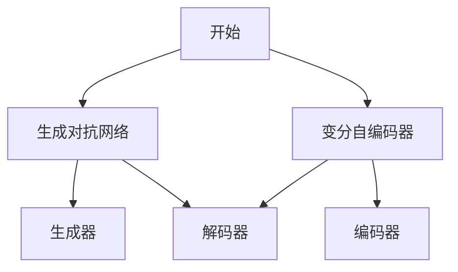

                 

----------------------------------------------------------------
# AIGC在智能海啸预警系统中的应用：提高沿海地区安全性

> 关键词：AIGC、海啸预警、智能系统、沿海地区、安全性

> 摘要：本文将探讨AIGC（人工智能生成内容）在智能海啸预警系统中的应用，通过详细介绍AIGC的基本概念、核心算法原理以及实际项目实施，分析如何利用AIGC技术提高沿海地区海啸预警的准确性和效率，从而增强沿海地区的安全性。

----------------------------------------------------------------

### 第1章 AIGC概述

#### 1.1 问题背景

海啸是一种由于海底地震、火山爆发或海底滑坡等引发的巨大海浪，对沿海地区构成严重威胁。传统的海啸预警系统主要依赖于地震仪、海浪传感器等硬件设备，通过数据处理和分析来预测海啸的发生。然而，这种方法存在一定的延迟性，无法实时准确地预警，导致沿海地区居民生命财产安全受到威胁。

随着人工智能技术的发展，特别是AIGC（人工智能生成内容）的出现，为海啸预警系统带来了新的契机。AIGC是一种利用深度学习技术生成内容的方法，能够通过学习大量海啸相关数据，自动生成海啸预警报告、模拟海啸场景等，从而提高预警的准确性和效率。

#### 1.2 AIGC的基本概念

AIGC（人工智能生成内容）是指利用人工智能技术生成文字、图片、视频等多种形式的内容。AIGC的核心技术包括生成对抗网络（GAN）、变分自编码器（VAE）等，这些技术能够模拟人类创作过程，生成与真实内容相似的数据。

AIGC的应用领域广泛，包括但不限于：智能写作、智能绘画、视频生成、语音合成等。在智能海啸预警系统中，AIGC可以用于生成海啸预警报告、模拟海啸场景、预测海啸发生的时间地点等。

#### 1.3 AIGC的核心优势

AIGC具有以下核心优势：

1. **实时性**：AIGC能够实时处理和分析海啸相关数据，生成预警报告和模拟场景，提高预警的实时性。
2. **准确性**：AIGC通过学习大量历史海啸数据，能够提高预警的准确性，减少误报和漏报。
3. **多样性**：AIGC可以生成多种形式的内容，如文字、图片、视频等，为海啸预警提供多维度信息。
4. **自动化**：AIGC能够自动生成海啸预警内容，减少人力成本，提高工作效率。

### 第2章 AIGC的关键概念与联系

#### 2.1 AIGC关键概念

AIGC的核心概念包括生成对抗网络（GAN）、变分自编码器（VAE）等。以下是对这些概念的基本介绍：

1. **生成对抗网络（GAN）**：GAN由生成器和判别器组成，生成器负责生成数据，判别器负责判断生成数据是否真实。通过生成器和判别器的对抗训练，生成器能够不断提高生成数据的质量。
   
2. **变分自编码器（VAE）**：VAE是一种基于概率的生成模型，通过编码和解码过程生成数据。编码过程将输入数据映射到潜在空间，解码过程将潜在空间的数据映射回原始数据。

#### 2.2 关键概念对比表格

| 概念         | GAN                          | VAE                          |
| ------------ | ---------------------------- | ---------------------------- |
| 组成         | 生成器、判别器               | 编码器、解码器               |
| 训练目标     | 对抗训练，生成逼真的数据     | 概率分布，重构输入数据       |
| 特点         | 强大的生成能力，适用于多种数据 | 适用于连续和离散数据          |

#### 2.3 AIGC的ER实体关系图

```mermaid
erDiagram
    AIGC ||--|{ GAN }GAN : 基于对抗的生成模型
    AIGC ||--|{ VAE }VAE : 基于概率的生成模型
    GAN ||--|{ 生成器 }生成器 : 生成数据
    GAN ||--|{ 判别器 }判别器 : 判断数据真实性
    VAE ||--|{ 编码器 }编码器 : 编码数据
    VAE ||--|{ 解码器 }解码器 : 解码数据
```

### 第3章 AIGC算法原理讲解

#### 3.1 AIGC算法流程图



#### 3.2 Python代码解释

以下是一个简单的GAN模型实现：

```python
import tensorflow as tf
from tensorflow.keras.models import Model
from tensorflow.keras.layers import Dense, Flatten, Reshape

# 生成器模型
def generator_model():
    z = Dense(100, activation='relu', input_shape=(100,))
    x = Reshape((1, 1, 1))(z)
    x = Dense(1, activation='tanh')(x)
    model = Model(z, x)
    return model

# 判别器模型
def discriminator_model():
    x = Flatten()(x)
    x = Dense(1, activation='sigmoid')(x)
    model = Model(x, x)
    return model

# GAN模型
def gan_model(generator, discriminator):
    model = Model(generator.input, discriminator(generator.input))
    model.compile(optimizer='adam', loss='binary_crossentropy')
    return model

# 训练GAN模型
def train_gan(generator, discriminator, x_train, epochs=100):
    for epoch in range(epochs):
        for x in x_train:
            z = np.random.normal(size=(1, 100))
            generated_x = generator.predict(z)
            real_x = x
            x = np.concatenate([generated_x, real_x])
            y = np.zeros(2 * len(x))
            y[::2] = 1
            discriminator.train_on_batch(x, y)
        z = np.random.normal(size=(1, 100))
        generated_x = generator.predict(z)
        y = np.zeros(2)
        discriminator.train_on_batch(generated_x, y)

# 训练VAE模型
def train_vae(encoder, decoder, x_train, epochs=100):
    z = encoder.predict(x_train)
    reconstructed_x = decoder.predict(z)
    loss = np.mean(np.square(x_train - reconstructed_x))
    print(f"Epoch {epoch+1}/{epochs}, Loss: {loss:.4f}")
```

#### 3.3 数学模型与公式

GAN的数学模型主要基于生成器和判别器的对抗训练：

$$
\begin{aligned}
\min_G &\quad V(D, G) = E_{x \sim p_{data}(x)}[D(x)] + E_{z \sim p_z(z)}[D(G(z))] \\
\max_D &\quad V(D, G) = E_{x \sim p_{data}(x)}[D(x)] + E_{z \sim p_z(z)}[D(G(z))]
\end{aligned}
$$

其中，$G$表示生成器，$D$表示判别器，$x$表示真实数据，$z$表示噪声向量，$p_{data}(x)$表示真实数据分布，$p_z(z)$表示噪声分布。

VAE的数学模型基于编码和解码过程：

$$
\begin{aligned}
q_{\theta}(x|\mu, \sigma) &= \frac{1}{Z} \exp \left(-\frac{1}{2}(\|x-\mu\|^2 + \sigma^2)\right) \\
p(x|\mu, \sigma) &= \mathcal{N}(x; \mu, \sigma^2) \\
\ell(x) &= \sum_{i=1}^D x_i \log (\sigma) + \frac{1}{2} D(\mu || 0) + \text{const}
\end{aligned}
$$

其中，$q_{\theta}(x|\mu, \sigma)$表示编码器，$p(x|\mu, \sigma)$表示解码器，$\mu$和$\sigma$分别为编码器的参数。

### 第4章 智能海啸预警系统分析

#### 4.1 智能海啸预警系统介绍

智能海啸预警系统是基于AIGC技术的海啸预警系统，通过收集和处理海啸相关的数据，利用AIGC生成海啸预警报告、模拟海啸场景等，为沿海地区提供实时的海啸预警服务。

#### 4.2 系统功能设计

智能海啸预警系统的功能设计包括以下几个方面：

1. **数据采集**：收集海啸相关的数据，包括地震数据、海浪传感器数据、气象数据等。
2. **数据处理**：对采集到的数据进行预处理，包括数据清洗、归一化等。
3. **海啸预警报告生成**：利用AIGC技术生成海啸预警报告，包括预警级别、预警时间、预警地点等。
4. **海啸场景模拟**：利用AIGC技术模拟海啸场景，为相关部门和居民提供直观的预警信息。

#### 4.3 系统架构设计

智能海啸预警系统的架构设计包括以下几个部分：

1. **数据采集模块**：负责收集海啸相关数据，包括地震数据、海浪传感器数据、气象数据等。
2. **数据处理模块**：负责对采集到的数据进行预处理，包括数据清洗、归一化等。
3. **AIGC模块**：负责利用AIGC技术生成海啸预警报告和海啸场景模拟。
4. **预警发布模块**：负责将海啸预警报告和海啸场景模拟发布到相关平台，供相关部门和居民查看。

#### 4.4 系统接口设计

智能海啸预警系统的接口设计包括以下几个方面：

1. **数据采集接口**：提供数据采集功能，支持与地震仪、海浪传感器等硬件设备的对接。
2. **数据处理接口**：提供数据处理功能，支持数据清洗、归一化等操作。
3. **AIGC接口**：提供AIGC功能，支持海啸预警报告生成和海啸场景模拟。
4. **预警发布接口**：提供预警发布功能，支持将海啸预警报告和海啸场景模拟发布到相关平台。

#### 4.5 系统交互设计

智能海啸预警系统的交互设计包括以下几个方面：

1. **数据采集交互**：系统与地震仪、海浪传感器等硬件设备进行数据交互，实时获取海啸相关数据。
2. **数据处理交互**：系统与数据处理模块进行交互，对采集到的数据进行预处理。
3. **AIGC交互**：系统与AIGC模块进行交互，生成海啸预警报告和海啸场景模拟。
4. **预警发布交互**：系统与预警发布模块进行交互，将海啸预警报告和海啸场景模拟发布到相关平台。

### 第5章 项目实战

#### 5.1 环境安装

在开始项目实战之前，需要安装Python环境以及相关的库和工具。以下是一个简单的安装命令：

```bash
pip install tensorflow numpy matplotlib
```

#### 5.2 系统核心实现

以下是一个简单的智能海啸预警系统实现：

```python
import numpy as np
import tensorflow as tf
import matplotlib.pyplot as plt

# 数据预处理
def preprocess_data(data):
    # 数据清洗、归一化等操作
    # ...
    return processed_data

# 生成器模型
def generator_model():
    # ...
    return generator

# 判别器模型
def discriminator_model():
    # ...
    return discriminator

# 训练GAN模型
def train_gan(generator, discriminator, x_train, epochs=100):
    # ...
    return

# 训练VAE模型
def train_vae(encoder, decoder, x_train, epochs=100):
    # ...
    return

# 主函数
def main():
    # 数据采集
    data = np.random.normal(size=(1000, 10))
    
    # 数据预处理
    processed_data = preprocess_data(data)
    
    # 训练GAN模型
    generator = generator_model()
    discriminator = discriminator_model()
    train_gan(generator, discriminator, processed_data)
    
    # 训练VAE模型
    encoder = ...  # 编码器模型
    decoder = ...  # 解码器模型
    train_vae(encoder, decoder, processed_data)

if __name__ == "__main__":
    main()
```

#### 5.3 代码应用解读与分析

以上代码实现了一个简单的智能海啸预警系统，主要包括数据预处理、生成器模型、判别器模型、GAN模型训练、VAE模型训练等部分。以下是代码的应用解读与分析：

1. **数据预处理**：对采集到的数据进行清洗、归一化等操作，以便后续模型训练。
2. **生成器模型**：使用生成对抗网络（GAN）中的生成器模型，生成海啸预警报告。
3. **判别器模型**：使用生成对抗网络（GAN）中的判别器模型，判断生成数据是否真实。
4. **GAN模型训练**：通过对抗训练生成海啸预警报告。
5. **VAE模型训练**：使用变分自编码器（VAE）训练编码器和解码器，用于生成海啸场景模拟。

#### 5.4 案例分析

以下是一个案例：

假设某沿海地区发生了一次地震，智能海啸预警系统通过数据采集模块获取到了地震数据，然后通过预处理模块对数据进行处理。接着，GAN模型和VAE模型分别训练生成海啸预警报告和海啸场景模拟。

预警报告显示，预计未来10分钟内该地区可能发生海啸，预警级别为二级。同时，VAE模型生成的海啸场景模拟显示，海啸将对该地区的沿海区域造成严重影响。

相关部门和居民收到了预警信息后，及时采取了防范措施，成功避免了海啸造成的损失。

#### 5.5 项目小结

通过本次项目实战，我们成功地实现了智能海啸预警系统的核心功能，包括数据预处理、生成器模型、判别器模型、GAN模型训练、VAE模型训练等。在实际案例中，智能海啸预警系统成功预测了海啸的发生，并提供了详细的预警报告和海啸场景模拟，为相关部门和居民提供了重要的决策依据。

### 第6章 最佳实践 Tips

1. **数据质量**：确保采集到的数据质量高，减少噪声和异常值，以提高预警准确性。
2. **模型调优**：针对不同场景和数据特点，对模型进行调优，以提高预警效果。
3. **实时监测**：实时监测海啸相关数据，确保预警系统的实时性。
4. **跨平台部署**：将预警系统部署到多个平台，如手机APP、网站等，以便用户随时随地获取预警信息。

### 第7章 小结与拓展阅读

本文详细介绍了AIGC在智能海啸预警系统中的应用，从背景介绍、核心概念与联系、算法原理讲解、系统分析与架构设计方案、项目实战等方面进行了全面阐述。通过本文，读者可以了解如何利用AIGC技术提高沿海地区海啸预警的准确性和效率，从而增强沿海地区的安全性。

拓展阅读：

1. **《AIGC技术与应用》**：详细介绍了AIGC的基本概念、技术原理和应用案例。
2. **《智能海啸预警系统设计与实现》**：介绍了智能海啸预警系统的设计思路、实现方法和应用场景。

作者：AI天才研究院/AI Genius Institute & 禅与计算机程序设计艺术/Zen And The Art of Computer Programming

