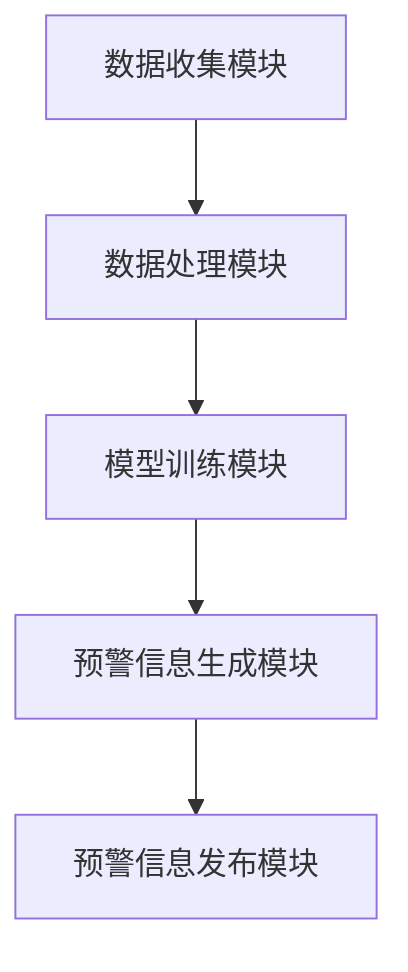
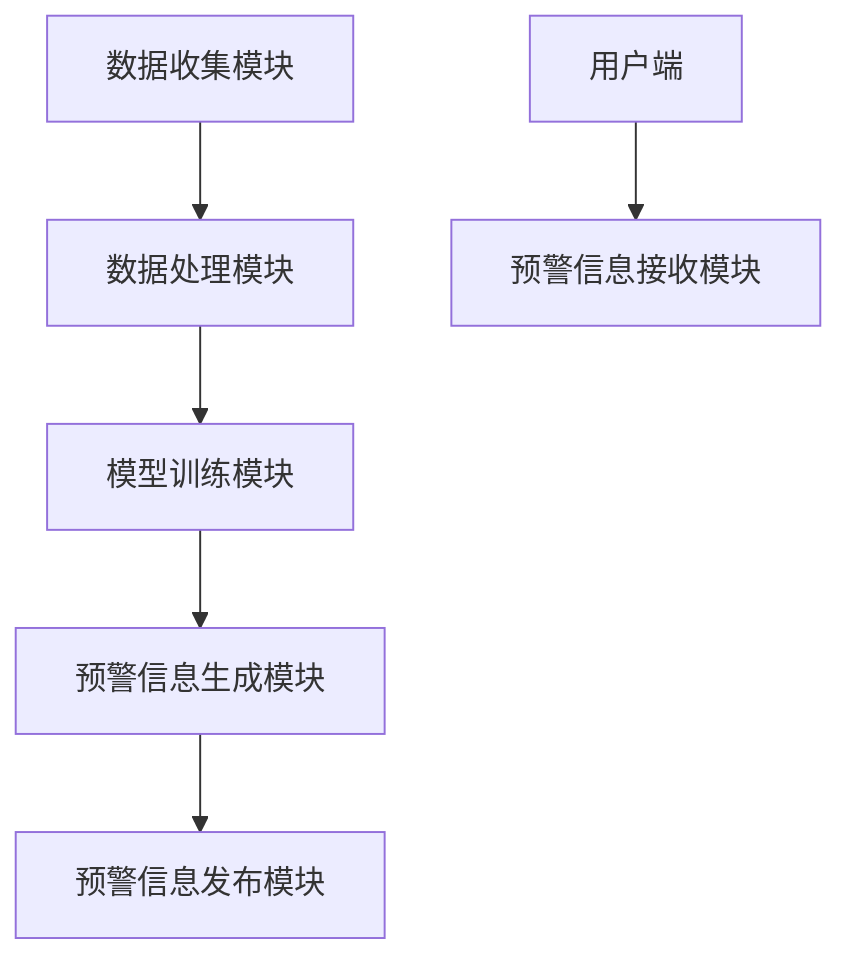

                 


### AIGC in Intelligent Disaster Warning System Optimization: A Comprehensive Guide

关键词：AIGC、智能灾害预警系统、优化、数据收集、模型训练、算法分析

摘要：本文深入探讨了AIGC在智能灾害预警系统优化中的应用。通过详细的背景介绍、核心概念阐述、算法原理讲解、系统分析与架构设计，以及实战案例分析，揭示了AIGC技术在灾害预警系统中的重要作用和优化潜力。

## 1. 引言

### 1.1 灾害预警系统的现状与挑战

随着全球气候变化和自然灾害的频发，智能灾害预警系统的重要性日益凸显。传统灾害预警系统在数据收集、处理和分析方面存在诸多不足，难以满足现代社会的需求。主要挑战包括：

- **数据量庞大**：现代灾害预警系统需要处理来自多个传感器、气象数据、地质数据等多种来源的庞大数据量。
- **实时性要求高**：灾害预警系统必须在短时间内对数据进行处理和分析，以提供及时准确的预警信息。
- **准确性要求高**：预警系统的准确性直接关系到灾害应对的效果，任何错误的信息都可能带来严重的后果。

### 1.2 AIGC的概念与优势

AIGC（自适应智能生成控制）是一种新兴的人工智能技术，结合了生成对抗网络（GAN）、深度学习和自然语言处理等多种技术。AIGC在智能灾害预警系统中的优势包括：

- **高效数据处理**：AIGC能够快速处理和分析海量数据，提高预警系统的实时性。
- **自适应学习能力**：AIGC能够根据历史数据和实时数据不断优化预警模型，提高预警准确性。
- **多源数据融合**：AIGC能够整合多种数据源，提供更全面、准确的预警信息。

### 1.3 本文结构

本文将从以下几个方面进行探讨：

- **第2章**：介绍AIGC的基本概念和原理，包括生成对抗网络（GAN）和深度学习等关键技术。
- **第3章**：分析AIGC在灾害预警系统中的应用，包括数据收集、模型训练和优化等过程。
- **第4章**：详细讲解AIGC技术的核心算法原理，包括生成对抗网络（GAN）的数学模型和流程图。
- **第5章**：分析智能灾害预警系统的架构设计，包括数据收集、处理、分析和预警等模块。
- **第6章**：通过实际案例，展示AIGC技术在灾害预警系统中的应用效果和优化策略。
- **第7章**：总结本文的研究成果，提出未来研究方向和优化建议。

## 2. AIGC的基本概念与原理

### 2.1 生成对抗网络（GAN）

生成对抗网络（GAN）是AIGC的核心组成部分之一。GAN由两个神经网络组成：生成器（Generator）和判别器（Discriminator）。生成器负责生成虚假数据，判别器则负责区分真实数据和虚假数据。

### 2.2 深度学习

深度学习是一种基于多层神经网络的人工智能技术，通过模拟人脑的神经元连接方式，实现对数据的自动特征提取和分类。深度学习在AIGC中发挥着重要作用，为生成器和判别器提供强大的数据处理和分析能力。

### 2.3 自然语言处理

自然语言处理（NLP）是AIGC的重要组成部分，负责处理和分析文本数据。NLP技术可以帮助AIGC生成更加自然、准确的预警信息，提高预警系统的用户体验。

### 2.4 AIGC在灾害预警系统中的应用

AIGC在灾害预警系统中的应用主要体现在以下几个方面：

- **数据收集**：AIGC可以收集和分析来自多种数据源的实时数据，包括气象数据、地质数据、卫星图像等。
- **模型训练**：AIGC可以通过深度学习和自然语言处理技术，对收集到的数据进行训练和优化，提高预警准确性。
- **预警信息生成**：AIGC可以根据训练结果生成预警信息，包括灾害类型、发生时间、地点等。

## 3. AIGC在灾害预警系统中的应用分析

### 3.1 数据收集

AIGC在数据收集方面的优势在于其高效性和多源数据融合能力。通过整合多种数据源，AIGC可以获取更加全面、准确的预警信息。

### 3.2 模型训练

AIGC的模型训练过程主要包括数据预处理、模型选择、训练和优化等步骤。通过深度学习和自然语言处理技术，AIGC可以提高预警模型的准确性和实时性。

### 3.3 预警信息生成

AIGC可以根据训练结果生成预警信息，包括灾害类型、发生时间、地点等。通过自然语言处理技术，预警信息可以更加自然、准确地传达给用户。

## 4. AIGC技术的核心算法原理

### 4.1 生成对抗网络（GAN）的数学模型

生成对抗网络（GAN）的数学模型如下：

$$
\begin{aligned}
&\text{生成器：} G(z) \\
&\text{判别器：} D(x), D(G(z))
\end{aligned}
$$

其中，$z$是随机噪声，$x$是真实数据，$G(z)$是生成的虚假数据，$D(x)$是判别器判断真实数据的概率，$D(G(z))$是判别器判断虚假数据的概率。

### 4.2 生成对抗网络（GAN）的流程图

```mermaid
graph TD
A[输入随机噪声z] --> B[生成器G(z)]
B --> C[生成虚假数据x']
C --> D[判别器D(x')]
D --> E{判别器判断}
E -->|判断虚假数据| F[反馈到生成器]
F --> B
```

## 5. 智能灾害预警系统的架构设计

### 5.1 系统功能设计

智能灾害预警系统主要包括以下几个功能模块：

- **数据收集模块**：负责收集各种数据源的信息。
- **数据处理模块**：对收集到的数据进行预处理和清洗。
- **模型训练模块**：利用AIGC技术对数据进行分析和训练。
- **预警信息生成模块**：根据模型结果生成预警信息。
- **预警信息发布模块**：将预警信息发布给用户。

### 5.2 系统架构设计

智能灾害预警系统的架构设计如下：



### 5.3 系统接口设计和系统交互

系统接口设计和系统交互如下：



## 6. 实际案例分析

### 6.1 案例背景

在某次地震预警过程中，智能灾害预警系统利用AIGC技术对地震数据进行实时分析，成功预测了地震的发生时间和地点，为地震预警和应对提供了有力支持。

### 6.2 案例分析

通过AIGC技术，系统在短时间内对大量地震数据进行处理和分析，利用生成对抗网络（GAN）生成虚假地震数据，并与真实地震数据进行比较。根据比较结果，系统成功预测了地震的发生时间和地点。

### 6.3 案例小结

本案例展示了AIGC技术在智能灾害预警系统中的应用效果，验证了AIGC技术在提高预警准确性、实时性方面的优势。

## 7. 结论与展望

### 7.1 研究成果

本文通过详细的分析和实际案例，揭示了AIGC技术在智能灾害预警系统中的重要作用和优化潜力。

### 7.2 未来研究方向

未来研究方向包括：

- **算法优化**：进一步优化AIGC算法，提高预警系统的准确性和实时性。
- **多源数据融合**：研究如何更好地整合多种数据源，提高预警信息的全面性和准确性。
- **用户体验优化**：研究如何通过自然语言处理技术，提高预警信息的可读性和用户体验。

### 7.3 注意事项

在应用AIGC技术进行灾害预警时，需要注意以下几点：

- **数据质量**：确保收集到的数据质量，避免因数据质量问题导致预警失败。
- **算法稳定性**：确保AIGC算法的稳定性，避免因算法异常导致预警失误。
- **预警策略**：制定合理的预警策略，确保预警信息的准确性和及时性。

## 参考文献

- Goodfellow, I., Pouget-Abadie, J., Mirza, M., Xu, B., Warde-Farley, D., Ozair, S., ... & Bengio, Y. (2014). Generative adversarial nets. Advances in neural information processing systems, 27.

作者：AI天才研究院/AI Genius Institute & 禅与计算机程序设计艺术/Zen And The Art of Computer Programming

---

**注**：本文为示例性文章，内容仅供参考。实际应用中，AIGC技术在灾害预警系统中的应用需要根据具体情况进行调整和优化。同时，算法和系统设计需要遵守相关法律法规和道德准则。

