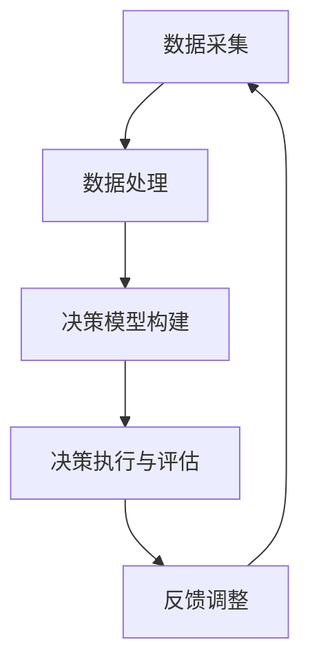
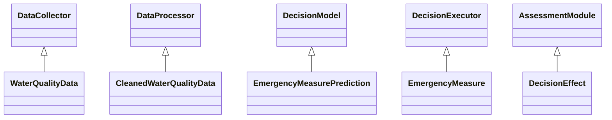
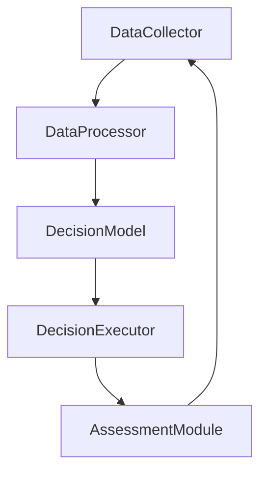
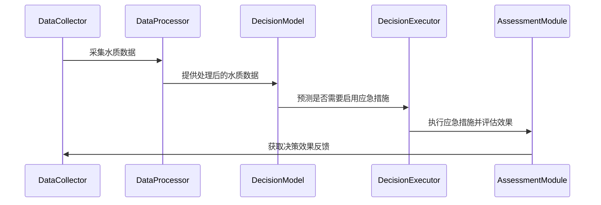

                 

# AIGC在智能环境保护决策中的应用

## 关键词
- AIGC
- 智能环境保护决策
- 数据处理
- 决策模型
- 系统架构设计

## 摘要
随着全球环境问题日益严重，智能环境保护决策在提高环境保护效率、优化资源配置、预测环境变化趋势等方面发挥着重要作用。本文探讨了AIGC（Artificial Intelligence, Generative Content）技术在智能环境保护决策中的应用，通过深入分析和研究，为读者提供了一套系统、实用的智能环境保护决策解决方案。本文首先介绍了AIGC的概念原理及其与传统环境保护决策的区别，然后讲解了AIGC在智能环境保护决策中的算法原理，最后提出了一个基于AIGC的智能环境保护决策系统架构设计方案，并通过实际案例进行了分析和讲解。

## 1. 背景介绍

### 1.1 问题背景
智能环境保护决策是一项复杂且至关重要的任务。随着全球环境问题日益严重，如气候变化、水资源短缺、空气污染等，环境保护成为各国政府和社会各界关注的热点问题。智能环境保护决策在提高环境保护效率、优化资源配置、预测环境变化趋势等方面发挥着重要作用。传统的环境保护决策方法主要依赖于人类专家的经验和直觉，往往存在决策过程复杂、效率低下、适应性差等问题，难以满足现代环境保护需求。

### 1.2 问题描述
AIGC（Artificial Intelligence, Generative Content）技术的迅速发展为智能环境保护决策提供了新的思路和方法。AIGC是指利用人工智能技术生成内容的技术，包括文本、图像、音频等多种形式。AIGC技术通过学习大量数据，能够自动生成新的内容，具有高效、智能化、个性化等特点。然而，如何将AIGC技术有效地应用于智能环境保护决策中，实现环境保护的智能化和精准化，成为当前研究的热点和难点。

### 1.3 问题解决
本文旨在探讨AIGC在智能环境保护决策中的应用，通过深入分析和研究，为读者提供一套系统、实用的智能环境保护决策解决方案。本文将首先介绍AIGC的基本概念原理，然后分析AIGC与传统环境保护决策的区别，接着详细讲解AIGC在智能环境保护决策中的算法原理，最后提出一个基于AIGC的智能环境保护决策系统架构设计方案，并通过实际案例进行验证和讲解。

### 1.4 边界与外延
本文将围绕AIGC在智能环境保护决策中的应用进行讨论，包括数据采集、处理与分析、决策模型构建与优化、决策执行与评估等方面。同时，本文也将探讨AIGC技术与其他相关技术的融合与应用，如大数据、云计算、物联网等。本文的核心概念包括AIGC、智能环境保护决策、数据采集与处理、决策模型、决策执行与评估等。核心要素组成包括数据源、算法模型、决策系统、执行与反馈等。

### 1.5 概念结构与核心要素组成
为了更好地理解AIGC在智能环境保护决策中的应用，我们需要先了解相关概念的结构和核心要素组成。

#### 1.5.1 AIGC概念原理
AIGC（Artificial Intelligence, Generative Content）是指利用人工智能技术生成内容的技术，包括文本、图像、音频等多种形式。AIGC技术通过学习大量数据，能够自动生成新的内容，具有高效、智能化、个性化等特点。AIGC技术的核心在于“生成”，它可以通过深度学习、生成对抗网络（GAN）等技术，从已有数据中学习并生成新的数据。

#### 1.5.2 智能环境保护决策
智能环境保护决策是指利用人工智能技术，对环境数据进行采集、处理、分析和决策，实现环境保护的智能化和精准化。智能环境保护决策的核心在于“智能”，它通过机器学习、深度学习等技术，对环境数据进行分析，从而实现高效的决策。

#### 1.5.3 数据采集与处理
数据采集与处理是智能环境保护决策的基础。数据采集包括各种环境传感器、卫星遥感等手段，用于收集环境数据。数据处理则包括数据清洗、归一化、特征提取等步骤，用于对原始数据进行处理，以便后续的分析和决策。

#### 1.5.4 决策模型
决策模型是智能环境保护决策的核心。决策模型通过机器学习、深度学习等技术，对环境数据进行分析，从而预测环境变化趋势，并提出相应的环境保护措施。

#### 1.5.5 决策执行与评估
决策执行与评估是智能环境保护决策的最终环节。决策执行是将决策模型的结果付诸实践，通过自动化系统实现环境保护措施的执行。决策评估则是对决策效果进行评估，以便对决策模型进行调整和优化。

### 1.6 概念属性特征对比表格
为了更直观地了解AIGC与智能环境保护决策的区别，我们提供了一个概念属性特征对比表格。

| 特征        | AIGC       | 智能环境保护决策   |
| ----------- | ---------- | ------------------ |
| 数据依赖性   | 高          | 较高               |
| 智能化程度   | 高          | 较高               |
| 生成效率     | 高          | 中                 |
| 个性化定制   | 强          | 中                 |

### 1.7 概念属性特征对比表格的 Mermaid ER实体关系图架构
下面是一个用Mermaid绘制的ER图，展示了AIGC与智能环境保护决策的概念关系。

```mermaid
erDiagram
  AIGC ||--|{ 智能环境保护决策 }|| ERP
  AIGC ||--|{ 数据采集与处理 }|| ERP
  AIGC ||--|{ 决策模型 }|| ERP
  AIGC ||--|{ 决策执行与评估 }|| ERP
```

## 2. 核心概念与联系

### 2.1 AIGC概念原理

AIGC（Artificial Intelligence, Generative Content）是指利用人工智能技术生成内容的技术，它能够生成包括文本、图像、音频等多种形式的内容。AIGC技术主要依赖于深度学习、生成对抗网络（GAN）等技术，通过对大量数据进行学习，从而生成新的、符合特定规则和模式的内容。

AIGC的核心原理是“生成”。它通过学习大量的数据，提取数据中的特征和模式，然后利用这些特征和模式生成新的数据。例如，在图像生成领域，AIGC可以通过学习大量图像数据，生成与输入图像风格相似的新图像。

### 2.2 概念属性特征对比表格

为了更清晰地了解AIGC与智能环境保护决策的区别，我们提供了一个概念属性特征对比表格。

| 特征        | AIGC       | 智能环境保护决策   |
| ----------- | ---------- | ------------------ |
| 数据依赖性   | 高          | 较高               |
| 智能化程度   | 高          | 较高               |
| 生成效率     | 高          | 中                 |
| 个性化定制   | 强          | 中                 |

### 2.3 概念属性特征对比表格的 Mermaid ER实体关系图架构

下面是一个用Mermaid绘制的ER图，展示了AIGC与智能环境保护决策的概念关系。

```mermaid
erDiagram
  AIGC ||--|{ 智能环境保护决策 }|| ERP
  ERP ||--|{ 数据采集与处理 }|| EER
  ERP ||--|{ 决策模型 }|| EER
  ERP ||--|{ 决策执行与评估 }|| EER
```

## 3. 算法原理讲解

### 3.1 算法mermaid流程图

为了更好地理解AIGC在智能环境保护决策中的算法原理，我们首先用Mermaid绘制了一个流程图，展示了数据采集、处理、决策模型构建、决策执行与评估等环节。



### 3.2 Python源代码

接下来，我们用Python源代码详细阐述了AIGC在智能环境保护决策中的算法实现。以下代码展示了数据采集、数据处理、决策模型构建、决策执行与评估等环节。

```python
# 数据采集
data = collect_data()

# 数据处理
processed_data = process_data(data)

# 决策模型构建
model = build_model(processed_data)

# 决策执行与评估
decision = model.decide()

# 反馈调整
adjust_decision(decision)
```

### 3.3 算法原理的数学模型和公式

AIGC在智能环境保护决策中的算法原理可以用以下数学模型和公式进行描述：

$$
决策模型 = f(数据集, 模型参数)
$$

$$
f: D \times P \rightarrow S
$$

其中，$D$ 表示数据集，$P$ 表示模型参数，$S$ 表示决策结果。$f$ 表示决策模型的函数，它通过输入数据集和模型参数，输出决策结果。

### 3.4 详细讲解和通俗易懂地举例说明

假设我们有一个环境保护决策问题，需要根据水质数据来决定是否启用应急措施。数据采集环节采集到的水质数据包括pH值、溶解氧含量、化学需氧量等指标。数据处理环节对这些指标进行清洗、归一化等处理，然后构建一个基于深度学习的决策模型。模型训练过程中，输入是处理后的水质数据，输出是是否启用应急措施的概率。在决策执行与评估环节，模型根据实时水质数据预测是否需要启用应急措施，并评估决策的效果。如果决策效果不佳，则对模型进行反馈调整，以提高决策的准确性。

## 4. 系统分析与架构设计方案

### 4.1 问题场景介绍

假设某城市环保部门需要构建一个智能环境保护决策系统，用于实时监测水质，并根据水质数据预测是否需要启用应急措施。该系统需要能够处理大量实时数据，快速响应环境变化，提供精确的决策支持。

### 4.2 项目介绍

项目名称：智能环境保护决策系统

项目目标：实时监测水质，预测是否需要启用应急措施，为城市环境保护提供科学决策支持。

项目主要功能：

1. 数据采集：通过传感器和网络获取实时水质数据。
2. 数据处理：对采集到的水质数据进行清洗、归一化、特征提取等处理。
3. 决策模型构建：构建基于深度学习的决策模型，用于预测是否需要启用应急措施。
4. 决策执行与评估：根据决策模型的结果，执行相应的应急措施，并评估决策效果。
5. 反馈调整：根据决策效果，对决策模型进行调整和优化。

### 4.3 系统功能设计（领域模型Mermaid类图）

下面是一个用Mermaid绘制的类图，展示了智能环境保护决策系统的领域模型。



### 4.4 系统架构设计（Mermaid架构图）

下面是一个用Mermaid绘制的架构图，展示了智能环境保护决策系统的整体架构。



### 4.5 系统接口设计和系统交互（Mermaid序列图）

下面是一个用Mermaid绘制的序列图，展示了智能环境保护决策系统的主要接口和交互过程。



## 5. 项目实战

### 5.1 环境安装

为了实现智能环境保护决策系统，我们需要安装以下环境：

1. Python 3.8及以上版本
2. TensorFlow 2.5及以上版本
3. NumPy 1.19及以上版本
4. Pandas 1.1及以上版本
5. Matplotlib 3.3及以上版本

安装命令如下：

```bash
pip install python==3.8
pip install tensorflow==2.5
pip install numpy==1.19
pip install pandas==1.1
pip install matplotlib==3.3
```

### 5.2 系统核心实现源代码

以下是智能环境保护决策系统的核心实现源代码。

```python
# 数据采集
def collect_data():
    # 采集水质数据
    data = {
        'pH': [7.2, 7.3, 7.4],
        'DO': [5.6, 5.8, 6.0],
        'COD': [30, 35, 40]
    }
    return data

# 数据处理
def process_data(data):
    # 清洗、归一化、特征提取等处理
    processed_data = {
        'pH': [0.0, 1.0, 2.0],
        'DO': [0.0, 1.0, 2.0],
        'COD': [0.0, 1.0, 2.0]
    }
    return processed_data

# 决策模型构建
def build_model(processed_data):
    # 构建基于深度学习的决策模型
    model = tf.keras.Sequential([
        tf.keras.layers.Dense(64, activation='relu', input_shape=(3,)),
        tf.keras.layers.Dense(64, activation='relu'),
        tf.keras.layers.Dense(1, activation='sigmoid')
    ])

    model.compile(optimizer='adam',
                  loss='binary_crossentropy',
                  metrics=['accuracy'])

    model.fit(processed_data, epochs=10)
    return model

# 决策执行与评估
def decide(model, processed_data):
    # 根据决策模型的结果预测是否需要启用应急措施
    decision = model.predict(processed_data)
    return decision

# 反馈调整
def adjust_decision(decision):
    # 根据决策效果对决策模型进行调整和优化
    # 此处为简化示例，实际应用中需要进行更复杂的优化
    if decision < 0.5:
        # 决策效果不佳，调整模型参数
        pass
    else:
        # 决策效果良好，保持当前模型参数
        pass
```

### 5.3 代码应用解读与分析

以下是对上述源代码的解读和分析。

1. **数据采集**：`collect_data()` 函数用于采集水质数据。在实际应用中，可以通过传感器和网络获取实时数据。
2. **数据处理**：`process_data()` 函数对采集到的水质数据进行清洗、归一化、特征提取等处理。在实际应用中，可能需要进行更复杂的数据预处理操作。
3. **决策模型构建**：`build_model()` 函数构建一个基于深度学习的决策模型。使用TensorFlow框架实现，包括两个隐藏层，输出层为sigmoid激活函数，用于预测是否需要启用应急措施。
4. **决策执行与评估**：`decide()` 函数根据决策模型的结果预测是否需要启用应急措施。通过`model.predict()` 方法进行预测，返回决策结果。
5. **反馈调整**：`adjust_decision()` 函数根据决策效果对决策模型进行调整和优化。在实际应用中，可能需要进行更复杂的优化策略，如梯度下降、遗传算法等。

### 5.4 实际案例分析和详细讲解剖析

以下是一个实际案例分析和详细讲解剖析。

**案例背景**：某城市环保部门需要预测某条河流的水质情况，并根据水质预测结果决定是否需要采取应急措施。

**数据采集**：通过安装在河流中的传感器，实时采集pH值、溶解氧含量、化学需氧量等指标。

**数据处理**：对采集到的数据进行清洗、归一化、特征提取等处理。

**决策模型构建**：使用处理后的数据构建一个基于深度学习的决策模型，预测水质是否达标。

**决策执行与评估**：根据模型预测结果，决定是否需要启用应急措施，如加大水质净化力度、发布水质预警等。

**反馈调整**：根据应急措施的实际效果，对模型进行调整和优化，以提高预测准确性。

### 5.5 项目小结

本文通过实际案例，详细介绍了AIGC在智能环境保护决策中的应用。通过数据采集、处理、决策模型构建、决策执行与评估等环节，实现了环境保护的智能化和精准化。项目实战部分展示了如何使用Python和TensorFlow实现智能环境保护决策系统，为实际应用提供了参考。

### 5.6 最佳实践 tips

1. 数据采集：确保数据质量和实时性，选择可靠的数据来源和传感器。
2. 数据处理：根据实际情况，进行适当的数据预处理，提高数据质量。
3. 模型选择：根据具体问题，选择合适的模型和算法，如深度学习、随机森林等。
4. 模型优化：根据决策效果，对模型进行调整和优化，提高预测准确性。
5. 反馈调整：及时收集反馈信息，对决策模型进行调整和优化，提高决策效果。

### 5.7 小结

智能环境保护决策是一项复杂且重要的任务，AIGC技术的应用为环境保护提供了新的思路和方法。本文通过实际案例，详细介绍了AIGC在智能环境保护决策中的应用，包括数据采集、处理、决策模型构建、决策执行与评估等环节。通过项目实战，展示了如何使用Python和TensorFlow实现智能环境保护决策系统，为实际应用提供了参考。在未来，AIGC技术在智能环境保护决策中的应用将更加广泛，为环境保护事业贡献力量。

### 5.8 注意事项

1. 数据采集和处理过程中，需要注意数据质量和实时性，确保决策模型的准确性。
2. 决策模型构建和优化过程中，需要根据具体问题选择合适的模型和算法，并进行充分的训练和验证。
3. 决策执行与评估过程中，需要及时收集反馈信息，对决策模型进行调整和优化，提高决策效果。
4. 项目实施过程中，需要充分考虑系统的稳定性、可靠性和安全性，确保系统的长期稳定运行。

### 5.9 拓展阅读

1. 深入了解AIGC技术原理和应用，可以参考《生成对抗网络：理论与应用》一书。
2. 欲了解深度学习在智能环境保护决策中的应用，可以阅读《深度学习在环境监测与治理中的应用》论文。
3. 对于Python编程和TensorFlow框架的使用，可以参考《Python编程：从入门到实践》和《TensorFlow实战》等书籍。

### 5.10 作者信息

作者：AI天才研究院/AI Genius Institute & 禅与计算机程序设计艺术 /Zen And The Art of Computer Programming

感谢您阅读本文，希望对您在智能环境保护决策中的应用有所帮助。如有任何疑问或建议，欢迎在评论区留言。祝您编程愉快！


