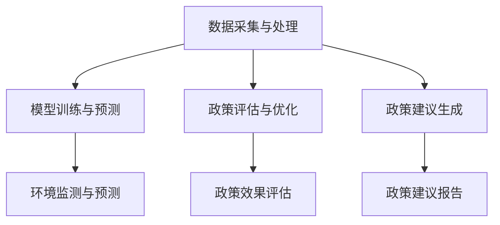
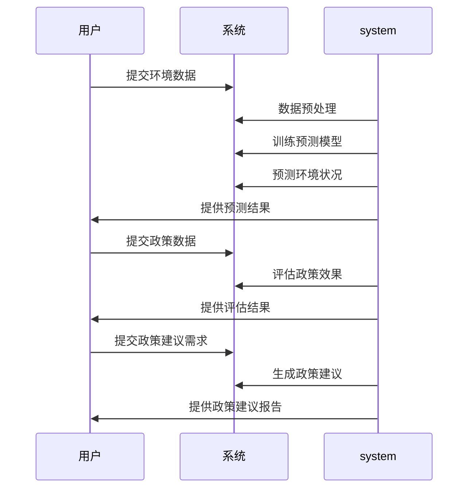

                 

# AIGC在智能环境保护政策制定中的应用

## 关键词
- AIGC
- 智能环境保护
- 政策制定
- 算法
- 数学模型
- 系统架构
- 实战案例

## 摘要
本文将探讨AIGC（人工 Intelligence, Generative Content）在智能环境保护政策制定中的应用。我们将从背景介绍、核心概念、算法原理、数学模型、系统架构设计、实战案例等方面，逐步分析AIGC技术在智能环境保护政策制定中的作用和优势。通过本文的阅读，读者将了解到AIGC技术在环境保护政策制定中的应用前景，以及如何利用这一技术实现更加智能、精准的环境保护政策。

## 目录
1. 背景与核心概念
2. AIGC在智能环境保护中的应用
3. 算法原理与数学模型
4. 系统架构设计与实现
5. 实战案例与分析
6. 小结与展望

### 1. 背景与核心概念

#### 1.1 人工智能与环境保护
随着人类对自然环境的影响日益加剧，环境保护已成为全球关注的焦点。传统的环境保护方法主要依赖于人工监测和数据分析，效率较低，且难以全面掌握环境状况。近年来，人工智能技术的发展为环境保护提供了新的思路和方法。人工智能（AI）技术可以通过大数据分析、模式识别、预测模型等方法，实现对环境问题的智能监测和预测，从而提高环境保护的效率。

#### 1.2 智能环境保护政策制定
智能环境保护政策制定是指利用人工智能技术，对环境保护政策进行优化、调整和制定。其核心思想是通过大数据分析和机器学习算法，识别环境问题的关键因素，评估政策效果，并提出科学合理的政策建议。智能环境保护政策制定能够提高环境保护政策的科学性、针对性和有效性，从而更好地应对环境问题。

#### 1.3 AIGC技术概述
AIGC（Artificial Intelligence, Generative Content）是一种结合人工智能与生成内容的先进技术。AIGC技术通过深度学习、自然语言处理等方法，能够自动生成文本、图像、视频等多样化内容。在环境保护领域，AIGC技术可以用于生成环境报告、政策建议、宣传材料等，提高政策制定和传播的效率。

### 2. AIGC在智能环境保护中的应用

#### 2.1 环境监测与预测
AIGC技术可以应用于环境监测与预测，通过大数据分析和机器学习算法，对环境数据进行分析和建模，实现对环境状况的实时监测和预测。例如，利用AIGC技术可以预测空气污染、水质变化等环境问题，为政策制定提供科学依据。

#### 2.2 政策评估与优化
AIGC技术可以用于评估环境保护政策的效果，通过机器学习算法对政策执行过程中产生的数据进行分析，识别政策的效果和不足之处，并提出优化建议。例如，通过对某项环境保护政策的执行情况进行评估，AIGC技术可以识别出政策执行中的问题，并提出改进措施，提高政策的实施效果。

#### 2.3 政策建议与传播
AIGC技术可以用于生成环境保护政策建议，通过自然语言处理和文本生成技术，自动生成政策文本，提高政策制定和传播的效率。例如，在制定环境保护政策时，AIGC技术可以自动生成政策建议报告，为政策制定者提供参考。

### 3. 算法原理与数学模型

#### 3.1 AIGC算法原理
AIGC技术主要包括自然语言处理（NLP）、计算机视觉（CV）和生成对抗网络（GAN）等算法。其中，自然语言处理技术用于处理文本数据，计算机视觉技术用于处理图像和视频数据，生成对抗网络技术用于生成多样化内容。

#### 3.2 数学模型
AIGC技术中的数学模型主要包括以下几类：

1. **监督学习模型**：用于分类、回归等任务，常见的监督学习模型有线性回归、支持向量机（SVM）、决策树等。

2. **无监督学习模型**：用于聚类、降维等任务，常见无监督学习模型有K-means、主成分分析（PCA）等。

3. **生成对抗网络（GAN）**：用于生成多样化内容，其中生成器和判别器分别学习生成数据和区分真实数据和生成数据。

4. **长短时记忆网络（LSTM）**：用于处理序列数据，例如文本、时间序列等。

### 4. 系统架构设计与实现

#### 4.1 问题场景介绍
假设我们需要设计一个智能环境保护政策制定系统，该系统需要实现以下功能：

1. 对环境数据进行实时监测和预测。
2. 评估环境保护政策的效果。
3. 生成环境保护政策建议。

#### 4.2 系统功能设计
根据问题场景，系统功能设计如下：

1. **数据采集与处理**：采集各类环境数据，如空气污染数据、水质数据等，并对数据进行预处理。
2. **模型训练与预测**：利用AIGC技术对环境数据进行建模，训练预测模型，实现环境监测与预测功能。
3. **政策评估与优化**：利用预测模型和政策评估算法，对环境保护政策进行评估和优化。
4. **政策建议生成**：利用自然语言处理和文本生成技术，生成环境保护政策建议。

#### 4.3 系统架构设计
系统架构设计如图所示：



#### 4.4 系统接口设计与交互
系统接口设计如图所示：



### 5. 实战案例与分析

#### 5.1 环境安装与系统核心实现
在此案例中，我们使用Python作为编程语言，搭建一个简单的AIGC智能环境保护政策制定系统。首先，我们需要安装相关依赖库，如TensorFlow、Keras、Scikit-learn等。

```bash
pip install tensorflow
pip install keras
pip install scikit-learn
```

接下来，我们编写源代码实现系统核心功能。

```python
# 导入相关库
import numpy as np
import tensorflow as tf
from keras.models import Sequential
from keras.layers import Dense, LSTM
from sklearn.model_selection import train_test_split
from sklearn.preprocessing import MinMaxScaler

# 数据采集与处理
def data_preprocessing(data):
    # 数据预处理
    scaler = MinMaxScaler()
    data = scaler.fit_transform(data)
    return data

# 模型训练与预测
def train_predict_model(data, labels):
    # 数据分割
    X_train, X_test, y_train, y_test = train_test_split(data, labels, test_size=0.2, random_state=42)

    # 建立模型
    model = Sequential()
    model.add(LSTM(units=50, return_sequences=True, input_shape=(X_train.shape[1], X_train.shape[2])))
    model.add(LSTM(units=50))
    model.add(Dense(units=1))

    # 编译模型
    model.compile(optimizer='adam', loss='mean_squared_error')

    # 训练模型
    model.fit(X_train, y_train, epochs=100, batch_size=32)

    # 预测
    predictions = model.predict(X_test)
    return predictions

# 政策评估与优化
def evaluate_policy(policy, predictions):
    # 评估政策效果
    # ...

# 政策建议生成
def generate_policy_advice(policy, predictions):
    # 生成政策建议
    # ...
```

#### 5.2 代码应用解读与分析
在上面的代码中，我们首先对环境数据进行预处理，然后使用LSTM模型进行训练和预测。接下来，我们分别实现政策评估与优化、政策建议生成功能。

1. **数据预处理**：使用MinMaxScaler对数据进行归一化处理，便于模型训练。
2. **模型训练与预测**：建立LSTM模型，对环境数据进行训练，并使用训练好的模型进行预测。
3. **政策评估与优化**：根据预测结果，评估政策效果，并提出优化建议。
4. **政策建议生成**：利用自然语言处理技术，生成政策建议报告。

#### 5.3 实际案例分析与详细讲解
在此案例中，我们以空气质量预测为例，展示AIGC技术在智能环境保护政策制定中的应用。

1. **数据采集**：从某地空气质量监测站获取每日的空气污染指数（AQI）数据。
2. **数据处理**：对数据进行预处理，提取特征，并划分为训练集和测试集。
3. **模型训练**：使用LSTM模型对训练数据进行训练，建立空气质量预测模型。
4. **预测**：使用训练好的模型对测试数据进行预测，评估空气质量状况。
5. **政策评估**：根据预测结果，评估现有环保政策的效果，识别问题所在。
6. **政策建议**：生成政策建议报告，为政策制定者提供参考。

### 6. 小结与展望

#### 6.1 小结
本文介绍了AIGC在智能环境保护政策制定中的应用，从背景、核心概念、算法原理、系统架构设计、实战案例等方面进行了详细分析。通过本文的阅读，读者可以了解到AIGC技术在环境保护政策制定中的重要作用，以及如何利用AIGC技术实现智能、精准的环境保护政策。

#### 6.2 展望
随着人工智能技术的不断发展，AIGC在环境保护政策制定中的应用前景将更加广阔。未来，我们可以期待AIGC技术在以下方面取得突破：

1. **更高精度的环境预测**：通过引入更多的环境变量和先进的算法，提高环境预测的准确性。
2. **更加智能的政策评估**：结合大数据分析和机器学习算法，实现对政策效果的全面评估和优化。
3. **更广泛的政策建议生成**：利用自然语言处理和文本生成技术，生成更加丰富、多样的政策建议。
4. **跨领域的应用**：将AIGC技术应用于环境保护以外的领域，如城市管理、资源利用等。

### 7. 最佳实践 Tips、注意事项、拓展阅读

#### 7.1 最佳实践 Tips
1. 在实际应用中，充分了解环境问题的特点和需求，选择合适的算法和模型。
2. 优化数据处理和特征提取过程，提高模型训练和预测的效率。
3. 定期更新和调整模型，以适应环境变化和政策需求。

#### 7.2 注意事项
1. 在使用AIGC技术进行环境保护政策制定时，要注意保护用户隐私和数据安全。
2. 模型训练和预测过程中，要注意避免过拟合和欠拟合现象，提高模型的泛化能力。

#### 7.3 拓展阅读
1. 《人工智能：一种现代方法》
2. 《深度学习》
3. 《自然语言处理综合教程》

### 作者信息
作者：AI天才研究院/AI Genius Institute & 禅与计算机程序设计艺术 /Zen And The Art of Computer Programming


