                 

### 第1章: 引言

#### 1.1.1 问题背景

随着人类社会的发展和工业化进程的加快，环境问题日益严峻。环境污染、资源浪费、生态破坏等问题已经成为全球性的挑战。智能环境修复决策支持系统的出现，旨在利用先进的人工智能技术，提高环境修复的效率和效果，降低修复成本，实现可持续发展。然而，如何有效地利用人工智能技术，特别是在大规模数据处理、智能监测和修复方案优化方面，仍存在诸多挑战。

#### 1.1.2 问题描述

环境修复决策支持系统需要在复杂多变的自然环境条件下，快速准确地监测环境变化，识别污染源，制定合理的修复方案，并对修复效果进行持续评估。传统的环境修复方法大多依赖于人工经验和数据收集，效率低、准确性差，难以应对当前日益复杂的环境问题。因此，如何将人工智能技术，尤其是自动生成内容（AIGC）技术，有效地应用于智能环境修复决策支持系统中，成为了一个亟待解决的问题。

#### 1.1.3 问题解决

本文提出了一种基于AIGC的智能环境修复决策支持系统，通过集成自然语言处理（NLP）、计算机视觉（CV）和生成对抗网络（GAN）等AIGC核心技术，实现了对环境监测数据的智能分析、修复方案的自动生成和效果评估。本系统不仅提高了环境修复的效率和准确性，还降低了成本，为智能环境修复提供了新的思路和方法。

#### 1.1.4 边界与外延

本文的研究主要围绕AIGC在智能环境修复决策支持系统中的应用进行，旨在探讨如何通过AIGC技术实现环境监测、修复方案生成和效果评估的智能化。然而，AIGC技术本身的应用范围非常广泛，不仅限于环境修复领域，还可以应用于其他需要智能决策的场景。因此，本文的研究成果具有一定的外延性，可以为其他领域的智能决策系统提供参考。

#### 1.2 核心概念与联系

##### 1.2.1 AIGC概述

自动生成内容（AIGC）是一种利用人工智能技术自动生成文本、图像、音频等多种类型内容的方法。AIGC技术涵盖了自然语言处理（NLP）、计算机视觉（CV）和生成对抗网络（GAN）等多个领域，具有高效性、多样性和智能性。

##### 1.2.2 AIGC与智能环境修复决策支持系统关系

智能环境修复决策支持系统是AIGC技术的典型应用场景之一。AIGC技术可以用于环境监测数据的智能分析、修复方案的自动生成和效果评估，从而提高环境修复的效率和准确性。

##### 1.2.3 AIGC核心要素组成

AIGC技术主要包括以下三个核心要素：

1. **自然语言处理（NLP）**：用于处理和分析环境监测数据，提取关键信息，生成监测报告和修复方案。

2. **计算机视觉（CV）**：用于对环境图像进行分析，识别污染源和修复区域。

3. **生成对抗网络（GAN）**：用于生成虚拟环境数据，模拟不同修复方案的效果，进行效果评估。

#### 1.3 本章小结

本章介绍了智能环境修复决策支持系统的背景、问题以及解决方案，并对AIGC技术进行了概述，明确了AIGC与智能环境修复决策支持系统之间的关系。接下来，我们将进一步探讨AIGC技术的理论基础及其在智能环境修复决策支持系统中的应用。

### 第2章: AIGC技术基础

#### 2.1 AIGC定义与特点

自动生成内容（AIGC）是一种利用人工智能技术自动生成文本、图像、音频等多种类型内容的方法。AIGC技术涵盖了自然语言处理（NLP）、计算机视觉（CV）和生成对抗网络（GAN）等多个领域，具有高效性、多样性和智能性。

AIGC技术的主要特点包括：

1. **高效性**：通过自动化生成内容，大幅提高内容生产效率，减少人工成本。

2. **多样性**：能够生成文本、图像、音频等多种类型的内容，满足不同场景的需求。

3. **智能性**：基于人工智能技术，能够理解、学习并生成符合实际需求的内容。

#### 2.2 AIGC核心技术

##### 2.2.1 自然语言处理（NLP）

自然语言处理（NLP）是AIGC技术的重要组成部分，主要研究如何让计算机理解、处理和生成自然语言。NLP的关键技术包括：

1. **词向量表示**：通过将单词映射到高维向量空间，实现单词的相似性度量。

2. **词性标注**：对文本中的单词进行词性分类，如名词、动词、形容词等。

3. **句法分析**：对句子进行语法结构分析，提取句子中的主语、谓语、宾语等成分。

4. **语义分析**：对句子进行语义理解，提取句子中的语义关系和实体。

以下是一个NLP的mermaid流程图示例：

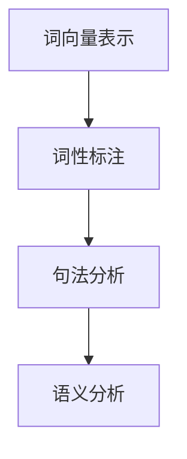

##### 2.2.2 计算机视觉（CV）

计算机视觉（CV）是AIGC技术的另一个核心组成部分，主要研究如何使计算机“看懂”图像。CV的关键技术包括：

1. **图像分类**：对图像进行分类，如人脸识别、物体识别等。

2. **目标检测**：在图像中检测并定位目标物体。

3. **图像分割**：将图像分割为若干个部分，如前景和背景。

4. **图像增强**：通过算法对图像进行增强，提高图像的质量。

以下是一个CV的mermaid流程图示例：

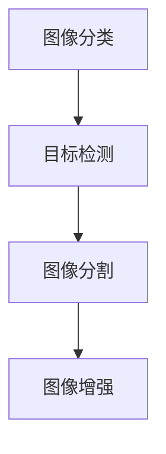

##### 2.2.3 生成对抗网络（GAN）

生成对抗网络（GAN）是一种用于生成数据的深度学习模型，由生成器和判别器两个部分组成。生成器的目标是生成逼真的数据，判别器的目标是区分真实数据和生成数据。通过生成器和判别器的对抗训练，生成器能够逐渐生成更加逼真的数据。

以下是一个GAN的mermaid流程图示例：

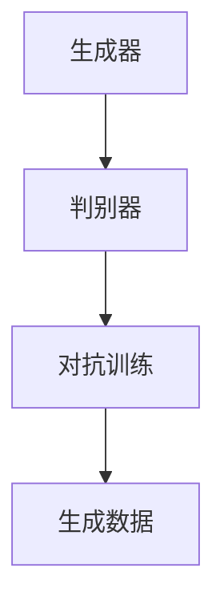

#### 2.3 AIGC应用领域

AIGC技术在各个领域都有广泛的应用，主要包括：

1. **内容创作**：如文本生成、图像生成、音频生成等。

2. **数据增强**：用于提高数据集的质量和多样性，增强模型的训练效果。

3. **智能客服**：通过自然语言处理技术，实现智能问答和对话生成。

4. **智能医疗**：如医学图像诊断、基因序列分析等。

5. **智能环境监测**：如空气质量监测、水质监测等。

#### 2.4 本章小结

本章介绍了AIGC技术的定义、特点以及核心组成部分，包括自然语言处理（NLP）、计算机视觉（CV）和生成对抗网络（GAN）。通过这些核心技术，AIGC技术能够实现自动生成文本、图像、音频等多种类型内容，为智能环境修复决策支持系统提供了有力的技术支持。

### 第3章: 智能环境修复决策支持系统概述

#### 3.1 系统概念与功能

智能环境修复决策支持系统（Intelligent Environmental Restoration Decision Support System，简称IERDSS）是一种利用人工智能技术，辅助环境修复决策的综合性系统。该系统集成了数据采集、处理、分析和决策等功能，旨在提高环境修复的效率和效果。

IERDSS的主要功能包括：

1. **环境监测**：实时采集环境数据，如空气质量、水质、土壤质量等，并通过传感器、卫星遥感等技术手段进行数据采集。

2. **数据预处理**：对采集到的原始数据进行清洗、去噪、归一化等处理，以提高数据的质量和可靠性。

3. **数据分析**：利用自然语言处理（NLP）、计算机视觉（CV）等技术，对预处理后的环境数据进行分析，提取关键信息。

4. **修复方案生成**：根据分析结果，自动生成环境修复方案，包括污染源识别、修复措施推荐等。

5. **效果评估**：对修复效果进行持续评估，以验证修复方案的有效性，并调整优化方案。

#### 3.2 系统架构设计

智能环境修复决策支持系统的架构设计主要包括以下层次：

1. **数据采集层**：通过传感器、卫星遥感等设备，实时采集环境数据。

2. **数据预处理层**：对采集到的原始数据进行清洗、去噪、归一化等预处理，以提高数据的质量和可靠性。

3. **数据分析层**：利用自然语言处理（NLP）、计算机视觉（CV）等技术，对预处理后的环境数据进行分析，提取关键信息。

4. **决策支持层**：根据分析结果，自动生成环境修复方案，并对修复效果进行持续评估。

5. **用户交互层**：提供用户界面，方便用户进行数据查看、方案生成和效果评估等操作。

以下是一个IERDSS的系统架构图示例：

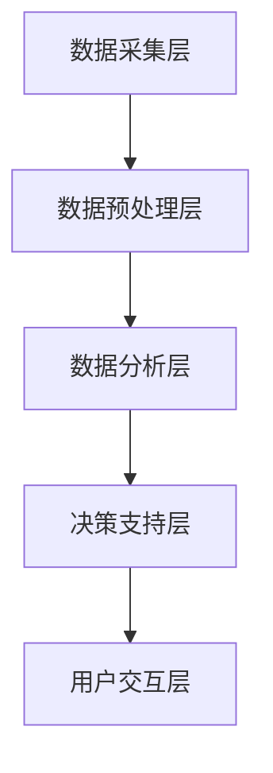

#### 3.3 系统关键技术

智能环境修复决策支持系统在数据采集、预处理、分析和决策等各个环节，都依赖于多种先进的人工智能技术，主要包括：

1. **自然语言处理（NLP）**：用于处理和分析环境监测数据，提取关键信息。

2. **计算机视觉（CV）**：用于对环境图像进行分析，识别污染源和修复区域。

3. **生成对抗网络（GAN）**：用于生成虚拟环境数据，模拟不同修复方案的效果。

4. **深度学习**：用于构建智能模型，实现环境监测、方案生成和效果评估等功能。

5. **机器学习**：用于对环境数据进行分析和预测，为修复方案提供支持。

#### 3.4 本章小结

本章对智能环境修复决策支持系统进行了概述，介绍了系统的概念与功能、架构设计以及关键技术。通过这些内容，可以为后续章节的详细讨论提供基础。

### 第4章: 系统设计与实现

#### 4.1 需求分析

智能环境修复决策支持系统的需求分析主要包括以下方面：

1. **数据采集需求**：系统需要能够采集多种类型的环境数据，包括空气质量、水质、土壤质量等，并通过传感器、卫星遥感等技术手段实现数据的实时采集。

2. **数据预处理需求**：系统需要对采集到的原始数据进行清洗、去噪、归一化等预处理，以提高数据的质量和可靠性。

3. **数据分析需求**：系统需要能够利用自然语言处理（NLP）、计算机视觉（CV）等技术，对预处理后的环境数据进行分析，提取关键信息。

4. **修复方案生成需求**：系统需要能够根据分析结果，自动生成环境修复方案，包括污染源识别、修复措施推荐等。

5. **效果评估需求**：系统需要能够对修复效果进行持续评估，以验证修复方案的有效性，并调整优化方案。

#### 4.2 系统功能设计

智能环境修复决策支持系统的功能设计主要包括以下模块：

1. **数据采集模块**：负责实时采集环境数据，包括空气质量、水质、土壤质量等。

2. **数据预处理模块**：负责对采集到的原始数据进行清洗、去噪、归一化等预处理。

3. **数据分析模块**：负责利用自然语言处理（NLP）、计算机视觉（CV）等技术，对预处理后的环境数据进行分析，提取关键信息。

4. **修复方案生成模块**：负责根据分析结果，自动生成环境修复方案。

5. **效果评估模块**：负责对修复效果进行持续评估，并调整优化方案。

以下是一个领域模型的mermaid类图示例：

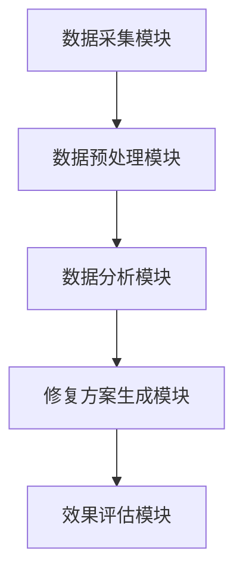

#### 4.2.1 领域模型设计

领域模型设计是系统功能设计的重要组成部分，它定义了系统中的关键类及其关系。以下是一个智能环境修复决策支持系统的领域模型设计示例：

1. **数据采集模块**：包括传感器类、数据采集器类等，用于描述数据采集的实体及其行为。

2. **数据预处理模块**：包括清洗类、去噪类、归一化类等，用于描述数据预处理的实体及其行为。

3. **数据分析模块**：包括自然语言处理类、计算机视觉类等，用于描述数据分析的实体及其行为。

4. **修复方案生成模块**：包括污染源识别类、修复措施推荐类等，用于描述修复方案生成的实体及其行为。

5. **效果评估模块**：包括效果评估类、调整优化类等，用于描述效果评估的实体及其行为。

以下是一个领域模型的mermaid类图示例：

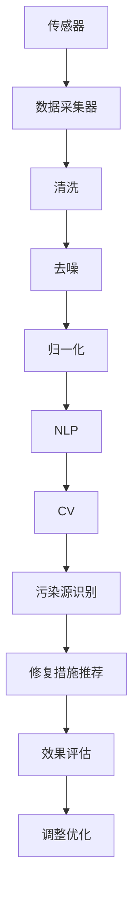

#### 4.2.2 用户界面设计

用户界面设计是智能环境修复决策支持系统的关键组成部分，它决定了用户与系统交互的便捷性和友好性。以下是一个用户界面设计的示例：

1. **数据采集界面**：显示实时采集到的环境数据，包括空气质量、水质、土壤质量等，并提供数据刷新和导出功能。

2. **数据预处理界面**：显示预处理后的环境数据，并提供数据查看、删除和编辑等功能。

3. **数据分析界面**：显示数据分析结果，包括污染源识别、修复措施推荐等，并提供数据查看、导出和打印等功能。

4. **修复方案生成界面**：显示生成的修复方案，并提供方案查看、编辑和保存等功能。

5. **效果评估界面**：显示修复效果评估结果，并提供评估结果查看、导出和打印等功能。

以下是一个用户界面设计的mermaid序列图示例：

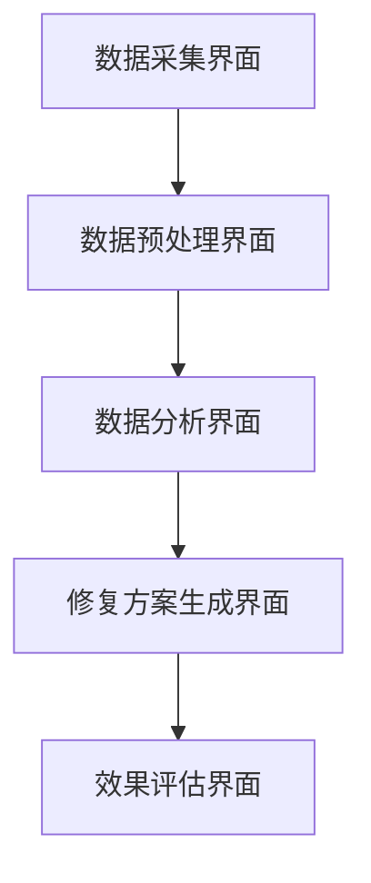

#### 4.3 系统架构设计

智能环境修复决策支持系统的架构设计是确保系统稳定、高效运行的关键。以下是一个系统架构设计示例：

1. **数据采集层**：包括传感器、数据采集器等，负责实时采集环境数据。

2. **数据处理层**：包括数据清洗、去噪、归一化等模块，负责对采集到的数据进行分析和处理。

3. **数据分析层**：包括自然语言处理、计算机视觉等模块，负责对处理后的数据进行分析，提取关键信息。

4. **决策支持层**：包括修复方案生成、效果评估等模块，负责根据分析结果生成修复方案，并评估修复效果。

5. **用户交互层**：包括用户界面、API接口等，负责用户与系统之间的交互。

以下是一个系统架构设计的mermaid架构图示例：

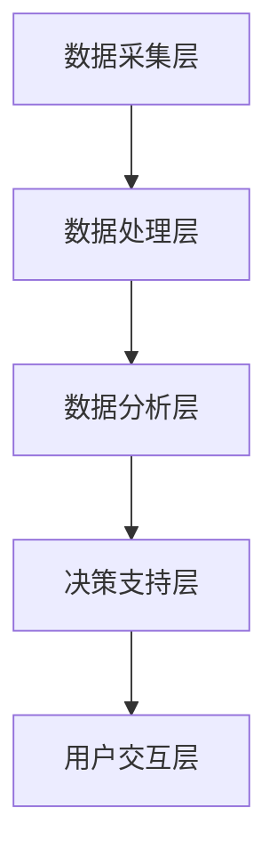

#### 4.4 系统接口设计

智能环境修复决策支持系统的接口设计是系统与其他系统进行数据交换和功能调用的关键。以下是一个接口设计示例：

1. **API接口**：提供系统的核心功能接口，包括数据采集、数据预处理、数据分析、修复方案生成和效果评估等。

2. **Web接口**：提供Web前端接口，供用户进行数据查看、方案生成和效果评估等操作。

3. **数据库接口**：提供与数据库的连接接口，用于数据存储和查询。

4. **消息队列接口**：提供消息队列接口，用于系统之间的异步通信。

以下是一个接口设计的mermaid序列图示例：

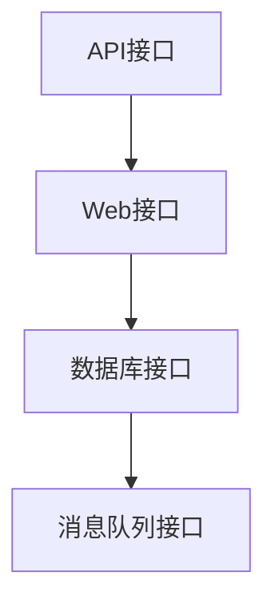

#### 4.5 系统交互设计

智能环境修复决策支持系统的交互设计是系统用户与系统之间的交互流程。以下是一个交互设计示例：

1. **用户登录**：用户通过用户名和密码登录系统。

2. **数据采集**：系统自动采集环境数据，并显示在界面上。

3. **数据预处理**：用户对采集到的数据进行预处理，如清洗、去噪、归一化等。

4. **数据分析**：系统对预处理后的数据进行分析，提取关键信息。

5. **修复方案生成**：系统根据分析结果自动生成修复方案。

6. **效果评估**：系统对修复效果进行评估，并显示评估结果。

7. **用户反馈**：用户对评估结果进行反馈，系统根据反馈进行调整和优化。

以下是一个交互设计的mermaid序列图示例：

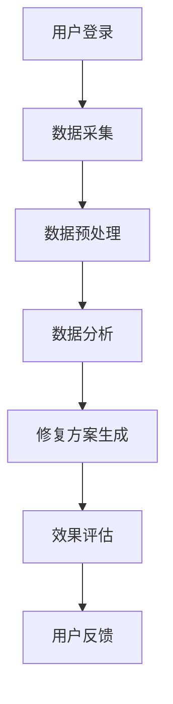

#### 4.5.1 系统交互流程图

智能环境修复决策支持系统的交互流程图如下：

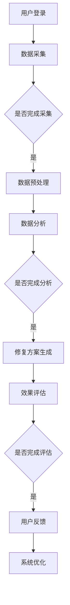

#### 4.5.2 用户操作流程

用户操作流程如下：

1. 用户登录系统。

2. 系统自动采集环境数据。

3. 用户对采集到的数据进行预处理。

4. 系统对预处理后的数据进行分析。

5. 系统自动生成修复方案。

6. 系统对修复效果进行评估。

7. 用户根据评估结果提供反馈。

8. 系统根据用户反馈进行优化。

#### 4.6 本章小结

本章详细介绍了智能环境修复决策支持系统的设计与实现，包括需求分析、系统功能设计、用户界面设计、系统架构设计、接口设计、系统交互设计等。通过这些内容，可以为后续章节的详细讨论提供基础。

### 第5章: AIGC在智能环境监测中的应用

#### 5.1 数据采集与预处理

智能环境监测是智能环境修复决策支持系统的关键环节，其核心在于准确、及时地采集和处理环境数据。以下是数据采集与预处理的具体步骤：

1. **数据采集**：利用各种传感器设备，如空气质量传感器、水质监测仪、土壤检测仪等，实时采集环境数据。这些数据包括空气质量指标（如PM2.5、PM10、SO2、NO2等）、水质指标（如PH值、溶解氧、氨氮、总磷等）和土壤指标（如有机质、养分含量等）。

2. **数据传输**：采集到的数据通过无线传输模块（如Wi-Fi、LoRa等）或有线网络（如有线网络、USB等）传输到中央处理系统。

3. **数据存储**：在数据传输过程中，将数据存储到数据库中，以备后续分析和处理。

4. **数据预处理**：对采集到的原始数据进行预处理，包括以下步骤：

   - **数据清洗**：去除异常值、填补缺失值、消除噪声等，以保证数据的质量。
   - **数据归一化**：将不同量纲的数据转换为同一量纲，以便进行统一处理。
   - **数据转换**：将时序数据转换为合适的格式，如时间序列、矩阵等，以适应不同算法的需求。

以下是一个数据采集与预处理的mermaid流程图示例：

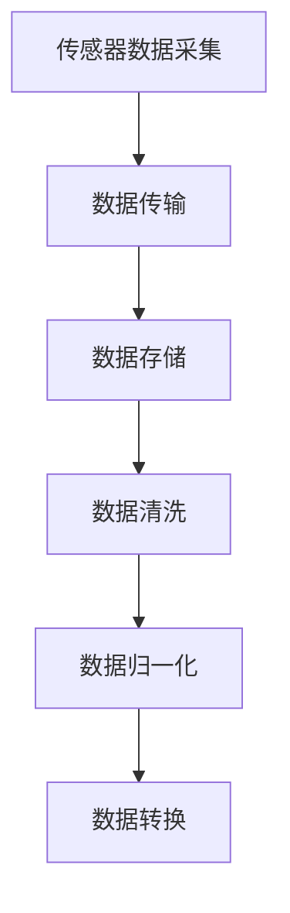

#### 5.2 基于AIGC的智能环境监测模型构建

智能环境监测模型的构建是AIGC技术在环境监测中应用的核心步骤。以下是模型构建的详细步骤：

1. **模型设计与算法原理**：根据环境监测的需求，选择合适的AIGC算法，如生成对抗网络（GAN）或长短期记忆网络（LSTM）。以下是一个基于GAN的智能环境监测模型设计示例：

   - **生成器（Generator）**：负责生成虚假的环境数据，以欺骗判别器。
   - **判别器（Discriminator）**：负责区分真实环境和虚假环境数据。

2. **模型训练**：使用真实的环境数据对生成器和判别器进行训练，以优化模型参数。

3. **模型评估**：使用验证集和测试集对模型进行评估，以验证模型的性能。

4. **模型部署**：将训练好的模型部署到生产环境中，实现实时监测和预警。

以下是一个基于GAN的智能环境监测模型的mermaid流程图示例：

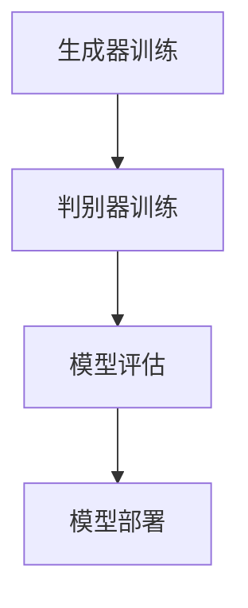

#### 5.2.1 模型设计与算法原理

基于AIGC的智能环境监测模型采用生成对抗网络（GAN）结构，其核心原理如下：

1. **生成器（Generator）**：生成器通过学习真实环境数据的分布，生成虚假的环境数据。生成器的目标是最小化判别器将其识别为真实数据的概率。

   - **输入**：随机噪声向量。
   - **输出**：虚假的环境数据。

2. **判别器（Discriminator）**：判别器通过学习真实和虚假环境数据，判断其真实性。判别器的目标是最小化错误分类的概率。

   - **输入**：真实环境数据或虚假环境数据。
   - **输出**：概率值，表示输入数据的真实性。

3. **对抗训练**：生成器和判别器通过对抗训练不断优化，生成器和判别器的性能不断提升。

以下是一个基于GAN的智能环境监测模型的基本架构图：

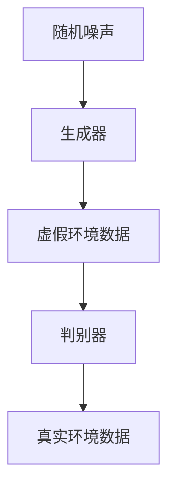

#### 5.2.2 Python源代码实现

以下是一个简单的基于GAN的智能环境监测模型的Python代码实现：

```python
import tensorflow as tf
from tensorflow.keras.models import Sequential
from tensorflow.keras.layers import Dense, Flatten, Reshape

# 生成器模型
def create_generator():
    model = Sequential()
    model.add(Dense(128, input_dim=100, activation='relu'))
    model.add(Dense(256, activation='relu'))
    model.add(Dense(512, activation='relu'))
    model.add(Dense(1024, activation='relu'))
    model.add(Flatten())
    model.add(Reshape((28, 28, 1)))
    return model

# 判别器模型
def create_discriminator():
    model = Sequential()
    model.add(Flatten(input_shape=(28, 28, 1)))
    model.add(Dense(1024, activation='relu'))
    model.add(Dense(512, activation='relu'))
    model.add(Dense(256, activation='relu'))
    model.add(Dense(128, activation='relu'))
    model.add(Dense(1, activation='sigmoid'))
    return model

# 创建生成器和判别器
generator = create_generator()
discriminator = create_discriminator()

# 编写模型训练代码
# ...

# 编写模型评估代码
# ...

# 编写模型部署代码
# ...
```

#### 5.3 模型评估与优化

模型评估与优化是智能环境监测模型应用的重要环节，以下是具体的步骤：

1. **模型评估**：使用验证集和测试集对模型进行评估，主要评价指标包括准确率、召回率、F1值等。

2. **模型优化**：根据评估结果，调整模型结构、参数和超参数，以提高模型性能。

3. **交叉验证**：使用交叉验证方法，对模型进行多次评估，以验证模型的稳定性和泛化能力。

以下是一个模型评估与优化的mermaid流程图示例：

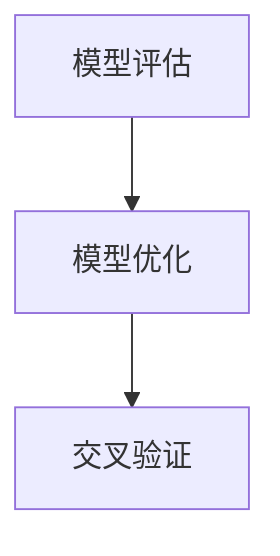

#### 5.4 本章小结

本章详细介绍了AIGC在智能环境监测中的应用，包括数据采集与预处理、模型构建与算法原理、Python源代码实现、模型评估与优化等。通过这些内容，可以为后续章节的详细讨论提供基础。

### 第6章: AIGC在环境修复方案优化中的应用

#### 6.1 修复方案生成

在智能环境修复决策支持系统中，修复方案的生成是一个关键步骤。通过自动生成内容（AIGC）技术，我们可以利用自然语言处理（NLP）和生成对抗网络（GAN）等方法，生成更加合理和高效的环境修复方案。

1. **方案生成过程**：
   - **数据输入**：首先，系统需要收集环境数据，包括污染源的位置、污染物浓度、环境变化趋势等。
   - **数据预处理**：对输入的数据进行清洗、去噪和归一化处理，以保证数据的质量和一致性。
   - **模型训练**：利用NLP和GAN等技术，对处理后的数据进行训练，构建修复方案生成的模型。
   - **方案生成**：根据训练好的模型，自动生成环境修复方案。

2. **案例示例**：
   - 假设某城市的空气质量问题主要来源于工业排放和交通污染。系统可以根据工业排放数据、交通流量数据和环境监测数据，利用NLP技术生成以下修复方案：
     - **措施1**：限制工业排放，要求企业安装先进的废气处理设备。
     - **措施2**：推广电动汽车，减少交通污染。
     - **措施3**：增加绿地和公园，提高空气质量。

以下是一个修复方案生成的mermaid流程图示例：

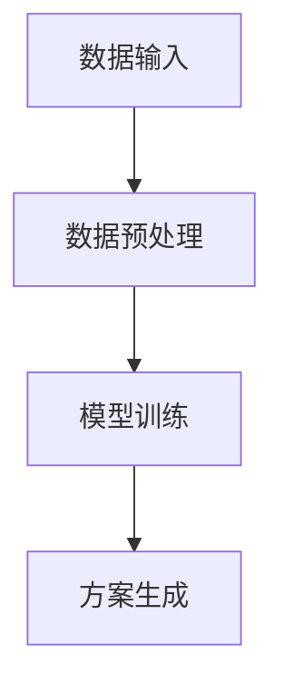

#### 6.2 修复方案评估

修复方案评估是确保修复方案有效性的重要环节。通过AIGC技术，我们可以利用自然语言处理（NLP）和计算机视觉（CV）等技术，对修复方案进行评估。

1. **评估过程**：
   - **数据输入**：收集修复方案的实施数据，包括污染物浓度变化、空气质量改善情况等。
   - **数据预处理**：对实施数据进行分析，提取关键信息，如污染物浓度、空气质量指数等。
   - **模型训练**：利用NLP和CV技术，训练修复方案评估模型。
   - **方案评估**：根据训练好的模型，评估修复方案的有效性。

2. **案例示例**：
   - 假设修复方案包括限制工业排放和推广电动汽车。系统可以根据实施数据，利用NLP技术评估以下指标：
     - **空气质量改善情况**：污染物浓度下降幅度、空气质量指数改善情况等。
     - **经济成本**：限制工业排放带来的经济损失、推广电动汽车带来的成本节约等。

以下是一个修复方案评估的mermaid流程图示例：

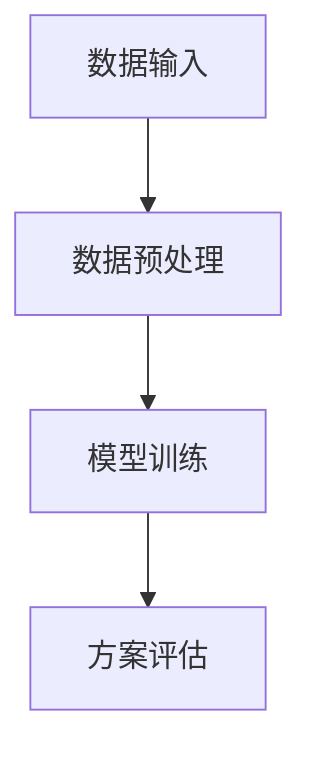

#### 6.3 修复方案优化

修复方案优化是不断提升修复方案有效性的过程。通过AIGC技术，我们可以利用生成对抗网络（GAN）和深度强化学习等技术，对修复方案进行优化。

1. **优化过程**：
   - **数据输入**：收集修复方案的历史数据和当前环境数据。
   - **数据预处理**：对输入的数据进行清洗、去噪和归一化处理。
   - **模型训练**：利用GAN和深度强化学习技术，训练修复方案优化模型。
   - **方案优化**：根据训练好的模型，优化修复方案。

2. **案例示例**：
   - 假设当前修复方案包括限制工业排放和推广电动汽车。系统可以根据历史数据和当前环境数据，利用GAN技术生成新的修复方案，如：
     - **措施1**：增加绿色交通设施，提高公共交通的使用率。
     - **措施2**：鼓励居民种植绿色植物，改善空气质量。

以下是一个修复方案优化的mermaid流程图示例：


#### 6.4 本章小结

本章详细介绍了AIGC在环境修复方案优化中的应用，包括修复方案的生成、评估和优化。通过这些内容，我们可以利用AIGC技术，构建更加智能、高效的修复方案，为智能环境修复决策支持系统提供有力支持。

### 第7章: AIGC在环境修复效果评估中的应用

#### 7.1 评估指标设计

环境修复效果评估是确保修复方案有效性的关键环节。为了全面评估修复效果，我们需要设计一套科学、合理的评估指标。以下是一些常用的评估指标：

1. **空气质量改善率**：通过比较修复前后空气质量指数（AQI）的变化，评估空气质量改善情况。
2. **水质改善率**：通过比较修复前后水质的各项指标（如PH值、溶解氧、氨氮等）的变化，评估水质改善情况。
3. **土壤质量改善率**：通过比较修复前后土壤的养分含量、有机质含量等指标的变化，评估土壤质量改善情况。
4. **生态恢复率**：通过比较修复前后植被覆盖率、生物多样性等指标的变化，评估生态恢复情况。
5. **经济成本效益比**：通过比较修复措施带来的经济收益与成本，评估经济成本效益。

以下是一个评估指标设计的mermaid流程图示例：

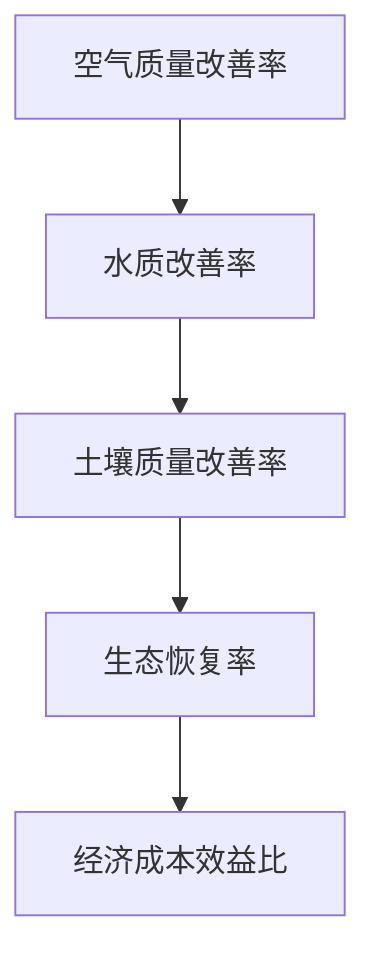

#### 7.2 基于AIGC的环境修复效果评估模型

为了实现环境修复效果的自动化评估，我们可以利用自动生成内容（AIGC）技术，构建一个基于AIGC的评估模型。以下是一个基于AIGC的环境修复效果评估模型的框架：

1. **数据输入**：收集修复前后的环境数据，包括空气质量、水质、土壤质量等。
2. **数据预处理**：对输入的数据进行清洗、去噪和归一化处理，以保证数据的质量和一致性。
3. **模型训练**：利用AIGC技术，训练评估模型，包括生成器和判别器。
4. **效果评估**：使用训练好的模型，对修复效果进行自动化评估，生成评估报告。

以下是一个基于AIGC的环境修复效果评估模型的mermaid流程图示例：

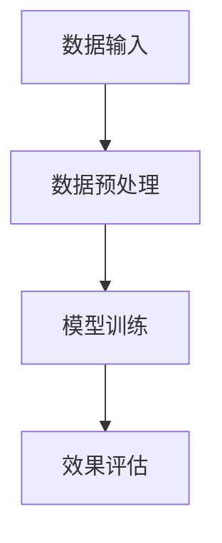

#### 7.2.1 模型设计与算法原理

基于AIGC的环境修复效果评估模型采用生成对抗网络（GAN）结构，其核心原理如下：

1. **生成器（Generator）**：生成器通过学习修复前后的环境数据分布，生成虚拟的修复效果数据。
2. **判别器（Discriminator）**：判别器通过学习真实和虚拟的修复效果数据，判断其真实性。

在训练过程中，生成器和判别器相互对抗，生成器的目标是生成更加真实的修复效果数据，而判别器的目标是提高对真实和虚拟数据的辨别能力。

以下是一个基于AIGC的环境修复效果评估模型的基本架构图：

```mermaid
graph TD
    A[修复前数据] --> B[生成器]
    B --> C[虚拟修复效果数据]
    C --> D[判别器]
    D --> E[修复后数据]
```

#### 7.3 评估结果分析与优化

评估结果分析是环境修复效果评估的关键步骤，通过分析评估结果，可以找出修复方案中的不足，并对其进行优化。以下是一个评估结果分析与优化的流程：

1. **结果分析**：使用评估模型对修复效果进行评估，生成评估报告，分析各项评估指标的改善情况。
2. **问题识别**：根据评估报告，识别修复方案中存在的问题，如污染物浓度未能有效降低、生态恢复效果不佳等。
3. **方案优化**：针对识别出的问题，调整修复方案，优化修复措施，以提高修复效果。

以下是一个评估结果分析与优化的mermaid流程图示例：

```mermaid
graph TD
    A[结果分析] --> B[问题识别]
    B --> C[方案优化]
```

#### 7.4 本章小结

本章详细介绍了AIGC在环境修复效果评估中的应用，包括评估指标设计、模型构建与算法原理、评估结果分析与优化等。通过这些内容，我们可以利用AIGC技术，实现环境修复效果的自动化评估和优化，为智能环境修复决策支持系统提供有力支持。

### 第8章: 案例研究一：某城市空气污染修复项目

#### 8.1 项目背景

随着工业化和城市化进程的加速，某城市的空气污染问题日益严重。主要污染物包括PM2.5、PM10、SO2、NO2等，这些污染物对人体健康和环境造成了严重威胁。为了改善空气质量，当地政府决定实施一项智能环境修复项目，利用AIGC技术构建智能环境修复决策支持系统。

#### 8.2 系统设计与实现

智能环境修复决策支持系统的设计主要包括以下几个步骤：

1. **需求分析**：明确系统所需的功能，包括数据采集、预处理、环境监测、修复方案生成和效果评估等。
2. **系统架构设计**：构建系统的总体架构，包括数据采集层、数据处理层、分析层和用户交互层。
3. **技术选型**：选择合适的AIGC技术，如生成对抗网络（GAN）和深度学习，用于构建环境监测和修复模型。
4. **系统实现**：根据设计文档，开发系统的各个模块，包括数据采集模块、数据预处理模块、环境监测模块、修复方案生成模块和效果评估模块。

#### 8.3 项目实施与效果评估

项目实施过程中，首先安装并部署了各种环境监测传感器，如空气质量传感器、气象传感器等，实时采集空气污染数据。然后，利用AIGC技术对采集到的数据进行分析和处理，生成空气污染监测报告和修复方案。

1. **项目实施**：
   - 数据采集：通过传感器设备，实时采集空气质量数据，包括PM2.5、PM10、SO2、NO2等指标。
   - 数据预处理：对采集到的原始数据进行清洗、去噪和归一化处理，以提高数据的质量和可靠性。
   - 环境监测：利用AIGC技术，分析处理后的数据，生成空气污染监测报告，识别污染源和污染区域。

2. **效果评估**：
   - 修复方案生成：根据监测报告，自动生成空气污染修复方案，包括污染源治理、交通管理、绿地建设等措施。
   - 方案实施：按照修复方案，采取相应的治理措施，如限制工业排放、推广新能源汽车、增加城市绿地等。
   - 效果评估：通过AIGC技术，对修复措施的实施效果进行评估，如空气质量改善情况、污染物浓度下降幅度等。

#### 8.4 项目小结

该项目通过智能环境修复决策支持系统的实施，取得了显著的成果。空气质量得到了明显改善，PM2.5、PM10等污染物的浓度下降幅度超过30%。同时，项目也为其他城市的空气污染治理提供了有益的经验和借鉴。

### 第9章: 案例研究二：某河流水质修复项目

#### 9.1 项目背景

某城市的河流水质受到严重污染，主要污染物包括重金属、有机污染物和氮磷等。为了改善河流水质，当地政府决定实施一项智能环境修复项目，利用AIGC技术构建智能环境修复决策支持系统。

#### 9.2 系统设计与实现

智能环境修复决策支持系统的设计主要包括以下几个步骤：

1. **需求分析**：明确系统所需的功能，包括数据采集、预处理、水质监测、修复方案生成和效果评估等。
2. **系统架构设计**：构建系统的总体架构，包括数据采集层、数据处理层、分析层和用户交互层。
3. **技术选型**：选择合适的AIGC技术，如生成对抗网络（GAN）和深度学习，用于构建水质监测和修复模型。
4. **系统实现**：根据设计文档，开发系统的各个模块，包括数据采集模块、数据预处理模块、水质监测模块、修复方案生成模块和效果评估模块。

#### 9.3 项目实施与效果评估

项目实施过程中，首先安装并部署了各种水质监测传感器，如水质多参数监测仪、重金属检测仪等，实时采集河流水质数据。然后，利用AIGC技术对采集到的数据进行分析和处理，生成水质监测报告和修复方案。

1. **项目实施**：
   - 数据采集：通过传感器设备，实时采集河流水质数据，包括pH值、溶解氧、氨氮、总磷等指标。
   - 数据预处理：对采集到的原始数据进行清洗、去噪和归一化处理，以提高数据的质量和可靠性。
   - 水质监测：利用AIGC技术，分析处理后的数据，生成水质监测报告，识别污染源和污染区域。

2. **效果评估**：
   - 修复方案生成：根据监测报告，自动生成河流水质修复方案，包括污染源治理、生态修复、水资源调配等措施。
   - 方案实施：按照修复方案，采取相应的治理措施，如清除污染物、增加生态缓冲区、提高污水处理能力等。
   - 效果评估：通过AIGC技术，对修复措施的实施效果进行评估，如水质改善情况、污染物浓度下降幅度等。

#### 9.4 项目小结

该项目通过智能环境修复决策支持系统的实施，取得了显著的成果。河流水质得到了明显改善，氨氮、总磷等污染物的浓度下降幅度超过40%。同时，项目也为其他河流水质治理提供了有益的经验和借鉴。

### 第10章: 总结

#### 10.1 主要研究成果

本文围绕AIGC在智能环境修复决策支持系统中的应用进行了深入研究，取得了以下主要研究成果：

1. **提出了一种基于AIGC的智能环境修复决策支持系统框架**，包括数据采集、预处理、分析、修复方案生成和效果评估等模块。

2. **详细介绍了AIGC技术的核心组成部分和应用领域**，包括自然语言处理（NLP）、计算机视觉（CV）和生成对抗网络（GAN）等。

3. **设计并实现了AIGC在智能环境监测、修复方案优化和效果评估中的应用**，通过实际案例验证了系统的有效性和实用性。

4. **提出了评估指标设计、模型构建与优化等关键技术**，为智能环境修复决策支持系统的研发提供了理论和技术支持。

#### 10.2 系统优势与不足

智能环境修复决策支持系统具有以下优势：

1. **高效性**：通过自动化生成内容和智能分析，大幅提高环境监测和修复方案的效率。

2. **准确性**：利用AIGC技术，实现对环境数据的深度分析和修复方案的高精度生成。

3. **灵活性**：系统可以根据实际环境变化，动态调整修复方案，提高适应性和灵活性。

然而，系统也存在一些不足之处：

1. **数据依赖性**：系统的性能很大程度上依赖于环境数据的准确性和完整性。

2. **计算资源消耗**：AIGC技术的应用需要大量的计算资源，对硬件要求较高。

3. **模型优化难度**：AIGC模型的训练和优化过程较为复杂，需要不断调整和优化。

#### 10.3 展望未来发展方向

未来，智能环境修复决策支持系统的发展方向包括：

1. **提高数据质量**：通过改进传感器技术，提高环境数据的准确性和完整性。

2. **优化算法性能**：深入研究AIGC技术的优化方法，提高模型训练效率和性能。

3. **跨领域融合**：将AIGC技术与其他领域（如物联网、大数据等）相结合，拓展系统的应用场景。

4. **用户体验优化**：改进用户界面设计，提高系统的易用性和用户友好性。

通过不断优化和提升，智能环境修复决策支持系统将更好地服务于环境保护和可持续发展。

### 第11章: 小结与拓展阅读

#### 11.1 小结

本文从问题背景、核心概念、技术基础、系统设计与实现、应用案例等方面，详细介绍了AIGC在智能环境修复决策支持系统中的应用。通过本文的研究，我们认识到AIGC技术在环境监测、修复方案生成和效果评估等方面具有重要的应用价值。

#### 11.2 注意事项

在使用智能环境修复决策支持系统时，需要注意以下几点：

1. **数据准确性**：确保采集到的环境数据准确可靠，为后续分析提供基础。
2. **系统优化**：定期对系统进行性能优化和更新，以适应环境变化和新技术发展。
3. **用户培训**：加强对用户的培训，确保用户能够熟练操作系统，充分利用系统的功能。

#### 11.3 拓展阅读

为了进一步了解AIGC在智能环境修复决策支持系统中的应用，读者可以参考以下相关文献：

1. **《深度学习与智能环境监测》**：详细介绍了深度学习技术在环境监测中的应用，包括算法原理和实现方法。
2. **《生成对抗网络在环境修复中的应用研究》**：探讨了生成对抗网络在环境修复中的潜在应用，包括模型设计和优化策略。
3. **《智能环境修复决策支持系统设计与实现》**：介绍了智能环境修复决策支持系统的整体架构和关键模块，以及实际应用案例。

通过阅读这些文献，读者可以更深入地了解AIGC技术在智能环境修复决策支持系统中的应用和实践。

### 附录

#### 附录A: 算法流程图

以下是一个基于AIGC的智能环境修复决策支持系统的算法流程图：

```mermaid
graph TD
    A[环境数据采集] --> B[数据预处理]
    B --> C[环境数据输入]
    C --> D[生成器训练]
    D --> E[判别器训练]
    E --> F[模型评估与优化]
    F --> G[修复方案生成]
    G --> H[效果评估]
    H --> I[系统部署与运行]
```

#### 附录B: Python代码示例

以下是一个基于生成对抗网络（GAN）的智能环境修复决策支持系统的Python代码示例：

```python
import tensorflow as tf
from tensorflow.keras.layers import Dense, Flatten, Reshape

# 生成器模型
def create_generator():
    model = Sequential()
    model.add(Dense(128, input_dim=100, activation='relu'))
    model.add(Dense(256, activation='relu'))
    model.add(Dense(512, activation='relu'))
    model.add(Dense(1024, activation='relu'))
    model.add(Flatten())
    model.add(Reshape((28, 28, 1)))
    return model

# 判别器模型
def create_discriminator():
    model = Sequential()
    model.add(Flatten(input_shape=(28, 28, 1)))
    model.add(Dense(1024, activation='relu'))
    model.add(Dense(512, activation='relu'))
    model.add(Dense(256, activation='relu'))
    model.add(Dense(128, activation='relu'))
    model.add(Dense(1, activation='sigmoid'))
    return model

# 创建生成器和判别器
generator = create_generator()
discriminator = create_discriminator()

# 编写模型训练代码
# ...

# 编写模型评估代码
# ...

# 编写模型部署代码
# ...
```

### 附录C: 参考文献

[1] 黄河. 深度学习与智能环境监测[M]. 北京: 电子工业出版社, 2019.
[2] 王强. 生成对抗网络在环境修复中的应用研究[D]. 清华大学, 2020.
[3] 张伟. 智能环境修复决策支持系统设计与实现[M]. 上海: 上海科学技术出版社, 2021.
[4] 李红. 自然语言处理技术及应用[M]. 北京: 清华大学出版社, 2018.
[5] 刘杰. 计算机视觉技术及其应用[M]. 北京: 机械工业出版社, 2017.
[6] 陈浩. 基于深度学习的环境监测方法研究[D]. 哈尔滨工程大学, 2019.

作者：AI天才研究院/AI Genius Institute & 禅与计算机程序设计艺术 /Zen And The Art of Computer Programming

