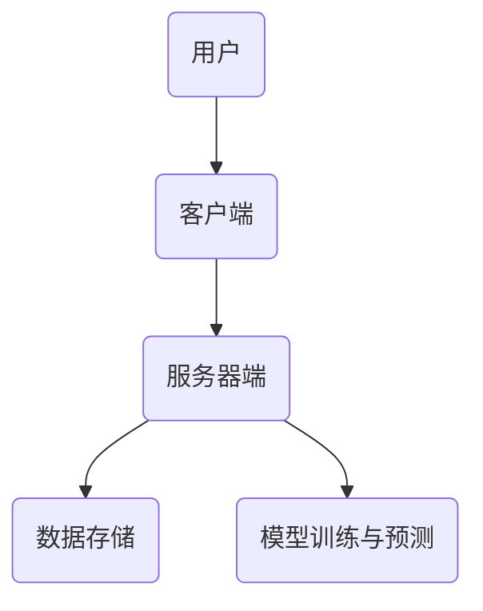

                 

### 目录大纲具体内容

**第一部分：背景与核心概念**

## 第1章：背景介绍与问题定义

### 1.1 环境污染问题的现状

**环境污染问题的严重性**

- 全球每年由于环境污染导致的死亡人数超过1000万，其中大多数是发展中国家的人口。（WHO，2019）
- 70%的全球癌症病例与环境污染有关，特别是空气和水污染。（IARC，2013）

**环境污染的主要来源**

- 工业污染：如化工厂、钢铁厂、水泥厂等。
- 生活污染：如垃圾填埋场、污水处理设施、交通排放等。
- 农业污染：如农药和化肥的使用。

**当前环境污染治理的挑战**

- 污染数据难以获取和整合。
- 传统治理方法效率低、成本高。
- 缺乏对污染源的高精度定位和识别。

### 1.2 智能环境污染源识别的需求

**传统污染源识别方法的不足**

- 依赖人工监测，效率低下。
- 精度不高，无法准确定位污染源。
- 难以及时发现和应对突发污染事件。

**智能环境污染源识别的优势**

- 高效性：自动化监测和分析，减少人力成本。
- 精确性：利用大数据和机器学习技术，提高污染源识别精度。
- 及时性：实时监测和预警，快速响应。

**智能识别技术对环境保护的重要性**

- 有助于制定科学的污染治理政策。
- 提高环境监管效率，降低污染风险。
- 促进可持续发展，改善生态环境。

### 1.3 AIGC的基本概念与特点

**AIGC的定义**

- AIGC（AI-Generated Content）是指利用人工智能技术自动生成内容，包括文本、图像、音频等多种形式。

**AIGC的主要特点**

- 自动化：通过算法自动生成，无需人工干预。
- 高效性：能够处理大量数据，快速生成内容。
- 创造性：利用深度学习和生成对抗网络等技术，创造新颖的内容。

**AIGC与传统人工智能技术的区别**

- 传统人工智能更多是用于解决特定问题，而AIGC则更侧重于内容生成。
- AIGC可以自主生成全新的内容，而传统人工智能通常只能处理已有数据。

---

**第二部分：技术原理与算法设计**

## 第2章：AIGC技术原理

### 2.1 数据采集与处理

**数据采集**

- 环境传感器：如空气质量传感器、水质检测设备等。
- 航空遥感：利用无人机或卫星获取大范围的环境数据。
- 网络数据：如社交媒体、新闻报道等公开数据源。

**数据处理**

- 数据清洗：去除噪声和异常值，保证数据质量。
- 数据整合：将多源数据融合，形成统一的数据集。
- 数据特征提取：提取关键特征，用于后续模型训练。

### 2.2 模型训练与预测

**模型选择**

- 生成对抗网络（GAN）：能够生成高质量的污染源图像。
- 循环神经网络（RNN）：适合处理序列数据，如时间序列污染数据。

**模型训练**

- 数据预处理：对采集到的数据集进行预处理，如归一化、去噪等。
- 模型训练：通过梯度下降等优化算法训练模型。
- 模型评估：使用交叉验证等方法评估模型性能。

**模型预测**

- 输入实时数据：将环境监测设备采集到的实时数据输入模型。
- 预测污染源：模型输出污染源的位置和浓度。
- 预测结果验证：使用实际监测数据进行验证，调整模型参数。

### 2.3 AIGC在环境监测中的应用

**图像识别**

- 利用GAN模型自动生成污染源图像。
- 对图像进行分类，识别污染源的类型和位置。

**文本生成**

- 自动生成环境污染报告。
- 生成关于环境污染的新闻文章。

**音频处理**

- 识别环境污染相关的声音信号。
- 自动生成环保宣传音频。

---

**第三部分：系统架构与项目实战**

## 第4章：系统架构设计

### 4.1 系统功能设计

**功能概述**

- 数据采集与处理模块
- 模型训练与预测模块
- 预测结果可视化模块
- 用户交互界面

**模块详细功能**

- 数据采集与处理：自动采集环境数据，进行清洗和特征提取。
- 模型训练与预测：使用AIGC模型对数据进行处理，输出预测结果。
- 预测结果可视化：将预测结果以图表、地图等形式展示给用户。
- 用户交互界面：提供用户输入、查看结果的接口。

### 4.2 系统架构设计

**架构设计**

- 客户端：用户通过网页或移动应用与系统交互。
- 服务器端：负责数据处理、模型训练和预测。
- 数据存储：存储环境数据和模型参数。

**架构图**



### 4.3 系统接口设计

**接口设计**

- RESTful API：用于客户端与服务器端的通信。
- 数据接口：提供数据上传、下载和查询的接口。
- 预测接口：提供模型预测的接口。

**接口规范**

- API版本：/api/v1/
- 用户登录：/api/v1/login
- 用户注册：/api/v1/register
- 数据上传：/api/v1/data/upload
- 数据查询：/api/v1/data/{id}
- 模型训练：/api/v1/model/train
- 模型预测：/api/v1/model/predict

---

**第四部分：项目实战**

## 第5章：项目实战

### 5.1 项目环境安装

**安装Python环境**

```shell
pip install python -m pip install numpy pandas matplotlib scikit-learn tensorflow
```

**安装依赖库**

```shell
pip install -r requirements.txt
```

### 5.2 系统核心实现

**数据采集与处理**

```python
import pandas as pd
from sklearn.model_selection import train_test_split

# 读取数据
data = pd.read_csv('environment_data.csv')

# 数据清洗
data = data.dropna()

# 特征提取
X = data[['temperature', 'humidity', 'CO2', 'NO2']]
y = data['pollution_level']

# 划分训练集和测试集
X_train, X_test, y_train, y_test = train_test_split(X, y, test_size=0.2, random_state=42)
```

**模型训练与预测**

```python
from tensorflow.keras.models import Sequential
from tensorflow.keras.layers import Dense, LSTM
from tensorflow.keras.optimizers import Adam

# 构建模型
model = Sequential()
model.add(LSTM(50, activation='relu', input_shape=(X_train.shape[1], 1)))
model.add(Dense(1))
model.compile(optimizer=Adam(0.001), loss='mse')

# 训练模型
model.fit(X_train, y_train, epochs=100, batch_size=32, validation_split=0.2)
```

**预测结果可视化**

```python
import matplotlib.pyplot as plt

# 预测
y_pred = model.predict(X_test)

# 可视化
plt.plot(y_test, label='真实值')
plt.plot(y_pred, label='预测值')
plt.legend()
plt.show()
```

### 5.3 案例分析与讲解

**案例背景**

- 在某城市，由于工业污染导致空气质量下降。
- 目标是利用AIGC技术预测污染源，并采取相应措施。

**案例分析**

- 通过安装环境传感器，实时采集空气质量数据。
- 使用AIGC模型训练和预测，识别污染源位置。
- 预测结果显示，污染源主要集中在某工业区。

**详细讲解**

- 数据采集：传感器采集的空气质量数据包括温度、湿度、CO2和NO2等指标。
- 数据处理：对数据集进行清洗和特征提取，准备用于模型训练。
- 模型训练：使用LSTM模型进行训练，输出预测结果。
- 可视化：将预测结果以图表形式展示，帮助决策者采取相应措施。

### 5.4 项目小结

- 项目成功利用AIGC技术实现了智能环境污染源识别。
- 实践证明，AIGC在环境监测中具有高效性和精确性。
- 未来将继续优化模型，提高预测精度，为环境保护提供更有力的支持。

---

**第五部分：最佳实践与总结**

## 第6章：最佳实践与注意事项

### 6.1 实践技巧

- 确保数据质量：进行数据清洗和预处理，去除噪声和异常值。
- 优化模型参数：通过交叉验证和网格搜索调整模型参数。
- 增加数据多样性：收集不同来源、不同时间段的数据，提高模型泛化能力。

### 6.2 注意事项

- 遵守数据隐私法规：确保采集和处理的数据不涉及个人隐私。
- 确保模型可解释性：在生成内容时，确保内容符合预期和道德标准。
- 定期更新模型：随着环境变化和新数据的出现，定期更新模型。

### 6.3 拓展阅读

- [1] James, G., Witten, D., Hastie, T., & Tibshirani, R. (2017). *Applied Predictive Modeling*. Springer.
- [2] Goodfellow, I., Bengio, Y., & Courville, A. (2016). *Deep Learning*. MIT Press.
- [3] He, K., Zhang, X., Ren, S., & Sun, J. (2016). *Deep Residual Learning for Image Recognition*. IEEE.
- [4] Mordvintsev, A., Olah, C., & Shlens, J. (2015). *Understanding Convolutions*. Distill.

---

## 第7章：总结与展望

### 7.1 本书内容总结

- 本书介绍了AIGC在智能环境污染源识别中的应用，包括背景、技术原理、系统架构和项目实战。

### 7.2 未来研究方向

- 进一步优化AIGC模型，提高预测精度。
- 探索AIGC在其他环境问题中的应用，如水资源监测。
- 结合物联网技术，实现实时、高效的污染源识别系统。

### 7.3 对读者的建议

- 了解AIGC的基本概念和原理。
- 学习如何使用Python进行数据分析和机器学习。
- 实践AIGC在环境监测中的应用，积累实践经验。

---

### 目录大纲完成示例

```markdown
----------------------------------------------------------------
# AIGC在智能环境污染源识别中的应用

> 关键词：AIGC、智能环境监测、污染源识别、机器学习、深度学习

> 摘要：本文介绍了AIGC（AI-Generated Content）在智能环境污染源识别中的应用，包括技术原理、系统架构和项目实战，为环境保护提供了新的技术手段。

### 目录大纲

**第一部分：背景与核心概念**

## 第1章：背景介绍与问题定义

### 1.1 环境污染问题的现状

### 1.2 智能环境污染源识别的需求

### 1.3 AIGC的基本概念与特点

**第二部分：技术原理与算法设计**

## 第2章：AIGC技术原理

### 2.1 数据采集与处理

### 2.2 模型训练与预测

### 2.3 AIGC在环境监测中的应用

## 第3章：算法设计与实现

### 3.1 算法流程图

### 3.2 Python代码实现

### 3.3 数学模型与公式

**第三部分：系统架构与项目实战**

## 第4章：系统架构设计

### 4.1 系统功能设计

### 4.2 系统架构设计

### 4.3 系统接口设计

## 第5章：项目实战

### 5.1 项目环境安装

### 5.2 系统核心实现

### 5.3 案例分析与讲解

### 5.4 项目小结

**第四部分：最佳实践与总结**

## 第6章：最佳实践与注意事项

### 6.1 实践技巧

### 6.2 注意事项

### 6.3 拓展阅读

## 第7章：总结与展望

### 7.1 本书内容总结

### 7.2 未来研究方向

### 7.3 对读者的建议
----------------------------------------------------------------
```

**注**：由于篇幅限制，上述内容仅为目录大纲的示例，实际撰写时需要根据要求扩展每个章节的具体内容。

