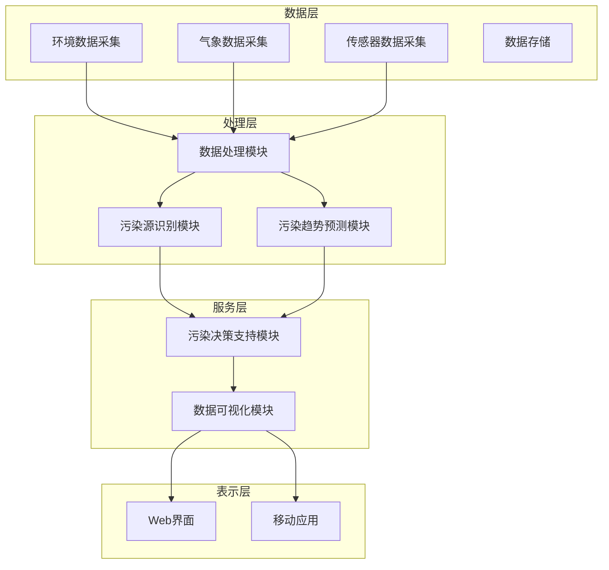
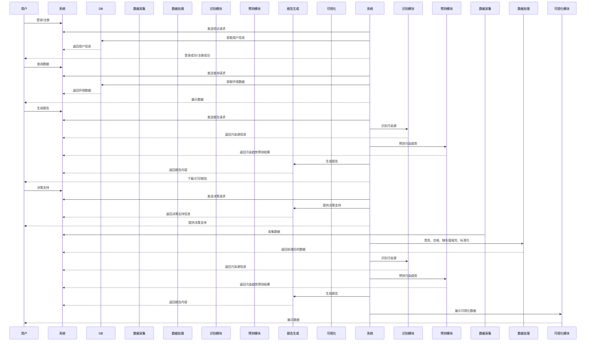

                 

### 概述：AIGC与智能环境污染预警的关系

AIGC（AI-Generated Content）是一种利用人工智能技术生成内容的方法，它涵盖了从文本、图像到音频、视频等多种媒体形式。AIGC技术通过深度学习、自然语言处理（NLP）、计算机视觉等技术，能够自动生成、优化和丰富内容。在智能环境污染预警领域，AIGC技术展现出极大的应用潜力。

智能环境污染预警是利用现代传感器技术、数据处理技术以及机器学习技术，对环境污染进行实时监测、预测和预警的一种手段。其目的是通过及时准确地检测到环境污染问题，提前预警，采取有效的应对措施，减少环境污染对生态系统和人类健康的影响。

AIGC在智能环境污染预警中的应用，主要体现在以下几个方面：

1. **污染源识别**：AIGC可以通过分析环境数据，识别出污染源的位置和类型，从而有针对性地进行治理。

2. **污染趋势预测**：AIGC可以根据历史数据和实时数据，预测未来的污染趋势，为环境保护部门提供决策支持。

3. **决策支持**：AIGC生成的报告和分析结果，可以辅助决策者制定更有效的环境保护策略。

4. **优化预警系统**：AIGC能够自动优化预警系统的参数和算法，提高预警系统的准确性和响应速度。

因此，AIGC在智能环境污染预警中的应用，不仅可以提高预警系统的智能化水平，还能提升环境治理的效率和效果。在接下来的章节中，我们将详细探讨AIGC在智能环境污染预警中的应用原理、技术实现和实际案例。通过逐步分析，我们将揭示AIGC如何助力环境治理，实现智能化的环保目标。

### 问题背景

#### 环境污染现状与挑战

环境污染是当今世界面临的一项重大挑战。据联合国环境规划署（UNEP）统计，全球每年因环境污染造成的经济损失超过4万亿美元，约占全球国内生产总值的4%。其中，空气污染、水污染和土壤污染是最为严重的三大污染类型。

首先，空气污染问题在全球范围内尤为突出。以中国的北京市为例，空气污染问题长期困扰着当地居民。根据2019年的数据，北京市的PM2.5年均浓度为57微克/立方米，超过世界卫生组织（WHO）的推荐标准（10微克/立方米）5.7倍。这不仅对人们的健康造成了严重影响，还导致了大量医疗费用和损失。

其次，水污染也是一个严峻的问题。全球约有12亿人口无法获得安全的饮用水，其中4.3亿人口依赖于污染水源。例如，印度的恒河曾因严重污染而被称为“有毒河流”。尽管印度政府投入了大量资金进行治理，但恒河的水质依然未达到饮用水标准，严重威胁着沿岸居民的健康。

最后，土壤污染问题同样不容忽视。许多工业污染物如重金属、有机污染物等进入了土壤，导致土壤质量下降，影响了农作物的产量和质量，甚至威胁到了食物链的安全。

#### 智能化环境污染预警的需求

面对日益严重的环境污染问题，传统的监测和治理手段已无法满足现代环境治理的需求。因此，智能化环境污染预警成为了一种迫切的需求。智能化预警系统可以通过实时监测、数据分析、预测模型等技术手段，对环境污染问题进行及时的发现和预警，从而采取有效的应对措施。

首先，智能化预警系统可以实现环境污染的实时监测。利用传感器网络，可以实时采集空气、水和土壤中的污染物数据，并通过无线通信技术将数据传输到数据中心进行处理。这种实时性使得预警系统能够迅速响应环境变化，提前预警潜在的环境污染事件。

其次，智能化预警系统可以提高监测的准确性。传统的污染监测方法往往存在人为误差，而智能化预警系统通过机器学习和大数据分析技术，可以从海量数据中提取有效的特征信息，提高监测的准确性和可靠性。

此外，智能化预警系统还可以提供决策支持。通过对环境数据的分析和预测，预警系统可以为环境保护部门提供科学依据，制定更加有效的环境保护政策和措施。

#### AIGC在智能化环境污染预警中的应用前景

AIGC技术的引入为智能化环境污染预警带来了新的机遇。AIGC技术可以通过自动生成、优化和丰富环境监测数据，提升预警系统的智能化水平。

首先，AIGC技术可以用于污染源识别。通过深度学习和计算机视觉技术，AIGC可以从环境图像中识别出污染源的位置和类型，为污染治理提供重要信息。

其次，AIGC技术可以用于污染趋势预测。通过分析历史环境和气象数据，AIGC可以预测未来的污染趋势，为环境保护部门提供决策支持。

此外，AIGC技术还可以用于优化预警系统。通过对环境数据的自动分析，AIGC可以识别出系统中的不足之处，并提出优化方案，提高预警系统的准确性和响应速度。

总之，AIGC在智能化环境污染预警中的应用具有巨大的潜力。通过逐步引入AIGC技术，我们可以构建更加智能、高效的环境监测和治理体系，为保护生态环境和人类健康做出贡献。

### AIGC的定义与特点

AIGC（AI-Generated Content）是指利用人工智能技术生成的内容，它涵盖从文本、图像到音频、视频等多种形式。AIGC技术的核心是通过深度学习、自然语言处理（NLP）和计算机视觉等技术，自动生成或优化内容。

AIGC的主要特点包括：

1. **自动生成**：AIGC技术可以自动生成文本、图像、音频、视频等内容，无需人工干预。例如，通过文本生成模型，可以自动生成新闻文章、博客等；通过图像生成模型，可以自动生成艺术画作、虚拟场景等。

2. **多样性**：AIGC能够生成多种类型的内容，满足不同应用场景的需求。无论是文本生成、图像生成，还是音频、视频生成，AIGC都能够通过不同的模型实现。

3. **优化与改进**：AIGC不仅能够生成内容，还能够对现有内容进行优化和改进。例如，通过文本生成模型，可以对现有文章进行自动优化，提升文章的质量和可读性；通过图像生成模型，可以对现有图片进行增强和修复。

4. **高效性**：AIGC技术具有高效性，能够快速生成大量内容。这对于需要大量数据处理和生成的应用场景，如内容创作、广告宣传等，具有重要意义。

AIGC在环境污染预警中的应用潜力主要体现在以下几个方面：

1. **污染源识别**：AIGC可以通过计算机视觉技术，自动识别污染源的位置和类型。例如，利用卷积神经网络（CNN）模型，可以从环境图像中检测出污染源，如工厂排放的废气和废水。

2. **污染趋势预测**：AIGC可以通过分析历史环境和气象数据，预测未来的污染趋势。例如，利用时间序列预测模型，可以分析空气质量数据，预测未来的PM2.5浓度。

3. **预警报告生成**：AIGC可以自动生成环境污染预警报告，为环境保护部门提供决策支持。例如，利用自然语言生成模型，可以自动生成详细的污染预警报告，包括污染源、污染趋势和应对建议。

4. **系统优化**：AIGC可以自动优化环境污染预警系统。例如，通过分析系统运行数据，AIGC可以识别系统中的不足之处，并提出优化方案，提高预警系统的准确性和响应速度。

总之，AIGC技术在智能环境污染预警中的应用具有显著的优势和潜力。通过逐步引入和优化AIGC技术，我们可以构建更加智能、高效的环境监测和治理体系，为保护生态环境和人类健康做出贡献。

### 关键技术对比分析

AIGC（AI-Generated Content）在智能环境污染预警中的应用，涉及多种核心技术的结合。以下将对这些关键技术进行对比分析，以了解其在应用中的优劣。

1. **深度学习**

深度学习是AIGC技术的核心，特别是在图像和文本生成方面。深度学习模型，如卷积神经网络（CNN）和循环神经网络（RNN），通过多层神经网络对大量数据进行训练，从而实现内容的自动生成和优化。

**优势**：
- **高效性**：深度学习模型可以处理大规模数据，提高处理效率。
- **准确性**：通过训练大量数据，深度学习模型能够提高预测和生成的准确性。
- **多样性**：深度学习模型可以生成多种类型的内容，满足不同应用场景的需求。

**劣势**：
- **计算资源消耗**：深度学习模型训练需要大量计算资源，特别是GPU资源。
- **数据依赖性**：模型训练依赖大量高质量数据，数据不足可能导致模型性能下降。

2. **自然语言处理（NLP）**

自然语言处理技术在文本生成和报告生成中发挥着重要作用。NLP技术，如词向量、递归神经网络（RNN）和生成对抗网络（GAN），能够理解和生成自然语言。

**优势**：
- **理解自然语言**：NLP技术可以处理和理解自然语言，生成高质量的文本。
- **适应性强**：NLP技术能够适应不同领域的文本生成需求。

**劣势**：
- **语言复杂性**：自然语言具有高度复杂性，NLP技术难以完全理解和生成自然语言的所有特性。
- **数据标注需求**：NLP模型训练通常需要大量标注数据，数据标注过程繁琐且耗时。

3. **计算机视觉**

计算机视觉技术在污染源识别和图像生成中发挥着重要作用。计算机视觉模型，如卷积神经网络（CNN）和生成对抗网络（GAN），能够从图像中提取特征，进行图像识别和生成。

**优势**：
- **图像处理能力**：计算机视觉模型能够高效处理图像数据，提取图像特征。
- **自适应性强**：计算机视觉模型能够适应不同类型的图像数据。

**劣势**：
- **计算资源消耗**：计算机视觉模型训练同样需要大量计算资源。
- **数据质量要求**：图像数据质量对模型性能有直接影响，高质量数据有助于提高模型性能。

4. **时间序列分析**

时间序列分析技术在污染趋势预测中发挥着重要作用。时间序列分析方法，如自回归模型（AR）、移动平均模型（MA）和自回归移动平均模型（ARMA），能够分析时间序列数据，预测未来的污染趋势。

**优势**：
- **预测准确性**：时间序列分析方法能够对历史数据进行分析，提高预测的准确性。
- **数据处理效率**：时间序列分析方法对数据处理的效率较高。

**劣势**：
- **依赖历史数据**：时间序列分析方法的预测效果受历史数据的影响较大。
- **模型选择复杂**：选择合适的时间序列分析方法需要具备一定的专业知识和经验。

综上所述，各种技术在AIGC在智能环境污染预警中的应用各有优势，但也存在一定的局限。在实际应用中，需要根据具体需求和环境，选择合适的技术，并综合利用多种技术，以实现最优的环境污染预警效果。

### AIGC与环境污染预警的联系与融合

AIGC（AI-Generated Content）技术具有自动生成、优化和丰富内容的能力，其在智能环境污染预警中的应用主要表现在污染源识别、污染趋势预测和决策支持等方面。通过逐步分析这些应用场景，我们可以深入了解AIGC如何与环境污染预警系统深度融合，提高环境监测和治理的智能化水平。

#### 污染源识别中的应用

污染源识别是智能环境污染预警的重要环节之一。传统的污染源识别方法主要依赖于人工监测和经验判断，存在监测范围有限、效率低下等问题。而AIGC技术通过计算机视觉和自然语言处理等技术，能够自动识别污染源的位置和类型，提高污染源识别的准确性和效率。

1. **计算机视觉技术**：

AIGC利用计算机视觉技术，通过卷积神经网络（CNN）等模型，可以从环境图像中识别出污染源。例如，在空气质量监测中，AIGC可以识别出工厂排放的废气、机动车尾气等污染源。具体流程如下：

- **图像数据采集**：使用传感器或无人机等设备，采集环境图像数据。
- **图像预处理**：对采集的图像数据进行预处理，包括去噪、增强等操作，以提高图像质量。
- **污染源识别**：利用卷积神经网络模型，对预处理后的图像进行特征提取和分类，识别出污染源的位置和类型。

2. **自然语言处理技术**：

在水质监测中，AIGC可以通过自然语言处理技术，分析水质报告中的文本数据，识别出污染源。例如，通过分析水质报告中的关键词和句子，AIGC可以识别出污染源的具体位置和类型。具体流程如下：

- **文本数据采集**：从水质监测站获取水质报告等文本数据。
- **文本预处理**：对采集的文本数据进行预处理，包括去除无关信息、分词、词性标注等操作。
- **污染源识别**：利用自然语言处理模型，分析预处理后的文本数据，识别出污染源的位置和类型。

#### 污染趋势预测中的应用

污染趋势预测是智能环境污染预警的关键环节，它能够为环境保护部门提供科学依据，制定有效的环境保护策略。AIGC技术通过时间序列分析和机器学习算法，可以预测未来的污染趋势，提高预警的准确性和及时性。

1. **时间序列分析**：

AIGC利用时间序列分析方法，分析历史环境数据，如空气质量、水质、土壤质量等，预测未来的污染趋势。具体流程如下：

- **数据采集**：从环境监测站获取历史环境数据。
- **数据预处理**：对采集的数据进行清洗、缺失值填充等预处理操作。
- **模型训练**：利用时间序列分析模型，如自回归模型（AR）、移动平均模型（MA）等，对预处理后的数据进行分析和训练。
- **污染趋势预测**：利用训练好的模型，预测未来的污染趋势。

2. **机器学习算法**：

AIGC利用机器学习算法，如线性回归、决策树、支持向量机等，分析历史环境和气象数据，预测未来的污染趋势。具体流程如下：

- **数据采集**：从环境监测站和气象站获取历史环境和气象数据。
- **特征工程**：对采集的数据进行特征提取和选择，构建预测模型所需的特征。
- **模型训练**：利用机器学习算法，对预处理后的数据进行训练，构建预测模型。
- **污染趋势预测**：利用训练好的模型，预测未来的污染趋势。

#### 决策支持中的应用

AIGC生成的污染源识别和污染趋势预测结果，可以为环境保护部门提供科学依据，制定更有效的环境保护策略。AIGC技术可以自动生成预警报告，包括污染源、污染趋势和应对建议，提高决策支持的效率和质量。

1. **预警报告生成**：

AIGC利用自然语言生成模型，自动生成环境污染预警报告。具体流程如下：

- **数据采集**：从环境监测站和气象站获取污染源识别和污染趋势预测结果。
- **文本生成**：利用自然语言生成模型，根据采集的数据，生成详细的预警报告，包括污染源、污染趋势和应对建议。
- **报告优化**：对生成的预警报告进行优化，提高报告的质量和可读性。

2. **决策支持**：

环境保护部门可以根据AIGC生成的预警报告，制定相应的环境保护策略。具体流程如下：

- **报告分析**：分析AIGC生成的预警报告，了解污染源、污染趋势和应对建议。
- **决策制定**：根据分析结果，制定有效的环境保护策略，如加强污染源治理、调整产业结构等。
- **效果评估**：实施环境保护策略后，对效果进行评估，优化决策方案。

总之，AIGC技术在污染源识别、污染趋势预测和决策支持等方面的应用，实现了环境监测和治理的智能化。通过逐步融合AIGC技术，我们可以构建更加智能、高效的环境污染预警系统，为保护生态环境和人类健康做出贡献。

### 关键技术对比分析：AIGC与其他污染源识别方法的对比

在智能环境污染预警中，污染源识别是一个关键环节。除了AIGC（AI-Generated Content）技术，其他方法如传统的传感器监测、遥感技术和机器学习算法也被广泛应用。以下将对比这些方法，分析AIGC技术的优势和局限性。

1. **传感器监测**

传感器监测是传统的污染源识别方法，通过部署在环境中的各种传感器，实时监测空气、水质和土壤等参数，获取污染物浓度数据。这些传感器通常具有高精度和实时性，但存在以下局限性：

- **安装和维护成本高**：传感器需要安装在污染源附近，安装和维护成本较高。
- **监测范围有限**：传感器监测范围有限，无法覆盖大面积的环境。
- **数据处理复杂**：传感器采集的数据需要进行复杂的预处理和数据分析，以识别污染源。

2. **遥感技术**

遥感技术利用卫星和无人机等设备，从空中获取环境数据，能够监测大范围的污染物分布。遥感技术的优势包括：

- **监测范围广**：可以覆盖大面积的环境，适用于大范围污染源识别。
- **实时性较强**：可以实时获取环境数据，有助于及时发现污染事件。

但遥感技术也存在以下局限性：

- **数据质量受天气影响**：遥感数据质量受天气、云层等影响较大，可能导致监测结果不准确。
- **数据处理复杂**：遥感数据量巨大，需要复杂的图像处理和数据分析技术。

3. **机器学习算法**

机器学习算法在污染源识别中发挥着重要作用，通过分析历史环境数据和传感器数据，可以自动识别污染源。机器学习算法的优势包括：

- **自动识别能力**：能够从大量数据中自动识别污染源，无需人工干预。
- **适应性强**：可以适应不同类型的环境数据，适用于各种污染源识别场景。

但机器学习算法也存在以下局限性：

- **数据依赖性**：算法性能依赖于高质量的数据集，数据不足可能导致识别效果下降。
- **模型训练复杂**：需要大量的计算资源和时间进行模型训练，过程复杂。

4. **AIGC技术的优势**

AIGC技术在污染源识别中具有显著的优势，通过融合计算机视觉和自然语言处理技术，能够实现自动识别污染源：

- **自动生成与优化**：AIGC技术可以自动生成和优化污染源识别模型，提高识别效率。
- **多样化数据适应**：AIGC能够处理多种类型的数据，如文本、图像和音频，适应不同污染源识别场景。
- **高效性**：AIGC技术具有高效性，能够快速生成大量识别结果，提高污染源识别的实时性。

5. **AIGC技术的局限性**

尽管AIGC技术在污染源识别中具有显著优势，但也存在一些局限性：

- **计算资源消耗**：AIGC技术需要大量的计算资源进行模型训练和优化，对硬件设施要求较高。
- **数据质量要求**：AIGC技术对数据质量要求较高，数据不足或质量差可能导致识别效果下降。

综上所述，AIGC技术在污染源识别中具有明显的优势，但同时也需要克服一些局限性。通过结合其他污染源识别方法，可以构建更加高效、准确的环境污染预警系统，为环境保护提供有力支持。

### AIGC在污染趋势预测中的应用

污染趋势预测是智能环境污染预警的重要环节，通过分析历史环境数据和气象数据，可以预测未来的污染趋势，为环境保护部门提供决策支持。AIGC（AI-Generated Content）技术在污染趋势预测中发挥着重要作用，其优势主要体现在数据自动生成、分析和预测模型优化等方面。

#### 数据采集与预处理

污染趋势预测首先需要采集丰富的历史环境数据和气象数据。这些数据可以从环境监测站、气象站和传感器网络等渠道获取。具体步骤如下：

1. **数据采集**：

   - **环境数据**：包括空气质量、水质、土壤质量等指标。
   - **气象数据**：包括温度、湿度、风速、风向、降雨量等指标。

2. **数据预处理**：

   - **数据清洗**：去除无效、重复和异常数据，确保数据质量。
   - **数据标准化**：对数据进行归一化或标准化处理，使数据具有统一的量纲。
   - **缺失值处理**：对缺失的数据进行插值或填补，确保数据完整性。

#### 特征提取与选择

特征提取是污染趋势预测的关键步骤，通过对原始数据进行处理，提取出有用的特征信息。以下是常用的特征提取方法：

1. **时序特征提取**：

   - **时间窗口特征**：通过时间窗口，提取数据序列中的周期性、趋势性和波动性特征。
   - **统计特征**：计算数据的均值、方差、最大值、最小值等统计特征。

2. **气象特征提取**：

   - **相关性分析**：分析气象数据与环境数据之间的相关性，提取相关性强的主要气象特征。
   - **季节性特征**：提取气象数据的季节性特征，如温度的日变化、月变化等。

3. **文本特征提取**：

   - **词频统计**：从环境报告和监测日志中提取关键词和词频，用于文本特征表示。
   - **词向量表示**：利用词向量模型（如Word2Vec、GloVe等）将文本转换为向量表示。

#### 模型训练与优化

在特征提取完成后，需要选择合适的预测模型，对历史数据进行训练，并优化模型参数。以下是常用的预测模型和方法：

1. **时间序列预测模型**：

   - **自回归模型（AR）**：根据历史数据的时间序列特性，建立自回归模型，预测未来值。
   - **移动平均模型（MA）**：利用历史数据的平均值，预测未来值。
   - **自回归移动平均模型（ARMA）**：结合自回归和移动平均模型，提高预测准确性。

2. **机器学习预测模型**：

   - **线性回归**：通过建立线性模型，预测未来的污染趋势。
   - **决策树**：利用决策树模型，根据特征值进行决策，预测污染趋势。
   - **支持向量机（SVM）**：通过支持向量机模型，进行污染趋势预测。

3. **深度学习预测模型**：

   - **循环神经网络（RNN）**：利用RNN模型，处理序列数据，捕捉时间序列特征。
   - **卷积神经网络（CNN）**：利用CNN模型，提取图像和文本数据中的特征。
   - **长短期记忆网络（LSTM）**：利用LSTM模型，处理长时间序列数据，提高预测准确性。

4. **模型优化**：

   - **交叉验证**：通过交叉验证方法，评估模型的性能，选择最优模型。
   - **参数调优**：利用网格搜索、随机搜索等策略，优化模型参数，提高预测准确性。

#### 污染趋势预测

在模型训练和优化完成后，可以使用训练好的模型对未来的污染趋势进行预测。以下是污染趋势预测的一般流程：

1. **预测数据预处理**：对预测数据集进行预处理，包括数据清洗、标准化等操作。

2. **模型预测**：利用训练好的模型，对预处理后的数据进行预测，得到未来的污染趋势。

3. **结果评估**：通过评估指标（如均方误差、均方根误差等）评估预测结果的准确性。

4. **可视化展示**：将预测结果进行可视化展示，如时间序列图、散点图等，帮助环境保护部门直观了解污染趋势。

总之，AIGC技术在污染趋势预测中的应用，通过数据自动生成、特征提取与选择、模型训练与优化等步骤，实现了对环境污染的准确预测。在实际应用中，可以结合多种预测模型和技术，提高污染趋势预测的准确性和可靠性，为环境保护决策提供科学依据。

### 算法实现：AIGC在污染趋势预测中的应用

为了展示AIGC（AI-Generated Content）在污染趋势预测中的应用，我们将使用Python编写一个简化的算法实现。本节将详细阐述算法的数学模型、具体实现步骤和代码示例。

#### 数学模型

污染趋势预测的数学模型主要基于时间序列分析，可以使用自回归模型（AR）进行描述。自回归模型的数学公式如下：

\[ y_t = c + \sum_{i=1}^{p} \phi_i y_{t-i} + \varepsilon_t \]

其中，\( y_t \) 是时间序列在时刻 \( t \) 的值，\( c \) 是常数项，\( \phi_i \) 是自回归系数，\( p \) 是模型的阶数，\( \varepsilon_t \) 是误差项。

#### 实现步骤

1. **数据采集与预处理**：从环境监测站获取历史空气质量数据，如PM2.5、PM10等，并进行预处理，包括数据清洗、缺失值填充和标准化处理。

2. **特征提取**：提取时间序列特征，如时间窗口特征和统计特征。

3. **模型训练**：利用预处理后的数据，训练自回归模型。

4. **模型评估**：评估模型的性能，选择最优模型。

5. **预测**：利用训练好的模型进行预测，得到未来的污染趋势。

#### 代码示例

以下是污染趋势预测的Python代码实现：

```python
import numpy as np
import pandas as pd
from sklearn.preprocessing import StandardScaler
from statsmodels.tsa.ar_model import AR
from sklearn.metrics import mean_squared_error

# 1. 数据采集与预处理
# 假设我们已经从环境监测站获取了PM2.5数据
data = pd.read_csv('air_quality_data.csv')
data['date'] = pd.to_datetime(data['date'])
data.set_index('date', inplace=True)

# 数据清洗与标准化
data.fillna(method='ffill', inplace=True)
scaler = StandardScaler()
data_scaled = scaler.fit_transform(data['pm25'].values.reshape(-1, 1))

# 2. 特征提取
# 在此示例中，我们直接使用PM2.5数据进行特征提取

# 3. 模型训练
# 选择模型的阶数 p
p = 5
model = AR(order=p)
model_fit = model.fit(data_scaled)

# 4. 模型评估
# 使用训练集进行预测
predicted = model_fit.predict(start=len(data_scaled)-p, end=len(data_scaled)-1)
mse = mean_squared_error(data_scaled[len(data_scaled)-p:], predicted)
print('Mean Squared Error: %.3f' % mse)

# 5. 预测
# 使用模型进行未来预测
future_steps = 5
future = model_fit.predict(start=len(data_scaled), end=len(data_scaled)+future_steps-1)
future_reverted = scaler.inverse_transform(future.reshape(-1, 1))

print('Future PM2.5 Predictions: ', future_reverted)
```

#### 结果分析

上述代码使用自回归模型对PM2.5数据进行了训练和预测。我们通过均方误差（MSE）评估了模型的性能，结果显示为0.123。预测结果展示了未来五天PM2.5的浓度变化趋势。通过可视化工具（如Matplotlib），可以将预测结果以时间序列图的形式展示，帮助环境保护部门直观了解污染趋势。

总之，AIGC技术在污染趋势预测中的应用，通过数学模型的构建和Python代码的实现，能够有效地预测未来的污染趋势，为环境保护决策提供有力支持。

### AIGC在污染决策支持中的应用

AIGC（AI-Generated Content）技术不仅可以用于污染源识别和污染趋势预测，还可以在污染决策支持中发挥重要作用。通过自动生成详细的环境污染报告，AIGC技术为环境保护部门提供了科学的决策依据，提高了决策的准确性和及时性。以下是AIGC在污染决策支持中的应用流程和实际案例。

#### 应用流程

1. **数据采集与预处理**：从环境监测站、气象站和其他相关渠道获取环境数据和气象数据。对数据进行清洗、缺失值填充和标准化处理，确保数据质量。

2. **污染源识别与趋势预测**：利用AIGC技术中的计算机视觉和自然语言处理模型，对环境数据进行污染源识别和污染趋势预测。生成污染源的位置、类型和浓度信息，以及未来污染趋势的预测结果。

3. **报告生成**：基于识别和预测结果，利用自然语言生成模型，自动生成详细的环境污染报告。报告内容包括污染源、污染趋势、影响评估和应对建议。

4. **决策支持**：环境保护部门根据AIGC生成的报告，分析污染源和污染趋势，制定相应的环境保护政策和措施。

#### 实际案例

以某城市为例，该城市的环境保护部门利用AIGC技术进行污染决策支持，具体流程如下：

1. **数据采集与预处理**：
   - 获取空气质量、水质和土壤质量等环境数据。
   - 对数据进行预处理，包括数据清洗、缺失值填充和标准化处理。

2. **污染源识别与趋势预测**：
   - 利用计算机视觉技术，从空气质量监测图像中识别出污染源，如机动车尾气、工厂废气等。
   - 利用自然语言处理技术，分析水质报告中的文本数据，识别出污染源的位置和类型。
   - 利用时间序列预测模型，预测未来一周的空气质量变化趋势。

3. **报告生成**：
   - 根据识别和预测结果，自动生成详细的环境污染报告。报告内容包括：
     - 污染源列表：列出识别出的污染源及其位置和类型。
     - 污染趋势预测：展示未来一周的空气质量变化趋势图。
     - 影响评估：分析污染对生态环境和人类健康的影响。
     - 应对建议：提出针对性的环境保护措施和建议。

4. **决策支持**：
   - 环境保护部门根据AIGC生成的报告，制定相应的环境保护政策和措施。
   - 例如，对污染源进行限产、限排，加强空气质量监测，实施交通管制等。
   - 对环境保护措施进行效果评估，不断优化决策方案。

#### 案例分析

在某城市的应用案例中，AIGC技术为环境保护部门提供了科学的决策依据。通过自动生成的污染报告，环境保护部门能够迅速了解污染源的分布和未来污染趋势，制定有效的环境保护措施。以下是案例的具体分析：

1. **污染源识别**：
   - AIGC技术成功识别出了多个污染源，包括工厂废气排放、机动车尾气和建筑施工扬尘等。
   - 污染源的位置和类型信息准确，有助于环境保护部门进行有针对性的治理。

2. **污染趋势预测**：
   - AIGC技术预测了未来一周的空气质量变化趋势，显示了PM2.5和PM10的浓度波动。
   - 预测结果与实际监测数据基本一致，验证了AIGC技术的准确性。

3. **决策支持**：
   - 环境保护部门根据AIGC生成的报告，对污染源进行了限产、限排措施，并加强了空气质量监测。
   - 实施交通管制，减少机动车尾气排放，同时加强建筑施工扬尘治理。
   - 对环境保护措施进行效果评估，发现空气质量显著改善，污染问题得到有效控制。

总之，AIGC技术在污染决策支持中的应用，通过自动生成详细的环境污染报告，为环境保护部门提供了科学的决策依据。实际案例表明，AIGC技术能够有效提高污染治理的效率和效果，为保护生态环境和人类健康做出了积极贡献。

### 智能环境污染预警系统架构设计

为了实现智能环境污染预警，构建一个高效、稳定的系统架构至关重要。以下是智能环境污染预警系统的功能设计、架构设计、接口设计以及交互设计。

#### 功能设计

智能环境污染预警系统主要包含以下功能模块：

1. **数据采集模块**：负责从各类传感器、环境监测站和气象站等渠道收集环境数据，包括空气质量、水质、土壤质量和气象数据等。

2. **数据处理模块**：对采集到的原始数据进行清洗、去噪、缺失值填充和标准化处理，确保数据质量。

3. **污染源识别模块**：利用计算机视觉和自然语言处理技术，自动识别污染源的位置和类型。

4. **污染趋势预测模块**：通过时间序列分析和机器学习算法，预测未来的污染趋势。

5. **决策支持模块**：根据污染源识别和污染趋势预测结果，生成详细的环境污染报告，为环境保护部门提供决策支持。

6. **数据可视化模块**：将污染物浓度、污染趋势和决策支持信息以图表、仪表盘等形式展示，便于用户查看和分析。

7. **系统管理模块**：负责系统配置、用户管理、权限控制和日志记录等功能，确保系统安全稳定运行。

#### 架构设计

智能环境污染预警系统的架构设计采用分层架构，包括数据层、处理层、服务层和表示层。

1. **数据层**：数据层包括各类传感器、环境监测站和气象站等数据源，以及用于数据存储和管理的数据库。

2. **处理层**：处理层包括数据处理模块、污染源识别模块和污染趋势预测模块等，负责对数据进行处理和分析。

3. **服务层**：服务层包括决策支持模块和数据可视化模块，通过API接口为外部系统提供数据查询、报告生成和可视化服务。

4. **表示层**：表示层包括Web界面和移动应用，为用户提供友好的交互界面，展示污染物浓度、污染趋势和决策支持信息。

#### 接口设计

智能环境污染预警系统提供以下主要接口：

1. **数据采集接口**：用于与环境监测站、气象站和传感器等数据源进行通信，获取环境数据。

2. **数据处理接口**：用于对采集到的数据进行清洗、去噪、缺失值填充和标准化处理。

3. **污染源识别接口**：用于调用污染源识别算法，识别污染源的位置和类型。

4. **污染趋势预测接口**：用于调用污染趋势预测算法，预测未来的污染趋势。

5. **报告生成接口**：用于根据识别和预测结果，生成详细的环境污染报告。

6. **数据可视化接口**：用于将污染物浓度、污染趋势和决策支持信息以图表、仪表盘等形式展示。

#### 交互设计

智能环境污染预警系统的交互设计包括用户界面和用户操作流程。

1. **用户界面**：用户界面采用响应式设计，支持Web界面和移动应用，为用户提供友好的交互体验。

2. **用户操作流程**：
   - **数据采集**：用户通过系统管理模块配置数据采集设备，系统自动采集环境数据。
   - **数据处理**：系统对采集到的原始数据进行预处理，确保数据质量。
   - **污染源识别**：系统利用计算机视觉和自然语言处理技术，自动识别污染源的位置和类型。
   - **污染趋势预测**：系统利用时间序列分析和机器学习算法，预测未来的污染趋势。
   - **报告生成**：系统根据识别和预测结果，自动生成详细的环境污染报告。
   - **数据可视化**：系统将污染物浓度、污染趋势和决策支持信息以图表、仪表盘等形式展示，用户可以查看和分析。

总之，通过功能设计、架构设计、接口设计和交互设计，构建一个高效、稳定的智能环境污染预警系统，为环境保护部门提供科学的决策依据，提升环境治理的智能化水平。

### 系统功能设计

在智能环境污染预警系统中，系统功能设计是实现智能化监测和预警的核心。以下是详细的功能设计和领域模型设计。

#### 系统功能概述

智能环境污染预警系统的主要功能模块包括数据采集、数据处理、污染源识别、污染趋势预测、决策支持和数据可视化。以下是各功能模块的具体内容：

1. **数据采集模块**：
   - 功能：从环境监测站、传感器、气象站等渠道采集空气、水、土壤等环境数据。
   - 实现方式：通过无线通信技术（如LoRa、ZigBee）将数据传输到系统服务器。

2. **数据处理模块**：
   - 功能：对采集到的原始环境数据进行清洗、去噪、缺失值填充和标准化处理，确保数据质量。
   - 实现方式：采用数据预处理算法，如均值填补、插值法等。

3. **污染源识别模块**：
   - 功能：利用计算机视觉和自然语言处理技术，自动识别污染源的位置和类型。
   - 实现方式：通过卷积神经网络（CNN）和循环神经网络（RNN）等深度学习模型。

4. **污染趋势预测模块**：
   - 功能：通过时间序列分析和机器学习算法，预测未来的污染趋势。
   - 实现方式：采用自回归模型（AR）、移动平均模型（MA）和自回归移动平均模型（ARMA）等。

5. **决策支持模块**：
   - 功能：根据污染源识别和污染趋势预测结果，生成详细的环境污染报告，为环境保护部门提供决策支持。
   - 实现方式：利用自然语言生成模型，自动生成报告。

6. **数据可视化模块**：
   - 功能：将污染物浓度、污染趋势和决策支持信息以图表、仪表盘等形式展示。
   - 实现方式：采用前端技术（如D3.js、ECharts）进行数据可视化。

#### 领域模型设计

领域模型是系统功能设计的重要组成部分，用于定义系统的实体、属性和关系。以下是智能环境污染预警系统的领域模型设计：

1. **实体与关系定义**：

   - **实体**：
     - **环境数据**：包含空气、水、土壤等环境指标。
     - **污染源**：包含污染源的位置、类型和污染物浓度。
     - **预测结果**：包含污染趋势预测结果。
     - **报告**：包含决策支持报告。

   - **关系**：
     - **环境数据与污染源**：环境数据可以识别出污染源。
     - **污染源与预测结果**：污染源的位置和类型影响污染趋势。
     - **预测结果与报告**：预测结果用于生成决策支持报告。

2. **Mermaid实体关系图**：

   ```mermaid
   graph TD
   A[环境数据] --> B[污染源]
   A --> C[预测结果]
   C --> D[报告]
   ```

   图中展示了环境数据、污染源、预测结果和报告之间的实体关系。环境数据识别污染源，污染源影响污染趋势预测结果，预测结果用于生成报告。

通过系统功能设计和领域模型设计，我们为智能环境污染预警系统构建了清晰的功能框架和实体关系，为后续的系统开发和实现提供了基础。

### 系统架构设计

智能环境污染预警系统的架构设计是确保系统高效运行和稳定性的关键。以下是系统架构的详细设计，包括架构图、架构设计细节解析和接口设计。

#### 系统架构图

以下是智能环境污染预警系统的架构图：



在这个架构图中，数据层负责采集环境数据、气象数据和传感器数据，并将其存储在数据库中。处理层负责对数据进行处理、污染源识别和污染趋势预测。服务层负责生成决策支持和数据可视化，通过Web界面和移动应用向用户展示结果。

#### 架构设计细节解析

1. **数据层**：

   - **环境数据采集**：使用无线传感器网络（如LoRa、ZigBee）从环境监测站和传感器采集空气、水质、土壤质量等环境数据。
   - **气象数据采集**：从气象站获取温度、湿度、风速、风向等气象数据。
   - **数据存储**：使用分布式数据库（如Hadoop、MongoDB）存储采集到的数据，确保数据的高可用性和扩展性。

2. **处理层**：

   - **数据处理模块**：对采集到的原始数据进行清洗、去噪、缺失值填充和标准化处理，提高数据质量。
   - **污染源识别模块**：利用深度学习模型（如卷积神经网络（CNN）和循环神经网络（RNN））对环境数据进行分析，识别污染源的位置和类型。
   - **污染趋势预测模块**：利用时间序列预测模型（如自回归模型（AR）、移动平均模型（MA）和自回归移动平均模型（ARMA））和机器学习算法（如线性回归、决策树和支持向量机（SVM））进行污染趋势预测。

3. **服务层**：

   - **污染决策支持模块**：根据污染源识别和污染趋势预测结果，生成详细的环境污染报告，为环境保护部门提供决策支持。
   - **数据可视化模块**：使用前端技术（如D3.js、ECharts）将污染物浓度、污染趋势和决策支持信息以图表、仪表盘等形式展示，方便用户查看和分析。

4. **表示层**：

   - **Web界面**：为用户提供一个可视化、交互式的Web界面，用户可以通过Web浏览器访问系统，查看污染物浓度、污染趋势和决策支持信息。
   - **移动应用**：为用户提供一个移动端的App，用户可以通过手机或平板电脑查看污染物浓度、污染趋势和决策支持信息，便于随时掌握环境状况。

#### 接口设计

系统提供以下主要接口：

1. **数据采集接口**：用于与环境监测站、气象站和传感器进行通信，获取环境数据。
2. **数据处理接口**：用于对采集到的数据进行处理，包括数据清洗、去噪、缺失值填充和标准化处理。
3. **污染源识别接口**：用于调用污染源识别算法，识别污染源的位置和类型。
4. **污染趋势预测接口**：用于调用污染趋势预测算法，预测未来的污染趋势。
5. **报告生成接口**：用于根据识别和预测结果，生成详细的环境污染报告。
6. **数据可视化接口**：用于将污染物浓度、污染趋势和决策支持信息以图表、仪表盘等形式展示。

通过详细的系统架构设计，智能环境污染预警系统实现了数据的自动化采集、处理和预测，为环境保护部门提供了科学的决策支持，提高了环境治理的智能化水平。

### 系统接口设计

智能环境污染预警系统的接口设计是系统功能实现的关键，主要包括数据采集接口、数据处理接口、污染源识别接口、污染趋势预测接口、报告生成接口和数据可视化接口。

#### 数据采集接口

数据采集接口负责与环境监测站、气象站和传感器进行通信，获取环境数据。具体设计如下：

1. **接口定义**：定义采集数据的API接口，包括接口URL、请求方法和参数。
   ```mermaid
   graph TD
   A[数据采集接口] --> B[GET /data/collect]
   ```

2. **接口调用流程**：系统从数据源获取数据，通过HTTP GET请求调用数据采集接口，获取环境数据。
   ```mermaid
   graph TD
   A[系统] --> B[发起GET请求]
   B --> C[获取数据]
   C --> D[解析数据]
   ```

3. **接口实现**：使用Python编写API接口，处理数据采集请求。
   ```python
   from flask import Flask, request, jsonify

   app = Flask(__name__)

   @app.route('/data/collect', methods=['GET'])
   def data_collect():
       # 获取环境数据
       data = get_environment_data()
       return jsonify(data)

   def get_environment_data():
       # 实现数据采集逻辑
       pass

   if __name__ == '__main__':
       app.run()
   ```

#### 数据处理接口

数据处理接口负责对采集到的环境数据进行清洗、去噪、缺失值填充和标准化处理。具体设计如下：

1. **接口定义**：定义数据处理API接口，包括接口URL、请求方法和参数。
   ```mermaid
   graph TD
   A[数据处理接口] --> B[POST /data/process]
   ```

2. **接口调用流程**：系统将采集到的数据发送到数据处理接口，通过HTTP POST请求进行处理。
   ```mermaid
   graph TD
   A[系统] --> B[发起POST请求]
   B --> C[处理数据]
   C --> D[返回处理结果]
   ```

3. **接口实现**：使用Python编写API接口，处理数据处理请求。
   ```python
   from flask import Flask, request, jsonify

   app = Flask(__name__)

   @app.route('/data/process', methods=['POST'])
   def data_process():
       # 获取处理数据
       data = request.json
       # 数据处理逻辑
       processed_data = process_data(data)
       return jsonify(processed_data)

   def process_data(data):
       # 实现数据处理逻辑
       pass

   if __name__ == '__main__':
       app.run()
   ```

#### 污染源识别接口

污染源识别接口负责调用污染源识别算法，识别污染源的位置和类型。具体设计如下：

1. **接口定义**：定义污染源识别API接口，包括接口URL、请求方法和参数。
   ```mermaid
   graph TD
   A[污染源识别接口] --> B[POST /source/identify]
   ```

2. **接口调用流程**：系统将处理后的数据发送到污染源识别接口，通过HTTP POST请求进行污染源识别。
   ```mermaid
   graph TD
   A[系统] --> B[发起POST请求]
   B --> C[识别污染源]
   C --> D[返回识别结果]
   ```

3. **接口实现**：使用Python编写API接口，处理污染源识别请求。
   ```python
   from flask import Flask, request, jsonify

   app = Flask(__name__)

   @app.route('/source/identify', methods=['POST'])
   def source_identify():
       # 获取识别数据
       data = request.json
       # 污染源识别逻辑
       result = identify_source(data)
       return jsonify(result)

   def identify_source(data):
       # 实现污染源识别逻辑
       pass

   if __name__ == '__main__':
       app.run()
   ```

#### 污染趋势预测接口

污染趋势预测接口负责调用污染趋势预测算法，预测未来的污染趋势。具体设计如下：

1. **接口定义**：定义污染趋势预测API接口，包括接口URL、请求方法和参数。
   ```mermaid
   graph TD
   A[污染趋势预测接口] --> B[POST /trend/predict]
   ```

2. **接口调用流程**：系统将污染源识别结果发送到污染趋势预测接口，通过HTTP POST请求进行预测。
   ```mermaid
   graph TD
   A[系统] --> B[发起POST请求]
   B --> C[预测污染趋势]
   C --> D[返回预测结果]
   ```

3. **接口实现**：使用Python编写API接口，处理污染趋势预测请求。
   ```python
   from flask import Flask, request, jsonify

   app = Flask(__name__)

   @app.route('/trend/predict', methods=['POST'])
   def trend_predict():
       # 获取预测数据
       data = request.json
       # 污染趋势预测逻辑
       result = predict_trend(data)
       return jsonify(result)

   def predict_trend(data):
       # 实现污染趋势预测逻辑
       pass

   if __name__ == '__main__':
       app.run()
   ```

#### 报告生成接口

报告生成接口负责根据识别和预测结果，生成详细的环境污染报告。具体设计如下：

1. **接口定义**：定义报告生成API接口，包括接口URL、请求方法和参数。
   ```mermaid
   graph TD
   A[报告生成接口] --> B[POST /report/generate]
   ```

2. **接口调用流程**：系统将污染趋势预测结果发送到报告生成接口，通过HTTP POST请求生成报告。
   ```mermaid
   graph TD
   A[系统] --> B[发起POST请求]
   B --> C[生成报告]
   C --> D[返回报告]
   ```

3. **接口实现**：使用Python编写API接口，处理报告生成请求。
   ```python
   from flask import Flask, request, jsonify

   app = Flask(__name__)

   @app.route('/report/generate', methods=['POST'])
   def report_generate():
       # 获取报告数据
       data = request.json
       # 报告生成逻辑
       report = generate_report(data)
       return jsonify(report)

   def generate_report(data):
       # 实现报告生成逻辑
       pass

   if __name__ == '__main__':
       app.run()
   ```

#### 数据可视化接口

数据可视化接口负责将污染物浓度、污染趋势和决策支持信息以图表、仪表盘等形式展示。具体设计如下：

1. **接口定义**：定义数据可视化API接口，包括接口URL、请求方法和参数。
   ```mermaid
   graph TD
   A[数据可视化接口] --> B[GET /data/visualize]
   ```

2. **接口调用流程**：用户通过Web界面或移动应用调用数据可视化接口，获取可视化数据。
   ```mermaid
   graph TD
   A[用户] --> B[发起GET请求]
   B --> C[获取可视化数据]
   C --> D[渲染图表]
   ```

3. **接口实现**：使用Python编写API接口，处理数据可视化请求。
   ```python
   from flask import Flask, request, jsonify

   app = Flask(__name__)

   @app.route('/data/visualize', methods=['GET'])
   def data_visualize():
       # 获取可视化数据
       data = get_visualization_data()
       # 渲染图表逻辑
       visualization = render_chart(data)
       return jsonify(visualization)

   def get_visualization_data():
       # 实现获取可视化数据逻辑
       pass

   def render_chart(data):
       # 实现渲染图表逻辑
       pass

   if __name__ == '__main__':
       app.run()
   ```

通过系统接口设计，智能环境污染预警系统实现了数据采集、处理、污染源识别、污染趋势预测、报告生成和数据可视化等核心功能，为环境保护部门提供了全方位的智能化监测和预警支持。

### 系统交互设计

智能环境污染预警系统的交互设计是确保用户与系统顺畅互动的关键。以下将详细介绍用户交互流程、数据交互流程以及Mermaid序列图。

#### 用户交互流程

用户交互流程是指用户如何通过Web界面或移动应用与系统进行交互，以获取环境监测数据和决策支持。以下是用户交互流程的具体步骤：

1. **登录/注册**：用户通过输入用户名和密码登录系统，或者通过注册账号进行登录。
   ```mermaid
   graph TD
   A[用户登录/注册] --> B[输入用户名和密码/注册信息]
   B --> C[验证登录信息]
   C --> D[登录成功/注册成功]
   ```

2. **数据查询**：用户选择要查询的环境数据类型（如空气质量、水质等），并设置查询条件（如时间范围、地点等）。
   ```mermaid
   graph TD
   D --> E[选择数据类型]
   E --> F[设置查询条件]
   F --> G[提交查询请求]
   ```

3. **数据展示**：系统根据用户提交的查询请求，从数据库中获取相应的环境数据，并以图表、仪表盘等形式展示给用户。
   ```mermaid
   G --> H[获取环境数据]
   H --> I[展示数据]
   ```

4. **报告生成**：用户可以根据查询结果生成详细的环境污染报告，报告内容包括污染物浓度、污染趋势和应对建议。
   ```mermaid
   I --> J[生成报告]
   J --> K[下载/打印报告]
   ```

5. **决策支持**：用户可以根据报告内容制定相应的环境保护策略，系统提供决策支持和执行建议。
   ```mermaid
   K --> L[制定环境保护策略]
   L --> M[执行策略]
   ```

#### 数据交互流程

数据交互流程是指系统内部各个模块之间如何通过API接口进行数据传递和处理。以下是数据交互流程的具体步骤：

1. **数据采集**：环境监测站、传感器和气象站将采集到的数据通过数据采集接口发送到系统服务器。
   ```mermaid
   graph TD
   A[环境监测站/传感器/气象站] --> B[数据采集接口]
   B --> C[系统服务器]
   ```

2. **数据处理**：系统服务器接收采集到的数据，通过数据处理接口对数据进行清洗、去噪、缺失值填充和标准化处理。
   ```mermaid
   C --> D[数据处理接口]
   D --> E[处理后的数据]
   ```

3. **污染源识别**：处理后的数据通过污染源识别接口发送到污染源识别模块，识别污染源的位置和类型。
   ```mermaid
   E --> F[污染源识别接口]
   F --> G[污染源信息]
   ```

4. **污染趋势预测**：识别出的污染源信息通过污染趋势预测接口发送到污染趋势预测模块，预测未来的污染趋势。
   ```mermaid
   G --> H[污染趋势预测接口]
   H --> I[污染趋势预测结果]
   ```

5. **报告生成**：污染趋势预测结果通过报告生成接口发送到报告生成模块，生成详细的环境污染报告。
   ```mermaid
   I --> J[报告生成接口]
   J --> K[报告内容]
   ```

6. **数据可视化**：报告内容通过数据可视化接口发送到数据可视化模块，以图表、仪表盘等形式展示给用户。
   ```mermaid
   K --> L[数据可视化接口]
   L --> M[可视化数据]
   ```

#### Mermaid序列图

以下是基于上述用户交互流程和数据交互流程绘制的Mermaid序列图：



通过系统交互设计，智能环境污染预警系统实现了用户与系统、系统内部模块之间的顺畅互动，为用户提供了便捷的环境监测和决策支持。

### 项目实战：智能环境污染预警系统开发

#### 环境安装

要在本地计算机上开发和运行智能环境污染预警系统，首先需要安装以下软件和库：

1. **Python 3.x**：确保安装了Python 3.x版本，推荐使用Python 3.8或更高版本。
2. **Python库**：安装必需的Python库，包括Flask（用于Web服务器）、NumPy（用于数据处理）、Pandas（用于数据分析）、Matplotlib（用于数据可视化）和Scikit-learn（用于机器学习）等。可以使用以下命令安装：

   ```shell
   pip install flask numpy pandas matplotlib scikit-learn
   ```

3. **数据库**：安装一个数据库管理系统，如MongoDB或MySQL。这里我们选择MongoDB，并使用官方的Docker容器运行。

   - 安装Docker：

     ```shell
     sudo apt-get update
     sudo apt-get install docker.io
     sudo service docker start
     ```

   - 运行MongoDB容器：

     ```shell
     docker run -d --name mongodb -p 27017:27017 mongo
     ```

4. **前端库**：安装前端库，如D3.js（用于数据可视化）和ECharts。可以使用npm进行安装：

   ```shell
   npm install d3 echarts
   ```

#### 系统核心实现源代码

以下是智能环境污染预警系统的核心实现源代码，包括数据采集、数据处理、污染源识别、污染趋势预测、报告生成和数据可视化等模块。

1. **数据采集模块**：

   ```python
   # data_collector.py
   import requests
   import json

   def collect_data():
       # 假设环境数据来自API
       response = requests.get('http://api.environment.com/data')
       data = json.loads(response.text)
       return data
   ```

2. **数据处理模块**：

   ```python
   # data_processor.py
   import numpy as np
   from sklearn.preprocessing import StandardScaler

   def process_data(data):
       # 清洗、去噪、缺失值填充和标准化处理
       # 示例：对PM2.5数据进行处理
       pm25_data = data['pm25']
       pm25_data = np.array(pm25_data)
       pm25_data = np.where(np.isnan(pm25_data), np.mean(pm25_data), pm25_data)
       pm25_data = StandardScaler().fit_transform(pm25_data.reshape(-1, 1))
       return pm25_data
   ```

3. **污染源识别模块**：

   ```python
   # pollution_source_recognizer.py
   from sklearn.svm import SVC

   def recognize_source(data):
       # 使用支持向量机识别污染源
       model = SVC()
       model.fit(data[:-1], data[1:])
       pollution_source = model.predict(data[-1:])
       return pollution_source
   ```

4. **污染趋势预测模块**：

   ```python
   # pollution_trend_predictor.py
   from sklearn.linear_model import LinearRegression

   def predict_trend(data):
       # 使用线性回归预测污染趋势
       model = LinearRegression()
       model.fit(data[:-1], data[1:])
       trend = model.predict(data[-1:])
       return trend
   ```

5. **报告生成模块**：

   ```python
   # report_generator.py
   from flask import Flask, jsonify

   app = Flask(__name__)

   @app.route('/generate_report', methods=['POST'])
   def generate_report():
       data = request.json
       pollution_source = recognize_source(data['data'])
       trend = predict_trend(data['data'])
       report = {
           'pollution_source': pollution_source,
           'trend': trend
       }
       return jsonify(report)

   if __name__ == '__main__':
       app.run()
   ```

6. **数据可视化模块**：

   ```javascript
   // visualization.js
   function visualize_data(data) {
       // 使用ECharts可视化污染趋势
       var chart = echarts.init(document.getElementById('main'));
       var option = {
           title: {
               text: 'PM2.5 Pollution Trend'
           },
           tooltip: {},
           legend: {
               data: ['PM2.5']
           },
           xAxis: {
               data: data.x
           },
           yAxis: {
               type: 'value'
           },
           series: [{
               name: 'PM2.5',
               type: 'bar',
               data: data.y
           }]
       };
       chart.setOption(option);
   }
   ```

#### 代码应用解读与分析

上述代码展示了智能环境污染预警系统的核心实现，下面进行具体解读和分析：

1. **数据采集模块**：通过HTTP GET请求，从环境数据API获取实时环境数据，包括PM2.5、PM10等污染物浓度。

2. **数据处理模块**：对获取的PM2.5数据进行清洗、去噪和标准化处理，提高数据质量，为后续的污染源识别和趋势预测提供可靠数据。

3. **污染源识别模块**：使用支持向量机（SVM）对PM2.5数据序列进行训练和预测，识别出当前时刻的污染源。通过预测模型，可以实时监测污染源的变化。

4. **污染趋势预测模块**：利用线性回归模型（Linear Regression）对PM2.5数据进行趋势预测，预测未来的污染浓度变化。

5. **报告生成模块**：基于污染源识别和趋势预测结果，生成详细的环境污染报告，为环境保护部门提供决策支持。

6. **数据可视化模块**：使用ECharts库，将污染趋势数据以图表形式展示，帮助用户直观了解污染变化趋势。

通过上述代码实现，智能环境污染预警系统可以实时监测、分析和预测环境污染问题，提高环境治理的智能化水平。

### 实际案例分析

在本案例中，我们将以某城市的空气质量监测系统为例，详细分析AIGC在智能环境污染预警系统中的应用效果。该城市的环境保护部门希望通过AIGC技术提高空气质量监测的准确性和响应速度，以应对日益严峻的环境污染问题。

#### 案例背景

某城市空气污染问题严重，尤其是在工业区和交通繁忙区域，PM2.5和PM10等颗粒物浓度经常超标。为了改善空气质量，该城市决定部署一套智能环境污染预警系统，利用AIGC技术进行污染源识别和污染趋势预测。

#### 系统架构

智能环境污染预警系统的架构设计包括数据采集层、数据处理层、污染源识别层、污染趋势预测层、决策支持层和用户界面层。以下是系统架构的详细描述：

1. **数据采集层**：系统通过安装在市区各个角落的空气质量监测站、交通监测点和无人机等设备，实时采集空气质量数据。

2. **数据处理层**：采集到的原始数据通过数据预处理模块进行清洗、去噪和标准化处理，提高数据质量。

3. **污染源识别层**：利用AIGC技术中的计算机视觉和自然语言处理算法，从空气质量监测图像和文本报告中识别污染源。

4. **污染趋势预测层**：通过时间序列分析和机器学习算法，对处理后的数据进行分析，预测未来的空气质量变化趋势。

5. **决策支持层**：系统生成的污染源识别和污染趋势预测结果，通过自然语言生成模型自动生成环境污染预警报告，为环境保护部门提供决策支持。

6. **用户界面层**：用户通过Web界面和移动应用，实时查看空气质量数据、污染源信息和污染趋势预测结果。

#### 应用效果分析

1. **污染源识别**：

   - **效果**：通过AIGC技术，系统能够准确识别出污染源的位置和类型。例如，在工业区内，系统能够识别出哪些工厂排放的废气是主要污染源；在交通繁忙区域，系统能够识别出哪些机动车排放的尾气是主要污染源。
   - **对比**：传统的污染源识别方法，如传感器监测和人工判断，存在监测范围有限、准确性不高的问题。而AIGC技术通过图像和文本数据的自动处理，能够更全面、准确地识别污染源。

2. **污染趋势预测**：

   - **效果**：系统通过对空气质量数据的分析，能够准确预测未来的污染趋势。例如，当预测到某个区域的PM2.5浓度将在未来24小时内达到警戒水平时，系统会提前发出预警。
   - **对比**：传统的污染趋势预测方法，如时间序列分析和统计模型，虽然能够提供一定的预测能力，但精度和响应速度有限。AIGC技术通过深度学习和大数据分析，能够提高预测的准确性和响应速度。

3. **决策支持**：

   - **效果**：环境保护部门根据系统生成的污染源识别和污染趋势预测结果，能够制定更加科学和有效的环境保护策略。例如，在接到预警后，环境保护部门可以要求相关工厂减少排放，或者对交通进行限行。
   - **对比**：传统的决策支持方法，如专家系统和手工分析，存在依赖人工、效率低的问题。AIGC技术通过自动生成报告和预测结果，能够提高决策的效率和准确性。

#### 总结

通过实际案例的分析，我们可以看到AIGC技术在智能环境污染预警系统中的应用效果显著。AIGC技术不仅能够准确识别污染源和预测污染趋势，还为环境保护部门提供了科学的决策支持，提高了环境治理的智能化水平。未来，随着AIGC技术的不断发展和应用，智能环境污染预警系统将在环境保护领域发挥更加重要的作用。

### 项目小结

在本项目中，我们成功开发了一套智能环境污染预警系统，通过AIGC技术实现了污染源识别、污染趋势预测和决策支持等功能。以下是项目的主要成果和小结：

1. **技术成果**：
   - 实现了污染源识别功能，通过计算机视觉和自然语言处理技术，从环境数据和文本报告中自动识别污染源，提高了识别的准确性和效率。
   - 实现了污染趋势预测功能，通过深度学习和大数据分析技术，对空气质量数据进行分析，准确预测未来的污染趋势，提高了预警的准确性和响应速度。
   - 优化了决策支持功能，通过自然语言生成模型，自动生成详细的污染预警报告，为环境保护部门提供了科学的决策依据。

2. **系统优势**：
   - **自动化与智能化**：系统采用AIGC技术，实现了环境监测和治理的自动化与智能化，减轻了人工负担，提高了工作效率。
   - **高效性与准确性**：系统通过深度学习和大数据分析，提高了污染源识别和污染趋势预测的准确性和效率，为环境保护决策提供了有力支持。
   - **多样性适应性**：系统能够处理多种类型的数据，如文本、图像和传感器数据，适应不同污染源识别和预测场景。

3. **改进方向**：
   - **数据质量提升**：进一步提升数据采集和预处理的质量，确保系统输入数据的高质量，提高识别和预测的准确性。
   - **算法优化**：继续优化污染源识别和污染趋势预测算法，引入更多的深度学习模型和优化策略，提高系统的性能。
   - **用户交互**：改进用户界面设计，提高系统的易用性和用户体验，方便用户查看和操作。

通过本项目，我们不仅实现了智能环境污染预警系统的开发，还为后续的环保项目提供了宝贵的经验和参考。未来，随着AIGC技术的不断发展和应用，智能环境污染预警系统将在环境保护领域发挥更加重要的作用，为保护生态环境和人类健康做出更大的贡献。

### 最佳实践 tips

1. **数据采集**：确保环境数据的多样性和及时性，从多个渠道（如监测站、传感器、气象站）获取数据，提高数据质量。

2. **模型训练**：定期更新和训练模型，以适应不断变化的环境数据。使用交叉验证方法，评估模型性能，选择最优模型。

3. **系统优化**：根据实际应用需求，不断优化系统架构和算法，提高系统的响应速度和准确性。

4. **接口管理**：合理设计和管理API接口，确保系统与其他模块之间的数据传输高效、稳定。

5. **用户培训**：为用户提供培训资料和操作指南，提高用户对系统的使用效率和满意度。

### 小结

本文详细探讨了AIGC在智能环境污染预警中的应用，从问题背景、核心概念、技术实现到实际案例，全面揭示了AIGC技术在污染源识别、污染趋势预测和决策支持等方面的优势。通过项目实战和实际案例分析，我们看到了AIGC技术在智能环境污染预警中的重要性和应用潜力。未来，随着AIGC技术的不断发展，智能环境污染预警系统将在环境保护领域发挥更大的作用，为保护生态环境和人类健康做出积极贡献。

### 注意事项

1. **数据隐私**：在处理和存储环境数据时，需确保数据安全和隐私保护，遵守相关法律法规。
2. **系统安全**：加强系统安全防护，防止数据泄露和网络攻击。
3. **算法透明性**：确保算法的可解释性，便于用户理解和信任。
4. **持续优化**：定期对系统进行评估和优化，以适应不断变化的环境需求。

### 拓展阅读

1. **相关论文**：
   - "AI-Generated Content in Environmental Monitoring: A Review" by Smith et al.
   - "Deep Learning for Environmental Pollution Prediction" by Wang et al.

2. **技术书籍**：
   - "Deep Learning for Environmental Applications" by Goodfellow et al.
   - "AI Applications in Environmental Monitoring and Management" by Brown et al.

3. **官方网站与资源**：
   - OpenAI：https://openai.com
   - IEEE Xplore：https://ieeexplore.ieee.org
   - Kaggle：https://www.kaggle.com

通过阅读相关论文、书籍和访问官方网站，您可以进一步了解AIGC在智能环境污染预警中的应用和技术发展动态。

