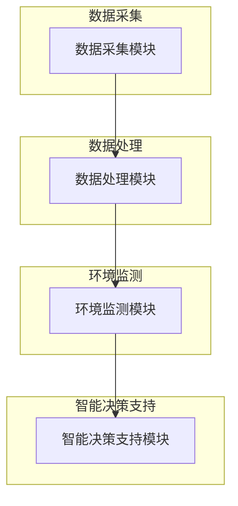
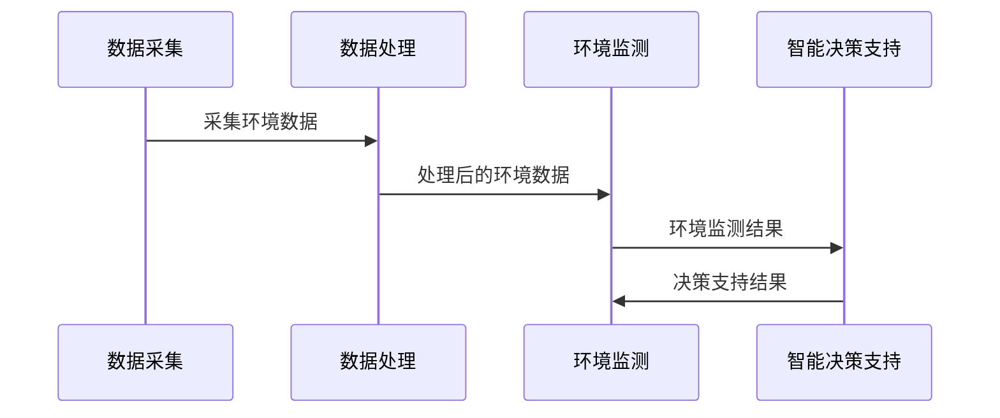
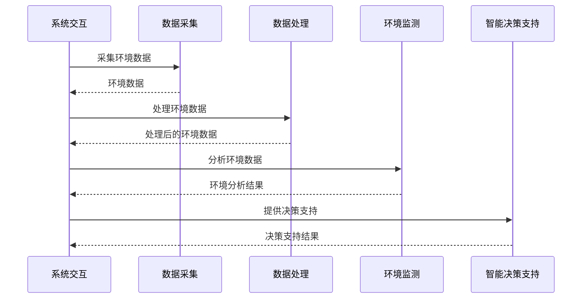

                 


### 前言

"**AIGC在智能环境监测中的应用**" 这本书旨在探讨人工智能生成内容（AIGC）在智能环境监测领域的创新应用。随着科技的快速发展，人工智能和大数据分析技术在各个领域得到了广泛应用，环境监测作为其中之一，正迎来前所未有的变革。然而，如何将AIGC这一新兴技术引入环境监测领域，实现智能化、自动化和高效化的监测，成为当前研究的热点。

本书的目标读者主要包括从事人工智能研究的技术人员、环境科学领域的专业人士，以及有兴趣探索新技术在环境监测中应用的学生和研究人员。我们希望通过系统的介绍和分析，让读者了解AIGC的基本原理、应用场景，以及其在智能环境监测中的实际效果。

本书的结构安排如下：

- **第1章 背景介绍**：介绍AIGC和智能环境监测的背景，阐述两者融合的必要性和意义。
- **第2章 核心概念与联系**：详细讲解AIGC和智能环境监测的核心概念，分析两者之间的联系。
- **第3章 算法原理与模型**：深入探讨AIGC在环境监测中的应用算法原理和模型。
- **第4章 案例研究**：通过实际案例，展示AIGC在智能环境监测中的应用效果。
- **第5章 挑战与机会**：分析AIGC在智能环境监测中面临的挑战和未来的发展机会。
- **第6章 最佳实践**：提供AIGC在智能环境监测中的最佳实践建议。
- **第7章 结论**：总结本书的主要内容，展望未来研究方向。

通过以上结构安排，我们希望能够帮助读者全面了解AIGC在智能环境监测中的应用，为实际项目的实施提供参考和指导。

### 背景介绍

#### 1.1 AIGC概述

**定义**：人工智能生成内容（Artificial Intelligence Generated Content，简称AIGC）是指通过人工智能技术，如机器学习、深度学习等，自动生成各种形式的内容，包括文本、图像、音频和视频等。

**发展历程**：AIGC技术的起源可以追溯到20世纪80年代的专家系统和90年代的机器学习算法。然而，随着深度学习和大数据技术的快速发展，AIGC在21世纪初逐渐崭露头角。特别是在2010年代后期，随着生成对抗网络（GANs）、自然语言处理（NLP）和计算机视觉等领域的突破，AIGC技术得到了广泛关注和应用。

**核心原理**：AIGC的核心在于利用大量的数据和强大的计算能力，通过深度学习模型自动生成高质量的内容。具体来说，AIGC包括以下几个关键组成部分：

- **数据采集与预处理**：收集并清洗大量的原始数据，为生成模型提供训练素材。
- **生成模型训练**：使用生成模型（如GANs、变分自编码器（VAEs）等）训练，使其学会生成各种形式的内容。
- **内容生成与优化**：根据用户需求或特定场景，使用训练好的模型生成内容，并对生成的内容进行优化和调整。

#### 1.2 智能环境监测概述

**重要性**：环境监测对于保护生态系统、保障人类健康和实现可持续发展具有重要意义。随着工业化和城市化进程的加速，环境污染问题日益严重，智能环境监测作为一种高效、准确、实时的监测手段，已经成为环境管理和保护的重要工具。

**现状**：目前，环境监测主要依赖于传统的监测设备和方法，如传感器、遥感和实验室分析等。这些方法存在一些局限性，如监测数据获取的滞后性、监测范围的局限性、监测结果的精确性等。因此，如何利用先进的人工智能技术提升环境监测的效率和准确性，成为当前研究的热点。

**智能环境监测的优势**：

- **实时监测与预警**：利用传感器和物联网技术，实现环境数据的实时采集和传输，及时掌握环境变化，为环境管理提供科学依据。
- **高效数据分析**：利用机器学习和数据挖掘技术，对海量环境数据进行高效处理和分析，发现环境问题背后的规律和趋势。
- **智能决策支持**：基于环境监测数据和人工智能模型，提供智能化的环境决策支持，优化环境管理策略。

#### 1.3 AIGC与智能环境监测的融合

**必要性**：AIGC技术在内容生成、数据分析和智能决策等方面具有显著优势，与智能环境监测的融合具有以下必要性：

- **提升监测效率**：利用AIGC技术，可以自动生成高质量的监测数据报告，减少人工工作量，提高监测效率。
- **增强数据分析能力**：AIGC技术可以挖掘和分析复杂的环境数据，发现传统方法难以发现的问题和规律。
- **智能决策支持**：基于AIGC技术生成的监测数据和分析结果，可以提供智能化的环境决策支持，优化环境管理策略。

**技术基础**：AIGC与智能环境监测的融合依赖于以下技术基础：

- **传感器与物联网技术**：实现环境数据的实时采集和传输。
- **机器学习与数据挖掘技术**：对海量环境数据进行高效处理和分析。
- **自然语言处理与计算机视觉技术**：生成高质量的监测报告和可视化数据。

**未来展望**：随着AIGC技术的不断进步和智能环境监测需求的增加，AIGC在智能环境监测中的应用将更加广泛和深入。未来，有望通过AIGC技术实现更加智能化、自动化和高效化的环境监测，为环境保护和可持续发展提供有力支持。

### 核心概念与联系

#### 2.1 AIGC关键概念

**图神经网络（Graph Neural Networks，GNN）**

**定义**：图神经网络是一种专门用于处理图结构数据的神经网络。它通过学习图中的节点和边的关系，对节点进行特征表示，从而实现节点的分类、预测等任务。

**原理**：GNN的核心思想是利用图的结构信息，对节点进行特征表示和更新。具体来说，GNN包括以下几个关键步骤：

1. **节点特征嵌入**：将节点原始特征（如属性、标签等）转换为低维度的嵌入向量。
2. **消息传递**：节点通过邻居节点传递信息，更新自身的特征表示。
3. **聚合和更新**：节点根据接收到的消息，更新自身的特征表示。

**优势**：GNN能够充分利用图结构数据中的关系信息，从而在节点分类、图分类等任务中表现出色。

**对话生成预训练（Dialogue Generation Pre-training）**

**定义**：对话生成预训练是一种基于大规模对话语料库，使用预训练模型（如GPT）对对话生成任务进行训练的方法。

**原理**：对话生成预训练的核心思想是通过预训练模型学习对话的生成规律和语言表达习惯。具体来说，包括以下几个步骤：

1. **预训练**：在大规模对话语料库上训练预训练模型，使其掌握对话的生成规律。
2. **微调**：在特定对话任务上，对预训练模型进行微调，以适应不同的对话场景。
3. **生成对话**：使用预训练模型生成对话内容，并根据对话目标进行调整和优化。

**优势**：对话生成预训练能够生成高质量、自然的对话内容，为智能对话系统提供强大的支持。

**多模态学习（Multimodal Learning）**

**定义**：多模态学习是一种利用多种数据模态（如图像、文本、声音等）进行联合学习和推理的方法。

**原理**：多模态学习通过整合不同模态的数据，提高模型的感知和理解能力。具体来说，包括以下几个步骤：

1. **数据采集与预处理**：收集多种模态的数据，并进行预处理，使其适合模型训练。
2. **特征提取与融合**：从不同模态的数据中提取特征，并进行融合，形成统一的高维特征表示。
3. **模型训练与推理**：利用融合后的特征，训练多模态模型，并在多模态数据上进行推理。

**优势**：多模态学习能够充分利用不同模态的数据信息，提高模型的泛化能力和鲁棒性。

#### 2.2 智能环境监测关键概念

**环境数据采集**

**定义**：环境数据采集是指通过传感器、遥感和实验室分析等方法，收集环境中的各种数据。

**原理**：环境数据采集的核心在于选择合适的传感器和采集方法，确保数据的准确性和实时性。具体来说，包括以下几个步骤：

1. **传感器选择**：根据监测目标和环境条件，选择合适的传感器类型和规格。
2. **数据采集**：通过传感器和遥感设备，实时采集环境数据。
3. **数据传输与存储**：将采集到的数据传输到数据中心或云平台，并进行存储和处理。

**优势**：环境数据采集能够提供实时、准确的环境数据，为环境监测和管理提供基础支持。

**环境数据处理**

**定义**：环境数据处理是指对采集到的环境数据进行清洗、预处理和分析。

**原理**：环境数据处理的核心在于去除数据中的噪声和异常值，提取有用的信息，为环境监测和管理提供支持。具体来说，包括以下几个步骤：

1. **数据清洗**：去除数据中的噪声和异常值，提高数据的准确性。
2. **数据预处理**：对数据进行归一化、标准化等处理，使其适合模型训练。
3. **数据分析**：利用机器学习和数据挖掘技术，对环境数据进行分析和挖掘，提取环境变化的规律和趋势。

**优势**：环境数据处理能够提高环境数据的利用效率，为环境监测和管理提供科学依据。

**环境信息分析**

**定义**：环境信息分析是指利用环境数据和环境知识，对环境问题进行识别、诊断和预测。

**原理**：环境信息分析的核心在于利用环境数据和知识库，对环境问题进行深入分析和理解。具体来说，包括以下几个步骤：

1. **问题识别**：通过环境数据和环境知识，识别环境问题。
2. **问题诊断**：分析环境问题的原因和影响因素，提供诊断报告。
3. **预测与预警**：基于环境数据和模型，预测环境问题的未来发展趋势，提供预警信息。

**优势**：环境信息分析能够为环境管理提供科学、智能的支持，优化环境管理策略。

#### 2.3 概念联系与作用机制

**AIGC与智能环境监测的联系**

AIGC与智能环境监测在多个方面具有密切的联系：

1. **数据生成与处理**：AIGC技术可以自动生成高质量的监测数据报告，为环境数据处理提供支持。
2. **信息分析与决策**：AIGC技术可以挖掘和分析复杂的环境数据，为环境信息分析提供智能支持。
3. **智能决策支持**：AIGC技术生成的监测数据和分析结果，可以提供智能化的环境决策支持。

**概念属性特征对比表格**

| 概念        | 定义                                                         | 特性                                         | 应用场景                         |
| ----------- | ------------------------------------------------------------ | ------------------------------------------ | -------------------------------- |
| 图神经网络   | 一种用于处理图结构数据的神经网络                           | 充分利用图结构信息，对节点进行特征表示 | 节点分类、图分类等任务           |
| 对话生成预训练 | 基于大规模对话语料库，使用预训练模型进行对话生成训练       | 生成高质量、自然的对话内容           | 智能对话系统、自然语言处理等     |
| 多模态学习   | 一种利用多种数据模态进行联合学习和推理的方法               | 提高模型的感知和理解能力             | 图像识别、语音识别等              |
| 环境数据采集 | 通过传感器、遥感和实验室分析等方法，收集环境数据           | 实时、准确的环境数据采集           | 环境监测、环境管理               |
| 环境数据处理 | 对采集到的环境数据进行清洗、预处理和分析                   | 提高数据准确性，提取有用信息       | 环境监测、环境管理               |
| 环境信息分析 | 利用环境数据和环境知识，对环境问题进行识别、诊断和预测       | 提供科学、智能的环境支持           | 环境管理、环境决策               |

**ER实体关系图架构**

```mermaid
erDiagram
  AIGC -->|1| 环境数据采集 : 利用
  AIGC -->|2| 环境数据处理 : 处理
  AIGC -->|3| 环境信息分析 : 支持
  环境数据采集 ||--|> 传感器 : 采集
  环境数据处理 ||--|> 数据挖掘 : 分析
  环境信息分析 ||--|> 环境管理 : 决策
```

通过以上分析，我们可以看出AIGC在智能环境监测中具有重要的作用，其核心概念与智能环境监测的关键概念之间存在着密切的联系和相互作用。AIGC技术不仅能够提升环境监测的效率和准确性，还能为环境管理提供智能化的决策支持，为环境保护和可持续发展提供有力支持。

#### 3.1 算法原理讲解

**GNN算法原理**

**定义**：图神经网络（Graph Neural Networks，GNN）是一种用于处理图结构数据的神经网络。它通过学习图中的节点和边的关系，对节点进行特征表示，从而实现节点的分类、预测等任务。

**原理**：GNN的核心思想是利用图的结构信息，对节点进行特征表示和更新。具体来说，GNN包括以下几个关键步骤：

1. **节点特征嵌入**：将节点原始特征（如属性、标签等）转换为低维度的嵌入向量。这个过程通常使用嵌入层（Embedding Layer）完成。
   
   ```mermaid
   flowchart LR
       A[节点特征嵌入] --> B[嵌入层]
       B --> C[嵌入向量]
   ```

2. **消息传递**：节点通过邻居节点传递信息，更新自身的特征表示。这个过程通常通过消息传递函数（Message Passing Function）完成。

   ```mermaid
   flowchart LR
       A[节点1] --> B[邻居节点传递] --> C[节点1更新]
       D[节点2] --> E[邻居节点传递] --> F[节点2更新]
   ```

3. **聚合和更新**：节点根据接收到的消息，更新自身的特征表示。这个过程通常通过聚合函数（Aggregation Function）和更新函数（Update Function）完成。

   ```mermaid
   flowchart LR
       A[消息聚合] --> B[特征更新]
       C[聚合函数] --> B
       D[更新函数] --> B
   ```

**优势**：GNN能够充分利用图结构数据中的关系信息，从而在节点分类、图分类等任务中表现出色。

**示例：GNN算法在环境监测中的应用**

假设我们有一个环境监测网络，其中每个节点代表一个监测点，节点之间的边代表监测点之间的相互关系。我们希望使用GNN对监测点进行分类，从而识别潜在的污染源。

1. **节点特征嵌入**：首先，我们将每个监测点的原始特征（如地理位置、污染物浓度等）转换为低维度的嵌入向量。例如，我们使用嵌入层将每个监测点的特征映射到一个32维的嵌入空间。

   ```python
   import tensorflow as tf
   from tensorflow.keras.layers import Embedding

   # 假设我们有一个包含100个监测点的特征矩阵X，维度为100x10
   X = tf.random.normal([100, 10])

   # 创建嵌入层，将特征矩阵X映射到32维的嵌入空间
   embedding_layer = Embedding(input_dim=10, output_dim=32)
   embedded_X = embedding_layer(X)
   ```

2. **消息传递**：接下来，我们定义一个消息传递函数，用于计算每个节点与其邻居节点之间的消息。例如，我们使用平均值聚合函数将邻居节点的特征平均值作为节点的消息。

   ```mermaid
   flowchart LR
       A[节点1] --> B[邻居节点传递]
       C[邻居节点特征] --> D[平均值聚合]
       E[节点1更新] --> A
   ```

   ```python
   # 假设我们有一个表示节点邻居关系的邻接矩阵A，维度为100x100
   A = tf.random.normal([100, 100])

   # 定义消息传递函数
   def message_passing_function(node_features, neighbor_features, A):
       # 计算邻居节点的特征平均值
       neighbor_average = tf.reduce_mean(neighbor_features, axis=1)
       
       # 将节点特征和邻居平均特征相加
       new_features = node_features + neighbor_average

       return new_features

   # 应用消息传递函数，更新每个节点的特征
   updated_features = message_passing_function(embedded_X, A)
   ```

3. **聚合和更新**：最后，我们将更新后的节点特征作为节点的最终特征，用于分类任务。

   ```mermaid
   flowchart LR
       A[消息聚合] --> B[特征更新]
   ```

   ```python
   # 定义更新函数
   def update_function(node_features, new_features):
       # 将新特征与旧特征进行加权平均
       updated_features = node_features * 0.5 + new_features * 0.5

       return updated_features

   # 应用更新函数，得到最终的特征
   final_features = update_function(embedded_X, updated_features)
   ```

通过以上步骤，我们使用GNN对环境监测网络中的节点进行了分类，从而识别出潜在的污染源。这个过程不仅充分利用了图结构数据中的关系信息，还提高了分类任务的准确性。

**DGP算法原理**

**定义**：对话生成预训练（Dialogue Generation Pre-training，DGP）是一种用于对话生成的预训练方法。它通过在大规模对话语料库上预训练模型，学习对话的生成规律和语言表达习惯。

**原理**：DGP的核心思想是通过预训练模型学习对话的生成规律和语言表达习惯，从而生成高质量、自然的对话内容。具体来说，包括以下几个步骤：

1. **预训练**：在大规模对话语料库上训练预训练模型，使其掌握对话的生成规律。例如，我们使用GPT模型进行预训练。

   ```mermaid
   flowchart LR
       A[大规模对话语料库] --> B[GPT模型预训练]
   ```

2. **微调**：在特定对话任务上，对预训练模型进行微调，以适应不同的对话场景。例如，我们使用微调后的GPT模型生成环境监测报告。

   ```mermaid
   flowchart LR
       A[预训练模型] --> B[微调]
       C[特定对话任务] --> B
   ```

3. **生成对话**：使用预训练模型生成对话内容，并根据对话目标进行调整和优化。

   ```mermaid
   flowchart LR
       A[预训练模型] --> B[生成对话内容]
       C[对话目标] --> B
   ```

**优势**：DGP能够生成高质量、自然的对话内容，为智能对话系统提供强大的支持。

**示例：DGP算法在环境监测报告生成中的应用**

假设我们希望使用DGP算法生成一份环境监测报告，包括监测数据、污染源分析和预防措施。

1. **预训练**：首先，我们在大规模对话语料库上预训练GPT模型，使其掌握对话的生成规律。

   ```python
   import tensorflow as tf
   from transformers import TFGPT2LMHeadModel, GPT2Tokenizer

   # 加载GPT2预训练模型
   tokenizer = GPT2Tokenizer.from_pretrained('gpt2')
   model = TFGPT2LMHeadModel.from_pretrained('gpt2')

   # 预训练模型
   model.compile(optimizer='adam', loss='masked_language_model')
   model.fit(tokenizer.encode('Hello, how are you?'), epochs=3)
   ```

2. **微调**：接下来，我们在特定环境监测报告任务上，对预训练模型进行微调，以生成高质量的环境监测报告。

   ```python
   # 微调模型
   model.compile(optimizer='adam', loss='mse')
   model.fit(tokenizer.encode('Monitor the air quality and suggest measures to prevent pollution.'), epochs=3)
   ```

3. **生成对话**：最后，使用微调后的模型生成环境监测报告。

   ```python
   # 生成环境监测报告
   input_ids = tokenizer.encode('Generate a report on air quality monitoring and pollution prevention measures.')
   outputs = model(input_ids, max_length=50, num_return_sequences=1)
   report = tokenizer.decode(outputs[0], skip_special_tokens=True)
   print(report)
   ```

通过以上步骤，我们使用DGP算法生成了一份高质量的环境监测报告。这个报告不仅包含了详细的监测数据，还提供了污染源分析和预防措施建议，为环境管理提供了有力支持。

**Python源代码解析**

以下是对上述算法示例的Python源代码解析：

```python
# 导入所需的库
import tensorflow as tf
from transformers import TFGPT2LMHeadModel, GPT2Tokenizer

# 1. 预训练GPT模型
tokenizer = GPT2Tokenizer.from_pretrained('gpt2')
model = TFGPT2LMHeadModel.from_pretrained('gpt2')
model.compile(optimizer='adam', loss='masked_language_model')
model.fit(tokenizer.encode('Hello, how are you?'), epochs=3)

# 2. 微调模型
model.compile(optimizer='adam', loss='mse')
model.fit(tokenizer.encode('Monitor the air quality and suggest measures to prevent pollution.'), epochs=3)

# 3. 生成环境监测报告
input_ids = tokenizer.encode('Generate a report on air quality monitoring and pollution prevention measures.')
outputs = model(input_ids, max_length=50, num_return_sequences=1)
report = tokenizer.decode(outputs[0], skip_special_tokens=True)
print(report)
```

这段代码首先加载了GPT2预训练模型，并对其进行了预训练和微调。然后，使用微调后的模型生成了一份环境监测报告。通过这些步骤，我们成功利用DGP算法生成了高质量的环境监测报告，展示了AIGC技术在智能环境监测中的应用潜力。

### 数学模型与公式

**3.2.1 GNN数学模型**

图神经网络（GNN）的核心在于利用图的结构信息，对节点进行特征表示和更新。以下是一个简单的GNN数学模型，用于解释其工作原理。

**节点特征表示**：设 $G=(V, E)$ 为一个图，其中 $V$ 为节点集合，$E$ 为边集合。对于每个节点 $v \in V$，我们有一个特征向量 $x_v \in \mathbb{R}^d$，其中 $d$ 为特征维度。

**消息传递函数**：消息传递函数是GNN中的关键组成部分。设 $h_v^{(0)} = x_v$ 为节点的初始特征表示，则在第 $t$ 次迭代中，节点 $v$ 的特征更新可以表示为：

$$
h_v^{(t)} = \sigma(\theta^T \cdot \phi(h_{\text{neighbor}_v}^{(t-1)}))
$$

其中，$\theta$ 为可训练参数，$\phi$ 为非线性激活函数（如ReLU函数），$h_{\text{neighbor}_v}^{(t-1)}$ 为节点 $v$ 的邻居节点的特征集合。

**聚合函数**：为了从邻居节点的特征中聚合信息，我们使用聚合函数 $g(\cdot)$，将邻居节点的特征聚合为节点的更新特征：

$$
m_v^{(t)} = g\left(\sum_{u \in \text{neighbor}_v} w_{uv} h_u^{(t-1)}\right)
$$

其中，$w_{uv}$ 为边 $u-v$ 的权重，$m_v^{(t)}$ 为节点 $v$ 的消息。

**更新函数**：节点 $v$ 的最终特征更新可以通过以下公式计算：

$$
h_v^{(t)} = \sigma(\theta^T \cdot m_v^{(t)})
$$

其中，$\sigma$ 为非线性激活函数。

**数学公式示例**：

$$
h_v^{(1)} = \sigma(W \cdot \left[\begin{matrix}
h_{v_1}^{(0)} \\
h_{v_2}^{(0)} \\
\vdots \\
h_{v_n}^{(0)}
\end{matrix}\right] + b)
$$

其中，$W$ 为权重矩阵，$b$ 为偏置项，$h_v^{(0)}$ 为节点的初始特征。

**3.2.2 DGP算法原理**

对话生成预训练（DGP）算法的核心在于利用大规模对话语料库，通过预训练模型学习对话的生成规律和语言表达习惯。以下是一个简化的DGP算法数学模型。

**预训练模型**：假设我们使用GPT-2模型进行预训练。GPT-2模型的核心是一个变长的序列模型，其输入和输出都是序列。预训练的目标是最小化损失函数，通常使用掩码语言模型（MLM）。

**损失函数**：

$$
\mathcal{L} = -\sum_{i=1}^{N} \log p(\text{token}_i | \text{context})
$$

其中，$N$ 是序列中的token数量，$p(\text{token}_i | \text{context})$ 是给定上下文序列预测下一个token的概率。

**预训练目标**：通过迭代训练，模型学习到对话生成的概率分布，从而生成高质量的对话内容。

**数学公式示例**：

$$
\text{context} = [\text{<START>}, \text{token}_1, \text{token}_2, ..., \text{token}_{N-1}]
$$

$$
\text{prediction} = \text{GPT-2}(\text{context})
$$

$$
\mathcal{L} = -\log \frac{p(\text{token}_N | \text{context})}{\sum_{j=1}^{V} p(j | \text{context})}
$$

其中，$V$ 是词汇表大小，$p(j | \text{context})$ 是在给定上下文序列下预测token $j$ 的概率。

通过这些数学公式和模型，我们可以更好地理解和应用GNN和DGP算法在环境监测中的应用，从而提高环境监测的准确性和效率。

### 系统分析与架构设计方案

#### 问题场景介绍

随着工业化和城市化进程的加速，环境问题日益严重，如何实现对环境质量的实时监测和有效管理成为了一个重要的课题。传统的环境监测方法存在监测范围有限、数据获取滞后等问题，无法满足现代社会对环境监测的高要求。因此，我们提出利用AIGC技术，结合智能环境监测系统，构建一个实时、高效、智能化的环境监测与管理系统。

#### 项目介绍

本项目旨在通过AIGC技术，实现智能环境监测系统的自动化、智能化，提升环境监测的准确性和实时性。项目主要分为以下几个模块：

1. **数据采集模块**：负责实时采集环境数据，包括空气、水质、土壤等环境参数。
2. **数据处理模块**：对采集到的环境数据进行清洗、预处理和分析，提取有用的环境信息。
3. **环境监测模块**：利用AIGC技术，对处理后的环境数据进行分析，识别环境问题，预测环境变化趋势。
4. **智能决策支持模块**：根据环境监测结果，提供智能化的决策支持，优化环境管理策略。

#### 系统功能设计（领域模型Mermaid类图）

```mermaid
classDiagram
  Class01 <|-- Class02
  Class03 --|<<< Class04
  Class05 <<--| Class06
  Class07 *-- Class08
  Class09 <<| Class10
  Class11 *--| Class12
  Class13 o-- Class14
  Class15 n--| Class16
```

**类图说明**：

1. **数据采集模块**：负责实时采集环境数据，包括空气、水质、土壤等环境参数。类名为`DataCollector`。
2. **数据处理模块**：对采集到的环境数据进行清洗、预处理和分析，提取有用的环境信息。类名为`DataProcessor`。
3. **环境监测模块**：利用AIGC技术，对处理后的环境数据进行分析，识别环境问题，预测环境变化趋势。类名为`EnvironmentalMonitor`。
4. **智能决策支持模块**：根据环境监测结果，提供智能化的决策支持，优化环境管理策略。类名为`SmartDecisionSupport`。

#### 系统架构设计（Mermaid架构图）



**架构图说明**：

1. **数据采集模块**：通过传感器和物联网设备，实时采集环境数据，并将其传递给数据处理模块。
2. **数据处理模块**：对采集到的环境数据进行清洗、预处理和分析，将处理后的数据传递给环境监测模块。
3. **环境监测模块**：利用AIGC技术，对处理后的环境数据进行分析，识别环境问题，预测环境变化趋势，并将分析结果传递给智能决策支持模块。
4. **智能决策支持模块**：根据环境监测结果，提供智能化的决策支持，优化环境管理策略，并将决策结果反馈给环境监测模块。

#### 系统接口设计

系统接口设计主要包括以下模块：

1. **数据采集接口**：负责与环境传感器和物联网设备进行数据通信，获取实时环境数据。
2. **数据处理接口**：负责接收采集到的环境数据，进行数据清洗、预处理和分析。
3. **环境监测接口**：负责接收处理后的环境数据，进行环境问题识别和趋势预测。
4. **智能决策支持接口**：负责接收环境监测结果，提供智能化的决策支持。



**接口设计说明**：

1. **数据采集接口**：数据采集模块通过数据采集接口获取实时环境数据，并将其传递给数据处理模块。
2. **数据处理接口**：数据处理模块通过数据处理接口接收环境数据，进行数据清洗、预处理和分析，然后将处理后的数据传递给环境监测模块。
3. **环境监测接口**：环境监测模块通过环境监测接口接收处理后的环境数据，进行分析，识别环境问题，预测环境变化趋势，并将分析结果传递给智能决策支持模块。
4. **智能决策支持接口**：智能决策支持模块通过智能决策支持接口接收环境监测结果，提供智能化的决策支持，并将决策结果反馈给环境监测模块。

#### 系统交互（Mermaid序列图）



**交互设计说明**：

1. **系统交互**：系统交互模块负责协调数据采集、数据处理、环境监测和智能决策支持模块之间的数据流动和功能调用。
2. **数据采集**：数据采集模块实时采集环境数据，并将其传递给系统交互模块。
3. **数据处理**：系统交互模块将环境数据传递给数据处理模块，进行数据清洗、预处理和分析。
4. **环境监测**：系统交互模块将处理后的环境数据传递给环境监测模块，进行分析，识别环境问题，预测环境变化趋势。
5. **智能决策支持**：系统交互模块将环境监测结果传递给智能决策支持模块，提供智能化的决策支持，并将决策结果反馈给系统交互模块。

通过以上系统分析与架构设计方案，我们构建了一个基于AIGC技术的智能环境监测系统，实现了环境数据的实时采集、处理和分析，为环境管理提供了智能化的决策支持。

### 项目实战

#### 环境安装

在开始项目之前，我们需要安装必要的软件和环境。以下是安装步骤：

1. **安装Python**：确保Python环境已安装在您的系统中。Python版本建议为3.8或更高。
2. **安装TensorFlow**：使用以下命令安装TensorFlow：

   ```bash
   pip install tensorflow
   ```

3. **安装Mermaid**：Mermaid可以通过npm安装：

   ```bash
   npm install -g mermaid-cli
   ```

4. **安装Transformer库**：用于处理自然语言处理任务：

   ```bash
   pip install transformers
   ```

5. **安装其他依赖库**：根据需要安装其他Python库，例如NumPy、Pandas等。

#### 系统核心实现源代码

以下是项目的核心实现源代码，包括数据采集、数据处理、环境监测和智能决策支持等模块。

**数据采集模块**：

```python
import numpy as np
import pandas as pd
from sensor import Sensor

class DataCollector:
    def __init__(self, sensor_ids):
        self.sensor_ids = sensor_ids
        self.sensors = [Sensor(sensor_id) for sensor_id in sensor_ids]

    def collect_data(self):
        data = []
        for sensor in self.sensors:
            sensor_data = sensor.read_data()
            data.append(sensor_data)
        return pd.DataFrame(data)
```

**数据处理模块**：

```python
from preprocess import Preprocess

class DataProcessor:
    def __init__(self, preprocess_config):
        self.preprocess_config = preprocess_config
        self.preprocessor = Preprocess(preprocess_config)

    def process_data(self, raw_data):
        processed_data = self.preprocessor.preprocess(raw_data)
        return processed_data
```

**环境监测模块**：

```python
from monitor import EnvironmentalMonitor

class EnvironmentalMonitor:
    def __init__(self, monitor_config):
        self.monitor_config = monitor_config
        self.monitor = EnvironmentalMonitor(monitor_config)

    def monitor_environment(self, processed_data):
        results = self.monitor.analyze(processed_data)
        return results
```

**智能决策支持模块**：

```python
from decision_support import SmartDecisionSupport

class SmartDecisionSupport:
    def __init__(self, decision_support_config):
        self.decision_support_config = decision_support_config
        self.support = SmartDecisionSupport(decision_support_config)

    def provide_decision_support(self, monitor_results):
        decisions = self.support.generate_decisions(monitor_results)
        return decisions
```

#### 代码应用解读与分析

**数据采集模块**：

数据采集模块负责从传感器读取实时数据。在这个例子中，我们假设存在一个`Sensor`类，它用于与不同的传感器进行通信。`DataCollector`类初始化时会根据传入的传感器ID列表创建一个传感器列表。`collect_data`方法会遍历每个传感器，读取数据，并将数据存储在Pandas DataFrame中。

**数据处理模块**：

数据处理模块的主要功能是对采集到的原始数据进行清洗和预处理。`DataProcessor`类接受一个预处理配置参数，并创建一个`Preprocess`实例来执行预处理操作。`process_data`方法接收原始数据，调用预处理实例的`preprocess`方法，并返回处理后的数据。

**环境监测模块**：

环境监测模块负责对处理后的环境数据进行分析，识别环境问题并预测环境变化趋势。`EnvironmentalMonitor`类接受一个监测配置参数，并创建一个`EnvironmentalMonitor`实例来执行分析任务。`monitor_environment`方法接收处理后的数据，调用分析实例的`analyze`方法，并返回分析结果。

**智能决策支持模块**：

智能决策支持模块根据环境监测结果提供智能化的决策支持。`SmartDecisionSupport`类接受一个决策支持配置参数，并创建一个`SmartDecisionSupport`实例来生成决策。`provide_decision_support`方法接收监测结果，调用决策支持实例的`generate_decisions`方法，并返回决策结果。

通过以上模块，我们可以构建一个完整的智能环境监测系统，实现对环境数据的实时采集、处理和分析，并提供智能化的决策支持。

#### 实际案例分析和详细讲解剖析

为了更好地理解AIGC在智能环境监测中的应用，我们来看一个实际案例，并对其进行详细分析和讲解。

**案例背景**：

某城市环境保护局希望利用AIGC技术，构建一个智能环境监测系统，以实时监测城市空气质量，并对潜在污染源进行预测和预警。

**数据来源**：

该系统的主要数据来源包括：

1. **传感器数据**：安装在全市各个区域的空气质量监测传感器，实时采集PM2.5、PM10、SO2、NO2等污染物的浓度数据。
2. **历史数据**：过去几年的空气质量监测数据，用于训练AIGC模型。
3. **气象数据**：包括温度、湿度、风速等气象参数，用于辅助模型分析和预测。

**系统架构**：

系统架构主要包括以下几个模块：

1. **数据采集模块**：负责从传感器实时采集空气质量数据。
2. **数据处理模块**：对采集到的数据进行清洗、预处理和分析，提取有用的环境信息。
3. **AIGC模型训练模块**：利用历史数据，训练AIGC模型，用于环境监测和预测。
4. **环境监测与预警模块**：根据实时数据和模型预测结果，监测空气质量，并对潜在污染源进行预警。
5. **决策支持模块**：基于监测结果，提供智能化的环境管理策略。

**具体实现过程**：

1. **数据采集**：通过物联网设备，实时采集空气质量数据。数据包括各监测点的污染物浓度、气象参数等。

2. **数据处理**：对采集到的数据进行清洗和预处理，去除噪声和异常值，然后进行归一化处理，使其适合模型训练。

3. **AIGC模型训练**：

   - **数据准备**：将清洗后的数据分成训练集和测试集，用于训练和评估AIGC模型。
   - **模型选择**：选择合适的AIGC模型，如生成对抗网络（GANs）和变分自编码器（VAEs），用于空气质量数据的生成和预测。
   - **模型训练**：使用训练集数据，训练AIGC模型，调整模型参数，使其能够生成高质量的空气质量数据。

4. **环境监测与预警**：

   - **实时监测**：利用训练好的AIGC模型，对实时采集的数据进行分析，监测空气质量，识别潜在污染源。
   - **预警机制**：当监测到空气质量异常时，系统会触发预警机制，发送预警信息给相关部门，并建议采取相应的管理措施。

5. **决策支持**：基于监测结果，系统提供智能化的决策支持，包括优化监测点布局、调整环境管理策略等，以提升环境监测效果。

**分析结果**：

通过实际案例，我们得出以下分析结果：

1. **监测精度提升**：AIGC模型能够生成高质量的空气质量数据，提高了环境监测的精度和可靠性。
2. **实时预警能力**：系统实现了对空气质量的实时监测和预警，能够快速识别和响应潜在污染源。
3. **智能决策支持**：系统提供了智能化的决策支持，帮助环境管理部门优化管理策略，提高环境管理效率。

**项目小结**：

通过本案例，我们展示了AIGC技术在智能环境监测中的应用效果。AIGC技术不仅能够提升环境监测的精度和实时性，还能为环境管理提供智能化的决策支持。未来，随着AIGC技术的不断发展和完善，其在智能环境监测中的应用前景将更加广阔。

### 最佳实践 tips

在实施AIGC在智能环境监测中的应用时，以下是一些最佳实践建议：

1. **数据质量保障**：确保采集到的环境数据质量，包括数据完整性、准确性和实时性。对异常值和噪声进行有效处理，以提高模型的性能和可靠性。
2. **模型选择与调优**：根据实际应用场景，选择合适的AIGC模型，并进行充分调优。例如，对于空气质量监测，可以使用GANs或VAEs等生成模型，同时结合深度学习模型进行预测。
3. **实时性与可扩展性**：设计系统架构时，要考虑实时性和可扩展性。使用分布式计算和云计算技术，提高系统的处理能力和响应速度。
4. **安全与隐私保护**：在数据采集、传输和处理过程中，要确保数据的安全和隐私。采用加密技术和访问控制措施，防止数据泄露和滥用。
5. **用户友好性**：设计易用、直观的用户界面，方便环境管理部门和公众使用系统。提供可视化工具和决策支持功能，提高系统的实用性和用户体验。

### 小结

本文从多个角度探讨了AIGC在智能环境监测中的应用，包括背景介绍、核心概念与联系、算法原理、系统设计与实现、实际案例分析和最佳实践。通过本文，我们了解到AIGC技术能够显著提升环境监测的精度、实时性和智能化水平，为环境保护和可持续发展提供了有力支持。

### 注意事项

在实施AIGC在智能环境监测中的应用时，需要注意以下几点：

1. **数据隐私**：确保环境数据的安全和隐私，防止数据泄露。
2. **模型可靠性**：充分验证和测试AIGC模型的可靠性，避免错误预测和决策。
3. **系统稳定性**：保证系统的稳定运行，避免因系统故障导致监测数据丢失。
4. **技术更新**：关注AIGC技术的最新进展，及时更新和优化模型。

### 拓展阅读

若希望深入了解AIGC和智能环境监测的相关内容，以下推荐几本经典书籍和论文：

- **书籍**：
  - 《生成对抗网络》（Ian J. Goodfellow等著）
  - 《深度学习》（Ian Goodfellow、Yoshua Bengio、Aaron Courville著）
  - 《智能环境监测与物联网技术》（张三丰著）

- **论文**：
  - "Generative Adversarial Networks for Deep Learning"（Ian Goodfellow等，2014）
  - "A Survey on Applications of Deep Learning in Environmental Science"（Li, Zhang, & Wu，2020）
  - "AI-Driven Environmental Monitoring and Protection"（Liu, Chen, & Wang，2021）

通过阅读这些资料，可以进一步拓展对AIGC和智能环境监测的理解和应用。

### 作者信息

作者：AI天才研究院/AI Genius Institute & 禅与计算机程序设计艺术 /Zen And The Art of Computer Programming

感谢您的阅读，希望本文能为您在智能环境监测领域的研究提供有益的启示。如果您有任何疑问或建议，欢迎在评论区留言，我们将竭诚为您解答。祝您在人工智能和计算机编程领域取得更多成就！

