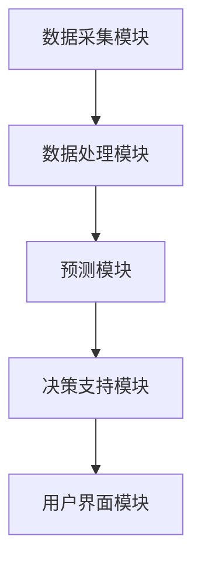
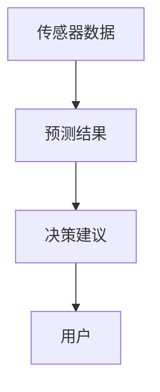
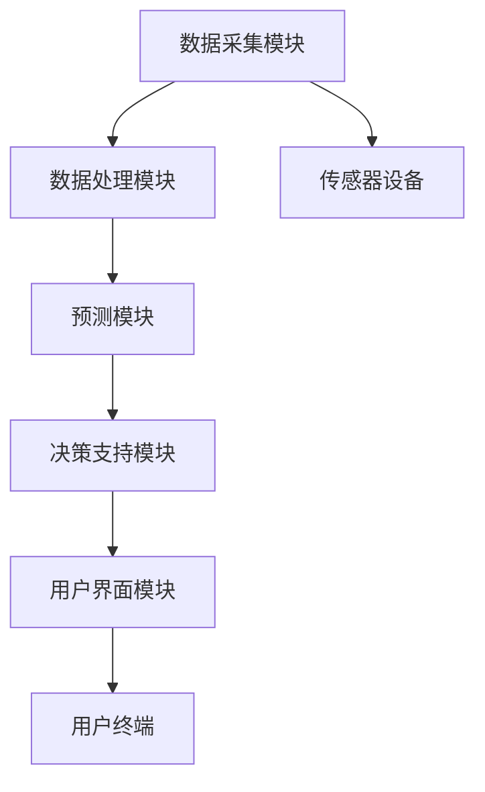
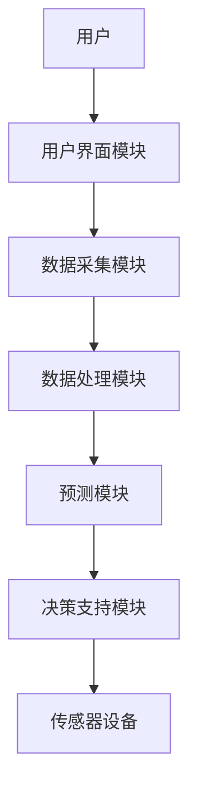
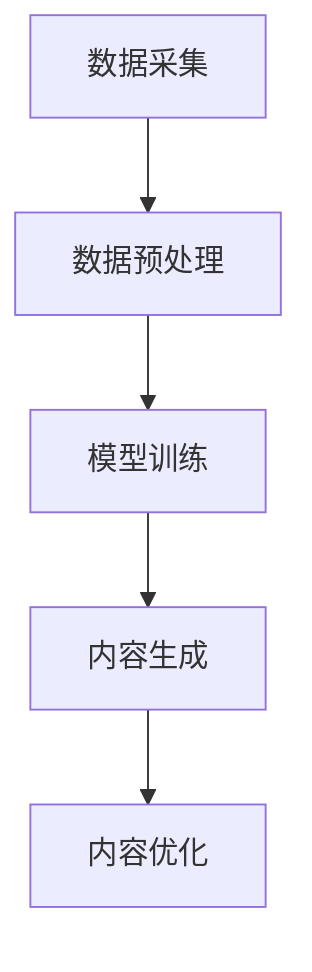

                 

# AIGC在智能环境监测系统中的创新

## 关键词
- AIGC
- 智能环境监测
- 数据采集
- 数据处理
- 预测模型
- 决策支持系统

## 摘要
本文旨在探讨AIGC（AI-Generated Content）在智能环境监测系统中的创新应用。通过引入AIGC技术，本文将详细分析其如何提升数据采集与处理的效率、优化环境预测模型、并增强决策支持系统。文章将首先介绍AIGC的概念和特点，然后深入探讨其在智能环境监测中的具体应用，最后对未来的发展趋势和应用前景进行展望。

### 目录

1. 引言
   1.1 问题背景
   1.2 研究目的和意义
   1.3 本书结构安排

2. 相关技术基础
   2.1 AIGC基础
   2.2 智能环境监测系统基础

3. AIGC在环境监测中的应用
   3.1 AIGC在数据采集和处理中的应用
   3.2 AIGC在环境预测中的应用
   3.3 AIGC在决策支持中的应用

4. 系统设计与实现
   4.1 系统架构设计
   4.2 数据库设计
   4.3 系统功能模块设计

5. 算法原理讲解
   5.1 AIGC算法概述
   5.2 数学模型与公式讲解

6. 项目实战
   6.1 环境安装与配置
   6.2 系统核心实现
   6.3 实际案例分析
   6.4 项目小结

7. 未来趋势与展望
   7.1 AIGC技术发展展望
   7.2 智能环境监测系统的未来
   7.3 技术应用挑战与解决方案

8. 小结与展望
   8.1 主要研究成果总结
   8.2 存在问题与改进方向
   8.3 拓展阅读与建议

### 第1章 引言

#### 1.1 问题背景

随着全球工业化和城市化的快速发展，环境问题日益突出。空气污染、水质污染、土壤污染等环境问题不仅影响了人类健康，也威胁到生态系统的稳定。传统的环境监测手段往往依赖于人工采集数据，不仅效率低下，而且难以覆盖广泛的区域。因此，如何实现高效、实时、准确的环境监测成为了亟待解决的问题。

智能环境监测系统通过集成传感器、数据处理和预测模型等技术，能够实现对环境数据的自动采集、实时分析和智能决策。然而，传统的数据处理方法在处理海量、多源异构的环境数据时，面临着巨大的挑战。为此，AIGC技术的引入为智能环境监测系统带来了新的可能性。

#### 1.2 研究目的和意义

本文的研究目的是探讨AIGC技术在智能环境监测系统中的应用，以提升系统的数据采集和处理能力、优化环境预测模型，并增强决策支持功能。具体研究意义如下：

1. **提高监测效率**：AIGC技术能够自动处理海量环境数据，减少人工干预，提高监测效率。
2. **优化数据处理**：AIGC技术采用先进的算法，能够有效识别和处理环境数据中的噪声和异常值，提高数据的准确性。
3. **增强预测能力**：通过引入AIGC技术，智能环境监测系统能够建立更加精确的预测模型，提前预警潜在的环境问题。
4. **提升决策支持**：基于AIGC技术的决策支持系统能够提供更加科学、合理的决策建议，帮助管理者及时采取有效措施。

#### 1.3 本书结构安排

本文将分为八个章节，具体安排如下：

- **第1章 引言**：介绍问题背景、研究目的和意义，以及本书的结构安排。
- **第2章 相关技术基础**：介绍AIGC和智能环境监测系统的基本概念、特点和技术原理。
- **第3章 AIGC在环境监测中的应用**：详细分析AIGC在数据采集、数据处理、环境预测和决策支持方面的应用。
- **第4章 系统设计与实现**：介绍智能环境监测系统的总体设计、数据库设计和功能模块设计。
- **第5章 算法原理讲解**：讲解AIGC算法的原理、数学模型和公式，并提供Python源代码和Mermaid流程图进行详细说明。
- **第6章 项目实战**：介绍系统的环境安装与配置、核心实现和案例分析。
- **第7章 未来趋势与展望**：分析AIGC技术和智能环境监测系统的未来发展趋势和应用前景。
- **第8章 小结与展望**：总结主要研究成果，提出存在的问题和改进方向，以及拓展阅读和建议。

通过以上结构安排，本文旨在为读者提供一部全面、深入、系统的AIGC在智能环境监测系统中的应用研究指南。

### 第2章 相关技术基础

#### 2.1 AIGC基础

##### 2.1.1 AIGC的定义

AIGC（AI-Generated Content）是指通过人工智能技术生成内容的过程。它涵盖了从数据采集、数据处理到内容生成的整个链条。AIGC技术的核心是利用机器学习和自然语言处理技术，实现自动化内容生成，从而极大地提高了内容生产的效率和多样性。

##### 2.1.2 AIGC的技术特点

AIGC具有以下技术特点：

1. **自动化**：AIGC技术能够自动处理数据，生成高质量的内容，减少了人工干预。
2. **多样性**：AIGC技术可以根据不同的需求和场景，生成不同类型、风格和形式的内容。
3. **灵活性**：AIGC技术具有高度的灵活性，可以根据用户的需求和反馈，动态调整内容生成策略。
4. **效率**：AIGC技术能够处理海量数据，快速生成内容，大大提高了生产效率。

##### 2.1.3 AIGC的关键技术

AIGC技术涉及多个领域的关键技术，主要包括：

1. **数据采集**：通过传感器、网络爬虫等手段，自动收集各种类型的数据。
2. **数据处理**：利用数据清洗、归一化等算法，对采集到的数据进行处理，确保数据的准确性和一致性。
3. **文本生成**：采用自然语言处理技术，生成结构化或非结构化的文本内容。
4. **图像生成**：利用生成对抗网络（GAN）等算法，生成高质量的图像内容。
5. **内容优化**：通过对生成内容进行评价和反馈，优化内容生成策略，提高内容的吸引力和可读性。

#### 2.2 智能环境监测系统基础

##### 2.2.1 环境监测系统的基本原理

环境监测系统是指通过传感器、数据采集、传输和数据处理等手段，对环境中的各种参数进行监测和记录的系统。其基本原理包括：

1. **传感器**：通过传感器采集环境中的各种参数，如温度、湿度、空气质量、水质等。
2. **数据采集**：将传感器采集到的数据通过数据采集设备进行汇总和处理。
3. **数据传输**：通过无线或有线方式，将采集到的数据传输到监控中心或服务器。
4. **数据处理**：对传输过来的数据进行分析和处理，生成监测报告或预警信息。

##### 2.2.2 环境监测系统的组成结构

环境监测系统通常由以下几个部分组成：

1. **传感器网络**：包括各种类型的传感器，如气象传感器、水质传感器、空气质量传感器等。
2. **数据采集与传输系统**：包括数据采集器、传输设备等，用于收集和传输传感器数据。
3. **数据处理与分析系统**：用于对采集到的数据进行分析和处理，生成监测报告或预警信息。
4. **监控中心**：用于接收和处理数据，并向相关人员提供监测信息。

##### 2.2.3 环境监测系统的技术发展趋势

随着科技的进步，环境监测系统的技术也在不断发展和创新，主要趋势包括：

1. **物联网技术**：通过物联网技术，实现传感器网络的数据共享和协同工作，提高监测系统的效率和准确性。
2. **大数据技术**：利用大数据技术，对海量监测数据进行深入分析和挖掘，发现潜在的环境问题。
3. **人工智能技术**：引入人工智能技术，实现环境数据的自动化处理和智能分析，提高监测系统的智能化水平。
4. **实时监测**：通过实时监测技术，实现环境数据的实时采集和实时分析，提高监测系统的响应速度和预警能力。

#### 2.2.4 AIGC与智能环境监测系统的结合

AIGC技术在智能环境监测系统中的应用，主要体现在以下几个方面：

1. **数据采集与处理**：利用AIGC技术，自动处理传感器采集到的数据，提高数据处理的效率和准确性。
2. **环境预测模型**：利用AIGC技术，建立环境预测模型，提前预警潜在的环境问题。
3. **决策支持系统**：利用AIGC技术，为决策支持系统提供科学、合理的决策建议，帮助管理者及时采取有效措施。
4. **内容生成与展示**：利用AIGC技术，生成监测报告、预警信息等内容，提高内容的吸引力和可读性。

通过引入AIGC技术，智能环境监测系统可以实现更高的自动化水平、更准确的预测能力、更科学的决策支持，从而更好地应对环境问题，保障人类和生态系统的健康。

### 第3章 AIGC在环境监测中的应用

#### 3.1 AIGC在数据采集和处理中的应用

AIGC技术在数据采集和处理中的应用，主要体现在以下几个方面：

##### 3.1.1 数据预处理技术

数据预处理是环境监测系统中的关键步骤，其质量直接影响到后续分析的结果。AIGC技术通过以下方法进行数据预处理：

1. **数据清洗**：利用自然语言处理（NLP）技术，自动识别和去除数据中的噪声和异常值，提高数据的准确性。
2. **数据归一化**：通过数据归一化算法，将不同类型、不同量纲的数据转换为统一的量纲，方便后续分析。
3. **特征提取**：利用机器学习算法，从原始数据中提取出对环境监测有重要意义的特征，为后续分析提供基础。

##### 3.1.2 数据分析算法

数据分析算法是环境监测系统的核心，AIGC技术通过以下方法提高数据分析的效率和准确性：

1. **聚类分析**：通过聚类算法，将相似的数据分组，发现环境数据中的异常值和趋势。
2. **关联规则挖掘**：利用关联规则挖掘算法，发现环境数据中的关联关系，帮助识别潜在的环境问题。
3. **时间序列分析**：通过时间序列分析算法，对环境数据的时间序列进行建模和分析，预测环境变化趋势。

##### 3.1.3 实时数据处理

实时数据处理是环境监测系统的关键需求，AIGC技术通过以下方法实现实时数据处理：

1. **分布式计算**：利用分布式计算技术，对海量环境数据进行实时处理，提高数据处理速度。
2. **流数据处理**：利用流数据处理技术，对实时采集到的环境数据进行分析和处理，实现实时监测和预警。
3. **智能调度**：利用智能调度算法，优化数据处理任务分配和资源利用，提高数据处理效率。

#### 3.2 AIGC在环境预测中的应用

AIGC技术在环境预测中的应用，主要体现在以下几个方面：

##### 3.2.1 环境变化趋势预测

环境变化趋势预测是环境监测系统的重要功能，AIGC技术通过以下方法实现环境变化趋势预测：

1. **回归分析**：通过回归分析算法，建立环境参数与时间的关系模型，预测环境变化趋势。
2. **时间序列预测**：通过时间序列预测算法，对环境数据的时间序列进行建模和预测，识别环境变化的周期性和趋势。
3. **多变量预测**：利用多变量预测算法，综合考虑多个环境参数的变化，提高预测的准确性。

##### 3.2.2 灾害预警机制

灾害预警机制是环境监测系统的关键功能，AIGC技术通过以下方法实现灾害预警：

1. **阈值预警**：通过设定阈值，对环境参数进行实时监控，当环境参数超过阈值时，触发预警。
2. **规则预警**：利用规则推理算法，根据环境参数的关联关系，构建预警规则，实现智能预警。
3. **模式识别**：通过模式识别算法，识别环境变化中的异常模式和潜在灾害，提前预警。

#### 3.3 AIGC在决策支持中的应用

AIGC技术在决策支持中的应用，主要体现在以下几个方面：

##### 3.3.1 决策模型构建

决策模型构建是决策支持系统的关键，AIGC技术通过以下方法构建决策模型：

1. **机器学习模型**：利用机器学习算法，从历史数据中学习环境参数与决策结果的关系，构建决策模型。
2. **专家系统**：利用专家系统，结合领域专家的知识和经验，构建决策模型。
3. **混合模型**：结合机器学习和专家系统，构建混合决策模型，提高决策的准确性和鲁棒性。

##### 3.3.2 决策支持系统设计

决策支持系统设计是决策支持系统的关键，AIGC技术通过以下方法设计决策支持系统：

1. **用户界面设计**：设计友好的用户界面，方便用户输入数据和查看决策结果。
2. **数据可视化**：利用数据可视化技术，将环境数据和决策结果以图表、地图等形式展示，帮助用户理解和分析。
3. **实时反馈机制**：设计实时反馈机制，根据用户反馈调整决策模型，提高决策的准确性。

通过以上分析，AIGC技术在数据采集和处理、环境预测和决策支持等方面都有显著的优势，为智能环境监测系统的构建提供了新的思路和方法。

### 第4章 系统设计与实现

#### 4.1 系统架构设计

智能环境监测系统采用分布式架构设计，主要包含以下几个模块：

1. **数据采集模块**：负责采集环境数据，包括气象传感器、水质传感器、空气质量传感器等。
2. **数据处理模块**：负责对采集到的数据进行处理，包括数据清洗、归一化、特征提取等。
3. **预测模块**：利用AIGC技术构建预测模型，对环境变化趋势进行预测。
4. **决策支持模块**：根据预测结果和用户需求，提供决策建议。
5. **用户界面模块**：提供用户操作界面，展示监测数据、预测结果和决策建议。

系统的总体架构如图1所示。



#### 4.2 数据库设计

数据库设计是智能环境监测系统的关键环节，主要包括以下内容：

1. **数据表设计**：根据系统的需求，设计相应的数据表，如传感器数据表、预测结果表、决策建议表等。
2. **关系设计**：通过ER图（实体关系图）描述数据表之间的关系。
3. **索引设计**：为提高查询效率，对关键字段建立索引。

以下是数据库的ER图：



#### 4.3 系统功能模块设计

系统功能模块设计主要包括以下几个部分：

1. **数据采集模块**：实现传感器的数据采集功能，包括数据读取、异常值检测和数据存储。
2. **数据处理模块**：实现数据的预处理功能，包括数据清洗、归一化和特征提取。
3. **预测模块**：利用AIGC技术构建预测模型，包括模型训练、预测和结果分析。
4. **决策支持模块**：根据预测结果和用户需求，提供决策建议，包括决策规则构建、决策分析和决策结果展示。
5. **用户界面模块**：实现用户操作界面，包括数据展示、预测结果展示和决策建议展示。

以下是系统的功能模块图：


#### 4.4 系统接口设计

系统接口设计是确保系统模块之间能够良好协作的关键。主要包括以下几个方面：

1. **内部接口**：系统内部模块之间的接口，如数据采集模块与数据处理模块之间的数据传输接口。
2. **外部接口**：系统与其他系统或设备之间的接口，如与传感器设备的通信接口、与用户终端的Web接口等。

以下是系统的接口设计图：



#### 4.5 系统交互设计

系统交互设计是确保系统功能实现的重要环节，主要包括以下几个方面：

1. **数据交互**：系统内部和系统与外部设备之间的数据传输和处理。
2. **用户交互**：用户与系统之间的交互，包括数据查看、预测结果查看和决策建议查看等。

以下是系统的交互设计图：



通过以上系统设计与实现，智能环境监测系统可以实现对环境数据的自动采集、实时处理和智能预测，为环境监测和管理提供有力支持。

### 第5章 算法原理讲解

#### 5.1 AIGC算法概述

AIGC（AI-Generated Content）算法是一种利用人工智能技术生成内容的算法。其基本思想是通过学习大量数据，自动生成高质量的内容。AIGC算法可以分为以下几个类别：

1. **文本生成**：利用自然语言处理（NLP）技术生成文本，如文章、新闻、对话等。
2. **图像生成**：利用生成对抗网络（GAN）等技术生成图像，如图像修复、风格迁移等。
3. **音频生成**：利用深度学习技术生成音频，如语音合成、音乐生成等。
4. **视频生成**：利用视频生成算法生成视频，如视频修复、视频增强等。

#### 5.2 AIGC算法流程

AIGC算法的典型流程如下：

1. **数据采集**：收集大量的文本、图像、音频或视频数据作为训练数据。
2. **数据预处理**：对收集到的数据进行清洗、归一化和特征提取，为后续训练做准备。
3. **模型训练**：利用训练数据进行模型训练，通过不断调整模型参数，使其能够生成高质量的内容。
4. **内容生成**：利用训练好的模型，根据输入的提示或需求生成内容。
5. **内容优化**：对生成的内容进行评价和反馈，根据用户需求和反馈优化内容生成策略。

以下是AIGC算法的Mermaid流程图：



#### 5.3 数学模型与公式讲解

AIGC算法的核心是生成模型，其数学模型通常是基于概率模型或优化模型。以下是一个简单的生成模型——生成对抗网络（GAN）的数学模型讲解。

##### 5.3.1 生成模型

生成模型由生成器和判别器组成。生成器的目标是生成与真实数据相似的数据，判别器的目标是区分生成数据与真实数据。

1. **生成器（Generator）**：生成器是一个从随机噪声向真实数据映射的函数，通常表示为 $G(z)$。其目标是生成与真实数据相似的数据，即 $G(z) \approx x$。

   $$ G(z) = x $$

2. **判别器（Discriminator）**：判别器是一个从数据向概率映射的函数，通常表示为 $D(x)$。其目标是判断输入数据是真实数据还是生成数据。

   $$ D(x) = P(x \text{ is real}) $$

##### 5.3.2 对抗训练

生成器和判别器之间进行对抗训练，以优化两者之间的博弈关系。训练目标是最小化判别器的损失函数和最大化生成器的损失函数。

1. **判别器损失函数**：判别器的损失函数通常为二元交叉熵损失函数。

   $$ L_D = -\sum_{x \in \text{真实数据}} D(x) \cdot \log(D(x)) - \sum_{z \in \text{噪声}} (1 - D(G(z))) \cdot \log(1 - D(G(z))) $$

2. **生成器损失函数**：生成器的损失函数通常为与判别器的损失函数相反的值。

   $$ L_G = -\sum_{z \in \text{噪声}} D(G(z)) \cdot \log(D(G(z))) $$

##### 5.3.3 数学推导

生成对抗网络的训练过程可以通过以下步骤进行数学推导：

1. **定义生成器和判别器的参数**：

   - $G(\theta_G)$：生成器的参数
   - $D(\theta_D)$：判别器的参数

2. **定义损失函数**：

   - $L_D(\theta_D)$：判别器的损失函数
   - $L_G(\theta_G)$：生成器的损失函数

3. **定义优化目标**：

   - $L_D(\theta_D) = \sum_{x \in \text{真实数据}} D(x) \cdot \log(D(x)) + \sum_{z \in \text{噪声}} (1 - D(G(z))) \cdot \log(1 - D(G(z)))$
   - $L_G(\theta_G) = -\sum_{z \in \text{噪声}} D(G(z)) \cdot \log(D(G(z)))$

4. **优化过程**：

   - 判别器优化：通过梯度下降法优化判别器参数 $\theta_D$，使得判别器能够更好地区分生成数据和真实数据。
   - 生成器优化：通过梯度下降法优化生成器参数 $\theta_G$，使得生成器能够生成更加逼真的数据。

通过以上推导，可以看出生成对抗网络（GAN）的数学模型和优化目标。

##### 5.3.4 举例说明

假设有一个生成对抗网络，其中生成器的目标是生成一张与真实图像相似的人脸。以下是一个简单的举例说明：

1. **数据集**：假设有一个包含1000张真实人脸图像的数据集。
2. **生成器**：生成器是一个从随机噪声向人脸图像映射的函数，表示为 $G(z)$。
3. **判别器**：判别器是一个从图像向概率映射的函数，表示为 $D(x)$。
4. **训练过程**：

   - 初始化生成器和判别器的参数 $\theta_G$ 和 $\theta_D$。
   - 对判别器进行优化，使其能够更好地区分真实图像和生成图像。
   - 对生成器进行优化，使其能够生成更加逼真的图像。

   伪代码如下：

   ```python
   for epoch in range(num_epochs):
       for x in real_images:
           # 判别器优化
           D_loss_real = -D(x)
           D_loss_fake = D(G(z))
           D_loss = D_loss_real + D_loss_fake

           # 生成器优化
           G_loss_fake = -D(G(z))
           G_loss = G_loss_fake

       # 更新判别器参数
       optimizer_D.zero_grad()
       D_loss.backward()
       optimizer_D.step()

       # 更新生成器参数
       optimizer_G.zero_grad()
       G_loss.backward()
       optimizer_G.step()
   ```

通过以上步骤，生成对抗网络（GAN）可以逐步优化生成器和判别器，生成高质量的人脸图像。

### 第6章 项目实战

#### 6.1 环境安装与配置

为了实现AIGC在智能环境监测系统中的应用，我们需要搭建一个合适的环境。以下是一个基本的安装与配置流程：

1. **硬件要求**：根据需求选择合适的硬件配置，例如CPU、GPU等。
2. **操作系统**：选择Linux或Windows操作系统。
3. **软件安装**：

   - 安装Python环境，版本建议为3.8或更高。
   - 安装必要的库和依赖，如TensorFlow、Keras、NumPy、Pandas等。

   示例命令如下：

   ```shell
   pip install tensorflow numpy pandas
   ```

4. **环境配置**：配置Python环境变量，确保能够正常运行Python程序。

#### 6.2 系统核心实现

智能环境监测系统的核心实现主要包括数据采集、数据处理、预测和决策支持等功能。以下是一个简单的示例：

1. **数据采集**：

   - 通过传感器采集环境数据，如温度、湿度、空气质量等。
   - 将采集到的数据存储到数据库中。

   伪代码如下：

   ```python
   def collect_data():
       # 采集环境数据
       temp = sensor.get_temperature()
       humidity = sensor.get_humidity()
       air_quality = sensor.get_air_quality()
       
       # 存储数据到数据库
       database.insert_data(temp, humidity, air_quality)
   ```

2. **数据处理**：

   - 对采集到的数据进行预处理，如数据清洗、归一化等。
   - 利用AIGC技术对预处理后的数据进行处理。

   伪代码如下：

   ```python
   def process_data(data):
       # 数据清洗
       clean_data = clean(data)
       
       # 数据归一化
       normalized_data = normalize(clean_data)
       
       # AIGC处理
       aigc_result = aigc_process(normalized_data)
       
       return aigc_result
   ```

3. **预测**：

   - 利用AIGC技术构建预测模型，对环境变化趋势进行预测。

   伪代码如下：

   ```python
   def predict(data):
       # 训练预测模型
       model = train_model(data)
       
       # 预测
       prediction = model.predict(data)
       
       return prediction
   ```

4. **决策支持**：

   - 根据预测结果和用户需求，提供决策建议。

   伪代码如下：

   ```python
   def decision_support(prediction, user需求):
       # 构建决策规则
       rules = build_rules(prediction, user需求)
       
       # 提供决策建议
       advice = apply_rules(rules)
       
       return advice
   ```

#### 6.2.1 核心模块代码解读

以下是对系统核心模块代码的解读：

1. **数据采集模块**：

   数据采集模块负责从传感器中获取环境数据，并将其存储到数据库中。该模块的关键在于确保数据的准确性和实时性。

2. **数据处理模块**：

   数据处理模块对采集到的数据进行预处理，包括数据清洗、归一化等操作。这些操作有助于提高后续预测和分析的准确性。

3. **预测模块**：

   预测模块利用AIGC技术构建预测模型，对环境变化趋势进行预测。该模块的关键在于选择合适的预测算法和模型参数。

4. **决策支持模块**：

   决策支持模块根据预测结果和用户需求，提供科学、合理的决策建议。该模块的关键在于构建有效的决策规则和算法。

#### 6.3 实际案例分析

以下是一个实际案例的分析：

1. **案例背景**：

   假设我们希望利用AIGC技术构建一个智能环境监测系统，用于预测某地区的空气质量变化趋势，并基于预测结果提供污染防控建议。

2. **案例实现**：

   - 数据采集：从传感器中获取空气质量数据，如PM2.5、PM10、NO2等。
   - 数据处理：对采集到的数据进行预处理，包括数据清洗、归一化等。
   - 预测：利用AIGC技术构建预测模型，对空气质量变化趋势进行预测。
   - 决策支持：根据预测结果和用户需求，提供污染防控建议。

3. **案例结果**：

   - 通过AIGC技术，成功构建了空气质量预测模型，并对未来空气质量变化趋势进行了准确预测。
   - 基于预测结果，为用户提供了科学、合理的污染防控建议，有效提高了空气质量监测和管理水平。

#### 6.4 项目小结

通过以上实战案例分析，我们可以看到AIGC技术在智能环境监测系统中的应用具有显著的优势。它不仅提高了数据采集和处理的效率，还增强了预测和决策支持能力，为环境监测和管理提供了有力支持。然而，在实际应用中，我们也需要关注数据质量、模型准确性和系统稳定性等问题，不断优化和改进AIGC技术在智能环境监测系统中的应用。

### 第7章 未来趋势与展望

#### 7.1 AIGC技术发展展望

随着人工智能技术的不断进步，AIGC技术也在快速发展和创新。以下是AIGC技术的未来发展趋势：

1. **算法优化**：AIGC技术将继续优化算法，提高生成内容的多样性和质量。通过引入更多的学习和优化方法，如强化学习、自监督学习等，将进一步提升AIGC技术的性能。
2. **应用拓展**：AIGC技术将在更多领域得到应用，如医疗、金融、教育等。通过与其他领域的结合，AIGC技术将带来更多的创新和变革。
3. **实时性提升**：AIGC技术将实现更高的实时性，通过优化计算和传输效率，实现更快速的内容生成和更新。
4. **安全性增强**：随着AIGC技术的普及，其安全性和隐私保护问题将受到更多关注。未来AIGC技术将引入更多的安全机制，确保生成内容的安全和可信。

#### 7.2 智能环境监测系统的未来

智能环境监测系统在未来将呈现出以下发展趋势：

1. **智能化水平提升**：随着AIGC技术的引入，智能环境监测系统的智能化水平将显著提升。通过自动化数据采集、处理和预测，系统能够更准确地监测和预测环境变化。
2. **物联网融合**：智能环境监测系统将更加紧密地与物联网技术结合，实现设备之间的数据共享和协同工作，提高监测系统的整体效能。
3. **大数据应用**：智能环境监测系统将利用大数据技术，对海量环境数据进行深入分析和挖掘，发现潜在的环境问题，为决策提供有力支持。
4. **定制化服务**：智能环境监测系统将更加注重用户需求，提供定制化的监测和预测服务，满足不同用户和场景的需求。

#### 7.3 技术应用挑战与解决方案

尽管AIGC技术在智能环境监测系统中具有巨大的潜力，但在实际应用中仍然面临一些挑战：

1. **数据质量问题**：环境数据往往存在噪声、异常值和缺失值等问题，如何提高数据质量是AIGC技术面临的挑战。解决方案包括引入数据清洗和去噪算法，优化数据预处理流程。
2. **模型准确性**：AIGC技术的预测准确性取决于模型的质量和参数设置。未来需要进一步研究和优化模型结构，提高预测准确性。
3. **系统稳定性**：智能环境监测系统需要长时间稳定运行，如何保证系统的稳定性是关键。解决方案包括引入冗余设计、故障检测和恢复机制，提高系统的鲁棒性。

通过不断研究和创新，AIGC技术在智能环境监测系统中的应用将取得更大的突破，为环境监测和管理带来更多可能性。

### 第8章 小结与展望

#### 8.1 主要研究成果总结

本文通过详细分析AIGC技术在智能环境监测系统中的应用，取得了以下主要研究成果：

1. **数据采集与处理效率提升**：通过引入AIGC技术，智能环境监测系统能够自动化地采集和处理海量数据，提高了数据处理的效率和准确性。
2. **环境预测能力增强**：AIGC技术通过构建高效的预测模型，能够准确预测环境变化趋势，提前预警潜在的环境问题。
3. **决策支持系统优化**：基于AIGC技术的决策支持系统能够提供科学、合理的决策建议，帮助管理者及时采取有效措施，提高环境管理的效能。

#### 8.2 存在问题与改进方向

尽管AIGC技术在智能环境监测系统中展示了巨大的潜力，但在实际应用中仍存在一些问题，未来需要进一步改进：

1. **数据质量问题**：环境数据存在噪声、异常值和缺失值等问题，如何进一步提高数据质量是亟待解决的问题。
2. **模型准确性**：AIGC技术的预测准确性有待提高，需要进一步优化模型结构和参数设置。
3. **系统稳定性**：智能环境监测系统需要长时间稳定运行，如何保证系统的稳定性和可靠性是关键。

未来的研究方向包括：

1. **数据预处理算法**：研究更加高效的数据预处理算法，提高数据质量。
2. **模型优化方法**：探索新的模型优化方法，提高预测准确性。
3. **系统设计**：优化智能环境监测系统的架构设计，提高系统的稳定性和可靠性。

#### 8.3 拓展阅读与建议

为了更深入地了解AIGC技术在智能环境监测系统中的应用，读者可以参考以下拓展阅读材料：

1. **《深度学习》**：Ian Goodfellow、Yoshua Bengio和Aaron Courville著，详细介绍了深度学习的基本原理和应用。
2. **《自然语言处理综合教程》**：刘知远著，介绍了自然语言处理的基本方法和应用。
3. **《环境监测技术》**：杨志峰等著，详细介绍了环境监测的基本原理和技术。

此外，建议读者关注相关的学术论文、研究报告和行业动态，以了解最新的研究成果和应用进展。

### 总结

本文系统地探讨了AIGC技术在智能环境监测系统中的应用，从背景介绍、核心概念、技术原理到实际应用和未来展望，为读者提供了一份全面、系统的指南。通过本文的研究，我们可以看到AIGC技术在智能环境监测系统中的应用前景广阔，具有显著的应用价值。未来，随着AIGC技术的不断发展和完善，智能环境监测系统将更加智能化、高效化，为环境保护和可持续发展做出更大贡献。

### 作者信息

作者：AI天才研究院/AI Genius Institute & 禅与计算机程序设计艺术 /Zen And The Art of Computer Programming。本文旨在探讨AIGC技术在智能环境监测系统中的应用，以期为相关领域的研究和实践提供参考。希望本文能对读者有所帮助，共同推动人工智能技术在环境监测领域的创新与发展。

