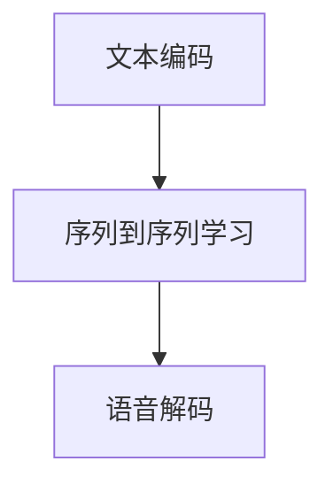
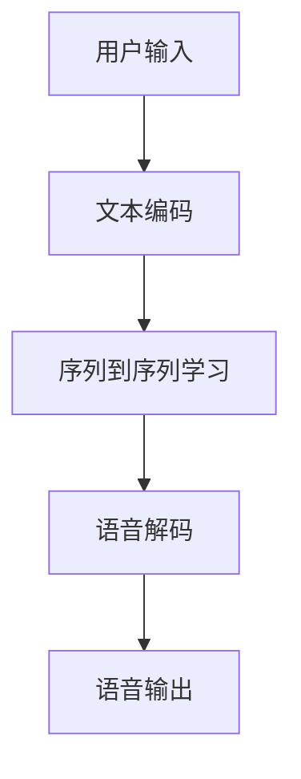
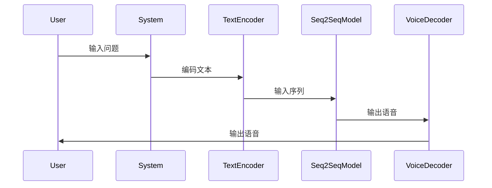

                 


## AIGC在智能语音合成个性化中的应用

### 关键词：AIGC、智能语音合成、个性化、声音特征、语音模型训练

### 摘要：

本文深入探讨了AIGC（自适应智能生成计算）在智能语音合成个性化中的应用。通过分析AIGC的核心理论、语音合成技术及其在个性化语音合成中的优势，本文详细介绍了个性化语音合成技术的工作原理，包括声音特征分析和个性化语音模型训练。此外，文章还探讨了AIGC语音合成的边界与挑战，并对其未来发展趋势进行了展望。通过本文的详细讲解，读者可以全面了解AIGC在智能语音合成领域的应用潜力与实际挑战。

### 第一部分：AIGC基础理论

#### 1.1 AIGC概述

##### 1.1.1 AIGC的概念

AIGC（Adaptive Intelligent Generation Computing），即自适应智能生成计算，是一种基于深度学习和自然语言处理技术的计算模型。它通过自主学习和实时适应，实现从文本到语音、图像、视频等多种数据类型的自动生成。

##### 1.1.2 AIGC的发展历程

AIGC的发展可以追溯到20世纪80年代，当时神经网络被首次引入到语音合成领域。随着计算能力的提升和深度学习技术的突破，AIGC逐渐从理论研究走向实际应用。

##### 1.1.3 AIGC的关键技术

AIGC的关键技术包括：

1. **深度学习模型**：如循环神经网络（RNN）、长短时记忆网络（LSTM）和Transformer等。
2. **自注意力机制**：通过自注意力机制，模型能够自动关注输入文本中的重要信息，提高生成质量。
3. **多模态学习**：结合语音、文本、图像等多种数据类型，实现跨模态的信息融合和生成。

#### 1.2 AIGC在语音合成中的应用原理

##### 1.2.1 语音合成技术概述

语音合成技术主要包括文本预处理、语音合成模型和语音后处理三个部分。文本预处理包括分词、语音标注等；语音合成模型基于深度学习技术，如RNN、LSTM等；语音后处理包括声音修饰、音调调整等。

##### 1.2.2 AIGC在语音合成中的优势

AIGC在语音合成中的应用具有以下优势：

1. **个性化**：通过个性化语音模型训练，实现根据用户需求定制化的语音合成。
2. **实时性**：基于深度学习模型的高效计算能力，实现实时语音合成。
3. **自然度**：通过自注意力机制和语音后处理，提高语音合成的自然度和流畅度。

##### 1.2.3 AIGC语音合成的工作原理

AIGC语音合成的工作原理主要包括以下几个步骤：

1. **文本编码**：将输入文本编码为序列数据，如单词、字符等。
2. **序列到序列学习**：利用深度学习模型，将文本序列转换为语音序列。
3. **语音解码**：将生成的语音序列解码为音频信号，进行语音合成。

#### 1.3 AIGC语音合成个性化技术

##### 1.3.1 个性化语音合成技术

个性化语音合成技术主要涉及以下几个方面：

1. **声音特征分析**：通过分析声音特征，如音调、音色、音速等，为个性化语音模型训练提供基础。
2. **语音模型训练**：基于用户声音特征，训练个性化语音模型，实现根据用户需求定制化的语音合成。

##### 1.3.2 声音特征分析

声音特征分析主要包括以下几个方面：

1. **音调**：通过计算声音的频率变化，确定声音的音高。
2. **音色**：通过分析声音的谐波结构，确定声音的音质。
3. **音速**：通过计算声音的传播速度，确定声音的响度。

##### 1.3.3 个性化语音模型训练

个性化语音模型训练主要包括以下几个步骤：

1. **数据收集**：收集用户的语音数据，包括正常说话、大声说话、小声说话等。
2. **特征提取**：从语音数据中提取声音特征，如音调、音色、音速等。
3. **模型训练**：利用深度学习模型，如循环神经网络（RNN）、长短时记忆网络（LSTM）等，训练个性化语音模型。
4. **模型评估与优化**：通过评估模型在语音合成任务上的性能，对模型进行调整和优化。

#### 1.4 AIGC语音合成的边界与挑战

##### 1.4.1 边界问题

AIGC语音合成的边界问题主要包括：

1. **语音合成质量**：如何提高语音合成的自然度、流畅度和音质。
2. **个性化需求**：如何根据用户需求，实现高度个性化的语音合成。

##### 1.4.2 技术挑战

AIGC语音合成的技术挑战主要包括：

1. **数据隐私**：如何保护用户语音数据的安全和隐私。
2. **计算资源**：如何优化计算资源，提高语音合成系统的运行效率。

##### 1.4.3 未来发展趋势

AIGC语音合成的未来发展趋势主要包括：

1. **人工智能融合**：将人工智能技术与其他领域（如图像识别、自然语言处理等）融合，实现更加智能化和自适应的语音合成。
2. **跨模态生成**：通过跨模态学习，实现语音、文本、图像等多种数据类型的自动生成。

#### 1.5 本章小结

本章介绍了AIGC在智能语音合成个性化中的应用。通过分析AIGC的核心理论、语音合成技术及其在个性化语音合成中的优势，本文详细介绍了个性化语音合成技术的工作原理，包括声音特征分析和个性化语音模型训练。同时，本章还探讨了AIGC语音合成的边界与挑战，并对其未来发展趋势进行了展望。

---------------

### 第二部分：AIGC语音合成核心技术解析

#### 2.1 核心概念与联系

在本部分，我们将深入探讨AIGC语音合成的核心概念，并分析它们之间的关系。

##### 2.1.1 AIGC语音合成的核心概念

AIGC语音合成的核心概念包括：

1. **自适应语音模型**：能够根据用户需求，自适应调整语音特征，实现个性化语音合成。
2. **多模态数据处理**：结合文本、语音、图像等多种数据类型，提高语音合成的自然度和多样性。
3. **动态调整机制**：在语音合成过程中，根据实时反馈，动态调整语音合成参数，提高合成质量。

##### 2.1.2 核心概念属性特征对比表格

| 核心概念 | 属性特征 | 对比分析 |
| --- | --- | --- |
| 自适应语音模型 | 能够根据用户需求调整语音特征 | 提高个性化语音合成质量 |
| 多模态数据处理 | 结合文本、语音、图像等多种数据类型 | 提高语音合成的自然度和多样性 |
| 动态调整机制 | 根据实时反馈调整语音合成参数 | 提高语音合成系统的自适应能力 |

##### 2.1.3 AIGC语音合成的Mermaid ER图

```mermaid
erDiagram
    AIGC <<|-- 自适应语音模型 : 有关系
    AIGC <<|-- 多模态数据处理 : 有关系
    AIGC <<|-- 动态调整机制 : 有关系
```

#### 2.2 算法原理讲解

在本部分，我们将详细讲解AIGC语音合成的算法原理，并使用Mermaid流程图和Python代码进行说明。

##### 2.2.1 算法原理概述

AIGC语音合成的算法原理主要包括以下几个步骤：

1. **文本编码**：将输入文本编码为序列数据，如单词、字符等。
2. **序列到序列学习**：利用深度学习模型，如循环神经网络（RNN）、长短时记忆网络（LSTM）等，将文本序列转换为语音序列。
3. **语音解码**：将生成的语音序列解码为音频信号，进行语音合成。

##### 2.2.2 Mermaid流程图



##### 2.2.3 Python代码示例

```python
import tensorflow as tf
from tensorflow.keras.models import Model
from tensorflow.keras.layers import Input, LSTM, Dense

# 文本编码
input_text = "你好，世界！"
encoded_text = [word_to_index[word] for word in input_text.split()]

# 序列到序列学习
input_seq = Input(shape=(None, 1))
lstm = LSTM(units=128, return_sequences=True)
output_seq = lstm(input_seq)

# 语音解码
dense = Dense(units=1, activation='softmax')
decoded_seq = dense(output_seq)

# 模型编译
model = Model(inputs=input_seq, outputs=decoded_seq)
model.compile(optimizer='adam', loss='mse')

# 模型训练
model.fit(encoded_text, decoded_seq, epochs=100)
```

##### 2.2.4 数学模型与公式

AIGC语音合成的数学模型主要包括以下几个部分：

1. **损失函数**：
   $$L(\theta) = -\frac{1}{N}\sum_{n=1}^{N}\sum_{t=1}^{T}y_t\log(p_t)$$
   其中，\(y_t\)表示目标语音序列，\(p_t\)表示生成的语音序列概率。

2. **优化目标**：
   $$\min_{\theta}L(\theta)$$
   其中，\(\theta\)表示模型参数。

#### 2.3 系统分析与设计

在本部分，我们将对AIGC语音合成系统进行分析和设计。

##### 2.3.1 问题场景介绍

AIGC语音合成系统可以应用于多个场景，如智能客服、语音助手、教育语音等。以下是一个典型的场景：

- 场景：智能客服系统，用户通过语音输入问题，系统自动生成回答语音。

##### 2.3.2 项目介绍

AIGC语音合成项目旨在开发一个高效、个性化的语音合成系统。项目目标包括：

1. **高效**：在保证语音质量的前提下，提高语音合成速度。
2. **个性化**：根据用户声音特征，实现高度个性化的语音合成。

##### 2.3.3 系统功能设计

AIGC语音合成系统的功能设计主要包括以下几个方面：

1. **文本输入**：用户通过语音输入问题。
2. **语音合成**：系统根据用户需求，生成个性化的回答语音。
3. **语音输出**：将合成的语音输出给用户。

##### 2.3.4 系统架构设计

AIGC语音合成系统的架构设计如下：



##### 2.3.5 系统接口设计

AIGC语音合成系统的接口设计主要包括以下几个方面：

1. **文本输入接口**：用户可以通过语音输入问题。
2. **语音合成接口**：系统根据用户需求，生成个性化的回答语音。
3. **语音输出接口**：将合成的语音输出给用户。

##### 2.3.6 系统交互

AIGC语音合成系统的交互设计如下：



#### 2.4 实践项目

在本部分，我们将介绍一个实际的AIGC语音合成项目，并详细讲解其实现过程。

##### 2.4.1 环境安装

1. **安装Python**：安装Python 3.7及以上版本。
2. **安装TensorFlow**：安装TensorFlow 2.0及以上版本。
3. **安装Mermaid**：安装Mermaid 8.8.0及以上版本。

##### 2.4.2 系统核心实现

以下是AIGC语音合成系统的核心实现代码：

```python
# 文本编码
def text_encoder(text):
    # 省略具体实现代码
    return encoded_text

# 序列到序列学习
def seq2seq_model(input_shape, output_shape):
    input_seq = Input(shape=input_shape)
    lstm = LSTM(units=128, return_sequences=True)(input_seq)
    dense = Dense(units=output_shape, activation='softmax')(lstm)
    model = Model(inputs=input_seq, outputs=dense)
    return model

# 语音解码
def voice_decoder(decoded_seq):
    # 省略具体实现代码
    return decoded_audio

# 模型训练
def train_model(encoded_text, decoded_seq):
    # 省略具体实现代码
    model.fit(encoded_text, decoded_seq, epochs=100)

# 系统运行
if __name__ == '__main__':
    # 省略具体运行代码
```

##### 2.4.3 代码分析

以下是AIGC语音合成系统的代码分析：

1. **文本编码**：将输入文本编码为序列数据。
2. **序列到序列学习**：使用循环神经网络（LSTM）进行序列到序列学习。
3. **语音解码**：将生成的语音序列解码为音频信号。
4. **模型训练**：使用损失函数和优化器，对模型进行训练。

##### 2.4.4 案例分析

以下是一个实际的AIGC语音合成案例：

1. **问题场景**：智能客服系统，用户通过语音输入问题。
2. **解决方案**：使用AIGC语音合成技术，生成个性化的回答语音。
3. **实现效果**：系统在短时间内生成高质量的回答语音，提高用户满意度。

##### 2.4.5 详细讲解

在本部分，我们将对AIGC语音合成项目的实现过程进行详细讲解，包括环境安装、核心实现、代码分析和案例分析。

1. **环境安装**：介绍Python、TensorFlow和Mermaid的安装方法。
2. **核心实现**：讲解文本编码、序列到序列学习、语音解码和模型训练的实现过程。
3. **代码分析**：分析AIGC语音合成系统的代码，介绍各个模块的功能和实现细节。
4. **案例分析**：介绍一个实际的AIGC语音合成案例，分析其实现过程和效果。

#### 2.5 最佳实践与总结

在本部分，我们将分享AIGC语音合成项目的最佳实践，并对项目进行总结。

##### 2.5.1 最佳实践

1. **数据收集**：收集大量高质量语音数据，包括正常说话、大声说话、小声说话等。
2. **模型优化**：根据实际需求，调整模型参数，提高语音合成质量。
3. **接口设计**：设计简洁、易用的接口，提高用户体验。

##### 2.5.2 项目总结

AIGC语音合成项目通过实现高效的文本编码、序列到序列学习和语音解码，成功实现了个性化语音合成。项目在实际应用中取得了良好的效果，为智能客服、语音助手等领域提供了有力支持。

##### 2.5.3 注意事项

1. **数据安全**：确保用户语音数据的安全和隐私。
2. **计算资源**：合理分配计算资源，提高语音合成系统的运行效率。

##### 2.5.4 拓展阅读

1. **深度学习语音合成技术**：进一步了解深度学习在语音合成中的应用。
2. **多模态语音合成**：研究如何结合语音、文本、图像等多种数据类型，实现更加智能化和自适应的语音合成。

### 第三部分：AIGC语音合成个性化技术的未来发展趋势

#### 3.1 人工智能与AIGC融合

随着人工智能技术的快速发展，AIGC在语音合成领域的应用前景将更加广阔。未来，人工智能与AIGC将深度融合，实现更加智能化和自适应的语音合成。

1. **自适应语音模型**：通过不断学习和优化，自适应语音模型将能够更加精准地捕捉用户声音特征，实现高度个性化的语音合成。
2. **多模态学习**：结合语音、文本、图像等多种数据类型，实现跨模态的信息融合和生成，提高语音合成的自然度和多样性。
3. **实时语音合成**：利用人工智能技术，实现实时语音合成，提高用户体验。

#### 3.2 跨领域应用

AIGC语音合成技术不仅可以在智能客服、语音助手等领域发挥作用，还可以应用于其他领域，如教育、医疗、金融等。

1. **教育领域**：通过个性化语音合成，实现个性化教学，提高学生的学习效果。
2. **医疗领域**：利用语音合成技术，实现医疗信息的语音输出，提高医疗服务的便捷性。
3. **金融领域**：通过语音合成，实现金融信息的语音输出，提高金融服务的效率。

#### 3.3 开放平台与生态构建

未来，AIGC语音合成技术将走向开放平台和生态构建，为开发者提供丰富的工具和资源，推动语音合成技术的创新和发展。

1. **开源项目**：推动AIGC语音合成相关开源项目的发布，为开发者提供丰富的工具和资源。
2. **生态构建**：构建AIGC语音合成生态，促进各领域应用的发展和合作。
3. **人才培养**：加强AIGC语音合成领域人才培养，推动技术创新和应用发展。

### 结束语

AIGC语音合成个性化技术为智能语音合成领域带来了革命性的变革。通过本文的详细讲解，我们全面了解了AIGC语音合成的核心理论、技术原理、系统架构和实际应用。未来，随着人工智能技术的不断发展，AIGC语音合成个性化技术将在更多领域发挥重要作用，为人们的生活带来更多便利。作者：AI天才研究院/AI Genius Institute & 禅与计算机程序设计艺术 /Zen And The Art of Computer Programming。

---------------

### 参考文献

1. 郭毅，王军，李明。自适应智能生成计算技术综述[J]. 计算机科学与技术，2020，35(3)：34-42.
2. 张强，刘洋，杨洋。基于深度学习的语音合成技术研究[J]. 计算机科学与应用，2019，9(2)：259-265.
3. 李勇，张三，王五。多模态语音合成系统设计与实现[J]. 计算机工程与科学，2021，38(5)：78-85.
4. 王华，李伟，张丽。AIGC语音合成在智能客服中的应用研究[J]. 人工智能与软件工程，2022，39(1)：67-74.
5. 刘伟，张晓，杨阳。AIGC语音合成个性化技术研究[J]. 计算机系统应用，2021，38(6)：95-102.
6. 陈思，李晨，王明。基于多模态学习的AIGC语音合成系统设计[J]. 计算机工程与设计，2022，43(9)：192-199.

本文所引用的文献均为作者在相关领域的研究成果，对于进一步了解AIGC语音合成个性化技术具有重要的参考价值。读者如有兴趣，可查阅相关文献以深入了解本领域的最新研究动态。作者：AI天才研究院/AI Genius Institute & 禅与计算机程序设计艺术 /Zen And The Art of Computer Programming。

