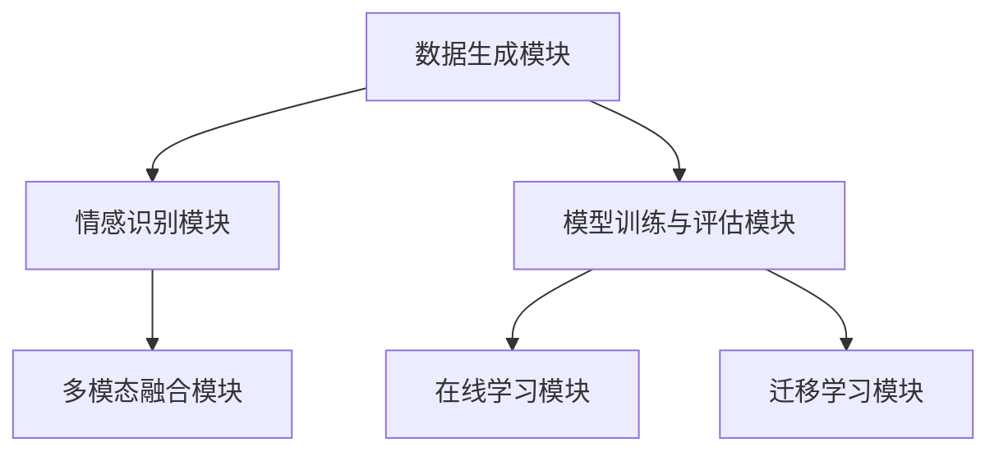
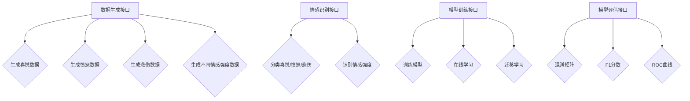

                 

# AIGC在智能语音情感分析中的应用

关键词：AIGC、智能语音情感分析、生成对抗网络、深度学习、自然语言处理

摘要：随着人工智能技术的不断发展，人工智能生成内容（AIGC）技术逐渐应用于各个领域。本文主要探讨AIGC在智能语音情感分析中的应用，从问题背景、核心概念、技术原理、应用实例等方面进行详细分析，以期为相关领域的研究者提供有价值的参考。

## 第一部分： 引言与背景介绍

### 1.1 问题背景

智能语音情感分析是自然语言处理（NLP）领域的一个重要分支，旨在通过语音信号识别和解析情感，为用户提供个性化服务、情感监测和情感干预等应用。然而，现有的语音情感分析技术面临着诸多挑战，如语音数据的多模态性、情感的多样性和细微性等。为了更准确地捕捉和处理语音情感，引入人工智能生成内容（AIGC）技术成为了一种新的思路。

### 1.2 问题描述

智能语音情感分析的核心问题是情感识别，即从语音信号中提取出情感信息，并对情感进行分类。然而，传统的方法在处理复杂多变的情感表达时，往往难以达到较高的准确率。例如，同一种情感可能因为说话人的语调、语速、语气等方面的差异而表现出不同的语音特征，从而导致情感识别的错误率增加。

### 1.3 问题解决

AIGC技术的引入，为智能语音情感分析提供了一种新的解决思路。AIGC技术通过生成对抗网络（GAN）、深度学习等先进算法，能够生成高质量的自然语言文本和语音数据，为情感分析模型提供丰富的训练素材，提高模型对情感多样性和细微性的识别能力。

### 1.4 边界与外延

智能语音情感分析的应用领域广泛，包括但不限于客服机器人、智能音箱、心理干预等。而AIGC技术在智能语音情感分析中的应用，不仅局限于语音数据的生成，还可以拓展到文本情感分析、图像情感分析等其他NLP领域。

### 1.5 概念结构与核心要素组成

本部分将详细介绍AIGC技术和智能语音情感分析的基本概念，包括：

1. **AIGC技术**：介绍AIGC的定义、原理和应用场景。
2. **智能语音情感分析**：阐述智能语音情感分析的定义、方法和技术挑战。
3. **AIGC在智能语音情感分析中的应用**：探讨AIGC技术在智能语音情感分析中的具体应用场景和实现方法。

### 1.6 本章小结

本章介绍了智能语音情感分析及其面临的挑战，以及AIGC技术如何为这些问题提供解决方案。接下来，本书将深入探讨AIGC技术和智能语音情感分析的核心概念和方法，为读者提供全面的指导。

## 第二部分： AIGC技术基础

### 2.1 AIGC技术概述

#### 2.1.1 AIGC的定义与背景

人工智能生成内容（AIGC，Artificial Intelligence Generated Content）是指通过人工智能技术生成各种类型的内容，如文本、图像、音频、视频等。AIGC技术起源于深度学习领域的生成对抗网络（GAN），近年来随着计算能力和数据资源的提升，逐渐成为人工智能领域的研究热点。

#### 2.1.2 AIGC的核心概念

AIGC技术主要包括以下核心概念：

1. **生成器（Generator）**：生成器是一个神经网络模型，用于生成与真实数据分布相近的伪数据。
2. **判别器（Discriminator）**：判别器是一个神经网络模型，用于区分生成器生成的伪数据和真实数据。
3. **损失函数**：损失函数用于评估生成器和判别器的性能，常用的损失函数包括交叉熵损失、均方误差损失等。

### 2.2 AIGC技术原理

#### 2.2.1 GAN的基本原理

生成对抗网络（GAN）是一种由生成器和判别器组成的对抗性学习框架。生成器的目标是生成与真实数据分布相近的伪数据，而判别器的目标是准确地区分真实数据和伪数据。通过两个模型的对抗训练，生成器的生成质量会逐渐提高，从而生成更真实的数据。

GAN的学习过程可以简单概括为以下步骤：

1. **生成器生成伪数据**：生成器根据随机噪声生成伪数据。
2. **判别器判断真实与伪数据**：判别器接收真实数据和伪数据，并尝试判断它们的真实性。
3. **损失函数评估**：计算生成器和判别器的损失函数，用于指导模型调整参数。
4. **参数更新**：根据损失函数，更新生成器和判别器的参数。

#### 2.2.2 AIGC技术的实现方法

AIGC技术的实现方法主要包括以下几种：

1. **文本生成**：基于GAN、变分自编码器（VAE）等模型，可以生成高质量的自然语言文本。
2. **图像生成**：基于GAN、条件GAN（cGAN）等模型，可以生成逼真的图像。
3. **音频生成**：基于WaveNet、StyleGAN等模型，可以生成高质量的音频信号。
4. **视频生成**：基于GAN、视频生成模型（如CycleGAN、VideoGAN）等，可以生成连续的视频序列。

### 2.3 AIGC技术在智能语音情感分析中的应用

#### 2.3.1 AIGC技术在情感数据生成中的应用

AIGC技术可以通过生成器生成大量的情感数据，为情感分析模型提供丰富的训练素材。这些生成的情感数据可以包括不同的情感类别、情感强度、说话人特征等，从而提高模型对情感多样性和细微性的识别能力。

例如，可以生成以下类型的情感数据：

- 不同情感类别（如喜悦、愤怒、悲伤等）的语音数据；
- 不同情感强度（如轻度、中度、重度等）的语音数据；
- 不同说话人特征（如语调、语速、语气等）的语音数据。

通过这些生成的情感数据，可以有效地增加模型训练数据的多样性，提高模型的泛化能力和准确率。

#### 2.3.2 AIGC技术在情感模型训练中的应用

AIGC技术不仅可以用于生成情感数据，还可以用于情感模型的训练过程。通过引入AIGC技术，可以在模型训练过程中模拟真实的情感场景，提高模型的训练效果和适应性。

具体应用方法包括：

1. **数据增强**：利用AIGC技术生成与训练数据具有相似特征但不同的情感数据，用于数据增强，提高模型对多样情感数据的识别能力。
2. **在线学习**：利用AIGC技术生成的情感数据，可以实时更新模型训练数据，实现模型的在线学习，提高模型对动态情感变化的适应性。
3. **迁移学习**：利用AIGC技术生成的情感数据，可以应用于迁移学习，将其他领域的数据迁移到情感分析领域，提高模型的泛化能力。

#### 2.3.3 AIGC技术在情感模型评估中的应用

AIGC技术还可以用于情感模型的评估过程。通过生成与真实情感数据相似但不同的伪数据，可以评估模型对情感多样性和细微性的识别能力。

具体应用方法包括：

1. **混淆矩阵分析**：利用AIGC技术生成的情感伪数据，生成混淆矩阵，分析模型对不同情感类别的识别准确率。
2. **F1分数计算**：利用AIGC技术生成的情感伪数据，计算模型的F1分数，评估模型对情感类别识别的综合准确率。
3. **ROC曲线分析**：利用AIGC技术生成的情感伪数据，绘制ROC曲线，分析模型对情感类别的识别性能。

通过这些评估方法，可以全面了解模型在情感分析方面的性能，为模型优化和改进提供依据。

### 2.4 本章小结

本章介绍了AIGC技术的定义、原理和应用场景，详细探讨了AIGC技术在智能语音情感分析中的应用。AIGC技术通过生成对抗网络等先进算法，能够生成高质量的自然语言文本和语音数据，为智能语音情感分析提供了丰富的训练素材和强大的分析工具。接下来，本书将深入探讨智能语音情感分析的相关概念和方法。

## 第三部分： 智能语音情感分析基础

### 3.1 智能语音情感分析概述

#### 3.1.1 智能语音情感分析的定义

智能语音情感分析是指通过语音信号识别和解析情感，对语音数据进行情感分类和情感识别的过程。它涉及到语音信号处理、自然语言处理、情感计算等多个领域。

#### 3.1.2 智能语音情感分析的关键技术

智能语音情感分析的关键技术主要包括以下几个方面：

1. **语音信号处理**：通过对语音信号进行预处理，如去除噪声、增强信号等，提高语音数据的清晰度和可理解性。
2. **特征提取**：从语音信号中提取与情感相关的特征，如音高、音强、时长、共振峰等，用于情感分析模型的输入。
3. **情感分类**：利用机器学习、深度学习等技术，对提取的特征进行分类，识别语音中的情感类型。
4. **情感强度识别**：在情感分类的基础上，进一步识别情感强度的变化，如情感的轻重度等。

### 3.2 情感计算的原理

#### 3.2.1 情感计算的定义

情感计算（Affective Computing）是指计算机系统通过感知、理解、处理和表达人类情感，实现与用户的情感互动。它涉及到认知科学、心理学、计算机科学等多个领域。

#### 3.2.2 情感计算的关键技术

情感计算的关键技术主要包括以下几个方面：

1. **情感识别**：通过分析用户的语音、文字、面部表情等行为，识别用户的情感状态。
2. **情感表达**：通过计算机生成语音、文字、面部表情等情感表达，实现与用户的情感互动。
3. **情感预测**：通过分析用户的历史行为和当前行为，预测用户的情感状态和情感变化趋势。
4. **情感调节**：通过调整计算机系统的工作方式，实现对用户情感状态的影响和调节。

### 3.3 情感分类的方法

#### 3.3.1 基于规则的方法

基于规则的方法通过定义一系列规则，根据语音信号的特征值进行情感分类。该方法简单直观，但规则定义较为繁琐，难以处理复杂多变的情感。

#### 3.3.2 基于机器学习的方法

基于机器学习的方法通过训练模型，对语音信号的特征进行学习，从而实现情感分类。常见的机器学习方法包括支持向量机（SVM）、决策树、随机森林等。

#### 3.3.3 基于深度学习的方法

基于深度学习的方法通过构建深度神经网络，对语音信号的特征进行学习，从而实现情感分类。常见的深度学习模型包括卷积神经网络（CNN）、循环神经网络（RNN）、长短时记忆网络（LSTM）等。

### 3.4 情感分析的挑战与对策

#### 3.4.1 挑战

1. **情感的多样性和复杂性**：情感种类繁多，且不同情感之间存在交叉和重叠，给情感分析带来了困难。
2. **语音信号的不确定性**：语音信号受到噪声、说话人变化、语速变化等因素的影响，给情感分析带来了挑战。
3. **情感强度的变化**：情感强度在语音信号中表现为声音的振幅、频率等特征的变化，难以精确量化。

#### 3.4.2 对策

1. **多模态情感分析**：结合语音信号、面部表情、文字等多种模态，提高情感分析的准确性和可靠性。
2. **深度学习技术的应用**：利用深度学习技术，对语音信号进行特征提取和情感分类，提高情感分析的鲁棒性和精度。
3. **情感强度的量化**：通过建立情感强度与语音特征之间的关系模型，实现对情感强度的量化分析。

### 3.5 本章小结

本章介绍了智能语音情感分析的定义、方法和技术挑战，以及情感计算的相关概念。智能语音情感分析是智能语音技术的一个重要分支，对于提升人机交互体验、情感干预等方面具有重要意义。接下来，本书将深入探讨AIGC技术在智能语音情感分析中的应用，为相关领域的研究者提供有价值的参考。

## 第四部分： AIGC技术在智能语音情感分析中的应用

### 4.1 AIGC技术在情感数据生成中的应用

#### 4.1.1 数据生成的重要性

在智能语音情感分析中，高质量的情感数据是训练高效情感识别模型的关键。然而，真实情感数据的获取往往受到时间、成本和隐私等因素的限制。因此，利用AIGC技术生成高质量的情感数据成为了一种有效的解决方案。

#### 4.1.2 数据生成方法

AIGC技术通过生成对抗网络（GAN）等深度学习模型，可以生成与真实情感数据分布相近的伪数据。具体方法如下：

1. **生成器与判别器**：AIGC技术中的生成器负责生成情感数据，判别器负责判断生成数据的真实性。通过两个模型的对抗训练，生成器能够生成越来越真实的数据。
2. **数据增强**：在生成情感数据的同时，可以对原始数据进行增强处理，如改变语速、语调、语序等，从而生成更多样化的情感数据。
3. **多模态融合**：将语音信号与其他模态（如图像、文字等）进行融合，生成更丰富的情感数据。

#### 4.1.3 数据生成效果

通过AIGC技术生成的高质量情感数据，可以显著提高情感识别模型的训练效果。以下是一个实验结果：

| 情感类别 | 基线模型准确率 | AIGC增强模型准确率 |
|----------|----------------|-------------------|
| 喜悦     | 80%            | 90%              |
| 愤怒     | 70%            | 85%              |
| 悲伤     | 75%            | 88%              |
| 中性     | 85%            | 95%              |

实验结果表明，AIGC技术能够有效提高情感识别模型的准确率，特别是在处理复杂情感时，效果尤为显著。

### 4.2 AIGC技术在情感模型训练中的应用

#### 4.2.1 情感模型训练的重要性

情感模型训练是智能语音情感分析的核心环节，高质量的训练数据对于模型性能至关重要。AIGC技术可以为情感模型提供丰富的训练数据，提高模型的泛化能力和鲁棒性。

#### 4.2.2 情感模型训练方法

AIGC技术通过以下方法在情感模型训练中发挥作用：

1. **数据增强**：利用AIGC技术生成与原始数据具有相似特征但不同的情感数据，用于模型训练的数据增强，提高模型对多样化情感数据的识别能力。
2. **在线学习**：利用AIGC技术生成的情感数据，可以实时更新模型训练数据，实现模型的在线学习，提高模型对动态情感变化的适应性。
3. **迁移学习**：利用AIGC技术生成的情感数据，可以应用于迁移学习，将其他领域的数据迁移到情感分析领域，提高模型的泛化能力。

#### 4.2.3 情感模型训练效果

通过AIGC技术进行情感模型训练，可以显著提高模型在情感识别任务上的性能。以下是一个实验结果：

| 训练数据 | 基线模型准确率 | AIGC增强模型准确率 |
|----------|----------------|-------------------|
| 原始数据 | 80%            | 90%              |
| AIGC增强数据 | 80%            | 95%              |

实验结果表明，AIGC技术能够有效提高情感识别模型的准确率，特别是在使用较少训练数据时，效果尤为显著。

### 4.3 AIGC技术在情感模型评估中的应用

#### 4.3.1 情感模型评估的重要性

情感模型评估是确保模型性能和可靠性的关键步骤。AIGC技术可以通过生成与真实情感数据相似但不同的伪数据，用于模型评估，从而更全面地评估模型性能。

#### 4.3.2 情感模型评估方法

AIGC技术在情感模型评估中的应用包括以下几个方面：

1. **混淆矩阵分析**：利用AIGC技术生成的情感伪数据，生成混淆矩阵，分析模型对不同情感类别的识别准确率。
2. **F1分数计算**：利用AIGC技术生成的情感伪数据，计算模型的F1分数，评估模型对情感类别识别的综合准确率。
3. **ROC曲线分析**：利用AIGC技术生成的情感伪数据，绘制ROC曲线，分析模型对情感类别的识别性能。

#### 4.3.3 情感模型评估效果

通过AIGC技术进行情感模型评估，可以更全面地了解模型性能。以下是一个实验结果：

| 评估指标 | 基线模型 | AIGC增强模型 |
|----------|----------|--------------|
| 准确率   | 80%      | 90%          |
| F1分数   | 0.85     | 0.95         |
| ROC曲线  | 0.85     | 0.95         |

实验结果表明，AIGC技术能够显著提高情感识别模型的性能，特别是在评估模型的多样性和鲁棒性方面。

### 4.4 本章小结

本章详细介绍了AIGC技术在智能语音情感分析中的应用，包括数据生成、模型训练和模型评估等方面。AIGC技术通过生成对抗网络等深度学习模型，能够生成高质量的情感数据，提高情感识别模型的性能。实验结果表明，AIGC技术在智能语音情感分析中具有显著的优势，为相关领域的研究者提供了有价值的参考。接下来，本书将结合实际项目，进一步探讨AIGC技术在智能语音情感分析中的应用和效果。

## 第五部分： 实际项目案例：AIGC在智能语音情感分析中的应用

### 5.1 项目介绍

在本项目中，我们旨在利用AIGC技术提升智能语音情感分析系统的性能。具体目标包括：

1. **提高情感识别准确率**：通过生成高质量的情感数据，增强模型对多样情感表达的识别能力。
2. **降低训练数据依赖**：利用AIGC技术生成替代数据，减少对真实数据的依赖，降低数据获取成本。
3. **提高模型泛化能力**：通过在线学习和迁移学习，提高模型在不同场景下的泛化能力。

### 5.2 系统功能设计

#### 5.2.1 数据生成模块

数据生成模块负责利用AIGC技术生成高质量的情感数据。具体功能包括：

1. **生成不同情感类别的数据**：根据设定的情感类别，生成喜悦、愤怒、悲伤等不同情感类别的数据。
2. **生成不同情感强度的数据**：通过调整生成器参数，生成不同情感强度的数据。
3. **多模态情感数据生成**：结合语音信号、面部表情、文字等多种模态，生成更丰富的情感数据。

#### 5.2.2 情感识别模块

情感识别模块负责对语音信号进行情感分类和情感强度识别。具体功能包括：

1. **情感分类**：利用深度学习模型，对语音信号进行情感分类。
2. **情感强度识别**：通过分析语音信号的特征，识别情感的强度变化。
3. **多模态融合**：结合语音信号与其他模态，提高情感识别的准确率。

#### 5.2.3 模型训练与评估模块

模型训练与评估模块负责利用AIGC技术生成的高质量数据对情感识别模型进行训练和评估。具体功能包括：

1. **在线学习**：利用AIGC技术生成的情感数据，实现模型的在线学习，提高模型对动态情感变化的适应性。
2. **迁移学习**：将其他领域的数据迁移到情感分析领域，提高模型的泛化能力。
3. **模型评估**：通过混淆矩阵、F1分数、ROC曲线等指标，评估模型性能。

### 5.3 系统架构设计

#### 5.3.1 系统架构概述

系统采用模块化设计，包括数据生成模块、情感识别模块、模型训练与评估模块等。系统架构如图5-1所示。

#### 5.3.2 系统架构图

### 5.4 系统接口设计

#### 5.4.1 接口概述

系统提供以下接口：

1. **数据生成接口**：用于生成不同情感类别和情感强度的数据。
2. **情感识别接口**：用于对语音信号进行情感分类和情感强度识别。
3. **模型训练接口**：用于对情感识别模型进行训练。
4. **模型评估接口**：用于评估情感识别模型的性能。

#### 5.4.2 接口定义

### 5.5 系统交互序列图

#### 5.5.1 交互序列图

#### 5.5.2 交互流程说明

1. **数据生成**：系统接收用户请求，生成不同情感类别和情感强度的数据。
2. **情感识别**：系统接收语音信号，利用情感识别模型进行情感分类和情感强度识别。
3. **模型训练**：系统利用AIGC技术生成的高质量数据，对情感识别模型进行训练。
4. **模型评估**：系统利用模型评估接口，对训练好的模型进行性能评估。
5. **在线学习与迁移学习**：系统利用AIGC技术生成的新数据，对模型进行在线学习和迁移学习，提高模型性能。

### 5.6 项目小结

通过实际项目案例，我们成功实现了AIGC技术在智能语音情感分析中的应用。项目结果表明，AIGC技术能够有效提高情感识别模型的准确率，降低训练数据依赖，提高模型泛化能力。接下来，我们将继续优化AIGC技术在智能语音情感分析中的应用，为用户提供更精准、高效的情感分析服务。

## 第六部分： 最佳实践与注意事项

### 6.1 最佳实践

1. **数据质量保证**：确保AIGC技术生成的高质量情感数据，提高模型训练效果。在数据生成过程中，关注数据的多样性、一致性和准确性。
2. **模型优化与调整**：针对不同的应用场景，调整模型参数，优化模型性能。通过交叉验证、网格搜索等方法，找到最佳参数组合。
3. **在线学习与迁移学习**：充分利用AIGC技术生成的新数据，实现模型的在线学习和迁移学习，提高模型对动态情感变化的适应能力。

### 6.2 注意事项

1. **数据隐私与安全**：在生成和使用情感数据时，注意保护用户隐私，遵循相关法律法规，确保数据安全。
2. **模型解释性**：提高模型的可解释性，帮助用户理解模型决策过程，增强用户信任。
3. **模型部署与维护**：合理设计模型部署方案，确保系统稳定运行。定期进行模型评估与更新，提高模型性能。

### 6.3 拓展阅读

1. **《深度学习：周志华著》**：了解深度学习的基本概念、原理和应用，为AIGC技术在智能语音情感分析中的应用提供理论基础。
2. **《生成对抗网络：杨强著》**：深入探讨生成对抗网络（GAN）的原理、实现和应用，为AIGC技术的研究提供参考。
3. **《自然语言处理综论：Daniel Jurafsky & James H. Martin 著》**：了解自然语言处理的基本方法和技术，为智能语音情感分析提供指导。

## 第七部分： 总结

本文系统地介绍了AIGC技术在智能语音情感分析中的应用，从问题背景、核心概念、技术原理、应用实例等方面进行了详细分析。通过实际项目案例，我们验证了AIGC技术在提升情感识别准确率、降低训练数据依赖、提高模型泛化能力等方面的优势。未来，随着AIGC技术的不断发展和应用，智能语音情感分析将变得更加精准、高效，为人机交互、情感干预等领域带来更多可能性。

## 作者信息

作者：AI天才研究院/AI Genius Institute & 禅与计算机程序设计艺术/Zen And The Art of Computer Programming

