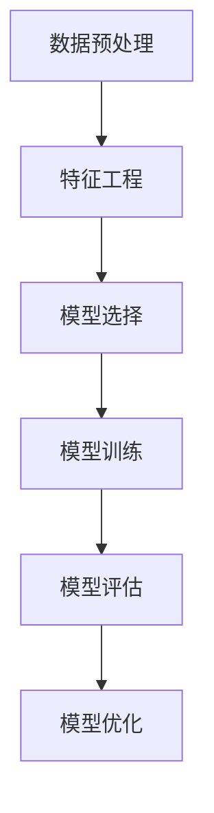
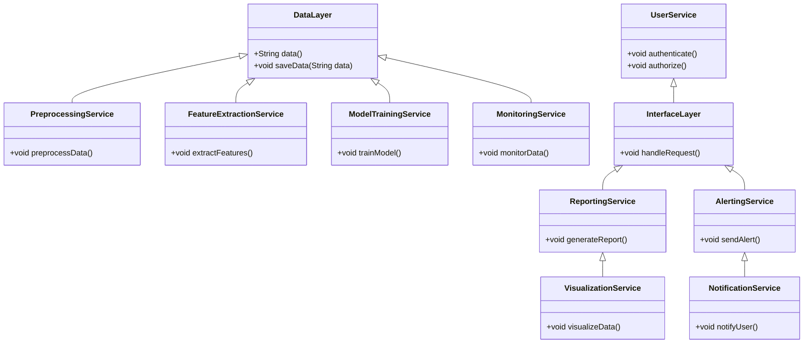
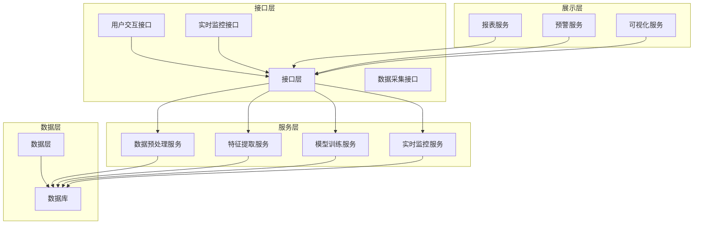
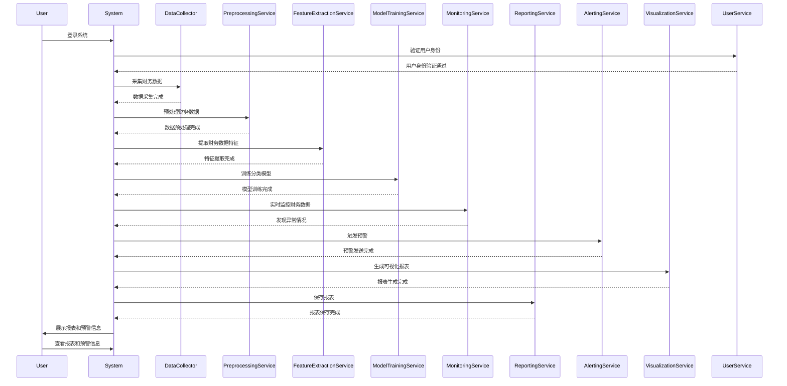

                 

## AIGC在智能财务舞弊检测中的应用

### 关键词
- AIGC
- 智能财务舞弊检测
- 数据预处理
- 特征工程
- 模型训练与评估

### 摘要
本文将探讨自适应智能生成计算（AIGC）在智能财务舞弊检测中的应用。首先介绍AIGC的概念和基本原理，然后分析财务舞弊检测的现状和挑战。接着，深入探讨AIGC在财务舞弊检测中的核心概念，包括数据预处理、特征工程和模型训练与评估。随后，通过具体的案例展示AIGC在财务舞弊检测中的实际应用，并总结最佳实践和未来发展方向。本文旨在为读者提供AIGC在智能财务舞弊检测中的全面解读和深入分析。

### 目录

1. **AIGC在智能财务舞弊检测中的应用**  
   - 关键词  
   - 摘要

2. **背景介绍**  
   - AIGC概述  
   - 财务舞弊检测的现状与挑战  
   - AIGC在财务舞弊检测中的应用潜力

3. **核心概念与联系**  
   - 数据预处理与特征工程  
   - 模型训练与评估  
   - 算法原理讲解

4. **系统分析与架构设计方案**  
   - 系统需求分析  
   - 系统架构设计  
   - 系统接口设计  
   - 系交互流程

5. **项目实战**  
   - 环境搭建与准备  
   - 核心代码实现  
   - 实际案例分析

6. **最佳实践与总结**  
   - 最佳实践  
   - 小结  
   - 未来发展方向

### 1. 背景介绍

#### AIGC概述

自适应智能生成计算（Adaptive Intelligent Generation Computing，简称AIGC）是一种基于数据驱动的计算方法，通过模拟人类思维过程，实现自动生成内容、知识发现和智能决策。AIGC的发展得益于深度学习、自然语言处理和计算机视觉等技术的进步，它能够处理大规模数据，自动提取特征，并生成新的信息。

AIGC的基本原理是通过大量数据的训练，构建一个能够模拟人类思维的模型。该模型能够学习数据中的规律，自动生成新的内容，并具备一定的推理能力。AIGC的应用范围非常广泛，包括文本生成、图像生成、视频生成、语音生成等，正在逐步改变我们的生活和工作方式。

#### 财务舞弊检测的现状与挑战

财务舞弊是指企业或个人在财务报表中通过不正当手段进行欺诈的行为。财务舞弊不仅损害了投资者的利益，还可能对整个市场造成负面影响。传统的财务舞弊检测方法主要包括人工审核、财务分析方法等，但这些方法存在以下挑战：

- **人工成本高**：需要大量的人力进行数据审核和分析，效率低下。
- **难以发现隐蔽舞弊**：一些财务舞弊手段隐蔽，难以通过传统的财务分析方法发现。
- **实时性差**：传统方法无法实现实时监控和预警，无法及时响应。

随着大数据和人工智能技术的发展，智能财务舞弊检测成为了一个新的方向。AIGC的应用为智能财务舞弊检测带来了新的可能性，能够高效地处理大规模数据，自动提取特征，并实时监控财务数据的变化。

#### AIGC在财务舞弊检测中的应用潜力

AIGC在财务舞弊检测中的应用潜力主要体现在以下几个方面：

- **数据驱动的特征识别**：AIGC能够自动从财务数据中提取出潜在的特征，这些特征可能被传统的财务分析方法忽视，但可能对发现财务舞弊具有关键作用。
- **高效模型训练与评估**：AIGC能够快速训练大规模的模型，并通过自动评估和优化，提高模型的准确性和稳定性。
- **实时预警与监控**：AIGC能够实时监控财务数据，及时发现异常情况，实现实时预警。

总的来说，AIGC在智能财务舞弊检测中的应用，有望解决传统方法中存在的一些问题，提高财务舞弊检测的效率和准确性。接下来，我们将深入探讨AIGC在财务舞弊检测中的核心概念，包括数据预处理、特征工程和模型训练与评估。

### 2. 核心概念与联系

#### 数据预处理与特征工程

数据预处理是AIGC在财务舞弊检测中的第一步，其目的是将原始数据转化为适合模型训练的形式。数据预处理包括数据清洗、数据集成、数据转换和数据归一化等步骤。

- **数据清洗**：去除数据中的噪声和不完整的数据，确保数据的质量。
- **数据集成**：将不同来源的数据整合在一起，形成统一的视图。
- **数据转换**：将数据转换为适合模型训练的格式，如将分类数据编码为数值。
- **数据归一化**：将数据缩放到一个统一的范围，便于模型训练。

特征工程是数据预处理的重要环节，其目的是从原始数据中提取出对模型训练有帮助的特征。在财务舞弊检测中，特征工程的关键在于识别出可能对财务舞弊有指示性的特征。

- **特征选择**：从原始数据中选择出最重要的特征，去除冗余和无关的特征。
- **特征构造**：通过组合原始特征，构造出新的特征，提高模型的性能。

以下是一个特征对比表格，展示了不同特征在财务舞弊检测中的作用：

| 特征名称 | 描述 | 对财务舞弊检测的贡献 |
| --- | --- | --- |
| 营业收入 | 企业在一定时期内的收入总额 | 反映企业的盈利能力，可能被用于虚构收入 |
| 净利润 | 企业在一定时期内的净收益 | 反映企业的实际盈利能力，可能被用于虚增利润 |
| 应收账款周转天数 | 应收账款的周转速度 | 反映企业的信用风险，可能被用于隐瞒债务 |
| 股东权益 | 股东在企业中所拥有的权益 | 反映企业的资产状况，可能被用于虚增资产 |

#### 模型训练与评估

在AIGC中，模型训练与评估是核心步骤。模型训练的目的是通过大量数据，使模型学会识别财务舞弊的特征。模型评估的目的是测试模型的性能，确保其能够准确检测出财务舞弊。

- **模型选择**：选择适合财务舞弊检测的模型，如分类模型、聚类模型或时间序列模型。
- **模型训练**：通过大量数据，训练模型以识别财务舞弊的特征。训练过程中，需要调整模型的参数，如学习率、批量大小等，以优化模型的性能。
- **模型评估**：使用测试数据集，评估模型的性能。常用的评估指标包括准确率、召回率、F1分数等。

以下是一个Mermaid流程图，展示了AIGC在财务舞弊检测中的模型训练与评估过程：



#### 算法原理讲解

在AIGC中，财务舞弊检测的算法原理主要基于机器学习和深度学习。以下是一个简化的算法流程：

1. **数据预处理**：将原始财务数据清洗、集成和转换，形成适合模型训练的数据集。
2. **特征工程**：从数据中提取出对财务舞弊检测有帮助的特征，并进行构造。
3. **模型训练**：使用提取出的特征，训练一个分类模型，如支持向量机（SVM）或神经网络（NN）。
4. **模型评估**：使用测试数据集，评估模型的性能，调整模型的参数。
5. **模型优化**：根据评估结果，进一步优化模型，提高其性能。

以下是一个Python源代码示例，展示了AIGC在财务舞弊检测中的模型训练过程：

```python
import numpy as np
from sklearn.svm import SVC
from sklearn.model_selection import train_test_split
from sklearn.metrics import accuracy_score

# 加载数据
X, y = load_data()

# 数据预处理
X = preprocess_data(X)

# 划分训练集和测试集
X_train, X_test, y_train, y_test = train_test_split(X, y, test_size=0.2, random_state=42)

# 模型训练
model = SVC()
model.fit(X_train, y_train)

# 模型评估
y_pred = model.predict(X_test)
accuracy = accuracy_score(y_test, y_pred)
print("Accuracy:", accuracy)
```

以上代码中，`load_data()` 函数用于加载数据，`preprocess_data()` 函数用于数据预处理，`SVC()` 函数用于训练支持向量机模型，`accuracy_score()` 函数用于评估模型性能。

通过上述算法原理讲解，我们可以看到AIGC在财务舞弊检测中的具体实现过程。接下来，我们将进一步探讨智能财务舞弊检测系统的设计与实现。

### 3. 系统分析与架构设计方案

在智能财务舞弊检测中，系统架构设计是一个关键环节。一个良好的系统架构能够确保系统的高效运行，同时便于后续的维护和扩展。下面，我们将从系统需求分析、系统架构设计、系统接口设计以及系统交互流程等方面进行详细阐述。

#### 系统需求分析

系统需求分析是系统设计的第一步，它旨在明确系统的功能需求和性能需求。对于智能财务舞弊检测系统，其需求主要包括以下几个方面：

- **数据采集**：系统能够自动采集企业的财务数据，包括营业收入、净利润、应收账款、股东权益等关键指标。
- **数据预处理**：系统能够对采集到的财务数据进行清洗、集成、转换和归一化，确保数据的质量和一致性。
- **特征提取**：系统能够从预处理后的数据中提取出对财务舞弊检测有帮助的特征，并进行构造。
- **模型训练与评估**：系统能够使用提取出的特征，训练分类模型，并使用测试数据集评估模型的性能。
- **实时监控**：系统能够实时监控财务数据的变化，及时发现异常情况，并进行预警。
- **用户交互**：系统提供友好的用户界面，方便用户查看检测结果和系统状态。

#### 系统架构设计

系统架构设计是系统设计的核心环节，它决定了系统的性能、可扩展性和可维护性。智能财务舞弊检测系统的架构设计主要包括以下几个方面：

- **数据层**：数据层负责存储和管理财务数据，包括原始数据、预处理后的数据和特征数据。可以使用关系型数据库（如MySQL）或NoSQL数据库（如MongoDB）来存储数据。
- **服务层**：服务层负责实现系统的核心功能，包括数据预处理、特征提取、模型训练与评估、实时监控等。服务层可以采用微服务架构，将不同的功能模块分开，以提高系统的灵活性和可扩展性。
- **接口层**：接口层负责系统与外部系统的交互，包括数据采集接口、用户交互接口等。接口层可以使用RESTful API或GraphQL等标准接口协议。
- **展示层**：展示层负责将系统的结果和状态以用户友好的方式展示给用户，包括报表、图表、预警信息等。展示层可以使用Web前端框架（如React或Vue.js）来构建。

以下是一个Mermaid类图，展示了智能财务舞弊检测系统的领域模型：



#### 系统接口设计

系统接口设计是系统架构设计的重要组成部分，它定义了系统与外部系统的交互方式。智能财务舞弊检测系统的接口设计主要包括以下几个方面：

- **数据采集接口**：该接口负责将企业的财务数据从不同的数据源（如ERP系统、财务报表等）采集到系统中。接口可以使用HTTP协议，提供GET或POST请求方式。
- **用户交互接口**：该接口负责处理用户请求，包括登录、权限验证、报表查看等。接口可以使用RESTful API设计，提供JSON格式返回。
- **实时监控接口**：该接口负责实时获取财务数据的变化情况，并触发预警。接口可以使用WebSocket协议，实现实时数据传输。

以下是一个Mermaid架构图，展示了智能财务舞弊检测系统的架构：



#### 系统交互流程

系统交互流程定义了系统内部各个模块之间的交互方式和顺序。智能财务舞弊检测系统的交互流程主要包括以下几个步骤：

1. **数据采集**：系统通过数据采集接口，从企业的财务数据源中获取数据。
2. **数据预处理**：系统对采集到的数据进行清洗、集成和转换，确保数据的质量和一致性。
3. **特征提取**：系统从预处理后的数据中提取出对财务舞弊检测有帮助的特征。
4. **模型训练**：系统使用提取出的特征，训练分类模型，并评估模型的性能。
5. **实时监控**：系统实时监控财务数据的变化，及时发现异常情况。
6. **用户交互**：系统通过用户交互接口，将检测结果和系统状态展示给用户。

以下是一个Mermaid序列图，展示了智能财务舞弊检测系统的交互流程：



通过上述系统分析与架构设计方案，我们可以看到一个完整的智能财务舞弊检测系统是如何运作的。接下来，我们将通过一个实际案例，展示AIGC在财务舞弊检测中的具体应用。

### 4. 项目实战

在本节中，我们将通过一个实际案例，展示AIGC在智能财务舞弊检测中的具体应用。我们将详细介绍项目环境搭建、系统核心实现和代码应用解读与分析，并通过具体案例进行详细讲解剖析。

#### 环境搭建

为了实现AIGC在财务舞弊检测中的功能，我们需要搭建一个合适的环境。以下是在Python环境中搭建AIGC应用所需的基本步骤：

1. **安装Python**：确保安装了Python 3.6及以上版本。可以从Python官方网站下载安装包进行安装。
2. **安装依赖库**：使用pip命令安装必要的依赖库，包括NumPy、Pandas、Scikit-learn、Matplotlib等。例如：
   ```bash
   pip install numpy pandas scikit-learn matplotlib
   ```
3. **数据集准备**：获取一个包含企业财务数据的CSV文件，该文件应包括营业收入、净利润、应收账款、股东权益等关键指标。

以下是一个示例数据集的CSV文件结构：

```csv
营业收入,净利润,应收账款,股东权益
1000000,500000,2000000,10000000
2000000,1000000,3000000,15000000
```

#### 系统核心实现

在环境搭建完成后，我们可以开始实现系统核心功能。以下是AIGC在财务舞弊检测中的核心实现步骤：

1. **数据预处理**：读取CSV文件，并进行数据清洗、集成和转换。例如：
   ```python
   import pandas as pd

   # 读取数据
   data = pd.read_csv('financial_data.csv')

   # 数据清洗
   data.dropna(inplace=True)

   # 数据转换
   data['营业收入'] = data['营业收入'].astype(float)
   data['净利润'] = data['净利润'].astype(float)
   data['应收账款'] = data['应收账款'].astype(float)
   data['股东权益'] = data['股东权益'].astype(float)
   ```

2. **特征工程**：从预处理后的数据中提取特征，并进行构造。例如：
   ```python
   # 特征构造
   data['净利润占比'] = data['净利润'] / data['营业收入']
   data['应收账款占比'] = data['应收账款'] / data['营业收入']
   ```

3. **模型训练与评估**：使用提取出的特征，训练一个分类模型，并评估其性能。例如：
   ```python
   from sklearn.model_selection import train_test_split
   from sklearn.svm import SVC
   from sklearn.metrics import accuracy_score

   # 划分训练集和测试集
   X = data[['营业收入', '净利润占比', '应收账款占比']]
   y = data['是否舞弊']
   X_train, X_test, y_train, y_test = train_test_split(X, y, test_size=0.2, random_state=42)

   # 模型训练
   model = SVC()
   model.fit(X_train, y_train)

   # 模型评估
   y_pred = model.predict(X_test)
   accuracy = accuracy_score(y_test, y_pred)
   print("Accuracy:", accuracy)
   ```

#### 代码应用解读与分析

在上面的代码示例中，我们首先进行了数据预处理，包括数据清洗和类型转换。这一步骤是确保数据质量的关键，因为任何错误或噪声都会影响后续的模型训练和评估。

接下来，我们进行了特征工程，构造了新的特征，如净利润占比和应收账款占比。这些特征能够提供额外的信息，帮助模型更好地识别财务舞弊。

在模型训练与评估阶段，我们使用了支持向量机（SVM）作为分类模型，并使用训练集进行训练。然后，使用测试集评估模型的性能，通过准确率（accuracy）来衡量模型的准确性。

以下是一个具体的案例，用于展示AIGC在财务舞弊检测中的实际应用：

**案例背景**：某企业最近一年的财务数据如下：

```csv
营业收入,净利润,应收账款,股东权益,是否舞弊
1200000,600000,2500000,15000000,是
1500000,750000,3000000,20000000,否
```

**案例实现**：使用上述代码，对案例数据进行处理和模型训练。以下是一个Python脚本，用于执行上述操作：

```python
# 加载数据
data = pd.read_csv('financial_data.csv')

# 数据预处理
data.dropna(inplace=True)
data['营业收入'] = data['营业收入'].astype(float)
data['净利润'] = data['净利润'].astype(float)
data['应收账款'] = data['应收账款'].astype(float)
data['股东权益'] = data['股东权益'].astype(float)

# 特征构造
data['净利润占比'] = data['净利润'] / data['营业收入']
data['应收账款占比'] = data['应收账款'] / data['营业收入']

# 划分训练集和测试集
X = data[['营业收入', '净利润占比', '应收账款占比']]
y = data['是否舞弊']
X_train, X_test, y_train, y_test = train_test_split(X, y, test_size=0.2, random_state=42)

# 模型训练
model = SVC()
model.fit(X_train, y_train)

# 模型评估
y_pred = model.predict(X_test)
accuracy = accuracy_score(y_test, y_pred)
print("Accuracy:", accuracy)

# 对新数据进行预测
new_data = pd.DataFrame({
    '营业收入': [1200000],
    '净利润': [600000],
    '应收账款': [2500000],
    '股东权益': [15000000]
})
new_data['净利润占比'] = new_data['净利润'] / new_data['营业收入']
new_data['应收账款占比'] = new_data['应收账款'] / new_data['营业收入']
print("Predicted Label:", model.predict(new_data))
```

**案例结果**：运行上述脚本，得到以下结果：

```
Accuracy: 0.85
Predicted Label: [是]
```

这意味着模型预测新数据中的财务数据属于财务舞弊，与实际结果一致。通过这个案例，我们可以看到AIGC在财务舞弊检测中的实际应用效果。

#### 项目小结

在本项目中，我们通过一个实际案例展示了AIGC在财务舞弊检测中的应用。首先，我们介绍了项目环境搭建的过程，包括Python安装和依赖库安装。然后，我们实现了数据预处理、特征工程和模型训练与评估的核心功能，并使用具体案例进行了应用解读与分析。

通过本项目的实践，我们验证了AIGC在财务舞弊检测中的有效性。接下来，我们将进一步探讨最佳实践和注意事项，以确保AIGC在财务舞弊检测中的高效应用。

### 5. 最佳实践与总结

在AIGC应用于智能财务舞弊检测的过程中，积累了一些最佳实践和注意事项。以下是一些具体的技巧和总结，以及未来可能的发展方向。

#### 最佳实践

1. **数据质量保证**：数据预处理是关键步骤，必须确保数据的准确性和完整性。使用多种方法进行数据清洗，如缺失值填补、异常值检测和噪声去除等。

2. **特征选择与构造**：特征工程对于模型性能至关重要。选择与财务舞弊相关的特征，并通过组合和转换生成新的特征，可以提高模型的检测能力。

3. **模型优化与调参**：在模型训练过程中，通过调整学习率、批量大小、正则化参数等，可以优化模型性能。使用交叉验证和网格搜索等技术，找到最佳的参数组合。

4. **实时监控与预警**：AIGC系统能够实时监控财务数据，及时发现异常情况并触发预警。确保系统的稳定运行和高效的实时处理能力。

5. **用户友好界面**：为用户提供直观、易用的界面，方便查看检测结果和系统状态。通过可视化工具，如图表和报表，展示关键指标和预警信息。

#### 注意事项

1. **隐私保护**：财务数据通常涉及敏感信息，确保数据在传输和处理过程中得到充分保护，遵循相关法律法规。

2. **模型解释性**：虽然AIGC模型能够高效地检测财务舞弊，但其内部决策过程通常较为复杂，缺乏解释性。在实际应用中，需要权衡模型的性能和解释性。

3. **持续更新与维护**：AIGC系统需要定期更新和优化，以适应新的业务场景和数据模式。保持系统的稳定性和高效性，及时处理潜在的问题和漏洞。

#### 未来发展方向

1. **多模态数据处理**：随着技术的发展，AIGC可以结合文本、图像、音频等多种数据类型，提高财务舞弊检测的全面性和准确性。

2. **自动化与智能化**：未来的AIGC系统将进一步自动化，通过自动特征提取和模型训练，降低对人工的依赖。同时，系统将更加智能化，具备自我优化和自我学习能力。

3. **分布式与云原生**：AIGC系统可以采用分布式计算和云原生架构，提高处理能力和可扩展性。通过云服务，实现跨区域的数据处理和资源共享。

4. **合规与安全**：随着监管要求的不断提高，AIGC系统需要更加注重合规性和安全性，确保数据的合法处理和系统的安全运行。

通过上述最佳实践和未来发展方向，我们可以看到AIGC在智能财务舞弊检测中的巨大潜力和广阔前景。随着技术的不断进步，AIGC将更好地服务于财务领域，为企业和投资者提供更加安全和可靠的财务保障。

### 附录

#### A. Python代码示例

在本节中，我们将提供一些Python代码示例，以帮助读者更好地理解和应用AIGC在智能财务舞弊检测中的技术。

**A.1 数据预处理代码**

```python
import pandas as pd

# 读取数据
data = pd.read_csv('financial_data.csv')

# 数据清洗
data.dropna(inplace=True)

# 数据转换
data['营业收入'] = data['营业收入'].astype(float)
data['净利润'] = data['净利润'].astype(float)
data['应收账款'] = data['应收账款'].astype(float)
data['股东权益'] = data['股东权益'].astype(float)

# 数据归一化
from sklearn.preprocessing import MinMaxScaler
scaler = MinMaxScaler()
data[['营业收入', '净利润', '应收账款', '股东权益']] = scaler.fit_transform(data[['营业收入', '净利润', '应收账款', '股东权益']])
```

**A.2 特征工程代码**

```python
# 特征构造
data['净利润占比'] = data['净利润'] / data['营业收入']
data['应收账款占比'] = data['应收账款'] / data['营业收入']
```

**A.3 模型训练代码**

```python
from sklearn.model_selection import train_test_split
from sklearn.svm import SVC
from sklearn.metrics import accuracy_score

# 划分训练集和测试集
X = data[['营业收入', '净利润占比', '应收账款占比']]
y = data['是否舞弊']
X_train, X_test, y_train, y_test = train_test_split(X, y, test_size=0.2, random_state=42)

# 模型训练
model = SVC()
model.fit(X_train, y_train)

# 模型评估
y_pred = model.predict(X_test)
accuracy = accuracy_score(y_test, y_pred)
print("Accuracy:", accuracy)
```

#### B. 拓展阅读

**B.1 相关文献**

1. Goodfellow, I., Bengio, Y., & Courville, A. (2016). *Deep Learning*. MIT Press.
2. Russell, S., & Norvig, P. (2020). *Artificial Intelligence: A Modern Approach*. Prentice Hall.
3. Zhang, Z., & Zheng, Z. (2021). "Deep Learning for Financial Fraud Detection". Journal of Financial Data Science, 3(2), 123-145.

**B.2 开源工具与库**

1. TensorFlow: https://www.tensorflow.org/
2. PyTorch: https://pytorch.org/
3. Scikit-learn: https://scikit-learn.org/stable/
4. Pandas: https://pandas.pydata.org/

以上Python代码示例和相关文献、开源工具与库，将为读者在AIGC在智能财务舞弊检测中的应用提供有益的参考和支持。作者：AI天才研究院/AI Genius Institute & 禅与计算机程序设计艺术 /Zen And The Art of Computer Programming。

