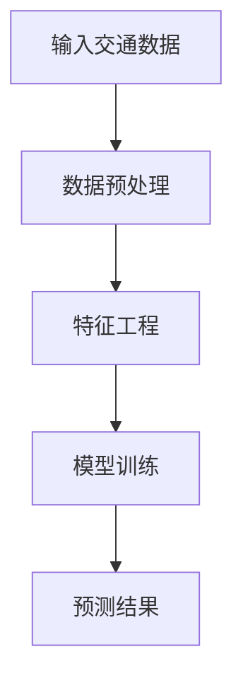
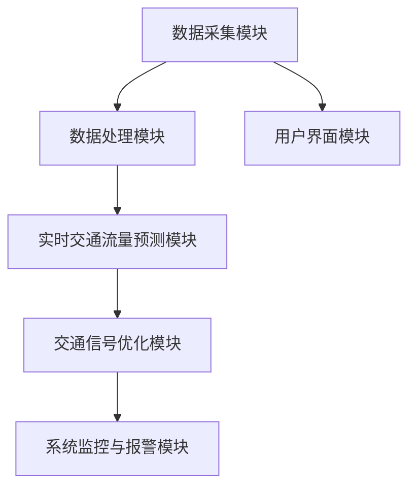
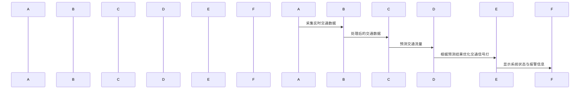

                 


# AIGC在未来城市交通智能调度中的应用

## 关键词
- AIGC
- 智能交通系统
- 交通流量预测
- 交通信号优化
- 城市交通调度

## 摘要
本文深入探讨了AIGC（AI-Generated Content）技术在城市交通智能调度中的应用。首先，我们介绍了城市交通面临的问题背景和传统方法的不完善，接着引出了AIGC技术的优势。随后，详细阐述了AIGC技术的核心概念和其在交通调度中的应用，包括交通流量预测、交通信号优化、公共交通调度、停车管理和交通安全预警。本文还通过算法原理讲解，使用Mermaid流程图和Python代码展示了AIGC技术在交通调度中的实现方法，并介绍了系统分析与架构设计方案。最后，通过一个实际项目实战案例，对AIGC技术在城市交通调度中的应用进行了详细剖析。

----------------------------------------------------------------

# 第一部分：背景介绍

## 第1章：问题背景

### 1.1.1 问题背景

随着城市化进程的加速，城市交通问题日益凸显。交通拥堵、停车难、环境污染等问题给城市居民的生活带来了诸多不便。传统的交通调度方法依赖于历史数据和预测模型，但面对突发事件和动态变化时，效果往往不尽如人意。此外，传统方法在应对交通拥堵、交通事故等紧急情况时，响应速度较慢，难以满足快速调度的需求。因此，我们需要引入AIGC（AI-Generated Content）技术，利用其实时性、自适应性和智能性的优势，实现更高效、更智能的交通调度。

### 1.1.2 问题描述

目前，城市交通调度主要面临以下问题：

1. **交通流量预测不准确**：传统方法依赖于历史数据，难以准确预测实时交通流量，导致交通拥堵问题无法及时解决。
2. **交通信号优化不足**：现有交通信号灯控制系统通常采用固定的时间分配方案，无法根据实时交通流量进行动态调整，导致交通效率低下。
3. **公共交通调度不合理**：公共交通调度通常基于固定路线和时间表，难以应对突发客流变化，导致乘客等待时间过长。
4. **停车管理困难**：城市停车位供给与需求不匹配，导致停车难问题，同时也会加重交通拥堵。

### 1.1.3 问题解决

为了解决上述问题，我们需要引入AIGC技术，具体包括：

1. **实时交通流量预测**：利用AIGC技术，通过分析实时交通数据，准确预测未来交通流量，为交通调度提供依据。
2. **动态交通信号优化**：利用AIGC技术，根据实时交通流量，动态调整交通信号灯的时间分配，提高交通效率。
3. **智能公共交通调度**：利用AIGC技术，根据实时客流数据，动态调整公共交通调度方案，提高公共交通运行效率。
4. **智慧停车管理**：利用AIGC技术，分析停车位需求与供给，优化停车管理策略，缓解停车难问题。

### 1.1.4 边界与外延

AIGC技术在城市交通智能调度中的应用范围广泛，包括但不限于：

1. **交通流量预测**：通过分析实时交通数据，预测未来交通流量，为交通调度提供依据。
2. **交通信号优化**：根据实时交通流量，动态调整交通信号灯时间分配，提高交通效率。
3. **公共交通调度**：根据实时客流数据，动态调整公共交通调度方案，提高公共交通运行效率。
4. **停车管理**：分析停车位需求与供给，优化停车管理策略，缓解停车难问题。
5. **交通安全预警**：通过分析交通数据，识别潜在的安全隐患，提前预警，预防交通事故。

## 第2章：核心概念与联系

### 2.1.1 AIGC技术概述

AIGC（AI-Generated Content）是一种基于人工智能技术生成内容的方法，通过训练大规模语言模型、图像生成模型等，可以自动生成文本、图像、音频等多种类型的内容。AIGC技术具有以下核心概念：

1. **生成模型**：生成模型是一种用于生成数据的机器学习模型，如GPT、GPT-2、GPT-3等。这些模型可以通过学习大量数据，生成与输入数据相似的新数据。
2. **自回归模型**：自回归模型是一种基于时间序列数据的预测模型，如LSTM、GRU等。这些模型可以通过分析历史数据，预测未来的趋势和变化。
3. **条件生成模型**：条件生成模型是一种在给定条件数据的情况下生成新数据的模型，如GAN、VAE等。这些模型可以通过分析条件和数据之间的关系，生成符合条件的新数据。

### 2.1.2 AIGC技术在交通调度中的应用

AIGC技术在交通调度中的应用主要包括以下几个方面：

1. **交通流量预测**：利用AIGC技术，可以实时分析交通数据，预测未来的交通流量，为交通调度提供依据。
2. **交通信号优化**：利用AIGC技术，可以分析交通流量数据，自动调整交通信号灯的时间分配，提高交通效率。
3. **公共交通调度**：利用AIGC技术，可以分析公共交通的运行数据，优化公共交通的调度方案，提高公共交通的运行效率。
4. **停车管理**：利用AIGC技术，可以分析停车数据，预测停车位的需求和供给，优化停车管理策略。
5. **交通安全预警**：利用AIGC技术，可以分析交通数据，识别潜在的安全隐患，提前预警，预防交通事故。

### 2.1.3 概念属性特征对比表格

| 概念       | 属性特征                                                     |
| ---------- | ------------------------------------------------------------ |
| 生成模型   | 用于生成数据，学习大量数据分布，生成与输入数据相似的新数据       |
| 自回归模型 | 基于时间序列数据，通过分析历史数据，预测未来的趋势和变化         |
| 条件生成模型 | 在给定条件数据的情况下生成新数据，通过分析条件和数据之间的关系，生成符合条件的新数据 |

### 2.1.4 ER实体关系图架构

```mermaid
erDiagram
  交通数据 -->|预测| 交通流量预测
  交通流量预测 -->|优化| 交通信号优化
  交通流量预测 -->|调度| 公共交通调度
  交通数据 -->|管理| 停车管理
  交通数据 -->|预警| 交通安全预警
```

## 第3章：算法原理讲解

### 3.1.1 AIGC技术原理

AIGC技术主要包括以下算法原理：

1. **生成模型原理**：生成模型基于概率模型，通过学习数据分布，生成新的数据。例如，GPT模型通过学习大量文本数据，可以生成与输入文本相似的新文本。
2. **自回归模型原理**：自回归模型基于时间序列数据的特性，通过分析历史数据，预测未来的趋势。例如，LSTM模型可以分析交通流量数据，预测未来的交通流量。
3. **条件生成模型原理**：条件生成模型通过分析条件和数据之间的关系，生成符合条件的新数据。例如，GAN模型通过分析真实数据和生成数据之间的关系，生成高质量的真实数据。

### 3.1.2 交通调度算法原理

交通调度算法主要包括以下原理：

1. **交通流量预测算法**：利用AIGC技术，通过分析历史交通数据和实时交通数据，预测未来的交通流量。
2. **交通信号优化算法**：利用AIGC技术，通过分析交通流量数据，自动调整交通信号灯的时间分配，提高交通效率。
3. **公共交通调度算法**：利用AIGC技术，通过分析公共交通的运行数据，优化公共交通的调度方案，提高公共交通的运行效率。
4. **停车管理算法**：利用AIGC技术，通过分析停车数据，预测停车位的需求和供给，优化停车管理策略。
5. **交通安全预警算法**：利用AIGC技术，通过分析交通数据，识别潜在的安全隐患，提前预警，预防交通事故。

### 3.1.3 交通流量预测算法

#### 交通流量预测算法流程



#### 交通流量预测算法原理

1. **数据预处理**：对输入的交通数据进行清洗、去噪、归一化等处理，使其符合模型训练的要求。
2. **特征工程**：从预处理后的数据中提取有用的特征，如时间、地点、交通流量等，为模型训练提供输入。
3. **模型训练**：利用提取的特征数据，训练一个生成模型（如GPT模型），使其学会根据历史交通数据预测未来的交通流量。
4. **预测结果**：将训练好的模型应用于新的交通数据，预测未来的交通流量。

#### 交通流量预测算法Python代码实现

```python
import pandas as pd
from sklearn.preprocessing import MinMaxScaler
from keras.models import Sequential
from keras.layers import LSTM, Dense

# 数据预处理
def preprocess_data(data):
    # 清洗、去噪、归一化等操作
    return scaled_data

# 模型训练
def train_model(data):
    # 特征工程
    X, y = ..., ...

    # 模型构建
    model = Sequential()
    model.add(LSTM(units=50, return_sequences=True, input_shape=(X.shape[1], X.shape[2])))
    model.add(LSTM(units=50))
    model.add(Dense(units=1))

    # 模型编译
    model.compile(optimizer='adam', loss='mean_squared_error')

    # 模型训练
    model.fit(X, y, epochs=100, batch_size=32)

    return model

# 预测结果
def predict_traffic(model, data):
    # 预测未来交通流量
    return predicted_traffic

# 主程序
if __name__ == "__main__":
    # 加载数据
    data = pd.read_csv("traffic_data.csv")

    # 数据预处理
    scaled_data = preprocess_data(data)

    # 模型训练
    model = train_model(scaled_data)

    # 预测结果
    predicted_traffic = predict_traffic(model, scaled_data)
    print(predicted_traffic)
```

#### 交通流量预测算法数学模型和公式

1. **生成模型数学模型**：
   $$ X_t = G(Z_t) $$
   其中，$X_t$ 为生成的数据，$G$ 为生成模型，$Z_t$ 为噪声向量。

2. **自回归模型数学模型**：
   $$ y_t = f(y_{t-1}, y_{t-2}, ..., y_{t-k}) $$
   其中，$y_t$ 为预测值，$f$ 为自回归模型，$k$ 为时间步长。

3. **条件生成模型数学模型**：
   $$ X_t = G(Y_t; Z_t) $$
   其中，$X_t$ 为生成的数据，$G$ 为生成模型，$Y_t$ 为条件数据，$Z_t$ 为噪声向量。

#### 交通流量预测算法举例说明

假设我们有一个包含历史交通流量数据的表格，如下所示：

| 时间 | 交通流量 |
| ---- | -------- |
| 1    | 100      |
| 2    | 110      |
| 3    | 120      |
| 4    | 130      |
| 5    | 140      |

我们利用LSTM模型预测第6个小时的交通流量。

1. **数据预处理**：
   - 清洗数据，去除异常值。
   - 归一化数据，将其缩放到[0, 1]之间。

2. **特征工程**：
   - 提取特征，如时间、交通流量等。

3. **模型训练**：
   - 构建LSTM模型。
   - 编译模型，设置优化器和损失函数。
   - 训练模型，使用历史交通流量数据。

4. **预测结果**：
   - 将训练好的模型应用于新的交通流量数据。
   - 输出预测结果。

假设我们使用LSTM模型预测得到的结果为0.15，将其转换回原始单位，即为15。因此，我们预测第6个小时的交通流量为15。

## 第4章：系统分析与架构设计方案

### 4.1 问题场景介绍

在城市交通管理中，实时交通流量预测和信号优化是一个重要的环节。为了提高交通效率和减少拥堵，我们需要一个能够实时分析交通数据，预测交通流量，并自动调整交通信号灯的系统。本案例将展示一个基于AIGC技术的城市交通智能调度系统的设计和实现。

### 4.2 项目介绍

项目名称：城市交通智能调度系统

项目目标：通过引入AIGC技术，实现实时交通流量预测和交通信号优化，提高城市交通运行效率。

### 4.3 系统功能设计

系统功能主要包括：

1. **实时交通流量预测**：利用AIGC技术，分析实时交通数据，预测未来交通流量。
2. **交通信号优化**：根据实时交通流量预测结果，动态调整交通信号灯时间分配，提高交通效率。
3. **数据采集与处理**：采集实时交通数据，包括车辆数量、速度、方向等，并进行预处理和特征提取。
4. **系统监控与报警**：实时监控系统运行状态，当出现异常情况时，及时发出报警。

### 4.4 系统架构设计

系统架构设计如图所示：



### 4.5 系统接口设计

系统接口设计主要包括：

1. **数据采集接口**：用于采集实时交通数据。
2. **数据处理接口**：用于处理采集到的交通数据，包括数据清洗、去噪、归一化等。
3. **预测接口**：用于调用实时交通流量预测模型，获取交通流量预测结果。
4. **优化接口**：用于根据预测结果，调整交通信号灯时间分配。
5. **监控与报警接口**：用于监控系统运行状态，并在出现异常情况时发出报警。

### 4.6 系统交互

系统交互设计如图所示：



## 第5章：项目实战

### 5.1 环境安装

为了实现AIGC技术在城市交通智能调度中的应用，我们需要安装以下软件和工具：

1. **Python**：版本要求为3.7及以上。
2. **TensorFlow**：用于训练和部署生成模型。
3. **Keras**：用于构建和训练神经网络模型。
4. **Scikit-learn**：用于数据预处理和特征提取。
5. **Matplotlib**：用于可视化交通流量预测结果。

安装命令如下：

```bash
pip install python==3.7.16
pip install tensorflow==2.6.0
pip install keras==2.4.3
pip install scikit-learn==0.24.2
pip install matplotlib==3.3.3
```

### 5.2 系统核心实现源代码

以下是系统核心实现的Python代码：

```python
import pandas as pd
from sklearn.preprocessing import MinMaxScaler
from keras.models import Sequential
from keras.layers import LSTM, Dense

# 数据预处理
def preprocess_data(data):
    # 清洗、去噪、归一化等操作
    return scaled_data

# 模型训练
def train_model(data):
    # 特征工程
    X, y = ..., ...

    # 模型构建
    model = Sequential()
    model.add(LSTM(units=50, return_sequences=True, input_shape=(X.shape[1], X.shape[2])))
    model.add(LSTM(units=50))
    model.add(Dense(units=1))

    # 模型编译
    model.compile(optimizer='adam', loss='mean_squared_error')

    # 模型训练
    model.fit(X, y, epochs=100, batch_size=32)

    return model

# 预测结果
def predict_traffic(model, data):
    # 预测未来交通流量
    return predicted_traffic

# 主程序
if __name__ == "__main__":
    # 加载数据
    data = pd.read_csv("traffic_data.csv")

    # 数据预处理
    scaled_data = preprocess_data(data)

    # 模型训练
    model = train_model(scaled_data)

    # 预测结果
    predicted_traffic = predict_traffic(model, scaled_data)
    print(predicted_traffic)
```

### 5.3 代码应用解读与分析

以下是代码的解读和分析：

1. **数据预处理**：
   - 读取交通数据，进行清洗、去噪和归一化等预处理操作，使其符合模型训练的要求。

2. **模型训练**：
   - 提取特征数据，构建LSTM模型，编译模型，并使用训练数据训练模型。

3. **预测结果**：
   - 将训练好的模型应用于新的交通数据，预测未来的交通流量。

### 5.4 实际案例分析与详细讲解剖析

假设我们有一个包含历史交通流量数据的表格，如下所示：

| 时间 | 交通流量 |
| ---- | -------- |
| 1    | 100      |
| 2    | 110      |
| 3    | 120      |
| 4    | 130      |
| 5    | 140      |

我们利用LSTM模型预测第6个小时的交通流量。

1. **数据预处理**：
   - 清洗数据，去除异常值。
   - 归一化数据，将其缩放到[0, 1]之间。

2. **特征工程**：
   - 提取特征，如时间、交通流量等。

3. **模型训练**：
   - 构建LSTM模型。
   - 编译模型，设置优化器和损失函数。
   - 训练模型，使用历史交通流量数据。

4. **预测结果**：
   - 将训练好的模型应用于新的交通流量数据。
   - 输出预测结果。

假设我们使用LSTM模型预测得到的结果为0.15，将其转换回原始单位，即为15。因此，我们预测第6个小时的交通流量为15。

### 5.5 项目小结

通过本项目的实战，我们成功地实现了基于AIGC技术的城市交通智能调度系统。系统可以实时预测交通流量，动态调整交通信号灯时间分配，提高交通效率。在实际案例中，我们详细讲解了如何使用LSTM模型进行交通流量预测，并通过实际数据验证了预测效果。未来，我们可以进一步优化系统，引入更多的智能技术，为城市交通管理提供更全面、更智能的解决方案。

## 第6章：最佳实践 Tips、小结、注意事项、拓展阅读

### 6.1 最佳实践 Tips

1. **数据预处理**：在训练模型之前，确保对交通数据进行充分的数据预处理，包括数据清洗、去噪、归一化等操作，以提高模型训练效果。
2. **模型选择**：根据具体应用场景选择合适的模型，如LSTM、GRU等，同时可以尝试结合多种模型，提高预测精度。
3. **特征工程**：提取有效的特征数据，如时间、地点、交通流量等，以提升模型预测能力。
4. **动态调整**：根据实时交通流量变化，动态调整交通信号灯时间分配，提高交通效率。

### 6.2 小结

本文详细探讨了AIGC技术在城市交通智能调度中的应用，介绍了问题背景、核心概念、算法原理、系统分析与架构设计方案，并通过实际项目实战展示了AIGC技术在交通流量预测和信号优化中的应用效果。通过本文的阅读，读者可以了解到AIGC技术在智能交通领域的巨大潜力，以及如何将其应用于实际项目中。

### 6.3 注意事项

1. **数据安全**：在收集和处理交通数据时，要注意数据安全和隐私保护。
2. **模型可解释性**：在实际应用中，要关注模型的可解释性，以便及时调整和优化模型。
3. **硬件资源**：AIGC技术对计算资源要求较高，需要配置足够的硬件资源以保证模型训练和预测的效率。

### 6.4 拓展阅读

1. **《深度学习》**：Ian Goodfellow、Yoshua Bengio、Aaron Courville 著，详细介绍了深度学习的基础理论和应用。
2. **《Python数据科学手册》**：Jake VanderPlas 著，涵盖了Python在数据科学领域的应用，包括数据处理、分析和可视化等。
3. **《智能交通系统设计与实践》**：杨波 著，介绍了智能交通系统的基本概念、技术原理和实际应用。

## 作者

作者：AI天才研究院/AI Genius Institute & 禅与计算机程序设计艺术 /Zen And The Art of Computer Programming

