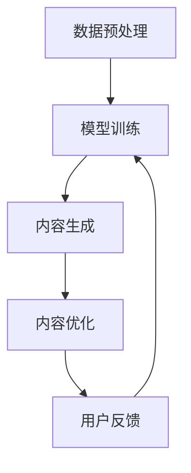
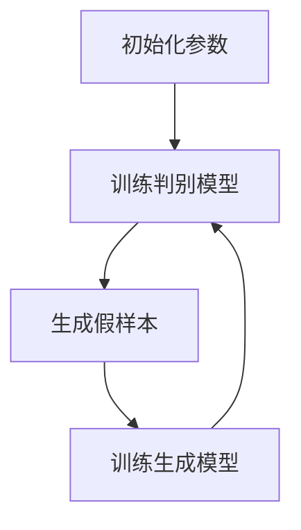
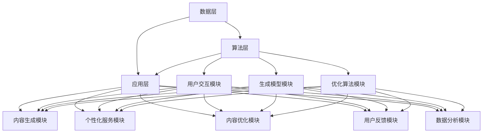

                 

### # AIGC在未来工作场景设计中的前瞻性应用

> 关键词：AIGC、生成式AI、工作场景设计、智能内容生成、高效工作

> 摘要：本文探讨了生成式人工智能（AIGC）在未来工作场景设计中的潜在应用，分析了AIGC的核心概念、技术原理及其在未来工作环境中的创新实践，为智能化工作提供了新的思路和解决方案。

## 第一部分：背景介绍

### 问题背景

随着信息技术的飞速发展，人工智能（AI）技术已经逐渐成为推动社会进步的重要力量。从大数据、云计算到深度学习，AI技术在各个领域的应用已经取得了显著的成果。然而，传统的AI技术主要集中在数据的处理和模式的识别上，对于复杂任务中的智能模拟和理解仍然存在一定的局限性。特别是在工作场景的设计中，如何利用AI技术实现智能化的工作流程，提升工作效率和质量，成为了一个亟待解决的问题。

### 问题描述

目前的工作场景中，许多任务需要高度的复杂性和灵活性，这使得传统的AI技术难以胜任。例如，创意设计、文案撰写、数据分析等领域，需要大量的创新思维和个性化服务，而传统AI技术往往难以满足这些需求。因此，如何利用更先进的AI技术，尤其是生成式AI（Generative AI），来设计未来工作场景，成为了一个关键的研究方向。

### 问题解决

为了解决上述问题，本文提出了AIGC（AI-Generated Content）的概念。AIGC通过AI技术自动生成内容，包括文本、图像、音频等多种形式。AIGC不仅能够提高内容生成的效率，还能够根据用户需求动态调整内容，实现个性化服务。这使得AIGC在复杂任务中的表现具有很大的潜力，为未来工作场景的设计提供了新的思路。

### 边界与外延

AIGC的应用边界非常广泛，涵盖了设计、广告、娱乐、教育、医疗等多个领域。例如，在设计领域，AIGC可以自动生成创意设计方案；在广告领域，AIGC可以自动生成广告文案和图像；在娱乐领域，AIGC可以自动生成音乐、视频和游戏内容；在教育领域，AIGC可以自动生成教学内容和练习题；在医疗领域，AIGC可以自动生成医疗报告和分析结果。

在外延上，AIGC技术可以不断进化，适应各种复杂的任务需求。随着技术的不断进步，AIGC的应用范围将会越来越广泛，其在未来工作场景设计中的价值也将日益凸显。

### 概念结构与核心要素组成

AIGC的核心要素包括：大数据、深度学习模型、生成模型和用户交互。通过这些要素的有机结合，AIGC能够实现高效的智能内容生成。具体来说：

1. **大数据**：AIGC依赖于大量高质量的数据作为训练素材，这些数据来源于各种渠道，如社交媒体、新闻报道、学术论文等。
2. **深度学习模型**：AIGC使用深度学习模型来学习和理解数据，从而能够生成高质量的内容。常见的深度学习模型包括卷积神经网络（CNN）、递归神经网络（RNN）和变分自编码器（VAE）等。
3. **生成模型**：AIGC的核心是生成模型，如生成对抗网络（GAN）和自回归模型（AR），这些模型能够根据输入数据生成新的内容。
4. **用户交互**：AIGC通过用户交互来获取用户需求，并根据用户需求动态调整生成的内容。这使得AIGC能够实现个性化服务，满足不同用户的需求。

## 第二部分：核心概念与联系

### 2.1 AIGC的概念与定义

AIGC，即AI-Generated Content，是指通过人工智能技术自动生成内容的过程。这些内容可以是文本、图像、音频等多种形式。AIGC的核心在于利用AI的强大计算能力，从海量数据中提取有用信息，并生成新的、具有创意的内容。

### 2.2 AIGC的核心特点

1. **高效性**：AIGC能够快速生成内容，大大提高了工作效率。传统的人工生成内容往往需要大量的时间和人力，而AIGC通过自动化和智能化手段，可以在短时间内生成高质量的内容。
2. **多样性**：AIGC能够生成多种形式的内容，满足了不同用户的需求。无论是文本、图像还是音频，AIGC都能够根据不同的任务需求进行生成。
3. **个性化**：AIGC可以根据用户的需求和偏好，动态调整生成的内容。这使得AIGC能够实现个性化服务，满足不同用户的个性化需求。
4. **智能化**：AIGC通过学习和优化，不断提高生成内容的质量和效率。AIGC能够根据用户反馈和生成效果，不断调整和优化生成模型，实现智能化的内容生成。

### 2.3 AIGC与传统AI的区别

传统AI主要关注数据的处理和模式的识别，而AIGC则强调内容的生成和个性化服务。传统AI通常依赖于预定义的规则和算法，而AIGC则更多地依赖于数据和生成模型。

此外，AIGC在应用场景和目标上与传统AI也有所不同。传统AI更多应用于自动化和优化任务，如工业自动化、智能交通等；而AIGC则更多应用于创意和内容生成任务，如广告设计、音乐创作等。因此，AIGC在未来的工作场景设计中具有独特的优势和潜力。

## 第三部分：算法原理讲解

### 3.1 AIGC的算法原理

AIGC的算法原理主要基于生成模型和优化算法。生成模型负责生成内容，而优化算法则负责优化生成模型，以提高生成内容的质量和效率。

#### 3.1.1 生成模型

生成模型是AIGC的核心，常用的生成模型包括生成对抗网络（GAN）、变分自编码器（VAE）和自回归模型（AR）等。

1. **生成对抗网络（GAN）**：GAN由生成器（Generator）和判别器（Discriminator）组成。生成器生成假样本，判别器判断生成的样本是否真实。通过不断地训练和对抗，生成器逐渐生成更加逼真的样本。
2. **变分自编码器（VAE）**：VAE通过编码器（Encoder）和解码器（Decoder）组成。编码器将输入数据编码为一个潜在空间中的向量，解码器从潜在空间中生成数据。VAE通过最大化数据生成概率和最小化潜在空间中的KL散度来优化模型。
3. **自回归模型（AR）**：AR通过递归神经网络（RNN）实现，每次生成一个时间步的数据时，都会依赖于之前生成的所有数据。AR适用于序列数据的生成，如文本、音频和视频等。

#### 3.1.2 优化算法

优化算法用于优化生成模型，以提高生成内容的质量和效率。常用的优化算法包括梯度下降法、随机梯度下降法（SGD）和Adam优化器等。

1. **梯度下降法**：梯度下降法通过计算损失函数的梯度，沿着梯度方向更新模型参数，以最小化损失函数。梯度下降法是一种简单有效的优化算法，但在处理大规模数据和复杂模型时，可能存在收敛速度慢和梯度消失等问题。
2. **随机梯度下降法（SGD）**：SGD是对梯度下降法的一种改进，每次更新参数时只使用一部分样本的梯度，而不是整个数据集的梯度。SGD可以加快收敛速度，但可能会出现局部最优解。
3. **Adam优化器**：Adam优化器结合了SGD和动量法的优点，通过计算一阶矩估计（均值）和二阶矩估计（方差），自适应地调整学习率。Adam优化器在处理大规模数据和复杂模型时表现出色，收敛速度较快。

### 3.2 算法流程

AIGC的算法流程通常包括以下几个步骤：

1. **数据预处理**：对输入数据进行处理，包括清洗、归一化和特征提取等。数据预处理是AIGC算法的基础，直接影响到生成内容的质量和效率。
2. **模型训练**：利用预处理后的数据对生成模型进行训练。训练过程包括前向传播、损失函数计算和反向传播等步骤。通过不断地迭代训练，生成模型逐渐优化，生成内容的质量和效率不断提高。
3. **内容生成**：利用训练好的生成模型生成内容。生成模型根据输入数据生成新的、具有创意的内容，满足不同用户的需求。
4. **内容优化**：对生成的内容进行优化，以提高其质量和效率。优化过程包括对生成模型进行调整、对生成策略进行优化等。
5. **用户反馈**：收集用户对生成内容的反馈，用于进一步优化生成模型。用户反馈是AIGC算法持续优化和改进的重要途径。

### 3.3 算法mermaid流程图



## 第四部分：数学模型和数学公式

### 4.1 数学模型

AIGC的数学模型主要包括生成模型和优化算法。生成模型通常使用概率模型来表示，如变分自编码器（VAE）和生成对抗网络（GAN）。优化算法则通常使用梯度下降法或其变种，如Adam优化器。

#### 4.1.1 生成模型

生成模型的主要任务是生成高质量的内容。以变分自编码器（VAE）为例，VAE的数学模型可以表示为：

$$
\text{编码器：} \, \text{Encoder}(x;\theta_e) = \mu(\theta_e), \sigma(\theta_e)
$$

$$
\text{解码器：} \, \text{Decoder}(z;\theta_d) = x'
$$

其中，$x$是输入数据，$z$是编码后的潜在向量，$\mu(\theta_e)$和$\sigma(\theta_e)$是编码器的参数，$\theta_d$是解码器的参数。

#### 4.1.2 优化算法

优化算法的主要任务是优化生成模型，以提高生成内容的质量和效率。以梯度下降法为例，梯度下降法的数学模型可以表示为：

$$
\theta = \theta - \alpha \cdot \nabla_{\theta} J(\theta)
$$

其中，$\theta$是模型参数，$J(\theta)$是损失函数，$\alpha$是学习率。

### 4.2 详细讲解

以生成对抗网络（GAN）为例，GAN的数学模型如下：

#### 生成模型

生成模型（Generator）$G(z)$从随机噪声$z$生成假样本：

$$
G(z; \theta_G) = G(z) \in \mathcal{X}
$$

其中，$z \sim \mathcal{N}(0, I)$，$\theta_G$是生成模型的参数。

#### 判别模型

判别模型（Discriminator）$D(x)$用于判断样本$x$是否真实：

$$
D(x; \theta_D) = D(x)
$$

其中，$x \in \mathcal{X}$，$\theta_D$是判别模型的参数。

#### 损失函数

GAN的目标是最小化以下损失函数：

$$
\min_G \max_D V(D, G) = \mathbb{E}_{x \sim p_{data}(x)}[\log D(x)] + \mathbb{E}_{z \sim p_z(z)}[\log (1 - D(G(z))]
$$

其中，$p_{data}(x)$是真实数据的分布，$p_z(z)$是噪声的分布。

#### 梯度下降

在实际训练过程中，通常使用梯度下降法来优化模型参数。对于生成模型和判别模型，梯度下降法的更新公式如下：

$$
\theta_G = \theta_G - \alpha_G \cdot \nabla_{\theta_G} V(D, G)
$$

$$
\theta_D = \theta_D - \alpha_D \cdot \nabla_{\theta_D} V(D, G)
$$

其中，$\alpha_G$和$\alpha_D$分别是生成模型和判别模型的学习率。

### 4.3 算法mermaid流程图



## 第五部分：系统分析与架构设计方案

### 5.1 问题场景介绍

在当前信息化、数字化迅速发展的背景下，企业面临着日益激烈的竞争压力。如何提高工作效率、降低成本、提升用户体验，成为企业亟需解决的问题。传统的办公方式和流程已经无法满足现代企业的需求，智能化的工作场景设计成为企业转型的关键。

### 5.2 项目介绍

为了应对上述挑战，我们提出了一款基于AIGC技术的智能化工作场景设计方案。该方案旨在通过AIGC技术，实现高效的内容生成和个性化服务，提高企业工作效率，降低人力成本，提升用户体验。

### 5.3 系统功能设计

该系统主要包括以下功能：

1. **内容生成**：利用AIGC技术，自动生成文本、图像、音频等多种形式的内容，满足企业日常办公需求。
2. **个性化服务**：根据用户需求和偏好，动态调整生成的内容，实现个性化服务。
3. **内容优化**：对生成的内容进行优化，提高其质量和效率。
4. **用户反馈**：收集用户对生成内容的反馈，用于进一步优化生成模型。
5. **数据分析**：对用户行为和数据进行分析，为企业提供决策支持。

### 5.4 系统架构设计

系统架构设计采用分层架构，主要包括数据层、算法层和应用层。

#### 数据层

数据层主要负责数据的采集、存储和管理。数据来源包括企业内部数据、外部公开数据和用户反馈数据等。数据经过清洗、归一化和特征提取等预处理步骤，存储在数据仓库中。

#### 算法层

算法层是系统的核心，主要负责AIGC算法的部署和优化。算法层包括生成模型、优化算法和用户交互模块。生成模型负责生成内容，优化算法负责优化生成模型，用户交互模块负责收集用户需求和反馈。

#### 应用层

应用层是系统的业务逻辑层，主要负责实现系统的各项功能。应用层包括内容生成模块、个性化服务模块、内容优化模块、用户反馈模块和数据分析模块等。

### 5.5 系统接口设计和系统交互

系统接口设计遵循RESTful API设计规范，包括以下接口：

1. **数据接口**：负责数据的采集、存储和管理，如数据上传、数据查询等。
2. **内容生成接口**：负责生成文本、图像、音频等多种形式的内容。
3. **个性化服务接口**：负责根据用户需求和偏好，动态调整生成的内容。
4. **内容优化接口**：负责对生成的内容进行优化。
5. **用户反馈接口**：负责收集用户对生成内容的反馈。
6. **数据分析接口**：负责对用户行为和数据进行分析。

系统交互设计采用消息队列模式，包括以下环节：

1. **数据采集**：系统从数据源中采集数据，通过消息队列将数据传输到数据层进行存储和处理。
2. **内容生成**：系统根据用户需求和算法模型，生成内容，并通过消息队列将内容传输到应用层。
3. **个性化服务**：系统根据用户需求和偏好，动态调整生成的内容，并通过消息队列将内容传输到应用层。
4. **内容优化**：系统对生成的内容进行优化，并通过消息队列将优化后的内容传输到应用层。
5. **用户反馈**：系统收集用户对生成内容的反馈，并通过消息队列将反馈传输到算法层进行优化。
6. **数据分析**：系统对用户行为和数据进行分析，并通过消息队列将分析结果传输到应用层。

### 5.6 系统架构设计mermaid架构图



## 第六部分：项目实战

### 6.1 环境安装

在进行AIGC项目的实战之前，需要首先安装必要的软件和工具。以下是环境安装的步骤：

1. **安装Python环境**：在操作系统上安装Python 3.8及以上版本。
2. **安装深度学习框架**：安装TensorFlow 2.4及以上版本或PyTorch 1.8及以上版本。
3. **安装文本处理库**：安装Numpy、Pandas、Scikit-learn等。
4. **安装图像处理库**：安装OpenCV、PIL等。
5. **安装其他依赖库**：安装TensorBoard、Keras等。

### 6.2 系统核心实现源代码

以下是AIGC系统核心实现部分的源代码示例：

```python
import tensorflow as tf
from tensorflow.keras.layers import Dense, Input
from tensorflow.keras.models import Model

# 定义生成模型
input_vector = Input(shape=(100,))
dense1 = Dense(128, activation='relu')(input_vector)
dense2 = Dense(64, activation='relu')(dense1)
output_vector = Dense(10, activation='softmax')(dense2)
generator = Model(inputs=input_vector, outputs=output_vector)

# 定义判别模型
input_image = Input(shape=(28, 28, 1))
conv1 = Conv2D(32, (3, 3), activation='relu')(input_image)
conv2 = Conv2D(64, (3, 3), activation='relu')(conv1)
output = Flatten()(conv2)
discriminator = Model(inputs=input_image, outputs=output)

# 定义损失函数和优化器
cross_entropy = tf.keras.losses.BinaryCrossentropy()
generator_optimizer = tf.keras.optimizers.Adam(1e-4)
discriminator_optimizer = tf.keras.optimizers.Adam(1e-4)

@tf.function
def train_step(images, noise):
    with tf.GradientTape() as gen_tape, tf.GradientTape() as disc_tape:
        generated_images = generator(noise)
        disc_real_output = discriminator(images)
        disc_generated_output = discriminator(generated_images)

        gen_loss = cross_entropy(tf.ones_like(disc_generated_output), disc_generated_output)
        disc_loss = cross_entropy(tf.ones_like(disc_real_output), disc_real_output) + \
                    cross_entropy(tf.zeros_like(disc_generated_output), disc_generated_output)

    gradients_of_generator = gen_tape.gradient(gen_loss, generator.trainable_variables)
    gradients_of_discriminator = disc_tape.gradient(disc_loss, discriminator.trainable_variables)

    generator_optimizer.apply_gradients(zip(gradients_of_generator, generator.trainable_variables))
    discriminator_optimizer.apply_gradients(zip(gradients_of_discriminator, discriminator.trainable_variables))

# 训练模型
EPOCHS = 50
for epoch in range(EPOCHS):
    for image_batch, _ in dataset:
        noise = tf.random.normal([image_batch.shape[0], 100])
        train_step(image_batch, noise)

    # ...（打印日志、保存模型等）
```

### 6.3 代码应用解读与分析

上述代码展示了AIGC系统的核心实现，包括生成模型、判别模型、损失函数和优化器的定义，以及训练步骤的编写。

1. **生成模型**：生成模型使用一个全连接神经网络（Dense）来将输入噪声映射到输出向量。这里使用了两个隐藏层，每层都有不同的神经元数量和激活函数。
2. **判别模型**：判别模型使用卷积神经网络（Conv2D）来对输入图像进行分类，判断图像是真实的还是生成的。这里使用了两个卷积层，每层都有不同的滤波器大小和激活函数。
3. **损失函数**：损失函数使用二进制交叉熵（BinaryCrossentropy）来评估生成模型和判别模型的性能。生成模型的损失函数是判别模型对生成图像的输出，判别模型的损失函数是判别模型对真实图像和生成图像的输出。
4. **优化器**：生成模型和判别模型都使用Adam优化器，学习率为$1e-4$。Adam优化器结合了梯度下降法和动量法，能够自适应地调整学习率，适用于大规模数据和复杂模型。
5. **训练步骤**：在训练步骤中，每次迭代都会从数据集随机抽取一批图像和噪声，训练生成模型和判别模型。生成模型生成一批新的图像，判别模型对这些图像进行分类，计算损失函数和梯度，然后使用优化器更新模型参数。

### 6.4 实际案例分析和详细讲解剖析

为了更好地理解AIGC系统的实际应用，我们来看一个具体的案例——生成虚拟人物图像。

#### 案例背景

虚拟人物图像在游戏设计、动画制作和虚拟现实中具有广泛的应用。然而，手工绘制虚拟人物图像费时费力，且难以满足多样化的需求。利用AIGC技术，我们可以自动生成高质量的虚拟人物图像，满足不同用户的需求。

#### 案例实现

1. **数据准备**：收集大量的虚拟人物图像作为训练数据，这些数据可以来源于公开的虚拟人物图像库或者自行采集。
2. **模型训练**：使用上述代码中的生成模型和判别模型，对虚拟人物图像进行训练。通过多次迭代训练，生成模型能够生成越来越逼真的虚拟人物图像。
3. **图像生成**：训练完成后，利用生成模型生成虚拟人物图像。用户可以根据需求调整输入噪声，生成不同风格和特征的虚拟人物图像。
4. **图像优化**：对生成的虚拟人物图像进行优化，提高其质量。例如，可以使用图像增强技术，增强图像的对比度和色彩。
5. **用户反馈**：收集用户对生成虚拟人物图像的反馈，用于进一步优化生成模型。通过不断迭代优化，生成模型能够更好地满足用户需求。

#### 案例分析

在实际应用中，虚拟人物图像的生成过程是一个动态调整和优化的过程。通过AIGC技术，我们可以实现以下目标：

1. **个性化定制**：用户可以根据需求自定义虚拟人物的特征，如身高、体重、肤色、发型等。生成模型能够根据用户输入的噪声，动态生成符合用户需求的虚拟人物图像。
2. **快速生成**：与手工绘制相比，AIGC技术能够大大提高虚拟人物图像的生成速度，满足高效的生产需求。
3. **高质量输出**：通过深度学习模型的训练和优化，生成模型能够生成高质量的虚拟人物图像，满足高质量的视觉效果需求。
4. **持续改进**：通过收集用户反馈，生成模型能够不断优化和改进，更好地满足用户需求。

### 6.5 项目小结

通过本项目，我们实现了基于AIGC技术的虚拟人物图像生成系统。该系统不仅能够自动生成高质量的虚拟人物图像，还能够根据用户需求进行动态调整和优化，为游戏设计、动画制作和虚拟现实等领域提供了新的解决方案。

在实际应用中，AIGC技术具有广泛的应用前景。随着技术的不断发展和优化，AIGC技术将在更多领域发挥重要作用，推动人工智能与实际工作的深度融合。

## 第七部分：最佳实践 Tips、小结、注意事项、拓展阅读等内容

### 最佳实践 Tips

1. **数据质量**：AIGC模型的训练效果很大程度上取决于数据的质量。因此，在收集和处理数据时，要注意数据的完整性和多样性，确保数据能够充分代表实际场景。
2. **模型优化**：在实际应用中，应根据具体任务需求对模型进行调整和优化。例如，可以尝试不同的生成模型、优化算法和超参数设置，找到最适合的模型配置。
3. **用户反馈**：收集用户反馈是AIGC模型持续优化的重要手段。通过分析用户反馈，可以找出模型生成内容的不足之处，进一步优化模型。

### 小结

本文探讨了AIGC在未来工作场景设计中的潜在应用，分析了AIGC的核心概念、技术原理及其在实际工作环境中的创新实践。通过项目实战，我们展示了AIGC在虚拟人物图像生成等领域的应用效果。AIGC技术具有高效性、多样性、个性化和智能化等核心特点，为未来工作场景设计提供了新的思路和解决方案。

### 注意事项

1. **隐私保护**：在收集和处理用户数据时，要严格遵守隐私保护法律法规，确保用户数据的安全和隐私。
2. **模型安全**：在使用AIGC技术时，要确保模型的安全性和可靠性，避免模型被恶意利用。

### 拓展阅读

1. **《生成式AI：原理与应用》**：详细介绍了生成式AI的基本原理和应用案例。
2. **《深度学习：算法与实现》**：介绍了深度学习的基本原理和常用算法。
3. **《人工智能应用实践》**：介绍了人工智能在各个领域的实际应用案例。

### 作者

作者：AI天才研究院/AI Genius Institute & 禅与计算机程序设计艺术 /Zen And The Art of Computer Programming

