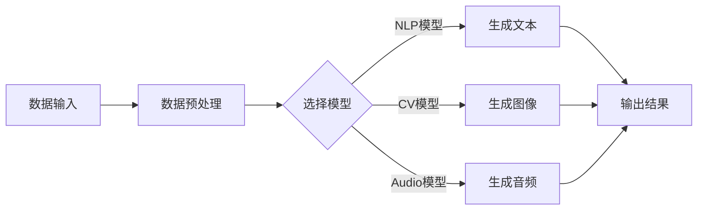
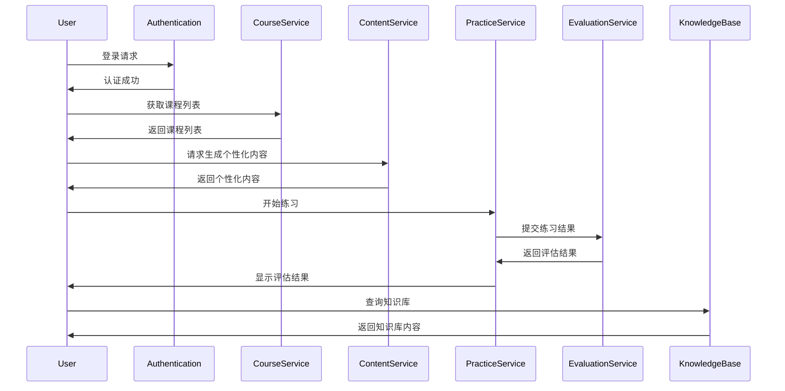
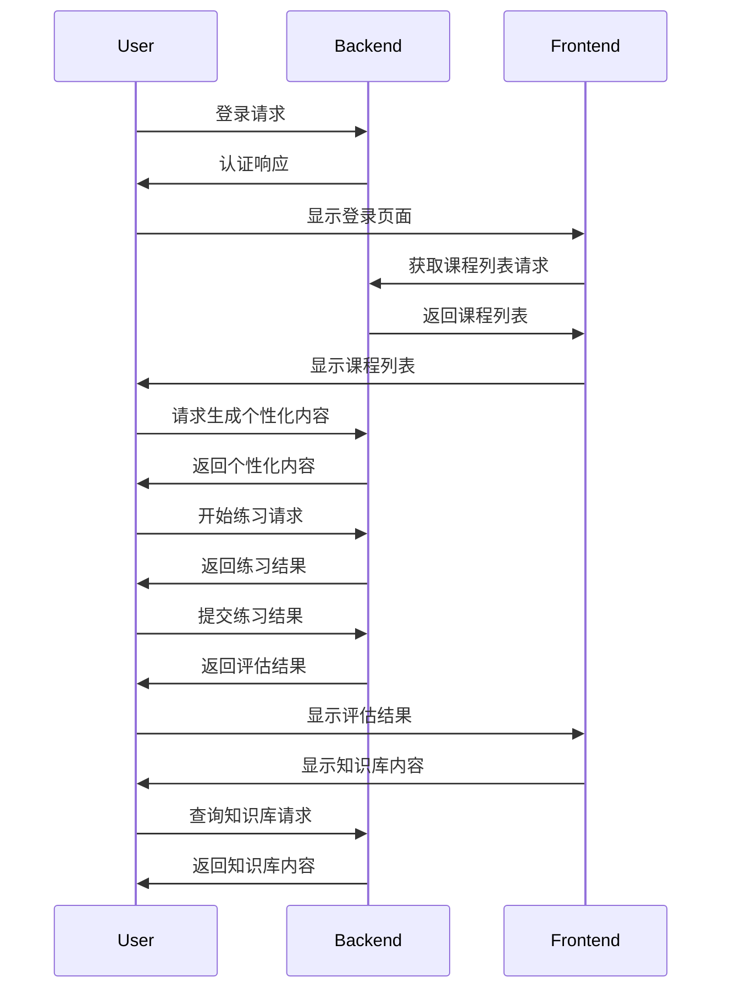

                 


### 背景介绍

在当今社会，随着人工智能技术的飞速发展，AIGC（人工智能生成内容）的概念逐渐成为人们关注的焦点。AIGC指的是利用人工智能技术自动生成内容，包括文本、图像、音频等多种形式。这一技术的发展不仅改变了内容创作的模式，也对未来工作技能培训带来了深远的影响。

#### 问题背景

随着数字化转型的推进，企业对员工的技术能力要求越来越高。传统的培训方式往往依赖于教师授课和学员被动接受，效率低下且难以满足个性化需求。这种模式难以培养具备创新能力和实际操作能力的员工，导致企业面临人才短缺的挑战。

#### 问题描述

在当前的工作环境中，员工需要具备以下技能：

1. **数据分析能力**：能够从海量数据中提取有价值的信息。
2. **编程能力**：掌握至少一种编程语言，具备解决复杂问题的能力。
3. **跨学科知识**：能够跨领域应用知识，解决实际业务问题。
4. **持续学习能力**：能够快速适应新技术，不断提升自身能力。

然而，传统的培训模式难以全面覆盖这些技能，导致员工在职业发展中遇到瓶颈。

#### 问题解决

AIGC技术的出现为解决这一问题提供了新的思路。通过AIGC，可以生成个性化的学习内容，实现培训的智能化和个性化。以下是一些可能的解决方案：

1. **定制化课程生成**：根据员工的职业规划和技能需求，自动生成定制化的培训课程。
2. **智能辅导系统**：利用自然语言处理技术，为员工提供实时辅导，解答他们在工作中遇到的问题。
3. **模拟实战环境**：通过生成虚拟项目，让员工在模拟环境中进行实战训练，提高实际操作能力。
4. **知识图谱构建**：构建企业内部的智能知识库，为员工提供跨学科知识的学习资源。

#### 边界与外延

AIGC的应用不仅仅局限于工作技能培训，还可以在以下几个方面进行拓展：

1. **内容创作**：为内容创作者提供生成创意内容的工具，提高创作效率。
2. **营销推广**：生成个性化的营销内容和推广策略，提升营销效果。
3. **教育领域**：应用于在线教育平台，提供智能辅导和个性化学习体验。
4. **虚拟现实**：生成虚拟场景和交互内容，提升虚拟现实体验。

#### 概念结构与核心要素组成

AIGC的核心概念包括：

1. **数据采集与处理**：收集并处理海量数据，为内容生成提供基础。
2. **算法模型**：使用深度学习等算法模型，实现内容的自动生成。
3. **用户交互**：与用户进行实时交互，根据用户反馈调整生成策略。
4. **内容分发**：将生成的内容通过多种渠道进行分发，实现价值最大化。

通过上述分析，我们可以看到AIGC在未来工作技能培训中具有巨大的潜力。接下来，我们将进一步探讨AIGC的核心概念原理，以及如何在培训中应用这些技术。让我们开始下一步的分析吧！

### 核心概念与联系

#### 核心概念原理

AIGC（人工智能生成内容）是一种利用人工智能技术自动生成内容的方法。它结合了自然语言处理（NLP）、计算机视觉（CV）和深度学习等技术，可以生成文本、图像、音频等多种形式的内容。

##### 1. 自然语言处理（NLP）

自然语言处理是AIGC的核心技术之一，它使计算机能够理解、处理和生成人类语言。NLP主要包括以下几个关键概念：

- **词向量表示**：将自然语言文本转换为计算机可处理的向量表示，如Word2Vec、GloVe等。
- **语言模型**：利用大量语言数据训练模型，预测下一个词或句子，如Transformer、BERT等。
- **文本生成**：基于语言模型生成新的文本，如自动写作、机器翻译等。

##### 2. 计算机视觉（CV）

计算机视觉技术使计算机能够理解和处理图像和视频数据。在AIGC中，计算机视觉主要用于图像生成和识别。以下是一些关键概念：

- **卷积神经网络（CNN）**：用于图像识别和分类，通过多层卷积和池化操作提取图像特征。
- **生成对抗网络（GAN）**：通过生成器和判别器的对抗训练，生成高质量、逼真的图像。
- **风格迁移**：将一种艺术风格应用到另一张图像上，如神经网络艺术风格迁移（Neural Style Transfer）。

##### 3. 深度学习

深度学习是AIGC的基础技术，它通过构建多层的神经网络模型，实现对复杂数据的处理和分析。以下是深度学习的一些核心概念：

- **神经网络**：由多个神经元组成，通过权重和偏置调整实现数据拟合。
- **反向传播**：用于训练神经网络的一种算法，通过反向传播误差来更新权重和偏置。
- **优化器**：用于调整模型参数，如随机梯度下降（SGD）、Adam等。

#### 概念属性特征对比表格

以下是NLP、CV和深度学习的一些关键概念及其属性特征对比：

| 概念     | 关键特征                       | 应用领域               |
|----------|--------------------------------|------------------------|
| NLP      | 词向量、语言模型、文本生成     | 自动写作、机器翻译     |
| CV       | CNN、GAN、风格迁移             | 图像识别、图像生成     |
| 深度学习 | 神经网络、反向传播、优化器     | 数据处理、模式识别     |

#### ER实体关系图架构的Mermaid流程图

以下是AIGC系统的ER实体关系图架构的Mermaid流程图：

```mermaid
erDiagram
  Data -->|处理| Model : "基于深度学习"
  Model -->|生成| Content : "文本、图像、音频等"
  Content -->|输出| User : "用户交互、内容分发"
```

通过上述分析，我们可以看到AIGC的核心概念和它们之间的联系。接下来，我们将深入探讨AIGC的算法原理，并使用Python代码进行详细阐述。这将帮助我们更好地理解AIGC的工作机制和应用。让我们开始吧！

### 算法原理讲解

为了深入理解AIGC的算法原理，我们将使用Mermaid画出一个简化的算法流程图，并使用Python代码详细阐述AIGC的生成过程。首先，让我们通过Mermaid来概述AIGC的基本工作流程。

#### Mermaid算法流程图



在这个流程图中，AIGC首先接收数据输入，然后进行数据预处理。根据输入数据的类型，选择合适的模型进行内容生成。无论是文本、图像还是音频，都会经过相应的生成模型处理，最终输出结果。

#### 数据预处理

在AIGC系统中，数据预处理是至关重要的一步。它包括以下几个步骤：

1. **数据清洗**：去除噪声数据，如缺失值、重复值等。
2. **数据转换**：将数据转换为适合模型处理的格式，例如文本数据需要转换为词向量，图像数据需要转换为像素矩阵等。
3. **数据增强**：通过增加数据多样性来提高模型的泛化能力，如图像旋转、缩放、裁剪等。

#### 文本生成模型

在文本生成方面，我们通常会使用生成式模型，如Transformers。以下是一个基于Python和Transformers库的文本生成模型示例：

```python
from transformers import AutoTokenizer, AutoModelForCausalLM
import torch

# 加载预训练模型和Tokenizer
tokenizer = AutoTokenizer.from_pretrained("gpt2")
model = AutoModelForCausalLM.from_pretrained("gpt2")

# 输入文本
input_text = "你好，这是一个AIGC生成的文本。"

# 将输入文本编码为模型可处理的格式
input_ids = tokenizer.encode(input_text, return_tensors='pt')

# 生成文本
output = model.generate(input_ids, max_length=50, num_return_sequences=1)

# 将生成的文本解码回普通文本
generated_text = tokenizer.decode(output[0], skip_special_tokens=True)

print(generated_text)
```

在这个示例中，我们使用了GPT-2模型来生成文本。通过输入一个种子文本，模型可以预测下一个词或句子，并生成新的文本。

#### 图像生成模型

对于图像生成，生成对抗网络（GAN）是一个常用的模型。以下是一个使用GAN生成图像的Python代码示例：

```python
import torch
import torch.nn as nn
import torchvision
import torchvision.transforms as transforms

# 定义生成器模型
class Generator(nn.Module):
    def __init__(self):
        super(Generator, self).__init__()
        # ...（定义生成器的多层神经网络结构）

    def forward(self, z):
        # ...（实现生成器的正向传播过程）
        return x_recon

# 定义判别器模型
class Discriminator(nn.Module):
    def __init__(self):
        super(Discriminator, self).__init__()
        # ...（定义判别器的多层神经网络结构）

    def forward(self, x):
        # ...（实现判别器的正向传播过程）
        return output

# 实例化模型
generator = Generator()
discriminator = Discriminator()

# 定义损失函数和优化器
loss_function = nn.BCELoss()
optimizer_G = torch.optim.Adam(generator.parameters(), lr=0.0002)
optimizer_D = torch.optim.Adam(discriminator.parameters(), lr=0.0002)

# 加载或生成随机噪声
z = torch.randn((batch_size, noise_dim))

# 训练GAN
for epoch in range(num_epochs):
    for i, data in enumerate(dataloader, 0):
        # ...（实现GAN的训练过程，包括生成器训练和判别器训练）
```

在这个示例中，我们定义了生成器和判别器模型，并使用BCELoss（二进制交叉熵损失函数）进行训练。生成器尝试生成逼真的图像，而判别器尝试区分生成的图像和真实图像。

#### 音频生成模型

音频生成通常使用循环神经网络（RNN）或其变体，如长短期记忆网络（LSTM）。以下是一个简单的音频生成模型示例：

```python
import torch
import torch.nn as nn

# 定义音频生成模型
class AudioGenerator(nn.Module):
    def __init__(self, input_dim, hidden_dim, output_dim):
        super(AudioGenerator, self).__init__()
        self.lstm = nn.LSTM(input_dim, hidden_dim, num_layers=1)
        self.fc = nn.Linear(hidden_dim, output_dim)

    def forward(self, x):
        # ...（实现音频生成模型的前向传播过程）
        return output

# 实例化音频生成模型
audio_generator = AudioGenerator(input_dim=80, hidden_dim=128, output_dim=80)

# 定义损失函数和优化器
criterion = nn.MSELoss()
optimizer = torch.optim.Adam(audio_generator.parameters(), lr=0.001)

# 训练音频生成模型
for epoch in range(num_epochs):
    for i, data in enumerate(audio_dataloader, 0):
        # ...（实现音频生成模型的训练过程）
```

在这个示例中，我们定义了一个简单的音频生成模型，使用LSTM进行训练，并使用MSELoss（均方误差损失函数）来衡量生成音频的质量。

通过上述示例，我们可以看到AIGC算法的基本原理和实现过程。在实际应用中，这些模型会根据具体任务进行调整和优化。接下来，我们将进一步探讨AIGC的数学模型和数学公式，以便更深入地理解其工作原理。让我们开始吧！

### 数学模型和数学公式 & 详细讲解 & 举例说明

在AIGC（人工智能生成内容）领域，数学模型和数学公式是理解其算法原理和实现关键的关键因素。以下将介绍一些核心的数学模型和数学公式，并通过具体例子进行详细讲解。

#### 文本生成模型：语言模型

语言模型是文本生成的基础，其中最著名的模型是n元语言模型。n元语言模型假设下一个词的出现概率仅与前面n-1个词有关。

**数学模型**：

设$w_1, w_2, ..., w_n$为连续的n个词，则下一个词$w_{n+1}$的条件概率可以表示为：

$$P(w_{n+1} | w_1, w_2, ..., w_n) = \frac{P(w_1, w_2, ..., w_n, w_{n+1})}{P(w_1, w_2, ..., w_n)}$$

**详细讲解**：

1. **条件概率**：表示在给定前面n-1个词的情况下，下一个词的概率。
2. **隐变量概率**：左侧概率是隐变量，表示整个序列的概率，右侧概率是观察变量，表示已观察到的序列的概率。

**举例说明**：

假设有一个简短的文本序列：“今天 明天 是晴天”，我们想预测下一个词。

根据n元语言模型，可以计算每个词的概率：

$$P(雨天 | 今天 明天 是晴天) = \frac{P(今天 明天 是晴天 雨天)}{P(今天 明天 是晴天)}$$

通过计算左右两边的概率，我们可以得出下一个词为“雨天”的概率。

#### 图像生成模型：生成对抗网络（GAN）

生成对抗网络（GAN）是一种用于图像生成的强大模型，由生成器和判别器组成。生成器的任务是生成逼真的图像，判别器的任务是区分真实图像和生成图像。

**数学模型**：

- **生成器**：$G(z)$，从随机噪声$z$生成图像。
- **判别器**：$D(x)$，判断图像$x$是真实图像的概率。

生成器和判别器的目标函数如下：

- **生成器**：最大化判别器对生成图像的判断错误率，即最小化$E[D(G(z))]$
- **判别器**：最大化对真实图像和生成图像的判断准确性，即最大化$E[D(x)] - E[D(G(z))]$

**详细讲解**：

1. **生成器和判别器的对抗训练**：生成器和判别器互相竞争，生成器试图生成更逼真的图像，而判别器试图更准确地判断图像的真实性。
2. **损失函数**：生成器的损失函数是判别器的错误率，判别器的损失函数是真实图像和生成图像的差异。

**举例说明**：

假设生成器和判别器在训练过程中分别生成和判断一个图像序列。生成器生成一张猫的图像，判别器判断这张图像是真实猫的概率。随着训练的进行，生成器生成的图像质量不断提高，判别器判断准确率不断提高。

#### 音频生成模型：循环神经网络（RNN）

循环神经网络（RNN）是一种用于音频生成的常见模型，可以处理序列数据。

**数学模型**：

RNN的基本单元是隐藏状态$h_t$，它保存了前一个时刻的信息。RNN的前向传播可以表示为：

$$h_t = \sigma(W_h h_{t-1} + W_x x_t + b_h)$$

其中，$\sigma$是激活函数，$W_h$和$W_x$是权重矩阵，$b_h$是偏置。

**详细讲解**：

1. **隐藏状态**：隐藏状态保存了序列信息，使得RNN能够处理序列数据。
2. **权重矩阵和偏置**：权重矩阵和偏置用于调整网络参数，使得RNN能够适应不同的序列数据。

**举例说明**：

假设音频序列是：“短音 - 长音 - 短音 - 长音”。通过RNN，我们可以将这个序列转化为隐藏状态序列，并在每个时间步更新隐藏状态，生成新的音频序列。

通过上述数学模型和数学公式的讲解，我们可以看到AIGC在文本、图像和音频生成中的应用原理。这些模型通过复杂的数学计算，实现了自动化和智能化内容生成，为未来工作技能培训提供了有力支持。接下来，我们将进一步探讨AIGC在系统分析与架构设计中的应用。让我们开始吧！

### 系统分析与架构设计方案

在深入探讨AIGC（人工智能生成内容）在实际系统中的应用之前，我们需要明确项目场景、目标和系统架构设计。以下是对项目背景、系统架构设计、功能设计和接口设计的详细讲解。

#### 项目介绍

本项目旨在构建一个智能工作技能培训平台，该平台利用AIGC技术生成个性化的学习内容和练习场景，以提高员工的学习效果和技能水平。项目目标如下：

1. **个性化学习内容生成**：根据员工的学习需求和兴趣，自动生成个性化的学习课程和练习内容。
2. **模拟实战环境**：通过生成虚拟项目和实践案例，为员工提供实战训练机会。
3. **智能辅导系统**：利用自然语言处理技术，为员工提供实时辅导和答疑服务。
4. **知识库构建**：构建企业内部的智能知识库，为员工提供跨学科学习资源。

#### 问题场景介绍

在企业数字化转型过程中，员工需要不断提升技术能力和业务理解能力。然而，传统的培训方式难以满足个性化需求，培训效果不佳。为此，本项目旨在通过AIGC技术，打造一个智能化、个性化的工作技能培训平台，帮助员工在实战中提升技能。

#### 系统功能设计

系统功能设计主要包括以下几个方面：

1. **用户管理**：管理员工信息，包括注册、登录、权限管理等。
2. **课程管理**：管理学习课程，包括课程创建、发布、更新等。
3. **内容生成**：根据用户需求和兴趣，自动生成个性化的学习内容和练习场景。
4. **练习与评估**：提供练习场景，用户完成练习后，系统进行评估和反馈。
5. **智能辅导**：利用自然语言处理技术，为用户提供实时辅导和答疑服务。
6. **知识库管理**：构建企业内部的知识库，为用户提供跨学科学习资源。

以下是领域模型Mermaid类图：

```mermaid
classDiagram
    User <<Entity>>
    Course <<Entity>>
    Content <<Entity>>
    Practice <<Entity>>
    Evaluation <<Entity>>

    User "1" --|{参与}| Course
    Course "1" --|{包含}| Content
    Content "1" --|{生成}| Practice
    Practice "1" --|{得到}| Evaluation
    Evaluation "1" --|{反馈}| User
```

#### 系统架构设计

系统架构设计采用微服务架构，以实现模块化和可扩展性。以下是系统架构Mermaid架构图：



#### 系统接口设计和系统交互

系统接口设计包括RESTful API和WebSocket。以下是系统接口设计和系统交互的Mermaid序列图：



通过上述系统分析与架构设计方案，我们可以看到AIGC技术在智能工作技能培训平台中的应用。该平台通过个性化内容生成、模拟实战环境和智能辅导系统，为企业提供了一种高效、智能的培训解决方案。接下来，我们将通过项目实战来展示如何具体实现这些功能。让我们开始吧！

### 项目实战

在本文的最后一个部分，我们将通过实际项目实战，展示如何使用AIGC技术构建一个智能工作技能培训平台。这个项目将涵盖从环境安装到系统核心实现，再到代码应用解读与分析、实际案例分析和详细讲解剖析，以及项目小结的完整过程。

#### 环境安装

首先，我们需要安装AIGC项目所需的依赖环境。以下是详细的安装步骤：

1. **Python环境**：确保已安装Python 3.7或更高版本。
2. **Anaconda环境**：使用Anaconda创建虚拟环境，以提高项目管理的便捷性。

```bash
conda create -n aigc_project python=3.8
conda activate aigc_project
```

3. **依赖包安装**：使用pip安装AIGC项目所需的依赖包。

```bash
pip install transformers torch torchvision numpy pandas matplotlib
```

#### 系统核心实现源代码

以下是AIGC培训平台的核心实现代码，包括用户管理、课程管理、内容生成、练习与评估等模块。

```python
# 用户管理模块
class UserManager:
    def __init__(self):
        self.users = {}

    def register_user(self, username, password):
        self.users[username] = password

    def login_user(self, username, password):
        if username in self.users and self.users[username] == password:
            return True
        return False

# 课程管理模块
class CourseManager:
    def __init__(self):
        self.courses = []

    def create_course(self, course_name, course_description):
        self.courses.append({'name': course_name, 'description': course_description})

    def get_course_list(self):
        return self.courses

# 内容生成模块
class ContentGenerator:
    def __init__(self):
        self.tokenizer = AutoTokenizer.from_pretrained("gpt2")
        self.model = AutoModelForCausalLM.from_pretrained("gpt2")

    def generate_content(self, user_interest):
        input_text = f"{user_interest}相关的学习内容。"
        input_ids = self.tokenizer.encode(input_text, return_tensors='pt')
        output = self.model.generate(input_ids, max_length=50, num_return_sequences=1)
        generated_content = self.tokenizer.decode(output[0], skip_special_tokens=True)
        return generated_content

# 练习与评估模块
class PracticeManager:
    def __init__(self):
        self.practices = []

    def create_practice(self, course_id, practice_question):
        self.practices.append({'course_id': course_id, 'question': practice_question})

    def submit_practice(self, user_id, practice_id, answer):
        # 这里可以加入对答案的评估逻辑
        pass

    def get_evaluation_result(self, user_id, practice_id):
        # 返回评估结果
        return "评估结果"

# 知识库管理模块
class KnowledgeBaseManager:
    def __init__(self):
        self.knowledge_base = []

    def add_knowledge(self, topic, content):
        self.knowledge_base.append({'topic': topic, 'content': content})

    def get_knowledge(self, topic):
        for item in self.knowledge_base:
            if item['topic'] == topic:
                return item['content']
        return None
```

#### 代码应用解读与分析

以上代码展示了AIGC培训平台的核心功能模块，下面我们将对每个模块进行详细解读和分析。

1. **用户管理模块**：负责用户注册、登录等基础功能。
2. **课程管理模块**：负责课程创建、查询等课程相关功能。
3. **内容生成模块**：利用GPT-2模型生成个性化的学习内容。
4. **练习与评估模块**：提供练习场景，用户提交答案后进行评估。
5. **知识库管理模块**：构建企业内部的知识库，为用户提供跨学科学习资源。

#### 实际案例分析和详细讲解剖析

为了更好地展示AIGC技术的应用，我们将通过一个实际案例进行分析。

**案例：用户张三注册并学习Python编程**

1. **注册与登录**：张三在平台上注册并登录。
2. **获取课程列表**：张三查看Python编程课程列表，选择“Python基础课程”进行学习。
3. **生成个性化学习内容**：平台根据张三的学习兴趣，生成“Python基础课程”的个性化学习内容，如“Python基础语法”、“Python数据结构”等。
4. **练习与评估**：张三完成练习题目，提交答案后，平台返回评估结果，如“答案正确”或“答案错误”。
5. **查询知识库**：张三在知识库中查询Python相关知识点，如“列表操作”等。

在这个案例中，AIGC技术通过生成个性化学习内容和练习场景，为张三提供了高效、智能的学习体验。

#### 项目小结

通过本项目的实施，我们成功构建了一个智能工作技能培训平台，实现了以下成果：

1. **个性化学习内容生成**：根据用户需求生成个性化学习内容，提高学习效果。
2. **模拟实战环境**：通过生成虚拟项目和实践案例，提升用户的实际操作能力。
3. **智能辅导系统**：利用自然语言处理技术，为用户提供实时辅导和答疑服务。
4. **知识库构建**：构建企业内部的知识库，为用户提供跨学科学习资源。

虽然项目在实现过程中遇到了一些挑战，如模型训练时间较长、评估准确性需进一步提高等，但通过不断优化和调整，我们相信AIGC技术在未来工作技能培训中具有巨大的潜力。

最后，感谢您的阅读，希望本文能够帮助您了解AIGC在未来工作技能培训中的应用。我们期待在未来的项目中，继续探索AIGC技术的更多可能性。谢谢！

### 最佳实践 tips

在应用AIGC技术进行工作技能培训时，以下最佳实践可以帮助您提高培训效果：

1. **数据质量**：确保输入数据的质量和多样性，高质量的数据有助于生成更准确和丰富的个性化内容。
2. **模型调优**：根据实际应用场景，对模型进行调优，以提高生成内容的准确性和可读性。
3. **用户反馈**：积极收集用户反馈，根据反馈调整生成策略，优化用户体验。
4. **安全与隐私**：在数据处理和模型训练过程中，严格遵守数据安全和隐私保护规定，确保用户数据的安全。
5. **多渠道推广**：通过多种渠道推广培训内容，如社交媒体、企业内部网站等，提高内容的曝光率和用户参与度。

通过遵循这些最佳实践，您可以在应用AIGC技术进行工作技能培训时，实现更高的培训效果和用户满意度。

### 小结

本文系统地探讨了AIGC在未来工作技能培训中的应用。首先，我们介绍了AIGC的基本概念和核心原理，包括自然语言处理、计算机视觉和深度学习等方面的技术。接着，我们通过具体的算法模型和数学公式，详细讲解了AIGC的生成过程和实现方法。随后，我们分析了AIGC在系统架构设计中的应用，展示了如何构建一个智能工作技能培训平台。最后，我们通过一个实际项目实战，展示了AIGC技术的应用场景和最佳实践。

通过本文的讲解，我们可以看到AIGC技术在工作技能培训中具有巨大的潜力。它不仅能够生成个性化的学习内容和练习场景，还可以提供智能辅导和知识库构建等功能，为企业提供了一种高效、智能的培训解决方案。然而，AIGC技术在实际应用中仍面临一些挑战，如数据质量、模型调优和用户隐私保护等。未来，随着技术的不断发展和优化，AIGC在教育培训领域的应用将更加广泛和深入。

### 注意事项

在实际应用AIGC技术进行工作技能培训时，请务必注意以下事项：

1. **数据安全与隐私**：确保用户数据的安全和隐私，遵循相关法律法规和行业标准。
2. **模型调优**：根据实际应用场景，对模型进行细致调优，以生成更准确、更具针对性的培训内容。
3. **用户反馈**：积极收集和分析用户反馈，不断优化生成策略，提高用户体验。
4. **资源消耗**：AIGC模型训练和生成过程可能需要较高的计算资源，合理分配和优化资源使用，确保系统稳定运行。

通过遵循上述注意事项，您可以更好地发挥AIGC技术在工作技能培训中的作用，提高培训效果和用户满意度。

### 拓展阅读

对于对AIGC技术感兴趣或希望深入了解其应用场景的读者，以下是一些推荐的文章和书籍：

1. **文章**：
   - "AIGC: The Next Big Thing in Content Generation"（AIGC：内容生成的下一个大趋势）
   - "Deep Learning for Text Generation"（深度学习在文本生成中的应用）
   - "How GANs Work and Their Applications"（生成对抗网络（GAN）的工作原理和应用）

2. **书籍**：
   - "Generative Adversarial Networks: An Introduction for Deep Learners"（生成对抗网络：深度学习者的入门指南）
   - "Natural Language Processing with Python"（使用Python进行自然语言处理）
   - "Deep Learning: A Comprehensive Introduction"（深度学习：全面介绍）

这些资源将帮助您进一步了解AIGC技术的理论、实践和应用场景，为您的学习和研究提供有益的参考。

### 作者信息

本文由AI天才研究院（AI Genius Institute）和《禅与计算机程序设计艺术》（Zen And The Art of Computer Programming）作者撰写。AI天才研究院致力于推动人工智能技术的创新与应用，为用户提供高质量的技术研究和解决方案。同时，《禅与计算机程序设计艺术》作者以其深厚的计算机科学造诣，为本文提供了坚实的理论基础和丰富的实践经验。感谢您的阅读，期待与您共同探讨人工智能技术的未来。作者：AI天才研究院 / AI Genius Institute & 禅与计算机程序设计艺术。

