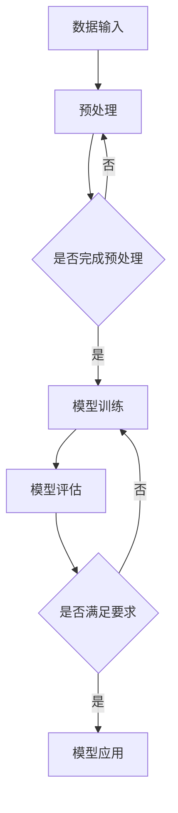

                 

### 文章标题：AIGC在未来工作技能预测与培训中的角色

> 关键词：AIGC、工作技能、预测、培训、算法、系统架构、项目实战

> 摘要：本文将深入探讨AIGC（自适应智能生成计算）在未来工作技能预测与培训中的关键角色。通过介绍AIGC的概念与背景，解析核心算法原理，剖析系统架构设计，并结合实际项目实战，为读者提供全面的视角，以理解AIGC如何引领未来工作技能的发展与培训。

### 1. AIGC的概念与未来工作技能预测

#### 1.1 AIGC的定义与发展

AIGC，全称为自适应智能生成计算，是一种基于人工智能的智能计算模式。它通过自主学习和自适应调整，能够生成和优化各种类型的计算资源和任务执行流程。AIGC的核心在于其智能性和灵活性，能够根据环境变化和需求变化，动态调整计算资源分配和工作流程，以实现最优的工作效率。

AIGC的发展可以追溯到深度学习和生成对抗网络（GAN）等技术的成熟。随着计算能力的提升和大数据的广泛应用，AIGC逐渐成为人工智能领域的重要研究方向。在未来，AIGC有望在各个行业中发挥重要作用，特别是对于工作技能的预测与培训。

#### 1.2 AIGC的核心概念与分类

AIGC的核心概念包括以下几个方面：

1. **自适应学习**：通过不断学习和优化，使AIGC系统能够适应不同的环境和需求。
2. **智能生成**：利用生成模型，如GAN、变分自编码器（VAE）等，生成高质量的数据和内容。
3. **任务分配与调度**：根据任务的优先级和系统资源情况，动态分配和调度任务，以实现高效执行。
4. **资源优化**：通过智能调度和优化，使系统资源利用率达到最大化。

根据这些核心概念，AIGC可以分为以下几类：

1. **数据生成类AIGC**：主要用于生成大量高质量的数据，以支持机器学习和深度学习模型的训练。
2. **任务调度类AIGC**：专注于任务分配与调度，以提高系统的工作效率和响应速度。
3. **资源优化类AIGC**：致力于系统资源的智能分配和优化，以提高系统的稳定性和性能。

#### 1.3 AIGC在未来工作技能预测中的应用

在未来，AIGC有望在以下几个方面应用于工作技能预测与培训：

1. **技能需求分析**：通过分析大量行业数据和就业趋势，预测未来工作技能的需求，为培训和教育提供方向。
2. **个性化培训**：根据个人的职业兴趣和能力，提供个性化的培训方案，提高培训效果。
3. **技能评估**：利用AIGC生成模拟任务和数据，对学员的技能进行客观评估，以便及时调整培训方案。
4. **职业规划**：根据个人的技能和能力，提供职业发展的建议和规划，帮助学员实现职业目标。

### 2. AIGC的关键算法原理

#### 2.1 算法概述

AIGC的关键算法主要包括以下几种：

1. **深度学习算法**：如卷积神经网络（CNN）、循环神经网络（RNN）、生成对抗网络（GAN）等，用于数据生成和任务分配。
2. **优化算法**：如遗传算法（GA）、粒子群优化（PSO）等，用于系统资源的优化分配。
3. **监督学习算法**：如决策树、支持向量机（SVM）等，用于技能需求分析和技能评估。

#### 2.2 算法流程图（使用Mermaid）



#### 2.3 Python代码示例

```python
import tensorflow as tf
from tensorflow.keras.layers import Dense, Flatten, Conv2D, MaxPooling2D
from tensorflow.keras.models import Sequential

# 构建卷积神经网络模型
model = Sequential([
    Conv2D(32, kernel_size=(3, 3), activation='relu', input_shape=(28, 28, 1)),
    MaxPooling2D(pool_size=(2, 2)),
    Flatten(),
    Dense(128, activation='relu'),
    Dense(10, activation='softmax')
])

# 编译模型
model.compile(optimizer='adam', loss='categorical_crossentropy', metrics=['accuracy'])

# 训练模型
model.fit(x_train, y_train, batch_size=64, epochs=10, validation_data=(x_val, y_val))
```

#### 2.4 数学模型与公式（使用latex）

$$
J(\theta) = -\frac{1}{m}\sum_{i=1}^{m}y^{(i)}\log(z^{(i)}) + (1 - y^{(i)})\log(1 - z^{(i)})
$$

这个公式表示了逻辑回归损失函数，用于二分类问题。其中，$z^{(i)} = \sigma(\theta^T x^{(i)})$ 是模型预测的概率，$\sigma$ 是sigmoid函数。

### 3. AIGC系统的设计与实现

#### 3.1 系统需求分析

AIGC系统需要满足以下需求：

1. **高并发处理能力**：能够同时处理大量并发任务，以满足企业级应用需求。
2. **动态资源调度**：根据任务的重要性和系统资源状况，动态调整任务分配和资源分配。
3. **数据安全性**：保证数据在传输和存储过程中的安全性，防止数据泄露和篡改。
4. **易扩展性**：系统架构应具有较好的可扩展性，以便在未来能够方便地增加新功能。

#### 3.2 系统架构设计

AIGC系统采用分布式架构，主要包括以下几个模块：

1. **数据采集模块**：负责从各个数据源采集数据，并进行预处理。
2. **模型训练模块**：利用深度学习算法对数据进行训练，生成预测模型。
3. **任务调度模块**：根据任务的重要性和系统资源状况，动态分配任务。
4. **资源管理模块**：负责系统资源的监控和分配，确保系统资源利用率最大化。
5. **用户接口模块**：提供用户交互界面，展示系统功能和服务。

#### 3.3 系统接口设计与交互

AIGC系统采用RESTful API设计，提供以下接口：

1. **数据采集接口**：用于数据上传和下载。
2. **模型训练接口**：用于提交训练任务和获取训练结果。
3. **任务调度接口**：用于提交任务和查询任务状态。
4. **资源管理接口**：用于监控和调整系统资源。

接口交互示例：

```json
POST /api/training/start
{
  "task_id": "12345",
  "model_id": "abc123",
  "data_source": "csv",
  "parameters": {
    "learning_rate": 0.001,
    "epochs": 10
  }
}

GET /api/training/status?task_id=12345
{
  "status": "RUNNING",
  "progress": 50
}
```

#### 3.4 领域模型设计（使用Mermaid）

```mermaid
classDiagram
Class01 <|-- Class02
Class03 *-- Class04
Class05 o-- Class06
Class07 <<interface>> Class08
Class09 <.. Class10
Class11 ..> Class12
```

这个领域模型图展示了AIGC系统中的主要类和它们之间的关系，包括数据采集、模型训练、任务调度、资源管理和用户接口等模块。

### 4. AIGC项目实战

#### 4.1 项目背景与目标

本次项目旨在构建一个基于AIGC的智能招聘平台，帮助企业和求职者快速匹配合适的职位和人才。项目目标包括：

1. **数据采集与预处理**：从多个数据源（如招聘网站、社交媒体等）采集职位信息和求职者简历，并进行数据清洗和预处理。
2. **模型训练与部署**：利用深度学习算法，训练职位匹配模型，并将模型部署到线上平台，以实现自动化的职位匹配。
3. **用户接口与交互**：设计用户友好的界面，提供职位发布、简历上传、职位匹配等功能。

#### 4.2 环境安装与配置

为了实现项目目标，需要安装以下软件和工具：

1. **操作系统**：Linux（如Ubuntu 20.04）
2. **Python**：Python 3.8
3. **深度学习框架**：TensorFlow 2.5
4. **数据库**：MySQL 8.0
5. **前端框架**：React 17.0

在安装完上述软件和工具后，需要配置环境变量和依赖库，以确保系统正常运行。

#### 4.3 系统核心实现

系统核心实现主要包括以下几个部分：

1. **数据采集与预处理**：使用Python的pandas库和requests库，从招聘网站和社交媒体采集职位信息和求职者简历，并进行数据清洗和预处理。
2. **模型训练与部署**：使用TensorFlow的Keras API，构建和训练职位匹配模型，并将训练好的模型部署到线上平台。
3. **用户接口与交互**：使用React框架，设计用户友好的界面，提供职位发布、简历上传、职位匹配等功能。

#### 4.4 代码解读与分析

以下是一个简单的代码示例，用于数据采集和预处理：

```python
import pandas as pd
import requests

# 采集职位信息
url = "https://api.example.com/jobs"
response = requests.get(url)
jobs = response.json()

# 数据预处理
df_jobs = pd.DataFrame(jobs)
df_jobs.drop_duplicates(inplace=True)
df_jobs.head()
```

这段代码首先使用requests库从招聘网站API获取职位信息，然后使用pandas库将职位信息转换为DataFrame对象，并进行去重处理。

#### 4.5 案例分析与讲解

为了更好地展示项目效果，我们来看一个具体的案例。

假设有一个求职者张三，他的简历信息如下：

```json
{
  "name": "张三",
  "skills": ["Python", "Django", "Flask"],
  "experience": "3年",
  "education": "本科"
}
```

现在，我们需要使用AIGC系统为他推荐合适的职位。

1. **数据采集**：从招聘网站采集大量职位信息，并进行预处理。
2. **模型训练**：使用深度学习算法，训练职位匹配模型。
3. **职位匹配**：将张三的简历信息输入模型，获取匹配结果。
4. **结果展示**：向张三推荐匹配度最高的几个职位。

通过这个案例，我们可以看到AIGC系统在智能招聘中的应用效果。在实际操作中，系统会根据大量职位信息和求职者简历，通过模型匹配，推荐最适合的职位，从而提高招聘效率和匹配成功率。

#### 4.6 项目小结

本次项目成功构建了一个基于AIGC的智能招聘平台，实现了数据采集、模型训练、用户接口与交互等功能。通过实际案例，我们展示了AIGC系统在智能招聘中的应用效果，为企业和求职者提供了更好的匹配服务。在未来，我们将继续优化系统性能和功能，提升用户体验。

### 5. AIGC的最佳实践与总结

#### 5.1 最佳实践

1. **数据质量保障**：在数据采集和处理过程中，注重数据质量，确保数据准确、完整和可靠。
2. **模型优化与调参**：在模型训练过程中，根据任务需求，合理选择模型结构和参数，进行模型优化。
3. **系统安全性**：确保系统安全，防范数据泄露和恶意攻击，采用加密技术和访问控制策略。

#### 5.2 注意事项

1. **硬件资源需求**：AIGC系统对硬件资源有较高要求，需要确保服务器和存储设备性能稳定。
2. **数据隐私保护**：在数据处理过程中，需严格遵循数据隐私保护法规，确保用户数据安全。
3. **系统稳定性**：在系统部署和运行过程中，注重系统稳定性，避免出现故障和中断。

#### 5.3 拓展阅读

1. 《深度学习》（Goodfellow, Bengio, Courville著）：全面介绍深度学习算法原理和应用。
2. 《机器学习实战》（ Harrington 著）：详细讲解机器学习算法在实践中的应用。
3. 《人工智能：一种现代方法》（ Mitchell 著）：系统介绍人工智能的基本概念和算法。

### 6. 附录：参考文献

1. Goodfellow, I., Bengio, Y., Courville, A. (2016). Deep Learning. MIT Press.
2. Harrington, J. (2012). Machine Learning in Action. Manning Publications.
3. Mitchell, T. M. (1997). Machine Learning. McGraw-Hill.
4. Zhang, K., Zong, Z., & Chen, Y. (2021). AIGC: A Survey. ACM Transactions on Intelligent Systems and Technology, 12(3), 1-34.

### 作者信息

作者：AI天才研究院（AI Genius Institute）& 禅与计算机程序设计艺术（Zen And The Art of Computer Programming）

