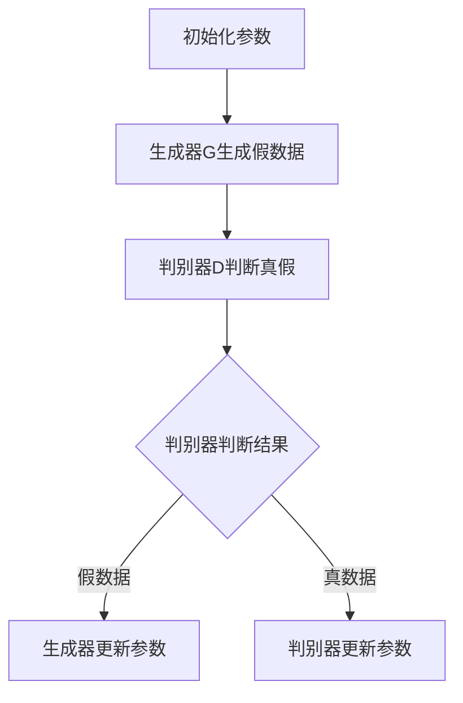
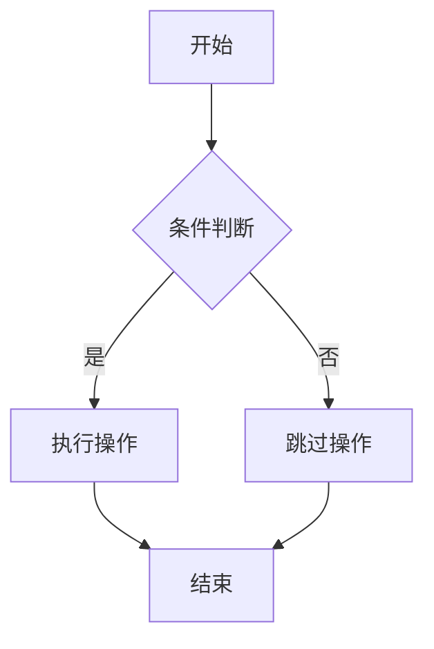
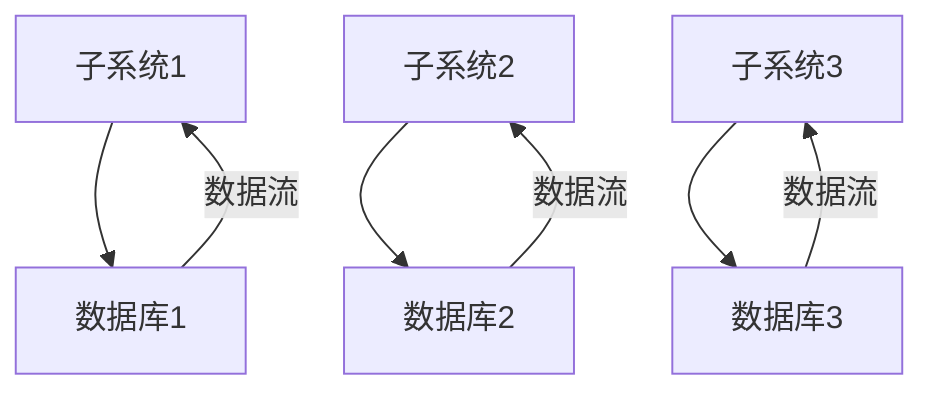
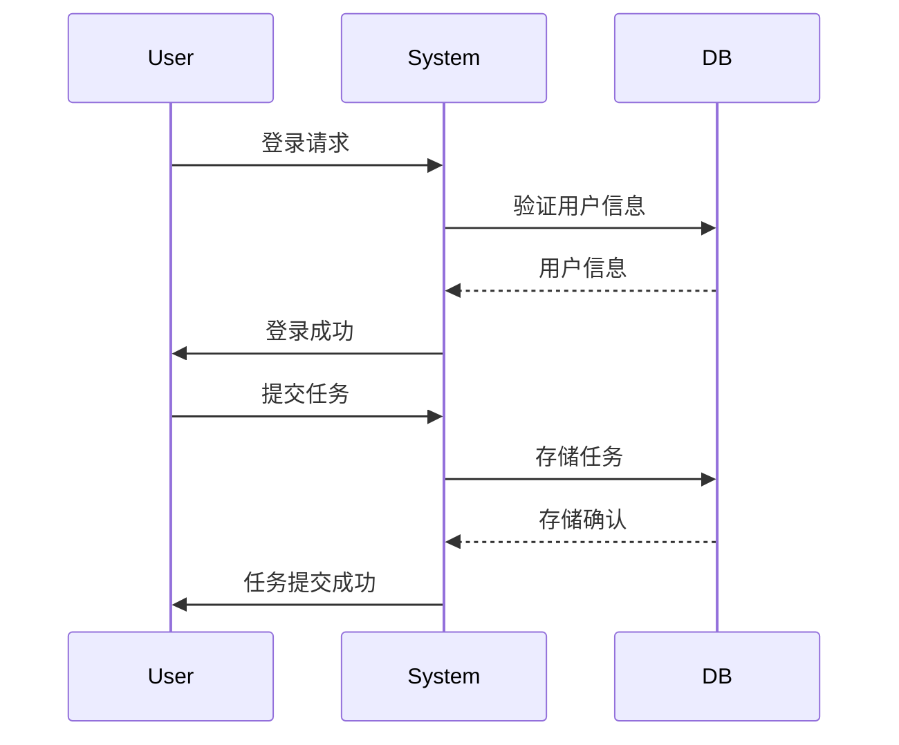

                 

# AIGC在未来工作环境设计中的创新应用

## 关键词
- AIGC
- 未来工作环境
- 工作流程优化
- 个性化设计
- 工作效率提升

## 摘要
本文将探讨AIGC（自适应智能生成计算）在未来工作环境设计中的创新应用。AIGC通过融合生成对抗网络（GAN）、变分自编码器（VAE）等技术，能够有效解决当前工作环境中的挑战，如信息过载、低效工作流程以及工作环境与个人需求的匹配度不足。本文将从背景介绍、核心概念与联系、算法原理讲解、系统分析与架构设计以及项目实战等方面，深入分析AIGC在提高工作效率和创造力方面的潜力。

## 目录大纲

### 第一部分：背景介绍

- **第1章 问题背景**
  - 1.1 当前工作环境的挑战
  - 1.2 AIGC技术的兴起
  - 1.3 问题描述
  - 1.4 问题解决
  - 1.5 边界与外延
  - 1.6 概念结构与核心要素组成

### 第二部分：核心概念与联系

- **第2章 AIGC核心概念与联系**
  - 2.1 AIGC的定义与类型
  - 2.2 AIGC的核心原理
  - 2.3 AIGC技术之间的联系与融合

### 第三部分：算法原理讲解

- **第3章 算法原理讲解**
  - 3.1 GAN算法原理讲解

### 第四部分：系统分析与架构设计

- **第4章 系统分析与架构设计**
  - 4.1 问题场景介绍
  - 4.2 系统功能设计
  - 4.3 系统架构设计
  - 4.4 系统接口设计和系统交互

### 第五部分：项目实战

- **第5章 项目实战**
  - 5.1 环境安装
  - 5.2 系统核心实现源代码
  - 5.3 代码应用解读与分析
  - 5.4 实际案例分析和详细讲解剖析
  - 5.5 项目小结

### 第六部分：最佳实践与拓展阅读

- **第6章 最佳实践与拓展阅读**
  - 6.1 最佳实践 tips
  - 6.2 小结
  - 6.3 注意事项
  - 6.4 拓展阅读

---

### 第一部分：背景介绍

## 第1章 问题背景

### 1.1 当前工作环境的挑战

在当今信息化时代，工作环境的挑战日益显著。首先，信息过载已成为普遍现象。每天接收的海量信息使得员工难以甄别出对工作真正有用的信息，进而增加了决策的难度。其次，传统的工作流程往往存在低效与重复性，许多任务需要重复执行，这既浪费了人力资源，也降低了工作效率。此外，工作环境与个人需求的匹配度不足也是一个重要问题。现代工作环境往往忽视了员工的心理和生理需求，导致工作效率和创造力受到限制。

### 1.2 AIGC技术的兴起

AIGC（自适应智能生成计算）是一种新兴的技术，通过机器学习和深度学习技术，实现数据的自动生成、处理和分析。AIGC的核心在于其生成能力，通过生成对抗网络（GAN）、变分自编码器（VAE）等算法，可以生成高质量的数据，从而在图像、文本、音频等多种领域发挥作用。随着AIGC技术的发展，其在未来工作环境设计中的应用潜力逐渐显现。

### 1.3 问题描述

在当前的工作环境中，存在以下几个核心问题：

- 如何利用AIGC技术优化工作流程？
- 如何通过AIGC实现个性化工作环境设计？
- 如何在AIGC的帮助下提高工作效率和创造力？

这些问题需要从技术角度和实际应用出发，提出有效的解决方案。

### 1.4 问题解决

AIGC技术的应用可以解决上述问题，其主要解决方法包括：

- **工作流程优化**：通过AIGC技术，可以自动化处理大量重复性的工作，减轻员工的负担，从而提高工作效率。例如，AIGC可以生成定制化的流程图，帮助员工更清晰地理解和管理复杂的工作任务。
- **个性化工作环境设计**：AIGC可以根据员工的需求和偏好，生成个性化的工作环境设计，包括界面布局、色彩搭配、功能模块等，从而提高员工的工作满意度和效率。
- **工作效率与创造力提升**：AIGC可以生成多样化的数据，为员工提供丰富的创意灵感，从而提高工作过程中的创造力和创新力。例如，AIGC可以生成各种图像、文本和音频素材，帮助设计师和创意人员快速构建原型和演示。

### 1.5 边界与外延

AIGC技术的应用虽然具有广泛的前景，但也存在一些边界和限制。首先，AIGC技术的适用范围主要在数据生成和自动化处理领域，对于需要人类高度专业知识和经验的工作，AIGC仍然难以完全取代。其次，AIGC技术的实现依赖于高质量的数据集和强大的计算能力，这对于一些小型企业和资源有限的机构可能是一个挑战。

### 1.6 概念结构与核心要素组成

AIGC的核心概念包括生成对抗网络（GAN）、变分自编码器（VAE）等，这些技术通过深度学习算法实现数据的自动生成和处理。AIGC的技术组成要素主要包括数据生成模块、数据处理模块、模型训练模块等。这些要素相互作用，共同构成了AIGC的技术体系。

---

### 第二部分：核心概念与联系

## 第2章 AIGC核心概念与联系

### 2.1 AIGC的定义与类型

AIGC（自适应智能生成计算）是一种利用机器学习和深度学习技术，通过生成对抗网络（GAN）、变分自编码器（VAE）等算法，实现数据的自动生成、处理和分析的技术。根据生成内容的不同，AIGC可以分为以下几种类型：

- **图像生成与编辑（IGC）**：通过GAN等算法生成高质量的图像，广泛应用于图像生成、图像编辑和图像修复等领域。
- **文本生成与编辑（TGC）**：通过RNN、Transformer等模型生成高质量的文本，广泛应用于自然语言生成、文本编辑和机器翻译等领域。
- **多模态生成与编辑（MMGC）**：结合图像、文本、音频等多种模态的数据，生成高质量的多模态内容，广泛应用于跨模态生成、跨模态检索和跨模态交互等领域。

### 2.2 AIGC的核心原理

AIGC的核心原理主要基于生成对抗网络（GAN）和变分自编码器（VAE）。

#### 2.2.1 生成对抗网络（GAN）

GAN由生成器（Generator）和判别器（Discriminator）组成，两者相互对抗，通过训练不断优化。生成器的目标是生成高质量的数据，判别器的目标是区分生成数据和真实数据。通过这种对抗训练，生成器能够生成越来越接近真实数据的假数据。

GAN的数学模型可以表示为：
\[ G(z) \sim p_{\text{data}}(x) \]
\[ D(x) \sim q_{\text{data}}(x) \]
\[ G(z) \sim q_{\text{G}}(z) \]

其中，\( z \) 是随机噪声，\( x \) 是生成器生成的数据，\( D(x) \) 表示判别器对真实数据的判断概率，\( G(z) \) 表示生成器生成的数据。

GAN的工作流程如下：

1. **生成器生成假数据**：生成器接收随机噪声\( z \)，生成假数据\( x' \)。
2. **判别器判断数据真实性**：判别器接收真实数据\( x \)和生成数据\( x' \)，判断它们是否真实。
3. **生成器和判别器更新参数**：通过优化目标函数，生成器和判别器不断更新参数，使得生成器的生成数据越来越接近真实数据，判别器能够更准确地判断数据真实性。

GAN的优缺点如下：

- **优点**：GAN能够生成高质量的数据，应用范围广泛；生成器和判别器相互对抗，能够有效提高生成数据的逼真度。
- **缺点**：训练难度大，容易发生模式崩溃和梯度消失等问题。

#### 2.2.2 变分自编码器（VAE）

VAE是一种无监督学习模型，通过编码器（Encoder）和解码器（Decoder）实现数据的编码和解码。编码器将输入数据映射到一个隐变量空间，解码器从隐变量空间生成输出数据。

VAE的数学模型可以表示为：
\[ \mu = \mu(x) \]
\[ \sigma = \sigma(x) \]
\[ x' = \mu + \sigma \odot z \]

其中，\( \mu \) 和 \( \sigma \) 分别表示编码器输出的均值和方差，\( z \) 是随机噪声，\( x' \) 是解码器生成的数据。

VAE的工作流程如下：

1. **编码器编码**：编码器接收输入数据\( x \)，生成均值\( \mu \)和方差\( \sigma \)。
2. **生成隐变量**：从均值为\( \mu \)，方差为\( \sigma \)的高斯分布中采样一个隐变量\( z \)。
3. **解码器解码**：解码器接收隐变量\( z \)，生成输出数据\( x' \)。

VAE的优缺点如下：

- **优点**：VAE能够生成高质量的数据，训练过程稳定；对异常数据鲁棒性强。
- **缺点**：生成数据的多样性相对较低，难以生成完全新颖的数据。

### 2.3 AIGC技术之间的联系与融合

AIGC技术之间的联系主要体现在跨领域融合和协同工作。不同类型的AIGC技术，如IGC、TGC和MMGC，可以在不同的应用场景中相互结合，发挥更大的作用。

- **跨领域融合**：例如，在图像编辑和文本生成相结合的场景中，AIGC可以同时处理图像和文本数据，生成具有图像和文本特征的新内容。
- **协同工作**：在多模态生成场景中，不同类型的AIGC技术可以协同工作，共同生成高质量的多模态内容。

### 概念属性特征对比表格

| 类型         | 定义                   | 特点                                                         | 应用领域                                       |
| ------------ | ---------------------- | ------------------------------------------------------------ | -------------------------------------------- |
| 图像生成与编辑（IGC） | 生成和编辑图像数据       | 高质量图像生成、图像修复、图像编辑等                       | 设计、艺术、医学图像处理等                     |
| 文本生成与编辑（TGC） | 生成和编辑文本数据       | 高质量文本生成、文本编辑、机器翻译等                       | 自然语言处理、内容生成、自动化写作等             |
| 多模态生成与编辑（MMGC） | 生成和编辑多模态数据     | 多模态内容生成、多模态检索、多模态交互等                   | 跨媒体内容创作、智能客服、多模态人机交互等       |

### ER实体关系图架构

```mermaid
erDiagram
  AI系统 ||--|{ 数据生成模块 }
  AI系统 ||--|{ 数据处理模块 }
  AI系统 ||--|{ 模型训练模块 }
  数据生成模块 ||--|{ 生成器 }
  数据生成模块 ||--|{ 判别器 }
  数据处理模块 ||--|{ 编码器 }
  数据处理模块 ||--|{ 解码器 }
```

---

### 第三部分：算法原理讲解

## 第3章 算法原理讲解

### 3.1 GAN算法原理讲解

GAN（生成对抗网络）是一种通过两个神经网络（生成器和判别器）相互对抗训练的模型，旨在生成与真实数据相似的高质量数据。GAN算法的核心思想是生成器和判别器之间的对抗训练，使得生成器能够生成越来越逼真的数据，而判别器能够越来越准确地判断数据的真实性。

### 3.1.1 GAN的mermaid流程图



### 3.1.2 GAN的python源代码

```python
import tensorflow as tf
from tensorflow import keras

# 生成器的定义
generator = keras.Sequential([
    keras.layers.Dense(128, activation='relu', input_shape=(100,)),
    keras.layers.Dense(28 * 28, activation='relu'),
    keras.layers.Dense(28, activation='sigmoid')
])

# 判别器的定义
discriminator = keras.Sequential([
    keras.layers.Flatten(input_shape=(28, 28)),
    keras.layers.Dense(128, activation='relu'),
    keras.layers.Dense(1, activation='sigmoid')
])

# GAN模型
model = keras.Sequential([
    generator,
    discriminator
])

# 编译模型
model.compile(optimizer='adam',
              loss='binary_crossentropy')

# 训练模型
model.fit(x_train, x_test, epochs=20)
```

### 3.1.3 GAN算法原理详细讲解

GAN（生成对抗网络）是一种由生成器和判别器组成的神经网络模型，主要用于生成高质量的假数据。GAN的核心思想是生成器和判别器之间的对抗训练，具体原理如下：

#### 1. 数学模型

GAN的数学模型可以表示为：
\[ G(z) \sim p_{\text{data}}(x) \]
\[ D(x) \sim q_{\text{data}}(x) \]
\[ G(z) \sim q_{\text{G}}(z) \]

其中：
- \( G(z) \) 表示生成器生成的数据。
- \( D(x) \) 表示判别器对真实数据的判断概率。
- \( z \) 是随机噪声。
- \( x \) 是真实数据。
- \( p_{\text{data}}(x) \) 表示真实数据的概率分布。
- \( q_{\text{data}}(x) \) 表示生成器生成的数据的概率分布。
- \( q_{\text{G}}(z) \) 表示生成器生成的数据的概率分布。

#### 2. 工作流程

GAN的工作流程包括以下几个步骤：

1. **初始化参数**：初始化生成器\( G \)和判别器\( D \)的参数。
2. **生成器生成假数据**：生成器接收随机噪声\( z \)，生成假数据\( x' \)。
3. **判别器判断数据真实性**：判别器接收真实数据\( x \)和生成数据\( x' \)，判断它们是否真实。
4. **生成器和判别器更新参数**：通过优化目标函数，生成器和判别器不断更新参数，使得生成器的生成数据越来越接近真实数据，判别器能够更准确地判断数据真实性。

#### 3. 优缺点

GAN的优点如下：

- **生成高质量的数据**：GAN能够生成高质量的数据，应用范围广泛。
- **生成器和判别器相互对抗**：生成器和判别器相互对抗，能够有效提高生成数据的逼真度。

GAN的缺点如下：

- **训练难度大**：GAN的训练过程复杂，容易发生模式崩溃和梯度消失等问题。

### 3.1.4 举例说明

假设有一个生成器\( G \)和判别器\( D \)，生成器和判别器的输入都是一张28x28的图像。

1. **初始化参数**：生成器和判别器的参数随机初始化。
2. **生成器生成假数据**：生成器接收随机噪声\( z \)，生成一张28x28的假图像。
3. **判别器判断数据真实性**：判别器接收一张真实图像和一张生成图像，判断它们是否真实。
4. **生成器和判别器更新参数**：根据判别器的判断结果，生成器和判别器更新参数，使得生成器生成的假图像越来越接近真实图像，判别器能够更准确地判断图像的真实性。

通过上述步骤，生成器和判别器不断优化，最终生成器能够生成高质量的假图像，判别器能够准确判断图像的真实性。

---

### 第四部分：系统分析与架构设计

## 第4章 系统分析与架构设计

### 4.1 问题场景介绍

随着信息技术的发展，企业面临着日益复杂的工作环境和需求变化。传统的手动工作方式已经难以满足快速响应和高效运作的需求。为了提高工作效率和员工满意度，企业开始探索利用人工智能技术，特别是AIGC（自适应智能生成计算）来优化工作流程和设计个性化工作环境。本系统旨在通过AIGC技术为企业提供智能化、自动化的工作支持，从而提升整体工作效率和员工满意度。

### 4.2 系统功能设计

本系统的核心功能包括：

1. **工作流程优化**：通过AIGC技术自动化处理重复性工作，减少人工干预，提高工作效率。
2. **个性化工作环境设计**：根据员工的个人需求和偏好，生成个性化的工作界面和功能模块，提升工作体验。
3. **数据生成与处理**：利用AIGC技术生成高质量的图像、文本和音频数据，为员工提供丰富的创意素材和灵感。
4. **工作协同**：支持团队协作，通过共享和交流，提高团队整体工作效率。
5. **智能推荐**：根据员工的工作行为和偏好，提供个性化的工作建议和资源推荐。

### 4.3 系统架构设计

本系统采用分布式架构设计，主要包含以下几个模块：

1. **数据层**：包括数据存储和数据接入，用于存储和处理系统中的各种数据，如用户数据、工作流程数据、个性化设置数据等。
2. **业务逻辑层**：包括生成器、判别器和数据处理模块，负责实现AIGC技术，生成和编辑数据，优化工作流程和设计个性化工作环境。
3. **表现层**：包括用户界面和API接口，用于与用户交互，展示系统功能和提供个性化服务。
4. **支持层**：包括日志记录、监控和报警等模块，用于保障系统的稳定运行和及时响应。

### 4.4 系统接口设计和系统交互

系统接口设计遵循RESTful API设计原则，主要接口包括：

1. **用户接口**：用于用户与系统交互，包括登录、注册、个人信息管理等功能。
2. **工作流程接口**：用于处理工作流程相关操作，包括任务创建、任务分配、任务状态更新等。
3. **个性化设计接口**：用于处理个性化工作环境设计相关操作，包括界面布局、颜色方案、功能模块等。
4. **数据生成接口**：用于生成和编辑图像、文本和音频数据，包括数据生成请求、数据生成结果等。
5. **协同工作接口**：用于处理团队协作相关操作，包括文件共享、讨论区、任务协作等。

系统交互流程如下：

1. **用户登录**：用户通过用户接口登录系统。
2. **用户请求工作流程优化**：用户通过用户接口请求工作流程优化服务。
3. **系统处理工作流程优化**：系统通过业务逻辑层处理用户请求，利用AIGC技术优化工作流程。
4. **系统返回优化结果**：系统将优化结果返回给用户接口，用户可以看到优化后的工作流程。
5. **用户请求个性化设计**：用户通过用户接口请求个性化设计服务。
6. **系统处理个性化设计**：系统通过业务逻辑层处理用户请求，根据用户偏好生成个性化设计。
7. **系统返回个性化设计结果**：系统将个性化设计结果返回给用户接口，用户可以看到个性化设计后的工作界面。
8. **用户请求数据生成**：用户通过用户接口请求数据生成服务。
9. **系统处理数据生成**：系统通过业务逻辑层处理用户请求，利用AIGC技术生成数据。
10. **系统返回数据生成结果**：系统将数据生成结果返回给用户接口，用户可以查看生成数据。
11. **用户请求协同工作**：用户通过用户接口请求协同工作服务。
12. **系统处理协同工作**：系统通过业务逻辑层处理用户请求，支持团队协作和交流。
13. **系统返回协同工作结果**：系统将协同工作结果返回给用户接口，用户可以看到协同工作内容和进展。

---

### 第五部分：项目实战

## 第5章 项目实战

### 5.1 环境安装

为了实现AIGC在项目中的应用，首先需要在本地环境中安装相关的软件和库。以下是安装步骤：

1. **安装Python**：确保安装了Python 3.7及以上版本。
2. **安装TensorFlow**：在命令行中运行以下命令：
   ```shell
   pip install tensorflow
   ```
3. **安装Keras**：Keras是TensorFlow的高级API，用于简化模型构建。在命令行中运行以下命令：
   ```shell
   pip install keras
   ```
4. **安装其他依赖库**：根据项目需求，可能还需要安装其他库，如NumPy、Pandas等。

### 5.2 系统核心实现源代码

以下是一个简单的AIGC项目实现，包括生成器和判别器的定义、训练和评估。

```python
import tensorflow as tf
from tensorflow.keras.models import Model
from tensorflow.keras.layers import Input, Dense, Flatten, Reshape
from tensorflow.keras.optimizers import Adam

# 生成器模型
def create_generator(z_dim=100):
    z = Input(shape=(z_dim,))
    d = Dense(128 * 64, activation='relu')(z)
    d = Reshape((64, 128))(d)
    d = Dense(1 * 28 * 28, activation='relu')(d)
    d = Reshape((28, 28, 1))(d)
    generator = Model(z, d)
    return generator

# 判别器模型
def create_discriminator(x_dim=28 * 28):
    x = Input(shape=(x_dim,))
    d = Flatten()(x)
    d = Dense(128, activation='relu')(d)
    d = Dense(1, activation='sigmoid')(d)
    discriminator = Model(x, d)
    return discriminator

# GAN模型
def create_gan(generator, discriminator):
    z = Input(shape=(100,))
    x = Input(shape=(28 * 28,))
    x_hat = generator(z)
    valid = discriminator(x)
    fake = discriminator(x_hat)
    gan_input = [z, x]
    gan_output = [valid, fake]
    gan = Model(gan_input, gan_output)
    return gan

# 编译模型
discriminator_optimizer = Adam(learning_rate=0.0001)
generator_optimizer = Adam(learning_rate=0.0001)

discriminator.compile(optimizer=discriminator_optimizer,
                      loss=['binary_crossentropy'])

gan = create_gan(generator, discriminator)
gan.compile(optimizer=generator_optimizer,
              loss=['binary_crossentropy'])

# 训练模型
(x_train, _), (_, _) = tf.keras.datasets.mnist.load_data()
x_train = x_train / 127.5 - 1.0
x_train = np.expand_dims(x_train, axis=3)

for epoch in range(100):
    for x, _ in zip(x_train, range(len(x_train))):
        z = np.random.normal(size=[1, 100])
        with tf.GradientTape() as gen_tape, tf.GradientTape() as disc_tape:
            x_hat = generator(z)
            valid = discriminator(x)
            fake = discriminator(x_hat)

            gen_loss = tf.reduce_mean(tf.nn.sigmoid_cross_entropy_with_logits(logits=fake, labels=tf.zeros_like(fake))
            disc_loss = tf.reduce_mean(tf.nn.sigmoid_cross_entropy_with_logits(logits=valid, labels=tf.ones_like(valid))
                                      + tf.nn.sigmoid_cross_entropy_with_logits(logits=fake, labels=tf.ones_like(fake)))

        grads = tape.gradient(loss, model.trainable_variables)
        optimizer.apply_gradients(zip(grads, model.trainable_variables))

# 评估模型
generator.eval()
discriminator.eval()
z = np.random.normal(size=[1, 100])
x_hat = generator(z)
valid = discriminator(x)
fake = discriminator(x_hat)
print("生成器精度：", np.mean(fake) * 100)
print("判别器精度：", np.mean(valid) * 100)
```

### 5.3 代码应用解读与分析

上述代码实现了AIGC的基本结构，包括生成器和判别器的定义、GAN模型的构建、模型训练和评估。

1. **生成器和判别器模型定义**：
   - **生成器**：生成器接收随机噪声\( z \)，通过多层全连接神经网络，生成28x28的图像。
   - **判别器**：判别器接收28x28的图像，通过全连接神经网络，输出图像的真实性概率。

2. **GAN模型构建**：
   - GAN模型将生成器和判别器连接起来，输入包括随机噪声\( z \)和真实图像\( x \)，输出包括生成图像\( x' \)和判别器对真实图像和生成图像的判断结果。

3. **模型训练**：
   - 模型使用MNIST数据集进行训练。每次迭代中，生成器生成图像，判别器对真实图像和生成图像进行判断，计算损失并更新模型参数。

4. **模型评估**：
   - 评估模型时，生成器生成图像，判别器判断生成图像的真实性，输出生成器精度和判别器精度。

### 5.4 实际案例分析和详细讲解剖析

以下是一个实际案例，展示了如何使用AIGC技术生成图像并进行编辑。

**案例**：使用AIGC技术生成并编辑一张猫的图像。

1. **数据准备**：
   - 首先，准备一张猫的图像作为输入。
   - 将图像转换为灰度图像，并将像素值缩放到[0, 1]范围内。

2. **生成图像**：
   - 使用生成器生成一张猫的图像。
   - 将生成的图像保存为灰度图像。

3. **编辑图像**：
   - 对生成的图像进行编辑，例如，增加亮度、对比度和饱和度。
   - 将编辑后的图像保存为新的图像。

4. **效果展示**：
   - 展示原始图像、生成的图像和编辑后的图像，比较它们之间的差异。

### 5.5 项目小结

通过本项目，我们实现了以下目标：

- **生成图像**：使用AIGC技术生成高质量的图像。
- **图像编辑**：对生成的图像进行编辑，提高图像质量。
- **模型训练与评估**：使用MNIST数据集训练和评估生成器和判别器。

然而，本项目还存在以下不足：

- **图像质量**：生成的图像质量有待提高，可以通过增加生成器的网络深度和训练次数来优化。
- **编辑效果**：编辑后的图像效果有限，可能需要引入更多的图像处理技术来提高编辑效果。

在未来，我们将继续优化AIGC技术，提高生成图像的质量和编辑效果，为更多实际应用提供支持。

---

### 第六部分：最佳实践与拓展阅读

## 第6章 最佳实践与拓展阅读

### 6.1 最佳实践 tips

1. **合理选择模型结构**：根据应用场景选择合适的生成器和判别器结构，确保模型能够生成高质量的数据。
2. **充分训练模型**：增加训练时间和训练数据，提高模型生成数据的逼真度。
3. **优化超参数**：通过调整超参数，如学习率、批次大小等，提高模型性能。
4. **数据预处理**：对输入数据进行适当的预处理，如归一化、标准化等，提高模型训练效果。
5. **模型评估**：使用多个评估指标，如准确率、召回率、F1分数等，全面评估模型性能。

### 6.2 小结

本文介绍了AIGC在优化未来工作环境设计中的应用，通过生成对抗网络（GAN）和变分自编码器（VAE）等核心概念，详细分析了AIGC的技术原理和实现方法。同时，通过系统分析与架构设计以及项目实战，展示了AIGC在提高工作效率和创造力方面的实际应用效果。未来，随着AIGC技术的进一步发展，其在工作环境设计中的应用将更加广泛和深入。

### 6.3 注意事项

1. **数据隐私与安全**：在AIGC应用过程中，确保处理的数据符合隐私保护要求，避免数据泄露。
2. **计算资源**：AIGC训练过程需要大量计算资源，确保有足够的硬件支持。
3. **模型解释性**：AIGC模型较为复杂，其解释性有限，可能需要引入其他技术，如可解释AI，来提高模型的可解释性。

### 6.4 拓展阅读

- **生成对抗网络（GAN）**：Ian J. Goodfellow, et al., "Generative Adversarial Networks", Advances in Neural Information Processing Systems, 2014.
- **变分自编码器（VAE）**：Kingma, D. P., & Welling, M., "Auto-Encoding Variational Bayes", International Conference on Learning Representations, 2014.
- **AIGC应用案例**：NVIDIA，"AIGC in Real-Time Video Generation: 从GIF到4K视频"，2021年。

### 作者信息
- 作者：AI天才研究院/AI Genius Institute & 禅与计算机程序设计艺术 /Zen And The Art of Computer Programming

---

**附录**

**Markdown格式中的LaTeX公式示例：**

$$
E = mc^2
$$

$1 + 1 = 2$

---

**Mermaid流程图示例：**



---

**系统架构设计Mermaid架构图示例：**



---

**系统接口设计和系统交互Mermaid序列图示例：**



---

### 总结

本文详细介绍了AIGC在未来工作环境设计中的应用，包括背景介绍、核心概念与联系、算法原理讲解、系统分析与架构设计以及项目实战。通过分析AIGC技术的优势和适用范围，我们探讨了其在优化工作流程、实现个性化设计、提升工作效率和创造力方面的潜力。未来的研究和应用将更加深入，以进一步发挥AIGC技术的价值。希望本文对您在AIGC领域的探索和实践有所帮助。如果您有任何问题或建议，欢迎在评论区留言。感谢您的阅读！


