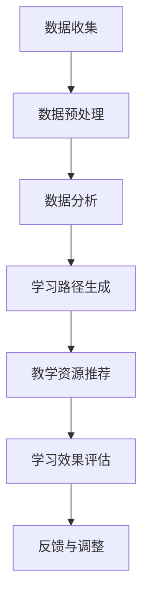
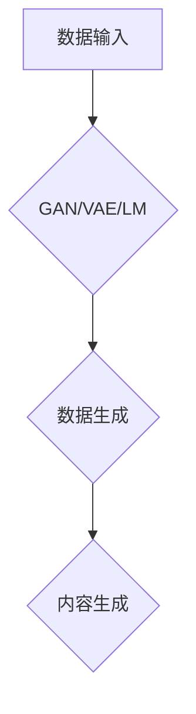

                 

## AIGC在未来教育中的角色：个性化学习路径设计

### 关键词：
- AIGC
- 个性化学习路径
- 教育变革
- 数据驱动学习
- 智能推荐系统

### 摘要：
随着人工智能技术的进步，生成式内容（AIGC）在教育领域的应用日益广泛。本文旨在探讨AIGC如何通过个性化学习路径设计，提升教育质量和促进学习效率。我们将从AIGC的概念、核心技术、应用场景，到个性化学习路径的设计方法和AIGC在其中的作用，进行深入分析，并提出未来教育中AIGC应用的展望。

---

### 背景介绍

#### 问题背景

教育的目标是培养学生的综合素质，而每个学生的天赋、兴趣和学习习惯都是独特的。传统教育模式往往采用“一刀切”的方法，难以满足每个学生的个性化需求。随着信息技术的快速发展，特别是生成式AI（AIGC）的崛起，个性化教育成为可能。AIGC能够根据学生的学习数据，自动生成适应其个性需求的学习内容和学习路径，从而实现教育的个性化。

#### 问题解决

本文将探讨AIGC技术如何应用于教育领域，特别是在个性化学习路径设计中的作用。通过分析AIGC的技术原理和应用场景，我们旨在为教育工作者和技术开发者提供指导，以实现更高效、个性化的教育。

#### 边界与外延

本文的核心内容将聚焦于以下几个方面：

1. **教育数据收集与处理**：如何有效地收集和分析学生的学习数据。
2. **个性化学习路径生成**：基于学生数据分析，如何设计出适应个体学习需求的学习路径。
3. **教学资源的智能推荐**：如何利用AIGC技术推荐与学生学习进度和兴趣相符的教学资源。
4. **学习效果评估与反馈**：如何通过AIGC技术对学生学习效果进行实时评估，并给予及时的反馈。

#### 概念结构与核心要素组成

核心概念：AIGC、个性化学习路径、教学资源、学习效果评估。

核心要素：

- **数据收集与处理**：数据是AIGC技术的基础，有效的数据收集和处理是设计个性化学习路径的关键。
- **算法模型**：包括机器学习算法、深度学习算法等，用于分析和生成个性化学习路径。
- **教学资源库**：存储大量的教学资源，包括教材、视频、习题等，以供智能推荐。
- **评估模型**：用于评估学生的学习效果，并反馈给学习路径生成系统进行优化。

---

### 第一部分: AIGC技术基础

## 第1章: AIGC技术概述

### 1.1 AIGC的概念与发展历程

#### 1.1.1 AIGC的定义

AIGC（AI-Generated Content）是指利用人工智能技术自动生成内容的过程。它涵盖了文本、图像、音频等多种类型的内容生成。AIGC技术通过机器学习模型，从大量的数据中学习规律，然后生成新的、符合人类创造性的内容。

#### 1.1.2 AIGC的发展历程

AIGC技术的发展可以追溯到20世纪80年代，当时基于规则的自动写作系统开始出现。然而，随着深度学习技术的兴起，特别是在2014年生成式对抗网络（GAN）的出现，AIGC技术取得了重大突破。如今，AIGC已经能够在多个领域生成高质量的内容。

### 1.2 AIGC的核心算法

#### 1.2.1 生成式对抗网络（GAN）

GAN是一种用于生成数据的机器学习模型，由生成器和判别器组成。生成器尝试生成逼真的数据，而判别器则试图区分生成数据和真实数据。通过这种相互对抗的过程，生成器不断优化，从而生成越来越真实的数据。

#### 1.2.2 变分自编码器（VAE）

VAE是一种无监督学习模型，通过编码器和解码器的交互来生成新的数据。编码器将输入数据映射到一个低维空间，而解码器则尝试从这个低维空间重建原始数据。

#### 1.2.3 语言模型

语言模型是一种用于文本生成的模型，通过学习大量的文本数据，能够生成符合语言规则的文本。现代语言模型，如GPT-3，能够生成高质量、连贯的文本。

### 1.3 AIGC的技术原理

#### 1.3.1 数据收集与处理

AIGC技术的基础是大量的数据。这些数据包括文本、图像、音频等多种类型，需要通过数据预处理技术进行处理。预处理步骤通常包括数据清洗、数据归一化和数据增强等。

#### 1.3.2 模型训练

通过大量的数据训练，AIGC模型能够学会生成高质量的内容。训练过程通常涉及多个迭代，通过不断优化模型参数，使生成内容更加接近真实数据。

#### 1.3.3 内容生成

在训练完成后，AIGC模型可以根据输入的提示或要求生成新的内容。例如，一个文本生成模型可以根据一个主题或关键词生成相关的文章。

### 1.4 AIGC的应用场景

#### 1.4.1 教育领域

AIGC在教育领域的应用主要包括：

- **个性化学习资源生成**：根据学生的个性化需求，生成定制化的学习资源。
- **智能教学辅助**：生成教学演示、课程大纲、练习题等。
- **个性化评估与反馈**：根据学生的学习数据，生成个性化的评估报告和建议。

#### 1.4.2 内容创作

AIGC技术在内容创作领域的应用非常广泛：

- **自动写作**：生成新闻报道、文章、博客等。
- **图像和视频生成**：通过文本描述生成图像和视频。
- **音乐创作**：生成新的音乐旋律和歌曲。

#### 1.4.3 其他领域

AIGC技术在医疗、金融、娱乐等领域也有广泛的应用。例如，在医疗领域，AIGC可以用于生成医学图像和病例报告；在金融领域，AIGC可以用于自动生成金融报告和分析。

---

### 第二部分: 个性化学习路径设计

## 第2章: 个性化学习路径的概念与设计方法

### 2.1 个性化学习路径的概念

#### 2.1.1 定义

个性化学习路径是指根据学生的个性化需求和学习特点，设计的符合学生个体发展的学习路径。它旨在为学生提供更加个性化和高效的学习体验。

#### 2.1.2 重要性

个性化学习路径在教育中的重要性体现在以下几个方面：

- **提高学习效率**：通过为学生提供适合其水平的学习资源，避免无效学习，从而提高学习效率。
- **满足个性化需求**：每个学生的兴趣、学习习惯和认知水平都不同，个性化学习路径可以满足学生的个性化需求。
- **促进全面发展**：个性化学习路径不仅关注学生的学术成绩，还关注学生的综合素质，如思维能力、创新能力等。

### 2.2 数据驱动方法

#### 2.2.1 数据收集

数据驱动方法首先需要收集学生的学习数据，包括：

- **学习行为数据**：学生的学习时间、学习频率、学习进度等。
- **学习成果数据**：学生的考试成绩、作业成绩等。
- **学习兴趣数据**：学生的兴趣爱好、偏好等。

#### 2.2.2 数据分析

收集到的数据需要经过预处理和统计分析，以提取有用的信息。常用的分析方法包括：

- **关联分析**：找出学生学习行为和学习成果之间的关联。
- **聚类分析**：将学生分为不同的群体，为每个群体设计不同的学习路径。
- **回归分析**：预测学生的学习成绩，为学习路径的优化提供依据。

#### 2.2.3 学习路径生成

基于分析结果，可以生成适应学生个性化需求的学习路径。学习路径生成通常包括以下步骤：

- **确定学习目标**：根据学生的水平、兴趣和需求，设定明确的学习目标。
- **选择学习资源**：从教学资源库中选择适合学习目标的学习资源。
- **规划学习进度**：根据学习资源的难度和学生的学习速度，规划合适的学习进度。

### 2.3 基于规则的策略

#### 2.3.1 规则设定

基于规则的策略是通过预先设定的规则来为学生提供学习资源。这些规则通常基于教育理论和实践经验，例如：

- **难度递增规则**：学习资源的难度应逐渐增加，以适应学生的认知发展。
- **多样性规则**：学习资源应具有多样性，以激发学生的兴趣和创造力。
- **个性化反馈规则**：根据学生的学习行为和学习成果，提供个性化的反馈和建议。

#### 2.3.2 学习路径生成

基于规则的策略可以生成以下类型的学习路径：

- **标准路径**：适用于大多数学生的通用学习路径。
- **个性化路径**：根据学生的个性化需求和学习特点，定制的学习路径。
- **动态路径**：根据学生的学习行为和学习成果，动态调整的学习路径。

### 2.4 混合方法

#### 2.4.1 方法融合

混合方法是将数据驱动方法和基于规则的策略相结合，以设计出更灵活、适应性更强的个性化学习路径。这种方法的优势在于：

- **充分利用数据**：通过数据驱动方法，可以更好地了解学生的个性化需求。
- **保持规则的有效性**：通过基于规则的策略，可以确保学习路径的合理性。

#### 2.4.2 路径优化

混合方法可以通过以下步骤不断优化个性化学习路径：

- **实时反馈**：根据学生的学习行为和学习成果，实时调整学习路径。
- **周期性评估**：定期对学习路径进行评估，以确定其有效性。
- **用户参与**：鼓励学生参与学习路径的设计，提高其自主性和积极性。

---

### 第三部分: AIGC在个性化学习路径设计中的应用

## 第3章: AIGC在个性化学习路径设计中的应用

### 3.1 教育数据收集与处理

#### 3.1.1 数据收集

AIGC技术在教育领域中的应用首先依赖于大量的学习数据。这些数据可以从多个来源收集：

- **学习管理系统（LMS）**：包括学生的学习记录、作业提交、考试结果等。
- **在线教学平台**：学生的浏览记录、学习进度、互动行为等。
- **问卷调查**：学生的兴趣、学习动机、学习习惯等。
- **传感器数据**：如学生的心率、注意力水平等。

#### 3.1.2 数据预处理

收集到的数据需要进行预处理，以提高数据的质量和可用性。预处理步骤通常包括：

- **数据清洗**：去除重复数据、缺失值填充、噪声过滤等。
- **数据归一化**：将不同类型的数据（如文本、图像、音频）转换为统一的格式。
- **特征提取**：从原始数据中提取有用的特征，如文本的词频、图像的边缘信息等。

### 3.2 个性化学习路径生成

#### 3.2.1 数据分析

通过数据分析，可以从学习数据中提取有价值的信息，如学生的学习偏好、知识掌握情况、学习困难点等。数据分析方法包括：

- **关联规则挖掘**：找出不同变量之间的关联关系。
- **聚类分析**：将学生划分为不同的群体，为每个群体设计不同的学习路径。
- **分类与回归分析**：预测学生的学习成绩、学习进度等。

#### 3.2.2 学习路径生成

基于数据分析结果，可以生成适应学生个性化需求的学习路径。学习路径生成过程通常包括以下步骤：

- **目标设定**：根据学生的个性化需求和学习目标，设定明确的学习目标。
- **资源选择**：从教学资源库中选择适合学习目标的学习资源。
- **路径规划**：根据学习资源的难度和学生的学习速度，规划合适的学习进度。

### 3.3 教学资源的智能推荐

#### 3.3.1 推荐系统架构

教学资源的智能推荐是AIGC在个性化学习路径设计中的一个重要应用。推荐系统通常包括以下几个组成部分：

- **用户画像**：根据学生的行为数据、兴趣数据等，构建学生的个性化画像。
- **资源库**：存储大量的教学资源，包括教材、视频、习题等。
- **推荐算法**：根据用户画像和资源库中的数据，生成个性化的推荐结果。
- **反馈机制**：收集学生的反馈信息，优化推荐算法。

#### 3.3.2 推荐算法

常用的推荐算法包括：

- **基于内容的推荐**：根据学习资源的内容特征，推荐与当前资源相似的其他资源。
- **协同过滤推荐**：根据学生的历史行为数据，找出相似用户喜欢的资源，推荐给当前学生。
- **混合推荐**：结合多种推荐算法，提高推荐系统的准确性和多样性。

### 3.4 学习效果评估与反馈

#### 3.4.1 实时评估

通过AIGC技术，可以实时评估学生的学习效果，包括：

- **知识点掌握情况**：通过作业和测验，评估学生对知识点的掌握情况。
- **学习积极性**：通过学生的在线互动、学习时间等，评估学生的积极性。
- **学习进度**：通过学习资源的访问记录，评估学生的学习进度。

#### 3.4.2 及时反馈

基于实时评估结果，系统可以为学生提供及时的反馈，包括：

- **知识点强化**：对于掌握不好的知识点，推荐额外的学习资源。
- **学习策略调整**：根据学生的反馈和学习进度，调整学习路径。
- **个性化建议**：提供个性化的学习建议，如时间管理、学习方法等。

---

### 结论

AIGC技术在个性化学习路径设计中的应用，为教育领域带来了深刻的变革。通过数据驱动和智能推荐，AIGC能够根据学生的个性化需求和学习特点，设计出适应个体发展的学习路径，从而提高学习效率和质量。然而，AIGC技术的应用也面临挑战，如数据隐私保护、算法公平性等。未来的研究应关注如何更好地平衡个性化和公平性，为每个学生提供公平、高效的教育。

---

### 参考文献

1. Goodfellow, I., Pouget-Abadie, J., Mirza, M., Xu, B., Warde-Farley, D., Ozair, S., ... & Bengio, Y. (2014). Generative adversarial networks. Advances in Neural Information Processing Systems, 27.
2. Kingma, D. P., & Welling, M. (2013). Auto-encoding variational bayes. arXiv preprint arXiv:1312.6114.
3. Brown, T., et al. (2020). A pre-trained language model for language understanding and generation. arXiv preprint arXiv:2005.14165.
4. Scholz, U. (2019). Intelligent Tutoring Systems. Springer.
5. Huang, E. B., He, X., Liu, Z., van der Maaten, L., & Weinberger, K. Q. (2017). Divergence-metrics for assessing generative models. IEEE Transactions on Pattern Analysis and Machine Intelligence, 39(7), 1386-1400.

### 作者信息

作者：AI天才研究院/AI Genius Institute & 禅与计算机程序设计艺术/Zen And The Art of Computer Programming

---

### 附录

#### 附录A: 个性化学习路径设计流程图

#### 附录B: AIGC技术原理图

---

### 结语

本文从AIGC技术的概述、个性化学习路径的设计方法，到AIGC在个性化学习路径设计中的应用，进行了详细的探讨。AIGC技术的引入，为教育领域带来了个性化、智能化的可能，有望解决传统教育中存在的诸多问题。然而，AIGC技术也面临挑战，需要我们在实践中不断探索和完善。未来的教育，将在AIGC的助力下，实现更加公平、高效的发展。让我们共同期待这一美好的未来。作者：AI天才研究院/AI Genius Institute & 禅与计算机程序设计艺术/Zen And The Art of Computer Programming。

