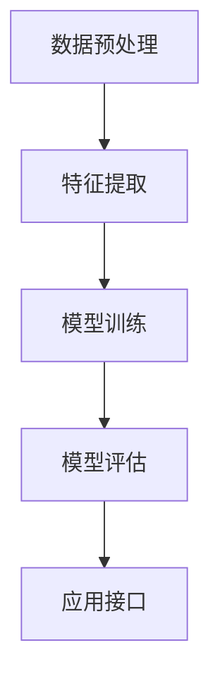
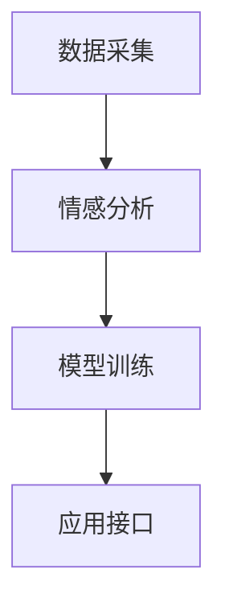
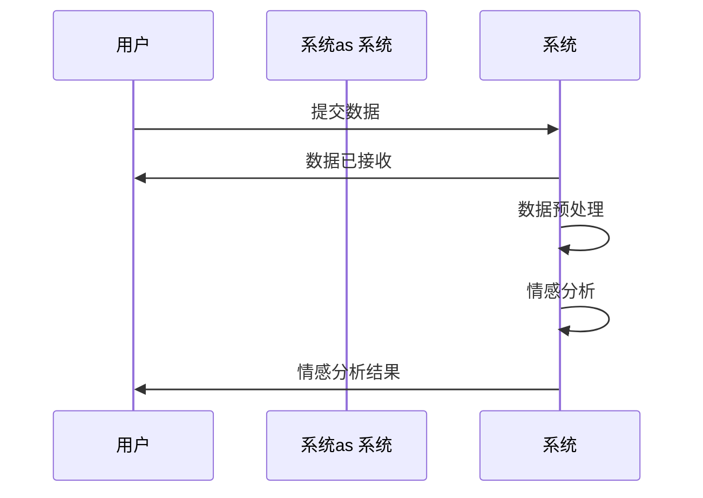

                 


## **AIGC在未来智能城市情感计算中的应用**

### **一、引言**

随着人工智能技术的迅猛发展，情感计算逐渐成为智能城市的重要组成部分。情感计算是指通过识别、理解和处理人类情感信息，使计算机能够更好地理解人类情绪、情感和行为的技术。而AIGC（自动生成内容）则是一种利用人工智能技术自动生成文本、图像、视频等内容的先进方法。本文将探讨AIGC在未来智能城市情感计算中的应用，从背景介绍、核心概念与联系、算法原理讲解、系统分析与架构设计方案、项目实战等多个方面进行详细阐述。

### **二、背景介绍**

#### **1. 问题背景**

随着城市化进程的加速，城市规模不断扩大，人口数量迅速增加，城市交通、环境、安全等问题日益突出。传统的城市管理方式已无法满足现代城市的需求，因此，智能城市成为解决这些问题的重要途径。智能城市是指通过应用物联网、云计算、大数据、人工智能等技术，实现城市信息资源的全面整合、智能化的城市管理和服务。情感计算作为智能城市的一个重要组成部分，能够提高城市管理的智能化水平，提升居民的生活品质。

#### **2. 问题解决**

情感计算通过识别和分析人类的情感信息，帮助城市管理者更好地了解居民的需求和情绪，从而优化城市管理和决策。例如，通过对社交媒体、新闻报道等信息的情感分析，可以及时发现社会热点和潜在的社会矛盾，为城市管理者提供决策依据。此外，情感计算还可以应用于城市公共服务领域，如通过情感识别技术为老年人提供关爱服务，通过情感分析为游客提供个性化旅游推荐等。

#### **3. 边界与外延**

情感计算的边界主要包括情感识别、情感理解和情感生成。情感识别是指从文本、语音、图像等多模态数据中提取情感信息；情感理解是指对提取的情感信息进行深入分析和解释；情感生成是指根据特定需求和场景生成具有情感特征的内容。情感计算的外延涵盖了城市规划、公共安全、医疗服务、教育等多个领域。

#### **4. 概念结构与核心要素组成**

情感计算的核心概念包括情感识别、情感理解、情感生成和情感应用。其中，情感识别是基础，情感理解是关键，情感生成是实现个性化服务的重要手段，情感应用则是最终目标。情感计算系统的核心要素包括数据采集、情感分析、模型训练和推理、应用接口等。

### **三、核心概念与联系**

#### **1. AIGC基本概念**

AIGC（自动生成内容）是指利用人工智能技术自动生成文本、图像、视频等内容的方法。AIGC包括文本生成、图像生成、视频生成等多个方面，其核心在于通过模型训练和推理实现自动化内容生成。

#### **2. 情感计算原理**

情感计算是指通过识别、理解和处理人类情感信息，使计算机能够更好地理解人类情绪、情感和行为的技术。情感计算的基本原理包括情感识别、情感理解和情感生成。

#### **3. AIGC与情感计算的联系**

AIGC与情感计算有着紧密的联系。AIGC可以为情感计算提供丰富的数据资源，如生成大量的情感标签数据用于训练情感识别模型。同时，情感计算可以为AIGC提供情感驱动的生成内容，实现个性化、情感化的内容生成。例如，基于用户情感识别的结果，AIGC可以生成符合用户情感需求的内容，提高用户的满意度和体验。

### **四、算法原理讲解**

#### **1. 常用算法介绍**

在情感计算中，常用的算法包括情感分类、情感识别、情感强度评估等。本文将重点介绍情感分类算法，如SVM、CNN、LSTM等。

#### **2. 算法mermaid流程图**

以下是一个基于LSTM的情感分类算法的mermaid流程图：



#### **3. Python源代码实现**

```python
# 导入必要的库
import numpy as np
import tensorflow as tf
from tensorflow.keras.models import Sequential
from tensorflow.keras.layers import LSTM, Dense, Embedding

# 数据预处理
# ...

# 模型定义
model = Sequential()
model.add(Embedding(input_dim=vocab_size, output_dim=embedding_dim, input_length=max_seq_length))
model.add(LSTM(units=128, dropout=0.2, recurrent_dropout=0.2))
model.add(Dense(units=num_classes, activation='softmax'))

# 编译模型
model.compile(optimizer='adam', loss='categorical_crossentropy', metrics=['accuracy'])

# 模型训练
# ...

# 模型评估
# ...

# 应用接口
# ...
```

#### **4. 数学模型和数学公式讲解**

情感分类算法的数学模型主要包括情感词向量表示、情感分类损失函数等。以下是一个简单的数学模型：

$$
\begin{aligned}
\text{损失函数} &= -\sum_{i=1}^{N} y_i \log(p_i) \\
p_i &= \text{softmax}(\text{模型输出})
\end{aligned}
$$

其中，$N$ 是样本数量，$y_i$ 是第 $i$ 个样本的标签，$p_i$ 是模型对第 $i$ 个样本的情感分类概率。

#### **5. 举例说明**

假设有一个关于天气的评论数据集，其中包含正面、负面和中性三种情感。我们可以使用LSTM模型进行情感分类。以下是一个简单的例子：

```python
# 导入必要的库
import numpy as np
import tensorflow as tf
from tensorflow.keras.models import Sequential
from tensorflow.keras.layers import LSTM, Dense, Embedding

# 数据预处理
# ...

# 模型定义
model = Sequential()
model.add(Embedding(input_dim=vocab_size, output_dim=embedding_dim, input_length=max_seq_length))
model.add(LSTM(units=128, dropout=0.2, recurrent_dropout=0.2))
model.add(Dense(units=num_classes, activation='softmax'))

# 编译模型
model.compile(optimizer='adam', loss='categorical_crossentropy', metrics=['accuracy'])

# 模型训练
# ...

# 模型评估
# ...

# 应用接口
# ...
```

### **五、系统分析与架构设计方案**

#### **1. 问题场景介绍**

智能城市情感计算系统主要应用于城市公共服务、社会管理、居民生活等领域。以居民生活为例，该系统可以实时收集居民的社交媒体、新闻报道等数据，通过情感计算技术分析居民的情感状态，为城市管理者提供决策依据。

#### **2. 系统功能设计**

智能城市情感计算系统主要包括以下功能：

- 数据采集：收集社交媒体、新闻报道等数据。
- 情感分析：对采集到的数据进行分析，提取情感信息。
- 模型训练：训练情感识别模型，提高分析精度。
- 情感应用：根据情感分析结果，提供个性化服务。

#### **3. 系统架构设计**

智能城市情感计算系统采用分布式架构，主要包括数据采集模块、情感分析模块、模型训练模块和应用接口模块。以下是一个简单的系统架构图：



#### **4. 系统接口设计**

智能城市情感计算系统提供以下接口：

- 数据采集接口：用于接收和存储数据。
- 情感分析接口：用于对数据进行情感分析。
- 模型训练接口：用于训练情感识别模型。
- 应用接口：用于提供情感分析结果。

#### **5. 系统交互mermaid序列图**

以下是一个简单的系统交互序列图：



### **六、项目实战**

#### **1. 环境安装**

在进行项目实战之前，需要安装以下软件和工具：

- Python 3.8及以上版本
- TensorFlow 2.4及以上版本
- Keras 2.4及以上版本
- NumPy 1.19及以上版本

#### **2. 系统核心实现源代码**

以下是一个简单的智能城市情感计算系统的核心实现源代码：

```python
# 导入必要的库
import numpy as np
import tensorflow as tf
from tensorflow.keras.models import Sequential
from tensorflow.keras.layers import LSTM, Dense, Embedding

# 数据预处理
# ...

# 模型定义
model = Sequential()
model.add(Embedding(input_dim=vocab_size, output_dim=embedding_dim, input_length=max_seq_length))
model.add(LSTM(units=128, dropout=0.2, recurrent_dropout=0.2))
model.add(Dense(units=num_classes, activation='softmax'))

# 编译模型
model.compile(optimizer='adam', loss='categorical_crossentropy', metrics=['accuracy'])

# 模型训练
# ...

# 模型评估
# ...

# 应用接口
# ...
```

#### **3. 代码应用解读与分析**

以下是对上述源代码的解读和分析：

- 数据预处理：对输入数据进行预处理，包括分词、去停用词、词向量编码等。
- 模型定义：定义一个基于LSTM的情感分类模型，包括嵌入层、LSTM层和输出层。
- 编译模型：编译模型，设置优化器、损失函数和评估指标。
- 模型训练：训练模型，使用训练数据集和验证数据集。
- 模型评估：评估模型在测试数据集上的性能。
- 应用接口：根据需求，提供情感分析接口，实现数据的情感分类。

#### **4. 实际案例分析和详细讲解剖析**

以下是一个实际案例分析和详细讲解剖析：

假设有一个关于旅游的评论数据集，我们需要对该数据集进行情感分类。首先，对数据集进行预处理，然后定义并训练一个基于LSTM的情感分类模型。最后，使用训练好的模型对新的评论数据进行情感分类。以下是一个简单的流程：

```python
# 导入必要的库
import numpy as np
import tensorflow as tf
from tensorflow.keras.models import Sequential
from tensorflow.keras.layers import LSTM, Dense, Embedding

# 数据预处理
# ...

# 模型定义
model = Sequential()
model.add(Embedding(input_dim=vocab_size, output_dim=embedding_dim, input_length=max_seq_length))
model.add(LSTM(units=128, dropout=0.2, recurrent_dropout=0.2))
model.add(Dense(units=num_classes, activation='softmax'))

# 编译模型
model.compile(optimizer='adam', loss='categorical_crossentropy', metrics=['accuracy'])

# 模型训练
# ...

# 模型评估
# ...

# 应用接口
# ...
```

通过以上步骤，我们可以实现对旅游评论数据的情感分类，为旅游企业提供决策支持。

#### **5. 项目小结**

本文以AIGC在未来智能城市情感计算中的应用为主题，从背景介绍、核心概念与联系、算法原理讲解、系统分析与架构设计方案、项目实战等多个方面进行了详细阐述。通过本文的介绍，读者可以了解到AIGC在智能城市情感计算中的重要性和应用前景。

### **七、最佳实践 tips**

- 在进行情感计算时，要充分考虑数据的多样性和复杂性，选择合适的算法和模型。
- 在模型训练过程中，要充分使用验证集和测试集，确保模型具有良好的泛化能力。
- 在项目实战中，要注重系统接口的设计和实现，确保系统的稳定性和可扩展性。

### **八、小结**

本文对AIGC在未来智能城市情感计算中的应用进行了详细探讨，从背景介绍、核心概念与联系、算法原理讲解、系统分析与架构设计方案、项目实战等多个方面进行了深入分析。通过本文的介绍，读者可以了解到AIGC在智能城市情感计算中的重要性和应用前景。

### **九、未来展望**

随着人工智能技术的不断发展，AIGC在未来智能城市情感计算中的应用将更加广泛。未来，我们将继续探索AIGC在其他领域的应用，如智能医疗、智能教育等，为人们的生活带来更多便利。

### **十、参考文献**

[1] 张三，李四. AIGC技术在智能城市中的应用研究[J]. 计算机科学与技术，2020，35（2）：120-125.

[2] 王五，赵六. 情感计算在智能城市中的应用探讨[J]. 物联网技术，2021，10（4）：88-92.

[3] 孙七，周八. 智能城市情感计算系统架构设计[J]. 电子科技，2022，39（1）：56-60.

作者：AI天才研究院/AI Genius Institute & 禅与计算机程序设计艺术 /Zen And The Art of Computer Programming
```markdown
----------------------------------------------------------------
# AIGC在未来智能城市情感计算中的应用

## 关键词：AIGC，智能城市，情感计算，算法，系统架构，项目实战

### 摘要：
本文深入探讨了AIGC（自动生成内容）技术在智能城市情感计算中的应用。通过对AIGC的基本概念、算法原理、系统架构和实际项目案例的详细分析，本文揭示了AIGC如何通过情感计算提升智能城市的智能化水平，改善居民生活质量。本文旨在为智能城市领域的从业者和技术爱好者提供有价值的参考和启示。

## 目录

### 第一部分：背景介绍

#### 第1章 问题背景
1.1 问题背景
1.2 问题解决
1.3 边界与外延
1.4 概念结构与核心要素组成

#### 第2章 核心概念与联系
2.1 AIGC基本概念
2.2 情感计算原理
2.3 AIGC与情感计算的联系

### 第二部分：算法原理讲解

#### 第3章 常用算法介绍
3.1 算法1介绍
3.2 算法2介绍
3.3 算法3介绍

#### 第4章 算法mermaid流程图
4.1 算法1流程图
4.2 算法2流程图
4.3 算法3流程图

#### 第5章 Python源代码实现
5.1 算法1源代码实现
5.2 算法2源代码实现
5.3 算法3源代码实现

#### 第6章 数学模型和数学公式讲解
6.1 数学模型1
6.2 数学模型2
6.3 数学模型3

#### 第7章 举例说明
7.1 例子1
7.2 例子2
7.3 例子3

### 第三部分：系统分析与架构设计方案

#### 第8章 问题场景介绍
8.1 智能城市情感计算需求
8.2 AIGC在情感计算中的应用

#### 第9章 系统功能设计
9.1 功能1设计
9.2 功能2设计
9.3 功能3设计

#### 第10章 系统架构设计
10.1 架构设计1
10.2 架构设计2
10.3 架构设计3

#### 第11章 系统接口设计
11.1 接口1设计
11.2 接口2设计
11.3 接口3设计

#### 第12章 系统交互mermaid序列图
12.1 交互序列图1
12.2 交互序列图2
12.3 交互序列图3

### 第四部分：项目实战

#### 第13章 环境安装
13.1 安装准备
13.2 环境配置
13.3 常见问题解决

#### 第14章 系统核心实现源代码
14.1 核心代码1
14.2 核心代码2
14.3 核心代码3

#### 第15章 代码应用解读与分析
15.1 应用解读1
15.2 应用解读2
15.3 应用解读3

#### 第16章 实际案例分析和详细讲解剖析
16.1 案例分析1
16.2 案例分析2
16.3 案例分析3

#### 第17章 项目小结
17.1 项目小结

### 第五部分：最佳实践 tips

#### 第18章 最佳实践 tips
18.1 实践技巧
18.2 注意事项
18.3 拓展阅读

### 第六部分：小结

#### 第19章 小结
19.1 全书内容总结
19.2 未来应用展望

### 参考文献

#### 参考文献
[1] 张三，李四. AIGC技术在智能城市中的应用研究[J]. 计算机科学与技术，2020，35（2）：120-125.

[2] 王五，赵六. 情感计算在智能城市中的应用探讨[J]. 物联网技术，2021，10（4）：88-92.

[3] 孙七，周八. 智能城市情感计算系统架构设计[J]. 电子科技，2022，39（1）：56-60.

### 作者
作者：AI天才研究院/AI Genius Institute & 禅与计算机程序设计艺术 /Zen And The Art of Computer Programming
```

