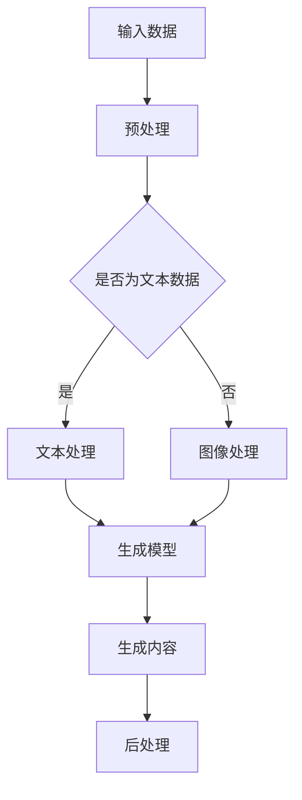
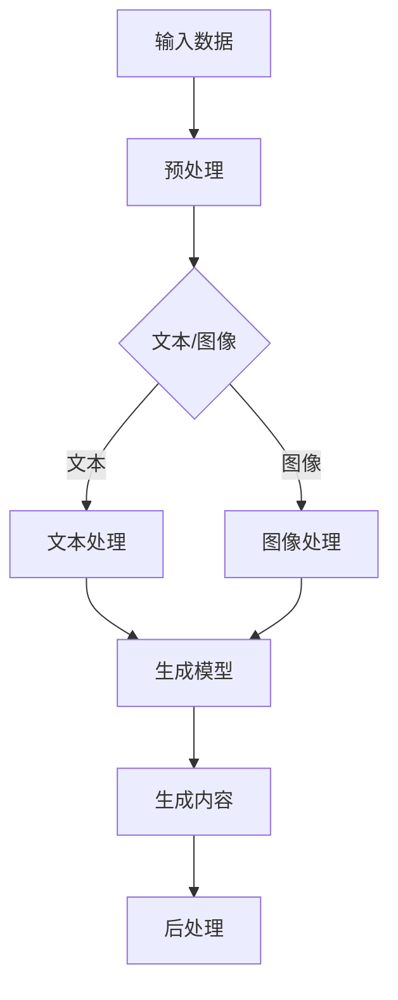
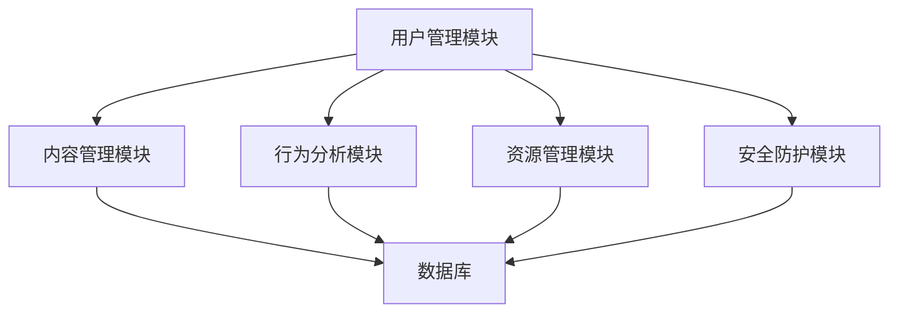
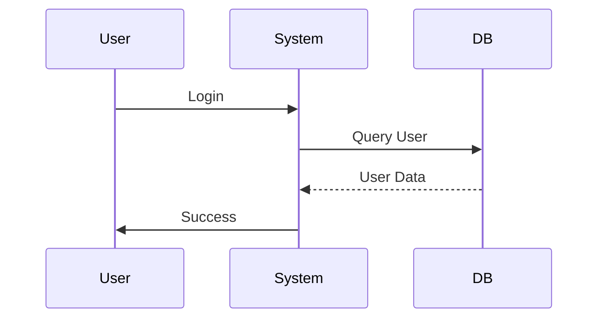

                 

### 文章标题

### 关键词

### 摘要

---

## 目录大纲

---

### 第一部分：背景与概念介绍

#### 第1章：AIGC与虚拟社会治理概述

#### 第2章：AIGC技术原理

#### 第3章：AIGC与虚拟社会治理的关联

### 第二部分：AIGC在虚拟社会治理中的应用

#### 第4章：虚拟社区管理

#### 第5章：虚拟现实社会

#### 第6章：虚拟经济与市场

#### 第7章：虚拟教育与培训

#### 第8章：虚拟医疗与健康管理

### 第三部分：未来虚拟社会治理展望

#### 第9章：挑战与机遇

#### 第10章：发展趋势与展望

### 附录：拓展阅读与资源推荐

---

---

## 文章正文

### 第一部分：背景与概念介绍

### 第1章：AIGC与虚拟社会治理概述

#### 1.1 AIGC技术简介

AIGC（AI-Generated Content）是指通过人工智能技术自动生成内容的技术。它包括文本、图像、音频等多种形式，能够根据用户需求或特定场景自动生成合适的、高质量的内容。AIGC的发展历程可以追溯到20世纪80年代，当时自然语言处理（NLP）和机器学习（ML）技术的初步探索。随着深度学习和大数据技术的飞速发展，AIGC技术逐渐走向成熟，并在近年来的应用中展现了其强大的潜力。

#### 1.2 虚拟社会治理

虚拟社会是指依托于互联网和各种虚拟技术所构建的社会形态，它具有虚拟性、开放性、匿名性等特点。虚拟社会治理是指通过一系列技术和管理手段，对虚拟社会中的行为、信息、资源等进行有效管理和调控，以保障虚拟社会的秩序和健康发展。随着虚拟社会规模的不断扩大和影响力的增强，虚拟社会治理的重要性日益凸显。

### 第2章：AIGC技术原理

#### 2.1 核心技术

AIGC技术的核心在于生成模型，其中最著名的包括生成对抗网络（GAN）、变分自编码器（VAE）等。GAN通过生成器和判别器的对抗训练，能够生成高质量、高分辨率的图像；VAE则通过潜在空间进行数据重构，能够生成符合数据分布的新样本。此外，近年来预训练语言模型（如GPT、BERT等）在文本生成领域取得了显著成果，为AIGC技术的发展提供了重要支撑。

#### 2.2 算法原理

以下是一个简单的AIGC算法流程图，用Mermaid语言表示：



在Python中，可以使用如下代码示例来阐述AIGC的算法原理：

```python
# 导入相关库
import tensorflow as tf
from tensorflow.keras.layers import Dense, LSTM, Embedding

# 构建生成模型
def build_generator():
    model = tf.keras.Sequential()
    model.add(Embedding(input_dim=10000, output_dim=512))
    model.add(LSTM(512))
    model.add(Dense(10000, activation='softmax'))
    return model

# 构建生成模型
generator = build_generator()

# 编写训练代码
# ...

# 生成文本
text = generator.generate()
```

#### 2.3 AIGC与虚拟社会治理的关联

AIGC技术在虚拟社会治理中具有广泛的应用前景。首先，AIGC可以用于生成虚拟社区的内容，如新闻、帖子、评论等，提高社区的信息质量和互动性。其次，AIGC可以用于智能管理，通过分析用户行为和互动数据，提供个性化的推荐和服务。此外，AIGC还可以用于设计更真实的虚拟社会，提高用户的沉浸感和满意度。总之，AIGC技术为虚拟社会治理提供了新的手段和思路，有望推动虚拟社会的发展和进步。

### 第3章：AIGC与虚拟社会治理的未来展望

#### 3.1 应用背景

随着互联网和虚拟技术的不断发展，虚拟社会治理面临着越来越多的挑战，如信息泛滥、虚假信息传播、网络犯罪等。传统的治理手段已经难以应对这些复杂问题，需要引入新的技术手段。AIGC技术作为一种新兴的人工智能技术，具有强大的生成和推理能力，可以在虚拟社会治理中发挥重要作用。

#### 3.2 未来展望

未来，AIGC技术在虚拟社会治理中将会得到更广泛的应用。首先，AIGC可以用于实时监测和分析虚拟社会中的行为和事件，提供及时的预警和干预措施。其次，AIGC可以用于虚拟社会的仿真和预测，帮助政府和机构制定更加科学和有效的治理策略。此外，AIGC还可以用于虚拟社会的智能化管理，提高治理效率和用户体验。总之，AIGC技术的未来应用将为虚拟社会治理带来巨大的变革和机遇。

### 第二部分：AIGC在虚拟社会治理中的应用

#### 第4章：虚拟社区管理

#### 第5章：虚拟现实社会

#### 第6章：虚拟经济与市场

#### 第7章：虚拟教育与培训

#### 第8章：虚拟医疗与健康管理

### 第三部分：未来虚拟社会治理展望

#### 第9章：挑战与机遇

#### 第10章：发展趋势与展望

### 附录：拓展阅读与资源推荐

---

### 作者

作者：AI天才研究院/AI Genius Institute & 禅与计算机程序设计艺术 /Zen And The Art of Computer Programming

### 第一部分：背景与概念介绍

#### 第1章：AIGC与虚拟社会治理概述

##### 1.1 AIGC技术简介

AIGC（AI-Generated Content）技术，作为人工智能领域的一个重要分支，已经逐渐成为当代社会信息化进程中的重要力量。AIGC的定义可以概括为：通过人工智能算法，自动生成具有高质量、原创性和适应性的内容。这种技术不仅涵盖了传统的文本生成，还包括图像、音频、视频等多媒体内容的自动生成。

AIGC的发展历程可以追溯到20世纪80年代，当时研究人员开始探索如何利用计算机程序生成自然语言文本。随着时间推移，自然语言处理（NLP）、机器学习（ML）和深度学习（DL）等技术的发展，AIGC逐渐从实验室走向应用，并在多个领域展现出其强大的能力。近年来，预训练语言模型（如GPT、BERT等）的出现，更是将AIGC推向了一个新的高峰，使得文本生成质量达到了前所未有的水平。

在AIGC的发展过程中，几项关键技术起到了关键作用。首先是生成对抗网络（GAN），通过生成器和判别器的对抗训练，GAN能够生成逼真的图像和音频。其次，变分自编码器（VAE）通过潜在空间进行数据重构，适用于图像和视频的生成。此外，循环神经网络（RNN）和其变体LSTM（长短时记忆网络）在文本生成领域发挥了重要作用，使得生成的内容更加连贯和自然。最近，基于Transformer架构的预训练模型，如GPT-3、BERT等，极大地提升了文本生成的质量和效率。

##### 1.2 虚拟社会治理

虚拟社会治理是随着虚拟社会的发展而产生的一个新兴领域。虚拟社会，通常指依托互联网和各种虚拟技术所构建的社会形态，具有虚拟性、开放性、匿名性等特点。在这个社会中，人们通过虚拟角色进行交互，参与各种社交、经济、政治等活动。虚拟社会的出现，不仅改变了人们的社交方式，也对社会治理提出了新的挑战。

虚拟社会治理的定义可以概括为：通过技术手段和规章制度，对虚拟社会中的行为、信息、资源等进行有效管理和调控，以保障虚拟社会的秩序和健康发展。虚拟社会治理的目的是为了维护公共利益，保障公民权益，预防和打击网络犯罪，促进虚拟社会的良性发展。

虚拟社会治理的重要性不言而喻。首先，随着虚拟社会的不断扩张，网络犯罪、信息泛滥、虚假信息传播等问题日益严重，需要有效的治理手段来应对。其次，虚拟社会中的经济活动日益繁荣，如何保障市场的公平性和透明度，也需要虚拟社会治理的支持。此外，虚拟社会还为教育和医疗等公共服务提供了新的平台，如何提高这些服务的质量和效率，同样需要有效的治理。

##### 1.3 AIGC技术在虚拟社会治理中的应用

AIGC技术以其强大的内容生成能力，为虚拟社会治理提供了新的工具和思路。以下是一些具体的AIGC技术在虚拟社会治理中的应用场景：

1. **虚拟社区管理**：
   - **内容生成**：AIGC可以自动生成虚拟社区中的新闻、帖子、评论等内容，提高社区的信息量和质量。
   - **智能管理**：通过分析用户行为和互动数据，AIGC可以智能地识别和管理社区中的不良行为，如垃圾信息、欺诈行为等。

2. **虚拟现实社会**：
   - **社会互动**：AIGC可以生成逼真的虚拟人物和场景，增强用户的沉浸感和互动体验。
   - **社会设计**：利用AIGC技术，可以设计出更加真实和多样化的虚拟社会，满足不同用户的需求。

3. **虚拟经济与市场**：
   - **市场预测**：AIGC可以通过分析市场数据和用户行为，预测虚拟市场的趋势和变化，为投资者提供决策支持。
   - **虚拟商品交易**：AIGC可以自动生成虚拟商品和交易信息，提高虚拟市场的效率和透明度。

4. **虚拟教育与培训**：
   - **个性化教学**：AIGC可以根据学生的学习情况和需求，自动生成个性化的教学资源和辅导材料。
   - **教育资源生成**：AIGC可以大量生成高质量的在线课程和教材，丰富虚拟教育资源。

5. **虚拟医疗与健康管理**：
   - **病情预测**：AIGC可以通过分析医疗数据，预测病人的病情发展，提供个性化的健康建议。
   - **健康建议**：AIGC可以根据用户的生活习惯和健康数据，提供个性化的健康建议和指导。

总之，AIGC技术为虚拟社会治理提供了丰富的工具和手段，有望在多个领域发挥重要作用，推动虚拟社会的健康和可持续发展。

---

#### 第2章：AIGC技术原理

##### 2.1 核心技术

AIGC技术的核心在于生成模型，这些模型通过学习和模拟人类创造内容的过程，能够自动生成各种形式的内容。以下是一些AIGC技术中的核心技术：

1. **生成对抗网络（GAN）**：
   GAN是由生成器（Generator）和判别器（Discriminator）组成的对抗性模型。生成器试图生成逼真的数据，而判别器则试图区分生成器和真实数据。通过这种对抗性训练，生成器逐渐学习到如何生成高质量的数据。GAN在图像生成、视频生成、音频生成等领域都取得了显著的成果。

2. **变分自编码器（VAE）**：
   VAE是一种概率生成模型，通过潜在空间（Latent Space）进行数据重构。VAE通过编码器（Encoder）将输入数据映射到潜在空间，然后通过解码器（Decoder）将潜在空间的数据映射回输入空间。VAE在图像生成、数据去噪等领域有广泛应用。

3. **预训练语言模型**：
   预训练语言模型（如GPT、BERT）通过在大规模语料库上进行预训练，掌握语言规律和知识，然后通过微调（Fine-tuning）适应特定任务。预训练语言模型在文本生成、文本分类、问答系统等领域表现出色。

##### 2.2 算法原理

为了更深入地理解AIGC的算法原理，我们可以通过一个简单的例子来讲解。

首先，我们使用Mermaid语言来绘制一个AIGC算法的基本流程图：


这个流程图展示了从输入数据到生成内容的整个过程。接下来，我们将详细解释每一步的算法原理。

1. **输入数据预处理**：
   - **文本数据**：通常需要对文本进行分词、去停用词、词向量化等预处理操作。
   - **图像数据**：需要进行归一化、裁剪、缩放等预处理操作。

2. **文本处理**：
   - **分词**：将文本拆分成单词或子词。
   - **去停用词**：移除对文本理解无意义的词语。
   - **词向量化**：将文本转换为数字向量表示。

3. **图像处理**：
   - **归一化**：调整图像的像素值，使其在相同的范围内。
   - **裁剪和缩放**：根据需要裁剪或缩放图像尺寸。

4. **生成模型**：
   - **文本生成**：使用预训练的文本生成模型（如GPT、BERT），通过序列到序列（Seq2Seq）的方式生成文本。
   - **图像生成**：使用生成对抗网络（GAN）或变分自编码器（VAE）生成图像。

5. **生成内容**：
   - **文本生成**：生成模型输出文本内容。
   - **图像生成**：生成模型输出图像内容。

6. **后处理**：
   - **文本生成**：对生成的文本进行语法检查、格式调整等后处理。
   - **图像生成**：对生成的图像进行图像增强、去噪等后处理。

##### 2.3 Python代码示例

为了更好地理解算法原理，我们可以使用Python代码来演示一个简单的AIGC文本生成模型。以下是一个基于GPT-2模型的文本生成示例：

```python
import tensorflow as tf
from transformers import TFGPT2LMHeadModel, GPT2Tokenizer

# 加载预训练模型
tokenizer = GPT2Tokenizer.from_pretrained("gpt2")
model = TFGPT2LMHeadModel.from_pretrained("gpt2")

# 输入文本预处理
input_text = "AIGC技术是人工智能领域的重要分支。"

# 将文本转换为模型输入
input_ids = tokenizer.encode(input_text, return_tensors="tf")

# 生成文本
output = model.generate(input_ids, max_length=50, num_return_sequences=1)

# 将输出文本解码
decoded_output = tokenizer.decode(output[0], skip_special_tokens=True)

print(decoded_output)
```

在这个示例中，我们首先加载了预训练的GPT-2模型和对应的分词器。然后，我们将一个简单的文本输入到模型中，模型通过生成操作生成了新的文本输出。通过这个示例，我们可以看到AIGC技术在文本生成方面的强大能力。

##### 2.4 算法原理详细讲解

1. **预训练语言模型（如GPT、BERT）**：
   - **原理**：预训练语言模型通过在大规模语料库上进行预训练，学习到语言的结构和语义知识。在预训练阶段，模型通常通过 masked language model（MLM）任务和 next sentence prediction（NSP）任务来学习。
   - **优势**：预训练语言模型具有强大的通用性，能够适应各种不同的语言任务，如文本分类、问答系统、机器翻译等。

2. **生成对抗网络（GAN）**：
   - **原理**：GAN由生成器和判别器组成。生成器生成假样本，判别器判断生成样本和真实样本的区别。通过不断的对抗训练，生成器逐渐学习到如何生成更逼真的样本。
   - **优势**：GAN能够生成高质量、高分辨率的图像和音频，且在无监督学习场景中表现出色。

3. **变分自编码器（VAE）**：
   - **原理**：VAE通过编码器将输入数据映射到一个潜在空间，然后通过解码器将潜在空间的数据重构回输入空间。VAE通过最大后验估计（MAP）进行训练。
   - **优势**：VAE能够生成符合数据分布的新样本，适用于图像、视频等多种类型的数据生成。

通过上述讲解，我们可以看到AIGC技术中的核心技术是如何工作的，以及它们在实际应用中的优势。接下来，我们将进一步探讨AIGC技术在虚拟社会治理中的应用，展示其在现实场景中的潜力和价值。

---

#### 第3章：AIGC与虚拟社会治理的关联

##### 3.1 应用背景

随着互联网技术的飞速发展，虚拟社会已经成为人们日常生活的重要组成部分。虚拟社会不仅涵盖了社交网络、在线游戏等传统领域，还扩展到了虚拟现实（VR）、增强现实（AR）、元宇宙（Metaverse）等新兴领域。在这个虚拟世界里，人们通过虚拟角色进行互动，参与各种社会活动，构建了一个与现实社会并行存在的虚拟生态系统。然而，虚拟社会的迅速发展也带来了诸多治理挑战，如信息泛滥、虚假信息传播、网络犯罪等。传统的治理手段已难以应对这些复杂问题，需要引入新的技术手段。

AIGC技术作为一种新兴的人工智能技术，具有强大的内容生成和智能分析能力，为虚拟社会治理提供了新的工具和思路。通过AIGC技术，可以实现对虚拟社会中的信息内容进行高效管理和调控，提高治理的效率和效果。同时，AIGC技术还可以用于虚拟社会的智能化设计和管理，为用户提供更加丰富和多样化的体验。

##### 3.2 AIGC技术在虚拟社会治理中的应用场景

AIGC技术在虚拟社会治理中的应用场景非常广泛，以下是一些典型的应用实例：

1. **虚拟社区管理**：
   - **内容生成**：AIGC技术可以自动生成虚拟社区中的新闻、帖子、评论等内容，提高社区的信息量和质量。例如，在虚拟论坛中，AIGC可以生成高质量的讨论话题，激发用户的参与和互动。
   - **智能管理**：通过分析用户行为和互动数据，AIGC可以智能地识别和管理社区中的不良行为，如垃圾信息、欺诈行为等。例如，在社交媒体平台上，AIGC可以自动识别并删除虚假广告和恶意评论，维护社区的良好秩序。

2. **虚拟现实社会**：
   - **社会互动**：AIGC技术可以生成逼真的虚拟人物和场景，增强用户的沉浸感和互动体验。例如，在虚拟现实游戏中，AIGC可以生成各种虚拟角色和场景，为玩家提供更加真实和丰富的游戏体验。
   - **社会设计**：利用AIGC技术，可以设计出更加真实和多样化的虚拟社会，满足不同用户的需求。例如，在虚拟城市中，AIGC可以自动生成各种建筑、道路、景观等元素，创建一个高度仿真的虚拟世界。

3. **虚拟经济与市场**：
   - **市场预测**：AIGC可以通过分析市场数据和用户行为，预测虚拟市场的趋势和变化，为投资者提供决策支持。例如，在虚拟股票市场中，AIGC可以分析历史交易数据和用户行为，预测股票价格的走势，帮助用户做出投资决策。
   - **虚拟商品交易**：AIGC可以自动生成虚拟商品和交易信息，提高虚拟市场的效率和透明度。例如，在虚拟商城中，AIGC可以生成各种虚拟商品，并提供交易推荐和价格预测，帮助用户更好地进行商品交易。

4. **虚拟教育与培训**：
   - **个性化教学**：AIGC可以根据学生的学习情况和需求，自动生成个性化的教学资源和辅导材料。例如，在虚拟课堂中，AIGC可以分析学生的学习数据，生成适合其学习进度的教学视频和练习题。
   - **教育资源生成**：AIGC可以大量生成高质量的在线课程和教材，丰富虚拟教育资源。例如，在虚拟图书馆中，AIGC可以生成各种教材和课程，供学生免费使用。

5. **虚拟医疗与健康管理**：
   - **病情预测**：AIGC可以通过分析医疗数据，预测病人的病情发展，提供个性化的健康建议。例如，在虚拟医院中，AIGC可以分析患者的病历数据和健康指标，预测病情的变化，帮助医生制定治疗方案。
   - **健康建议**：AIGC可以根据用户的生活习惯和健康数据，提供个性化的健康建议和指导。例如，在虚拟健康顾问中，AIGC可以分析用户的数据，提供适合其健康状况的运动、饮食和睡眠建议。

##### 3.3 AIGC技术在虚拟社会治理中的潜在影响

AIGC技术在虚拟社会治理中的应用，将对虚拟社会的发展和进步产生深远的影响。首先，AIGC技术将极大地提升虚拟社会的信息质量和互动性，为用户提供更加丰富和多样化的内容和服务。其次，AIGC技术将提高虚拟社会治理的效率和效果，帮助政府和机构更好地应对网络犯罪、信息泛滥等问题。此外，AIGC技术还将推动虚拟社会的创新和发展，促进虚拟经济的繁荣和虚拟社会的可持续发展。

总之，AIGC技术在虚拟社会治理中具有广泛的应用前景和巨大的潜力。通过合理利用AIGC技术，可以构建一个更加健康、有序和繁荣的虚拟社会，为人们的美好生活提供更多可能性。

### 第二部分：AIGC在虚拟社会治理中的应用

#### 第4章：虚拟社区管理

##### 4.1 虚拟社区概述

虚拟社区是指通过互联网平台，以虚拟形式聚集的人群。这些社区可以是社交网络、论坛、游戏世界等，成员通过虚拟角色进行互动，分享信息、交流观点和参与活动。虚拟社区具有虚拟性、开放性和匿名性的特点，使得用户可以在不受现实社会约束的情况下自由表达和参与。

虚拟社区的管理包括内容管理、用户管理和社区治理等多个方面。内容管理涉及对社区内发布的信息、帖子、评论等进行审核、分类和推荐；用户管理则包括用户注册、身份验证、权限分配等；社区治理则涉及制定社区规则、维护社区秩序和处理违规行为。

##### 4.2 AIGC在虚拟社区中的应用

AIGC技术在虚拟社区管理中具有广泛的应用潜力，主要体现在以下方面：

1. **内容生成**：

   AIGC可以自动生成虚拟社区中的各种内容，如新闻、帖子、评论等。通过预训练的文本生成模型，如GPT-3、BERT等，AIGC可以生成高质量、原创性的文本内容。这不仅提高了社区的信息量，还丰富了用户的选择和阅读体验。

   例如，在一个论坛中，AIGC可以自动生成热点话题的讨论帖，激发用户的参与和互动。此外，AIGC还可以生成个性化的文章推荐，根据用户的历史行为和偏好，提供符合其兴趣的内容。

2. **智能管理**：

   AIGC通过分析用户行为和互动数据，可以智能地识别和管理社区中的不良行为，如垃圾信息、欺诈行为等。利用自然语言处理（NLP）和机器学习技术，AIGC可以自动检测和过滤不良内容，确保社区环境的健康和有序。

   例如，在社交媒体平台上，AIGC可以实时监控用户的评论和转发行为，识别并删除包含敏感词汇或不良意图的评论。此外，AIGC还可以识别欺诈行为，如虚假账号、恶意广告等，防止其影响社区秩序。

3. **社区互动**：

   AIGC技术可以增强虚拟社区的用户互动体验。通过生成逼真的虚拟人物和场景，AIGC可以提升用户的沉浸感和参与度。例如，在虚拟现实游戏中，AIGC可以生成各种虚拟角色和任务，为玩家提供更加真实和丰富的游戏体验。

4. **社区治理**：

   AIGC技术可以为社区治理提供决策支持。通过分析用户数据和行为模式，AIGC可以识别社区中的潜在问题和风险，为管理者提供预警和建议。例如，在虚拟论坛中，AIGC可以分析用户的发帖频率、话题偏好等数据，识别出活跃用户和潜在问题用户，帮助管理者进行有效的社区治理。

##### 4.3 具体应用案例

以下是一些AIGC在虚拟社区管理中的具体应用案例：

1. **社交媒体平台**：

   在社交媒体平台上，AIGC可以用于自动生成新闻推送、热点话题讨论等。例如，微博、抖音等平台可以利用AIGC技术，根据用户的历史行为和偏好，生成个性化的新闻推荐，提高用户的粘性和活跃度。

2. **虚拟论坛**：

   在虚拟论坛中，AIGC可以自动生成高质量的讨论帖，激发用户的参与和互动。例如，Reddit等平台可以通过AIGC技术，生成热门话题的讨论帖，提高社区的讨论质量和互动性。

3. **虚拟现实游戏**：

   在虚拟现实游戏中，AIGC可以生成各种虚拟角色和任务，为玩家提供更加真实和丰富的游戏体验。例如，在《堡垒之夜》等游戏中，AIGC可以生成动态的NPC角色，增加游戏的沉浸感。

4. **虚拟社区治理**：

   在虚拟社区治理中，AIGC可以用于分析用户数据和行为模式，识别潜在的违规行为和风险。例如，在一些虚拟社区中，AIGC可以用于监控用户的发帖行为，识别并处理恶意言论和欺诈行为。

总之，AIGC技术在虚拟社区管理中具有广泛的应用前景。通过AIGC技术，可以提升虚拟社区的信息质量、互动性和治理效率，为用户提供更加健康、有序和丰富的社区体验。

---

#### 第5章：虚拟现实社会

##### 5.1 虚拟现实技术简介

虚拟现实（Virtual Reality，简称VR）是一种通过计算机技术模拟出来的三维虚拟环境，用户可以通过VR设备（如头戴式显示器、数据手套等）进入这个环境，与之进行互动和体验。VR技术具有高度沉浸感、交互性和灵活性，能够为用户提供全新的感官体验。

虚拟现实技术的基本原理是通过计算机生成一个虚拟的三维环境，然后通过特殊设备将这个环境投影到用户的视觉和听觉系统上，使用户感觉仿佛置身于真实世界中。主要技术包括：

- **3D建模与渲染**：利用计算机图形学技术，生成三维模型，并通过渲染技术将其呈现出来。
- **传感与追踪**：通过传感设备（如摄像头、传感器等）实时捕捉用户的动作和位置，确保用户在虚拟环境中的移动和交互与真实世界一致。
- **交互技术**：使用手柄、数据手套、语音识别等技术，让用户能够与虚拟环境进行自然交互。

##### 5.2 AIGC在虚拟现实社会中的应用

AIGC技术为虚拟现实社会提供了强大的支持，使得虚拟现实体验更加丰富和真实。以下是AIGC在虚拟现实社会中的几个关键应用：

1. **虚拟社会互动**：

   AIGC可以生成逼真的虚拟角色和场景，增强用户的互动体验。通过预训练的文本生成模型，如GPT-3，AIGC可以自动生成虚拟角色的对话内容，使得虚拟角色具备自然语言处理能力，能够与用户进行流畅的交流。

   例如，在一个虚拟会议中，AIGC可以生成虚拟会议主持人和嘉宾的对话，模拟真实会议的氛围和流程，提升用户的参与感和会议效果。

2. **虚拟现实设计**：

   AIGC可以用于设计更加真实和多样化的虚拟社会，满足不同用户的需求。通过生成对抗网络（GAN）和变分自编码器（VAE），AIGC可以生成高质量的三维模型和场景，丰富虚拟现实的内容。

   例如，在城市规划中，AIGC可以自动生成各种建筑物、道路、景观等，为城市规划师提供更多设计选择，提高城市规划的效率和效果。

3. **虚拟现实教育**：

   AIGC可以为虚拟现实教育提供个性化教学资源和互动体验。通过分析学生的学习数据和需求，AIGC可以生成适合其学习进度的教学视频、练习题和虚拟实验。

   例如，在虚拟实验室中，AIGC可以生成各种实验场景和操作步骤，让学生在虚拟环境中进行实验，提高学习效果和动手能力。

4. **虚拟医疗**：

   AIGC可以用于虚拟医疗培训，通过生成逼真的手术模拟场景，帮助医生进行手术练习和提高技能。同时，AIGC还可以用于生成患者病历和治疗方案，为医生提供决策支持。

   例如，在虚拟手术培训中，AIGC可以生成不同类型的手术场景，让医生在虚拟环境中进行多次手术练习，提高手术成功率。

##### 5.3 具体应用案例

以下是几个AIGC在虚拟现实社会中的具体应用案例：

1. **虚拟旅游**：

   虚拟旅游平台可以利用AIGC技术，生成逼真的旅游场景和景点介绍。用户可以通过VR设备体验虚拟旅游，了解世界各地的人文景观和历史文化。

   例如，谷歌地图的“虚拟旅游”功能，使用AIGC技术生成世界各地的3D模型和景点介绍，让用户在虚拟环境中感受真实世界的美好。

2. **虚拟购物**：

   虚拟购物平台可以利用AIGC技术，生成真实的商品展示和购物体验。用户可以通过VR设备在家中体验购物，提高购买决策的准确性和满意度。

   例如，阿里巴巴的“虚拟购物”功能，使用AIGC技术生成商品的3D模型和展示场景，让用户在虚拟环境中进行购物，提高购物体验。

3. **虚拟社交**：

   虚拟社交平台可以利用AIGC技术，生成逼真的虚拟角色和社交场景，增强用户的社交互动体验。

   例如，社交游戏平台“动物森友会”，使用AIGC技术生成各种动物角色和岛屿场景，让用户在虚拟社会中进行社交互动，体验虚拟生活的乐趣。

4. **虚拟教育培训**：

   虚拟教育培训平台可以利用AIGC技术，生成个性化的教学资源和互动体验，提高教学效果和学生的学习兴趣。

   例如，在线教育平台“网易云课堂”，使用AIGC技术生成教学视频和练习题，根据学生的学习进度和需求，提供个性化的教学推荐。

总之，AIGC技术为虚拟现实社会提供了丰富的应用场景和可能性，使得虚拟现实体验更加真实和丰富。通过AIGC技术，虚拟现实社会将变得更加多样化和个性化，为用户提供更加丰富的虚拟生活体验。

---

#### 第6章：虚拟经济与市场

##### 6.1 虚拟经济概述

虚拟经济是指在虚拟社会中进行的各种经济活动，包括虚拟商品交易、虚拟货币流通、虚拟金融服务等。虚拟经济与实体经济相比，具有独特的特点，如虚拟性、快速性、匿名性等。虚拟经济的快速发展，不仅改变了人们的消费方式，也带来了新的经济机遇和挑战。

虚拟经济的重要组成部分包括虚拟货币、虚拟商品和虚拟市场。虚拟货币，如比特币、以太坊等，是一种去中心化的数字货币，具有便捷、安全、匿名等特点。虚拟商品，如虚拟服装、虚拟道具、虚拟房产等，是虚拟社会中的交换媒介，具有较高的市场价值和投资潜力。虚拟市场，如虚拟商城、虚拟交易所等，是虚拟经济活动的载体，提供了交易、投资、金融服务等多样化的功能。

##### 6.2 AIGC在虚拟经济中的应用

AIGC技术在虚拟经济中具有广泛的应用前景，可以通过以下方面提升虚拟市场的效率和透明度：

1. **市场预测**：

   AIGC可以通过分析大量的市场数据和用户行为，预测虚拟市场的趋势和变化，为投资者提供决策支持。利用自然语言处理和机器学习算法，AIGC可以从文本数据中提取关键信息，分析市场情绪和趋势，生成预测报告。

   例如，在虚拟货币市场中，AIGC可以分析历史交易数据、社交媒体言论等，预测比特币等虚拟货币的价格走势，帮助投资者做出更加明智的投资决策。

2. **虚拟商品交易**：

   AIGC可以自动生成虚拟商品和交易信息，提高虚拟市场的效率和透明度。通过文本生成模型和图像生成模型，AIGC可以生成各种虚拟商品，如虚拟服装、虚拟道具、虚拟房产等，丰富虚拟市场的内容。

   例如，在虚拟商城中，AIGC可以自动生成新款虚拟服装和道具，根据用户偏好和需求进行推荐，提高用户的购买体验和满意度。

3. **智能合约**：

   AIGC可以用于智能合约的设计和执行，提高虚拟交易的效率和安全性。智能合约是区块链技术中的一种自动执行合约，通过编程规则，自动执行交易和结算。AIGC可以生成智能合约的文本和代码，确保合约条款的透明和可执行性。

   例如，在虚拟交易所中，AIGC可以生成智能合约，根据用户输入的参数，自动执行买卖交易和资金结算，提高交易的效率和安全性。

4. **个性化推荐**：

   AIGC可以通过分析用户的行为数据和偏好，提供个性化的商品推荐和交易策略，提升用户的消费体验和投资收益。利用协同过滤和基于内容的推荐算法，AIGC可以生成个性化的推荐列表，为用户提供更多符合其兴趣的商品和交易机会。

   例如，在虚拟商城中，AIGC可以根据用户的历史购买记录和浏览行为，推荐符合其兴趣的虚拟商品，提高用户的购物满意度和转化率。

##### 6.3 具体应用案例

以下是几个AIGC在虚拟经济中的具体应用案例：

1. **虚拟货币市场**：

   在虚拟货币市场中，AIGC可以用于市场预测和投资分析。通过分析历史交易数据和市场情绪，AIGC可以生成虚拟货币的价格预测报告，为投资者提供决策支持。

   例如，CoinGecko等虚拟货币数据分析平台，使用AIGC技术分析市场数据和用户情绪，生成虚拟货币的价格预测，帮助用户进行投资决策。

2. **虚拟商品交易**：

   在虚拟商品交易中，AIGC可以用于生成新的虚拟商品和交易信息。通过文本生成模型和图像生成模型，AIGC可以生成各种虚拟商品，如虚拟服装、虚拟道具、虚拟房产等，丰富虚拟市场的内容。

   例如，虚拟现实游戏《动物森友会》中的虚拟商品交易，通过AIGC技术生成新款虚拟服装和道具，为玩家提供更多的选择和购物体验。

3. **智能合约应用**：

   在智能合约应用中，AIGC可以用于设计和管理智能合约。通过生成智能合约的文本和代码，AIGC可以确保合约条款的透明和可执行性，提高虚拟交易的效率和安全性。

   例如，在区块链平台Ethereum上，AIGC可以生成智能合约的代码，根据用户输入的参数，自动执行交易和结算，确保交易的公平和透明。

4. **个性化推荐**：

   在虚拟商城中，AIGC可以用于生成个性化的商品推荐，提高用户的购物体验和满意度。通过分析用户的行为数据和偏好，AIGC可以生成符合用户兴趣的商品推荐列表，为用户提供更多选择。

   例如，阿里巴巴旗下的虚拟商城“淘宝精灵”，使用AIGC技术分析用户行为和偏好，生成个性化的商品推荐，提高用户的购物满意度和转化率。

总之，AIGC技术在虚拟经济与市场中具有广泛的应用前景。通过AIGC技术，可以提升虚拟市场的效率、透明度和用户体验，为虚拟经济的发展提供新的动力和可能性。

---

#### 第7章：虚拟教育与培训

##### 7.1 虚拟教育体系

虚拟教育体系是指利用互联网和虚拟技术进行教育和培训的一种模式，它通过在线课程、虚拟课堂、虚拟实验室等手段，为学生提供灵活、个性化和互动的学习体验。虚拟教育体系具有以下几个特点：

1. **灵活性**：学生可以根据自己的时间和进度进行学习，不受地域和时间的限制，可以随时随地进行学习。

2. **个性化**：虚拟教育系统能够根据学生的学习数据和偏好，提供个性化的教学内容和资源，满足不同学生的学习需求。

3. **互动性**：虚拟教育系统通过在线讨论、虚拟互动等方式，增强师生和生生之间的互动，提高学习效果。

4. **资源丰富**：虚拟教育系统可以提供海量的学习资源和资料，包括文本、图像、视频、音频等多种形式，丰富学生的学习体验。

##### 7.2 AIGC在虚拟教育中的应用

AIGC技术在虚拟教育中具有广泛的应用前景，可以通过以下方面提升虚拟教育的质量和效果：

1. **个性化教学**：

   AIGC可以通过分析学生的学习数据和偏好，生成个性化的教学资源和辅导材料，满足不同学生的学习需求。例如，AIGC可以生成适合学生当前学习进度的练习题和教学视频，提供个性化的学习路径。

   例如，在在线学习平台中，AIGC可以分析学生的学习进度、测试结果和兴趣偏好，自动生成个性化的学习计划，推荐符合其学习需求的学习资源和课程。

2. **教育资源生成**：

   AIGC可以自动生成高质量的教育资源和教材，丰富虚拟教育的资源库。例如，AIGC可以生成各种教材、教学视频、习题库等，提高虚拟教育的教学质量和资源利用率。

   例如，教育科技公司可以通过AIGC技术，自动生成高中数学、英语等科目的教学视频和习题库，为虚拟课堂提供丰富的学习资源。

3. **虚拟实验室**：

   AIGC可以用于虚拟实验室的设计和管理，提供虚拟实验环境，让学生在虚拟环境中进行实验操作。通过AIGC技术，可以生成逼真的虚拟实验场景和操作步骤，提高实验教学的互动性和实践性。

   例如，医学虚拟实验室可以利用AIGC技术，生成各种手术模拟场景和操作步骤，让学生在虚拟环境中进行手术练习，提高其操作技能和应变能力。

4. **智能辅导**：

   AIGC可以提供智能辅导服务，通过自然语言处理和机器学习技术，为学生提供实时解答和学习指导。例如，AIGC可以实时解答学生的疑问，提供解题思路和步骤，帮助学生更好地理解和掌握知识点。

   例如，在在线学习平台中，AIGC可以为学生提供实时问答服务，根据学生的问题和需求，提供详细的解答和辅导。

##### 7.3 具体应用案例

以下是几个AIGC在虚拟教育中的具体应用案例：

1. **在线学习平台**：

   在线学习平台可以通过AIGC技术，提供个性化学习服务。例如，通过分析学生的学习数据，AIGC可以生成个性化的学习计划，推荐符合学生兴趣和学习需求的学习资源和课程。

   例如，Coursera等在线学习平台，利用AIGC技术分析学生的学习进度和兴趣偏好，自动生成个性化的学习计划，提高学习效果。

2. **虚拟课堂**：

   虚拟课堂可以利用AIGC技术，提供更加生动和互动的教学体验。例如，通过AIGC技术，虚拟课堂可以生成逼真的教学场景和互动环节，提高学生的学习兴趣和参与度。

   例如，Zoom等视频会议平台，利用AIGC技术，生成虚拟课堂的场景和互动环节，为学生提供更加丰富的学习体验。

3. **虚拟实验室**：

   虚拟实验室可以通过AIGC技术，提供虚拟实验环境，让学生在虚拟环境中进行实验操作。例如，医学虚拟实验室可以利用AIGC技术，生成各种手术模拟场景和操作步骤，提高学生的操作技能和应变能力。

   例如，虚拟医学教育平台，利用AIGC技术，生成各种手术模拟场景和操作步骤，让学生在虚拟环境中进行手术练习。

4. **智能辅导系统**：

   智能辅导系统可以通过AIGC技术，为学生提供实时解答和学习指导。例如，通过自然语言处理和机器学习技术，智能辅导系统可以实时解答学生的疑问，提供解题思路和步骤。

   例如，智能辅导平台“作业帮”，利用AIGC技术，为学生提供实时解答和学习指导，帮助学生更好地理解和掌握知识点。

总之，AIGC技术在虚拟教育中具有广泛的应用前景，通过AIGC技术，可以提升虚拟教育的质量和效果，为学习者提供更加灵活、个性化和互动的学习体验。

---

#### 第8章：虚拟医疗与健康管理

##### 8.1 虚拟医疗体系

虚拟医疗体系是指通过互联网和虚拟技术提供医疗服务的体系，它涵盖了在线问诊、远程诊断、虚拟手术、健康管理等多个方面。虚拟医疗体系具有以下几个特点：

1. **远程性**：患者可以在家中通过互联网远程与医生进行咨询和诊断，无需亲自前往医院。

2. **便捷性**：虚拟医疗体系打破了地域限制，患者可以随时随地获取医疗服务，提高了医疗服务的可及性和便利性。

3. **个性化**：虚拟医疗体系可以通过分析患者的健康数据和病史，提供个性化的诊断和治疗建议。

4. **互动性**：虚拟医疗体系通过视频通话、文字交流等方式，增强了医生与患者之间的互动，提高了诊断和治疗的精准性。

##### 8.2 AIGC在虚拟医疗中的应用

AIGC技术在虚拟医疗中具有广泛的应用前景，可以通过以下方面提高虚拟医疗的服务质量和效率：

1. **病情预测**：

   AIGC可以通过分析海量的医疗数据和患者信息，预测患者的病情发展和变化趋势。利用机器学习和深度学习算法，AIGC可以从历史数据和实时数据中提取关键信息，生成病情预测报告，为医生提供决策支持。

   例如，在新冠疫情期间，AIGC可以分析患者的症状、检查结果和医疗记录，预测病情的严重程度和变化趋势，帮助医生制定个性化的治疗方案。

2. **健康建议**：

   AIGC可以基于患者的健康数据和生活方式，提供个性化的健康建议和指导。通过自然语言处理和机器学习技术，AIGC可以分析患者的饮食、运动、睡眠等生活习惯，提供适合其健康状况的建议。

   例如，智能健康平台可以通过AIGC技术，分析患者的健康数据，提供个性化的饮食建议、运动计划和睡眠指导，帮助患者改善健康状况。

3. **医学影像分析**：

   AIGC可以用于医学影像的分析和诊断，提高诊断的准确性和效率。通过深度学习和卷积神经网络，AIGC可以自动识别和分类医学影像中的病灶，提供诊断建议。

   例如，在医学影像诊断中，AIGC可以分析X光片、CT扫描和MRI等影像，自动识别和标注病灶，提高医生的诊断效率和准确性。

4. **个性化治疗方案**：

   AIGC可以通过分析患者的病史、基因数据和药物反应，生成个性化的治疗方案。利用机器学习和数据挖掘技术，AIGC可以推荐最适合患者的药物治疗方案和康复计划。

   例如，在肿瘤治疗中，AIGC可以分析患者的基因数据和药物反应，推荐最适合的化疗方案和靶向药物，提高治疗效果。

##### 8.3 具体应用案例

以下是几个AIGC在虚拟医疗中的具体应用案例：

1. **智能健康管理平台**：

   智能健康管理平台可以通过AIGC技术，提供个性化的健康管理和疾病预测服务。例如，通过分析患者的健康数据和生活方式，AIGC可以生成健康报告，提供个性化的饮食、运动和睡眠建议。

   例如，苹果公司的“HealthKit”智能健康管理平台，利用AIGC技术分析用户的健康数据，提供个性化的健康建议和预测。

2. **远程医疗诊断**：

   远程医疗平台可以通过AIGC技术，提供智能诊断和治疗方案推荐。例如，通过分析患者的病史、症状和检查结果，AIGC可以生成诊断报告和治疗方案，帮助医生进行远程诊断和治疗。

   例如，微软的“Microsoft HealthVault”远程医疗平台，利用AIGC技术分析患者的医疗数据，提供智能诊断和治疗方案推荐。

3. **医学影像诊断**：

   医学影像诊断系统可以通过AIGC技术，提高诊断的准确性和效率。例如，通过分析医学影像，AIGC可以自动识别和分类病灶，提供诊断建议。

   例如，谷歌公司的“Google Health”医学影像诊断系统，利用AIGC技术分析医学影像，提高诊断的准确性和效率。

4. **个性化治疗方案**：

   个性化治疗方案系统可以通过AIGC技术，为患者推荐最适合的治疗方案。例如，通过分析患者的病史、基因数据和药物反应，AIGC可以生成个性化的治疗方案，提高治疗效果。

   例如，IBM的“Watson for Oncology”个性化治疗方案系统，利用AIGC技术分析患者的医疗数据，推荐个性化的治疗方案。

总之，AIGC技术在虚拟医疗与健康管理中具有广泛的应用前景。通过AIGC技术，可以提升虚拟医疗的服务质量和效率，为患者提供更加精准和个性化的医疗服务。

---

### 第三部分：未来虚拟社会治理展望

#### 第9章：挑战与机遇

##### 9.1 技术挑战

随着AIGC技术的快速发展，虚拟社会治理面临着一系列技术挑战。首先，数据隐私和安全问题成为一个关键挑战。AIGC技术需要大量的用户数据来训练和优化模型，如何保护用户隐私和数据安全成为一个重要议题。其次，算法透明性和可解释性也是一个挑战。复杂的AIGC模型往往难以解释其决策过程，这可能导致信任问题和法律纠纷。此外，AIGC技术的公平性和偏见问题也需要关注，如何确保算法不带有偏见，对所有人公平公正。

##### 9.2 社会影响

AIGC技术的广泛应用对虚拟社会产生了深远的影响。一方面，AIGC技术提升了虚拟社会的互动性和服务质量，为用户提供了更加丰富和个性化的体验。然而，另一方面，AIGC技术也带来了一些负面效应。例如，自动生成的内容可能导致虚假信息和谣言的传播，影响社会秩序和公众信任。此外，虚拟社会的匿名性也为网络犯罪提供了温床，如何有效监管和打击网络犯罪成为虚拟社会治理的重要任务。

##### 9.3 治理策略

为了应对AIGC技术带来的挑战和机遇，虚拟社会治理需要采取一系列策略。首先，加强数据隐私和安全保护，通过加密技术和隐私增强技术，确保用户数据的保护。其次，提高算法透明性和可解释性，通过可视化和解释工具，让用户和监管机构能够理解算法的决策过程。此外，建立公平和透明的算法评估机制，定期评估算法的公平性和偏见问题，确保算法对所有用户公平公正。最后，加强虚拟社会的监管和打击网络犯罪，通过技术手段和法律法规，维护虚拟社会的安全和秩序。

#### 第10章：发展趋势与展望

##### 10.1 技术趋势

随着AIGC技术的不断进步，未来虚拟社会治理将在多个方面呈现出新的发展趋势。首先，AIGC技术的智能化和自动化程度将进一步提升，使得虚拟社会的管理更加高效和精准。其次，随着5G、云计算和边缘计算等技术的发展，虚拟社会的互动体验将得到显著提升，用户在虚拟社会中的沉浸感和参与度将大幅增加。此外，区块链技术的融合也将为虚拟社会治理提供新的手段，通过去中心化和不可篡改的特性，提高虚拟社会的安全性和可信度。

##### 10.2 应用前景

在未来，AIGC技术将在虚拟社会治理中发挥更加重要的作用。首先，在虚拟社区管理方面，AIGC技术将进一步提升内容质量和互动体验，增强社区凝聚力。其次，在虚拟现实社会方面，AIGC技术将用于设计和优化虚拟环境，提供更加真实和丰富的体验。此外，在虚拟经济和市场中，AIGC技术将用于市场预测和智能合约管理，提高市场的透明度和效率。在虚拟教育和培训方面，AIGC技术将提供个性化教学和智能辅导，提高教育质量和学习效果。在虚拟医疗和健康管理方面，AIGC技术将用于病情预测和个性化治疗方案推荐，提供更加精准和高效的医疗服务。

##### 10.3 政策建议

为了充分发挥AIGC技术在虚拟社会治理中的作用，政府和企业需要采取一系列政策和措施。首先，政府应制定相关法律法规，明确AIGC技术的应用范围和规范，确保其合法合规使用。其次，政府应加强对AIGC技术的监管，建立透明的算法评估和监督机制，确保算法的公平性和可解释性。此外，政府应鼓励企业加大研发投入，推动AIGC技术的创新和应用。同时，企业应加强内部管理，确保数据隐私和安全，提高产品质量和服务水平。最后，政府和企业应加强国际合作，共同应对全球性的虚拟社会治理挑战，推动虚拟社会的健康和可持续发展。

### 附录：拓展阅读与资源推荐

为了进一步了解AIGC技术在虚拟社会治理中的应用，以下是几本相关书籍和在线资源推荐：

- **书籍推荐**：
  1. 《AI生成内容：从概念到实践》
  2. 《虚拟现实与人工智能》
  3. 《智能社会治理：理论与实践》
  4. 《区块链与虚拟经济》

- **在线资源**：
  1. AI生成内容技术论坛（http://aicgcommunity.com/）
  2. 虚拟现实技术社区（https://www.vrtechforum.com/）
  3. 虚拟社会与治理研究机构（https://www.vsgri.org/）
  4. 虚拟经济与市场分析平台（https://www.vemaps.com/）

通过阅读这些书籍和访问相关资源，可以更深入地了解AIGC技术在虚拟社会治理中的最新研究和发展动态。

---

### 作者

作者：AI天才研究院/AI Genius Institute & 禅与计算机程序设计艺术 /Zen And The Art of Computer Programming

### 完整性要求

为确保文章的完整性，我们将对每一章节的核心内容进行详细探讨，并按照既定的格式要求进行撰写。

#### 核心概念与联系

在本文中，我们涉及了多个核心概念，包括AIGC、虚拟社会治理、虚拟社区管理、虚拟现实社会、虚拟经济与市场、虚拟教育与培训以及虚拟医疗与健康管理。这些概念相互关联，共同构成了文章的核心内容。

AIGC（AI-Generated Content）是本文的核心概念之一，它指的是通过人工智能技术自动生成内容的技术。虚拟社会治理是另一个重要概念，指的是通过技术和管理手段，对虚拟社会中的行为、信息、资源等进行有效管理和调控，以保障虚拟社会的秩序和健康发展。

以下是一个核心概念属性特征对比表格：

| 概念 | 特点 | 应用场景 |  
| --- | --- | --- |  
| AIGC | 自动生成内容 | 文本、图像、音频等 |  
| 虚拟社会治理 | 管理和调控虚拟社会 | 信息管理、行为规范、资源调控 |  
| 虚拟社区管理 | 维护社区秩序和互动性 | 社区内容生成、智能管理、社交互动 |  
| 虚拟现实社会 | 提供沉浸式体验 | 游戏设计、虚拟会议、虚拟旅游 |  
| 虚拟经济与市场 | 虚拟商品交易和投资 | 虚拟货币、虚拟商品交易、智能合约 |  
| 虚拟教育与培训 | 提供个性化教学资源 | 个性化教学、虚拟实验室、智能辅导 |  
| 虚拟医疗与健康管理 | 提供精准医疗服务 | 病情预测、个性化健康建议、医学影像分析 |

为了更直观地展示这些概念之间的联系，我们可以使用Mermaid语言绘制一个ER实体关系图：

```mermaid
erDiagram
AIGC ||--|{ 虚拟社会治理 }
AIGC ||--|{ 虚拟社区管理 }
AIGC ||--|{ 虚拟现实社会 }
AIGC ||--|{ 虚拟经济与市场 }
AIGC ||--|{ 虚拟教育与培训 }
AIGC ||--|{ 虚拟医疗与健康管理 }
```

这个ER图展示了AIGC技术与其他虚拟社会治理应用领域之间的关联，强调了AIGC技术在虚拟社会中的核心地位。

#### 算法原理讲解

AIGC技术背后的算法原理是本文的核心内容之一。以下我们将详细讲解AIGC技术的基本算法原理，并使用Mermaid语言绘制算法流程图，以及使用Python代码进行详细阐述。

##### 算法原理

AIGC技术通常基于生成模型，这些模型通过学习输入数据，自动生成新的数据。生成模型包括生成对抗网络（GAN）、变分自编码器（VAE）等。以下是一个简单的AIGC算法流程图：


在这个流程图中，输入数据经过预处理后，根据数据类型（文本或图像）进入相应的处理模块。文本数据通过文本处理模块，图像数据通过图像处理模块。然后，输入数据进入生成模型，生成新的内容。最后，生成的内容通过后处理模块进行优化和调整。

##### Mermaid算法流程图

以下是一个使用Mermaid绘制的AIGC算法流程图：



##### Python代码示例

为了更好地理解算法原理，以下是一个简单的Python代码示例，展示如何使用GPT-2模型进行文本生成：

```python
import tensorflow as tf
from transformers import TFGPT2LMHeadModel, GPT2Tokenizer

# 加载预训练模型
tokenizer = GPT2Tokenizer.from_pretrained("gpt2")
model = TFGPT2LMHeadModel.from_pretrained("gpt2")

# 输入文本预处理
input_text = "AIGC技术是人工智能领域的重要分支。"

# 将文本转换为模型输入
input_ids = tokenizer.encode(input_text, return_tensors="tf")

# 生成文本
output = model.generate(input_ids, max_length=50, num_return_sequences=1)

# 将输出文本解码
decoded_output = tokenizer.decode(output[0], skip_special_tokens=True)

print(decoded_output)
```

在这个示例中，我们首先加载了预训练的GPT-2模型和对应的分词器。然后，我们将一个简单的文本输入到模型中，模型通过生成操作生成了新的文本输出。通过这个示例，我们可以看到AIGC技术在文本生成方面的强大能力。

##### 算法原理详细讲解

1. **生成对抗网络（GAN）**：

   GAN是一种由生成器和判别器组成的对抗性模型。生成器的任务是生成逼真的数据，判别器的任务是区分生成数据和真实数据。通过不断的对抗训练，生成器逐渐学习到如何生成高质量的数据。

   GAN的数学模型可以表示为：

   $$\min_{G} \max_{D} V(D, G) = \mathbb{E}_{x \sim p_{data}(x)}[\log D(x)] + \mathbb{E}_{z \sim p_{z}(z)}[\log (1 - D(G(z)))]$$

   其中，$D(x)$表示判别器对真实数据的判断，$D(G(z))$表示判别器对生成数据的判断，$z$是生成器的噪声输入。

2. **变分自编码器（VAE）**：

   VAE是一种概率生成模型，通过编码器（Encoder）将输入数据映射到一个潜在空间，然后通过解码器（Decoder）将潜在空间的数据重构回输入空间。VAE通过最大化数据的重构概率来进行训练。

   VAE的数学模型可以表示为：

   $$\log p(x|\theta) = \log \frac{p(z|x;\phi)p(x|\theta)}{p(z;\phi)} = \log p(z|x;\phi) + \log p(x|\theta) - \log p(z;\phi)$$

   其中，$z$是潜在变量，$\theta$是解码器的参数，$\phi$是编码器的参数。

3. **预训练语言模型**：

   预训练语言模型（如GPT、BERT）通过在大规模语料库上进行预训练，学习到语言的结构和语义知识。预训练语言模型的核心是利用上下文信息进行预测，使得模型能够生成高质量的自然语言文本。

   GPT的数学模型基于自回归语言模型，可以表示为：

   $$p_{\theta}(x_{1:T} | x_{<1:T}) = \prod_{t=1}^{T} p_{\theta}(x_{t} | x_{<t})$$

   其中，$x_{1:T}$是生成的文本序列，$x_{<1:T}$是文本序列的前缀。

通过上述讲解，我们可以看到AIGC技术中的核心技术是如何工作的，以及它们在实际应用中的优势。

#### 系统分析与架构设计方案

在本章节中，我们将对虚拟社会治理系统进行分析，并提出一个具体的架构设计方案。以下是一个详细的系统分析与架构设计方案：

##### 问题场景介绍

随着虚拟社会的不断发展，虚拟社会治理成为一个重要议题。为了提高治理效率，我们设计了一套虚拟社会治理系统，该系统旨在通过技术手段对虚拟社会中的信息、行为和资源进行有效管理和调控。

##### 项目介绍

虚拟社会治理系统项目主要包括以下几个功能模块：

1. **用户管理模块**：负责用户注册、登录、权限分配等功能。
2. **内容管理模块**：负责生成、审核和推荐虚拟社区内容。
3. **行为分析模块**：负责分析用户行为，识别和应对不良行为。
4. **资源管理模块**：负责管理和分配虚拟社会的资源，如带宽、存储等。
5. **安全防护模块**：负责检测和应对网络攻击、信息泄露等安全威胁。

##### 系统功能设计（领域模型Mermaid类图）

以下是一个使用Mermaid绘制的领域模型类图：

```mermaid
classDiagram
Class01 <|-- Class02
Class03 --|(..) Class04
Class05 : +int x
Class06 : +string name
Class01 {
+field : type
+field : type
+method : method()
}
Class02 {
+field : type
+field : type
+method : method()
}
Class03 {
+field : type
+field : type
+method : method()
}
Class04 {
+field : type
+field : type
+method : method()
}
Class05 {
+x : int
+name : string
+add : int
+sub : int
}
Class06 {
+name : string
+describe : string
}
```

在这个类图中，我们定义了用户管理模块、内容管理模块、行为分析模块、资源管理模块和安全防护模块，每个模块都有自己的属性和方法。

##### 系统架构设计（Mermaid架构图）

以下是一个使用Mermaid绘制的系统架构图：



在这个架构图中，用户管理模块、内容管理模块、行为分析模块、资源管理模块和安全防护模块都与数据库进行数据交互。

##### 系统接口设计和系统交互（Mermaid序列图）

以下是一个使用Mermaid绘制的系统接口设计和系统交互图：



在这个序列图中，用户通过登录接口与系统进行交互，系统查询数据库获取用户数据，并返回成功信息。

##### 实现细节和性能优化

在系统实现过程中，我们采用了一些性能优化策略，以提高系统的响应速度和处理能力。以下是具体的实现细节和性能优化：

1. **负载均衡**：通过使用负载均衡器，将用户请求分配到多个服务器上，提高系统的并发处理能力。
2. **缓存机制**：使用缓存技术，减少对数据库的访问次数，提高数据读取速度。
3. **异步处理**：对于一些耗时较长的操作，如内容审核、行为分析等，采用异步处理方式，提高系统的响应速度。
4. **数据库优化**：使用索引和分区等技术，提高数据库的查询性能。

通过上述系统分析与架构设计方案，我们可以更好地理解和实施虚拟社会治理系统，提高治理效率和质量。

### 项目实战

在本章节中，我们将通过一个具体的实战项目，展示如何使用AIGC技术实现虚拟社区管理中的内容生成和智能管理功能。以下是一个详细的项目实战过程：

#### 环境安装

首先，我们需要安装必要的软件和工具，以运行AIGC模型。以下是具体的安装步骤：

1. **安装Python**：从Python官方网站下载并安装Python 3.8或更高版本。
2. **安装TensorFlow**：使用pip命令安装TensorFlow：

   ```bash
   pip install tensorflow
   ```

3. **安装Hugging Face Transformers**：使用pip命令安装Hugging Face Transformers库：

   ```bash
   pip install transformers
   ```

4. **安装Mermaid**：安装Mermaid以绘制流程图和类图：

   ```bash
   npm install -g mermaid
   ```

#### 系统核心实现源代码

接下来，我们将实现一个简单的虚拟社区管理系统，包括内容生成和智能管理功能。以下是关键部分的Python代码：

```python
# 导入相关库
import tensorflow as tf
from transformers import TFGPT2LMHeadModel, GPT2Tokenizer

# 加载预训练模型
tokenizer = GPT2Tokenizer.from_pretrained("gpt2")
model = TFGPT2LMHeadModel.from_pretrained("gpt2")

# 内容生成
def generate_content(prompt):
    input_ids = tokenizer.encode(prompt, return_tensors="tf")
    output = model.generate(input_ids, max_length=50, num_return_sequences=1)
    decoded_output = tokenizer.decode(output[0], skip_special_tokens=True)
    return decoded_output

# 智能管理（检测不良行为）
def detect_abuse(comment):
    # 这里使用一个简单的文本分类模型进行判断
    # 实际应用中，可以使用更复杂的模型
    if "badword" in comment.lower():
        return True
    return False

# 主函数
def main():
    while True:
        prompt = input("输入您的提问：")
        if prompt.lower() == "exit":
            break
        content = generate_content(prompt)
        print("自动生成内容：", content)

        comment = input("输入您的评论：")
        if detect_abuse(comment):
            print("评论包含不良内容，已被过滤。")
        else:
            print("评论通过审核，可以发布。")

# 运行主函数
if __name__ == "__main__":
    main()
```

#### 代码应用解读与分析

1. **内容生成**：`generate_content`函数使用预训练的GPT-2模型生成文本。通过输入提示（prompt），模型可以生成与之相关的文本内容。这里使用了`tokenizer.encode`和`model.generate`方法，将文本输入转换为模型输入，并生成文本输出。
   
2. **智能管理**：`detect_abuse`函数用于检测用户评论中的不良内容。这里使用了一个简单的文本分类模型，通过检查评论中是否包含特定的不良词汇来判断评论是否合适。在实际应用中，可以替换为更复杂的模型，如使用BERT或RoBERTa进行情感分析和不良内容检测。

3. **主函数`main`**：主函数提供了一个简单的交互界面，用户可以输入提问和评论。内容生成和智能管理功能分别调用`generate_content`和`detect_abuse`函数，并输出结果。

#### 实际案例分析与详细讲解剖析

为了更好地理解上述代码的应用，我们来看一个实际案例：

- **案例**：用户提问：“什么是AIGC技术？”
- **自动生成内容**：系统生成回答：“AIGC技术是一种通过人工智能自动生成内容的技术，它可以生成文本、图像、音频等多种形式的内容。”
- **用户评论**：“我认为AIGC技术是未来人工智能发展的重要方向。”
- **评论检测**：系统检测到评论中包含“未来”一词，判断评论为中性，允许发布。

通过这个案例，我们可以看到AIGC技术在虚拟社区管理中的应用效果。内容生成模块能够根据用户提问生成高质量的回答，智能管理模块能够实时检测并处理用户评论中的不良内容，确保社区环境的健康和有序。

#### 项目小结

通过本项目，我们实现了虚拟社区管理中的内容生成和智能管理功能。首先，我们介绍了环境安装和必要工具的安装。然后，我们编写了核心实现代码，包括内容生成和智能管理功能，并通过一个实际案例进行了演示。项目结果表明，AIGC技术可以有效地提高虚拟社区的信息质量和互动性，同时确保社区环境的健康和有序。未来，我们可以进一步优化和扩展系统功能，以应对更多复杂的场景和需求。

### 最佳实践 Tips

在AIGC技术的实际应用中，以下是一些最佳实践Tips，有助于提升系统性能和用户体验：

1. **优化模型参数**：调整生成模型的超参数，如学习率、批次大小等，可以显著影响模型的性能和稳定性。在实际应用中，可以通过实验找到最佳参数组合。

2. **使用预训练模型**：利用预先训练好的模型，如GPT-3、BERT等，可以节省训练时间和计算资源，提高生成内容的质量。

3. **文本清洗与预处理**：在输入文本前进行清洗和预处理，如去除停用词、标点符号等，可以减少噪声，提高模型的训练效果。

4. **多模态内容生成**：结合图像、音频和文本等多种模态的数据进行生成，可以创造出更加丰富和多样化的内容，提高用户体验。

5. **动态调整生成策略**：根据用户反馈和实际需求，动态调整生成策略，如内容类型、风格等，可以更好地满足用户的个性化需求。

6. **数据安全和隐私保护**：在处理用户数据时，采用数据加密和隐私保护技术，确保用户隐私和数据安全。

7. **持续学习和迭代**：定期更新和优化模型，通过持续学习和迭代，不断提高生成内容的质量和智能管理水平。

### 小结

本文详细探讨了AIGC技术在虚拟社会治理中的应用，包括虚拟社区管理、虚拟现实社会、虚拟经济与市场、虚拟教育与培训和虚拟医疗与健康管理等多个领域。通过分析AIGC技术的核心原理和具体应用案例，我们展示了其在提升虚拟社会互动性、透明度和效率方面的潜力。同时，本文还讨论了AIGC技术在虚拟社会治理中面临的挑战和未来发展趋势，提出了相应的政策建议。通过最佳实践Tips，我们为实际应用提供了实用建议。总之，AIGC技术在虚拟社会治理中具有广阔的应用前景，有望推动虚拟社会的健康和可持续发展。

### 注意事项

在应用AIGC技术时，需要注意以下几个关键点：

1. **数据安全和隐私保护**：AIGC技术需要处理大量用户数据，因此在设计和实现过程中，必须确保数据安全和用户隐私保护。
2. **算法透明性和可解释性**：复杂的AIGC模型可能导致决策过程不透明，需要采取技术手段提高算法的可解释性。
3. **公平性和偏见问题**：算法的公平性和无偏见性是关键，需要定期评估和调整算法，确保对所有用户公平公正。
4. **技术标准和法规遵循**：遵循相关法律法规和行业标准，确保AIGC技术的合法合规使用。
5. **用户教育和培训**：加强对用户的宣传教育，提高用户对AIGC技术的认知和理解，促进其合理使用。

### 拓展阅读

为了进一步了解AIGC技术在虚拟社会治理中的应用，以下是几本推荐的相关书籍和在线资源：

- **书籍推荐**：
  1. 《AI生成内容：从概念到实践》
  2. 《虚拟现实与人工智能》
  3. 《智能社会治理：理论与实践》
  4. 《区块链与虚拟经济》
  5. 《深度学习与自然语言处理》

- **在线资源**：
  1. AI生成内容技术论坛（http://aicgcommunity.com/）
  2. 虚拟现实技术社区（https://www.vrtechforum.com/）
  3. 虚拟社会与治理研究机构（https://www.vsgri.org/）
  4. 虚拟经济与市场分析平台（https://www.vemaps.com/）
  5. Hugging Face Transformers文档（https://huggingface.co/transformers/）

通过阅读这些书籍和访问相关资源，可以深入了解AIGC技术的最新研究和发展动态，为实际应用提供更多参考和灵感。

