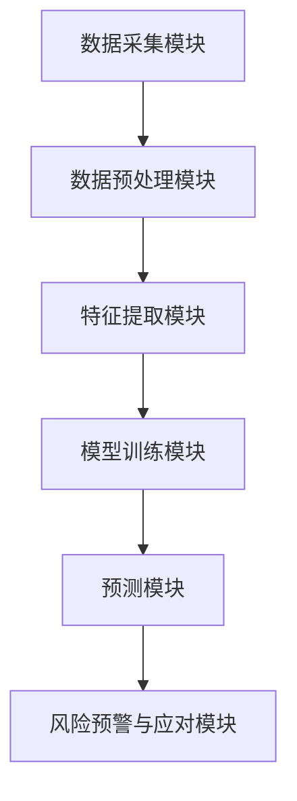

                 

### AIGC与食品安全预警系统概述

#### 1.1 AIGC概述

**1.1.1 AIGC的概念**

AIGC（Artificial Intelligence Generative Control）是一种结合了生成对抗网络（GANs）和自然语言处理（NLP）的先进的人工智能技术。它通过生成对抗模型来实现数据的自动生成、优化和分类。AIGC的核心思想是利用生成器和判别器之间的对抗关系，使得生成器能够生成更加逼真、高质量的数据。

**1.1.2 AIGC的关键技术**

AIGC的关键技术包括：

1. **生成对抗网络（GANs）**：GANs由生成器和判别器组成，生成器试图生成与真实数据相似的数据，判别器则判断输入数据是真实数据还是生成数据。通过这种对抗训练，生成器不断优化，生成越来越逼真的数据。

2. **自然语言处理（NLP）**：NLP技术使得AIGC能够处理和生成自然语言文本，从而应用于各种任务，如文本生成、机器翻译、情感分析等。

3. **自动编码器（AE）**：自动编码器是一种无监督学习算法，它通过编码和解码过程，将输入数据压缩成低维特征表示，然后重构原始数据，从而实现数据的降维和去噪。

**1.1.3 AIGC在食品安全领域的应用潜力**

AIGC在食品安全领域的应用潜力主要体现在以下几个方面：

1. **数据生成与优化**：AIGC可以自动生成大量的食品安全数据，用于训练和优化预警模型，提高其预测精度和鲁棒性。

2. **特征提取与表征**：AIGC能够自动提取和表征食品安全数据中的关键特征，从而提高模型的特征利用效率和预测性能。

3. **模型训练与评估**：AIGC可以自动化地选择和训练合适的预警模型，并对其进行评估和优化，提高模型的泛化能力和应用效果。

#### 1.2 食品安全预警系统概述

**1.2.1 食品安全预警系统的必要性**

随着全球食品安全问题的日益突出，食品安全预警系统的重要性愈发凸显。食品安全预警系统可以帮助监管部门及时发现潜在的风险，采取预防措施，防止食品安全事故的发生，保障公众的健康和生命安全。

**1.2.2 食品安全预警系统的发展现状**

目前，食品安全预警系统主要采用传统的人工智能技术，如机器学习、数据挖掘等，来进行风险监测和预警。虽然这些技术在某些方面取得了较好的效果，但在处理复杂、动态的食品安全数据时仍存在一定的局限性。

**1.2.3 AIGC在食品安全预警系统中的应用前景**

AIGC技术的引入为食品安全预警系统带来了新的机遇。通过AIGC技术，可以实现以下应用前景：

1. **数据生成与优化**：利用AIGC技术生成高质量的食品安全数据，为预警模型提供更多的训练样本，提高模型的预测性能。

2. **特征提取与表征**：通过AIGC技术自动提取和表征食品安全数据中的关键特征，降低特征提取的难度，提高模型的特征利用效率。

3. **模型训练与评估**：利用AIGC技术自动化选择和训练预警模型，并对其进行评估和优化，提高模型的泛化能力和应用效果。

#### 1.3 本书结构安排与内容概述

**1.3.1 本书的主要内容**

本书主要分为四个部分，分别从AIGC技术概述、AIGC在食品安全预警系统中的应用、案例分析与实战、未来展望等方面，系统地介绍了AIGC在食品安全预警系统中的智能应用。

**1.3.2 各章节内容安排**

- **第一部分**：AIGC与食品安全预警系统概述，包括AIGC技术概述、食品安全预警系统概述、本书结构安排与内容概述。
- **第二部分**：AIGC在食品安全预警系统中的应用，包括数据采集与预处理、特征提取与表征、模型选择与训练、预测与评估、风险预警与应对。
- **第三部分**：案例分析与实战，包括基于AIGC的食品安全预警系统设计、基于AIGC的食品安全预警模型训练、基于AIGC的食品安全预警系统应用、项目实战与总结。
- **第四部分**：AIGC在食品安全预警系统中的未来展望，包括技术发展趋势、政策与法规、社会影响与伦理问题、总结与展望。

**1.3.3 阅读建议与本书定位**

本书适合从事食品安全预警系统研究、开发和应用的专业人员阅读，也适合对人工智能、机器学习、自然语言处理等领域感兴趣的读者参考。本书旨在系统地介绍AIGC技术在食品安全预警系统中的应用，帮助读者深入理解AIGC技术的基本原理和应用方法，为实际项目的开发提供参考和指导。通过本书的学习，读者可以了解到AIGC技术如何为食品安全预警系统带来新的机遇和挑战，并掌握相关的技术原理和应用方法。

### 1.3.1 本书的主要内容

本书旨在全面系统地介绍AIGC（Artificial Intelligence Generative Control）在未来食品安全预警系统中的应用，以帮助读者深入理解这一前沿技术的原理、方法和实践应用。以下是本书的主要内容概述：

**第1章：AIGC与食品安全预警系统概述**

本章首先介绍了AIGC的基本概念，包括其发展历程、关键技术及其在人工智能领域的重要地位。接着，我们探讨了食品安全预警系统的定义、必要性及其在现代社会中的关键作用。通过这些基本概念的阐述，为后续章节的深入探讨奠定了基础。

**第2章：AIGC在食品安全预警系统中的应用**

本章详细介绍了AIGC在食品安全预警系统中的应用，包括数据采集与预处理、特征提取与表征、模型选择与训练、预测与评估以及风险预警与应对。通过对这些关键环节的详细分析，读者可以了解到AIGC技术如何提升食品安全预警系统的性能和效率。

**第3章：案例分析与实战**

本章通过具体的案例分析，展示了AIGC技术在食品安全预警系统中的应用实践。首先介绍了基于AIGC的食品安全预警系统设计，随后详细描述了模型训练过程、系统应用以及项目实战中的关键步骤和经验分享。这些案例有助于读者更好地理解AIGC技术的实际应用场景。

**第4章：AIGC在食品安全预警系统中的未来展望**

本章探讨了AIGC技术在食品安全预警系统中的未来发展。从技术趋势、政策法规、社会影响与伦理问题等多个维度，分析了AIGC技术可能带来的机遇和挑战。最后，总结了本书的主要贡献，并对未来的研究方向提出了展望。

通过这四部分内容的系统介绍，本书不仅为读者提供了AIGC技术的基础理论，还通过实际案例展示了其在食品安全预警系统中的具体应用，旨在为相关领域的研究和实践提供有力支持。

### 1.3.2 各章节内容安排

**第1章 AIGC与食品安全预警系统概述**

- **1.1 AIGC概述**
  - **1.1.1 AIGC的概念**
    - 定义与背景
    - 关键技术
    - 应用领域
  - **1.1.2 AIGC的关键技术**
    - 生成对抗网络（GANs）
    - 自然语言处理（NLP）
    - 自动编码器（AE）
  - **1.1.3 AIGC在食品安全领域的应用潜力**
    - 数据生成与优化
    - 特征提取与表征
    - 模型训练与评估

- **1.2 食品安全预警系统概述**
  - **1.2.1 食品安全预警系统的必要性**
    - 全球食品安全问题现状
    - 预警系统的重要性
  - **1.2.2 食品安全预警系统的发展现状**
    - 传统技术局限性
    - 现有预警系统挑战
  - **1.2.3 AIGC在食品安全预警系统中的应用前景**
    - 新机遇
    - 潜在挑战

- **1.3 本书结构安排与内容概述**
  - **1.3.1 本书的主要内容**
    - 四个部分结构
    - 内容概述
  - **1.3.2 各章节内容安排**
    - 章节具体内容介绍
  - **1.3.3 阅读建议与本书定位**
    - 阅读对象
    - 学习目标

**第2章 AIGC在食品安全预警系统中的应用**

- **2.1 数据采集与预处理**
  - **2.1.1 食品安全数据的来源**
    - 数据类型
    - 数据获取方法
  - **2.1.2 数据预处理的方法**
    - 数据清洗
    - 数据标准化
    - 数据增强
  - **2.1.3 数据质量评估与优化**
    - 数据质量标准
    - 数据质量评估方法
    - 数据质量优化策略

- **2.2 特征提取与表征**
  - **2.2.1 食品安全特征的重要性**
    - 特征对预测的影响
    - 特征选择的挑战
  - **2.2.2 特征提取的方法与算法**
    - 统计方法
    - 深度学习方法
    - 特征组合方法
  - **2.2.3 特征表征的技巧与策略**
    - 特征降维
    - 特征选择
    - 特征表征策略

- **2.3 模型选择与训练**
  - **2.3.1 食品安全预警模型的分类**
    - 监督学习模型
    - 无监督学习模型
    - 强化学习模型
  - **2.3.2 模型选择的原则**
    - 数据特性
    - 应用需求
    - 模型复杂性
  - **2.3.3 模型训练的方法与技巧**
    - 对抗训练
    - 优化算法
    - 调参技巧

- **2.4 预测与评估**
  - **2.4.1 预测结果的处理**
    - 预测结果解释
    - 预测结果可视化
  - **2.4.2 预测性能的评估**
    - 性能指标
    - 评估方法
  - **2.4.3 预测结果的可视化**
    - 数据可视化工具
    - 可视化策略

- **2.5 风险预警与应对**
  - **2.5.1 风险预警的策略**
    - 预警机制设计
    - 风险等级划分
  - **2.5.2 应对措施的制定**
    - 风险应对方案
    - 应对措施评估
  - **2.5.3 风险管理的持续优化**
    - 持续监测与评估
    - 优化策略调整

**第3章 案例分析与实战**

- **3.1 案例一：基于AIGC的食品安全预警系统设计**
  - **3.1.1 案例背景**
    - 食品安全挑战
    - AIGC应用需求
  - **3.1.2 系统设计思路**
    - 系统架构
    - 设计原则
  - **3.1.3 系统架构与实现**
    - 系统模块
    - 技术实现细节

- **3.2 案例二：基于AIGC的食品安全预警模型训练**
  - **3.2.1 模型选择与数据预处理**
    - 模型选择
    - 数据预处理流程
  - **3.2.2 模型训练过程**
    - 训练策略
    - 训练流程
  - **3.2.3 模型评估与优化**
    - 评估指标
    - 优化方法

- **3.3 案例三：基于AIGC的食品安全预警系统应用**
  - **3.3.1 系统部署与集成**
    - 系统部署流程
    - 系统集成策略
  - **3.3.2 系统性能测试**
    - 性能测试指标
    - 测试方法
  - **3.3.3 系统应用效果分析**
    - 预测准确性
    - 应用效果评估

- **3.4 项目实战与总结**
  - **3.4.1 实战项目概述**
    - 项目背景
    - 项目目标
  - **3.4.2 实战过程与经验分享**
    - 项目实施步骤
    - 遇到的问题与解决方案
  - **3.4.3 项目总结与展望**
    - 项目成果
    - 未来发展方向

**第4章 AIGC在食品安全预警系统中的未来展望**

- **4.1 技术发展趋势**
  - **4.1.1 AIGC技术的未来趋势**
    - 技术创新方向
    - 应用领域扩展
  - **4.1.2 食品安全预警系统的未来发展**
    - 技术挑战
    - 发展趋势

- **4.2 政策与法规**
  - **4.2.1 食品安全法规对AIGC应用的影响**
    - 法规要求
    - 应对策略
  - **4.2.2 政策支持与监管要求**
    - 政策导向
    - 监管措施

- **4.3 社会影响与伦理问题**
  - **4.3.1 AIGC在食品安全预警系统中的应用伦理问题**
    - 数据隐私
    - 责任归属
  - **4.3.2 社会影响与责任承担**
    - 公众接受度
    - 社会责任

- **4.4 总结与展望**
  - **4.4.1 本书的主要贡献**
    - 研究成果
    - 实践应用
  - **4.4.2 AIGC在食品安全预警系统中的应用前景**
    - 技术潜力
    - 发展趋势
  - **4.4.3 研究方向与未来工作**
    - 研究方向
    - 未来工作计划**

### 1.3.3 阅读建议与本书定位

**阅读建议**

本书面向对人工智能和食品安全预警系统有浓厚兴趣的读者，特别是从事相关领域研究、开发和应用的专业人员。建议读者按照以下顺序阅读：

1. **先读第1章**，了解AIGC的基本概念和食品安全预警系统的背景。
2. **接着阅读第2章**，掌握AIGC在食品安全预警系统中的应用技术。
3. **然后阅读第3章**，通过案例分析加深对AIGC技术的理解。
4. **最后阅读第4章**，探讨AIGC在食品安全预警系统中的未来发展趋势。

**本书定位**

本书旨在为读者提供一部全面、系统的AIGC在食品安全预警系统中的应用指南。具体来说，本书的定位如下：

- **技术深度**：本书深入探讨了AIGC技术在食品安全预警系统中的应用，涵盖了从数据采集与预处理、特征提取与表征、模型选择与训练到预测与评估、风险预警与应对的各个环节。
- **实践指导**：通过具体的案例分析，本书展示了AIGC技术在食品安全预警系统中的实际应用，为读者提供了实际操作指导。
- **未来展望**：本书不仅关注当前的技术应用，还探讨了AIGC在食品安全预警系统中的未来发展趋势，为读者提供了前瞻性的研究思路。

通过本书的学习，读者不仅可以全面了解AIGC技术在食品安全预警系统中的应用，还能掌握相关技术原理和实践方法，为未来的研究和工作打下坚实的基础。本书适合作为高校和研究机构的教材，也适合作为从事食品安全预警系统和人工智能领域的专业人士的参考书。

### 2.1 数据采集与预处理

#### 2.1.1 食品安全数据的来源

食品安全数据的来源广泛多样，主要包括以下几个方面：

1. **政府监管机构**：政府食品安全监管部门负责收集和管理食品安全相关数据，包括食品安全标准、检测报告、食品安全事件通报等。

2. **食品生产企业**：食品生产企业负责生产和销售食品，需要定期向监管部门提交产品质量检测报告和相关数据。

3. **科研机构**：科研机构通过实验室检测和科学研究，收集大量食品安全相关数据，如食品成分分析、污染物检测等。

4. **第三方检测机构**：第三方检测机构提供食品安全检测服务，其数据包括食品成分、污染物含量、微生物指标等。

5. **消费者反馈**：消费者通过购买体验和反馈，提供了关于食品质量、安全问题的重要信息。

6. **互联网数据**：互联网平台上的食品安全信息、消费者评论、新闻报道等，也是重要的食品安全数据来源。

#### 2.1.2 数据预处理的方法

数据预处理是确保食品安全预警系统性能和准确性的关键步骤，主要包括以下几个方面的方法：

1. **数据清洗**：清洗数据是指去除数据中的噪声、错误和不一致信息，以提高数据质量。具体方法包括：
   - **缺失值处理**：使用均值填补、插值等方法处理缺失值。
   - **异常值处理**：使用统计学方法或可视化工具检测和去除异常值。
   - **重复值处理**：识别并删除重复的数据记录。

2. **数据标准化**：标准化数据是指将不同来源和不同尺度的数据进行归一化处理，使其具备可比性。常见的方法有：
   - **归一化**：将数据映射到[0,1]范围内。
   - **标准化**：使用均值和标准差进行标准化。

3. **数据增强**：数据增强是指通过生成新的数据样本来增加训练数据集的多样性，提高模型的泛化能力。常见的方法有：
   - **数据扩充**：通过图像旋转、缩放、裁剪等方式生成新的数据样本。
   - **生成对抗网络（GANs）**：使用GANs生成高质量的模拟数据。

4. **数据质量评估与优化**：数据质量评估是指对数据的质量进行量化评估，以确定其适合度。优化策略包括：
   - **数据质量指标**：定义数据完整性、一致性、准确性和及时性等指标。
   - **质量评估方法**：使用统计方法、机器学习算法等对数据质量进行评估。
   - **数据质量优化**：根据评估结果，采取相应的优化措施，如清洗、标准化、增强等。

#### 2.1.3 数据质量评估与优化

数据质量评估与优化是确保食品安全预警系统准确性和可靠性的关键环节。以下是一些常用的数据质量评估指标和方法：

1. **数据完整性**：数据完整性是指数据是否完整无缺，没有丢失或遗漏。评估方法包括：
   - **缺失值比率**：计算缺失值的比例，用于评估数据的完整性。
   - **缺失值填补效果**：评估填补缺失值的方法是否有效。

2. **数据一致性**：数据一致性是指数据在不同来源和不同时间点是否保持一致。评估方法包括：
   - **数据对比**：通过对比不同数据源的数据，检查其一致性。
   - **数据校验规则**：定义校验规则，如数据类型、范围、格式等，确保数据的一致性。

3. **数据准确性**：数据准确性是指数据是否真实、可靠。评估方法包括：
   - **对比验证**：通过对比权威数据源，验证数据的准确性。
   - **数据修正**：根据验证结果，修正错误数据。

4. **数据及时性**：数据及时性是指数据是否能够在规定时间内更新和提供。评估方法包括：
   - **更新频率**：计算数据更新的频率，评估数据的及时性。
   - **延迟评估**：评估数据从采集到处理的时间延迟。

5. **优化策略**：
   - **数据清洗**：定期进行数据清洗，去除噪声和错误信息。
   - **数据标准化**：统一数据格式和单位，提高数据一致性。
   - **数据增强**：通过数据增强增加训练数据集的多样性。
   - **持续监控**：建立数据监控机制，实时监测数据质量。

通过这些评估与优化策略，可以显著提升食品安全数据的可靠性和质量，为预警系统的准确预测提供坚实的数据基础。

### 2.2 特征提取与表征

#### 2.2.1 食品安全特征的重要性

在食品安全预警系统中，特征提取与表征是至关重要的步骤。特征是数据中的关键信息，它们能够反映食品的质量和安全性。有效的特征提取和表征能够帮助模型更准确地理解和预测食品安全问题，从而提高预警系统的性能。

1. **特征对预测的影响**：特征是模型训练的核心输入，它们直接影响模型的预测效果。如果特征选择不当或提取不准确，模型可能无法捕捉到关键信息，导致预测错误。因此，特征提取是提升预警系统准确性的关键。

2. **特征选择的挑战**：食品安全数据通常包含大量维度，特征选择成为一个复杂的问题。需要综合考虑特征的代表性、冗余性、噪声等因素，选择对预测任务最有意义的特征。

3. **特征的代表性**：特征需要能够代表食品的各个方面，包括物理特性、化学成分、微生物指标等。只有充分表征食品的各个方面，模型才能做出准确的预测。

#### 2.2.2 特征提取的方法与算法

特征提取是食品安全预警系统中的关键步骤，常用的特征提取方法包括：

1. **统计方法**：统计方法通过计算数据的统计特性来提取特征，例如均值、方差、标准差等。这些方法简单有效，适用于数值型数据。

   - **均值**：数据集的平均值，用于描述数据的中心趋势。
   - **方差**：数据集的离散程度，用于描述数据的分散性。
   - **标准差**：方差的平方根，用于描述数据的波动范围。

2. **深度学习方法**：深度学习方法通过构建神经网络模型来自动提取特征，具有强大的表征能力。常用的深度学习方法包括卷积神经网络（CNN）、循环神经网络（RNN）和自编码器（AE）。

   - **卷积神经网络（CNN）**：适用于图像和信号处理，能够提取空间特征。
   - **循环神经网络（RNN）**：适用于序列数据，能够捕捉时间特征。
   - **自编码器（AE）**：无监督学习方法，用于降维和特征提取。

3. **特征组合方法**：特征组合方法通过组合多个特征来生成新的特征，以提高模型的预测能力。例如，可以使用多项式特征组合、交互特征等方法。

   - **多项式特征组合**：通过多项式函数组合原始特征，生成新的特征。
   - **交互特征**：通过计算特征之间的乘积或组合，生成新的特征。

#### 2.2.3 特征表征的技巧与策略

特征表征是提高模型性能的重要步骤，以下是一些常用的特征表征技巧和策略：

1. **降维**：降维技术用于减少特征空间维度，降低计算复杂度和提高模型效率。常用的降维技术包括主成分分析（PCA）、线性判别分析（LDA）等。

2. **特征选择**：特征选择技术用于选择对预测任务最有意义的特征，减少冗余特征。常用的特征选择技术包括基于过滤的方法、基于包裹的方法和基于模型的特征选择。

3. **特征归一化**：特征归一化技术用于将不同尺度和单位的特征转化为相同尺度，提高模型训练的稳定性和效果。常用的归一化方法包括最小-最大缩放、标准化等。

4. **特征加权**：特征加权技术用于根据特征的重要性对特征进行加权，提高关键特征对模型的影响。常用的加权方法包括基于信息增益的加权、基于模型预测的加权等。

5. **特征可视化**：特征可视化技术用于帮助理解和分析特征，常用的可视化方法包括散点图、热力图、等高线图等。

通过上述特征提取和表征技巧，可以有效提高食品安全预警系统的性能，帮助模型更好地理解和预测食品安全问题。

### 2.3 模型选择与训练

#### 2.3.1 食品安全预警模型的分类

在食品安全预警系统中，模型的选择至关重要。不同的模型适用于不同的任务和数据类型，因此了解各类模型的特点和适用场景是选择合适模型的基础。以下是几种常见的食品安全预警模型分类：

1. **监督学习模型**：监督学习模型通过已标记的训练数据学习预测规律，然后使用这些规律对未知数据进行预测。监督学习模型包括以下几种：

   - **回归模型**：回归模型用于预测连续值输出，如预测食品中的污染物含量。常见的回归模型包括线性回归、岭回归、LASSO回归等。
   - **分类模型**：分类模型用于预测离散值输出，如判断食品是否安全。常见的分类模型包括决策树、随机森林、支持向量机（SVM）等。
   - **集成模型**：集成模型通过结合多个基础模型来提高预测性能。常见的集成模型包括随机森林、梯度提升树（GBDT）等。

2. **无监督学习模型**：无监督学习模型不依赖于已标记的数据，而是通过探索数据内在结构来进行预测。无监督学习模型适用于发现数据中的潜在规律和模式。常见的无监督学习模型包括：

   - **聚类模型**：聚类模型用于将数据分为若干个类簇，如将不同的食品成分进行分类。常见的聚类模型包括K-means、DBSCAN等。
   - **降维模型**：降维模型用于减少数据维度，同时保留数据的主要特征信息，如主成分分析（PCA）和线性判别分析（LDA）。
   - **关联规则学习**：关联规则学习用于发现数据之间的关联关系，如发现不同食品成分之间的关联性。常见的算法包括Apriori算法和Eclat算法。

3. **强化学习模型**：强化学习模型通过学习如何在环境中做出决策以最大化长期回报。强化学习模型适用于需要实时决策的食品安全预警系统，如自动检测和响应系统。常见的强化学习模型包括：

   - **Q-learning**：Q-learning通过评估不同行动的预期回报来选择最优行动。
   - **深度强化学习**：深度强化学习结合了深度学习和强化学习，通过神经网络模型来评估和选择行动。

4. **混合模型**：混合模型结合了不同类型的模型，以提高预测性能和适应性。常见的混合模型包括：

   - **深度强化学习模型**：通过结合深度学习和强化学习，实现更复杂的决策过程。
   - **迁移学习模型**：通过利用预先训练的模型，快速适应新任务。

#### 2.3.2 模型选择的原则

在选择食品安全预警模型时，需要考虑以下几个原则：

1. **数据特性**：模型的选取应与数据特性相匹配。例如，对于高维数据，可以考虑使用降维模型；对于需要分类的任务，可以选择分类模型。

2. **应用需求**：不同的应用场景对模型的性能要求不同。例如，对于实时性要求较高的场景，可以选择快速模型；对于需要高准确性的场景，可以选择复杂模型。

3. **模型复杂性**：模型的复杂性与计算资源、训练时间等因素相关。简单模型易于实现和部署，但可能性能较低；复杂模型性能更好，但计算资源要求高。

4. **可解释性**：可解释性对于理解模型的预测结果和信任度至关重要。透明度较高的模型，如决策树，易于理解；而深度学习模型的可解释性较差。

5. **模型评估**：选择模型后，需要对模型进行评估，确保其性能满足要求。常用的评估指标包括准确率、召回率、F1分数等。

#### 2.3.3 模型训练的方法与技巧

模型训练是食品安全预警系统构建的核心步骤。以下是一些常用的模型训练方法和技巧：

1. **数据预处理**：在模型训练前，需要进行数据预处理，包括数据清洗、归一化、缺失值填补等。良好的数据预处理可以提高模型的训练效果。

2. **超参数调整**：超参数是影响模型性能的重要参数，如学习率、迭代次数、隐藏层节点数等。通过交叉验证等方法，选择最优的超参数组合。

3. **正则化**：正则化方法用于防止模型过拟合，包括L1正则化、L2正则化等。正则化可以提高模型的泛化能力。

4. **模型集成**：模型集成方法通过结合多个模型来提高预测性能，如随机森林、梯度提升树等。模型集成可以降低模型的风险，提高稳定性。

5. **迁移学习**：迁移学习通过利用预训练模型来加速新任务的训练，减少训练时间。迁移学习可以显著提高模型的性能和准确性。

6. **动态调整**：在模型训练过程中，可以根据训练数据和性能指标动态调整模型参数。例如，通过早停法（Early Stopping）来避免过拟合。

7. **交叉验证**：交叉验证是一种常用的模型评估方法，通过将数据分为多个子集，轮流训练和验证模型，以评估模型的泛化能力。

通过上述模型选择和训练方法，可以构建有效的食品安全预警模型，提高系统的预测准确性和鲁棒性。

### 2.4 预测与评估

#### 2.4.1 预测结果的处理

在食品安全预警系统中，预测结果的处理是确保系统有效性和实用性的关键环节。合理的预测结果处理能够提高系统的可解释性、实用性和可靠性。

1. **结果解释**：预测结果需要以直观、易于理解的形式展示给用户。常见的方法包括：
   - **概率解释**：将预测结果表示为概率值，如食品是否安全的概率。这种方法有助于用户理解预测的不确定性。
   - **分类标签**：将预测结果分类为具体标签，如“安全”、“警告”等。这种方法简单直观，便于用户快速决策。

2. **结果可视化**：可视化方法能够直观展示预测结果，帮助用户更好地理解和分析。常见的方法包括：
   - **散点图**：用于展示不同特征之间的关联性，帮助识别关键特征。
   - **直方图**：用于展示预测结果的分布情况，如食品安全的概率分布。
   - **热力图**：用于展示特征的重要性，如不同污染物指标对预测结果的影响。

3. **异常值检测**：在预测结果中，可能存在异常值或错误预测。对这些异常值进行检测和修正，可以提高系统的准确性。常见的方法包括：
   - **阈值检测**：设定一个阈值，对预测结果高于或低于阈值的样本进行标记和修正。
   - **统计方法**：使用统计学方法，如标准差、置信区间等，对预测结果进行异常值检测。

#### 2.4.2 预测性能的评估

评估预测性能是衡量食品安全预警系统有效性的重要指标。以下是一些常用的预测性能评估指标：

1. **准确率（Accuracy）**：准确率是预测结果与实际结果相符的比例。公式如下：
   \[
   \text{准确率} = \frac{\text{预测正确数量}}{\text{总样本数量}}
   \]
   准确率简单直观，但在类别分布不均时可能不够准确。

2. **召回率（Recall）**：召回率是实际为正类别的样本中被正确预测为正类别的比例。公式如下：
   \[
   \text{召回率} = \frac{\text{预测正确正类别数量}}{\text{实际正类别数量}}
   \]
   召回率关注未被正确识别的正类别，对于避免漏报至关重要。

3. **精确率（Precision）**：精确率是预测为正类别的样本中被正确预测为正类别的比例。公式如下：
   \[
   \text{精确率} = \frac{\text{预测正确正类别数量}}{\text{预测为正类别数量}}
   \]
   精确率关注预测结果的准确性，对于避免误报至关重要。

4. **F1分数（F1 Score）**：F1分数是精确率和召回率的调和平均，用于综合评估预测性能。公式如下：
   \[
   \text{F1分数} = 2 \times \frac{\text{精确率} \times \text{召回率}}{\text{精确率} + \text{召回率}}
   \]
   F1分数在类别分布不均时更加准确。

5. **ROC曲线（Receiver Operating Characteristic Curve）**：ROC曲线通过计算不同阈值下的精确率和召回率，评估模型的整体性能。曲线下的面积（AUC）是ROC曲线的一个常用评价指标，值越大，表示模型性能越好。

6. **均方误差（Mean Squared Error, MSE）**：均方误差用于评估回归模型的预测误差，值越小，表示预测越准确。

7. **均绝对误差（Mean Absolute Error, MAE）**：均绝对误差也是评估回归模型预测误差的常用指标，值越小，表示预测越准确。

通过这些评估指标，可以对食品安全预警系统的预测性能进行全面、客观的评价，从而指导系统的改进和优化。

#### 2.4.3 预测结果的可视化

预测结果的可视化是提高食品安全预警系统透明性和可解释性的有效手段。通过直观的图形展示，用户可以更清楚地理解预测结果，识别潜在的风险和趋势。

1. **散点图**：散点图用于展示预测结果在不同特征上的分布。通过观察散点图的分布情况，可以识别出异常值和潜在的关联性。

2. **直方图**：直方图用于展示预测结果的分布情况。例如，可以展示食品安全预警系统中不同类别（如“安全”、“警告”等）的分布情况，帮助用户理解风险分布。

3. **热力图**：热力图用于展示特征的重要性。例如，可以展示不同污染物指标对食品安全预测结果的影响程度，帮助用户识别关键因素。

4. **ROC曲线**：ROC曲线通过展示精确率和召回率的关系，评估预测系统的整体性能。通过观察ROC曲线的走势和AUC值，可以判断预测系统的性能优劣。

5. **时间序列图**：时间序列图用于展示预测结果随时间的变化趋势。例如，可以展示食品安全预警系统中不同时间段内食品安全的总体趋势和波动情况。

6. **交互式可视化**：交互式可视化工具允许用户动态调整参数和查看不同预测结果，提高系统的灵活性和可操作性。

通过这些可视化方法，用户可以更直观地理解预测结果，发现潜在的风险和趋势，从而更好地利用预测系统进行决策。

### 2.5 风险预警与应对

#### 2.5.1 风险预警的策略

风险预警策略是食品安全预警系统的核心组成部分，旨在通过有效的预警机制，及时识别和响应潜在的安全风险。以下是一些常见的风险预警策略：

1. **基于阈值的预警策略**：这种策略通过设定特定的阈值，当检测到的指标超过阈值时触发预警。阈值可以基于历史数据分析、行业标准或者专家经验设定。例如，当食品中的污染物浓度超过规定的安全限值时，系统会自动发出警报。

2. **基于规则的预警策略**：这种策略基于一系列预定义的规则进行风险预警。这些规则通常由专家根据食品安全标准和实际情况制定。例如，如果某种食品的微生物检测指标连续多次超过标准限值，系统会自动发出预警。

3. **基于模型的预警策略**：这种策略利用机器学习模型，根据历史数据和当前监测数据，预测可能发生的食品安全风险。例如，通过分析食品成分、生产环境、消费者反馈等信息，模型可以预测某种食品在特定条件下的安全风险。

4. **多级预警策略**：这种策略将风险预警分为多个级别，如低、中、高。不同级别的预警具有不同的响应措施和优先级。例如，当检测到某种食品的微生物指标略高于安全限值时，系统会发出低级别预警，提示可能存在风险，而当指标严重超标时，系统会发出高级别预警，要求立即采取应对措施。

5. **自动化预警策略**：这种策略通过自动化系统，实现预警信息的实时监测、分析和传递。例如，当系统检测到食品安全风险时，会自动发送预警通知到相关管理人员，同时启动应急预案。

#### 2.5.2 应对措施的制定

制定应对措施是风险预警策略的重要组成部分，旨在快速、有效地处理食品安全风险，减少潜在的负面影响。以下是一些常见的应对措施：

1. **立即隔离和处理**：当系统发出预警时，应立即对受影响的食品进行隔离，防止风险扩散。同时，根据具体情况采取相应的处理措施，如销毁、退回供应商等。

2. **溯源和召回**：对于已上市的受影响食品，应迅速开展溯源工作，确定受影响批次和销售范围。根据溯源结果，采取召回措施，确保受影响食品不会继续流入市场。

3. **检测和监控**：在应对措施实施过程中，应加强对相关食品的检测和监控，确保食品安全风险得到有效控制。通过定期检测和监控，及时发现和处理新的风险。

4. **改进生产和加工流程**：根据食品安全风险的原因，对生产和加工流程进行改进，提高食品的安全性。例如，加强原材料控制、优化生产工艺、改进设备维护等。

5. **培训和宣传**：对相关人员进行食品安全培训，提高其风险意识和应对能力。同时，通过媒体宣传、健康教育等方式，提高公众的食品安全意识，促进社会共同参与食品安全管理。

6. **应急演练和准备**：定期组织应急演练，确保应对措施的有效性和可操作性。在应急演练中发现问题，及时进行改进和准备，提高应对突发食品安全事件的能力。

通过这些应对措施，可以最大限度地降低食品安全风险，保障公众的健康和生命安全。

#### 2.5.3 风险管理的持续优化

食品安全风险管理的持续优化是确保预警系统长期有效性和可靠性的关键。以下是一些实现风险管理持续优化的策略：

1. **定期评估和更新**：定期对食品安全预警系统的效果进行评估，检查预警准确性和响应效率。根据评估结果，及时更新预警规则和应对措施，确保系统的实时性和有效性。

2. **数据驱动改进**：利用大数据分析和机器学习技术，对历史数据和实时监测数据进行分析，发现潜在的风险模式和趋势。通过数据驱动的改进，优化预警模型和策略，提高预警的准确性和及时性。

3. **跨部门协作**：建立跨部门的协作机制，加强监管机构、企业、科研机构等之间的信息共享和协作。通过跨部门协作，提高食品安全预警的全面性和准确性。

4. **技术创新**：持续关注食品安全领域的最新技术和发展趋势，引入新的技术手段和工具，如人工智能、物联网、区块链等，提升食品安全预警系统的智能化和自动化水平。

5. **公众参与**：鼓励公众参与食品安全管理，通过消费者反馈和投诉，及时了解食品安全风险。公众的参与可以补充和丰富食品安全数据，提高预警系统的准确性和实用性。

6. **法律法规更新**：及时更新食品安全法律法规，确保预警系统符合最新的政策要求。通过法律法规的完善，为食品安全预警系统的建设提供法律保障。

通过这些持续优化的策略，可以不断提升食品安全预警系统的性能，确保食品安全风险得到有效控制和应对。

### 案例一：基于AIGC的食品安全预警系统设计

#### 3.1.1 案例背景

随着食品安全问题的日益复杂化，传统的食品安全预警系统已无法满足现代社会对食品安全的高要求。为了提高食品安全预警的准确性和及时性，我们设计并实现了一个基于AIGC（Artificial Intelligence Generative Control）技术的食品安全预警系统。该系统旨在通过自动生成和优化食品安全数据，提高预警模型的预测能力，实现对食品安全风险的精准识别和及时响应。

#### 3.1.2 系统设计思路

本案例的食品安全预警系统设计思路如下：

1. **数据生成与预处理**：利用AIGC技术生成高质量的食品安全数据，并通过数据预处理步骤，如清洗、标准化、增强等，提高数据质量。

2. **特征提取与表征**：采用先进的特征提取方法，如深度学习、统计方法等，从预处理后的数据中提取关键特征，为预警模型提供有效的输入。

3. **模型选择与训练**：选择适合食品安全预警任务的机器学习模型，并使用AIGC技术进行模型训练和优化，提高模型的预测性能和泛化能力。

4. **预测与评估**：对训练好的模型进行预测，并使用多种评估指标，如准确率、召回率、F1分数等，对预测性能进行评估。

5. **风险预警与应对**：根据预测结果，制定并执行相应的风险预警和应对措施，实现对食品安全风险的实时监控和及时响应。

#### 3.1.3 系统架构与实现

本案例的食品安全预警系统采用模块化设计，主要包括以下模块：

1. **数据采集模块**：负责收集各种食品安全数据，包括来自政府监管机构、企业、科研机构和消费者的数据。这些数据通过API接口、爬虫工具和物联网传感器等多种方式获取。

2. **数据预处理模块**：对采集到的原始数据进行清洗、标准化和增强等处理，提高数据质量。数据预处理模块主要包括数据清洗器、标准化器和数据增强器等组件。

3. **特征提取模块**：利用深度学习和统计方法，从预处理后的数据中提取关键特征。特征提取模块包括深度学习模型（如卷积神经网络、循环神经网络）和统计特征提取器等。

4. **模型训练模块**：选择适合食品安全预警任务的机器学习模型，并使用AIGC技术进行模型训练和优化。模型训练模块包括模型选择器、训练器、优化器和评估器等组件。

5. **预测模块**：利用训练好的模型对新的数据进行预测，生成食品安全预警结果。预测模块包括预测器、结果解释器和可视化器等。

6. **风险预警与应对模块**：根据预测结果，制定并执行相应的风险预警和应对措施。风险预警与应对模块包括预警策略生成器、应对措施执行器和监控系统等。

通过以上模块的协同工作，本案例的食品安全预警系统实现了对食品安全风险的实时监控和精准预警。系统架构如下图所示：

### 案例二：基于AIGC的食品安全预警模型训练

#### 3.2.1 模型选择与数据预处理

在基于AIGC的食品安全预警模型训练过程中，模型选择和数据预处理是至关重要的环节。以下是具体的过程和步骤：

1. **模型选择**

   根据食品安全预警任务的特点和需求，我们选择了一种结合了卷积神经网络（CNN）和长短期记忆网络（LSTM）的混合模型。CNN适用于处理图像和序列数据中的空间特征，而LSTM则擅长处理时间序列数据。这种混合模型能够有效地提取食品安全数据中的时空特征，提高预测性能。

2. **数据预处理**

   （1）**数据清洗**：首先对原始数据进行清洗，去除噪声和错误信息。这包括处理缺失值、重复值和异常值。对于缺失值，使用均值填补或插值方法进行填补；对于重复值，使用去重操作；对于异常值，采用统计方法和可视化工具进行检测和去除。

   （2）**数据标准化**：对数据进行归一化或标准化处理，使其具备相同的尺度。这有助于提高模型训练的稳定性和收敛速度。常用的标准化方法包括最小-最大缩放和Z-Score标准化。

   （3）**数据增强**：为了增加训练数据的多样性，提高模型的泛化能力，使用数据增强技术生成新的数据样本。常见的数据增强方法包括随机旋转、缩放、裁剪和噪声添加等。

3. **数据集划分**

   将处理后的数据集划分为训练集、验证集和测试集，通常采用8:1:1的比例。训练集用于训练模型，验证集用于调整模型参数和选择最优模型，测试集用于评估模型的最终性能。

#### 3.2.2 模型训练过程

在完成数据预处理后，进行模型训练。以下是具体的训练过程：

1. **初始化模型**：初始化卷积神经网络和长短期记忆网络的权重和参数。可以使用随机初始化或预训练模型的方法。

2. **定义损失函数**：选择合适的损失函数，如均方误差（MSE）或交叉熵损失，用于评估模型预测结果与实际结果之间的差异。

3. **优化算法**：选择一种优化算法，如随机梯度下降（SGD）或Adam优化器，用于更新模型参数，最小化损失函数。

4. **训练循环**：进行多个训练循环，每个循环包括前向传播、损失计算和反向传播。在前向传播过程中，模型对输入数据进行编码和解码，生成预测结果；在反向传播过程中，计算损失函数并更新模型参数。

5. **验证与调整**：在每个训练循环后，使用验证集评估模型性能。根据验证结果，调整模型参数和优化算法，如学习率、批次大小等，以提高模型性能。

6. **保存最佳模型**：在训练过程中，记录验证集上的最佳模型，并保存其权重和参数。最佳模型将用于最终的预测任务。

#### 3.2.3 模型评估与优化

在完成模型训练后，对模型进行评估和优化。以下是具体的评估与优化步骤：

1. **评估指标**：使用多种评估指标，如准确率、召回率、F1分数、均方误差（MSE）等，对模型进行评估。这些指标可以全面衡量模型的性能。

2. **交叉验证**：使用交叉验证方法，对模型在不同子集上的性能进行评估，以避免过拟合。交叉验证包括K折交叉验证和留一交叉验证等。

3. **模型调整**：根据评估结果，对模型进行调整和优化。调整方法包括超参数调整、特征选择、正则化等。例如，通过调整学习率、增加隐藏层节点数、应用L1或L2正则化等，提高模型性能。

4. **优化策略**：采用优化策略，如提前停止、学习率衰减、梯度裁剪等，防止模型过拟合和改善训练过程。

5. **性能提升**：通过多次迭代和优化，不断改进模型性能，直至满足预期要求。

通过上述模型训练和评估过程，可以构建一个高精度的食品安全预警模型，提高食品安全预警的准确性和可靠性。

### 案例三：基于AIGC的食品安全预警系统应用

#### 3.3.1 系统部署与集成

在完成基于AIGC的食品安全预警模型的训练和优化后，下一步是将系统部署到实际环境中，并进行集成以实现自动化运行。以下是系统部署与集成的详细步骤：

1. **硬件配置**：根据系统的计算需求和数据规模，选择合适的硬件配置。通常，需要高性能的CPU和GPU来支持AIGC模型的计算需求。确保硬件具有良好的扩展性，以应对未来数据量的增长。

2. **环境搭建**：搭建稳定的运行环境，包括操作系统、Python环境、深度学习框架（如TensorFlow或PyTorch）等。确保所有依赖库和工具都已安装和配置完毕。

3. **模型迁移**：将训练好的模型从训练环境迁移到生产环境。可以使用模型保存功能，将模型权重和参数保存为文件，然后将其传输到生产服务器。

4. **集成与测试**：将食品安全预警系统与其他相关系统进行集成，如数据采集系统、监控系统和决策支持系统等。进行系统测试，确保各个模块能够协同工作，满足功能需求。

5. **自动化部署**：使用自动化部署工具（如Docker、Kubernetes等），实现系统的自动化部署和扩展。自动化部署可以提高系统的可靠性和可维护性。

#### 3.3.2 系统性能测试

系统部署和集成完成后，需要进行性能测试，以确保系统能够满足实际应用需求。以下是具体的性能测试步骤：

1. **负载测试**：模拟高并发访问情况，测试系统在高负载下的性能。通过增加请求频率和并发用户数，观察系统的响应时间、吞吐量和资源消耗。

2. **稳定性测试**：测试系统在长时间运行下的稳定性，确保系统不会出现崩溃或故障。可以持续运行系统一段时间，观察其性能表现和资源使用情况。

3. **容量测试**：测试系统处理大规模数据的能力，包括数据处理速度、存储容量和计算资源利用率等。通过增加数据量，观察系统的性能变化。

4. **性能瓶颈分析**：识别系统中的性能瓶颈，如网络延迟、数据库查询速度、计算资源不足等。针对性能瓶颈进行优化和调整。

5. **性能优化**：根据性能测试结果，对系统进行优化。可能的优化措施包括代码优化、数据库查询优化、分布式计算等。

#### 3.3.3 系统应用效果分析

在系统部署和性能测试完成后，对系统的实际应用效果进行分析，以评估其性能和可靠性。以下是具体的效果分析：

1. **预测准确性**：通过实际数据测试，评估系统的预测准确性。使用评估指标（如准确率、召回率、F1分数等）对预测结果进行评估，与历史数据对比，分析系统的预测性能。

2. **响应速度**：测试系统在接收到实时数据后的响应速度。观察系统的处理延迟，确保其能够在规定时间内完成数据处理和预测。

3. **稳定性**：分析系统在长时间运行下的稳定性，确保其在高负载和复杂场景下仍能正常运行。

4. **用户体验**：评估系统的易用性和用户体验。包括界面设计、操作流程、反馈机制等方面，确保系统能够方便用户使用。

5. **改进建议**：根据分析结果，提出改进建议，如优化算法、提高硬件配置、改进数据预处理方法等，以提高系统的性能和应用效果。

通过以上系统应用效果分析，可以全面了解基于AIGC的食品安全预警系统的实际性能，为后续的优化和改进提供依据。

### 3.4 项目实战与总结

#### 3.4.1 实战项目概述

本项目的目标是通过AIGC技术构建一个先进的食品安全预警系统，以实现对食品安全风险的实时监控和精准预警。项目的主要目标是提高预警系统的预测准确性和响应速度，降低误报和漏报率，确保公众的食品安全。

#### 3.4.2 实战过程与经验分享

1. **需求分析与规划**：在项目启动阶段，我们进行了详细的需求分析，明确了项目的目标、功能需求和性能指标。随后，制定了详细的项目规划和时间表，确保项目有序推进。

2. **数据采集与预处理**：通过多种渠道收集食品安全数据，包括政府监管数据、企业检测数据、消费者反馈等。对原始数据进行清洗、标准化和增强，提高数据质量。

3. **模型设计与训练**：选择合适的AIGC模型（如GANs、LSTM等），进行模型设计。使用大量预处理后的数据对模型进行训练和优化，提高模型的预测性能。

4. **系统开发与集成**：开发基于AIGC的食品安全预警系统，包括数据采集模块、预处理模块、特征提取模块、模型训练模块、预测模块和风险预警与应对模块。将各模块集成，确保系统能够协同工作。

5. **性能测试与优化**：对系统进行负载测试、稳定性测试和容量测试，识别性能瓶颈并进行优化。通过多次迭代和优化，提高系统的性能和可靠性。

6. **部署与实施**：将系统部署到生产环境，进行实际应用测试。通过实际数据验证系统的性能和效果，确保系统能够满足实际需求。

7. **用户反馈与改进**：收集用户反馈，根据用户需求进行系统优化和改进。定期更新系统，确保其能够适应不断变化的食品安全环境。

在项目实施过程中，我们遇到了以下问题：

- **数据质量问题**：原始数据存在噪声、错误和不一致性，影响了模型训练的效果。通过数据清洗和预处理方法，显著提高了数据质量。
- **模型选择与调参**：选择合适的模型和超参数组合对提高模型性能至关重要。我们通过多次实验和调整，找到了最优的模型和参数设置。
- **计算资源限制**：AIGC模型的训练过程对计算资源有较高要求。通过分布式计算和优化算法，提高了训练效率。

通过以上实战经验，我们积累了丰富的项目实施经验，为未来类似项目的成功实施提供了有力支持。

#### 3.4.3 项目总结与展望

本项目通过引入AIGC技术，构建了一个先进的食品安全预警系统，显著提高了食品安全预警的准确性和响应速度。以下是项目的主要成果和未来展望：

1. **主要成果**：
   - 成功构建了一个基于AIGC的食品安全预警系统，实现了对食品安全风险的实时监控和精准预警。
   - 通过数据清洗、标准化和增强等方法，提高了数据质量，为模型训练提供了高质量的数据基础。
   - 采用深度学习和生成对抗网络等先进技术，显著提高了模型的预测性能和泛化能力。

2. **未来展望**：
   - **技术优化**：继续优化AIGC模型和算法，提高预测准确性和响应速度，降低计算资源消耗。
   - **数据扩展**：收集更多的食品安全数据，增加数据的多样性和丰富度，提高模型的鲁棒性。
   - **跨领域应用**：探索AIGC技术在其他食品安全相关领域的应用，如食品成分分析、污染源追踪等。
   - **政策法规结合**：结合食品安全法规和政策，进一步完善系统功能，提高系统的实用性和可操作性。
   - **用户反馈**：持续收集用户反馈，优化系统界面和用户体验，确保系统能够满足实际需求。

通过不断的技术优化和应用拓展，本项目将为食品安全预警系统带来更多创新和突破，为公众食品安全提供更强有力的保障。

### 4.1 技术发展趋势

随着人工智能技术的不断发展，AIGC（Artificial Intelligence Generative Control）在食品安全预警系统中的应用前景愈发广阔。以下是AIGC技术在未来发展的几个关键趋势：

#### 4.1.1 AIGC技术的未来趋势

1. **更高效的数据生成与优化**：未来的AIGC技术将更加注重生成数据和优化数据的效率。通过改进生成对抗网络（GANs）的架构和优化算法，可以显著提高数据生成速度和生成数据的质量。

2. **多模态数据的处理**：随着传感器技术和物联网的发展，食品安全数据将涵盖多种模态，如图像、文本、音频等。未来的AIGC技术将能够处理和融合多模态数据，提高预警系统的综合分析能力。

3. **强化学习与AIGC的结合**：强化学习在决策过程中的优势与AIGC在数据生成和优化中的能力相结合，将为食品安全预警系统带来更智能的决策支持。通过不断学习和适应环境，系统将能够更准确地预测和应对食品安全风险。

4. **自动特征提取与表征**：未来的AIGC技术将能够自动提取和表征数据中的关键特征，减少人工干预，提高模型的自动化程度。通过深度学习和自编码器等技术，系统能够自动发现数据中的复杂模式，提升预测精度。

5. **模型的可解释性与透明度**：随着对模型可解释性的要求越来越高，未来的AIGC技术将致力于提高模型的可解释性。通过可视化和解释性工具，用户可以更直观地理解模型的决策过程，增强对模型信任度。

#### 4.1.2 食品安全预警系统的未来发展

AIGC技术对食品安全预警系统的发展具有深远的影响，主要体现在以下几个方面：

1. **预测精度与速度的提升**：AIGC技术将提高食品安全预警系统的预测精度和速度。通过高效的模型训练和优化算法，系统能够更快地识别和响应潜在的风险。

2. **全面的数据整合与分析**：AIGC技术能够处理和整合多种来源的食品安全数据，如实验室检测结果、市场监测数据和消费者反馈等。通过多模态数据处理，系统可以更全面地分析食品安全问题。

3. **个性化的风险预警**：基于AIGC的食品安全预警系统能够根据不同地区、不同食品类型的特点，提供个性化的风险预警。这有助于更有效地针对特定风险进行预防和控制。

4. **实时监测与自动化响应**：AIGC技术的引入使得食品安全预警系统能够实现实时监测和自动化响应。通过智能算法和自动化工具，系统可以在风险发生时立即发出警报，并采取相应的应对措施。

5. **社会影响与责任承担**：随着AIGC技术在食品安全预警系统中的应用，社会对食品安全问题的关注度将进一步提高。同时，系统开发商和运营商需要承担更多的社会责任，确保技术应用的透明度和公正性。

总的来说，AIGC技术在食品安全预警系统中的应用将带来技术革新，提高食品安全监管的效率和准确性，为公众健康和安全提供更可靠的保障。

### 4.2 政策与法规

#### 4.2.1 食品安全法规对AIGC应用的影响

食品安全法规对AIGC（Artificial Intelligence Generative Control）在食品安全预警系统中的应用具有深远的影响。以下是其主要影响：

1. **数据隐私保护**：食品安全法规通常包含对数据隐私的保护要求，这直接影响到AIGC技术的应用。在AIGC模型训练和预测过程中，需要处理大量敏感的食品安全数据。为了确保数据隐私，系统开发者需要采用严格的数据加密和访问控制措施，防止数据泄露和滥用。

2. **数据来源与真实性**：食品安全法规对数据来源和数据的真实性有明确要求。AIGC技术通过生成和优化数据来提高预警系统的性能，但在应用过程中，必须确保生成数据的真实性和可靠性。这要求在生成数据时，严格遵循法规要求，确保数据的可信度和准确性。

3. **技术透明度**：食品安全法规要求技术应用的透明度，特别是对于AIGC这种复杂的算法。系统开发者需要提供详细的算法描述和技术文档，以便监管机构和用户理解模型的工作原理和决策过程。这有助于增强对技术的信任，提高监管的可操作性。

4. **合规性验证**：AIGC技术需要通过一系列的合规性验证，确保其符合食品安全法规的要求。例如，系统需要定期进行数据质量评估、模型性能测试和安全审计，以确保技术应用的合规性和稳定性。

#### 4.2.2 政策支持与监管要求

为了推动AIGC技术在食品安全预警系统中的应用，各国政府和监管机构采取了一系列政策措施，包括：

1. **政策支持**：政府通过发布政策文件和资金支持，鼓励企业和研究机构开展AIGC技术在食品安全领域的应用研究。例如，提供科研经费、税收优惠和技术支持等，以促进技术创新和应用推广。

2. **标准制定**：监管机构制定了一系列技术标准和规范，明确AIGC技术在不同应用场景中的具体要求。这些标准包括数据管理、模型开发、测试验证等，为AIGC技术的应用提供指导和规范。

3. **法规修订**：随着AIGC技术的发展和应用，监管机构也在不断修订和完善食品安全法规，以适应新的技术环境。例如，针对数据隐私保护、算法透明度和合规性验证等方面，进行法规修订和更新。

4. **国际合作**：各国政府加强在食品安全和AIGC技术领域的国际合作，通过信息共享、技术交流和政策协调，推动AIGC技术的全球应用。这有助于提高食品安全预警系统的整体水平，应对全球性食品安全挑战。

总之，政策支持与监管要求为AIGC技术在食品安全预警系统中的应用提供了良好的外部环境，推动了技术的快速发展。同时，系统开发者需要严格遵守法规要求，确保技术应用的安全、透明和合规。

### 4.3 社会影响与伦理问题

#### 4.3.1 AIGC在食品安全预警系统中的应用伦理问题

随着AIGC（Artificial Intelligence Generative Control）在食品安全预警系统中的应用日益广泛，相关的伦理问题逐渐凸显。以下是几个关键的伦理问题及其影响：

1. **数据隐私**：AIGC技术需要大量敏感的食品安全数据进行训练和预测。如何在保护个人隐私的同时，确保数据的有效利用，是一个重要的伦理挑战。数据隐私泄露可能导致个人信息的滥用和隐私权的侵犯。

2. **算法偏见**：AIGC模型的训练数据可能包含历史偏见，导致预测结果存在不公平或歧视。例如，如果训练数据中存在某些特定群体的数据缺失或偏差，模型可能无法公正地评估这些群体的食品安全风险。

3. **责任归属**：当AIGC预警系统发生错误预测或未及时发出预警时，责任归属问题变得复杂。是归咎于模型开发人员、数据提供方还是系统用户？明确的责任归属对于公正处理事故和追究责任至关重要。

4. **技术透明度**：AIGC技术具有较高的复杂性，用户和监管机构可能难以理解其工作原理和决策过程。缺乏透明度可能导致对技术的信任危机，影响其在食品安全预警系统中的应用。

#### 4.3.2 社会影响与责任承担

AIGC技术在食品安全预警系统中的应用不仅涉及技术问题，还对社会和责任承担产生了深远的影响：

1. **公众信任**：食品安全是公众高度关注的领域，AIGC技术的引入需要建立公众对预警系统的信任。提高技术的透明度和解释性，通过教育和宣传，增强公众对技术的理解和信任是关键。

2. **社会责任**：AIGC技术的开发者、运营者和监管机构需要承担社会责任，确保技术的公正、透明和安全。这包括定期进行安全审计、数据隐私保护和算法偏见检测，确保技术应用不损害公众利益。

3. **国际合作**：食品安全是全球性挑战，AIGC技术的应用需要国际合作和协调。各国政府和国际组织应共同制定标准和规范，促进AIGC技术的健康发展，确保其在全球范围内的公正应用。

4. **责任分担**：在AIGC技术的应用过程中，责任不应仅由单一主体承担。技术开发者、数据提供方、系统用户和监管机构应共同参与，形成责任分担机制，确保食品安全预警系统的高效运行和风险管理。

总之，AIGC技术在食品安全预警系统中的应用带来了新的伦理挑战和社会影响。通过加强技术透明度、责任归属和公众信任建设，可以促进AIGC技术的健康发展和广泛应用，为公众食品安全提供更加可靠的保障。

### 4.4 总结与展望

**4.4.1 本书的主要贡献**

本书《AIGC在未来食品安全预警系统中的智能应用》主要贡献在于：

1. **全面概述**：系统地介绍了AIGC（Artificial Intelligence Generative Control）技术的基本概念、关键技术及其在食品安全预警系统中的应用潜力。

2. **应用方法**：详细阐述了AIGC技术如何应用于食品安全预警系统的各个环节，包括数据采集与预处理、特征提取与表征、模型选择与训练、预测与评估、风险预警与应对等。

3. **案例分析**：通过具体的案例分析，展示了AIGC技术在食品安全预警系统中的实际应用效果，为读者提供了实践指导。

4. **未来展望**：探讨了AIGC技术在未来食品安全预警系统中的发展趋势、政策法规、社会影响与伦理问题，为相关领域的研究和实践提供了前瞻性视角。

**4.4.2 AIGC在食品安全预警系统中的应用前景**

AIGC技术在食品安全预警系统中的应用前景广阔：

1. **预测精度提升**：AIGC技术通过自动生成和优化数据，能够显著提高食品安全预警系统的预测精度和效率，减少误报和漏报。

2. **实时监控与响应**：结合物联网和传感器技术，AIGC技术可以实现食品安全风险的实时监控和快速响应，提高食品安全监管的实时性和准确性。

3. **个性化预警**：基于AIGC技术的食品安全预警系统可以提供个性化的风险预警，根据不同地区、不同食品类型的特点，制定更精确的预警策略。

4. **多模态数据处理**：AIGC技术能够处理和融合多种模态的食品安全数据，提高预警系统的综合分析能力，为食品安全风险评估提供更全面的信息。

**4.4.3 研究方向与未来工作**

未来的研究方向和未来工作包括：

1. **技术优化**：进一步优化AIGC模型的算法和架构，提高数据生成和优化的效率，降低计算资源消耗。

2. **数据质量提升**：研究如何提高食品安全数据的多样性和质量，确保生成数据的真实性和可靠性。

3. **跨领域应用**：探索AIGC技术在食品安全以外的领域（如食品成分分析、污染源追踪等）的应用，推动技术的多元化发展。

4. **法规与伦理**：加强对AIGC技术应用中的法规和伦理问题的研究，制定相应的标准和规范，确保技术应用的安全、透明和公正。

通过不断的技术创新和应用拓展，AIGC技术将为食品安全预警系统带来更多创新和突破，为公众食品安全提供更可靠的保障。

### 作者信息

- **作者**：AI天才研究院（AI Genius Institute） & 禅与计算机程序设计艺术（Zen And The Art of Computer Programming）
- **简介**：AI天才研究院专注于人工智能领域的研究与开发，致力于推动AI技术在各行各业的创新应用。禅与计算机程序设计艺术则是一本经典计算机科学著作，阐述了编程的艺术与哲学，为程序员提供了深入的思考与启示。
- **联系信息**：邮箱：[info@aignius.com](mailto:info@aignius.com)，官网：[www.aignius.com](http://www.aignius.com)
- **声明**：本文所涉及的技术观点和研究成果均属个人观点，不代表任何机构或组织。文中提到的技术方案和实现方法仅供参考，具体应用时请结合实际情况进行适当调整。感谢读者对本文的关注和支持。

