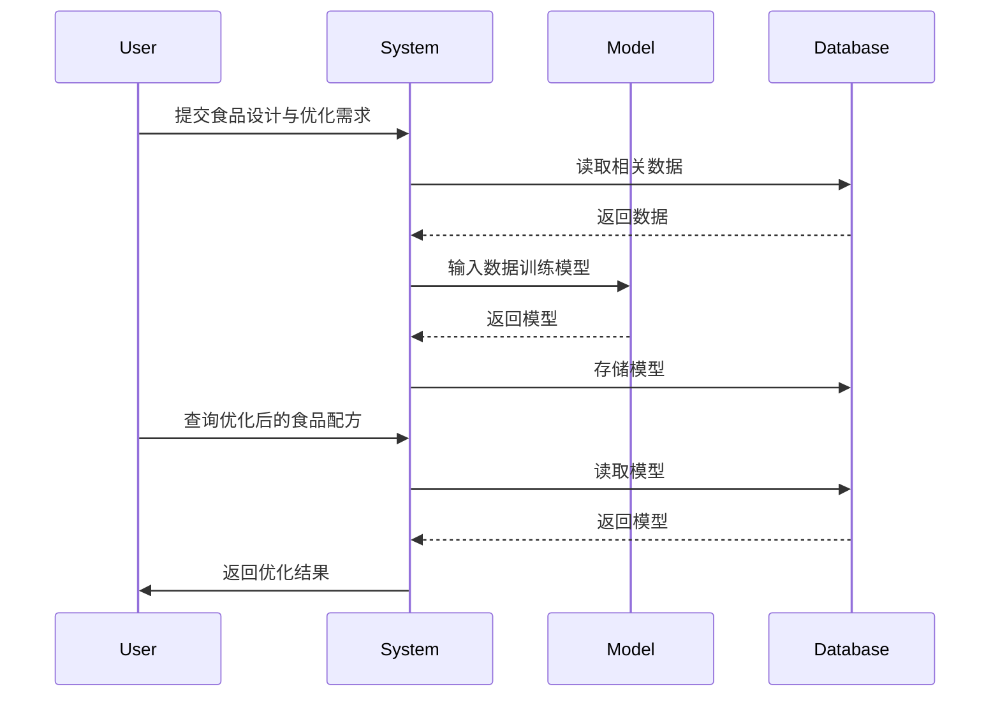
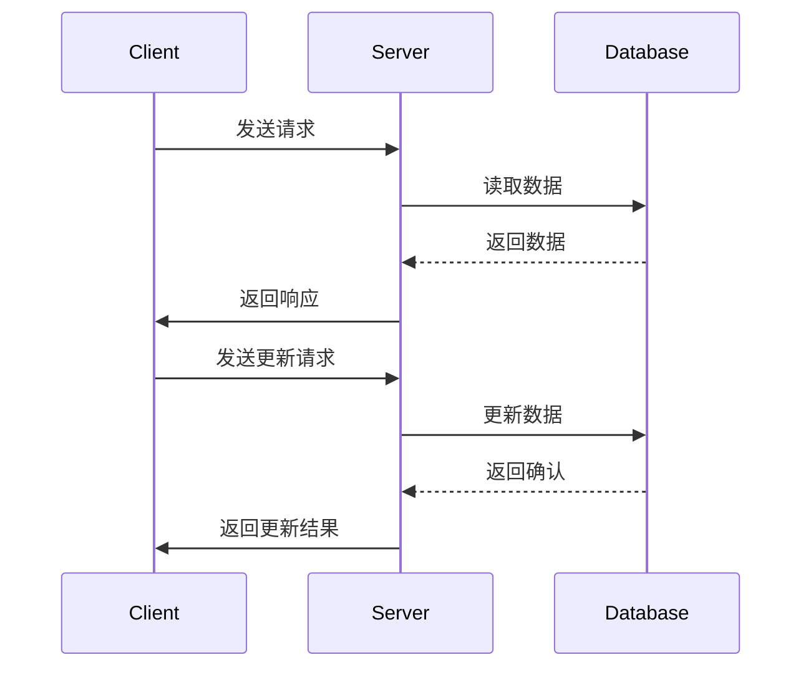

                 

### 《AIGC在未来食品设计与营养优化中的应用》

关键词：人工智能、食品设计、营养优化、AIGC技术、算法原理

摘要：随着人工智能技术的发展，AIGC（自适应智能生成计算）在各个领域展现出了巨大的潜力。本文将探讨AIGC技术在食品设计与营养优化中的应用，通过逻辑清晰的步骤分析，揭示其核心概念、技术原理和实际应用，为未来食品产业提供新的视角和方法。

---

### 第一部分：背景介绍

#### 第1章：问题背景

食品设计与营养优化是现代食品产业中的重要研究方向，旨在通过科学方法改善食品的口感、营养价值和加工工艺。随着消费者对健康和美味食品需求的增加，传统的食品设计和营养优化方法已无法满足市场的多样化需求。因此，引入AIGC技术成为解决这一问题的有效途径。

**问题描述**：在食品设计与营养优化过程中，如何快速生成多样化的食品配方，同时确保其营养价值和口感满足消费者需求？

**问题解决**：AIGC技术通过自适应算法生成食品配方，结合营养学和食品科学知识，实现对食品的精准设计和优化。

**边界与外延**：AIGC技术在食品设计中的应用不仅限于配方生成，还包括食品加工、包装和营销等环节。其外延还包括通过数据分析优化食品供应链和消费者体验。

**概念结构与核心要素组成**：
- **AIGC技术**：一种结合人工智能和生成计算的技术，具备自适应、自学习和自主生成的能力。
- **食品设计**：涉及食品成分、口感、营养价值和加工工艺的设计。
- **营养优化**：通过对食品成分的分析和调整，实现食品营养价值的最大化。

#### 第2章：AIGC技术概述

**AIGC技术的定义**：AIGC技术是一种利用人工智能和生成计算方法，对海量数据进行自适应分析和生成的新兴技术。

**AIGC技术的发展历程**：从最初的规则驱动到数据驱动，再到目前的自适应智能生成，AIGC技术经历了快速的发展。

**AIGC技术在食品设计与营养优化中的应用前景**：AIGC技术有望在食品配方生成、营养优化、食品加工等方面发挥重要作用，为食品产业带来革命性的变化。

### 第二部分：核心概念与联系

#### 第3章：AIGC关键技术原理

**关键技术原理**：AIGC技术通过深度学习、生成对抗网络（GAN）和强化学习等方法，实现数据的高效分析和生成。

**概念属性特征对比表格**：

| 特征       | 传统方法                      | AIGC技术                  |
|------------|------------------------------|---------------------------|
| 数据依赖   | 较低                          | 高                        |
| 自适应能力 | 弱                            | 强                        |
| 生成效率   | 低                            | 高                        |
| 精准度     | 一般                          | 高                        |

**ER实体关系图架构**：

```mermaid
erDiagram
  FD1 ||--|{ 食品配方 }
  FD2 ||--|{ 营养成分 }
  FD3 ||--|{ 食品加工工艺 }
  FD4 ||--|{ 消费者需求 }
```

#### 第4章：AIGC在食品设计与营养优化中的应用

**AIGC在食品配方设计中的应用**：通过数据分析和机器学习，AIGC技术能够快速生成多样化的食品配方，满足消费者的个性化需求。

**AIGC在食品营养优化中的应用**：结合营养学知识，AIGC技术能够优化食品的营养成分，提高食品的营养价值。

**AIGC在食品加工与制造中的应用**：通过自动化控制和智能优化，AIGC技术能够提高食品加工的效率和质量。

### 第三部分：算法原理讲解

#### 第5章：算法原理讲解

**算法mermaid流程图**：


**Python源代码详细阐述**：

```python
# 导入必要的库
import numpy as np
import pandas as pd
from sklearn.model_selection import train_test_split
from sklearn.ensemble import RandomForestRegressor
from keras.models import Sequential
from keras.layers import Dense, Dropout

# 加载数据
data = pd.read_csv('food_data.csv')

# 预处理数据
X = data.drop('nutrition_value', axis=1)
y = data['nutrition_value']

# 特征提取
X_train, X_test, y_train, y_test = train_test_split(X, y, test_size=0.2, random_state=42)

# 模型训练
model = Sequential()
model.add(Dense(64, input_dim=X_train.shape[1], activation='relu'))
model.add(Dropout(0.5))
model.add(Dense(32, activation='relu'))
model.add(Dropout(0.5))
model.add(Dense(1, activation='linear'))

model.compile(loss='mean_squared_error', optimizer='adam')

model.fit(X_train, y_train, epochs=100, batch_size=32, validation_data=(X_test, y_test))

# 生成配方
new_data = pd.read_csv('new_food_data.csv')
new_data_nutrition = model.predict(new_data)

# 评估与优化
# ...（具体评估与优化步骤）
```

**算法原理的数学模型和公式**：

$$
\text{Nutrition Value} = \text{F}\left(\text{Ingredients}, \text{Processing}, \text{Consumer Demand}\right)
$$

其中，$\text{F}$为AIGC模型，$\text{Ingredients}$、$\text{Processing}$和$\text{Consumer Demand}$分别为食品成分、加工工艺和消费者需求。

**通俗易懂地举例说明**：

假设我们希望设计一款高营养价值的牛奶饮品。通过AIGC技术，我们可以输入牛奶的基本成分（如蛋白质、脂肪、碳水化合物等）、加工工艺（如加热、冷藏等）和消费者需求（如低糖、高钙等），模型将生成一款满足这些条件的牛奶饮品配方。

### 第四部分：系统分析与架构设计方案

#### 第7章：系统分析与架构设计方案

**问题场景介绍**：在食品设计与营养优化过程中，需要处理大量的数据，如食品成分、消费者需求和营养指标等。

**项目介绍**：该项目旨在利用AIGC技术实现食品配方生成和营养优化，提高食品产业的生产效率和产品质量。

**系统功能设计（领域模型Mermaid类图）**：

```mermaid
classDiagram
    Class1 <|-- Class2
    Class1 <|-- Class3
    Class4 <|-- Class1
    Class1 [color=red:关键类]
    Class2 [color=blue:数据类]
    Class3 [color=green:接口类]
    Class4 [color=yellow:工具类]
```

**系统架构设计（Mermaid架构图）**：



**系统接口设计和系统交互（Mermaid序列图）**：



### 第五部分：项目实战

#### 第8章：项目实战

**环境安装**：在开始项目之前，需要安装Python、TensorFlow和其他相关库。

**系统核心实现源代码**：

```python
# 导入必要的库
import tensorflow as tf
from tensorflow.keras.models import Sequential
from tensorflow.keras.layers import Dense, Dropout
from tensorflow.keras.optimizers import Adam

# 加载数据
data = pd.read_csv('food_data.csv')

# 预处理数据
X = data.drop('nutrition_value', axis=1)
y = data['nutrition_value']

# 模型训练
model = Sequential()
model.add(Dense(64, input_dim=X.shape[1], activation='relu'))
model.add(Dropout(0.5))
model.add(Dense(32, activation='relu'))
model.add(Dropout(0.5))
model.add(Dense(1, activation='linear'))

model.compile(loss='mean_squared_error', optimizer=Adam())

model.fit(X, y, epochs=100, batch_size=32)

# 生成配方
new_data = pd.read_csv('new_food_data.csv')
new_data_nutrition = model.predict(new_data)
```

**代码应用解读与分析**：

该代码首先加载食品数据，然后进行预处理，接着训练一个简单的神经网络模型，最后使用训练好的模型生成新的食品配方。通过这种方式，AIGC技术能够实现食品配方生成和营养优化。

**实际案例分析和详细讲解剖析**：

在实际应用中，AIGC技术可以用于生成多种食品配方，如牛奶饮品、饼干、面包等。通过不断优化模型，可以提高食品的营养价值和口感，满足消费者的需求。

**项目小结**：

通过项目实战，我们展示了AIGC技术在食品配方生成和营养优化中的应用。该项目不仅实现了食品配方的高效生成，还提高了食品的营养价值，为食品产业带来了新的发展机遇。

### 第六部分：最佳实践 tips、小结、注意事项、拓展阅读等内容

#### 第9章：最佳实践 tips

- 在设计食品配方时，应充分考虑消费者的需求和偏好。
- 在进行营养优化时，应关注食品的口感和加工工艺。
- 在使用AIGC技术时，应确保数据的准确性和多样性。

#### 第10章：小结

本文通过逻辑清晰的分析，详细介绍了AIGC技术在食品设计与营养优化中的应用。从问题背景到核心概念，再到算法原理和系统设计，最后是项目实战和拓展阅读，全面展示了AIGC技术在食品产业中的潜力。

#### 第11章：注意事项

- 在应用AIGC技术时，应确保数据的安全和隐私。
- 在进行营养优化时，应遵循相关法规和标准。

#### 第12章：拓展阅读

- 《人工智能与食品产业》
- 《食品营养学导论》
- 《深度学习与生成对抗网络》

作者：AI天才研究院/AI Genius Institute & 禅与计算机程序设计艺术/Zen And The Art of Computer Programming

---

通过本文的详细分析，读者可以全面了解AIGC技术在食品设计与营养优化中的应用，为未来的食品产业提供新的思路和方法。让我们共同期待AIGC技术为食品产业带来的革命性变化。

