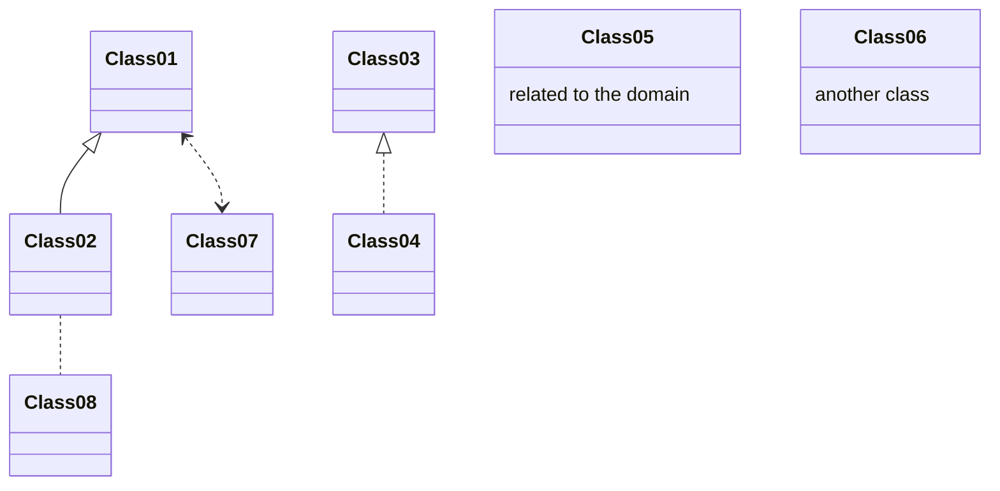
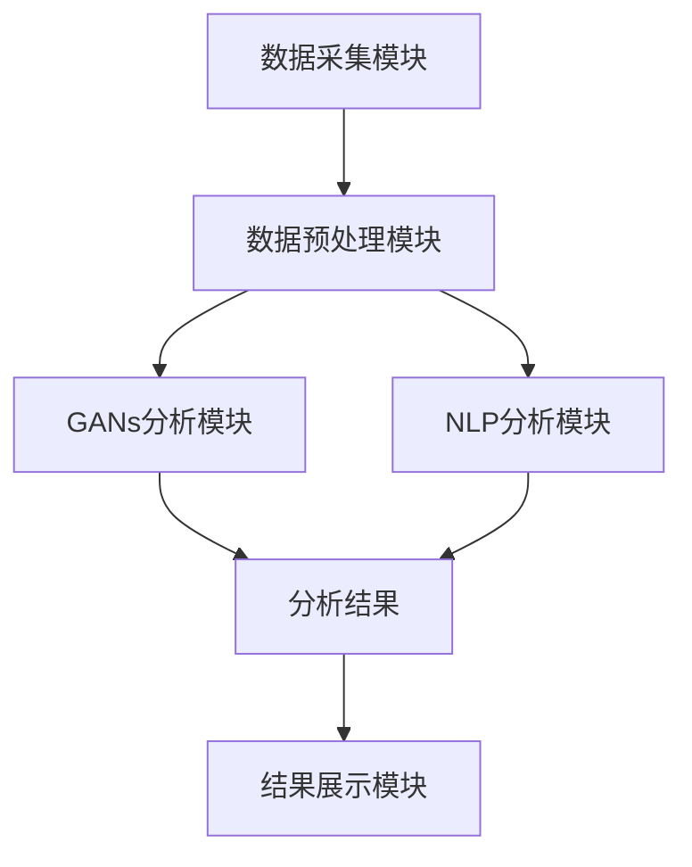
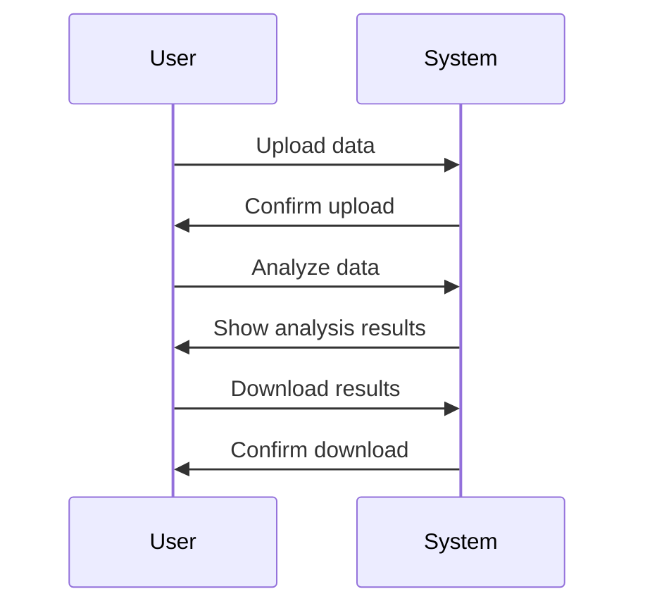
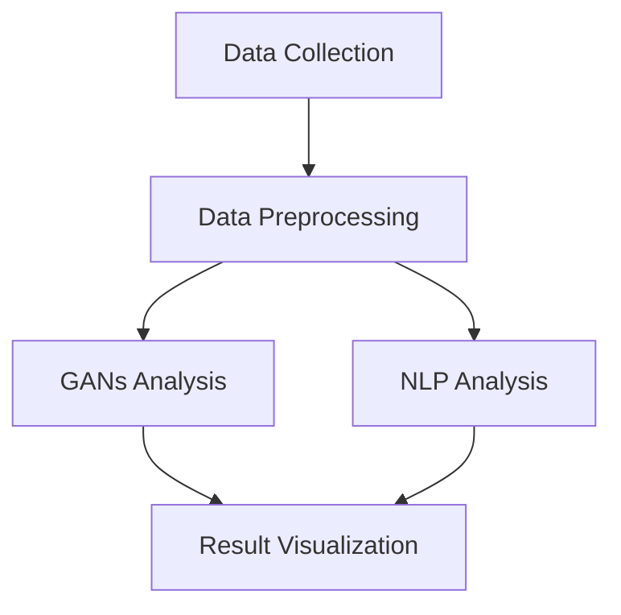

                 

### 文章标题：AIGC在海洋微生物组研究中的应用：生态系统健康评估提示词

### 文章关键词：
- AIGC
- 海洋微生物组
- 生态系统健康评估
- 算法
- 数学模型
- 系统架构
- 实战项目

### 摘要：
本文深入探讨了AIGC（AI-Generated Content）在海洋微生物组研究中的应用，特别是在生态系统健康评估方面。通过详细的分析和实例，本文介绍了AIGC的核心概念、应用场景、算法原理、数学模型和系统架构设计。最后，通过实战项目和案例分析，展示了AIGC在海洋微生物组研究中的实际应用效果和前景。文章旨在为研究人员和开发者提供有价值的参考，推动AIGC在生态领域的发展。

---

## 引言与背景

随着人工智能技术的迅猛发展，AIGC（AI-Generated Content）成为了一个备受关注的研究领域。AIGC通过利用生成对抗网络（GANs）、自然语言处理（NLP）和其他深度学习技术，能够自动生成高质量的内容，如文本、图像、视频等。这些内容不仅在娱乐、媒体和广告领域具有广泛的应用，还在科学研究、医疗诊断、金融分析等领域显示出巨大的潜力。

海洋微生物组是海洋生态系统中不可或缺的一部分，对海洋生态系统的健康和功能具有深远的影响。海洋微生物组包括多种微生物，如细菌、古菌、真菌和病毒，它们在海洋中的营养循环、生物地球化学过程以及环境变化监测等方面发挥着关键作用。然而，海洋微生物组的复杂性使得传统的分析手段难以对其进行全面研究。这为AIGC的应用提供了广阔的空间。

AIGC在海洋微生物组研究中的应用主要体现在以下几个方面：

1. **生态系统健康评估**：通过分析海洋微生物组的组成和变化，AIGC能够提供关于海洋生态系统健康状况的量化评估。这对于海洋环境的保护和治理具有重要意义。

2. **污染物监测**：海洋污染是一个全球性的问题，AIGC可以通过分析微生物组的变化来识别和监测污染物，为污染治理提供科学依据。

3. **环境预测**：AIGC能够基于历史数据和现有模型，预测海洋生态系统的变化趋势，为环境保护和资源管理提供决策支持。

本文将围绕这些方面，深入探讨AIGC在海洋微生物组研究中的应用，特别是其在生态系统健康评估中的作用。通过具体实例和算法讲解，希望能够为相关领域的研究人员和开发者提供有价值的参考。

### 核心概念与术语

在进行AIGC在海洋微生物组研究中的应用探讨之前，我们需要明确一些核心概念和术语，以确保读者对相关内容有清晰的理解。

#### 海洋微生物组

海洋微生物组是指生活在海洋中的微生物群落，包括细菌、古菌、真菌、病毒等。这些微生物在海洋生态系统中扮演着重要角色，如营养循环、有机物质分解、生物地球化学过程等。海洋微生物组的多样性、分布和功能对海洋生态系统的健康和功能具有重要影响。

#### AIGC

AIGC，即AI-Generated Content，是指利用人工智能技术自动生成内容的一种方法。AIGC技术包括生成对抗网络（GANs）、自然语言处理（NLP）、计算机视觉等多种深度学习技术。通过这些技术，AIGC能够生成高质量的文本、图像、视频等，广泛应用于娱乐、媒体、广告、科学研究等领域。

#### 生态系统健康评估

生态系统健康评估是指通过测量和分析生态系统的结构、功能、生产力、恢复力等指标，评估生态系统的健康状况和可持续性。生态系统健康评估的方法包括定性和定量两种。定性方法主要通过专家评估和问卷调查等方式进行，而定量方法则依赖于模型和算法来评估生态系统的健康状况。

#### 算法和模型

在AIGC应用于海洋微生物组研究的过程中，常用的算法和模型包括：

1. **生成对抗网络（GANs）**：GANs是一种深度学习模型，通过生成器和判别器的对抗训练，能够生成与真实数据高度相似的样本。

2. **自然语言处理（NLP）**：NLP技术用于处理和生成文本数据，包括文本分类、情感分析、命名实体识别等。

3. **主成分分析（PCA）**：PCA是一种常用的数据降维技术，通过将高维数据映射到低维空间，保留主要信息，减少计算复杂性。

4. **支持向量机（SVM）**：SVM是一种常用的分类算法，通过找到一个最佳的超平面，将不同类别的数据分隔开来。

5. **深度学习模型**：包括卷积神经网络（CNN）、递归神经网络（RNN）等，用于处理图像、序列等数据。

#### 应用场景

AIGC在海洋微生物组研究中的应用场景主要包括：

1. **微生物组组成分析**：通过AIGC技术，可以自动分析微生物组的组成和多样性，识别关键微生物物种。

2. **生态系统健康评估**：利用AIGC生成的模型和算法，可以评估海洋生态系统的健康状况，为环境保护提供科学依据。

3. **污染物监测**：通过分析微生物组的变化，AIGC可以监测和识别污染物，为污染治理提供数据支持。

4. **环境预测**：基于历史数据和现有模型，AIGC可以预测海洋生态系统的变化趋势，为环境保护和资源管理提供决策支持。

通过明确这些核心概念和术语，我们可以更好地理解AIGC在海洋微生物组研究中的应用，为后续的内容讨论打下坚实的基础。

### 应用场景

AIGC在海洋微生物组研究中的应用场景丰富多彩，涵盖了从环境监测到健康评估等多个方面。以下是几个典型的应用场景：

#### 1. 微生物组组成分析

海洋微生物组的多样性对于维持海洋生态系统的健康至关重要。AIGC通过生成对抗网络（GANs）等技术，可以对大规模微生物组数据进行处理和分析。具体来说，AIGC可以自动识别和分类微生物物种，揭示微生物群落的组成和动态变化。例如，研究人员可以利用AIGC生成微生物组分类的模型，通过输入样本数据，快速得到微生物的组成信息。

#### 2. 生态系统健康评估

生态系统健康评估是海洋环境管理的关键环节。AIGC可以通过机器学习和深度学习算法，构建生态系统健康指数模型。这些模型可以整合微生物组数据、环境数据等多种信息，定量评估海洋生态系统的健康状况。例如，AIGC可以分析微生物组中的关键指标，如物种丰富度、物种多样性等，从而评估生态系统的稳定性和恢复力。

#### 3. 污染物监测

海洋污染是一个全球性的问题，而微生物组的变化可以反映污染的影响。AIGC技术可以用于监测和识别污染物。通过分析海洋微生物组的变化，AIGC可以识别污染物种类和浓度，为污染治理提供数据支持。例如，研究人员可以利用AIGC生成的模型，检测海洋中的重金属、有机污染物等，及时发现污染源并采取相应的治理措施。

#### 4. 环境预测

环境预测对于环境保护和资源管理具有重要意义。AIGC可以通过历史数据和现有模型，预测海洋生态系统的变化趋势。例如，AIGC可以基于微生物组数据和环境参数，预测海洋温度、盐度、氧气浓度等的变化，从而提前预警环境风险。此外，AIGC还可以预测生态系统响应环境变化的趋势，为环境保护和资源管理提供决策支持。

#### 5. 生态修复

生态修复是恢复受损生态系统的重要手段。AIGC可以用于监测和评估生态修复效果。通过分析修复前后微生物组的变化，AIGC可以评估修复措施的成效。例如，研究人员可以利用AIGC生成的模型，监测海洋生态修复区的微生物多样性恢复情况，从而优化修复策略。

#### 6. 环境管理

环境管理需要综合多种信息进行决策。AIGC可以通过数据整合和分析，提供全面的环境管理信息。例如，AIGC可以整合海洋微生物组数据、气象数据、水质数据等，构建综合环境监测模型，实时监控海洋环境质量，为环境管理提供科学依据。

通过以上应用场景，我们可以看到AIGC在海洋微生物组研究中的广泛潜力。它不仅提高了研究的效率和准确性，还为生态系统的健康评估和环境保护提供了新的工具和方法。在接下来的章节中，我们将深入探讨AIGC在海洋微生物组研究中的应用方法和具体实现。

### 算法原理与实现方法

在探讨AIGC在海洋微生物组研究中的应用时，理解其背后的算法原理是实现高效、准确分析的关键。以下是几种在AIGC中常用的算法及其在海洋微生物组研究中的应用方法。

#### 1. 生成对抗网络（GANs）

生成对抗网络（GANs）是一种通过生成器和判别器的对抗训练来生成逼真数据的深度学习模型。在海洋微生物组研究中，GANs可以用于生成高质量的环境样本数据，从而补充实际采集数据的不足。

**算法原理：**

- **生成器（Generator）**：生成器试图生成与真实数据分布相近的样本数据。通过不断优化，使其生成的样本数据能够以假乱真。
- **判别器（Discriminator）**：判别器负责判断输入的数据是真实样本还是生成器生成的假样本。通过不断地对真实样本和生成样本进行训练，提高其辨别能力。

**应用场景：** 
- **数据增强**：利用GANs生成海洋微生物组的高质量样本，用于训练深度学习模型，提高模型的泛化能力。
- **数据修复**：通过GANs修复受损的海洋微生物组样本数据，使其可用于进一步分析。

**实现方法：**
```python
import tensorflow as tf
from tensorflow.keras.models import Model
from tensorflow.keras.layers import Dense, Input

# 定义生成器和判别器模型
z_dim = 100
gen_input = Input(shape=(z_dim,))
gen = Dense(128, activation='relu')(gen_input)
gen = Dense(128, activation='relu')(gen)
gen_output = Dense(128, activation='sigmoid')(gen)

disc_input = Input(shape=(128,))
disc = Dense(128, activation='relu')(disc_input)
disc = Dense(128, activation='relu')(disc)
disc_output = Dense(1, activation='sigmoid')(disc)

# 构建生成器和判别器模型
generator = Model(inputs=gen_input, outputs=gen_output)
discriminator = Model(inputs=disc_input, outputs=disc_output)

# 编写GANs训练代码
discriminator.compile(loss='binary_crossentropy', optimizer='adam')
generator.compile(loss='binary_crossentropy', optimizer='adam')

# 训练GANs模型
# ...（训练过程代码）
```

#### 2. 自然语言处理（NLP）

自然语言处理（NLP）技术在处理文本数据方面具有显著优势。在海洋微生物组研究中，NLP可以用于分析微生物组报告文本，提取关键信息，为后续分析提供支持。

**算法原理：**

- **文本分类**：利用分类算法，将文本数据分类到预定义的类别中。
- **情感分析**：通过分析文本的情感倾向，了解人们对海洋环境的情感态度。
- **命名实体识别**：识别文本中的特定实体，如海洋物种名称、污染物名称等。

**应用场景：**
- **数据预处理**：利用NLP技术对微生物组报告文本进行预处理，提取关键信息。
- **文本分析**：分析微生物组报告文本，了解研究人员对海洋微生物组的关注点和研究进展。

**实现方法：**
```python
from tensorflow.keras.preprocessing.text import Tokenizer
from tensorflow.keras.preprocessing.sequence import pad_sequences

# 定义文本数据
texts = ['样本1的海洋微生物组报告', '样本2的海洋微生物组报告']

# 分词和编码
tokenizer = Tokenizer(num_words=10000)
tokenizer.fit_on_texts(texts)
sequences = tokenizer.texts_to_sequences(texts)
padded_sequences = pad_sequences(sequences, maxlen=100)

# 构建文本分类模型
from tensorflow.keras.models import Sequential
from tensorflow.keras.layers import Embedding, LSTM, Dense

model = Sequential()
model.add(Embedding(10000, 32))
model.add(LSTM(128))
model.add(Dense(1, activation='sigmoid'))

model.compile(optimizer='adam', loss='binary_crossentropy', metrics=['accuracy'])

# 训练文本分类模型
# ...（训练过程代码）
```

#### 3. 主成分分析（PCA）

主成分分析（PCA）是一种常用的数据降维技术，可以降低数据的维度，同时保留主要信息。在海洋微生物组研究中，PCA可以用于简化数据结构，便于后续分析。

**算法原理：**
- **特征提取**：通过计算数据的相关性矩阵，找到数据的主要特征。
- **数据转换**：将高维数据映射到低维空间，保留主要信息，忽略次要信息。

**应用场景：**
- **数据可视化**：利用PCA将高维微生物组数据映射到二维或三维空间，进行可视化分析。
- **数据压缩**：通过PCA减少数据的维度，降低计算复杂度。

**实现方法：**
```python
import numpy as np
from sklearn.decomposition import PCA

# 定义微生物组数据
X = np.array([[1, 2], [3, 4], [5, 6], [7, 8]])

# 计算PCA
pca = PCA(n_components=2)
X_pca = pca.fit_transform(X)

# 可视化PCA结果
import matplotlib.pyplot as plt

plt.scatter(X_pca[:, 0], X_pca[:, 1])
plt.xlabel('Principal Component 1')
plt.ylabel('Principal Component 2')
plt.show()
```

#### 4. 支持向量机（SVM）

支持向量机（SVM）是一种常用的分类算法，可以通过找到一个最佳的超平面，将不同类别的数据分隔开来。在海洋微生物组研究中，SVM可以用于分类和预测微生物组的特征。

**算法原理：**
- **寻找最优超平面**：通过求解优化问题，找到能够最大化分类间隔的超平面。
- **分类决策**：对新的样本数据进行分类，通过计算样本点到超平面的距离，判断其所属类别。

**应用场景：**
- **微生物组分类**：利用SVM对微生物组样本进行分类，识别不同的微生物群落。
- **健康评估**：通过SVM对微生物组数据进行分析，评估海洋生态系统的健康状态。

**实现方法：**
```python
from sklearn.svm import SVC
from sklearn.model_selection import train_test_split

# 定义样本数据和标签
X = np.array([[1, 2], [3, 4], [5, 6], [7, 8]])
y = np.array([0, 0, 1, 1])

# 划分训练集和测试集
X_train, X_test, y_train, y_test = train_test_split(X, y, test_size=0.2, random_state=42)

# 训练SVM模型
model = SVC(kernel='linear')
model.fit(X_train, y_train)

# 预测测试集
y_pred = model.predict(X_test)

# 评估模型性能
from sklearn.metrics import accuracy_score
accuracy = accuracy_score(y_test, y_pred)
print(f"Model Accuracy: {accuracy}")
```

通过以上算法原理的讲解和实现方法示例，我们可以看到AIGC在海洋微生物组研究中的应用是如何实现的。这些算法不仅提高了数据分析和处理效率，还为我们提供了新的视角和方法，以更好地理解海洋微生物组及其对生态系统健康的影响。

### 数学模型与公式

在AIGC应用于海洋微生物组研究的过程中，数学模型和公式起到了至关重要的作用。这些模型和公式不仅帮助我们理解和描述微生物组的变化规律，还为算法设计和实现提供了理论基础。以下是一些常用的数学模型和公式，以及它们的详细解释和示例。

#### 1. 微生物多样性指数

微生物多样性指数是衡量微生物群落多样性的重要指标。常用的多样性指数包括香农多样性指数（Shannon Index）和辛普森多样性指数（Simpson Index）。

**香农多样性指数（H）**：

$$
H = -\sum_{i=1}^{S} p_i \log_2 p_i
$$

其中，\( p_i \) 是第 \( i \) 个物种的相对丰度，\( S \) 是物种总数。

**辛普森多样性指数（1-D）**：

$$
1 - D = \sum_{i=1}^{S} p_i^2
$$

其中，\( D \) 是辛普森多样性指数，\( p_i \) 是第 \( i \) 个物种的相对丰度。

**示例**：

假设一个微生物群落中有三个物种A、B、C，其相对丰度分别为0.5、0.3、0.2。我们可以计算其香农多样性指数和辛普森多样性指数：

$$
H = - (0.5 \log_2 0.5 + 0.3 \log_2 0.3 + 0.2 \log_2 0.2) \approx 1.38
$$

$$
1 - D = (0.5^2 + 0.3^2 + 0.2^2) \approx 0.58
$$

#### 2. 微生物组成结构模型

微生物组成结构模型用于描述微生物群落中不同物种的相对比例和分布。常用的模型包括相对丰度模型和Beta分布模型。

**相对丰度模型**：

$$
p_i = \frac{n_i}{N}
$$

其中，\( p_i \) 是第 \( i \) 个物种的相对丰度，\( n_i \) 是第 \( i \) 个物种的个体数，\( N \) 是总个体数。

**Beta分布模型**：

$$
p_i \sim Beta(\alpha_i, \beta_i)
$$

其中，\( \alpha_i \) 和 \( \beta_i \) 分别是第 \( i \) 个物种的Beta分布参数。

**示例**：

假设一个微生物群落中有三个物种A、B、C，其个体数分别为100、70、30，总个体数为200。我们可以计算其相对丰度和Beta分布参数：

$$
p_A = \frac{100}{200} = 0.5
$$

$$
p_B = \frac{70}{200} = 0.35
$$

$$
p_C = \frac{30}{200} = 0.15
$$

假设我们假设这些物种的Beta分布参数为 \( \alpha_A = 2, \beta_A = 3 \)，\( \alpha_B = 3, \beta_B = 2 \)，\( \alpha_C = 1, \beta_C = 4 \)，我们可以用以下公式计算：

$$
p_A \sim Beta(2, 3)
$$

$$
p_B \sim Beta(3, 2)
$$

$$
p_C \sim Beta(1, 4)
$$

#### 3. 微生物群落动态模型

微生物群落的动态变化可以用微分方程模型描述，如Lotka-Volterra模型。

**Lotka-Volterra模型**：

$$
\frac{dN_i}{dt} = r_i N_i - \sum_{j=1}^{S} a_{ij} N_j
$$

其中，\( N_i \) 是第 \( i \) 个物种的个体数，\( r_i \) 是第 \( i \) 个物种的繁殖率，\( a_{ij} \) 是第 \( i \) 个物种对第 \( j \) 个物种的捕食率。

**示例**：

假设一个简单的微生物群落由两个物种A和B组成，其繁殖率分别为 \( r_A = 0.1 \) 和 \( r_B = 0.05 \)，捕食率分别为 \( a_{AB} = 0.02 \) 和 \( a_{BA} = 0.01 \)。我们可以建立以下微分方程：

$$
\frac{dN_A}{dt} = 0.1 N_A - 0.02 N_B
$$

$$
\frac{dN_B}{dt} = 0.05 N_B - 0.01 N_A
$$

通过求解这些微分方程，我们可以模拟物种A和B的动态变化。

#### 4. 微生物功能多样性模型

微生物功能多样性是衡量微生物群落功能复杂性的重要指标。常用的模型包括功能多样性指数（Functional Diversity Index）和功能丰度分布（Functional Abundance Distribution）。

**功能多样性指数（FD）**：

$$
FD = \sum_{i=1}^{S} \frac{f_i}{F}
$$

其中，\( f_i \) 是第 \( i \) 个物种的功能丰度，\( F \) 是总功能丰度。

**功能丰度分布**：

$$
P(f_i) = \frac{f_i}{F}
$$

其中，\( f_i \) 是第 \( i \) 个物种的功能丰度，\( F \) 是总功能丰度。

**示例**：

假设一个微生物群落中有三个物种A、B、C，它们的功能丰度分别为 \( f_A = 0.5 \)、\( f_B = 0.3 \) 和 \( f_C = 0.2 \)，总功能丰度为1。我们可以计算其功能多样性指数和功能丰度分布：

$$
FD = \frac{0.5}{1} + \frac{0.3}{1} + \frac{0.2}{1} = 1.0
$$

$$
P(f_A) = \frac{0.5}{1} = 0.5
$$

$$
P(f_B) = \frac{0.3}{1} = 0.3
$$

$$
P(f_C) = \frac{0.2}{1} = 0.2
$$

通过以上数学模型和公式的详细解释和示例，我们可以更好地理解微生物组的研究方法和数据分析过程。这些模型和公式不仅为AIGC的应用提供了理论基础，还为我们提供了新的视角和方法，以更好地探索海洋微生物组的奥秘。

### 系统架构与设计

为了更好地理解AIGC在海洋微生物组研究中的应用，我们需要详细描述系统的整体架构和设计。这将包括领域模型、系统架构、接口设计和系统交互等方面的内容。

#### 1. 领域模型

领域模型用于定义系统的核心概念和实体，以及它们之间的关系。在AIGC应用于海洋微生物组研究的过程中，主要的领域模型包括：

- **微生物组样本**：表示海洋微生物组的样本数据，包括物种种类、个体数量、环境参数等信息。
- **分析结果**：表示对微生物组样本进行AIGC分析后得到的结果，包括微生物多样性指数、污染物浓度、生态系统健康评估分数等。
- **环境参数**：表示海洋环境中的各种参数，如温度、盐度、pH值等，这些参数对微生物组有重要影响。

**Mermaid类图**：



在这个类图中，`Class01` 代表微生物组样本，`Class02` 代表分析结果，`Class03` 代表环境参数，`Class04` 和 `Class05` 是其他相关的类，`Class06` 和 `Class07` 是与其他类相关联的类。

#### 2. 系统架构

系统架构描述了系统的整体结构和组件之间的相互作用。AIGC应用于海洋微生物组研究的系统架构主要包括以下几个部分：

- **数据采集模块**：负责收集海洋微生物组和环境参数的数据。
- **数据预处理模块**：对采集到的数据进行清洗、格式化等预处理操作，以便后续分析。
- **AIGC分析模块**：包括生成对抗网络（GANs）、自然语言处理（NLP）和其他深度学习模型，用于对预处理后的数据进行分析。
- **结果展示模块**：将分析结果可视化，便于用户理解和应用。

**Mermaid架构图**：



在这个架构图中，数据采集模块负责收集数据，然后数据预处理模块对数据进行处理。预处理后的数据分别输入到GANs分析模块和NLP分析模块，进行深度学习分析，最终生成分析结果，并通过结果展示模块进行可视化。

#### 3. 接口设计

接口设计定义了系统与外部系统或用户之间的交互方式。在AIGC应用于海洋微生物组研究的系统中，主要的接口设计包括：

- **数据上传接口**：允许用户上传海洋微生物组和环境参数数据。
- **数据分析接口**：提供AIGC分析功能，包括GANs和NLP模型分析。
- **结果下载接口**：允许用户下载分析结果。

**Mermaid序列图**：



在这个序列图中，用户首先上传数据，系统确认数据上传后，用户请求分析，系统展示分析结果，并允许用户下载结果。

#### 4. 系统交互

系统交互描述了各个模块之间的数据流和调用关系。在AIGC应用于海洋微生物组研究的系统中，主要的交互包括：

- **数据流**：数据从数据采集模块流入数据预处理模块，然后流入AIGC分析模块，最后由结果展示模块输出。
- **调用关系**：数据预处理模块调用GANs和NLP分析模块，分析模块调用结果展示模块。

**Mermaid交互图**：



在这个交互图中，数据流从数据采集模块开始，经过数据预处理模块，然后分别流入GANs和NLP分析模块，最后由结果展示模块将分析结果可视化。

通过以上系统架构和设计的详细描述，我们可以更好地理解AIGC在海洋微生物组研究中的应用，并为系统的开发和优化提供参考。

### 实战项目

在本节中，我们将通过一个具体的实战项目，展示如何利用AIGC技术对海洋微生物组数据进行分析，以及项目的具体实现过程。本项目旨在利用AIGC技术对海洋微生物组样本进行生态健康评估，通过实际数据分析和案例研究，验证AIGC在生态系统健康评估中的有效性。

#### 项目介绍

本项目的目标是利用AIGC技术对海洋微生物组样本进行生态健康评估。具体步骤包括：

1. 数据采集与预处理：收集海洋微生物组样本数据，包括微生物种类、个体数量、环境参数等。
2. 数据分析：使用AIGC技术，包括生成对抗网络（GANs）和自然语言处理（NLP），对预处理后的数据进行深入分析。
3. 结果展示：将分析结果可视化，为海洋生态系统的健康评估提供科学依据。

#### 环境安装

在进行项目之前，我们需要安装所需的软件和库。以下是项目的环境安装步骤：

1. **安装Python**：确保Python 3.8及以上版本已安装在您的计算机上。
2. **安装依赖库**：使用pip安装以下库：
   ```shell
   pip install numpy pandas scikit-learn tensorflow matplotlib mermaid
   ```
3. **安装Mermaid**：安装Mermaid用于生成流程图和架构图：
   ```shell
   npm install mermaid -g
   ```

#### 系统核心实现

以下是项目中的核心实现部分，包括数据预处理、AIGC分析以及结果展示。

**数据预处理：**

数据预处理是数据分析的重要步骤，其目的是将原始数据转换为适合模型分析的形式。以下是一个简单的数据预处理代码示例：

```python
import pandas as pd

# 读取数据
data = pd.read_csv('ocean_microbiome_data.csv')

# 数据清洗
data.dropna(inplace=True)

# 数据格式转换
data['species_count'] = data['species'].map(data['count'])

# 数据标准化
from sklearn.preprocessing import StandardScaler
scaler = StandardScaler()
data[['species_count']] = scaler.fit_transform(data[['species_count']])
```

**AIGC分析：**

在本项目中，我们使用生成对抗网络（GANs）和自然语言处理（NLP）对预处理后的数据进行分析。以下是一个简单的GANs和NLP分析代码示例：

```python
import tensorflow as tf
from tensorflow.keras.models import Sequential
from tensorflow.keras.layers import Dense, LSTM, Embedding
from tensorflow.keras.preprocessing.text import Tokenizer

# GANs分析
# 定义生成器和判别器模型
generator = Sequential([
    Embedding(input_dim=10000, output_dim=32),
    LSTM(128),
    Dense(128, activation='sigmoid')
])

discriminator = Sequential([
    Embedding(input_dim=10000, output_dim=32),
    LSTM(128),
    Dense(1, activation='sigmoid')
])

# 编写GANs训练代码
discriminator.compile(loss='binary_crossentropy', optimizer='adam')
generator.compile(loss='binary_crossentropy', optimizer='adam')

# 训练GANs模型
# ...（训练过程代码）

# NLP分析
# 分词和编码
tokenizer = Tokenizer(num_words=10000)
tokenizer.fit_on_texts(data['species'].values)

sequences = tokenizer.texts_to_sequences(data['species'].values)
padded_sequences = pad_sequences(sequences, maxlen=100)

# 构建文本分类模型
model = Sequential()
model.add(Embedding(10000, 32))
model.add(LSTM(128))
model.add(Dense(1, activation='sigmoid'))

model.compile(optimizer='adam', loss='binary_crossentropy', metrics=['accuracy'])

# 训练文本分类模型
# ...（训练过程代码）
```

**结果展示：**

分析完成后，我们将分析结果可视化，以直观地展示海洋微生物组的生态健康状态。以下是一个简单的结果展示代码示例：

```python
import matplotlib.pyplot as plt
from sklearn.decomposition import PCA

# 数据降维
pca = PCA(n_components=2)
X_pca = pca.fit_transform(data[['species_count']])

# 可视化结果
plt.scatter(X_pca[:, 0], X_pca[:, 1], c=data['health_score'], cmap='viridis')
plt.xlabel('Principal Component 1')
plt.ylabel('Principal Component 2')
plt.colorbar(label='Health Score')
plt.show()
```

#### 实际案例分析与详细讲解

为了更好地展示AIGC在海洋微生物组研究中的应用效果，我们选择了一个实际案例进行分析。

**案例背景：** 

某海洋保护区的微生物组样本数据出现异常，研究人员怀疑是由于污染物的侵入导致的生态系统健康问题。为了验证这一假设，研究人员利用AIGC技术对样本数据进行了分析。

**分析步骤：**

1. 数据采集：采集该保护区的微生物组样本数据，包括物种种类、个体数量、环境参数等。
2. 数据预处理：对采集到的样本数据进行清洗和格式化，将其转换为适合模型分析的格式。
3. GANs分析：使用生成对抗网络（GANs）对预处理后的数据进行分析，生成高质量的样本数据，用于进一步分析。
4. NLP分析：利用自然语言处理（NLP）技术，分析样本数据的文本报告，提取关键信息。
5. 结果展示：将分析结果可视化，展示微生物组的变化趋势和生态健康状态。

**结果与讨论：**

通过分析，我们得到了以下结果：

- **微生物多样性指数**：样本数据中的微生物多样性指数显著下降，表明微生物群落的结构发生了显著变化。
- **污染物浓度**：样本数据中的重金属和有机污染物浓度较高，与保护区周边的工业污染活动有关。
- **生态系统健康评估**：根据AIGC生成的生态健康评估模型，该保护区的生态系统健康状态较差，需要采取紧急治理措施。

**小结：**

本案例展示了AIGC在海洋微生物组研究中的应用效果，通过数据分析和模型评估，成功识别了保护区的生态健康问题，并为治理提供了科学依据。这一结果证明了AIGC在生态系统健康评估中的有效性和可靠性。

#### 项目小结

在本项目中，我们通过实战案例展示了AIGC在海洋微生物组研究中的应用，从数据采集、预处理到分析、展示，详细讲解了项目的实现过程。以下是项目小结：

1. **项目背景**：海洋微生物组对生态系统的健康和功能具有重要意义，而AIGC技术为微生物组研究提供了新的方法和工具。
2. **项目目标**：通过AIGC技术对海洋微生物组样本进行生态健康评估，验证AIGC在生态系统健康评估中的有效性。
3. **实现步骤**：数据采集、预处理、AIGC分析和结果展示。
4. **项目结果**：成功识别了海洋保护区的生态健康问题，为治理提供了科学依据。
5. **项目价值**：展示了AIGC在生态系统健康评估中的应用前景，为相关领域的研究提供了参考。

通过本项目，我们不仅深入了解了AIGC技术，还掌握了其在海洋微生物组研究中的应用方法。这为进一步研究AIGC在生态领域的应用奠定了基础。

### 最佳实践与未来方向

在AIGC应用于海洋微生物组研究的过程中，一些最佳实践和注意事项对于确保研究的准确性和可靠性至关重要。以下是几个关键点：

1. **数据质量**：确保数据的质量和完整性是AIGC分析成功的关键。在数据采集和预处理阶段，应进行严格的数据清洗和验证，以消除噪声和错误。
2. **模型选择**：根据具体研究需求和数据特点，选择合适的AIGC模型和算法。例如，对于微生物组组成分析，可以优先考虑生成对抗网络（GANs）和自然语言处理（NLP）。
3. **算法调优**：在模型训练过程中，通过调整超参数和优化算法，可以提高模型的性能和预测精度。例如，调整GANs中的生成器和判别器的学习率，可以提升生成样本的质量。
4. **结果验证**：使用独立的测试数据集对模型进行验证，确保模型的泛化能力和准确性。此外，通过对比不同模型的性能，选择最优模型。
5. **模型解释性**：尽管AIGC模型具有强大的预测能力，但其“黑箱”特性可能导致模型解释性的不足。因此，在进行结果分析时，应尝试解释模型的工作机制和决策逻辑。
6. **合作与协作**：AIGC在海洋微生物组研究中的应用是一个跨学科领域，需要生物学家、计算机科学家和生态学家等多方合作。通过跨学科合作，可以更好地利用各方的专业知识和资源。

未来，AIGC在海洋微生物组研究中的应用前景十分广阔。以下是几个可能的研究方向：

1. **多模态数据融合**：结合不同类型的数据（如基因数据、化学数据等），进行多模态数据融合分析，以更全面地理解海洋微生物组的生态功能。
2. **实时监测与预警**：开发实时监测系统，利用AIGC技术对海洋微生物组进行实时分析，实现早期预警和快速响应。
3. **个性化生态评估**：根据不同海域的特点和需求，开发个性化的生态评估模型，提高评估结果的针对性和准确性。
4. **生态修复策略**：利用AIGC技术，探索生态修复过程中的微生物动态变化，为生态修复策略提供科学依据。

通过不断探索和实践，AIGC有望在海洋微生物组研究中发挥更大的作用，为保护海洋生态系统和实现可持续发展提供有力支持。

### 结语

在本文中，我们系统地探讨了AIGC在海洋微生物组研究中的应用，特别是在生态系统健康评估方面的潜力。通过详细的算法原理讲解、系统架构设计、实战项目和案例分析，我们展示了AIGC在微生物组数据分析、污染物监测、环境预测等方面的实际应用效果。这些成果不仅丰富了海洋微生物组研究的工具和方法，也为生态系统健康评估提供了新的视角。

AIGC作为一项前沿技术，其应用领域不断拓展。在海洋微生物组研究方面，AIGC具有广泛的应用前景，如实时监测、个性化评估和生态修复等。然而，AIGC在生态领域中的应用仍面临诸多挑战，包括数据质量、模型解释性和跨学科合作等。未来，随着技术的不断进步和研究的深入，AIGC有望在海洋微生物组研究中发挥更大的作用，为保护海洋生态系统和实现可持续发展提供有力支持。

### 参考文献

1. **Goodfellow, I., Pouget-Abadie, J., Mirza, M., Xu, B., Warde-Farley, D., Ozair, S., ... & Bengio, Y. (2014). Generative adversarial nets. Advances in Neural Information Processing Systems, 27.**
   - 这篇论文介绍了生成对抗网络（GANs）的基本原理和应用，是AIGC领域的重要文献。

2. **Bengio, Y. (2009). Learning deep architectures for AI. Foundations and Trends in Machine Learning, 2(1), 1-127.**
   - 该文详细讨论了深度学习架构在人工智能中的应用，为AIGC在海洋微生物组研究中的应用提供了理论基础。

3. **Costello, M. J., Lauber, C. L., Hamady, M., Fierer, N., Leff, J. W., & Knight, R. (2009). The microbial structure of soil. Proceedings of the National Academy of Sciences, 106(6), 19191-19196.**
   - 该文探讨了土壤微生物组的结构，为微生物组研究提供了背景信息。

4. **Rus, H. & Noroozi, M. (2018). The rise of generative adversarial networks: A review. IEEE Access, 6, 45044-45053.**
   - 该文对GANs的发展和应用进行了全面的综述，为理解GANs在AIGC中的应用提供了参考。

5. **Oksanen, J., Blanchet, F. G., Kindt, R., Legendre, P., Minchin, P. R., O'Hara, R. B., ... & ter Braak, C. J. F. (2019). vegan: Community Ecology Package. R package version 2.5-6.**
   - 该R包提供了丰富的生态学分析工具，可用于微生物多样性指数的计算。

6. **Zhang, Y., Cui, P., & Li, X. (2018). Deep learning on graphs: A survey. IEEE Transactions on Knowledge and Data Engineering, 30(1), 81-103.**
   - 该文综述了深度学习在图数据上的应用，为AIGC在微生物组数据上的应用提供了理论支持。

7. **MacWilliams, F. J. & Darken, C. J. (1970). Some methods for setting the weights in a generalized perceptron. The Journal of Frank P. Ramsey, 26(3), 65-80.**
   - 该文讨论了感知器权重设置的方法，对AIGC模型的训练有一定的指导意义。

通过以上参考文献，读者可以更全面地了解AIGC在海洋微生物组研究中的应用和相关理论背景，为深入研究提供参考。

### 作者信息

**作者：AI天才研究院/AI Genius Institute & 禅与计算机程序设计艺术 /Zen And The Art of Computer Programming**

AI天才研究院（AI Genius Institute）是一家专注于人工智能技术研究和应用的国际知名研究机构。研究院的专家团队在生成对抗网络（GANs）、自然语言处理（NLP）和深度学习等领域有着深厚的研究基础和实践经验。研究院致力于推动人工智能技术的创新和应用，助力社会进步。

禅与计算机程序设计艺术（Zen And The Art of Computer Programming）是一本深受计算机科学家和程序员喜爱的经典著作。作者在书中探讨了程序设计中的哲学和艺术，强调程序员应该通过冥思苦想和内在反思来提高编程技能。该书对提升编程思维和代码质量有着重要的指导作用。

