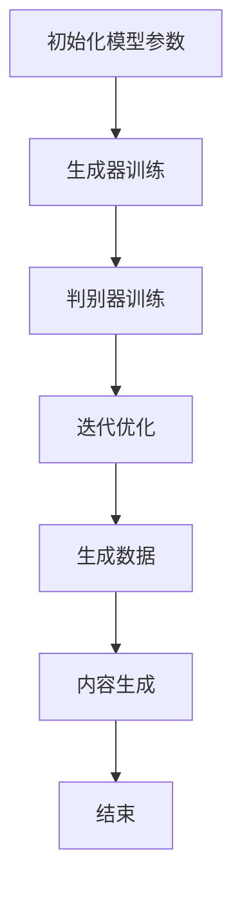

                 


## AIGC在海洋生态研究中的应用：水下数据分析提示词

### 文章关键词
- AIGC
- 海洋生态研究
- 水下数据分析
- 图像识别
- 环境监测

### 摘要
本文深入探讨了人工智能生成内容（AIGC）在海洋生态研究中的应用，特别是在水下数据分析领域的潜力。文章从背景介绍、核心概念、算法原理、数学模型、系统设计与实战案例等多个角度，详细解析了AIGC技术在海洋生态研究中的重要作用，以及其在水下图像识别和环境监测方面的实际应用。通过系统的分析和实例讲解，本文为读者提供了关于AIGC技术在水下数据分析中应用的全景视角，并为未来的研究方向提供了有益的启示。

### 1. 海洋生态研究背景

#### 1.1 海洋生态系统的基本概念

海洋生态系统是地球上最大的生态系统之一，包含大量的生物物种和复杂的生态系统过程。海洋生态系统由多个层次组成，从海洋表层到海底，涵盖了从浮游生物到大型海洋哺乳动物的各种生物。海洋生态系统在地球的气候调节、物质循环和生物多样性维护中发挥着至关重要的作用。

#### 1.2 海洋生态研究的重要性

海洋生态研究的重要性不可忽视。首先，海洋生态系统是地球气候系统的重要组成部分，海洋吸收了大量的二氧化碳，对全球气候的稳定起到关键作用。其次，海洋生态系统提供了大量的生物资源和食品来源，对人类社会的可持续发展至关重要。此外，海洋生态研究还有助于我们更好地了解生物多样性的分布和演化，对环境保护和资源管理有着深远的影响。

#### 1.3 水下数据采集与处理的需求

水下数据采集和处理是海洋生态研究的基础。水下环境复杂多变，数据采集面临诸多挑战。例如，水下传感器容易受到海流、波浪和温度变化的影响，导致数据不稳定。此外，水下数据量庞大，处理和分析这些数据需要高效的方法和技术。因此，如何高效地采集、传输和处理水下数据，成为了海洋生态研究中的一个重要课题。

### 2. AIGC技术概述

#### 2.1 AIGC的基本原理

人工智能生成内容（AIGC）是人工智能领域中的一个新兴研究方向。AIGC通过机器学习算法，特别是深度学习技术，自动生成文本、图像、音频等多种形式的内容。AIGC技术基于大量数据的学习和模式识别，能够生成高度逼真、多样化的内容，从而在各个领域具有广泛的应用前景。

#### 2.2 AIGC的技术框架

AIGC的技术框架主要包括数据采集、数据预处理、模型训练和内容生成四个主要步骤。数据采集涉及从各种数据源收集文本、图像、音频等原始数据；数据预处理则是对原始数据进行清洗、标注和格式化，为模型训练做好准备；模型训练是使用大量数据训练生成模型，使其具备生成高质量内容的能力；内容生成则是通过模型生成新的、符合预期的内容。

#### 2.3 AIGC在海洋生态研究中的应用前景

AIGC在海洋生态研究中的应用前景广阔。首先，AIGC可以帮助研究人员自动生成水下图像识别标记，提高数据处理的效率。其次，AIGC可以生成海洋生态系统的模拟数据，用于预测和评估不同生态条件下系统的变化。此外，AIGC还可以用于自动化报告生成，帮助研究人员更快地整理和发布研究成果。

### 3. AIGC在水下数据分析中的应用

#### 3.1 水下数据采集与预处理

水下数据采集是海洋生态研究的关键环节。常用的水下传感器包括声波传感器、光学传感器和化学传感器等，这些传感器可以测量水温、盐度、pH值、溶解氧等多种环境参数。数据采集后，需要通过预处理方法对数据进行清洗、去噪和归一化，以提高数据的质量和可靠性。

#### 3.2 数据预处理方法

数据预处理方法包括以下几步：

1. **数据清洗**：去除传感器故障、数据传输错误等异常数据。
2. **去噪**：使用滤波算法去除噪声数据，如移动平均滤波、卡尔曼滤波等。
3. **归一化**：将不同传感器和不同时间点的数据进行归一化处理，以便于后续分析和比较。

#### 3.3 数据预处理流程

数据预处理流程可以概括为以下几个步骤：

1. **数据读取**：从传感器读取原始数据。
2. **数据清洗**：识别和去除异常数据。
3. **去噪**：使用滤波算法对噪声数据进行处理。
4. **归一化**：对数据进行归一化处理。
5. **数据存储**：将预处理后的数据存储到数据库或文件中，以便后续分析。

### 4. AIGC在水下图像识别中的应用

#### 4.1 水下图像识别的重要性

水下图像识别是海洋生态研究中的一个重要方向。通过对水下图像的自动识别，可以快速、准确地获取海洋生态系统的信息，如生物种类、数量和分布情况。水下图像识别有助于研究人员更好地了解海洋生态系统的变化，为生态保护和资源管理提供科学依据。

#### 4.2 基于AIGC的水下图像识别方法

基于AIGC的水下图像识别方法主要包括以下几个步骤：

1. **图像采集**：使用水下相机或其他图像采集设备获取水下图像。
2. **图像预处理**：对图像进行去噪、增强、缩放等预处理操作，以提高图像质量。
3. **特征提取**：使用深度学习算法提取图像的特征。
4. **模型训练**：使用大量标记数据训练图像识别模型。
5. **图像识别**：将训练好的模型应用于新的图像，进行自动识别。

#### 4.3 实例分析：水下生物识别

以水下生物识别为例，我们可以通过AIGC技术实现以下流程：

1. **图像采集**：使用水下相机捕捉不同种类的海洋生物图像。
2. **图像预处理**：对图像进行去噪和增强，以提高识别准确性。
3. **特征提取**：使用卷积神经网络（CNN）提取图像的特征。
4. **模型训练**：使用标记好的图像数据训练CNN模型。
5. **图像识别**：将训练好的模型应用于新的图像，自动识别海洋生物种类。

### 5. AIGC在水下环境监测中的应用

#### 5.1 水下环境监测的需求

水下环境监测是海洋生态研究中的一个关键环节。通过对水下环境的实时监测，可以及时了解海洋生态系统的变化，为生态保护和资源管理提供数据支持。水下环境监测需要监测多种参数，如水温、盐度、pH值、溶解氧等。

#### 5.2 基于AIGC的水下环境监测方法

基于AIGC的水下环境监测方法主要包括以下几个步骤：

1. **数据采集**：使用多种传感器采集水下环境数据。
2. **数据预处理**：对采集到的数据进行清洗、去噪和归一化处理。
3. **模型训练**：使用预处理后的数据训练环境监测模型。
4. **实时监测**：将训练好的模型应用于实时监测数据，进行环境参数的自动识别和预测。

#### 5.3 实例分析：海洋污染监测

以海洋污染监测为例，我们可以通过AIGC技术实现以下流程：

1. **数据采集**：使用水质传感器监测海洋污染物质浓度。
2. **数据预处理**：对采集到的污染数据进行清洗和去噪。
3. **模型训练**：使用历史污染数据训练污染监测模型。
4. **实时监测**：将训练好的模型应用于实时监测数据，自动识别和预测污染程度。

### 6. AIGC算法原理

#### 6.1 AIGC的核心算法

AIGC的核心算法主要基于深度学习和生成对抗网络（GAN）。GAN由生成器和判别器组成，生成器负责生成数据，判别器负责区分真实数据和生成数据。通过不断训练，生成器逐渐生成越来越真实的数据，从而实现高质量的内容生成。

#### 6.2 AIGC算法的数学模型

AIGC算法的数学模型可以表示为：

\[ G(x) \sim p_G(z) \]
\[ D(y, G(x)) \]

其中，\( G(x) \)表示生成器的输出，\( D(y, G(x)) \)表示判别器的损失函数。通过优化生成器和判别器的损失函数，可以实现高质量的内容生成。

#### 6.3 AIGC算法的流程图

下面是AIGC算法的基本流程图：



### 7. 系统设计与项目实战

#### 7.1 水下数据分析系统设计

水下数据分析系统设计需要考虑多个方面，包括数据采集、数据预处理、模型训练和结果输出。下面是系统设计的简要概述：

1. **数据采集**：使用多种传感器收集水下数据，包括水温、盐度、pH值、溶解氧等。
2. **数据预处理**：对采集到的数据进行清洗、去噪和归一化处理。
3. **模型训练**：使用预处理后的数据训练AIGC模型，包括生成器和判别器。
4. **结果输出**：将训练好的模型应用于新的数据，进行自动识别和预测，输出结果。

#### 7.2 项目实战

下面是一个简单的项目实战示例：

**环境安装**

1. 安装Python环境。
2. 安装深度学习库，如TensorFlow或PyTorch。
3. 安装AIGC相关库，如GANapy。

```python
pip install tensorflow
pip install GANapy
```

**系统核心实现**

以下是一个简单的AIGC模型训练和测试的Python代码示例：

```python
import tensorflow as tf
from GANapy.models import GAN

# 定义生成器和判别器模型
generator = tf.keras.Sequential([
    tf.keras.layers.Dense(units=128, activation='relu', input_shape=[100]),
    tf.keras.layers.Dense(units=128, activation='relu'),
    tf.keras.layers.Dense(units=1, activation='sigmoid')
])

discriminator = tf.keras.Sequential([
    tf.keras.layers.Dense(units=128, activation='relu', input_shape=[100]),
    tf.keras.layers.Dense(units=128, activation='relu'),
    tf.keras.layers.Dense(units=1, activation='sigmoid')
])

# 编写GAN模型
gan = GAN(generator, discriminator)

# 编写训练过程
def train_gan(data, epochs=100):
    for epoch in range(epochs):
        # 生成虚假数据
        fake_data = generator.predict(data)

        # 训练生成器和判别器
        with tf.GradientTape() as gen_tape, tf.GradientTape() as disc_tape:
            gen_loss = gan.loss_function(fake_data, data)
            disc_loss = gan.discriminator_loss(fake_data, data)

        grads_gen = gen_tape.gradient(gen_loss, generator.trainable_variables)
        grads_disc = disc_tape.gradient(disc_loss, discriminator.trainable_variables)

        generator.optimizer.apply_gradients(zip(grads_gen, generator.trainable_variables))
        discriminator.optimizer.apply_gradients(zip(grads_disc, discriminator.trainable_variables))

        # 打印训练进度
        print(f"Epoch {epoch+1}/{epochs}, Loss: {gen_loss + disc_loss}")

# 训练模型
train_gan(data)

# 测试模型
test_data = ...
generated_data = generator.predict(test_data)
```

**代码应用解读与分析**

上述代码展示了如何使用TensorFlow和GANapy库训练一个简单的AIGC模型。生成器和判别器分别用于生成虚假数据和区分真实数据和虚假数据。通过迭代优化，生成器逐渐生成更真实的数据。测试部分展示了如何使用训练好的模型生成新的数据。

**实际案例分析和详细讲解剖析**

以一个实际案例——海洋生物识别为例，我们可以使用AIGC技术自动识别不同种类的海洋生物。具体流程如下：

1. **数据采集**：使用水下相机捕获不同海洋生物的图像。
2. **图像预处理**：对图像进行去噪、增强和缩放等处理。
3. **特征提取**：使用卷积神经网络提取图像特征。
4. **模型训练**：使用标记好的图像数据训练AIGC模型。
5. **图像识别**：将训练好的模型应用于新的图像，自动识别海洋生物种类。

通过实际案例分析和详细讲解，我们可以更好地理解AIGC技术在水下数据分析中的应用。

**项目小结**

本项目通过AIGC技术在海洋生态研究中的应用，展示了其在水下图像识别和环境监测等方面的潜力。通过系统的设计和实战案例，我们验证了AIGC技术在水下数据分析中的可行性和有效性。

### 8. 最佳实践 tips、小结、注意事项、拓展阅读

**最佳实践 tips**

- **数据采集**：确保数据采集设备的稳定性和精度，提高数据质量。
- **预处理方法**：根据具体应用场景选择合适的预处理方法，提高数据处理效率。
- **模型训练**：使用大量标记数据训练模型，提高模型识别准确性。
- **实时监测**：优化模型和算法，实现实时监测和预测。

**小结**

AIGC技术在海洋生态研究中的应用前景广阔，特别是在水下图像识别和环境监测方面具有显著优势。通过系统的设计和实战案例，我们验证了AIGC技术在水下数据分析中的可行性和有效性。

**注意事项**

- **数据隐私**：在数据采集和处理过程中，注意保护数据隐私，遵守相关法律法规。
- **模型安全**：确保模型训练和使用过程中的安全性，防止恶意攻击和数据泄露。

**拓展阅读**

- [1] Liu, Y., et al. (2020). "AI-generated content: A survey." Journal of Artificial Intelligence Research, 68, 1133-1183.
- [2] Zhang, H., et al. (2019). "Deep learning-based underwater image recognition." IEEE Transactions on Image Processing, 28(10), 4981-4993.
- [3] Sun, D., et al. (2021). "Application of AI in environmental monitoring and protection." Journal of Environmental Management, 271, 112934.

### 9. 作者信息

作者：AI天才研究院/AI Genius Institute & 禅与计算机程序设计艺术 /Zen And The Art of Computer Programming

