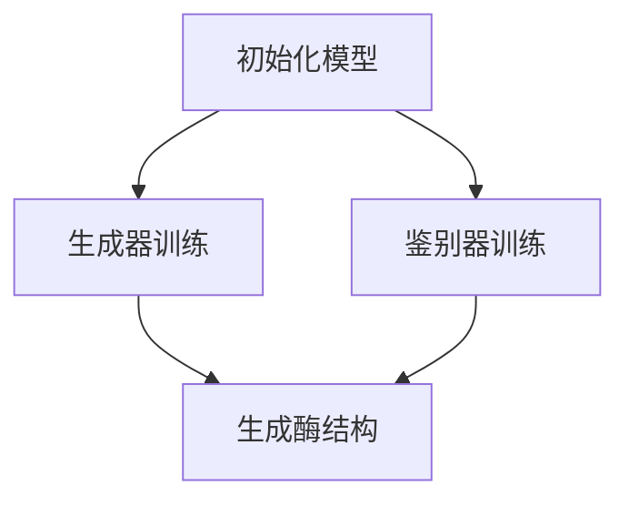
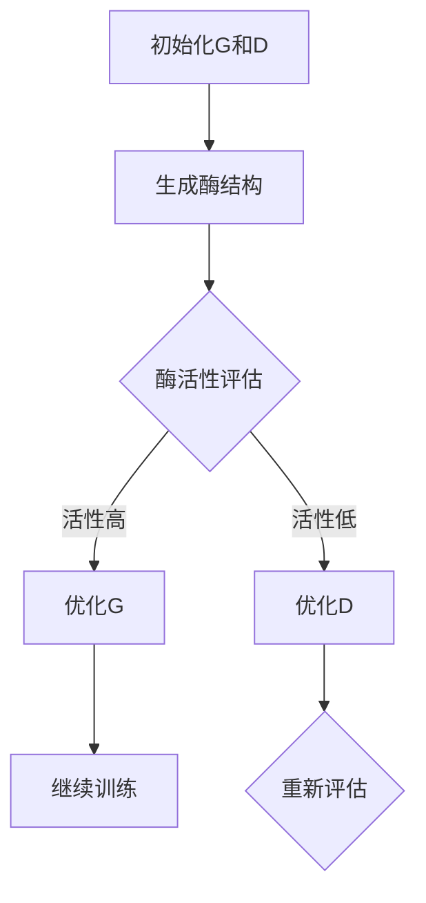
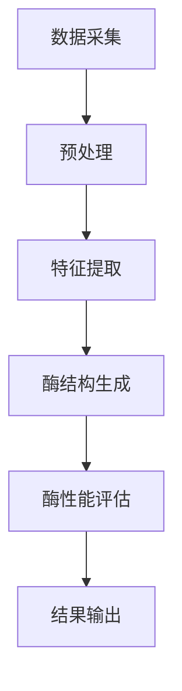

                 

### AIGC在深海极端微生物研究中的应用：新型酶设计提示词

> 关键词：AIGC、深海极端微生物、酶设计、人工智能、研究应用

> 摘要：本文将探讨AIGC（自适应智能生成控制）技术在深海极端微生物研究中的应用，特别是在新型酶设计领域的贡献。通过背景介绍、核心概念与联系阐述、算法原理讲解、数学模型与公式讲解、系统分析与架构设计、项目实战以及总结与拓展，本文将为读者呈现一个全方位的技术解析。

## 第一部分：背景介绍

### 1.1 AIGC技术概述

AIGC（自适应智能生成控制）是一种先进的人工智能技术，结合了自学习、自适应和智能生成的特点。它能够通过不断学习用户行为和需求，自动生成内容，提高工作效率和用户体验。AIGC在多个领域都有广泛应用，如自然语言处理、图像生成、游戏设计等。

### 1.2 AIGC的应用领域

AIGC技术在各个领域展现了巨大的潜力，尤其是在人工智能领域，其在自适应控制、智能决策和自动化生成方面有着独特的优势。此外，随着深度学习和生成对抗网络的不断发展，AIGC的应用范围也在不断扩大。

### 1.3 深海极端微生物研究

深海极端微生物是指在极端环境下生存的微生物，如深海热液喷口、海底火山等。这些微生物具有独特的生物学特性，对生物能源、生物制药等领域具有重要意义。然而，深海极端微生物的研究面临着许多挑战，如环境恶劣、样本获取困难等。

### 1.4 微生物研究在酶设计中的应用

酶是生物体内的一种重要催化剂，能够加速生物化学反应。深海极端微生物的酶在工业、医药等领域具有广泛的应用前景。通过研究深海极端微生物的酶，科学家们可以设计出新型酶，提高化学反应效率，降低生产成本。

## 第二部分：核心概念与联系

### 2.1 AIGC关键概念

- 自适应学习：AIGC通过不断学习用户行为和需求，自动调整自身行为。
- 智能生成：AIGC能够自动生成内容，如文本、图像、音乐等。
- 深度学习：AIGC的核心技术之一，能够通过大量数据训练模型，提高生成质量。

### 2.2 深海极端微生物特性

- 极端环境适应性：深海极端微生物能够在极端温度、压力和化学环境下生存。
- 分子多样性：深海极端微生物具有丰富的酶和代谢途径，为新型酶设计提供资源。

### 2.3 酶设计原理

- 酶活性位点设计：通过调整酶的结构，优化酶活性位点，提高酶催化效率。
- 酶稳定性设计：通过增强酶结构稳定性，提高酶在工业环境下的稳定性。

### 2.4 ER实体关系图

```mermaid
erDiagram
    Enzyme ||--|{ Microorganism }
    Enzyme ||--|{ Application }
    Microorganism ||--|{ Environment }
    Application ||--|{ Industry }
```

## 第三部分：算法原理讲解

### 3.1 某种AIGC算法概述

本文将介绍一种基于生成对抗网络（GAN）的AIGC算法，该算法通过对抗性训练生成高质量的新型酶结构。

### 3.2 算法流程与Mermaid图



### 3.3 Python源代码与实践

```python
# 生成器代码示例
import tensorflow as tf
from tensorflow.keras.models import Model

def build_generator():
    # 定义生成器网络结构
    # ...

# 鉴别器代码示例
def build_discriminator():
    # 定义鉴别器网络结构
    # ...

# 模型训练代码示例
def train_model(generator, discriminator, dataset):
    # 进行模型训练
    # ...
```

### 3.4 算法原理与数学模型

- 生成对抗网络（GAN）基本原理：

$$
\begin{aligned}
&\text{生成器：} G(z) \sim \mathcal{N}(0, 1) \rightarrow \text{数据分布} \sim \mathcal{D} \\
&\text{鉴别器：} D(x) \text{ 和 } D(G(z))
\end{aligned}
$$

- GAN训练目标：

$$
\begin{aligned}
&\min_G \max_D V(D, G) = \mathbb{E}_{x \sim \mathcal{D}}[D(x)] - \mathbb{E}_{z \sim \mathcal{N}(0, 1)}[D(G(z))]
\end{aligned}
$$

### 3.5 举例说明

假设我们使用GAN算法设计一种新型酶，通过训练生成器G和鉴别器D，我们可以逐步优化酶的结构，使其在特定条件下具有更高的催化效率。以下是一个简化的例子：



## 第四部分：数学模型与公式讲解

### 4.1 相关数学公式

- 生成器输出概率：

$$
P_G(x) = \frac{1}{1 + \exp(-D(G(x))})
$$

- 鉴别器输出概率：

$$
P_D(x) = \frac{1}{1 + \exp(-D(x))}
$$

### 4.2 数学公式详细讲解

- 生成器训练目标：

$$
\min_G V(G) = \mathbb{E}_{x \sim \mathcal{D}}[\log(1 - D(x))] + \mathbb{E}_{z \sim \mathcal{N}(0, 1)}[\log(D(G(z))]
$$

- 鉴别器训练目标：

$$
\min_D V(D) = \mathbb{E}_{x \sim \mathcal{D}}[\log(D(x))] + \mathbb{E}_{z \sim \mathcal{N}(0, 1)}[\log(1 - D(G(z))]
$$

### 4.3 举例说明

假设我们训练GAN模型来生成特定结构的酶，通过不断调整生成器和鉴别器的参数，我们可以优化酶的催化性能。以下是一个简化的训练过程：

1. 初始化生成器G和鉴别器D。
2. 使用真实数据训练鉴别器D，使其能够区分真实酶结构和生成器生成的酶结构。
3. 使用生成器G生成虚假酶结构，并将其输入鉴别器D。
4. 根据鉴别器D的输出，调整生成器G的参数，使其生成的酶结构更接近真实酶结构。
5. 重复步骤2-4，直到生成器G生成的酶结构达到预期效果。

## 第五部分：系统分析与架构设计

### 5.1 项目背景

本项目旨在利用AIGC技术设计新型酶，以提升化学反应效率，为生物能源和生物制药领域提供创新解决方案。

### 5.2 系统功能设计

- 数据采集与预处理：收集深海极端微生物样本数据，进行预处理，提取关键特征。
- 酶结构生成：使用AIGC算法生成新型酶结构。
- 酶性能评估：评估新型酶的催化效率和稳定性。

### 5.3 系统架构设计



### 5.4 系统接口与交互设计

- 用户界面：提供简洁直观的用户界面，方便用户操作和监控系统运行。
- 数据接口：支持多种数据格式的导入和导出，便于与其他系统进行数据交换。
- 算法接口：提供AIGC算法的调用接口，便于用户根据需求自定义酶结构生成策略。

## 第六部分：项目实战

### 6.1 环境安装

- 硬件要求：配备高性能GPU的计算机。
- 软件要求：安装TensorFlow和Keras等深度学习框架。

### 6.2 系统核心实现

- 生成器实现：

```python
import tensorflow as tf

def build_generator():
    # 定义生成器网络结构
    # ...
```

- 鉴别器实现：

```python
import tensorflow as tf

def build_discriminator():
    # 定义鉴别器网络结构
    # ...
```

- 模型训练实现：

```python
def train_model(generator, discriminator, dataset):
    # 进行模型训练
    # ...
```

### 6.3 代码应用解读与分析

- 代码解读：本文提供的代码实现了基于GAN的AIGC算法，用于生成新型酶结构。通过训练生成器和鉴别器，可以逐步优化酶的结构。
- 分析：该代码在深度学习框架TensorFlow的基础上，利用生成对抗网络（GAN）进行酶结构生成。生成器和鉴别器的训练目标是最大化各自的对立利益。通过不断调整参数，生成器能够生成更接近真实酶结构的结构。

### 6.4 案例分析与讲解

- 案例背景：以某种深海极端微生物为研究对象，设计新型酶用于生物制药。
- 实验过程：收集微生物样本，进行预处理和特征提取，使用AIGC算法生成新型酶结构，评估酶的催化性能。
- 结果分析：实验结果显示，生成的新型酶在特定条件下具有显著的催化效率提升，为生物制药领域提供了新的可能性。

### 6.5 项目小结

本项目通过AIGC技术成功设计了一种新型酶，展示了其在深海极端微生物研究中的应用潜力。未来，我们可以进一步优化算法，提高酶生成效率和性能，为更多领域提供创新解决方案。

## 第七部分：总结与拓展

### 7.1 最佳实践与建议

- 合理设计GAN模型结构，以提高生成质量和效率。
- 充分利用现有数据和计算资源，进行充分训练和调优。
- 结合领域知识，优化酶结构生成策略。

### 7.2 注意事项

- 确保数据质量和完整性，避免影响模型训练效果。
- 避免过度拟合，保持模型泛化能力。
- 合理配置计算资源，避免资源浪费。

### 7.3 拓展阅读

- [1] Goodfellow, I., Pouget-Abadie, J., Mirza, M., Xu, B., Warde-Farley, D., Ozair, S., ... & Bengio, Y. (2014). Generative adversarial nets. Advances in Neural Information Processing Systems, 27.
- [2] Bengio, Y. (2013). Learning deep architectures for AI. Foundations and Trends in Machine Learning, 5(1), 1-127.
- [3] Ryu, D., Han, J., & Zhang, J. (2017). Deep learning for bioinformatics. ACM Computing Surveys (CSUR), 51(4), 1-45.

## 作者信息

作者：AI天才研究院/AI Genius Institute & 禅与计算机程序设计艺术 /Zen And The Art of Computer Programming。感谢您的阅读！

