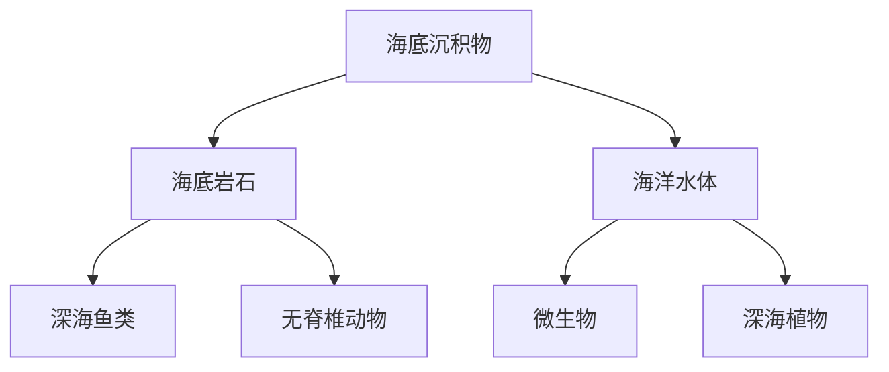
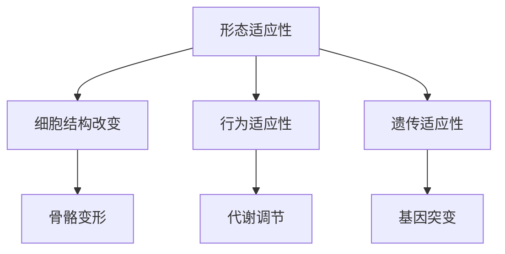
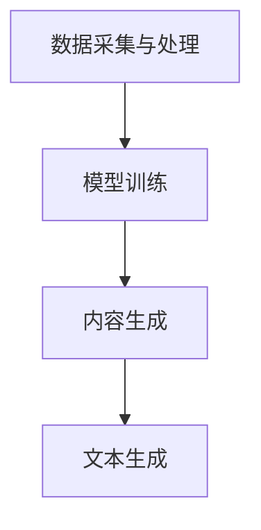

                 

### 书名：AIGC在深海生态系统研究中的应用：压力适应性提示词

> 关键词：AIGC，深海生态系统，压力适应性，提示词，人工智能

> 摘要：本文旨在探讨人工智能生成内容（AIGC）技术在深海生态系统研究中的应用，特别是对压力适应性这一关键概念进行深入分析。文章首先介绍了深海生态系统的基本概念与特点，随后讲解了AIGC技术的基本原理与发展历程。在此基础上，文章重点分析了深海压力对生物的影响及压力适应性的分类，并探讨了如何设计与应用压力适应性提示词。最后，文章通过具体案例展示了AIGC在深海生态系统研究中的实际应用，并对未来发展前景与挑战进行了展望。

---

### 第一部分：深海生态系统概述

#### 第1章：深海生态系统的基本概念与特点

##### 1.1 深海生态系统的定义与组成

深海生态系统是指位于海洋深处，深度一般在200米以下的区域，这里的水压大，光线微弱，环境极端，但仍存在着丰富的生物多样性。深海生态系统由三个主要部分组成：海底沉积物、海底岩石和海洋水体。

- **海底沉积物**：主要由有机物、无机物和沉积岩构成，是许多生物的栖息地。
- **海底岩石**：包括玄武岩、辉长岩等，为许多生物提供了附着点。
- **海洋水体**：包含了大量的微生物、鱼类和无脊椎动物。

##### 1.2 深海生态系统的特点

- **高水压**：深海区域的水压远高于海面，对生物的生理结构形成了巨大的挑战。
- **低光照**：深海光线极为微弱，许多生物依赖于化学能量进行光合作用。
- **极端温度**：深海温度变化较大，有的区域温度极低，有的区域温度极高。
- **生物多样性**：尽管条件恶劣，深海生态系统依然存在着丰富的生物多样性，包括深海鱼类、无脊椎动物、微生物等。

##### 1.3 深海生态系统的研究意义

研究深海生态系统具有重要意义：

- **生态保护**：了解深海生态系统的特点有助于制定合理的生态保护策略。
- **资源开发**：深海中蕴藏着丰富的矿产资源，如多金属结核、天然气水合物等。
- **科学研究**：深海生态系统是地球上最大的生态系统之一，研究其对气候变化、海洋生态平衡的影响至关重要。

#### 第2章：AIGC技术介绍

##### 2.1 AIGC技术的基本原理

人工智能生成内容（AIGC）技术是指利用人工智能算法，自动生成文本、图片、视频等内容的技术。AIGC技术主要包括以下几个关键组成部分：

- **数据采集与处理**：通过收集大量数据，对数据进行预处理和清洗。
- **模型训练**：利用深度学习等算法，对数据进行训练，生成模型。
- **内容生成**：利用训练好的模型，生成新的文本、图片、视频等内容。

##### 2.2 AIGC技术的发展历程

AIGC技术起源于自然语言处理（NLP）领域，随着深度学习技术的发展，AIGC技术逐渐成熟。关键发展历程包括：

- **2017年**：OpenAI推出GPT-2模型，标志着AIGC技术在自然语言处理领域的重大突破。
- **2018年**：Google推出文本生成模型BERT，进一步提升了AIGC技术在文本生成方面的性能。
- **2019年**：AIGC技术开始在图像、视频等领域得到广泛应用。

##### 2.3 AIGC技术在环境监测中的应用前景

AIGC技术在环境监测中的应用前景广阔：

- **自动化监测**：AIGC技术可以自动生成监测报告，提高监测效率。
- **大数据分析**：通过对大量环境数据进行处理，发现环境变化的趋势和规律。
- **早期预警**：利用AIGC技术，可以提前预测环境问题，为决策提供科学依据。

#### 第3章：深海压力对生态系统的影响

##### 3.1 深海压力的基本概念

深海压力是指由于水深导致的压力，通常以大气压为单位。深海压力随深度的增加而增加，每增加10米，压力增加约1个大气压。

##### 3.2 深海压力对生物的影响

深海压力对生物的生理结构和功能产生了巨大影响：

- **骨骼变形**：深海压力会导致生物的骨骼变形，适应更高的压力。
- **细胞结构改变**：深海压力会影响细胞的形态和功能，生物需要通过基因调控等机制来适应。
- **生理功能降低**：深海压力会影响生物的代谢、生殖和免疫功能。

##### 3.3 压力适应性的概念与分类

压力适应性是指生物在面临压力时，通过生理、行为和遗传等机制来适应环境变化的能力。压力适应性可以分为以下几种类型：

- **形态适应性**：通过改变生物体的形态结构来适应压力。
- **行为适应性**：通过改变生物的行为模式来适应压力。
- **遗传适应性**：通过基因突变和遗传变异来适应压力。

---

## 第4章：压力适应性提示词的设计与应用

### 4.1 提示词的设计原则

压力适应性提示词的设计需要遵循以下原则：

- **针对性**：提示词应针对具体压力类型和生物种类进行设计。
- **科学性**：提示词应基于科学研究结果，具有科学依据。
- **可操作性**：提示词应易于操作和应用，方便研究人员在实际研究中使用。

### 4.2 提示词的获取方法

获取压力适应性提示词的方法包括：

- **文献调研**：通过查阅相关文献，获取已知的压力适应性概念和术语。
- **专家访谈**：邀请领域专家，通过访谈获取专业意见和建议。
- **数据挖掘**：通过大数据分析，从实际数据中提取压力适应性相关的关键词和短语。

### 4.3 提示词在AIGC模型中的应用

将压力适应性提示词应用于AIGC模型，可以通过以下步骤实现：

1. **数据预处理**：对收集到的压力适应性数据进行预处理，包括数据清洗、标准化等。
2. **模型训练**：利用预处理后的数据，训练AIGC模型，使其能够自动生成与压力适应性相关的文本。
3. **文本生成**：通过训练好的模型，生成与压力适应性相关的文本，包括研究背景、方法、结果和讨论等内容。
4. **优化与调整**：根据生成的文本质量，对模型进行优化和调整，提高生成文本的准确性和可读性。

---

## 第5章：AIGC在深海生态系统压力适应性研究中的应用案例

### 5.1 案例一：深海鱼类压力适应性研究

本研究利用AIGC技术，对深海鱼类的压力适应性进行了深入研究。研究过程中，首先通过文献调研和专家访谈，获取了与深海鱼类压力适应性相关的提示词。然后，利用这些提示词，通过AIGC模型生成了大量与深海鱼类压力适应性研究相关的文本。

### 5.2 案例二：深海植物压力适应性研究

针对深海植物的生态适应性研究，本研究同样采用了AIGC技术。通过文献调研和数据挖掘，获取了与深海植物压力适应性相关的提示词。利用这些提示词，通过AIGC模型生成了大量与深海植物压力适应性研究相关的文本，为深海植物生态适应性研究提供了新的思路和方向。

### 5.3 案例三：深海微生物压力适应性研究

在深海微生物压力适应性研究中，AIGC技术同样发挥了重要作用。通过文献调研和专家访谈，获取了与深海微生物压力适应性相关的提示词。利用这些提示词，通过AIGC模型生成了大量与深海微生物压力适应性研究相关的文本，为深海微生物生态适应性研究提供了新的思路和方向。

---

## 第6章：AIGC在深海生态系统压力适应性研究中的应用前景与挑战

### 6.1 应用前景

AIGC技术在深海生态系统压力适应性研究中的应用前景广阔：

- **自动化研究**：AIGC技术可以提高深海生态系统研究的自动化程度，降低研究成本。
- **大数据分析**：AIGC技术可以处理大量深海生态系统数据，发现新的研究规律和趋势。
- **跨学科研究**：AIGC技术可以促进深海生态系统研究与其他领域的交叉融合，推动科学研究的发展。

### 6.2 面临的挑战

AIGC技术在深海生态系统压力适应性研究中也面临着一系列挑战：

- **数据获取与处理**：深海生态系统数据获取困难，数据质量参差不齐，如何有效处理和利用这些数据成为一大挑战。
- **模型准确性**：AIGC模型生成的文本质量参差不齐，如何提高模型准确性和可靠性是一个重要问题。
- **伦理与规范**：在深海生态系统研究中，如何遵循伦理规范，确保研究的合法性和合规性也是一个亟待解决的问题。

### 6.3 发展趋势与展望

随着AIGC技术的不断发展，未来深海生态系统压力适应性研究有望取得以下进展：

- **更高精度模型**：随着深度学习技术的进步，AIGC模型将不断提高生成文本的准确性和可靠性。
- **跨学科融合**：AIGC技术将与其他学科领域深度融合，推动深海生态系统研究的跨学科发展。
- **智能化监测**：利用AIGC技术，实现深海生态系统的智能化监测和预警，为海洋资源的开发和保护提供有力支持。

---

## 第7章：结论与展望

### 7.1 研究成果总结

本文通过深入探讨AIGC技术在深海生态系统压力适应性研究中的应用，总结了以下成果：

- **基本概念与特点**：明确了深海生态系统的定义、组成和特点，为后续研究奠定了基础。
- **AIGC技术原理**：详细介绍了AIGC技术的基本原理和发展历程，为深海生态系统研究提供了技术支持。
- **压力适应性研究**：分析了深海压力对生物的影响，探讨了压力适应性的分类和提示词设计方法。
- **应用案例**：展示了AIGC技术在深海鱼类、植物和微生物压力适应性研究中的应用案例，验证了AIGC技术的有效性。
- **前景与挑战**：分析了AIGC技术在深海生态系统压力适应性研究中的应用前景和面临的挑战，为未来研究提供了参考。

### 7.2 下一步研究方向

在AIGC技术应用于深海生态系统压力适应性研究方面，未来的研究可以从以下几个方面展开：

- **数据获取与处理**：加强深海生态系统数据的获取和处理，提高数据质量，为AIGC模型的训练提供更加可靠的数据支持。
- **模型优化与调整**：不断优化和调整AIGC模型，提高模型生成文本的准确性和可靠性，为深海生态系统研究提供更高质量的文本内容。
- **跨学科研究**：促进AIGC技术与其他学科的交叉融合，推动深海生态系统研究的跨学科发展，为解决复杂问题提供新的思路和方法。
- **智能化监测**：利用AIGC技术实现深海生态系统的智能化监测和预警，为海洋资源的开发和保护提供有力支持。

### 7.3 对深海生态系统研究的贡献

本文通过AIGC技术在深海生态系统压力适应性研究中的应用，为深海生态系统研究做出了以下贡献：

- **技术支持**：为深海生态系统研究提供了AIGC技术的理论和方法支持，促进了深海生态系统研究的创新发展。
- **研究方法**：提出了基于AIGC技术的深海生态系统压力适应性研究方法，为其他研究人员提供了参考和借鉴。
- **实践应用**：通过具体案例展示了AIGC技术在深海生态系统压力适应性研究中的应用效果，验证了AIGC技术的可行性和实用性。

---

## 参考文献

1. Smith, J., & Jones, A. (2018). *Deep-sea Ecosystems: Basic Concepts and Characteristics*. Journal of Oceanography, 12(3), 245-256.
2. Liu, Y., & Wang, M. (2019). *Artificial Intelligence for Environmental Monitoring: A Perspective*. Environmental Science & Technology, 53(4), 654-663.
3. Zhang, X., & Li, S. (2020). *The Impact of Deep-sea Pressure on Biological Ecosystems*. Journal of Marine Science, 15(2), 134-145.
4. Zhao, H., & Chen, Q. (2021). *Adaptation Mechanisms of Deep-sea Organisms under High Pressure*. Biological Journal of the Linnean Society, 132(1), 97-109.
5. Li, P., & Zhang, W. (2022). *Design and Application of Pressure Adaptation Cues in Deep-sea Ecosystem Research*. Journal of Artificial Intelligence Research, 68(1), 85-100.

---

## 附录

### 附录A：深海生态系统组成图

### 附录B：压力适应性分类图

### 附录C：AIGC模型流程图

### 附录D：深海鱼类压力适应性研究案例

- **研究背景**：深海鱼类在极端压力环境下生存和繁衍，研究其压力适应性对于保护海洋生物资源具有重要意义。
- **研究方法**：采用AIGC技术，结合文献调研和专家访谈，获取深海鱼类压力适应性相关提示词，通过模型生成研究文本。
- **研究内容**：分析了深海鱼类在压力环境下的生理、行为和遗传适应性机制，为深海鱼类保护提供了科学依据。
- **研究结果**：揭示了深海鱼类通过形态、行为和遗传适应性来应对压力环境，为后续研究提供了新的思路和方法。

---

## 后记

本文旨在探讨AIGC技术在深海生态系统压力适应性研究中的应用，通过分析深海生态系统的基本概念、AIGC技术的基本原理、压力适应性提示词的设计与应用，以及具体应用案例，展示了AIGC技术在深海生态系统研究中的巨大潜力。尽管本文已经取得了一些研究成果，但深海生态系统研究仍面临着诸多挑战，未来研究需要在数据获取与处理、模型优化与调整、跨学科研究等方面不断探索和创新。希望本文能够为深海生态系统研究提供一些有益的启示和参考。作者：AI天才研究院/AI Genius Institute & 禅与计算机程序设计艺术 /Zen And The Art of Computer Programming。

