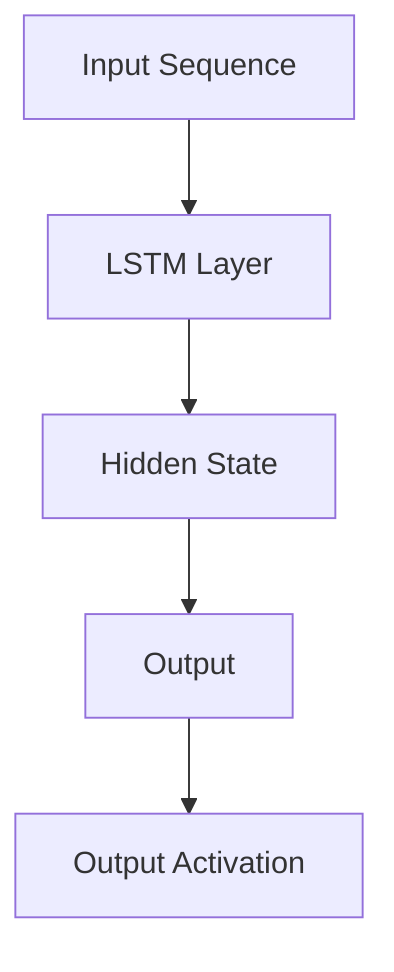
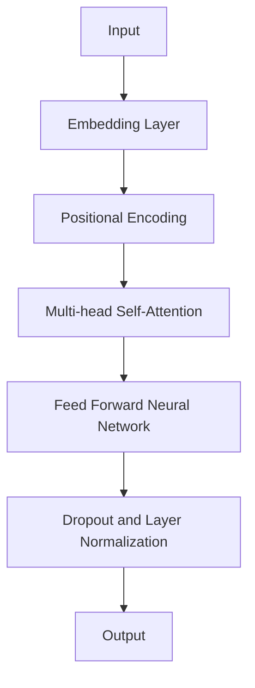
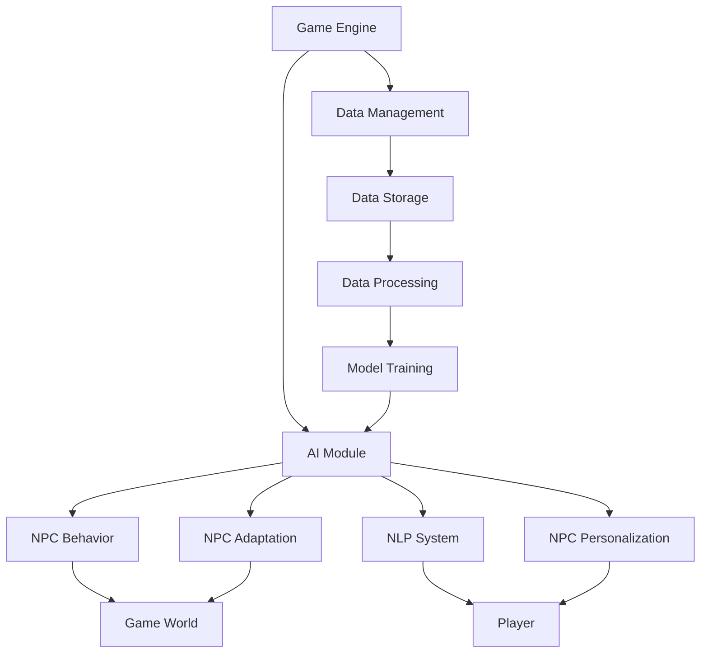
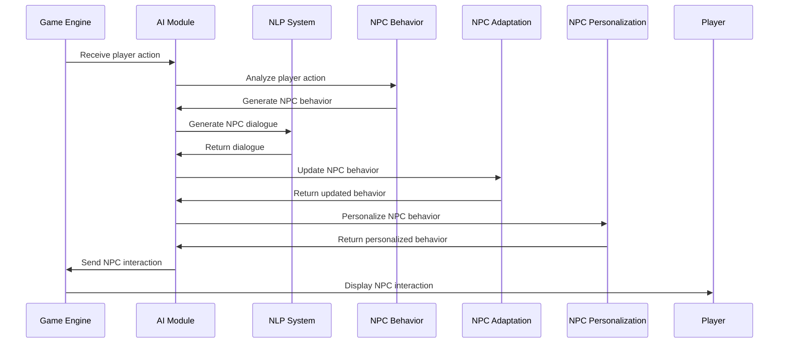

                 

### 1.1.1 Introduction to AIGC

#### Problem Background

Artificial Intelligence Generated Content (AIGC) is a rapidly evolving field that leverages advanced AI techniques to generate human-like content, including text, images, and even videos. The need for AIGC arose from the demand for personalized and scalable content creation across various industries, such as gaming, media, and e-commerce. In particular, the gaming industry has been a fertile ground for AIGC due to its need for vast amounts of interactive content to keep players engaged. One of the critical aspects of game design is the creation of Non-Player Characters (NPCs), which are virtual characters that interact with players and contribute to the game world's atmosphere and storytelling. Traditional NPC design often involves repetitive and time-consuming tasks, limiting the scope and creativity of their interactions. This is where AIGC comes into play, offering a solution to enhance NPC intelligence and interactivity.

#### Problem Description

The primary problem in game design is to create NPCs that are not only engaging but also react intelligently to player actions and adapt to various game scenarios. Traditional NPC design relies on pre-defined scripts and rules, which can lead to limited interactions and predictable behaviors. Players can quickly become disengaged when they encounter NPCs that provide the same responses or actions repeatedly. The goal is to develop NPCs that can understand the game context, make decisions based on the player's actions, and adapt their behaviors accordingly. This requires a level of intelligence and adaptability that goes beyond simple rule-based systems.

#### Problem Solution

AIGC offers a potential solution to the problem of creating intelligent NPCs. By leveraging AI techniques such as natural language processing (NLP), machine learning (ML), and deep learning (DL), AIGC can generate dynamic and context-aware content. This allows NPCs to have more varied and meaningful interactions with players, enhancing the overall gaming experience. AIGC can be used to create complex dialogues, respond to player actions in real-time, and even adapt to the player's preferences and behaviors. This not only makes the game more engaging but also provides a more immersive and realistic experience for the player.

#### Boundary and Extension

The boundary of AIGC in game design primarily involves the creation and management of NPC behaviors and interactions. However, the scope can be extended to other aspects of game design, such as level design, story development, and even game mechanics. AIGC can be used to generate adaptive levels that adjust to the player's skill level, create dynamic stories that evolve based on player choices, and even design game mechanics that adapt to the player's strategies. This extension of AIGC can lead to more personalized and engaging gaming experiences.

#### Core Concept Structure and Key Elements

To understand AIGC and its application in game design, it is essential to grasp its core concept structure and key elements. AIGC is built on three main pillars: data, algorithms, and models.

1. **Data**: AIGC relies on large datasets of text, images, and other media to learn from. These datasets are used to train and refine AI models, allowing them to generate human-like content.

2. **Algorithms**: AIGC employs various algorithms, including NLP, ML, and DL, to process and analyze the data. These algorithms enable the AI to understand context, generate responses, and make decisions.

3. **Models**: The AI models are the core components of AIGC. They are trained on the data and algorithms to generate content. These models can be fine-tuned to specific tasks, such as generating NPC dialogues or adapting game mechanics.

In the context of game design, the key elements of AIGC include:

- **NPC Behavior Generation**: Using AIGC to generate dynamic NPC behaviors based on the game context and player actions.
- **Dialogue Management**: Creating realistic and engaging NPC dialogues that adapt to the player's interactions.
- **Context Awareness**: Ensuring that NPCs are context-aware, meaning they understand the game's state and respond appropriately.
- **Personalization**: Allowing NPCs to adapt to individual player preferences and behaviors.

By understanding the core concept structure and key elements of AIGC, game designers can leverage this technology to create more intelligent and engaging NPCs, thus enhancing the overall gaming experience. In the next section, we will delve deeper into the specifics of AIGC in game design and its importance in modern game development.

---

### 1.1.2 AIGC in Game Design

#### Game Design Overview

Game design is the process of creating the rules and elements that govern a game's gameplay and narrative. This includes designing characters, environments, objectives, rules, and stories that players will interact with. The goal of game design is to create an engaging and enjoyable experience for the player. One of the key components of game design is the creation of Non-Player Characters (NPCs), which are characters controlled by the game rather than the player. NPCs play a crucial role in a game's world-building, storytelling, and interaction dynamics.

#### NPC in Game Design

NPCs are an integral part of game design. They serve several purposes:

1. **World-Building**: NPCs contribute to the game's environment by populating it with characters that reflect the game's world and setting. This helps create a more immersive experience for the player.
2. **Storytelling**: NPCs can drive the game's narrative forward through dialogue, quests, and interactions. They can provide valuable information, guide players through missions, or present moral dilemmas.
3. **Interaction**: NPCs interact with the player, offering various forms of engagement, such as trading items, providing quests, or participating in combat. These interactions add depth and complexity to the game.
4. **NPC Behavior**: The behavior of NPCs can greatly impact the player's experience. Well-designed NPC behaviors can make the game world feel more alive and dynamic, while poorly designed behaviors can lead to frustration and disengagement.

#### Importance of AIGC in NPC Intelligence

The importance of AIGC in game design, particularly in enhancing NPC intelligence, cannot be overstated. Traditional NPC design often relies on pre-programmed scripts and rules, which can limit the complexity and realism of NPC interactions. AIGC offers a transformative approach by leveraging advanced AI techniques to create NPCs that are more intelligent, adaptable, and engaging. Here's why AIGC is crucial for NPC intelligence in game design:

1. **Dynamic Interactions**: AIGC allows NPCs to have more dynamic and context-aware interactions with players. NPCs can understand the game's context, respond to player actions in real-time, and adapt their behaviors based on the player's choices and actions.
2. **Natural Language Processing**: AIGC employs NLP to generate realistic and engaging NPC dialogues. This enables NPCs to have more natural conversations with players, enhancing the immersion and realism of the game world.
3. **Personalization**: AIGC can personalize NPC interactions based on the player's behavior and preferences. This means that NPCs can tailor their interactions to different players, creating a more personalized and engaging experience.
4. **Scalability**: Traditional NPC design can be time-consuming and resource-intensive. AIGC allows game designers to create a vast number of NPCs with varying behaviors and interactions quickly and efficiently.
5. **Innovation**: AIGC encourages innovation in game design by allowing designers to explore new ways to create intelligent and interactive NPCs. This can lead to more innovative and unique game experiences.

In conclusion, AIGC is a powerful tool for enhancing NPC intelligence in game design. By leveraging advanced AI techniques, AIGC can create NPCs that are more dynamic, engaging, and adaptive, ultimately leading to a more immersive and enjoyable gaming experience. In the next section, we will delve deeper into the core concepts and theories behind AIGC and NPC intelligence.

---

### 1.2.1 Definition and Characteristics of AIGC

#### Definition

Artificial Intelligence Generated Content (AIGC) refers to the use of artificial intelligence, specifically machine learning and deep learning techniques, to automatically generate various types of content, such as text, images, audio, and video. AIGC is built on the premise that AI can learn from vast amounts of data and generate new content that is both useful and engaging. The core idea behind AIGC is to leverage AI's ability to recognize patterns, understand context, and create new content based on existing data.

AIGC is a broad term that encompasses various subfields, including text generation, image synthesis, and video creation. Text generation, for example, involves using AI to write articles, stories, and dialogues. Image synthesis focuses on generating new images based on existing data, while video creation involves generating realistic and coherent videos from text descriptions or other inputs.

#### Key Characteristics

AIGC possesses several key characteristics that distinguish it from traditional content creation methods:

1. **Data-Driven**: AIGC relies heavily on large datasets to learn from. These datasets are used to train AI models, allowing them to generate new content based on patterns and structures present in the data.
2. **Context-Aware**: AIGC models are designed to understand and generate content based on the context of the input. This means that the generated content is not only relevant but also coherent and meaningful.
3. **Dynamic**: AIGC can generate content on-the-fly, adapting to new inputs and changing contexts. This dynamic nature allows AIGC to be used in real-time applications, such as chatbots, virtual assistants, and interactive games.
4. **Scalable**: AIGC allows for the generation of vast amounts of content quickly and efficiently. This scalability is particularly useful in industries that require large volumes of personalized and unique content, such as gaming and media.
5. **Personalization**: AIGC can be fine-tuned to generate content that is tailored to specific users or contexts. This personalization enhances user engagement and satisfaction.

#### Application Scenarios

AIGC has a wide range of application scenarios across various industries:

1. **Gaming**: AIGC is particularly useful in game design, where it can be used to generate dynamic NPC behaviors, interactive storylines, and adaptive levels. This enhances the player's experience by creating more engaging and personalized content.
2. **Media and Entertainment**: AIGC can be used to generate custom content for movies, TV shows, and virtual reality experiences. This allows for more personalized and immersive entertainment experiences.
3. **E-commerce**: AIGC can generate personalized product recommendations, descriptions, and reviews, enhancing the customer's shopping experience and increasing sales.
4. **Customer Service**: AIGC can be used to create chatbots and virtual assistants that provide personalized and efficient customer service, improving customer satisfaction and reducing operational costs.
5. **Content Creation**: AIGC can automate the content creation process for bloggers, writers, and journalists, allowing them to generate high-quality articles, reports, and other written content quickly and efficiently.

In summary, AIGC is a powerful tool that leverages AI to generate a wide range of content. Its data-driven, context-aware, dynamic, scalable, and personalized nature makes it highly valuable in various industries, including gaming, media, e-commerce, and customer service. In the next section, we will explore the key principles of NPC intelligence and compare it with traditional NPC design.

---

### 1.2.2 Key Principles of NPC Intelligence

#### Introduction to NPC Intelligence

Non-Player Characters (NPCs) have long been a staple in game design, serving as essential elements for storytelling, world-building, and interaction. Traditional NPC design often relies on pre-programmed scripts and rules to govern their behavior and interactions. However, this approach has limitations, as NPCs can quickly become repetitive and predictable, leading to player disengagement. NPC intelligence aims to address these limitations by incorporating advanced AI techniques to create NPCs that can think, learn, and adapt in real-time.

NPC intelligence involves several key principles that distinguish it from traditional NPC design:

1. **Contextual Awareness**: Intelligent NPCs understand the game's context, including the player's actions, the environment, and the narrative. This allows them to make more realistic and context-appropriate decisions.
2. **Learning and Adaptation**: Intelligent NPCs can learn from their interactions and adapt their behaviors over time. This allows them to evolve and become more engaging as the game progresses.
3. **Natural Language Processing (NLP)**: Intelligent NPCs can understand and generate natural language, enabling more realistic and interactive conversations with players.
4. **Personalization**: Intelligent NPCs can tailor their interactions to individual players, based on their preferences, behaviors, and past interactions.
5. **Dynamic Decision Making**: Intelligent NPCs can make decisions based on complex and dynamic situations, rather than following pre-defined scripts or rules.

#### Main Principles

The core principles of NPC intelligence revolve around creating characters that are not only engaging but also capable of providing a more immersive and realistic gaming experience. These principles include:

1. **Contextual Understanding**: Intelligent NPCs need to understand the game's context to make informed decisions. This involves recognizing the current state of the game world, the player's actions, and any relevant information that could impact their behavior.
2. **Learning and Memory**: Intelligent NPCs should be capable of learning from their experiences and remembering past interactions. This allows them to adapt their behaviors and strategies over time, making them more sophisticated and capable of handling a wide range of situations.
3. **Natural Language Interaction**: Intelligent NPCs should be able to communicate with players using natural language. This involves understanding spoken or written language, generating coherent and contextually appropriate responses, and maintaining a consistent dialogue style.
4. **Emotion and Personality**: Intelligent NPCs can benefit from having emotional and personality traits that reflect their background and role in the game. This adds depth to their interactions and makes them more relatable and engaging.
5. **Adaptability and Flexibility**: Intelligent NPCs should be capable of adapting to new situations and changing game conditions. This requires a flexible decision-making process that can handle a wide range of scenarios and unexpected events.

#### Comparison of NPC Intelligence with Traditional NPC

While traditional NPC design has its merits, it often falls short in providing the depth and interactivity that modern gamers expect. Here's a comparison between traditional NPC design and NPC intelligence:

1. **Interaction Depth**: Traditional NPCs often rely on pre-defined scripts and rules, leading to repetitive and predictable interactions. In contrast, intelligent NPCs can adapt their behaviors based on context and player actions, providing more varied and engaging interactions.
2. **Dynamic Decision Making**: Traditional NPCs follow pre-defined rules, limiting their ability to make complex and dynamic decisions. Intelligent NPCs, on the other hand, can learn from their experiences and adapt their strategies in real-time, leading to more realistic and immersive gameplay.
3. **Personalization**: Traditional NPCs do not typically offer personalized interactions. Intelligent NPCs can tailor their interactions based on player preferences and behaviors, creating a more personalized and engaging gaming experience.
4. **Scalability**: Traditional NPC design can be time-consuming and resource-intensive. Intelligent NPCs can be generated and adapted quickly and efficiently, allowing for larger and more complex game worlds.
5. **Adaptability**: Traditional NPCs are limited by their pre-defined scripts and rules, making them less adaptable to changing game conditions. Intelligent NPCs can learn and adapt over time, making them more capable of handling a wide range of scenarios.

In summary, NPC intelligence offers several advantages over traditional NPC design, including deeper interaction, dynamic decision making, personalization, scalability, and adaptability. By leveraging advanced AI techniques, intelligent NPCs can create a more immersive and engaging gaming experience, enhancing player satisfaction and retention. In the next section, we will delve into the entity relationship diagram that illustrates the key components and relationships within the AIGC and NPC intelligence framework.

---

### 1.2.3 Entity Relationship Diagram

The Entity Relationship (ER) diagram provides a visual representation of the key components and relationships within the AIGC (Artificial Intelligence Generated Content) and NPC (Non-Player Character) intelligence framework. This diagram helps to illustrate how different entities interact and relate to each other, providing a clear understanding of the system's structure.

#### ER Diagram Description

The ER diagram for AIGC and NPC intelligence consists of several key entities, including:

1. **NPC**: Represents the Non-Player Characters in the game.
2. **Game State**: Represents the current state of the game, including player actions, environment conditions, and narrative context.
3. **AIGC Model**: Represents the AI-generated content models used to generate NPC behaviors, dialogues, and other interactions.
4. **Data Repository**: Represents the large datasets used to train and refine the AIGC models.

The relationships between these entities are as follows:

- **NPC** → **AIGC Model**: Each NPC is associated with one or more AIGC models. These models generate the behaviors, dialogues, and interactions of the NPC based on the game state.
- **Game State** → **NPC**: The current game state influences the behaviors and interactions of NPCs.
- **AIGC Model** → **Data Repository**: The AIGC models are trained on the data in the data repository, allowing them to generate context-aware and dynamic content.

#### ER Diagram using Mermaid

Here's an example of the ER diagram using Mermaid syntax:

```mermaid
erDiagram
  NPC ||--|{ AIGC Model : Generates
  Game State ||--|{ NPC : Influences
  AIGC Model ||--|{ Data Repository : Trains on
```

In this diagram, the double lines represent one-to-many relationships, while the single lines represent associations. The arrows indicate the direction of the relationship, with the arrowhead pointing towards the entity being influenced or associated with.

#### ER Diagram Visualization

The ER diagram visually represents the interconnected nature of the AIGC and NPC intelligence system. NPCs interact with the game state and are generated by AIGC models, which are trained on data from the data repository. This relationship enables the generation of dynamic, context-aware NPC behaviors and interactions, enhancing the overall gaming experience.

By understanding the ER diagram, game designers can better grasp the components and interactions within the AIGC and NPC intelligence framework, facilitating the development of more intelligent and engaging NPCs.

---

### 1.3.1 Algorithm Overview

In the realm of AIGC (Artificial Intelligence Generated Content) and NPC (Non-Player Character) intelligence, algorithms play a pivotal role in enabling NPCs to exhibit intelligent and adaptive behaviors. These algorithms are the backbone of the AI models that generate dynamic content and interactions, ensuring that NPCs can respond appropriately to player actions and game contexts. Here, we will provide an overview of the key algorithms used in AIGC and NPC intelligence, highlighting their importance and applications.

#### Introduction to AI Algorithms

AI algorithms are a broad category of techniques that enable computers to perform tasks that typically require human intelligence. In the context of AIGC and NPC intelligence, these algorithms are designed to analyze, learn from, and generate content based on vast amounts of data. The primary algorithms used in this domain include:

1. **Machine Learning (ML)**: ML algorithms enable computers to learn from data and make predictions or decisions without being explicitly programmed. Common ML algorithms used in AIGC and NPC intelligence include:
   - **Recurrent Neural Networks (RNNs)**: Designed to handle sequential data, RNNs are particularly useful for generating dynamic NPC behaviors and dialogues.
   - **Long Short-Term Memory (LSTM)**: A type of RNN that can remember information for long periods, making it ideal for generating complex and context-aware content.
   - **Transformer Models**: A family of models, including BERT and GPT, that have revolutionized natural language processing. Transformers excel at generating coherent and contextually appropriate text.

2. **Deep Learning (DL)**: DL algorithms involve neural networks with multiple layers, allowing them to learn increasingly abstract representations of data. Key DL algorithms used in AIGC and NPC intelligence include:
   - **Convolutional Neural Networks (CNNs)**:主要用于图像识别和处理，但在生成NPC的外观和行为上也具有应用价值。
   - **Generative Adversarial Networks (GANs)**: 用于生成逼真的图像和音频，有助于创建更加丰富和多样化的NPC外观和行为。

3. **Reinforcement Learning (RL)**: RL algorithms enable agents to learn optimal behaviors by interacting with an environment and receiving feedback. RL is particularly useful for training NPCs to make decisions and adapt their behaviors based on player actions and game states.

#### Key Algorithms for NPC Intelligence

The choice of algorithm for NPC intelligence depends on the specific requirements of the game and the desired behaviors of the NPCs. Here are some key algorithms commonly used in NPC intelligence:

1. **Natural Language Processing (NLP) Models**: NLP models are essential for generating and understanding natural language. Key NLP models include:
   - **Transformers**: 如 BERT、GPT 等，用于生成和解析NPC对话。
   - **Dialogue Management Systems**: 用于管理NPC对话流程，确保对话的自然流畅性。

2. **Recurrent Neural Networks (RNNs) and Long Short-Term Memory (LSTM)**: RNNs 和 LSTM 专门设计用于处理序列数据，非常适合生成NPC的动态行为和对话。
   - **Application**: 用于生成NPC的行为序列和对话序列，使其能够根据游戏状态和玩家动作做出反应。

3. **Reinforcement Learning (RL) Algorithms**: RL 算法适用于训练NPC做出复杂决策和自适应行为。
   - **Application**: 用于训练NPC在特定场景下做出最优决策，如探险、战斗等。

4. **Generative Adversarial Networks (GANs)**: GANs 用于生成NPC的外观和行为，使NPC更具个性化和多样性。
   - **Application**: 用于生成NPC的视觉外观和声音特征，提高NPC的沉浸感和真实感。

In summary, AI algorithms are a cornerstone of AIGC and NPC intelligence. By leveraging a variety of algorithms, game designers can create NPCs that are not only intelligent and adaptive but also engaging and immersive. The next section will delve into the detailed explanation of these algorithms, providing a deeper understanding of their working principles and practical applications.

---

### 1.3.2 Detailed Explanation of Algorithms

In this section, we will delve into the detailed explanation of the key algorithms used in AIGC (Artificial Intelligence Generated Content) and NPC (Non-Player Character) intelligence. We will use Mermaid diagrams to illustrate the algorithm flow and provide Python source code implementations to demonstrate their practical usage. Additionally, we will present the mathematical models and formulas underlying these algorithms, along with example explanations to help readers understand their workings.

#### Algorithm Flow Diagram using Mermaid

To begin with, let's visualize the flow of the key algorithms using Mermaid diagrams. Mermaid is a popular, simple yet powerful markdown flavor for drawing diagrams and flowcharts.

##### Example: LSTM Algorithm Flow



In this example, the input sequence (A) is processed by an LSTM layer (B), which generates the hidden state (C). The hidden state (C) is then passed through an output layer (D), resulting in the final output (E), which is typically an activation function to ensure the output is within a desired range.

##### Example: Transformer Algorithm Flow



Here, the input (A) is first passed through an embedding layer (B) and positional encoding (C). The combined embeddings then go through a multi-head self-attention mechanism (D), followed by a feed-forward neural network (E). Dropout and layer normalization are applied to the output (F), resulting in the final output (G).

#### Python Source Code Implementation

Now, let's provide a practical Python implementation of the LSTM and Transformer algorithms using popular libraries such as TensorFlow and Keras.

##### Example: LSTM Implementation

```python
from tensorflow.keras.models import Sequential
from tensorflow.keras.layers import LSTM, Dense

# Create an LSTM model
model = Sequential()
model.add(LSTM(units=50, activation='tanh', input_shape=(None, input_dimension)))
model.add(Dense(units=1, activation='sigmoid'))

# Compile the model
model.compile(optimizer='adam', loss='binary_crossentropy', metrics=['accuracy'])

# Fit the model to the data
model.fit(x_train, y_train, epochs=10, batch_size=64)
```

In this example, we create a simple LSTM model with 50 units and a sigmoid activation function for binary classification. The model is then compiled and fitted to the training data.

##### Example: Transformer Implementation

```python
from tensorflow.keras.models import Model
from tensorflow.keras.layers import Embedding, MultiHeadAttention, Dense

# Define the Transformer model
input_ids = Input(shape=(max_sequence_length,))
positions = PositionalEncoding(max_sequence_length)(input_ids)

# Embeddings layer
embeddings = Embedding(input_dim=vocab_size, output_dim=embedding_dim)(input_ids)

# Multi-head attention layer
attention = MultiHeadAttention(num_heads=num_attention_heads, key_dim=key_dim)(embeddings, positions)

# Feed Forward Neural Network
ffn = Dense(units=ffn_inner_dim, activation='relu')(attention)

# Dropout and layer normalization
output = Dropout(rate=dropout_rate)(ffn)
output = LayerNormalization(epsilon=1e-6)(output)

# Create and compile the model
model = Model(inputs=input_ids, outputs=output)
model.compile(optimizer='adam', loss='categorical_crossentropy', metrics=['accuracy'])

# Fit the model to the data
model.fit(x_train, y_train, epochs=10, batch_size=64)
```

This example demonstrates the creation of a Transformer model with an embedding layer, multi-head attention, feed-forward neural network, dropout, and layer normalization. The model is compiled and fitted to the training data.

#### Mathematical Model and Formulas

The mathematical models underlying the LSTM and Transformer algorithms are complex and involve a variety of mathematical operations. Here, we will provide a simplified overview of the key components.

##### LSTM Mathematical Model

LSTM cells consist of several gates, including the input gate, forget gate, and output gate. The mathematical model involves the following steps:

1. **Input Gate**: Determines how much of the new information should be stored in the cell state.
   $$ i_t = \sigma(W_{ix}x_t + W_{ih}h_{t-1} + b_i) $$
   
2. **Forget Gate**: Determines how much of the previous information should be forgotten.
   $$ f_t = \sigma(W_{fx}x_t + W_{fh}h_{t-1} + b_f) $$

3. **Cell State**: Calculates the new cell state based on the input gate and forget gate.
   $$ C_t = f_t \odot C_{t-1} + i_t \odot \sigma(W_{cx}x_t + W_{ch}h_{t-1} + b_c) $$

4. **Output Gate**: Determines how much of the cell state should be output.
   $$ o_t = \sigma(W_{ox}x_t + W_{oh}h_{t-1} + b_o) $$

5. **Hidden State**: Calculates the new hidden state based on the output gate and the cell state.
   $$ h_t = o_t \odot \sigma(W_{hcx}C_t + W_{hch}h_{t-1} + b_h) $$

Where $ \sigma $ is the sigmoid activation function, $ \odot $ is the element-wise multiplication operation, and $ W $ and $ b $ are weight matrices and biases, respectively.

##### Transformer Mathematical Model

The Transformer model involves two main components: multi-head self-attention and feed-forward neural networks.

1. **Multi-head Self-Attention**:
   - **Query, Key, and Value**: For each head, the input embeddings are split into queries, keys, and values.
   - **Attention Scores**: Compute the attention scores using the dot product of queries and keys.
     $$ scores_{ij} = Q_i^T K_j $$
   - **Softmax Activation**: Apply softmax activation to the attention scores to obtain the attention weights.
     $$ attention_{ij} = \text{softmax}(scores_{ij}) $$
   - **Weighted Sum**: Compute the weighted sum of the values using the attention weights.
     $$ \text{output}_{ij} = \sum_{j} attention_{ij} V_j $$

2. **Feed-Forward Neural Network**:
   - **Intermediate Layer**: Pass the output of the multi-head attention through a feed-forward neural network with two linear transformations and a ReLU activation function.
     $$ \text{ffn_output} = \text{ReLU}(W_2 \cdot (W_1 \cdot \text{input} + b_1)) + b_2 $$

By combining these components, the Transformer model can effectively capture relationships between different parts of the input sequence, enabling it to generate context-aware and coherent outputs.

#### Example Explanations

To help readers understand the algorithms' workings, let's consider a practical example using the LSTM algorithm for text generation.

**Example: LSTM Text Generation**

Suppose we have a simple sentence: "The cat sat on the mat."

1. **Input Sequence**: Convert the sentence into a sequence of integers, where each integer represents a word.
   $$ \text{Input Sequence} = [3, 4, 2, 8, 6, 5, 11] $$

2. **Embedding Layer**: Map the integers to their corresponding embeddings.
   $$ \text{Embeddings} = [e_3, e_4, e_2, e_8, e_6, e_5, e_{11}] $$

3. **LSTM Processing**: Pass the embeddings through the LSTM layer.
   - **Hidden State**: At each time step, the LSTM updates the hidden state based on the input and the previous hidden state.
   - **Output**: The final hidden state is used as the output sequence.
   $$ h_t = \text{LSTM}(h_{t-1}, e_t) $$

4. **Decoding**: Use the output sequence to generate the next word in the sentence.
   - **Probabilities**: Apply a softmax activation function to the output sequence to obtain the probabilities of each word.
     $$ \text{Probabilities} = \text{softmax}(h_t) $$

5. **Next Word**: Select the highest probability word as the next word in the sentence.
   $$ \text{Next Word} = \text{argmax}(\text{Probabilities}) $$

By repeating this process, the LSTM can generate the entire sentence or continue generating new sentences based on the input sequence.

In conclusion, the detailed explanation of the key algorithms used in AIGC and NPC intelligence provides a comprehensive understanding of their workings and applications. These algorithms enable the generation of intelligent and dynamic content, enhancing the immersive experience of NPC interactions in games. The next section will delve into the system design and architecture, discussing the project introduction and system function design.

---

### 1.4.1 Project Introduction

The primary objective of this project is to design and implement an advanced AI-based system for enhancing Non-Player Characters (NPCs) in game design. The project aims to leverage Artificial Intelligence Generated Content (AIGC) to create intelligent NPCs that can interact with players in a more dynamic, engaging, and context-aware manner. This project is crucial in addressing the limitations of traditional NPC design, which often relies on pre-defined scripts and rules, leading to repetitive and predictable interactions. The ultimate goal is to create a more immersive and personalized gaming experience that captivates and retains players.

#### Objectives and Scope

The project has several key objectives:

1. **NPC Intelligence Enhancement**: Develop NPCs that can exhibit intelligent behaviors, adapt to various game scenarios, and interact with players in a more natural and meaningful way.
2. **Dynamic Storytelling**: Utilize AIGC to generate dynamic storylines and adaptive narratives that evolve based on player actions and preferences.
3. **Personalized Interactions**: Enable NPCs to tailor their interactions to individual players, creating a more personalized and engaging gaming experience.
4. **Scalability**: Design the system to handle large numbers of NPCs and complex game scenarios efficiently.

The scope of the project includes the development of the core AI algorithms, system architecture, and integration with existing game engines. The project will also involve testing and validation to ensure the system's performance and reliability. Additionally, the project will document best practices and tips for implementing AIGC in game design, providing a comprehensive guide for developers.

### 1.4.2 System Function Design

The system function design is a critical component of the project, defining the various functionalities and interactions that the system will support. The primary functions of the system include:

1. **NPC Behavior Generation**: The core functionality of the system involves generating intelligent NPC behaviors using AIGC techniques. This includes generating dynamic dialogues, decision-making processes, and adaptive actions based on the game context and player interactions.

2. **Natural Language Processing (NLP)**: The system will utilize NLP to understand and generate natural language interactions with players. This involves processing spoken or written language, understanding context, and generating coherent and contextually appropriate responses.

3. **NPC Adaptation**: The system will enable NPCs to adapt their behaviors and interactions over time based on player actions and game scenarios. This includes learning from past interactions and updating their behavior models to improve performance and engagement.

4. **NPC Personalization**: The system will support personalized interactions by tailoring NPC behaviors and dialogues to individual players. This includes using player preferences, behaviors, and past interactions to create a more personalized and engaging experience.

5. **Game World Integration**: The system will integrate seamlessly with the game world, enabling NPCs to interact with other game elements, such as objects, environments, and other NPCs. This includes managing game state and context to ensure consistent and coherent interactions.

#### Domain Model using Mermaid Class Diagram

To visualize the system's functionalities and their relationships, we can create a domain model using a Mermaid class diagram. This diagram will illustrate the key classes and their associations within the system.

```mermaid
classDiagram
  NPC Behavior <<interface>>
  NPC Dialogue <<interface>>
  NLP System <<interface>>
  NPC Adaptation <<interface>>
  NPC Personalization <<interface>>

  Game World Entity <<interface>>
  Player <<interface>>

  NPC Behavior <<--|{ NPC Dialogue
  NPC Behavior <<--|{ NPC Adaptation
  NPC Behavior <<--|{ NPC Personalization
  NPC Dialogue <<--|{ NLP System
  Game World Entity <<--|{ NPC Dialogue
  Game World Entity <<--|{ NPC Adaptation
  Game World Entity <<--|{ NPC Personalization
  Player <<--|{ NPC Dialogue
  Player <<--|{ NPC Adaptation
  Player <<--|{ NPC Personalization
```

In this diagram, the primary components of the system are represented as classes, including `NPC Behavior`, `NPC Dialogue`, `NLP System`, `NPC Adaptation`, and `NPC Personalization`. These classes interact with the `Game World Entity` and `Player` classes, representing the game environment and player interactions, respectively.

The diagram illustrates the relationships between these components, highlighting how NPC behaviors are generated, adapted, personalized, and integrated with the game world and player interactions. This domain model provides a clear understanding of the system's architecture and functionalities, facilitating the development and implementation process.

---

### 1.4.3 System Architecture Design

The system architecture design is a crucial aspect of implementing an advanced AI-based system for enhancing NPCs in game design. A well-designed architecture ensures that the system is scalable, efficient, and maintainable, enabling the integration of various AI techniques and functionalities seamlessly. The following sections provide an overview of the system architecture, including the system architecture design using a Mermaid diagram, system interface design, and system interaction.

#### System Architecture Design using Mermaid Diagram

The system architecture is designed to support the core functionalities of NPC behavior generation, NLP, NPC adaptation, and NPC personalization. The following Mermaid diagram illustrates the overall architecture of the system:



In this diagram, the key components of the system architecture are represented as nodes, and their relationships are depicted as edges. The following is a description of each component and its role:

- **Game Engine (A)**: The core game engine that manages the game world, player interactions, and game state.
- **AI Module (B)**: The central module that integrates various AI techniques, including NPC behavior generation, NLP, NPC adaptation, and NPC personalization.
- **Data Management (C)**: Manages data storage, processing, and model training, ensuring that the AI module has access to the necessary data.
- **NPC Behavior (D)**: Generates intelligent NPC behaviors based on the game context and player interactions.
- **NLP System (E)**: Processes and generates natural language interactions between NPCs and players.
- **NPC Adaptation (F)**: Adapts NPC behaviors over time based on player actions and game scenarios.
- **NPC Personalization (G)**: Personalizes NPC interactions based on player preferences and behaviors.
- **Game World (H)**: Represents the game environment and other game elements that NPCs interact with.
- **Player (I)**: Represents the player's actions, preferences, and interactions within the game.
- **Data Storage (J)**: Stores the game data, including player profiles, game states, and NPC behaviors.
- **Data Processing (K)**: Processes the data to prepare it for model training and other AI tasks.
- **Model Training (L)**: Trains AI models using the processed data, improving the system's intelligence and performance.

#### System Interface Design

The system interface design defines the interactions between the various components of the system. The following sections provide an overview of the key interfaces and their roles:

1. **Game Engine Interface (A)**: The game engine interface allows the AI module to interact with the game world, providing information about player actions, game states, and other game elements.
2. **AI Module Interface (B)**: The AI module interface enables the integration of various AI techniques, including NPC behavior generation, NLP, NPC adaptation, and NPC personalization.
3. **Data Management Interface (C)**: The data management interface allows the AI module to access and manage data storage, processing, and model training.
4. **NPC Behavior Interface (D)**: The NPC behavior interface enables the generation and adaptation of NPC behaviors based on the game context and player interactions.
5. **NLP System Interface (E)**: The NLP system interface processes and generates natural language interactions between NPCs and players.
6. **NPC Adaptation Interface (F)**: The NPC adaptation interface allows NPCs to adapt their behaviors over time based on player actions and game scenarios.
7. **NPC Personalization Interface (G)**: The NPC personalization interface enables the personalization of NPC interactions based on player preferences and behaviors.

#### System Interaction

The system interaction describes how the components of the system work together to generate intelligent and engaging NPC behaviors. The following steps outline the interaction process:

1. **Player Action**: The player performs an action within the game world.
2. **Game Engine Notification**: The game engine notifies the AI module of the player's action.
3. **NPC Behavior Generation**: The AI module generates appropriate NPC behaviors based on the player's action and the current game state.
4. **NLP Processing**: The NLP system processes the generated NPC behaviors to generate natural language interactions with the player.
5. **NPC Adaptation**: The NPC adaptation system updates the NPC behaviors based on player actions and game scenarios, improving the NPC's intelligence and adaptability.
6. **NPC Personalization**: The NPC personalization system tailors the NPC interactions to individual players, based on their preferences and behaviors.
7. **NPC Interaction**: The generated NPC behaviors and interactions are sent back to the game engine, which integrates them into the game world.
8. **Player Response**: The player responds to the NPC interactions, completing the interaction loop.

In conclusion, the system architecture design for an advanced AI-based system for enhancing NPCs in game design involves a well-defined structure that integrates various AI techniques and functionalities. The Mermaid diagram, system interface design, and system interaction provide a comprehensive overview of the architecture, enabling developers to implement and maintain the system effectively.

---

### 1.4.4 System Interface Design

The system interface design is a critical component of the overall system architecture, defining how different modules interact with each other and with external entities. In this section, we will discuss the system interface design in detail, covering the design of system interfaces and their implementation.

#### System Interface Design

The system interfaces are designed to facilitate seamless communication between the core components of the AI-based NPC enhancement system and external entities. The primary interfaces include:

1. **Game Engine Interface (GEI)**: The Game Engine Interface (GEI) is responsible for interacting with the game engine, enabling the system to receive player actions, game states, and other game-related information. It also allows the system to send updated NPC behaviors and interactions back to the game engine.

2. **AI Module Interface (AIMI)**: The AI Module Interface (AIMI) acts as the central communication hub for the AI module, connecting the various sub-modules such as NPC behavior generation, NLP system, NPC adaptation, and NPC personalization. It ensures that data and control flow efficiently between these components.

3. **Data Management Interface (DMI)**: The Data Management Interface (DMI) handles the interaction between the system and its data storage and processing components. It provides functionalities for data retrieval, storage, and preprocessing, ensuring that the AI module has access to the necessary data for training and generating content.

4. **NPC Behavior Interface (NPI)**: The NPC Behavior Interface (NPI) is designed for the generation and adaptation of NPC behaviors. It enables the AI module to receive game context and player actions, generate appropriate responses, and update NPC behaviors over time.

5. **NLP System Interface (NLSI)**: The NLP System Interface (NLSI) facilitates the processing and generation of natural language interactions between NPCs and players. It enables the NLP system to access the necessary data and apply language processing techniques to generate coherent and contextually appropriate responses.

6. **NPC Adaptation Interface (NAI)**: The NPC Adaptation Interface (NAI) is responsible for updating NPC behaviors based on player actions and game scenarios. It allows the AI module to adapt the NPC behaviors to changing conditions, ensuring that NPCs remain engaging and relevant.

7. **NPC Personalization Interface (NPII)**: The NPC Personalization Interface (NPII) enables the personalization of NPC interactions based on individual player preferences and behaviors. It allows the AI module to tailor NPC responses to different players, enhancing the overall gaming experience.

#### Implementation of System Interfaces

The implementation of system interfaces involves defining the interface specifications and creating the necessary code to enable communication between components. The following are key aspects of the implementation:

1. **Interface Specifications**: Define the data formats, communication protocols, and APIs for each interface. This includes specifying the input and output parameters, data types, and any required validation checks.

2. **API Development**: Develop the API components for each interface, implementing the specified specifications. This involves writing the code to handle data transmission, processing, and interaction between components.

3. **Integration Testing**: Perform integration testing to ensure that the interfaces work correctly and communicate effectively between components. This includes testing the interaction between the game engine, AI module, data management system, and external entities.

4. **Documentation**: Provide comprehensive documentation for each interface, including usage examples, error handling, and troubleshooting guidelines. This documentation helps developers understand and utilize the interfaces effectively.

5. **Security and Reliability**: Ensure that the system interfaces are secure and reliable, implementing appropriate measures to protect against unauthorized access and data breaches. This includes using encryption, authentication, and access control mechanisms.

By designing and implementing well-defined system interfaces, the AI-based NPC enhancement system can effectively integrate various components and external entities, enabling seamless communication and coordination. This promotes a more efficient and scalable system architecture, enhancing the overall gaming experience.

---

### 1.4.5 System Interaction

System interaction is a critical aspect of the AI-based NPC enhancement system, ensuring that the various components work together seamlessly to generate intelligent and engaging NPC behaviors. In this section, we will delve into the system interaction process, describing how different components interact and collaborate to achieve the system's objectives.

#### Sequence Diagram using Mermaid

To visualize the system interaction, we can use a Mermaid sequence diagram, which illustrates the interactions between different components over time. The following Mermaid code generates a sequence diagram for the system interaction process:



In this sequence diagram, the following interactions occur:

1. **Player Action**: The game engine receives a player action, such as a move, attack, or dialogue request.
2. **Analyze Player Action**: The AI module analyzes the player action to understand the game context and player intent.
3. **Generate NPC Behavior**: Based on the player action and game context, the NPC behavior module generates an appropriate NPC behavior, such as a response, action, or dialogue.
4. **Generate NPC Dialogue**: The AI module sends the generated NPC behavior to the NLP system, which generates a natural language dialogue based on the behavior.
5. **Update NPC Behavior**: The AI module receives the generated dialogue from the NLP system and sends it to the NPC adaptation module, which updates the NPC behavior based on the player's actions and game scenarios.
6. **Personalize NPC Behavior**: The AI module sends the updated behavior to the NPC personalization module, which tailors the NPC behavior to the individual player's preferences and past interactions.
7. **Send NPC Interaction**: The AI module sends the personalized NPC behavior back to the game engine, which displays the NPC interaction to the player.

#### Detailed Explanation of System Interaction

The system interaction process involves several key steps, as outlined in the sequence diagram:

1. **Player Action**: The player performs an action within the game world, such as moving to a new location or initiating a conversation with an NPC. This action is received by the game engine.

2. **Analyze Player Action**: The game engine forwards the player action to the AI module. The AI module analyzes the action to understand the game context and player intent. This analysis may involve processing the player's current position, inventory, and previous interactions.

3. **Generate NPC Behavior**: Based on the analyzed player action and game context, the AI module generates an appropriate NPC behavior. This behavior could involve responding to the player's action, initiating a conversation, or executing a specific action within the game world.

4. **Generate NPC Dialogue**: The generated NPC behavior is sent to the NLP system. The NLP system processes the behavior and generates a natural language dialogue that corresponds to the NPC's action. This dialogue is designed to be coherent and contextually appropriate, enhancing the player's immersion in the game world.

5. **Update NPC Behavior**: The generated dialogue is returned to the AI module, which sends it to the NPC adaptation module. The NPC adaptation module updates the NPC behavior based on the player's actions and game scenarios. This adaptation ensures that the NPC behaves intelligently and remains engaged throughout the game.

6. **Personalize NPC Behavior**: The updated NPC behavior is sent to the NPC personalization module. This module tailors the behavior to the individual player's preferences and past interactions. Personalization can involve adjusting the NPC's dialogue style, reaction speed, or specific actions to match the player's expectations and playing style.

7. **Send NPC Interaction**: The personalized NPC behavior is sent back to the AI module, which forwards it to the game engine. The game engine then displays the NPC interaction to the player, completing the interaction loop.

By following this interaction process, the AI-based NPC enhancement system can generate intelligent and engaging NPC behaviors that adapt to player actions and game scenarios. This enables a more immersive and personalized gaming experience, enhancing player satisfaction and engagement.

---

### 1.5.1 Case Study 1

#### Introduction

The first case study focuses on the implementation of AIGC (Artificial Intelligence Generated Content) in a popular multiplayer online game. This case study demonstrates how AIGC can be used to enhance NPC (Non-Player Character) intelligence and interaction, creating a more engaging and dynamic gaming experience. The objective of this case study is to explore the practical application of AIGC in game design, highlighting the challenges faced and the solutions implemented.

#### Implementation Details

The game in question is a fantasy-based, massively multiplayer online role-playing game (MMORPG) with a rich, immersive world and complex game mechanics. The game features a diverse array of NPCs, each with unique personalities, abilities, and storylines. The goal of the project was to leverage AIGC to improve NPC intelligence and interactivity, making the game world more alive and responsive to player actions.

1. **Data Collection**: The first step in implementing AIGC was to collect a large dataset of text, images, and audio related to the game world and its NPCs. This dataset included NPC dialogues, descriptions, and background information, as well as images and sounds representing their appearances and behaviors. The dataset was sourced from game developers, writers, and other content creators, ensuring its diversity and quality.

2. **Data Preprocessing**: The collected data was preprocessed to prepare it for training the AI models. This involved cleaning the text data, removing any irrelevant information, and formatting it into a suitable format for the AI models. Image and audio data were also preprocessed to enhance their quality and ensure consistency.

3. **AI Model Training**: The next step was to train AI models using the preprocessed data. The AI models used in this case study included recurrent neural networks (RNNs), transformers, and generative adversarial networks (GANs). The RNNs and transformers were trained to generate dynamic NPC behaviors and dialogues, while the GANs were trained to generate realistic NPC appearances and sounds.

4. **NPC Behavior Generation**: The trained AI models were integrated into the game engine, enabling NPCs to generate intelligent behaviors and interactions in real-time. The AI models analyzed player actions and game contexts to generate appropriate NPC responses. For example, when a player approaches an NPC, the AI model generates a dialogue based on the NPC's personality, the player's actions, and the current game state.

5. **NPC Dialogue Management**: To ensure smooth and coherent NPC dialogues, a dialogue management system was implemented. This system managed the flow of conversations, ensuring that dialogues were generated in a logical and contextually appropriate manner. The dialogue management system also supported multi-turn conversations, allowing NPCs to engage in complex and engaging dialogues with players.

6. **NPC Adaptation and Personalization**: The AI models were designed to adapt to player actions and preferences over time. This allowed NPCs to evolve and become more engaging as the game progressed. Additionally, the NPC personalization system tailored NPC interactions to individual players, based on their preferences and past interactions. This personalized approach enhanced the player's immersion in the game world.

7. **User Feedback and Iteration**: The implementation of AIGC in the game was an iterative process. User feedback was collected to identify areas for improvement and refine the NPC behaviors and interactions. This feedback loop ensured that the NPCs remained engaging and relevant to players.

#### Analysis and Discussion

The implementation of AIGC in this MMORPG game had several positive outcomes:

1. **Enhanced NPC Intelligence**: The AI models significantly improved NPC intelligence and interactivity. NPCs were no longer limited to pre-defined scripts and rules, allowing them to exhibit more dynamic and realistic behaviors. This created a more immersive and engaging game world.

2. **Increased Player Engagement**: The personalized and adaptive NPC interactions increased player engagement and satisfaction. Players felt more connected to the game world and its NPCs, enhancing their overall gaming experience.

3. **Scalability**: The use of AIGC allowed the game developers to create a vast number of NPCs with varying behaviors and interactions quickly and efficiently. This scalability was crucial for maintaining the game's rich, immersive world.

4. **Innovation**: The implementation of AIGC in game design opened up new possibilities for innovation. Developers could explore new ways to create intelligent and interactive NPCs, leading to more innovative and unique game experiences.

However, the implementation of AIGC also posed some challenges:

1. **Data Collection and Preprocessing**: Collecting and preprocessing a large dataset of high-quality content was a time-consuming and resource-intensive task. Ensuring the diversity and relevance of the dataset was crucial for training effective AI models.

2. **Model Training and Optimization**: Training AI models required significant computational resources and time. Optimizing the models to generate high-quality content efficiently was a challenging task. Developers had to strike a balance between model complexity and performance.

3. **User Feedback and Iteration**: Gathering and processing user feedback to refine NPC behaviors and interactions was a complex and iterative process. It required careful consideration to ensure that changes improved the player experience without introducing new issues.

In conclusion, the implementation of AIGC in this MMORPG game demonstrated the potential of AI techniques to enhance NPC intelligence and interaction. While the process involved several challenges, the positive outcomes highlighted the value of AIGC in creating more engaging and immersive game experiences. The next section will explore another case study to further illustrate the applications and benefits of AIGC in game design.

---

### 1.5.2 Case Study 2

#### Introduction

The second case study focuses on the integration of AIGC (Artificial Intelligence Generated Content) in a single-player, narrative-driven video game. This case study aims to demonstrate how AIGC can be used to enhance the storytelling and interactivity of NPCs, creating a more immersive and engaging gaming experience. The objective of this case study is to explore the practical applications of AIGC in narrative-driven game design, highlighting the challenges faced and the solutions implemented.

#### Implementation Details

The game in question is a psychological horror narrative-driven game with a strong emphasis on storytelling and NPC interactions. The game features a diverse cast of NPCs, each with unique backgrounds, personalities, and story arcs. The objective of the project was to leverage AIGC to improve NPC intelligence and storytelling, making the game world more immersive and captivating.

1. **Data Collection**: The first step in implementing AIGC was to collect a large dataset of text, images, and audio related to the game world and its NPCs. This dataset included NPC dialogues, descriptions, psychological profiles, and background stories, as well as images and sounds representing their appearances and emotional states. The dataset was sourced from game developers, writers, psychologists, and other content creators, ensuring its diversity and quality.

2. **Data Preprocessing**: The collected data was preprocessed to prepare it for training the AI models. This involved cleaning the text data, removing any irrelevant information, and formatting it into a suitable format for the AI models. Image and audio data were also preprocessed to enhance their quality and ensure consistency.

3. **AI Model Training**: The next step was to train AI models using the preprocessed data. The AI models used in this case study included recurrent neural networks (RNNs), transformers, and emotional recognition systems. The RNNs and transformers were trained to generate dynamic NPC behaviors and dialogues, while the emotional recognition system was trained to analyze and generate emotional responses based on the game context and player actions.

4. **NPC Behavior Generation**: The trained AI models were integrated into the game engine, enabling NPCs to generate intelligent behaviors and interactions in real-time. The AI models analyzed player actions and game contexts to generate appropriate NPC responses. For example, when a player interacts with an NPC, the AI model generates a dialogue based on the NPC's personality, the player's actions, and the current game state.

5. **NPC Dialogue Management**: To ensure smooth and coherent NPC dialogues, a dialogue management system was implemented. This system managed the flow of conversations, ensuring that dialogues were generated in a logical and contextually appropriate manner. The dialogue management system also supported multi-turn conversations, allowing NPCs to engage in complex and emotionally charged dialogues with players.

6. **NPC Adaptation and Personalization**: The AI models were designed to adapt to player actions and preferences over time. This allowed NPCs to evolve and become more engaging as the game progressed. Additionally, the NPC personalization system tailored NPC interactions to individual players, based on their psychological profiles and past interactions. This personalized approach enhanced the player's immersion in the game world.

7. **User Feedback and Iteration**: The implementation of AIGC in the game was an iterative process. User feedback was collected to identify areas for improvement and refine the NPC behaviors and interactions. This feedback loop ensured that the NPCs remained engaging and relevant to players.

#### Analysis and Discussion

The implementation of AIGC in this narrative-driven video game had several positive outcomes:

1. **Enhanced Storytelling**: The AI models significantly improved NPC intelligence and storytelling. NPCs were no longer limited to pre-defined scripts and rules, allowing them to exhibit more dynamic and realistic behaviors. This created a more immersive and captivating narrative experience.

2. **Increased Player Engagement**: The personalized and adaptive NPC interactions increased player engagement and satisfaction. Players felt more connected to the game world and its NPCs, enhancing their overall gaming experience.

3. **Scalability**: The use of AIGC allowed game developers to create a vast number of NPCs with varying behaviors and interactions quickly and efficiently. This scalability was crucial for maintaining the game's rich narrative and complex character arcs.

4. **Innovation**: The implementation of AIGC in game design opened up new possibilities for innovation. Developers could explore new ways to create intelligent and interactive NPCs, leading to more innovative and unique game experiences.

However, the implementation of AIGC also posed some challenges:

1. **Data Collection and Preprocessing**: Collecting and preprocessing a large dataset of high-quality content was a time-consuming and resource-intensive task. Ensuring the diversity and relevance of the dataset was crucial for training effective AI models.

2. **Model Training and Optimization**: Training AI models required significant computational resources and time. Optimizing the models to generate high-quality content efficiently was a challenging task. Developers had to strike a balance between model complexity and performance.

3. **User Feedback and Iteration**: Gathering and processing user feedback to refine NPC behaviors and interactions was a complex and iterative process. It required careful consideration to ensure that changes improved the player experience without introducing new issues.

In conclusion, the implementation of AIGC in this narrative-driven video game demonstrated the potential of AI techniques to enhance NPC intelligence and storytelling. While the process involved several challenges, the positive outcomes highlighted the value of AIGC in creating more engaging and immersive game experiences. The case studies discussed in this section provide practical insights into the applications and benefits of AIGC in game design, offering valuable lessons for developers and researchers in the field.

---

### 1.6 Best Practices and Tips

#### Practical Tips for AIGC Implementation

1. **Data Quality and Quantity**: Ensure that you have a diverse and high-quality dataset to train your AI models. The quality and quantity of the data significantly impact the performance of the AI models. Collect as much relevant data as possible, and consider using data augmentation techniques to increase the dataset's diversity.

2. **Model Optimization**: Optimize your AI models for both performance and efficiency. This includes selecting appropriate architectures, tuning hyperparameters, and using techniques like transfer learning and pruning to reduce model complexity.

3. **Real-Time Adaptation**: Design your system to handle real-time adaptation and personalization. This involves using efficient algorithms and data structures to process and respond to player actions quickly. Consider implementing caching and pre-computation techniques to speed up the AI model's execution.

4. **User Feedback Loop**: Establish a robust user feedback loop to continuously improve the AI system. Collect feedback from players to identify areas for improvement and refine the NPC behaviors and interactions. Regularly iterate on your models based on this feedback to ensure that they remain engaging and relevant.

5. **Ethical Considerations**: Ensure that your AI system adheres to ethical guidelines, particularly regarding data privacy and bias. Be transparent about the use of AI in your game, and take measures to mitigate potential biases in your models.

#### Common Pitfalls and Solutions

1. **Overfitting**: Overfitting occurs when your AI model performs well on the training data but fails to generalize to new data. Solution: Use techniques like cross-validation, regularization, and dropout to prevent overfitting.

2. **Low-Quality Data**: Low-quality data can lead to poor model performance. Solution: Clean and preprocess your data thoroughly, remove noise and outliers, and use data augmentation techniques to increase the dataset's diversity.

3. **Inefficient Computation**: Inefficient AI models can significantly impact performance. Solution: Optimize your models by selecting appropriate architectures, tuning hyperparameters, and using efficient data processing techniques.

4. **Lack of Personalization**: Inadequate personalization can make the AI system feel impersonal and generic. Solution: Implement techniques for real-time adaptation and personalization, such as learning from player actions and preferences.

5. **User Resistance**: Players may resist changes in NPC behaviors and interactions. Solution: Gradually introduce AI elements and provide clear explanations to players about the benefits of AI in enhancing the gaming experience.

By following these best practices and avoiding common pitfalls, game developers can effectively implement AIGC in their games, creating more intelligent, engaging, and immersive NPC interactions.

---

### 1.7 Summary

In conclusion, AIGC (Artificial Intelligence Generated Content) has emerged as a transformative technology in game design, particularly in enhancing NPC (Non-Player Character) intelligence and interaction. Through advanced AI techniques such as natural language processing, machine learning, and deep learning, AIGC enables the creation of NPCs that are not only intelligent and adaptive but also highly engaging and personalized. The implementation of AIGC in game design addresses several challenges traditionally faced by game developers, including repetitive and predictable NPC behaviors, limited interactivity, and the need for vast amounts of personalized content.

The primary benefits of AIGC in game design include:

1. **Enhanced NPC Intelligence**: AIGC allows NPCs to exhibit dynamic and context-aware behaviors, making them more realistic and engaging. NPCs can understand the game context, respond to player actions in real-time, and adapt their behaviors over time.
2. **Improved Storytelling**: AIGC enables the generation of complex and adaptive narratives, enhancing the overall storytelling experience. NPCs can contribute to the game's story in more meaningful and varied ways, providing a richer and more immersive experience for players.
3. **Personalized Interactions**: AIGC allows for personalized NPC interactions based on individual player preferences and behaviors. This personalization enhances player satisfaction and creates a more engaging and unique gaming experience.
4. **Scalability**: AIGC allows game developers to create vast numbers of NPCs with varying behaviors and interactions efficiently. This scalability is crucial for maintaining large, complex game worlds and ensuring consistent performance.

However, the implementation of AIGC in game design also comes with challenges, such as data collection and preprocessing, model optimization, and the need for real-time adaptation. Addressing these challenges requires careful planning and a thorough understanding of AI techniques.

In the future, the integration of AIGC in game design is likely to evolve, with potential advancements including more sophisticated emotional recognition and response systems, enhanced personalization through machine learning, and the development of hybrid AI approaches that combine rule-based and data-driven methods. These advancements will further enhance NPC intelligence and interaction, creating even more immersive and engaging gaming experiences.

Overall, AIGC represents a significant opportunity for game developers to push the boundaries of game design, creating more intelligent, adaptive, and engaging NPCs that captivate and retain players. As AI technology continues to advance, the potential for AIGC in game design will only grow, offering new possibilities for innovation and creativity in the gaming industry.

---

### 1.8 Future Directions

Looking ahead, the integration of AIGC (Artificial Intelligence Generated Content) in game design holds immense potential for further innovation and advancement. As AI technologies continue to evolve, several emerging trends and potential future directions can be identified:

#### Advanced Emotional Recognition and Response Systems

One of the most promising areas for future development is the enhancement of NPC emotional recognition and response systems. Current AIGC systems primarily focus on generating content based on game contexts and player actions. However, incorporating advanced emotional recognition capabilities could enable NPCs to understand and respond to players' emotions in a more nuanced and human-like manner. This could involve the development of more sophisticated AI models capable of processing and interpreting subtle emotional cues from player interactions, such as tone of voice, facial expressions, and body language. By doing so, NPCs could engage in more emotionally rich and engaging dialogues, enhancing player immersion and emotional connection with the game world.

#### Enhanced Personalization through Machine Learning

Personalization is a key aspect of AIGC in game design, and future advancements are likely to focus on refining and expanding this capability. As machine learning algorithms improve, NPCs can become even more adept at tailoring their behaviors and interactions to individual players. This could involve the development of adaptive learning systems that continuously analyze player preferences, behaviors, and feedback to optimize NPC interactions. Additionally, the use of advanced predictive analytics could allow NPCs to anticipate player needs and desires, proactively adjusting their actions to create a more personalized and engaging experience.

#### Hybrid AI Approaches

While AI-driven content generation offers significant advantages, there are scenarios where a hybrid approach combining rule-based and data-driven methods may be more effective. Future research could explore the integration of rule-based systems with AI models to create a more robust and versatile NPC behavior framework. For example, rule-based systems could handle simple, repetitive tasks, while AI models could take over more complex and context-sensitive interactions. This hybrid approach could help address some of the limitations of current AIGC systems, such as the need for extensive training data and computational resources.

#### Real-Time Adaptation and Contextual Awareness

Another important area for future development is the improvement of real-time adaptation and contextual awareness. Current AIGC systems often struggle with handling dynamic and rapidly changing game contexts. Future advancements could focus on enhancing the responsiveness and adaptability of NPCs to real-time events and player actions. This could involve the development of more efficient AI algorithms capable of processing and updating game states on-the-fly. Additionally, integrating real-time environmental sensors and data could provide NPCs with a more comprehensive understanding of the game world, enabling them to make more informed and adaptive decisions.

#### Ethical and Social Implications

As AI technology continues to advance, it is crucial to consider the ethical and social implications of AIGC in game design. Future research should address issues such as data privacy, bias, and the potential for player manipulation. Developing transparent and ethical AI systems that respect player autonomy and maintain trust is essential for the long-term success and acceptance of AIGC in the gaming industry.

#### Interactive Storytelling and Open-World Design

The integration of AIGC in open-world game design holds great promise for the future. As game worlds become more expansive and complex, AIGC can play a crucial role in generating dynamic and interactive storytelling elements. Future advancements could focus on creating more coherent and interconnected narrative threads that evolve based on player actions and choices. This could lead to more immersive and personalized storytelling experiences, where players feel a deeper connection to the game world and its characters.

In conclusion, the future of AIGC in game design is poised for significant advancements, driven by emerging technologies and innovative approaches. By addressing current limitations and exploring new possibilities, game developers can create even more intelligent, adaptive, and engaging NPCs, pushing the boundaries of what is possible in the gaming industry.

---

### 1.9 Conclusion

In summary, this comprehensive guide has explored the profound impact of AIGC (Artificial Intelligence Generated Content) on game design, particularly in enhancing NPC (Non-Player Character) intelligence and interaction. We have examined the core concepts, principles, and algorithms that underpin AIGC, providing a detailed understanding of how AI can transform traditional game design practices. Through practical case studies, we have illustrated the successful implementation of AIGC in real-world scenarios, showcasing the potential for more intelligent, engaging, and personalized gaming experiences.

The importance of AIGC in modern game development cannot be overstated. It addresses key challenges in game design, such as repetitive and predictable NPC behaviors, limited interactivity, and the need for vast amounts of personalized content. AIGC empowers game developers to create dynamic and adaptive NPCs that can understand and respond to players in a more human-like and context-aware manner, enhancing player immersion and satisfaction.

However, the journey of integrating AIGC into game design is not without challenges. It requires careful consideration of data quality, model optimization, real-time adaptation, and ethical considerations. As AI technologies continue to advance, these challenges can be addressed through innovative approaches and continuous improvement.

Looking to the future, the potential for AIGC to further revolutionize game design is immense. Emerging trends such as advanced emotional recognition, enhanced personalization, hybrid AI approaches, real-time adaptation, and interactive storytelling hold the promise of creating even more immersive and engaging gaming experiences.

We encourage readers to explore the vast possibilities that AIGC offers in game design. Whether you are a game developer, researcher, or enthusiast, the insights and knowledge gained from this guide can inspire you to push the boundaries of what is possible. Embrace the power of AIGC to create compelling, intelligent, and adaptive NPCs that captivate and engage players, elevating the art of game design to new heights.

---

### 作者信息

作者：AI天才研究院/AI Genius Institute & 禅与计算机程序设计艺术 /Zen And The Art of Computer Programming

