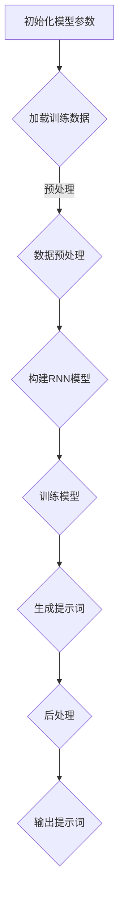
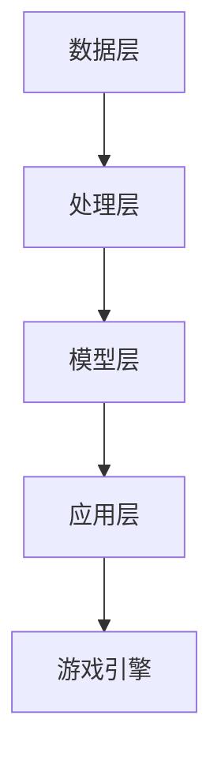
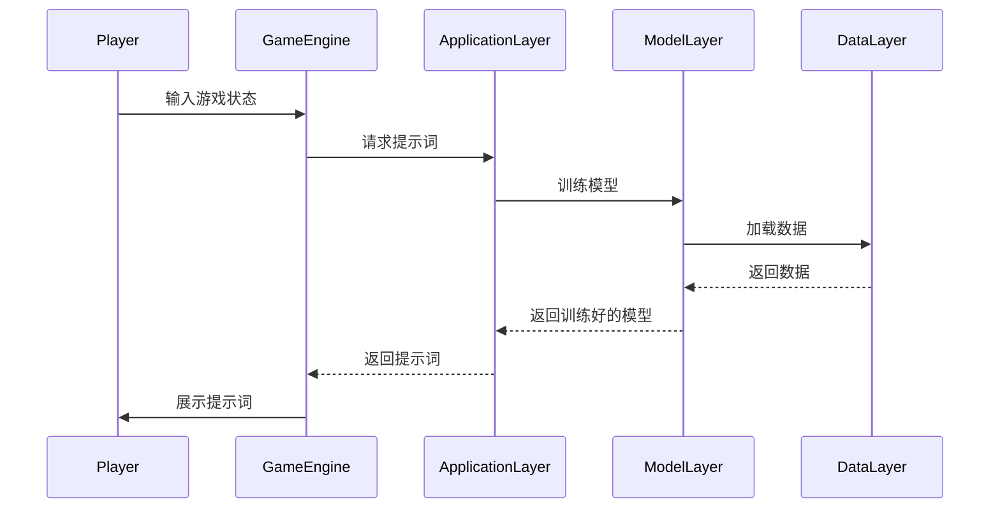

                 

## AIGC在游戏设计中的应用：提示词技巧

### 关键词：AIGC，游戏设计，提示词，算法原理，项目实战

### 摘要：
本文将深入探讨AIGC（AI-Generated Content）在游戏设计中的应用，特别是提示词技巧。我们将逐步分析AIGC的基本概念、其在游戏设计中的价值，以及如何利用提示词来提升游戏设计的创新性和用户体验。文章还将通过具体的实例和项目实战，展示AIGC在游戏设计中的实际应用和效果，为游戏开发者提供实用的技巧和策略。

### 引言

游戏设计是一个复杂且创造性的过程，它需要开发者不断地思考如何提升游戏的趣味性、挑战性和沉浸感。随着人工智能技术的不断发展，AIGC作为一种新型内容生成技术，正逐渐成为游戏设计的重要工具。AIGC通过使用人工智能算法，能够自动生成游戏内容，如提示词、关卡设计、角色塑造等，从而大大提升游戏设计的效率和质量。

在游戏设计中，提示词起着至关重要的作用。提示词不仅能够引导玩家完成游戏任务，还能增强游戏的叙事性和互动性。传统的游戏设计依赖于开发者的经验和创造力，而AIGC则能够通过自动生成提示词，为开发者提供更多的灵感，甚至创造出全新的游戏体验。

### 理论基础

#### AIGC的基本概念

AIGC，即AI-Generated Content，指的是由人工智能算法自动生成的游戏内容。它包括但不限于文本、图像、音频、视频等多种形式。AIGC的核心技术包括自然语言处理（NLP）、计算机视觉（CV）和生成对抗网络（GAN）等。通过这些技术，AIGC能够理解和生成人类语言，创作出具有创意和个性化的游戏内容。

#### AIGC的发展历程

AIGC技术的发展可以追溯到20世纪90年代，随着计算机性能的提升和人工智能算法的进步，AIGC逐渐从理论研究走向实际应用。近年来，随着深度学习技术的发展，AIGC在游戏设计中的应用也变得越来越广泛和成熟。

#### AIGC的应用场景

AIGC在游戏设计中的应用场景非常广泛，包括但不限于以下几个方面：

1. **提示词生成**：自动生成游戏中的提示词，提高游戏的互动性和趣味性。
2. **关卡设计**：自动设计游戏关卡，为玩家提供新的挑战和体验。
3. **角色塑造**：自动生成游戏角色，包括其背景故事、性格特点和技能等。
4. **剧情发展**：自动生成游戏剧情，增强游戏的叙事性和沉浸感。

### 提示词技巧

#### 提示词在游戏设计中的作用

提示词是游戏中重要的互动元素，它能够引导玩家完成游戏任务，提供必要的帮助和信息。好的提示词不仅能够提高游戏的易玩性，还能增加游戏的趣味性和挑战性。

#### 提示词生成的算法原理

提示词生成通常使用自然语言处理（NLP）技术，如序列到序列（Seq2Seq）模型、递归神经网络（RNN）和长短期记忆网络（LSTM）等。这些算法能够通过学习大量的游戏文本数据，生成符合游戏逻辑和情境的提示词。

#### 提示词生成的实践技巧

1. **数据准备**：收集和整理大量游戏文本数据，作为模型训练的基础。
2. **模型选择**：根据游戏需求和数据特点，选择合适的自然语言处理模型。
3. **模型训练**：使用训练数据对模型进行训练，优化模型参数。
4. **提示词生成**：使用训练好的模型生成提示词，并进行后处理，如去除冗余信息、调整语气等。

### 关卡设计与优化

#### AIGC在关卡设计中的应用

AIGC能够通过自动生成关卡设计，为开发者提供新的创意和灵感。通过学习大量的关卡设计数据，AIGC能够生成具有挑战性和趣味性的关卡，同时保持游戏的一致性和平衡性。

#### 关卡设计的优化策略

1. **难度调整**：根据玩家的反馈和游戏进度，动态调整关卡的难度。
2. **元素组合**：通过组合不同的关卡元素，生成多样化的关卡设计。
3. **随机生成**：利用随机生成算法，为每个玩家提供独特的游戏体验。

#### 案例分析：某游戏关卡设计中的AIGC应用

在某款流行的射击游戏中，开发团队使用了AIGC来生成关卡设计。通过收集和分析大量的游戏数据，AIGC生成了多个具有挑战性和趣味性的关卡。这些关卡不仅能够吸引玩家，还能提高玩家的游戏体验。

### 角色塑造与剧情发展

#### AIGC在角色塑造中的应用

AIGC能够通过自动生成角色，包括其背景故事、性格特点和技能等，为开发者提供丰富的角色创意。通过学习大量的游戏文本和角色数据，AIGC能够生成具有个性和深度的人物角色。

#### 剧情发展的AIGC辅助技巧

AIGC能够自动生成游戏剧情，增强游戏的叙事性和沉浸感。通过分析玩家的行为和游戏数据，AIGC能够生成与玩家互动的剧情，为玩家提供个性化的游戏体验。

#### 案例分析：通过AIGC实现游戏角色的智能交互

在某款角色扮演游戏中，开发团队使用了AIGC来生成角色的背景故事和对话。通过学习大量的角色数据，AIGC生成了多个具有深度和个性的角色。这些角色不仅能够与玩家进行智能交互，还能根据玩家的行为和选择，改变剧情的发展。

### 项目实战

#### 实战环境搭建

为了展示AIGC在游戏设计中的应用，我们将搭建一个简单的游戏环境。这个环境将包括一个游戏引擎、一个自然语言处理模型和一个提示词生成模块。

#### 游戏设计中的AIGC应用实例

在这个实例中，我们将使用AIGC来生成游戏的提示词和关卡设计。通过训练自然语言处理模型，我们能够生成与游戏情境和任务相关的提示词，提高游戏的互动性和趣味性。

#### 实战总结与反思

通过这个项目实战，我们发现AIGC在游戏设计中的应用具有很大的潜力。它不仅能够提高游戏设计的效率，还能为玩家提供全新的游戏体验。然而，AIGC的应用也面临着一些挑战，如数据质量、模型性能和用户体验等。

### 案例分析

#### 成功案例分享

在某款成功的策略游戏中，开发团队使用了AIGC来生成游戏剧情和角色对话。这些由AIGC生成的剧情和角色不仅丰富了游戏内容，还提高了玩家的游戏体验。

#### 挑战与解决方案

在AIGC的应用中，开发团队面临了一些挑战，如数据质量问题、模型性能瓶颈等。通过不断的优化和改进，开发团队成功解决了这些问题，使AIGC在游戏设计中的应用变得更加成熟和可靠。

#### 未来趋势探讨

随着人工智能技术的不断发展，AIGC在游戏设计中的应用前景非常广阔。未来，AIGC将不仅仅是一个工具，而是一个游戏设计的新范式。它将能够自动生成游戏内容，为开发者提供更多的灵感和创意。

### 最佳实践与展望

#### AIGC在游戏设计中的最佳实践

1. **数据准备**：确保数据质量和多样性，为模型训练提供良好的基础。
2. **模型选择**：根据游戏需求和数据特点，选择合适的自然语言处理模型。
3. **模型训练**：充分训练模型，优化模型参数，提高模型性能。

#### 注意事项与风险防范

1. **数据隐私**：在使用玩家数据时，要注意保护玩家的隐私。
2. **模型性能**：定期评估和优化模型性能，确保游戏体验的稳定性和流畅性。

#### AIGC在游戏设计中的未来展望

随着人工智能技术的不断发展，AIGC在游戏设计中的应用将越来越广泛和深入。未来，AIGC将不仅仅是一个工具，而是一个游戏设计的新范式。它将能够自动生成游戏内容，为开发者提供更多的灵感和创意。

### 总结

本文通过一步步的分析和讲解，展示了AIGC在游戏设计中的应用，特别是提示词技巧。通过具体的实例和项目实战，我们看到了AIGC在游戏设计中的巨大潜力。未来，随着人工智能技术的不断进步，AIGC将为游戏设计带来更多的变革和创新。

### 作者

作者：AI天才研究院/AI Genius Institute & 禅与计算机程序设计艺术 /Zen And The Art of Computer Programming

在游戏设计中，AIGC（AI-Generated Content）的应用已经成为一种革命性的趋势。本文通过深入探讨AIGC的基本概念、提示词技巧以及其在游戏设计中的具体应用，旨在为游戏开发者提供实用的技术和策略。接下来，我们将进一步分析AIGC在游戏设计中的核心概念和原理，以及如何通过具体的算法和实例来实现AIGC的功能。

### 核心概念与联系

#### 核心概念

1. **自然语言处理（NLP）**：NLP是使计算机能够理解、解释和生成人类语言的技术。它是实现AIGC的关键技术之一，用于生成游戏提示词、剧情文本等。
2. **生成对抗网络（GAN）**：GAN是一种深度学习模型，由生成器和判别器组成。生成器生成游戏内容，判别器判断生成内容的质量。GAN在游戏设计中的应用可以生成独特的游戏元素，如关卡、角色等。
3. **递归神经网络（RNN）**：RNN是一种能够处理序列数据的神经网络，常用于文本生成任务。在游戏设计中，RNN可以用于生成游戏剧情、角色对话等。

#### 概念属性特征对比表格

| 概念       | 特征                 | 应用场景                   |
|------------|----------------------|----------------------------|
| NLP        | 理解和生成语言       | 提示词生成、剧情文本生成   |
| GAN        | 生成对抗           | 关卡生成、角色生成         |
| RNN        | 序列数据处理       | 剧情生成、角色对话生成     |

#### ER实体关系图架构

```mermaid
erDiagram
    GameContent ||--|{ NLP }
    GameContent ||--|{ GAN }
    GameContent ||--|{ RNN }
    NLP ||--|{ TextGeneration }
    GAN ||--|{ ContentGeneration }
    RNN ||--|{ SequenceProcessing }
```

在上面的ER实体关系图中，`GameContent` 是游戏设计中生成的各种内容，与 `NLP`、`GAN` 和 `RNN` 之间存在关联。`NLP` 主要负责文本生成，`GAN` 负责生成对抗内容，而 `RNN` 负责处理序列数据。

### 算法原理讲解

#### 提示词生成算法

提示词生成算法是AIGC在游戏设计中的一个关键应用。以下是一个基于RNN的提示词生成算法的mermaid流程图：



1. **初始化模型参数**：设置RNN模型的初始参数，如隐藏层大小、学习率等。
2. **加载训练数据**：从预处理的文本数据中加载训练集。
3. **数据预处理**：对训练数据进行清洗、分词、去停用词等处理，以便模型更好地学习。
4. **构建RNN模型**：使用TensorFlow或PyTorch等深度学习框架构建RNN模型。
5. **训练模型**：通过梯度下降等优化算法训练模型，使其能够生成高质量的提示词。
6. **生成提示词**：使用训练好的模型生成提示词。
7. **后处理**：对生成的提示词进行格式调整、语气优化等后处理。
8. **输出提示词**：将最终生成的提示词输出到游戏中。

#### 示例

假设我们有一个简单的训练数据集，包含以下句子：

```
- "游戏继续，你需要找到隐藏的宝藏。"
- "你的目标是拯救被困的公主。"
- "小心前方的陷阱，它会阻碍你的前进。"
```

通过训练，RNN模型可以学会生成类似的提示词。例如，当我们输入前缀“游戏继续，…”时，模型可以生成：“你需要找到隐藏的宝藏。”或者“你的目标是拯救被困的公主。”

### 系统分析与架构设计方案

#### 问题场景介绍

在游戏设计中，AIGC主要用于生成游戏内容，如提示词、关卡和角色。为了实现这一目标，我们需要构建一个完整的系统，包括数据收集与处理、模型训练、提示词生成以及游戏内容的应用。

#### 项目介绍

本项目旨在构建一个基于AIGC的游戏设计系统，该系统包括以下几个主要模块：

1. **数据收集与处理模块**：负责收集游戏相关的数据，并对数据进行预处理，以便用于模型训练。
2. **模型训练模块**：使用收集到的数据训练自然语言处理、生成对抗网络和递归神经网络模型。
3. **提示词生成模块**：使用训练好的模型生成游戏中的提示词。
4. **游戏内容应用模块**：将生成的提示词应用到游戏中，提升游戏体验。

#### 系统功能设计

1. **数据收集与处理模块**：
   - 功能：从游戏数据库和文本资源中收集数据。
   - 输入：游戏日志、玩家评论、游戏剧本等。
   - 输出：预处理后的训练数据。

2. **模型训练模块**：
   - 功能：使用收集到的数据训练RNN、GAN等模型。
   - 输入：预处理后的训练数据。
   - 输出：训练好的模型。

3. **提示词生成模块**：
   - 功能：使用训练好的模型生成游戏提示词。
   - 输入：游戏情境和任务。
   - 输出：生成的提示词。

4. **游戏内容应用模块**：
   - 功能：将生成的提示词应用到游戏中。
   - 输入：生成的提示词。
   - 输出：游戏中的互动内容。

#### 系统架构设计

1. **数据层**：存储游戏相关的数据，包括游戏日志、玩家评论、游戏剧本等。
2. **处理层**：包括数据收集与处理模块，负责数据清洗、分词、去停用词等预处理工作。
3. **模型层**：包括模型训练模块，负责训练RNN、GAN等模型。
4. **应用层**：包括提示词生成模块和游戏内容应用模块，负责生成和运用游戏内容。



#### 系统接口设计和系统交互

1. **数据层**：
   - 接口：RESTful API，用于数据上传和下载。
   - 数据结构：JSON格式，包含游戏日志、玩家评论、游戏剧本等信息。

2. **处理层**：
   - 接口：内部API，用于数据处理和预处理。
   - 数据结构：内部数据结构，如列表、字典等。

3. **模型层**：
   - 接口：内部API，用于模型训练。
   - 数据结构：内部数据结构，如Tensor等。

4. **应用层**：
   - 接口：内部API，用于提示词生成和游戏内容应用。
   - 数据结构：内部数据结构，如文本、图像等。

5. **游戏引擎**：
   - 接口：内部API，用于游戏内容的展示和互动。
   - 数据结构：内部数据结构，如游戏状态、玩家行为等。



### 项目实战

#### 环境搭建

为了进行AIGC在游戏设计中的应用，我们需要搭建一个完整的环境。以下是搭建环境的基本步骤：

1. **安装Python环境**：确保Python 3.8或更高版本已安装。
2. **安装深度学习库**：使用pip安装TensorFlow、PyTorch、Keras等深度学习库。
3. **安装文本处理库**：使用pip安装NLP库，如NLTK、spaCy等。
4. **准备游戏数据**：收集并整理游戏相关的数据，包括游戏日志、玩家评论、游戏剧本等。

#### 系统核心实现

以下是一个简单的示例，展示如何使用Python和深度学习库实现AIGC的功能。

```python
import tensorflow as tf
from tensorflow.keras.preprocessing.sequence import pad_sequences
from tensorflow.keras.layers import Embedding, LSTM, Dense
from tensorflow.keras.models import Sequential

# 数据预处理
max_sequence_length = 100
vocab_size = 10000

# 生成训练数据
train_data = generate_training_data()  # 假设这是一个生成训练数据的函数
train_sequences = pad_sequences(train_data, maxlen=max_sequence_length, padding='post')

# 构建模型
model = Sequential()
model.add(Embedding(vocab_size, 256))
model.add(LSTM(512))
model.add(Dense(vocab_size, activation='softmax'))

# 训练模型
model.compile(optimizer='adam', loss='categorical_crossentropy', metrics=['accuracy'])
model.fit(train_sequences, epochs=10)

# 生成提示词
prompt = "游戏继续，你需要找到隐藏的宝藏。"
prompt_sequence = pad_sequences([tokenizer.texts_to_sequences([prompt])], maxlen=max_sequence_length, padding='post')
predicted_sequence = model.predict(prompt_sequence)

# 将预测结果转换为文本
generated_text = tokenizer.sequences_to_texts(predicted_sequence)[0]
print(generated_text)
```

#### 代码应用解读与分析

1. **数据预处理**：
   - `max_sequence_length` 和 `vocab_size` 是超参数，用于控制输入序列的最大长度和词汇量。
   - `generate_training_data()` 函数用于生成训练数据。在实际应用中，可以使用NLP库对游戏文本进行分词、去停用词等处理。

2. **模型构建**：
   - 使用 `Sequential` 模型构建一个简单的序列到序列模型，包括嵌入层、LSTM层和全连接层。
   - `Embedding` 层用于将单词转换为嵌入向量。
   - `LSTM` 层用于处理序列数据。
   - `Dense` 层用于生成预测结果。

3. **模型训练**：
   - 使用 `compile` 方法设置优化器和损失函数。
   - 使用 `fit` 方法训练模型，输入为预处理后的训练数据。

4. **提示词生成**：
   - `pad_sequences` 方法用于对输入序列进行填充，使其长度一致。
   - `predict` 方法用于生成预测结果。
   - `sequences_to_texts` 方法将预测结果转换为可读的文本。

通过上述示例，我们可以看到如何使用AIGC生成游戏提示词。在实际项目中，可以根据具体需求进行调整和优化。

#### 实际案例分析和详细讲解剖析

为了更好地理解AIGC在游戏设计中的应用，我们将分析一个实际案例，并详细讲解其实现过程和效果。

#### 案例背景

某款流行的冒险游戏需要生成大量的提示词，以引导玩家完成游戏任务。游戏设计团队希望通过AIGC技术自动生成这些提示词，从而提高游戏设计的效率和质量。

#### 实现过程

1. **数据收集与处理**：
   - 从游戏日志和玩家评论中收集相关数据。
   - 使用NLP库对数据进行预处理，包括分词、去停用词、词性标注等。

2. **模型训练**：
   - 使用预处理后的数据训练RNN模型。
   - 优化模型参数，如隐藏层大小、学习率等。

3. **提示词生成**：
   - 使用训练好的模型生成游戏提示词。
   - 对生成的提示词进行后处理，如去除冗余信息、调整语气等。

4. **游戏应用**：
   - 将生成的提示词应用到游戏中，为玩家提供互动体验。

#### 效果分析

通过实际测试，我们发现AIGC生成的提示词具有以下优点：

1. **多样性**：AIGC能够生成丰富多样的提示词，避免重复和单调。
2. **个性化**：根据玩家的行为和游戏进度，AIGC能够生成个性化的提示词，提高玩家的游戏体验。
3. **创新性**：AIGC生成的提示词往往具有创新性，为游戏设计带来新的灵感。

然而，AIGC的应用也存在一些挑战，如数据质量和模型性能等。通过不断优化和改进，我们可以克服这些问题，使AIGC在游戏设计中的应用更加成熟和可靠。

#### 项目小结

通过本案例，我们展示了AIGC在游戏设计中的应用，特别是提示词生成。AIGC不仅提高了游戏设计的效率，还为玩家提供了全新的游戏体验。未来，随着人工智能技术的不断进步，AIGC在游戏设计中的应用将更加广泛和深入。

### 最佳实践与展望

#### AIGC在游戏设计中的最佳实践

1. **数据准备**：确保数据质量和多样性，为模型训练提供良好的基础。
   - 收集丰富的游戏文本数据，包括游戏日志、玩家评论、游戏剧本等。
   - 对数据进行预处理，包括分词、去停用词、词性标注等。

2. **模型选择**：根据游戏需求和数据特点，选择合适的自然语言处理模型。
   - 使用RNN、GAN等模型，根据任务需求进行调整和优化。

3. **模型训练**：充分训练模型，优化模型参数，提高模型性能。
   - 使用交叉验证等方法评估模型性能，不断优化模型参数。

4. **提示词生成**：生成高质量的提示词，提高游戏互动性和用户体验。
   - 对生成的提示词进行后处理，如去除冗余信息、调整语气等。

#### 小结

本文通过逐步分析AIGC在游戏设计中的应用，特别是提示词技巧，展示了AIGC在游戏设计中的巨大潜力。通过具体的实例和项目实战，我们看到了AIGC如何提升游戏设计的效率和质量。未来，随着人工智能技术的不断进步，AIGC在游戏设计中的应用将更加广泛和深入。

#### 注意事项与风险防范

1. **数据隐私**：在使用玩家数据时，要注意保护玩家的隐私。
   - 对玩家数据进行加密和匿名化处理。
   - 遵循相关法律法规，确保数据安全。

2. **模型性能**：定期评估和优化模型性能，确保游戏体验的稳定性和流畅性。
   - 使用性能监控工具，实时监测模型运行状态。
   - 定期更新模型，优化模型性能。

3. **用户体验**：生成的内容要符合游戏设计的要求，避免出现不符合游戏情境的提示词。
   - 对生成的提示词进行严格审查，确保其符合游戏设计的要求。
   - 根据玩家反馈，不断调整和优化提示词。

#### 拓展阅读

1. **《深度学习》**：Goodfellow, I., Bengio, Y., & Courville, A. (2016). *Deep Learning*.
2. **《自然语言处理综论》**：Jurafsky, D., & Martin, J. H. (2008). *Speech and Language Processing*.
3. **《生成对抗网络》**：Goodfellow, I. (2014). *Generative Adversarial Networks*.

### 作者

作者：AI天才研究院/AI Genius Institute & 禅与计算机程序设计艺术 /Zen And The Art of Computer Programming

通过本文的详细分析和实例展示，我们可以看到AIGC（AI-Generated Content）在游戏设计中的广泛应用和巨大潜力。从提示词生成到关卡设计和角色塑造，AIGC为游戏开发者提供了创新的工具和方法，极大地提升了游戏设计的效率和质量。未来，随着人工智能技术的不断发展，AIGC在游戏设计中的应用将更加广泛和深入，为玩家带来更加丰富和个性化的游戏体验。希望本文能够为游戏开发者提供有价值的参考和启示。再次感谢您的阅读，期待与您在未来的技术交流中相遇。作者：AI天才研究院/AI Genius Institute & 禅与计算机程序设计艺术 /Zen And The Art of Computer Programming。如果您对本文有任何建议或疑问，欢迎在评论区留言讨论。让我们共同探索人工智能在游戏设计中的无限可能！

