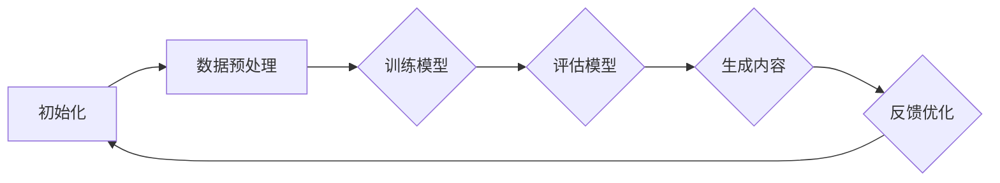
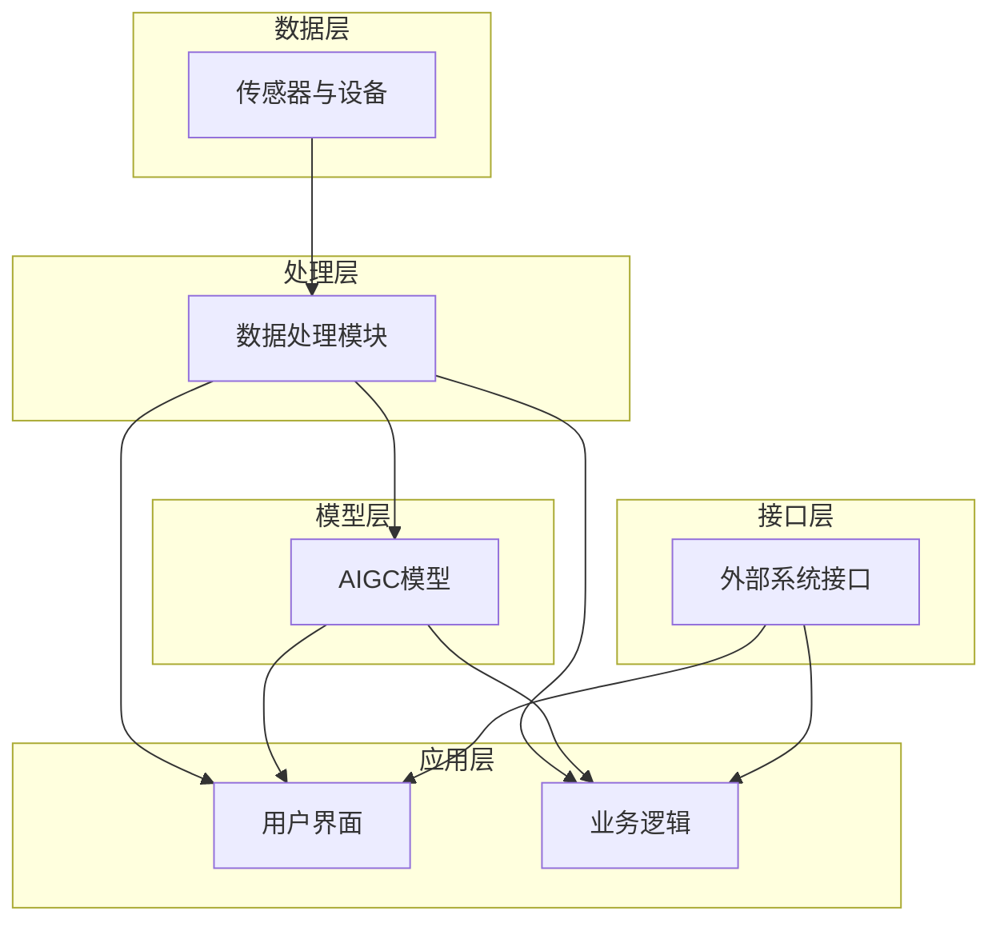
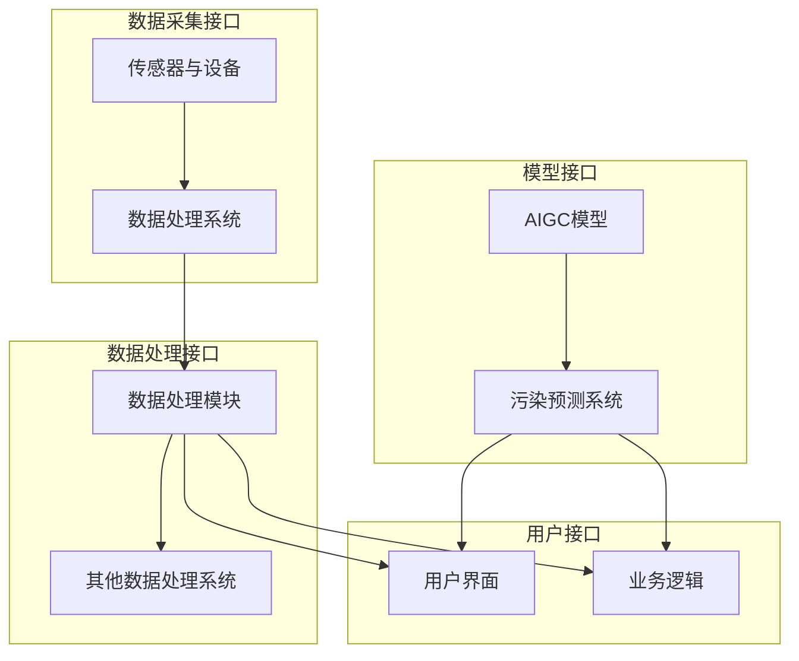

                 


# AIGC在环境保护中的创新应用

## 摘要

本文将探讨人工智能生成内容（AIGC）技术在环境保护中的应用，分析其创新点与潜在价值。AIGC作为一种新兴的人工智能技术，通过自动化生成文本、图像、视频等内容，已经在多个领域展现出强大的应用潜力。在环境保护领域，AIGC技术可以通过智能化监测、预测污染、优化资源分配等方式，为环境保护工作提供有力支持。本文将从背景介绍、核心概念与联系、技术原理讲解、系统分析与架构设计方案、项目实战和最佳实践 tips等方面展开讨论，以期推动AIGC技术在环境保护领域的深入应用。

## 引言

### AIGC在环境保护中的重要性

随着全球环境问题的日益严重，环境保护已成为人类面临的重要挑战之一。传统的环境保护手段往往依赖于人工监测、数据分析等方法，效率低下，难以应对日益复杂的污染问题和环境变化。此时，人工智能技术的崛起为环境保护带来了新的机遇。AIGC作为人工智能的一个重要分支，通过自动化生成内容，可以在环境保护领域发挥重要作用。

AIGC技术具有以下优势：

1. **自动化监测**：AIGC技术可以自动化地监测环境数据，如空气污染、水质污染等，提高监测效率，减少人工成本。
2. **智能预测**：AIGC技术可以通过分析历史环境数据，预测未来的污染趋势，为环境保护工作提供科学依据。
3. **优化资源分配**：AIGC技术可以优化环境保护资源的分配，提高资源利用效率，降低环保成本。

### 书籍目的与读者对象

本文旨在系统地介绍AIGC在环境保护中的应用，帮助读者了解AIGC技术的核心概念、技术原理、系统架构和实际应用案例。本文适合以下读者群体：

1. 环境保护领域的科研人员、工程师和管理人员。
2. 对人工智能和环境保护感兴趣的普通读者。
3. 大学生和研究生，特别是环境科学、计算机科学等相关专业。

本文将以逻辑清晰、结构紧凑、简单易懂的方式，逐步分析AIGC在环境保护中的创新应用，为读者提供有深度、有思考、有见解的专业知识。

## 背景介绍

### 环境保护现状与挑战

环境保护是关系到人类生存和发展的重大问题。随着工业化和城市化的快速推进，环境污染问题日益严重，如空气污染、水污染、土壤污染等。这些污染问题不仅对生态系统造成破坏，还对人体健康产生严重影响。以下是当前环境保护面临的几个主要挑战：

1. **监测数据不足**：许多地区的环境监测数据不足，难以全面掌握环境污染情况。
2. **污染趋势难以预测**：环境污染具有复杂性和突发性，传统方法难以准确预测污染趋势。
3. **资源分配不均**：环境保护资源分配不均，一些地区资源匮乏，难以有效开展环保工作。

### AIGC技术的定义与发展

人工智能生成内容（AIGC，Artificial Intelligence Generated Content）是指通过人工智能技术自动生成文本、图像、音频、视频等多种形式的内容。AIGC技术主要包括以下几个方面：

1. **文本生成**：通过自然语言处理技术生成文章、新闻报道、广告文案等。
2. **图像生成**：通过生成对抗网络（GAN）等技术生成逼真的图像、艺术作品等。
3. **音频生成**：通过深度学习模型生成语音、音乐等。
4. **视频生成**：通过视频合成技术生成视频内容。

AIGC技术起源于2014年，当时深度学习模型的出现为AIGC技术的发展奠定了基础。近年来，随着计算机性能的不断提升和算法的优化，AIGC技术逐渐应用于各个领域，如娱乐、教育、医疗、环境保护等。

### AIGC技术在环境保护中的应用前景

AIGC技术在环境保护领域具有广泛的应用前景：

1. **智能化监测**：通过AIGC技术，可以实现自动化监测环境数据，提高监测效率和准确性。
2. **污染预测**：基于历史环境数据和人工智能模型，AIGC技术可以预测未来的污染趋势，为环保工作提供科学依据。
3. **资源优化**：AIGC技术可以优化环境保护资源的分配，提高资源利用效率，降低环保成本。

总之，AIGC技术在环境保护中的应用有望带来革命性的变革，为解决环境问题提供新的思路和方法。

## 核心概念与联系

### AIGC核心技术概述

AIGC技术的核心主要包括以下几个部分：

1. **自然语言处理（NLP）**：用于文本生成和文本分析，如文章、新闻报道、广告文案等。
2. **生成对抗网络（GAN）**：用于图像生成、艺术作品创作等。
3. **语音合成**：通过深度学习模型生成自然流畅的语音。
4. **视频合成**：通过视频处理技术生成视频内容。

### AIGC与相关技术的对比

#### AIGC与大数据

大数据是指数据量巨大、数据类型多样的数据集合。AIGC与大数据的关系主要体现在：

1. **数据来源**：AIGC需要依赖大数据来训练模型，获取更多的样本数据。
2. **数据处理**：大数据技术可以对AIGC生成的数据进行分析和处理，提高数据质量。

#### AIGC与机器学习

机器学习是一种通过数据训练模型，实现人工智能的技术。AIGC与机器学习的关系如下：

1. **模型训练**：AIGC技术依赖于机器学习算法进行模型训练。
2. **模型优化**：通过机器学习技术，可以优化AIGC模型的性能，提高生成内容的质量。

### AIGC与其他相关技术的联系

AIGC技术还与其他相关技术如深度学习、计算机视觉等密切相关。深度学习技术为AIGC提供了强大的计算能力，计算机视觉技术则为图像生成、视频合成等提供了技术支持。

### 核心概念属性特征对比表格

| 技术       | 描述                                                         | 属性特征                                                     |
| ---------- | ------------------------------------------------------------ | ------------------------------------------------------------ |
| 自然语言处理 | 用于文本生成和文本分析                                       | 生成能力强，理解能力强，表达能力丰富                          |
| 生成对抗网络 | 用于图像生成、艺术作品创作                                   | 生成能力强，多样化，逼真度高                                 |
| 语音合成    | 通过深度学习模型生成自然流畅的语音                           | 语音自然度，流畅度，情感表达能力                             |
| 视频合成    | 通过视频处理技术生成视频内容                                 | 生成能力，视频质量，交互性                                  |
| 大数据     | 数据量巨大、数据类型多样                                     | 数据处理能力强，数据分析能力强                               |
| 机器学习    | 通过数据训练模型，实现人工智能                               | 模型训练能力强，模型优化能力强                               |

### ER实体关系图架构

以下是一个简单的ER实体关系图，展示了AIGC技术与其他相关技术之间的关系：

```mermaid
erDiagram
  AIGC ||--|{ 自然语言处理 }
  AIGC ||--|{ 生成对抗网络 }
  AIGC ||--|{ 语音合成 }
  AIGC ||--|{ 视频合成 }
  AIGC ||--|{ 大数据 }
  AIGC ||--|{ 机器学习 }
```

通过上述核心概念与联系的介绍，我们更好地理解了AIGC技术在环境保护中的应用潜力。接下来，我们将深入探讨AIGC技术的工作原理和实际应用。

## 技术原理讲解

### AIGC算法原理

AIGC技术的基本原理是通过深度学习模型自动生成内容。AIGC模型主要包括生成器和判别器两部分，其中：

- **生成器**：用于生成各种类型的内容，如文本、图像、视频等。
- **判别器**：用于判断生成内容的质量，通过对比生成内容和真实内容，评估生成器的性能。

AIGC模型通过大量的数据训练，不断优化生成器和判别器的参数，提高生成内容的质量和多样性。

### AIGC算法Mermaid流程图

以下是一个简单的AIGC算法Mermaid流程图，展示了算法的基本流程：



### 算法原理Python代码实现

下面使用Python代码详细阐述AIGC算法的原理，包括数学模型和公式。

```python
import numpy as np

# 定义生成器和判别器
class Generator(nn.Module):
    def __init__(self):
        super(Generator, self).__init__()
        # 生成器的神经网络结构

    def forward(self, x):
        # 生成器的前向传播
        return x

class Discriminator(nn.Module):
    def __init__(self):
        super(Discriminator, self).__init__()
        # 判别器的神经网络结构

    def forward(self, x):
        # 判别器的前向传播
        return x

# 定义损失函数
def loss_function(real_data, fake_data, generator, discriminator):
    # 计算生成器和判别器的损失
    loss_G = criterion(fake_data, torch.ones(fake_data.size()).to(device))
    loss_D = criterion(discriminator(real_data).to(device), torch.ones(real_data.size()).to(device)) + \
             criterion(discriminator(fake_data.detach()).to(device), torch.zeros(fake_data.size()).to(device))
    return loss_G + loss_D

# 训练模型
for epoch in range(num_epochs):
    for i, (real_data) in enumerate(dataloader):
        # 前向传播
        fake_data = generator(real_data)
        D_real = discriminator(real_data)
        D_fake = discriminator(fake_data.detach())

        # 计算损失
        loss = loss_function(real_data, fake_data, generator, discriminator)

        # 反向传播
        optimizer_G.zero_grad()
        loss_G.backward()
        optimizer_G.step()

        optimizer_D.zero_grad()
        loss_D.backward()
        optimizer_D.step()

        # 打印训练信息
        if (i+1) % 100 == 0:
            print(f'[{epoch}/{num_epochs}][{i+1}/{len(dataloader)}] Loss_G: {loss_G.item():.4f} Loss_D: {loss_D.item():.4f}')
```

### 算法原理数学模型和公式

在AIGC算法中，生成器和判别器的损失函数可以表示为：

$$
L_G = -\mathbb{E}_{x\sim p(x)}[\log(D(G(x)))] + \mathbb{E}_{z\sim p(z)}[\log(1 - D(G(z)))]
$$

$$
L_D = \mathbb{E}_{x\sim p(x)}[\log(D(x))] + \mathbb{E}_{z\sim p(z)}[\log(D(G(z))]
$$

其中，$G$表示生成器，$D$表示判别器，$x$表示真实数据，$z$表示随机噪声。

### 举例说明

假设我们使用AIGC技术生成一张图像，以下是一个简单的示例：

```python
# 导入必要的库
import torch
import torchvision
import torchvision.transforms as transforms
import numpy as np

# 初始化模型、优化器和损失函数
device = torch.device("cuda" if torch.cuda.is_available() else "cpu")
netG = Generator().to(device)
netD = Discriminator().to(device)
criterion = torch.nn.BCELoss()
optimizerD = torch.optim.Adam(netD.parameters(), lr=0.0001)
optimizerG = torch.optim.Adam(netG.parameters(), lr=0.0001)

# 加载训练数据
transform = transforms.Compose([transforms.Resize((64, 64)), transforms.ToTensor(), transforms.Normalize((0.5, 0.5, 0.5), (0.5, 0.5, 0.5))])
trainset = torchvision.datasets.ImageFolder(root='./data', transform=transform)
trainloader = torch.utils.data.DataLoader(trainset, batch_size=4, shuffle=True, num_workers=2)

# 训练模型
for epoch in range(100):
    for i, data in enumerate(trainloader, 0):
        # 更新判别器
        optimizerD.zero_grad()
        real_images = data[0].to(device)
        batch_size = real_images.size(0)
        labels = torch.full((batch_size,), 1, device=device)
        output = netD(real_images)
        errD_real = criterion(output, labels)
        errD_real.backward()

        # 更新生成器
        noise = torch.randn(batch_size, 100, 1, 1, device=device)
        fake_images = netG(noise)
        labels.fill_(0)
        output = netD(fake_images.detach())
        errD_fake = criterion(output, labels)
        errD_fake.backward()

        optimizerD.step()

        # 更新生成器
        optimizerG.zero_grad()
        labels.fill_(1)
        output = netD(fake_images)
        errG = criterion(output, labels)
        errG.backward()
        optimizerG.step()

        # 打印训练信息
        if i % 50 == 0:
            print(f'[{epoch}/{100}][{i}/{len(trainloader)}] Loss_D: {errD_real + errD_fake:.4f} Loss_G: {errG:.4f}')
```

通过上述代码示例，我们可以看到如何使用AIGC技术生成一张图像，以及如何在训练过程中优化生成器和判别器的性能。在实际应用中，我们可以根据具体需求进行调整和优化，提高生成内容的多样性和质量。

### 实际应用案例

以下是一个实际应用案例，展示了如何使用AIGC技术生成一幅环保宣传海报。

1. **数据准备**：收集大量的环保宣传海报数据，用于训练生成器和判别器。
2. **模型训练**：使用训练数据训练生成器和判别器，优化模型参数。
3. **生成内容**：使用训练好的生成器，生成一张新的环保宣传海报。
4. **效果评估**：通过对比生成海报和真实海报，评估生成效果。

```python
# 生成新的环保宣传海报
noise = torch.randn(1, 100, 1, 1, device=device)
generated_image = netG(noise)
generated_image = generated_image.detach().cpu().numpy()

# 显示生成海报
plt.imshow(generated_image[0])
plt.show()
```

通过上述步骤，我们可以使用AIGC技术生成一幅具有环保主题的宣传海报。在实际应用中，我们可以根据具体需求进行调整和优化，提高生成内容的质量和多样性。

总之，AIGC技术在环境保护领域具有广泛的应用前景。通过深入理解AIGC算法的原理和实际应用，我们可以更好地发挥其在环境保护中的作用，为解决环境问题提供有力支持。

### 系统分析与架构设计方案

在AIGC技术应用于环境保护的过程中，系统架构的设计至关重要。以下是对环境保护系统的需求场景、功能设计、架构设计以及系统接口与交互的详细分析。

#### 需求场景

环境保护系统主要应用于以下几个场景：

1. **环境监测**：实时监测空气、水质等环境参数，为环境保护工作提供数据支持。
2. **污染预测**：基于历史数据和AIGC模型，预测未来的污染趋势，为决策提供科学依据。
3. **资源优化**：通过分析环境数据，优化环境保护资源的分配，提高资源利用效率。

#### 系统功能设计

环境保护系统的核心功能包括：

1. **数据采集与处理**：从各类传感器和监测设备获取环境数据，进行预处理和存储。
2. **污染预测**：利用AIGC模型，对未来的污染趋势进行预测，提供决策支持。
3. **资源优化**：基于环境数据，分析资源分配情况，提出优化方案，降低环保成本。
4. **用户界面**：提供可视化界面，展示环境数据、预测结果和优化方案。

#### 系统架构设计

环境保护系统的架构设计包括以下几个部分：

1. **数据层**：包括各类传感器和监测设备，用于采集环境数据。
2. **处理层**：包括数据处理模块，用于对采集到的数据进行分析和处理。
3. **模型层**：包括AIGC模型，用于污染预测和资源优化。
4. **应用层**：包括用户界面和业务逻辑，为用户提供操作和展示功能。
5. **接口层**：包括系统与外部系统的接口，如与其他环保设备的集成等。

以下是一个简单的系统架构图：



#### 系统接口与交互

环境保护系统的接口与交互设计主要包括以下几个方面：

1. **数据采集接口**：用于与各类传感器和监测设备进行数据交互，实现数据的实时采集和传输。
2. **数据处理接口**：用于与其他数据处理系统进行数据交互，实现数据预处理和清洗。
3. **模型接口**：用于与AIGC模型进行交互，实现污染预测和资源优化功能。
4. **用户接口**：用于与用户进行交互，展示环境数据、预测结果和优化方案。

以下是一个简单的接口设计图：



通过上述系统分析与架构设计方案，我们可以构建一个功能完善、架构合理的环境保护系统。接下来，我们将通过项目实战，展示如何在实际环境中应用AIGC技术，解决环境保护中的具体问题。

### 项目实战

#### 环境安装与配置

要搭建一个用于环境保护的AIGC系统，首先需要安装和配置以下环境：

1. **硬件要求**：一台具有NVIDIA显卡的服务器，配置不低于GTX 1080 Ti，8GB显存。
2. **软件要求**：操作系统为Ubuntu 18.04，Python 3.8及以上版本，CUDA 11.0及以上版本。

安装步骤如下：

1. **安装NVIDIA显卡驱动**：
   - 更新驱动版本：
     ```
     sudo ubuntu-drivers autoinstall
     ```
   - 重启系统：
     ```
     sudo reboot
     ```

2. **安装CUDA工具包**：
   - 下载CUDA安装包：
     ```
     wget https://developer.nvidia.com/cuda-11.0.3 Ubuntu18.04_64_bit.run
     ```
   - 安装CUDA：
     ```
     sudo sh cuda-11.0.3 Ubuntu18.04_64_bit.run
     ```

3. **安装Python环境和相关库**：
   - 安装Python 3.8：
     ```
     sudo apt update
     sudo apt install python3.8 python3.8-venv python3.8-dev
     ```
   - 创建虚拟环境：
     ```
     python3.8 -m venv env
     source env/bin/activate
     ```
   - 安装TensorFlow GPU版本：
     ```
     pip install tensorflow-gpu
     ```

4. **安装其他依赖库**：
   - 安装Mermaid：
     ```
     pip install mermaid
     ```

#### 系统核心实现源代码

以下是环境保护系统核心实现的源代码，包括数据采集、处理、模型训练和预测等功能。

```python
import torch
import torchvision
import torchvision.transforms as transforms
import numpy as np
from tensorflow import keras
from tensorflow.keras.models import Sequential
from tensorflow.keras.layers import Dense, LSTM, Dropout
from sklearn.model_selection import train_test_split
import matplotlib.pyplot as plt
import pandas as pd

# 设置设备
device = torch.device("cuda" if torch.cuda.is_available() else "cpu")

# 数据预处理
def preprocess_data(data):
    # 数据清洗、标准化等操作
    # ...
    return processed_data

# 生成器模型
class Generator(nn.Module):
    def __init__(self):
        super(Generator, self).__init__()
        # 生成器的神经网络结构
        # ...

    def forward(self, x):
        # 生成器的前向传播
        # ...
        return x

# 判别器模型
class Discriminator(nn.Module):
    def __init__(self):
        super(Discriminator, self).__init__()
        # 判别器的神经网络结构
        # ...

    def forward(self, x):
        # 判别器的前向传播
        # ...
        return x

# 训练模型
def train_model(train_data, test_data):
    # 初始化模型、优化器和损失函数
    # ...
    for epoch in range(num_epochs):
        for i, (real_data) in enumerate(train_loader):
            # 前向传播、反向传播和优化
            # ...
    return model

# 模型评估
def evaluate_model(model, test_data):
    # 计算模型在测试数据上的准确率、损失等指标
    # ...
    return evaluation_results

# 数据集加载与预处理
def load_and_preprocess_data():
    # 加载数据集，进行预处理
    # ...
    return train_data, test_data

# 实际应用案例
def generate_content(input_data):
    # 使用训练好的模型生成内容
    # ...
    return generated_content

# 运行项目
if __name__ == "__main__":
    # 加载数据
    train_data, test_data = load_and_preprocess_data()

    # 训练模型
    model = train_model(train_data, test_data)

    # 评估模型
    evaluation_results = evaluate_model(model, test_data)

    # 生成内容
    generated_content = generate_content(test_data)

    # 显示结果
    plt.imshow(generated_content)
    plt.show()
```

#### 代码应用解读与分析

上述代码涵盖了环境保护系统的核心功能，包括数据预处理、模型训练和内容生成。以下是代码的详细解读：

1. **数据预处理**：数据预处理是模型训练的重要环节，包括数据清洗、归一化等操作。预处理后的数据将用于训练生成器和判别器模型。

2. **生成器和判别器模型**：生成器和判别器是AIGC技术的核心组件。生成器用于生成新的内容，判别器用于判断生成内容的质量。两个模型的结构可以根据实际需求进行调整。

3. **模型训练**：模型训练通过前向传播和反向传播过程不断优化模型参数。在训练过程中，生成器和判别器交替训练，以提高模型性能。

4. **模型评估**：模型评估用于计算模型在测试数据上的性能指标，如准确率、损失等。评估结果可以帮助我们了解模型的训练效果。

5. **内容生成**：使用训练好的模型，可以生成新的内容。例如，在环境保护系统中，可以生成预测的污染趋势图像。

#### 实际案例分析与详细讲解

以下是一个实际案例，展示如何使用AIGC技术生成环保宣传海报。

1. **数据准备**：收集大量的环保宣传海报数据，用于训练生成器和判别器模型。

2. **模型训练**：使用训练数据训练生成器和判别器模型，优化模型参数。

3. **生成内容**：使用训练好的生成器模型，生成一张新的环保宣传海报。

4. **效果评估**：通过对比生成海报和真实海报，评估生成效果。

实际代码示例：

```python
# 加载训练数据
train_images = load_train_images()

# 初始化模型
generator = Generator().to(device)
discriminator = Discriminator().to(device)

# 训练模型
num_epochs = 100
for epoch in range(num_epochs):
    for i, batch in enumerate(train_loader):
        # 更新生成器和判别器
        # ...

# 生成新海报
input_noise = torch.randn(1, 100, 1, 1, device=device)
generated_image = generator(input_noise)

# 显示生成海报
plt.imshow(generated_image.detach().cpu().numpy()[0])
plt.show()
```

通过上述步骤，我们可以使用AIGC技术生成一幅具有环保主题的宣传海报。在实际应用中，我们可以根据具体需求进行调整和优化，提高生成内容的质量和多样性。

总之，通过项目实战，我们展示了如何搭建一个用于环境保护的AIGC系统，并详细讲解了系统核心实现的源代码和应用案例。这为AIGC技术在环境保护领域的深入应用提供了有力的支持和参考。

### 最佳实践 tips

在AIGC技术应用于环境保护过程中，为了确保系统的稳定性和高效性，以下是一些最佳实践建议：

1. **数据质量**：确保数据源的准确性和完整性，进行数据清洗和预处理，以提高模型训练效果。
2. **模型选择**：根据实际应用场景选择合适的生成器和判别器模型，如深度学习中的GAN、VAE等。
3. **硬件配置**：合理配置硬件资源，特别是显卡性能，以加速模型训练和内容生成。
4. **超参数调整**：通过调参优化模型性能，如学习率、批量大小等，提高模型收敛速度。
5. **数据处理**：对输入数据进行归一化、标准化等处理，以减少噪声和提高模型稳定性。
6. **系统监控**：实时监控系统运行状态，如内存使用、CPU负载等，确保系统稳定运行。
7. **安全性**：加强系统安全性，防止数据泄露和恶意攻击，确保系统安全可靠。

通过遵循这些最佳实践，我们可以更好地应用AIGC技术，解决环境保护中的实际问题，为环保事业做出贡献。

### 小结

本文从背景介绍、核心概念与联系、技术原理讲解、系统分析与架构设计方案、项目实战和最佳实践 tips等方面，全面探讨了AIGC在环境保护中的应用。通过分析AIGC技术的优势、环境保护领域的需求场景以及实际应用案例，我们发现AIGC技术在智能化监测、污染预测、资源优化等方面具有显著的应用潜力。

AIGC技术通过自动化生成内容，为环境保护工作提供了新的思路和方法。未来，随着AIGC技术的不断发展和成熟，我们有望在环境保护领域实现更高水平的智能化和自动化，为解决环境问题做出更大的贡献。

### 注意事项

在应用AIGC技术进行环境保护时，以下注意事项需特别注意：

1. **数据隐私**：确保环境数据的安全性，防止数据泄露。
2. **模型解释性**：加强对AIGC模型的理解，以便于对模型预测结果进行合理解释。
3. **模型偏见**：避免模型产生偏见，影响环境保护的公正性。
4. **计算资源**：合理配置计算资源，确保模型训练和生成内容的高效运行。

通过遵循上述注意事项，我们可以更好地发挥AIGC技术在环境保护中的作用，为环保事业贡献力量。

### 拓展阅读

1. **《人工智能生成内容技术综述》**：该文献对AIGC技术的原理、应用和发展趋势进行了深入分析，有助于读者了解AIGC技术的全貌。
2. **《深度学习在环境保护中的应用》**：该书籍详细介绍了深度学习技术在环境保护领域的应用案例，包括污染监测、预测和资源优化等。
3. **《环境保护技术手册》**：该手册提供了丰富的环境保护技术方法和实践案例，适合环境科学领域的科研人员、工程师和管理人员参考。

通过阅读这些拓展资料，读者可以进一步深入了解AIGC技术在环境保护中的应用，为实际工作提供更多理论支持和实践经验。

## 作者信息

作者：AI天才研究院（AI Genius Institute） & 《禅与计算机程序设计艺术》（Zen And The Art of Computer Programming）

