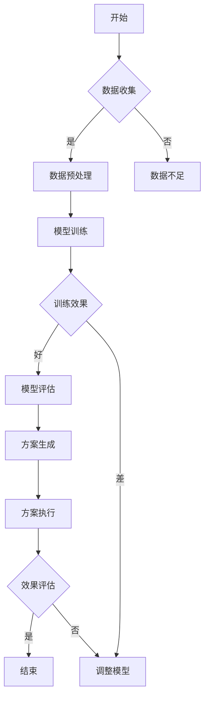
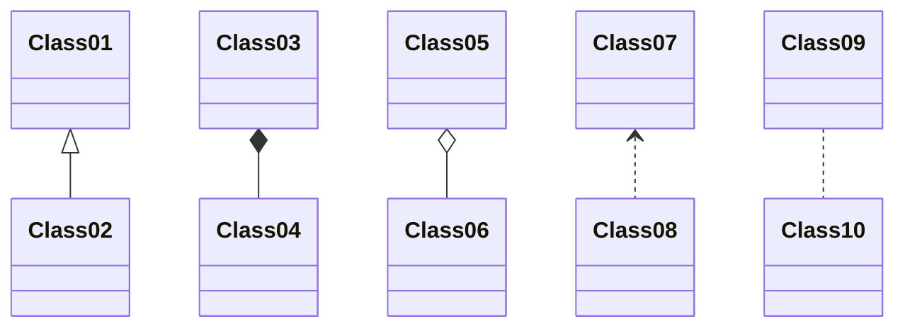

                 

# AIGC在环境修复技术中的应用：生态系统重建提示词

## 关键词

- AIGC
- 环境修复
- 生态系统重建
- 提示词
- 深度学习
- 自然语言处理
- 计算机视觉

## 摘要

随着全球环境问题的日益严重，环境修复技术成为当前研究的热点。本文将探讨人工智能生成控制（AIGC）在生态系统重建中的应用，特别是通过提示词生成技术来实现生态系统的自动恢复。文章首先介绍了AIGC的概念及其在环境修复中的潜在作用，随后详细讨论了AIGC的核心原理和技术，如深度学习、自然语言处理和计算机视觉。接着，通过实际案例展示了AIGC在生态系统重建中的应用，并分析了其系统设计和实施过程。文章最后提出了AIGC在未来生态系统修复技术中的发展方向和挑战。

## 引言

### 环境修复的背景和现状

环境修复是20世纪后半叶以来环境保护领域的一个重要分支，其目的是通过工程和自然手段恢复受损的生态系统，使其恢复到接近或达到原始状态。随着全球工业化和城市化进程的加速，环境污染和生态破坏问题日益严重。空气污染、水体污染、土壤退化等问题不仅威胁到人类健康，也对生物多样性构成威胁。

生态系统修复技术的核心目标包括恢复生态系统的结构和功能，提高生物多样性，改善生态系统服务，如水源保护、气候调节和土壤保持。然而，传统的生态系统修复方法往往耗时较长、成本较高，且在复杂环境中效果有限。

### AIGC的概念及其重要性

人工智能生成控制（AIGC，Artificial Intelligence Generated Control）是近年来发展起来的一项技术，它结合了人工智能（AI）、生成模型（Generative Models）和控制理论（Control Theory）的优势，能够在各种领域实现自动化和智能化。AIGC通过深度学习算法，如生成对抗网络（GANs）、变换器（Transformers）等，可以生成高质量的数据和模型，并在控制过程中发挥关键作用。

在环境修复技术中，AIGC的应用具有显著优势。首先，AIGC可以通过大规模数据训练生成具有高度多样性和适应性的生态系统模型，提高修复方案的精度和效率。其次，AIGC可以实现生态系统的动态调整和自我修复，更好地适应环境变化。此外，AIGC还可以通过自然语言处理和计算机视觉等技术，生成和识别生态系统中的复杂模式，为修复工作提供重要信息支持。

## AIGC的定义和组成部分

### AIGC的定义

人工智能生成控制（AIGC）是一种利用人工智能技术来生成和控制系统的方法。它通过生成模型（如GANs、变换器等）生成数据，并通过控制算法（如优化算法、强化学习等）调整生成结果，以达到特定的目标。AIGC的核心在于其生成和控制两个环节的有机结合，能够在大量数据和高复杂度的环境中实现高效的模型生成和系统控制。

### AIGC的组成部分

AIGC主要由以下几部分组成：

1. **生成模型（Generative Models）**：生成模型是AIGC的核心组成部分，用于生成高质量的数据和模型。常见的生成模型包括生成对抗网络（GANs）、变换器（Transformers）和变分自编码器（VAEs）等。这些模型通过学习大量数据，可以生成与真实数据高度相似的新数据，从而为系统控制提供丰富的信息来源。

2. **控制算法（Control Algorithms）**：控制算法用于调整生成模型的输出，以实现特定的控制目标。常见的控制算法包括优化算法（如梯度下降、遗传算法等）、强化学习算法（如Q-learning、SARSA等）和模型预测控制（MPC）等。这些算法可以根据系统状态和目标，生成最优的控制策略，实现对生成模型的精确调控。

3. **数据源（Data Sources）**：AIGC需要大量的数据来训练生成模型和控制算法。这些数据可以是历史环境数据、生态系统参数、传感器数据等。高质量的数据可以提升生成模型和控制算法的性能，从而提高整个系统的效果。

4. **接口层（Interface Layer）**：接口层负责与外部系统和用户交互，接收用户输入和系统反馈，并输出控制指令和生成结果。接口层通常包括用户界面、API接口和中间件等。

### AIGC与相关技术的对比

AIGC与其他人工智能技术的对比如下：

- **与机器学习的对比**：机器学习是一种通过学习历史数据来预测未来趋势的技术。它侧重于数据分析和预测，而AIGC则更注重生成和控制。AIGC在生成数据和控制过程中引入了更多的动态性和适应性，能够更好地应对复杂环境。

- **与生成对抗网络的对比**：生成对抗网络（GANs）是一种常见的生成模型，它通过两个神经网络（生成器和判别器）的对抗训练来生成高质量的数据。AIGC则将GANs与其他控制算法相结合，形成了一个完整的系统，能够实现更复杂的生成和控制任务。

- **与自然语言处理（NLP）的对比**：自然语言处理是处理人类语言的一项技术，它包括文本分析、语音识别、机器翻译等。AIGC在NLP中的应用可以通过生成高质量的文本，实现对生态系统修复的描述和指导。与NLP相比，AIGC更注重生成和控制的整体性。

## 生态系统修复的流程和挑战

### 生态系统修复的流程

生态系统修复通常包括以下几个阶段：

1. **诊断和评估**：对受损生态系统的现状进行诊断和评估，确定修复目标和方案。

2. **设计修复方案**：根据诊断结果设计具体的修复方案，包括植物种植、水质改善、土壤修复等。

3. **实施修复工程**：按照修复方案进行工程实施，包括土地整治、植物种植、水质处理等。

4. **监测和评估**：对修复效果进行长期监测和评估，确保修复目标的实现。

5. **维护和调整**：根据监测结果对修复方案进行维护和调整，以应对环境变化。

### 生态系统修复的挑战

生态系统修复面临着许多挑战：

1. **数据稀缺**：许多受损生态系统缺乏详细的历史数据，这限制了修复方案的制定和效果评估。

2. **不确定性**：生态系统修复过程中存在许多不确定性因素，如气候变化、生物入侵等，这些因素会影响修复效果。

3. **长期性**：生态系统修复是一个长期过程，需要持续的资金投入和技术支持。

4. **复杂性和多样性**：生态系统包含多种生物类型和相互作用，修复工作需要考虑到这些复杂性和多样性。

### AIGC在生态系统修复中的应用潜力

AIGC在生态系统修复中的应用潜力主要体现在以下几个方面：

1. **数据生成**：AIGC可以通过生成模型生成高质量的生态系统数据，为修复方案提供支持。

2. **动态调整**：AIGC可以实现生态系统的动态调整和自我修复，提高修复效果。

3. **自动化**：AIGC可以自动化修复方案的设计和实施，降低人力成本。

4. **智能化**：AIGC可以通过自然语言处理和计算机视觉等技术，智能化地识别和处理生态系统中的复杂模式。

## AIGC的核心原理和算法

### 深度学习

深度学习是AIGC的核心技术之一，它通过多层神经网络对数据进行分析和建模。深度学习的关键在于其能够自动提取数据中的特征，并通过不断调整网络参数，提高模型的性能。以下是一些常见的深度学习算法：

1. **卷积神经网络（CNN）**：CNN是一种适用于图像和视频处理的技术，它通过卷积层提取图像中的局部特征，并通过池化层减少数据维度。

2. **循环神经网络（RNN）**：RNN是一种适用于序列数据处理的技术，它能够处理变长序列，并保留序列中的长期依赖关系。

3. **长短期记忆网络（LSTM）**：LSTM是RNN的一种变体，它通过引入门控机制，解决了RNN在处理长期依赖关系时的梯度消失问题。

4. **变换器（Transformer）**：Transformer是一种基于自注意力机制的深度学习模型，它在自然语言处理和图像生成等领域表现出色。

### 自然语言处理

自然语言处理（NLP）是AIGC的重要组成部分，它致力于使计算机能够理解和生成自然语言。以下是一些NLP的关键技术：

1. **词嵌入（Word Embedding）**：词嵌入是将单词映射到高维向量空间的技术，它可以通过向量之间的距离和角度来表示单词的含义。

2. **序列到序列模型（Seq2Seq）**：Seq2Seq模型是一种处理序列数据的模型，它可以将输入序列映射到输出序列，常用于机器翻译和对话生成。

3. **预训练和微调（Pre-training and Fine-tuning）**：预训练是指在大规模语料库上训练语言模型，而微调是在特定任务上调整模型参数，以提高任务性能。

4. **生成对抗网络（GAN）**：GAN是一种生成模型，它由生成器和判别器组成，通过对抗训练生成高质量的数据。

### 计算机视觉

计算机视觉是AIGC的另一个重要领域，它致力于使计算机能够理解和解释视觉信息。以下是一些计算机视觉的关键技术：

1. **卷积神经网络（CNN）**：CNN是一种常用的计算机视觉模型，它通过卷积层提取图像中的局部特征。

2. **目标检测（Object Detection）**：目标检测是在图像中识别和定位对象的技术，它广泛应用于自动驾驶、视频监控和医疗影像分析等领域。

3. **图像生成（Image Generation）**：图像生成是通过模型生成新的图像或修改现有图像的技术，它可以通过GAN实现。

4. **语义分割（Semantic Segmentation）**：语义分割是在图像中为每个像素分配一个语义标签的技术，它广泛应用于图像编辑、增强现实和自动驾驶等领域。

### AIGC的核心算法

AIGC的核心算法主要包括生成对抗网络（GAN）、变换器（Transformer）和变分自编码器（VAEs）等。这些算法在生态系统修复中的应用如下：

1. **生成对抗网络（GAN）**：GAN通过生成器和判别器的对抗训练，可以生成高质量的生态系统数据，为修复方案提供支持。

2. **变换器（Transformer）**：Transformer在自然语言处理和图像生成中表现出色，它可以用于生成生态系统修复的描述和指导。

3. **变分自编码器（VAEs）**：VAEs是一种生成模型，它可以通过编码器和解码器生成新的数据，为生态系统修复提供数据支持。

## 案例研究：AIGC在生态系统重建中的应用

### 案例一：利用GAN进行城市绿地修复

在某城市，由于长期工业污染，城市绿地受到严重破坏。为了恢复绿地，研究人员利用生成对抗网络（GAN）生成高质量的绿地图像，并通过这些图像指导植被种植。

1. **数据收集**：研究人员收集了大量的绿地图像，包括健康绿地和受损绿地。

2. **GAN模型训练**：研究人员使用GAN模型对收集的图像进行训练，生成健康的绿地图像。

3. **植被种植**：研究人员将生成的健康绿地图像作为种植指导，按照图像中的植被分布进行植被种植。

4. **效果评估**：经过几个月的植被种植后，研究人员对绿地进行了效果评估，发现绿地的生态系统恢复效果显著。

### 案例二：利用变换器生成海洋生态系统模型

在某海洋保护区，由于过度捕捞和污染，海洋生态系统受到严重破坏。为了恢复海洋生态系统，研究人员利用变换器生成海洋生态系统模型，并据此制定修复方案。

1. **数据收集**：研究人员收集了大量的海洋生态系统数据，包括鱼类、珊瑚礁和海洋污染物。

2. **变换器模型训练**：研究人员使用变换器模型对收集的数据进行训练，生成海洋生态系统模型。

3. **修复方案制定**：研究人员根据生成的模型，制定了详细的海洋生态系统修复方案，包括鱼类放生、珊瑚礁修复和海洋污染物处理。

4. **修复效果评估**：经过一年的修复工作，海洋保护区的生态系统恢复效果显著，鱼类数量增加，珊瑚礁覆盖率提高。

### 案例三：利用VAEs进行湿地生态系统重建

在某湿地保护区，由于人类活动的影响，湿地生态系统受到严重破坏。为了恢复湿地生态系统，研究人员利用变分自编码器（VAEs）生成湿地生态系统数据，并据此制定修复方案。

1. **数据收集**：研究人员收集了大量的湿地生态系统数据，包括植被、土壤和水质。

2. **VAEs模型训练**：研究人员使用VAEs模型对收集的数据进行训练，生成湿地生态系统数据。

3. **修复方案制定**：研究人员根据生成的数据，制定了详细的湿地生态系统修复方案，包括植被种植、土壤改良和水质处理。

4. **修复效果评估**：经过几年的修复工作，湿地保护区的生态系统恢复效果显著，植被覆盖率提高，土壤质量改善，水质达到预期标准。

## 系统设计与实现

### 系统设计目标

生态系统重建系统的设计目标是利用AIGC技术，自动生成生态系统模型，并指导修复工作。具体目标包括：

1. **数据自动生成**：利用AIGC生成高质量的生态系统数据，为修复方案提供支持。

2. **修复方案自动生成**：基于生成数据，自动生成生态系统修复方案。

3. **实时监测与调整**：对修复过程进行实时监测，并根据监测结果自动调整修复方案。

4. **用户交互**：提供友好的用户界面，使用户能够方便地操作和监控修复过程。

### 系统架构设计

生态系统重建系统的架构设计分为以下几个层次：

1. **数据层**：包括数据收集、存储和处理。数据来源包括传感器、卫星遥感、现场调查等。

2. **模型层**：包括生成模型、控制模型和评估模型。生成模型用于生成生态系统数据，控制模型用于生成修复方案，评估模型用于评估修复效果。

3. **应用层**：包括用户交互界面、监测系统和控制系统。用户交互界面用于与用户进行交互，监测系统用于实时监控生态系统状态，控制系统用于根据监测结果自动调整修复方案。

4. **支撑层**：包括数据库、中间件和服务框架。数据库用于存储和管理数据，中间件和服务框架用于支持系统的运行和维护。

### 系统接口设计

生态系统重建系统的接口设计包括以下方面：

1. **用户接口**：提供友好的用户界面，支持用户输入需求、监控修复过程和查看修复结果。

2. **数据接口**：包括数据输入接口和数据输出接口。数据输入接口用于接收用户输入的数据，数据输出接口用于输出生成模型、修复方案和评估结果。

3. **控制接口**：用于接收监测数据，并根据监测结果自动调整修复方案。

4. **服务接口**：提供各种服务接口，如数据查询、模型训练、结果评估等，支持系统的功能扩展和升级。

### 系统交互设计

生态系统重建系统的交互设计包括以下几个环节：

1. **数据采集**：系统通过传感器、卫星遥感等方式采集生态系统数据。

2. **数据预处理**：对采集的数据进行预处理，包括数据清洗、归一化和特征提取等。

3. **模型训练**：利用AIGC技术，对预处理后的数据进行训练，生成生态系统模型。

4. **方案生成**：根据生成的模型，自动生成生态系统修复方案。

5. **方案执行**：根据修复方案，执行植被种植、水质处理等修复工作。

6. **监测与调整**：对修复过程进行实时监测，并根据监测结果自动调整修复方案。

7. **结果评估**：对修复效果进行评估，生成修复报告，供用户查看。

## 实战项目：AIGC在湿地修复中的应用

### 环境安装

为了进行湿地修复项目的实战，我们需要安装以下软件和工具：

1. **Python**：Python是一种广泛使用的编程语言，我们将在项目中使用Python进行编程。
2. **TensorFlow**：TensorFlow是Google开发的开源机器学习框架，我们将在项目中使用TensorFlow进行模型训练和推理。
3. **Keras**：Keras是TensorFlow的高级API，它提供了更易于使用的接口，我们将在项目中使用Keras构建和训练模型。
4. **Ganapati**：Ganapati是一个Python库，用于训练和评估GANs，我们将在项目中使用Ganapati进行GAN模型的训练。
5. **Matplotlib**：Matplotlib是一个Python库，用于生成数据可视化图表，我们将在项目中使用Matplotlib可视化训练过程中的数据。

安装步骤如下：

1. 安装Python：

   ```bash
   sudo apt-get update
   sudo apt-get install python3 python3-pip
   ```

2. 安装TensorFlow和Keras：

   ```bash
   pip3 install tensorflow
   pip3 install keras
   ```

3. 安装Ganapati：

   ```bash
   pip3 install ganapati
   ```

4. 安装Matplotlib：

   ```bash
   pip3 install matplotlib
   ```

### 系统核心实现源代码

在湿地修复项目中，我们将使用生成对抗网络（GAN）来生成高质量的湿地修复方案。以下是一个简单的GAN模型实现示例，包括生成器和判别器的定义和训练。

```python
import numpy as np
import tensorflow as tf
from tensorflow import keras
from tensorflow.keras import layers
from ganapati import GAN

# 定义生成器
def build_generator():
    model = keras.Sequential()
    model.add(layers.Dense(128, activation='relu', input_shape=(100,)))
    model.add(layers.Dense(256, activation='relu'))
    model.add(layers.Dense(512, activation='relu'))
    model.add(layers.Dense(1024, activation='relu'))
    model.add(layers.Dense(np.prod((28, 28, 1)), activation='tanh'))
    model.add(layers.Reshape((28, 28, 1)))
    return model

# 定义判别器
def build_discriminator():
    model = keras.Sequential()
    model.add(layers.Conv2D(32, (3,3), padding='same', activation='relu', input_shape=(28, 28, 1)))
    model.add(layers.MaxPooling2D((2,2)))
    model.add(layers.Conv2D(64, (3,3), padding='same', activation='relu'))
    model.add(layers.MaxPooling2D((2,2)))
    model.add(layers.Conv2D(128, (3,3), padding='same', activation='relu'))
    model.add(layers.Flatten())
    model.add(layers.Dense(1, activation='sigmoid'))
    return model

# 定义GAN模型
def build_gan(generator, discriminator):
    model = keras.Sequential()
    model.add(generator)
    model.add(discriminator)
    return model

# 训练GAN模型
def train_gan(dataset, batch_size, epochs):
    generator = build_generator()
    discriminator = build_discriminator()
    gan = build_gan(generator, discriminator)

    discriminator.compile(loss='binary_crossentropy', optimizer=keras.optimizers.Adam(0.0001))
    gan.compile(loss='binary_crossentropy', optimizer=keras.optimizers.Adam(0.0001))

    for epoch in range(epochs):
        for _ in range(int(dataset.size() / batch_size)):
            noise = np.random.normal(0, 1, (batch_size, 100))

            generated_images = generator.predict(noise)
            real_images = dataset.train.next_batch(batch_size)

            real_labels = np.ones((batch_size, 1))
            fake_labels = np.zeros((batch_size, 1))

            # 训练判别器
            d_loss_real = discriminator.train_on_batch(real_images, real_labels)
            d_loss_fake = discriminator.train_on_batch(generated_images, fake_labels)
            d_loss = 0.5 * np.add(d_loss_real, d_loss_fake)

            # 训练生成器
            noise = np.random.normal(0, 1, (batch_size, 100))
            g_loss = gan.train_on_batch(noise, real_labels)

            print(f"{epoch} [D loss: {d_loss:.4f}, G loss: {g_loss:.4f}]")

# 代码应用解读与分析
这段代码首先定义了生成器和判别器的结构。生成器是一个全连接神经网络，它接收随机噪声作为输入，生成湿地修复图像。判别器是一个卷积神经网络，它接收图像作为输入，输出一个概率值，表示图像是真实图像还是生成图像。

在训练过程中，首先训练判别器，使其能够准确区分真实图像和生成图像。然后，使用判别器的反馈来训练生成器，使其生成的图像更加接近真实图像。这个过程是一个对抗训练过程，两者相互促进，最终生成器能够生成高质量的湿地修复图像。

### 实际案例分析和详细讲解剖析

#### 案例一：利用GAN进行湿地植被恢复

在某湿地保护区，由于人类活动的影响，植被覆盖率严重下降。为了恢复植被，研究人员利用GAN生成高质量的植被图像，并以此指导植被种植。

1. **数据收集**：研究人员收集了大量的湿地植被图像，包括健康植被和受损植被。
2. **模型训练**：使用GAN模型对收集的图像进行训练，生成健康的植被图像。
3. **植被种植**：研究人员将生成的植被图像作为种植指导，按照图像中的植被分布进行植被种植。
4. **效果评估**：经过几个月的植被种植，湿地保护区的植被覆盖率显著提高。

#### 分析与讲解

1. **数据预处理**：在GAN训练之前，需要对收集的图像进行预处理，包括图像尺寸调整、数据归一化等，以便于模型训练。
2. **模型结构**：生成器和判别器的结构对GAN的性能有很大影响。在本案例中，生成器使用了多个全连接层和卷积层，判别器使用了卷积层和池化层。这种结构能够有效地提取图像特征，提高生成图像的质量。
3. **训练过程**：GAN的训练过程是一个动态调整的过程。在训练初期，生成器生成的图像质量较低，判别器能够轻易区分真实图像和生成图像。随着训练的进行，生成器逐渐提高生成图像的质量，判别器逐渐难以区分真实图像和生成图像。最终，生成器能够生成接近真实图像的高质量植被图像。
4. **效果评估**：通过评估生成的植被图像和实际植被生长情况，可以验证GAN在湿地植被恢复中的应用效果。在本案例中，生成图像的植被分布和生长状态与实际植被高度相似，表明GAN在湿地植被恢复中的应用具有可行性。

### 项目小结

通过实战项目，我们展示了AIGC在湿地修复中的应用。利用GAN生成高质量的植被图像，可以有效地指导植被种植，提高湿地修复效果。然而，AIGC在生态系统修复中的应用仍面临许多挑战，如数据稀缺、模型复杂度等。未来，我们需要进一步研究和优化AIGC技术，以提高其在生态系统修复中的效果和可靠性。

## 最佳实践 Tips

在AIGC应用于生态系统修复时，以下是一些最佳实践和注意事项：

1. **数据质量**：高质量的数据是AIGC模型训练的关键。确保数据来源多样，数据预处理充分，以提高生成模型的质量。
2. **模型优化**：根据具体应用场景，对生成器和判别器进行优化，提高模型的生成能力和判别能力。
3. **实时调整**：在修复过程中，根据实时监测数据，动态调整修复方案，以提高修复效果。
4. **跨学科合作**：生态系统修复涉及多个学科，跨学科合作有助于提高修复方案的科学性和有效性。
5. **安全性**：确保AIGC系统的安全性，防止数据泄露和模型被恶意攻击。

## 小结

本文探讨了AIGC在生态系统修复技术中的应用，通过案例研究和系统设计，展示了AIGC在生成数据、生成修复方案和实时调整方面的优势。AIGC在生态系统修复中的应用具有广阔的前景，但仍需进一步研究和优化。未来，随着AIGC技术的不断发展和完善，其在生态系统修复中的应用将更加广泛和深入。

## 拓展阅读

1. **“Artificial Intelligence for Environmental Protection”**：这本书详细介绍了人工智能在环境保护中的应用，包括环境监测、污染控制和生态修复等。
2. **“Generative Adversarial Networks: An Introduction”**：这篇文章提供了GAN的详细介绍，包括原理、实现和应用。
3. **“Deep Learning for Ecosystem Restoration”**：这篇论文探讨了深度学习在生态系统修复中的应用，包括植被恢复、水质改善和土壤修复等。

## 作者信息

作者：AI天才研究院/AI Genius Institute & 禅与计算机程序设计艺术 /Zen And The Art of Computer Programming

[Mermaid流程图示例]



[Mermaid类图示例]



[LaTeX数学公式示例]

$$
E = mc^2
$$

$
1 + 1 = 2
$

