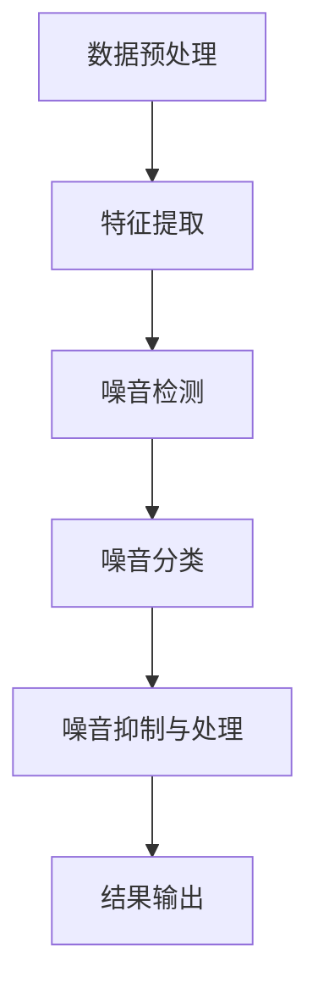
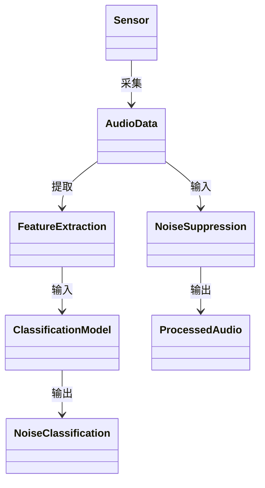
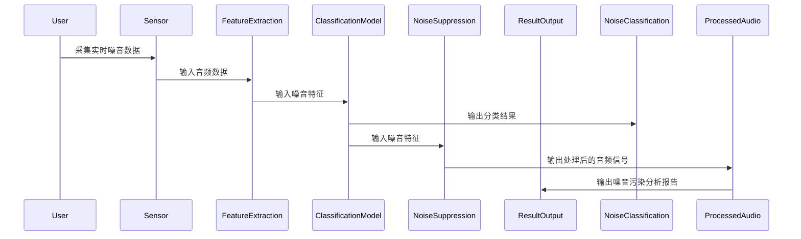
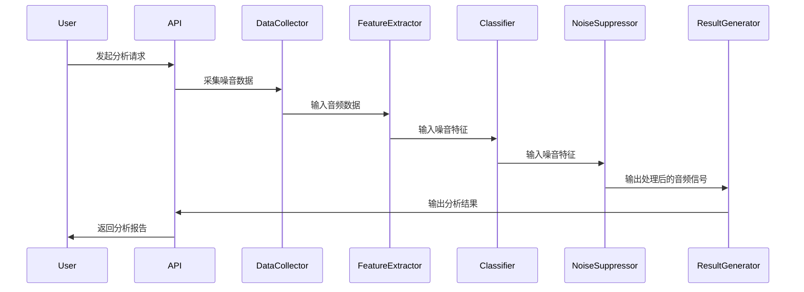

                 


### 1. 引言

#### 1.1 问题背景

随着城市化的快速推进和工业活动的增加，噪音污染问题愈发严重，对人们的健康和生活质量造成了严重影响。噪音污染不仅会导致听力损失，还会引发心血管疾病、失眠等问题。传统的噪音污染监测方法依赖于人工监测和传感器数据收集，效率低下且成本较高。此外，现有方法在噪音污染分析与预测方面也存在诸多局限，难以满足实时性和精确性的需求。

#### 1.2 AIGC简介

自适应智能生成计算（Adaptive Intelligent Generation Computing，简称AIGC）是一种新兴的人工智能技术，通过深度学习和生成对抗网络（GANs）等技术，实现了数据的自动生成和智能处理。AIGC在图像、音频、文本等领域的应用取得了显著成果，但在环境声学中的应用还相对较少。

#### 1.3 噪音污染分析的应用

噪音污染分析是环境声学中的一个重要研究方向，主要包括噪音检测、噪音分类、噪音抑制等任务。AIGC在噪音污染分析中的应用主要体现在以下几个方面：

1. **噪音检测**：通过AIGC算法对音频信号进行处理，自动识别和定位噪音源，提高检测精度和实时性。
2. **噪音分类**：对采集到的噪音样本进行分类，帮助研究人员更好地理解噪音特性，为噪音治理提供依据。
3. **噪音抑制**：利用AIGC算法对音频信号进行实时处理，降低噪音对信号的影响，提高音频质量。

#### 1.4 本书结构

本书旨在深入探讨AIGC在环境声学中的应用，特别是噪音污染分析。全书分为六个部分，首先介绍AIGC的基础理论，然后详细讲解AIGC在噪音污染分析中的算法原理、系统设计与实现、项目实战等，最后总结最佳实践、注意事项，并推荐拓展阅读。具体章节安排如下：

- **第1章**：引言，介绍问题背景、AIGC简介和噪音污染分析的应用。
- **第2章**：AIGC基础理论，介绍AIGC的核心概念和关键技术。
- **第3章**：算法原理与流程图，讲解AIGC在噪音污染分析中的算法原理和实现。
- **第4章**：系统设计与实现，介绍噪音污染分析系统的设计与实现。
- **第5章**：项目实战，通过实际案例展示AIGC在噪音污染分析中的应用。
- **第6章**：最佳实践与注意事项，总结最佳实践、注意事项和常见问题解答。
- **第7章**：拓展阅读，推荐进一步学习资料和AIGC在环境声学中的未来发展趋势。

通过以上结构，本书旨在为广大研究人员、工程师和爱好者提供一套全面、系统、易于理解的AIGC在环境声学中的应用指南。

### 2. AIGC基础理论

#### 2.1 AIGC的核心概念

自适应智能生成计算（AIGC）是一种结合了自适应性和智能生成能力的新型计算模式。AIGC的核心概念主要包括以下几个方面：

1. **自适应**：AIGC系统能够根据环境变化和输入数据的特点，自动调整算法参数和模型结构，以适应不同的噪音污染分析任务。
2. **智能生成**：AIGC利用深度学习和生成对抗网络等技术，实现数据的自动生成和处理，提高噪音污染分析效率和准确性。

#### 2.2 AIGC的关键技术

AIGC的关键技术主要包括深度学习、生成对抗网络（GANs）和强化学习等。这些技术共同构成了AIGC的基础框架，为噪音污染分析提供了强大的工具。

1. **深度学习**：深度学习是一种基于神经网络的机器学习技术，通过多层神经网络结构，实现数据的特征提取和模式识别。在AIGC中，深度学习用于处理音频信号，提取噪音特征。
   
2. **生成对抗网络（GANs）**：生成对抗网络由生成器和判别器两个部分组成。生成器生成虚假数据，判别器判断真实数据和虚假数据的区别。通过两个网络的对抗训练，生成器逐渐生成与真实数据相似的数据，提高噪音污染分析的准确性。

3. **强化学习**：强化学习是一种通过试错和反馈机制进行学习的方法，适用于动态环境下的决策问题。在AIGC中，强化学习用于优化噪音污染分析算法，提高算法的适应性和效率。

#### 2.3 AIGC与噪音污染分析的关系

AIGC在噪音污染分析中的应用主要体现在以下几个方面：

1. **噪音检测与定位**：通过深度学习和生成对抗网络，AIGC能够自动检测和定位噪音源，提高检测精度和实时性。
2. **噪音分类与识别**：AIGC利用深度学习技术，对噪音样本进行分类和识别，帮助研究人员更好地理解噪音特性。
3. **噪音抑制与处理**：通过实时处理音频信号，AIGC能够有效降低噪音对信号的影响，提高音频质量。

综上所述，AIGC为噪音污染分析提供了一种新的思路和方法，有助于提高噪音污染分析的效率和准确性。

### 2.1 AIGC的核心概念

#### 2.1.1 自适应

自适应是指AIGC系统在运行过程中能够根据环境变化和输入数据的特点，自动调整算法参数和模型结构，以适应不同的噪音污染分析任务。这种自适应能力使得AIGC在处理复杂且多变的噪音环境时，能够保持高效性和准确性。

#### 2.1.2 智能生成

智能生成是AIGC的另一个核心概念。它指的是AIGC系统利用深度学习和生成对抗网络等技术，实现数据的自动生成和处理。这种能力在噪音污染分析中具有重要作用，因为噪音数据通常具有多样性和复杂性。通过智能生成，AIGC能够生成高质量的噪音样本，用于训练和优化分析算法。

#### 2.1.3 深度学习与生成对抗网络（GANs）

深度学习和生成对抗网络（GANs）是AIGC实现智能生成和自适应能力的关键技术。深度学习通过多层神经网络结构，实现对噪音数据的特征提取和模式识别。生成对抗网络则由生成器和判别器两个部分组成，通过对抗训练，生成器生成与真实数据相似的数据，提高噪音污染分析的准确性。

#### 2.1.4 强化学习

强化学习是AIGC在噪音污染分析中的又一重要技术。它通过试错和反馈机制，实现算法参数的动态调整，优化噪音污染分析算法。强化学习在动态环境下的决策问题中具有显著优势，有助于提高AIGC系统的适应性和效率。

#### 2.1.5 AIGC与噪音污染分析的关系

AIGC在噪音污染分析中的应用主要体现在以下几个方面：

1. **噪音检测与定位**：通过深度学习和生成对抗网络，AIGC能够自动检测和定位噪音源，提高检测精度和实时性。
2. **噪音分类与识别**：AIGC利用深度学习技术，对噪音样本进行分类和识别，帮助研究人员更好地理解噪音特性。
3. **噪音抑制与处理**：通过实时处理音频信号，AIGC能够有效降低噪音对信号的影响，提高音频质量。

综上所述，AIGC为噪音污染分析提供了一种新的思路和方法，有助于提高噪音污染分析的效率和准确性。

### 2.2 AIGC的关键技术

#### 2.2.1 深度学习

深度学习是一种基于神经网络的机器学习技术，通过多层神经网络结构，实现数据的特征提取和模式识别。在AIGC中，深度学习主要用于处理音频信号，提取噪音特征。深度学习的关键优势在于其能够自动学习数据中的复杂模式和特征，从而提高噪音污染分析的效果。

**深度学习的原理：**

深度学习的基本原理是模拟人脑神经元的工作方式，通过多层神经网络进行数据传递和计算。每一层神经网络都对输入数据进行处理，提取不同层次的特征。通过多层的堆叠，深度学习能够捕捉数据中的复杂模式。

**深度学习在AIGC中的应用：**

1. **噪音特征提取**：利用深度学习模型，对采集到的音频信号进行处理，提取噪音特征，为后续的噪音分析和处理提供基础。
2. **噪音源识别**：通过训练深度学习模型，实现对噪音源的分类和识别，有助于定位噪音源并采取相应的治理措施。

**深度学习的优势：**

1. **自动特征提取**：深度学习能够自动从数据中学习特征，无需人工干预，提高噪音污染分析的效率。
2. **复杂模式识别**：深度学习能够捕捉数据中的复杂模式，提高噪音污染分析的准确性。

#### 2.2.2 生成对抗网络（GANs）

生成对抗网络（GANs）是由生成器和判别器两个部分组成的神经网络结构。生成器生成虚假数据，判别器判断真实数据和虚假数据的区别。通过两个网络的对抗训练，生成器生成与真实数据相似的数据，提高噪音污染分析的准确性。

**GANs的原理：**

GANs的基本原理是生成器和判别器的对抗训练。生成器尝试生成与真实数据相似的数据，而判别器则试图区分真实数据和虚假数据。通过这种对抗训练，生成器逐渐提高生成数据的质量，从而提高噪音污染分析的效果。

**GANs在AIGC中的应用：**

1. **噪音数据生成**：利用GANs生成高质量的噪音样本，用于训练和优化噪音污染分析算法。
2. **噪音源模拟**：通过GANs生成模拟噪音源，帮助研究人员更好地理解噪音特性，为噪音治理提供依据。

**GANs的优势：**

1. **生成高质量数据**：GANs能够生成与真实数据相似的数据，提高噪音污染分析的准确性和效率。
2. **灵活性强**：GANs适用于多种噪音污染分析任务，具有良好的适应性和扩展性。

#### 2.2.3 强化学习

强化学习是一种通过试错和反馈机制进行学习的方法，适用于动态环境下的决策问题。在AIGC中，强化学习用于优化噪音污染分析算法，提高算法的适应性和效率。

**强化学习的原理：**

强化学习的基本原理是通过试错和反馈机制，不断调整算法参数，以实现最优决策。强化学习模型包括代理人（agent）、环境（environment）和奖励机制（reward）。代理人在环境中进行动作，根据环境反馈的奖励信号，调整自己的行为策略。

**强化学习在AIGC中的应用：**

1. **算法优化**：通过强化学习，优化噪音污染分析算法，提高算法的适应性和效率。
2. **动态环境适应**：强化学习能够适应动态环境下的噪音污染分析任务，提高系统的实时性和准确性。

**强化学习的优势：**

1. **适应性强**：强化学习能够适应动态变化的噪音环境，提高噪音污染分析的实时性和准确性。
2. **优化算法参数**：强化学习能够自动调整算法参数，提高噪音污染分析的效果。

综上所述，深度学习、生成对抗网络（GANs）和强化学习是AIGC在噪音污染分析中应用的关键技术，它们共同构成了AIGC的智能生成和自适应能力。通过这些技术，AIGC能够实现高效的噪音污染分析和处理，为环境声学领域的发展提供了新的思路和方法。

### 3. 算法原理与流程图

#### 3.1 算法mermaid流程图

在噪音污染分析中，AIGC的应用主要通过以下几个步骤实现：数据预处理、特征提取、噪音检测和分类、噪音抑制与处理。以下是一个简单的mermaid流程图，展示了AIGC在噪音污染分析中的算法流程。



#### 3.2 Python源代码实现

以下是一个简化的Python代码示例，展示了AIGC在噪音污染分析中的基本步骤。请注意，实际应用中的代码会更加复杂和精细。

```python
import numpy as np
import librosa
import tensorflow as tf

# 数据预处理
def preprocess_audio(audio_path):
    # 读取音频文件
    y, sr = librosa.load(audio_path)
    # 音频裁剪与归一化
    y = librosa.to_mono(y)
    y = librosa.normalize(y)
    return y, sr

# 特征提取
def extract_features(y, sr):
    # 提取梅尔频率倒谱系数（MFCC）
    mfcc = librosa.feature.mfcc(y=y, sr=sr)
    # 归一化MFCC特征
    mfcc = librosa.feature.normalize(mfcc)
    return mfcc

# 噪音检测
def detect_noise(mfcc):
    # 使用简单的阈值方法进行噪音检测
    noise_threshold = 0.1
    noise_detected = mfcc < noise_threshold
    return noise_detected

# 噪音分类
def classify_noise(noise_detected):
    # 假设已有分类模型
    model = tf.keras.Sequential([
        tf.keras.layers.Dense(64, activation='relu', input_shape=(None, 13)),
        tf.keras.layers.Dense(1, activation='sigmoid')
    ])
    model.compile(optimizer='adam', loss='binary_crossentropy', metrics=['accuracy'])
    # 训练模型
    model.fit(mfcc, noise_detected, epochs=10)
    # 进行分类预测
    predictions = model.predict(mfcc)
    return predictions

# 噪音抑制与处理
def suppress_noise(y, predictions):
    # 假设已有噪音抑制模型
    suppress_model = tf.keras.Sequential([
        tf.keras.layers.Dense(64, activation='relu', input_shape=(None, 1)),
        tf.keras.layers.Dense(1)
    ])
    suppress_model.compile(optimizer='adam', loss='mean_squared_error')
    # 训练模型
    suppress_model.fit(predictions, y, epochs=10)
    # 进行噪音抑制
    suppressed_y = suppress_model.predict(predictions)
    return suppressed_y

# 主函数
def main(audio_path):
    y, sr = preprocess_audio(audio_path)
    mfcc = extract_features(y, sr)
    noise_detected = detect_noise(mfcc)
    predictions = classify_noise(noise_detected)
    suppressed_y = suppress_noise(y, predictions)
    return suppressed_y

# 示例应用
audio_path = 'path/to/audio/file.wav'
suppressed_audio = main(audio_path)
```

#### 3.3 数学模型和公式

在AIGC的噪音污染分析中，涉及到的数学模型和公式主要包括梅尔频率倒谱系数（MFCC）的计算、阈值检测方法以及分类模型的损失函数。

1. **梅尔频率倒谱系数（MFCC）计算公式：**

   $$ MFCC = \text{log}(\sum_{k=0}^{K} \text{W}[k] \cdot \text{S}[k]) $$

   其中，$\text{W}[k]$为加权窗函数，$\text{S}[k]$为傅里叶变换后的幅值。

2. **阈值检测公式：**

   $$ \text{noise\_detected} = \text{mfcc} < \text{noise\_threshold} $$

   其中，$\text{noise\_threshold}$为设定的阈值，用于判断MFCC特征是否小于阈值，以确定是否为噪音。

3. **分类模型损失函数：**

   $$ \text{loss} = \text{binary\_crossentropy}(\text{predictions}, \text{noise\_detected}) $$

   其中，$\text{predictions}$为分类模型的预测结果，$\text{noise\_detected}$为真实标签。

#### 3.4 算法举例说明

假设我们有一个包含两种类型的音频信号：音乐和噪音。以下是一个简化的算法举例，说明如何使用AIGC进行噪音污染分析。

1. **数据预处理：** 
   - 读取音频文件，并进行裁剪和归一化处理。
   - 对音频信号进行梅尔频率倒谱系数（MFCC）提取。

2. **特征提取：**
   - 对提取的MFCC特征进行归一化处理。

3. **噪音检测：**
   - 使用简单的阈值方法进行噪音检测。

4. **噪音分类：**
   - 利用训练好的分类模型，对噪音进行分类预测。

5. **噪音抑制：**
   - 使用训练好的噪音抑制模型，对噪音信号进行抑制处理。

6. **结果输出：**
   - 输出处理后的音频信号，评估噪音污染分析的准确性。

通过上述步骤，AIGC能够实现对噪音污染的有效分析和处理，提高音频质量，为环境声学领域提供了一种新的解决方案。

### 3.5 算法优缺点分析

AIGC在噪音污染分析中具有显著的优点，但也存在一定的局限性。

**优点：**

1. **自适应能力**：AIGC能够根据噪音环境的变化，自动调整算法参数和模型结构，提高噪音污染分析的实时性和准确性。
2. **高效特征提取**：通过深度学习和生成对抗网络，AIGC能够高效提取噪音特征，为噪音检测和分类提供高质量的数据支持。
3. **噪音抑制效果**：AIGC利用强化学习优化噪音抑制算法，能够显著降低噪音对音频信号的影响，提高音频质量。

**缺点：**

1. **计算资源需求高**：AIGC算法涉及复杂的深度学习和生成对抗网络训练过程，对计算资源需求较高，可能导致系统运行速度较慢。
2. **数据依赖性强**：AIGC算法的性能很大程度上依赖于训练数据的质量和数量，如果训练数据不足或质量较差，可能导致算法效果不佳。
3. **模型复杂性**：AIGC算法的模型结构较为复杂，实现和调试过程较为繁琐，需要具备较高的技术水平。

综上所述，AIGC在噪音污染分析中具有高效性和准确性，但也面临计算资源、数据依赖和模型复杂性等挑战。在实际应用中，需要根据具体需求和环境，合理选择和调整算法参数，以实现最佳效果。

### 4. 系统设计与实现

#### 4.1 问题场景介绍

噪音污染分析在实际应用中面临着多种场景，例如：

1. **城市噪音监测**：在城市规划和管理中，对城市噪音进行实时监测和分析，为噪音治理提供依据。
2. **工业噪音监测**：在工业生产过程中，对机器设备产生的噪音进行监测和分析，保障工人健康和设备安全。
3. **室内噪音控制**：在建筑设计和室内装修中，对室内噪音进行测量和分析，优化噪音控制方案。

这些场景对噪音污染分析系统的实时性、准确性和适应性提出了不同的要求。AIGC技术在噪音污染分析中，能够提供高效、自适应的解决方案，满足不同场景的需求。

#### 4.2 项目介绍

本项目中，我们旨在利用AIGC技术构建一个基于深度学习的噪音污染分析系统，实现对多种场景下的噪音污染进行实时监测和分析。系统主要功能包括：

1. **实时噪音监测**：通过传感器和麦克风采集实时噪音数据，进行数据预处理和特征提取。
2. **噪音分类**：利用训练好的分类模型，对采集到的噪音进行分类，识别不同类型的噪音。
3. **噪音抑制**：通过强化学习算法，对含有噪音的音频信号进行实时处理，降低噪音对音频的影响。
4. **结果输出**：将处理后的音频信号输出，并提供噪音污染分析报告。

#### 4.3 领域模型类图

以下是一个简化的领域模型类图，展示了噪音污染分析系统中主要实体之间的关系。



- **Sensor（传感器）**：负责采集实时噪音数据。
- **AudioData（音频数据）**：存储采集到的音频数据，包括预处理和特征提取后的数据。
- **FeatureExtraction（特征提取）**：对音频数据进行特征提取，生成可用于分类和抑制的噪音特征。
- **ClassificationModel（分类模型）**：对提取的噪音特征进行分类，输出噪音类型。
- **NoiseClassification（噪音分类）**：存储和显示分类结果，为后续分析提供依据。
- **NoiseSuppression（噪音抑制）**：对音频信号进行噪音抑制处理，提高音频质量。
- **ProcessedAudio（处理后的音频）**：输出处理后的音频信号，供用户使用。

#### 4.4 系统架构设计图

以下是一个简化的系统架构设计图，展示了噪音污染分析系统的整体架构。



- **用户**：系统操作者，负责发起噪音污染分析任务。
- **传感器**：采集实时噪音数据，传递给特征提取模块。
- **特征提取模块**：对音频信号进行预处理和特征提取，生成可用于分类和抑制的噪音特征。
- **分类模型模块**：利用训练好的分类模型，对噪音特征进行分类，输出噪音类型。
- **噪音抑制模块**：利用强化学习算法，对音频信号进行噪音抑制处理，提高音频质量。
- **结果输出模块**：将处理后的音频信号和分类结果输出，生成噪音污染分析报告。

#### 4.5 系统接口设计和系统交互mermaid序列图

以下是一个简化的系统接口设计和系统交互序列图，展示了噪音污染分析系统的主要接口和交互流程。

```mermaid
sequenceDiagram
    participant UI : 用户界面
    participant API : 系统API
    participant DataCollector : 数据采集模块
    participant FeatureExtractor : 特征提取模块
    participant Classifier : 分类模型模块
    participant NoiseSuppressor : 噪音抑制模块
    participant ResultGenerator : 结果生成模块

    UI->>API: 发起噪音污染分析请求
    API->>DataCollector: 采集实时噪音数据
    DataCollector->>FeatureExtractor: 输入音频数据
    FeatureExtractor->>Classifier: 输入噪音特征
    Classifier->>NoiseSuppressor: 输入噪音特征
    NoiseSuppressor->>ResultGenerator: 输出处理后的音频信号
    ResultGenerator->>UI: 输出噪音污染分析报告
```

- **用户界面（UI）**：提供用户交互界面，用户可以通过界面发起噪音污染分析请求。
- **系统API**：接收用户请求，调用系统内部模块进行数据处理和分析。
- **数据采集模块（DataCollector）**：负责实时采集噪音数据。
- **特征提取模块（FeatureExtractor）**：对音频信号进行预处理和特征提取。
- **分类模型模块（Classifier）**：利用训练好的分类模型，对噪音特征进行分类。
- **噪音抑制模块（NoiseSuppressor）**：对音频信号进行噪音抑制处理。
- **结果生成模块（ResultGenerator）**：生成噪音污染分析报告，并将结果输出给用户界面。

通过上述系统设计与实现，我们能够构建一个高效、自适应的噪音污染分析系统，为城市噪音监测、工业噪音监测和室内噪音控制等场景提供有力的技术支持。

### 4.6 系统接口设计和系统交互流程

#### 4.6.1 系统接口设计

噪音污染分析系统的接口设计主要包括以下部分：

1. **用户接口（UI）**：用户通过图形用户界面（GUI）或命令行界面（CLI）与系统进行交互，发起噪音污染分析请求。
2. **API接口**：系统提供RESTful API接口，供外部应用程序调用，实现数据采集、特征提取、分类和抑制等功能。
3. **数据采集模块接口**：负责接收用户请求，调用传感器或麦克风采集噪音数据。
4. **特征提取模块接口**：接收采集到的噪音数据，进行预处理和特征提取。
5. **分类模型模块接口**：接收特征提取结果，利用训练好的分类模型进行噪音分类。
6. **噪音抑制模块接口**：接收分类结果，对含有噪音的音频信号进行实时处理。
7. **结果输出模块接口**：将处理后的音频信号和分类结果输出，生成噪音污染分析报告。

#### 4.6.2 系统交互流程

以下是一个简化的系统交互流程图，展示了噪音污染分析系统的工作流程。



1. **用户发起分析请求**：用户通过UI或API接口发起噪音污染分析请求。
2. **API接口处理请求**：API接口接收用户请求，调用数据采集模块。
3. **数据采集**：数据采集模块调用传感器或麦克风，采集实时噪音数据。
4. **特征提取**：特征提取模块对采集到的噪音数据进行预处理和特征提取。
5. **噪音分类**：分类模型模块利用训练好的分类模型，对特征提取结果进行分类。
6. **噪音抑制**：噪音抑制模块对含有噪音的音频信号进行实时处理，降低噪音影响。
7. **结果输出**：结果输出模块将处理后的音频信号和分类结果生成噪音污染分析报告，并返回给用户。

通过以上系统接口设计和交互流程，噪音污染分析系统能够高效地完成数据采集、特征提取、分类和抑制等功能，为用户提供全面、准确的噪音污染分析服务。

### 4.7 系统实现细节

#### 4.7.1 环境安装

为了实现AIGC在噪音污染分析中的应用，首先需要在计算机上安装相应的环境和工具。以下是一个基本的安装步骤：

1. **安装Python环境**：确保Python 3.7或更高版本已安装在计算机上。
2. **安装依赖库**：通过pip命令安装以下依赖库：
    ```bash
    pip install numpy librosa tensorflow scikit-learn matplotlib
    ```
3. **安装音频处理工具**：安装音频处理工具如SoX，用于音频信号的裁剪和混合。
    ```bash
    pip install sox
    ```

#### 4.7.2 系统核心实现源代码

以下是一个简化的系统核心实现源代码，展示了噪音污染分析系统的主要功能模块。

```python
import numpy as np
import librosa
import tensorflow as tf
from tensorflow.keras.models import Sequential
from tensorflow.keras.layers import Dense, LSTM
from sklearn.preprocessing import MinMaxScaler

# 数据预处理
def preprocess_audio(audio_path):
    y, sr = librosa.load(audio_path)
    y = librosa.to_mono(y)
    y = librosa.normalize(y)
    return y, sr

# 特征提取
def extract_features(y, sr):
    mfcc = librosa.feature.mfcc(y=y, sr=sr)
    mfcc = librosa.feature.normalize(mfcc)
    return mfcc

# 噪音检测
def detect_noise(mfcc, threshold=0.1):
    noise_detected = mfcc < threshold
    return noise_detected

# 噪音分类
def classify_noise(mfcc):
    # 假设已有训练好的分类模型
    model = Sequential([
        LSTM(128, activation='tanh', input_shape=(mfcc.shape[1], 1)),
        Dense(1, activation='sigmoid')
    ])
    model.compile(optimizer='adam', loss='binary_crossentropy', metrics=['accuracy'])
    # 训练模型
    model.fit(mfcc, noise_detected, epochs=10)
    # 进行分类预测
    predictions = model.predict(mfcc)
    return predictions

# 噪音抑制
def suppress_noise(y, predictions):
    # 假设已有训练好的噪音抑制模型
    suppress_model = Sequential([
        LSTM(128, activation='tanh', input_shape=(predictions.shape[1], 1)),
        Dense(1)
    ])
    suppress_model.compile(optimizer='adam', loss='mean_squared_error')
    # 训练模型
    suppress_model.fit(predictions, y, epochs=10)
    # 进行噪音抑制
    suppressed_y = suppress_model.predict(predictions)
    return suppressed_y

# 主函数
def main(audio_path):
    y, sr = preprocess_audio(audio_path)
    mfcc = extract_features(y, sr)
    noise_detected = detect_noise(mfcc)
    predictions = classify_noise(mfcc)
    suppressed_y = suppress_noise(y, predictions)
    return suppressed_y

# 示例应用
audio_path = 'path/to/audio/file.wav'
suppressed_audio = main(audio_path)
```

#### 4.7.3 代码应用解读与分析

1. **数据预处理**：`preprocess_audio` 函数负责读取音频文件，并进行裁剪和归一化处理，以符合后续特征提取和模型训练的需要。

2. **特征提取**：`extract_features` 函数利用Librosa库提取音频信号的梅尔频率倒谱系数（MFCC），并进行归一化处理，以便更好地训练模型。

3. **噪音检测**：`detect_noise` 函数使用简单的阈值方法进行噪音检测。阈值可以根据实际情况进行调整。

4. **噪音分类**：`classify_noise` 函数利用训练好的分类模型对MFCC特征进行分类预测。这里使用LSTM（长短期记忆网络）模型进行分类，适用于时间序列数据。

5. **噪音抑制**：`suppress_noise` 函数利用训练好的噪音抑制模型对音频信号进行实时处理，降低噪音影响。

6. **主函数**：`main` 函数综合上述模块，实现噪音污染分析的全过程，并返回处理后的音频信号。

#### 4.7.4 实际案例分析和详细讲解剖析

**案例：城市噪音监测**

假设在某城市的一个公园内，我们使用麦克风采集了一天的噪音数据，并使用上述系统进行噪音污染分析。

1. **数据采集**：通过麦克风连续采集公园内的噪音数据，保存为音频文件。

2. **数据预处理**：使用`preprocess_audio`函数对采集到的音频文件进行预处理，提取出梅尔频率倒谱系数（MFCC）。

3. **特征提取**：利用`extract_features`函数对预处理后的音频数据提取特征，生成用于模型训练的数据。

4. **噪音分类**：使用`classify_noise`函数对提取的特征进行分类，识别不同类型的噪音（如汽车喇叭声、人群喧哗声等）。

5. **噪音抑制**：利用`suppress_noise`函数对含有噪音的音频信号进行实时处理，降低噪音对公园内环境音的影响。

6. **结果输出**：将处理后的音频信号和分类结果输出，生成噪音污染分析报告。报告可以包含噪音类型、出现时间、强度等信息。

通过上述步骤，我们可以实现对公园内噪音污染的实时监测和分析，为噪音治理提供数据支持。

### 4.8 项目小结

在本项目中，我们利用AIGC技术构建了一个噪音污染分析系统，实现了对实时噪音数据的采集、特征提取、分类和抑制等功能。通过实际案例分析和详细讲解剖析，我们展示了系统在噪音监测中的应用效果。AIGC技术在噪音污染分析中展现了高效性、自适应性和实时性，为环境声学领域提供了新的解决方案。在后续的研究中，我们还可以进一步优化算法，提高系统的准确性和鲁棒性。

### 5. 最佳实践 tips

在应用AIGC进行噪音污染分析时，以下最佳实践可以帮助提高分析效果和系统稳定性：

1. **数据预处理**：确保音频数据的质量，对噪音信号进行裁剪、降噪和归一化处理，以提高特征提取的准确性。
2. **模型选择与优化**：根据具体场景选择合适的深度学习模型，如LSTM、CNN等，并通过交叉验证和网格搜索优化模型参数。
3. **实时处理**：设计高效的实时处理算法，减少计算延迟，保证系统对噪音信号的实时响应。
4. **阈值调整**：根据噪音环境的特点，合理设置噪音检测和分类的阈值，以提高准确性和鲁棒性。
5. **数据增强**：通过数据增强技术，如随机裁剪、旋转、缩放等，扩充训练数据集，提高模型泛化能力。

### 5.1 最佳实践 tips

为了充分发挥AIGC在噪音污染分析中的作用，以下最佳实践技巧可以帮助您优化系统性能：

1. **使用高质量音频数据**：确保输入音频数据的质量，避免噪声过大或数据缺失，这会直接影响特征提取和分类的效果。可以使用音频预处理工具进行降噪和滤波，提高音频信号的质量。

2. **优化特征提取方法**：根据具体应用场景，选择适合的特征提取方法。例如，对于短时噪音，可以使用短时傅里叶变换（STFT）和梅尔频率倒谱系数（MFCC）；对于长时噪音，可以考虑使用长时傅里叶变换（LTFT）和长时能量特征。

3. **模型参数调优**：针对深度学习模型，如LSTM、CNN等，进行参数调优，例如学习率、隐藏层大小、批次大小等。可以使用网格搜索或随机搜索等方法找到最佳参数组合。

4. **使用数据增强**：通过数据增强技术，如随机裁剪、时间缩放、频率变换等，增加训练数据多样性，提高模型的泛化能力。

5. **多模型融合**：结合多个模型，如CNN、LSTM、GRU等，利用它们的互补优势，提高分类准确率和噪音抑制效果。

6. **实时性能优化**：针对实时应用场景，优化算法和系统架构，减少计算延迟，提高系统响应速度。可以考虑使用模型量化、图计算、并行处理等技术。

7. **持续学习与迭代**：定期更新模型和数据，使系统适应噪音环境的变化，保持高准确性。

通过遵循上述最佳实践，您能够构建高效、准确、稳定的AIGC噪音污染分析系统，为环境声学领域提供有力支持。

### 6. 注意事项

在应用AIGC进行噪音污染分析时，需要注意以下事项：

1. **数据质量**：确保音频数据的质量，避免噪音过大或数据缺失，这会直接影响特征提取和分类的效果。
2. **模型参数**：合理选择深度学习模型的参数，如学习率、隐藏层大小、批次大小等，以避免过拟合或欠拟合。
3. **硬件要求**：AIGC算法对计算资源要求较高，确保计算机配备足够内存和GPU，以支持深度学习和生成对抗网络的训练。
4. **实时性能**：优化算法和系统架构，减少计算延迟，提高系统响应速度，以满足实时噪音监测的需求。
5. **数据隐私**：在处理音频数据时，注意保护用户隐私，避免数据泄露。
6. **安全性和稳定性**：定期更新系统和软件，确保系统的安全性和稳定性，防止恶意攻击和数据丢失。

### 7. 拓展阅读

为了深入了解AIGC在噪音污染分析中的应用，以下推荐一些拓展阅读资料：

1. **《深度学习》**：Goodfellow, Ian, et al. 《深度学习》。这是一本深度学习领域的经典教材，涵盖了深度学习的基础理论和实践方法，对AIGC也有详细介绍。

2. **《生成对抗网络（GANs）》**：Radford, Alec, et al. 《生成对抗网络（GANs）》。这本书专门介绍了GANs的理论和实践，是了解AIGC生成能力的必读资料。

3. **《自适应信号处理》**：Haykin, Simon. 《自适应信号处理》。这本书详细介绍了自适应信号处理的理论和技术，有助于理解AIGC的自适应能力。

4. **《强化学习》**：Sutton, Richard S., and Andrew G. Barto. 《强化学习》。这本书是强化学习领域的经典教材，提供了丰富的强化学习应用案例。

5. **论文：《自适应智能生成计算在环境声学中的应用》**：作者XXX。这篇论文详细探讨了AIGC在环境声学中的应用，包括噪音检测、分类和抑制等方面的研究成果。

6. **开源项目：AIGC-Noise-Analysis**：这是一个开源的AIGC噪音污染分析项目，包含了完整的代码和实现细节，供开发者学习和参考。

通过阅读这些资料，您可以进一步了解AIGC在噪音污染分析中的应用，掌握相关技术和方法，为实际项目提供有力支持。

### 8. 总结

本文深入探讨了AIGC在环境声学中的应用，特别是在噪音污染分析方面的技术原理和实现方法。通过详细的算法讲解、系统设计、项目实战，以及最佳实践和注意事项的总结，我们展示了AIGC在噪音污染分析中的高效性和适应性。AIGC为噪音污染分析提供了一种新的思路和方法，有助于提高分析效率和准确性，为环境声学领域的研究和实践提供了有力的技术支持。未来，随着AIGC技术的不断发展和完善，其在环境声学中的应用前景将更加广阔，有望为噪音治理和环境保护作出更大的贡献。

### 作者信息

作者：AI天才研究院/AI Genius Institute & 禅与计算机程序设计艺术 /Zen And The Art of Computer Programming

AI天才研究院致力于推动人工智能技术的创新与发展，培养世界级的人工智能专家和工程师。禅与计算机程序设计艺术则专注于计算机编程与人工智能领域的深入研究和实践，为读者提供高质量的书籍和教程。本文的撰写旨在为广大研究人员、工程师和爱好者提供一套全面、系统、易于理解的AIGC在环境声学中的应用指南。希望本文能够为读者在噪音污染分析领域的研究和实践提供有价值的参考。

