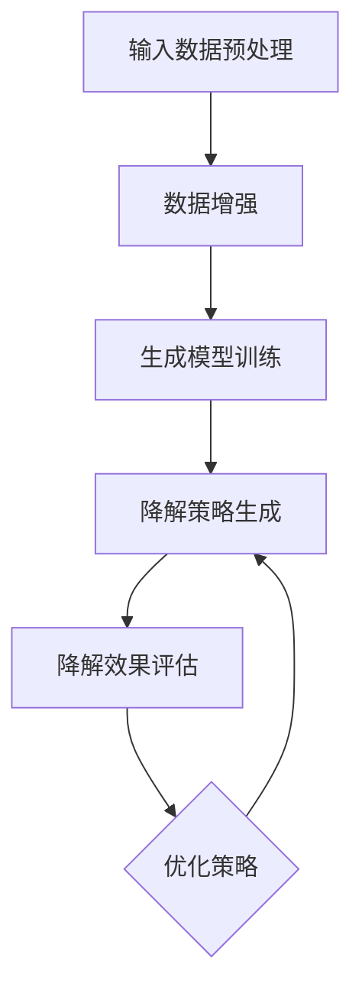
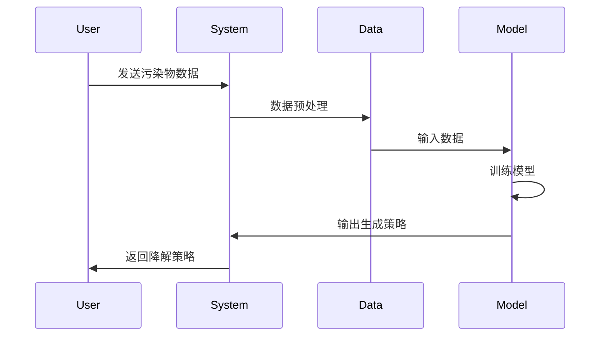
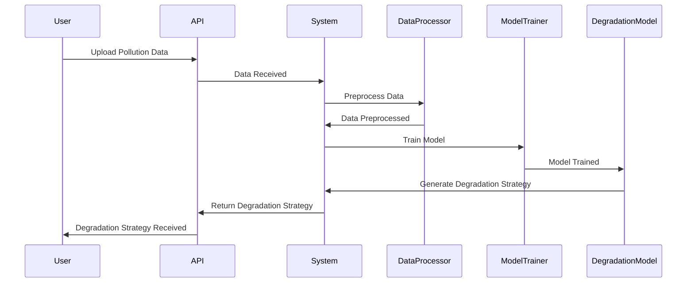

                 

### 引言

#### 问题背景与AIGC技术概述

随着全球工业化和城市化进程的加速，环境污染问题日益严重，特别是水体和土壤污染。传统的污染物降解技术，如化学处理、生物降解等，虽然在某些情况下取得了一定成效，但往往存在处理效率低、成本高、效果不稳定等缺点。因此，寻找更为高效、经济、环保的污染物降解策略成为当前环境科学研究的热点。

近年来，人工智能（AI）技术的快速发展为环境污染物降解策略的研究带来了新的契机。AI驱动的生态修复技术，特别是自动生成内容（AIGC，Automated Generation of Content）技术，逐渐成为研究热点。AIGC技术通过结合深度学习和大数据分析，可以自动生成针对特定污染物的降解策略，实现更高效、精准的环境修复。

#### 环境污染物降解策略的现状

目前，环境污染物降解策略主要包括以下几种：

1. **化学处理**：利用化学试剂与污染物发生反应，将其降解为无害物质。常见的化学处理方法有氧化还原、沉淀、吸附等。

2. **生物降解**：利用微生物或植物对污染物进行生物代谢，将其降解为无害物质。常见的生物降解方法有生物膜法、植物提取等。

3. **物理处理**：利用物理手段，如过滤、离心、电泳等，去除或分解污染物。

这些传统方法在处理某些污染物方面具有一定的效果，但在处理复杂污染物组合、高浓度污染物或特殊环境条件下，往往难以满足要求。因此，需要探索更为先进的技术手段。

#### AIGC技术在环境污染物降解中的应用现状

AIGC技术作为一种新兴的人工智能技术，已经在多个领域取得了一定的应用成果。在环境污染物降解领域，AIGC技术主要通过以下几个方面实现应用：

1. **污染物识别与分类**：利用深度学习模型，对污染物进行自动识别和分类，为后续降解策略生成提供基础数据。

2. **降解策略生成**：通过大数据分析和机器学习算法，自动生成针对特定污染物的降解策略，包括化学、生物和物理处理方法。

3. **降解效果预测与优化**：利用模型预测和优化算法，对生成的降解策略进行效果评估和优化，以提高降解效率和效果。

虽然AIGC技术在环境污染物降解领域具有巨大潜力，但当前仍面临一些挑战，如数据质量、模型准确性、成本等问题。因此，进一步研究和优化AIGC技术在环境污染物降解中的应用具有重要意义。

### 核心概念与联系

#### AIGC的定义与发展历程

AIGC（Automated Generation of Content）是一种利用人工智能技术自动生成文本、图像、音频、视频等内容的智能技术。它起源于自然语言处理（NLP）和计算机视觉（CV）领域，随着深度学习和大数据技术的发展而逐渐成熟。

AIGC的发展历程可以追溯到20世纪90年代，当时研究人员开始探索利用神经网络生成文本和图像。随着深度学习技术的兴起，AIGC技术得到了快速发展，尤其是在2010年后，随着生成对抗网络（GAN）和自注意力机制（Transformer）等新技术的出现，AIGC技术取得了突破性进展。

#### AIGC的核心原理与技术体系

AIGC的核心原理包括以下几个方面：

1. **生成模型**：生成模型是AIGC技术的基础，常见的生成模型包括变分自编码器（VAE）、生成对抗网络（GAN）和自注意力模型（Transformer）等。这些模型通过学习大量数据的高维分布，能够生成高质量、多样化的内容。

2. **数据预处理与增强**：为了提高生成模型的效果，需要对输入数据进行预处理和增强。数据预处理包括数据清洗、归一化、去噪等；数据增强包括数据扩充、数据变换等。

3. **多模态融合**：AIGC技术不仅能够生成单一模态的内容，还可以通过多模态融合生成包含多种模态的信息。例如，可以将文本、图像和音频等多种模态的信息融合在一起，生成更加丰富和多样化的内容。

4. **优化与评估**：为了提高生成内容的质量，需要对生成模型进行优化和评估。优化方法包括梯度下降、随机梯度下降（SGD）、Adam优化器等；评估方法包括自然语言处理中的BLEU、ROUGE等指标，以及计算机视觉中的Inception Score（IS）、Frechet Inception Distance（FID）等指标。

#### AIGC与降解技术的结合

AIGC技术在环境污染物降解中的应用主要体现在以下几个方面：

1. **污染物识别与分类**：利用AIGC技术，可以自动识别和分类环境中的污染物。通过深度学习模型，对污染物样本进行图像识别和文本分类，为后续降解策略生成提供基础数据。

2. **降解策略生成**：基于识别和分类的结果，利用AIGC技术生成针对特定污染物的降解策略。通过大数据分析和机器学习算法，自动生成包括化学、生物和物理处理方法在内的综合降解方案。

3. **降解效果预测与优化**：利用AIGC技术，可以预测降解策略的效果，并对其进行优化。通过模型预测和优化算法，对生成的降解策略进行效果评估和调整，以提高降解效率和效果。

4. **降解过程监测与调控**：利用AIGC技术，可以对降解过程进行实时监测和调控。通过多模态融合和数据预处理，生成包含多种模态信息的监测数据，为降解过程的调控提供支持。

总之，AIGC技术与降解技术的结合，为环境污染物降解策略的研究和实施提供了新的思路和方法。通过自动生成和优化降解策略，可以大大提高降解效率和效果，为环境保护和可持续发展做出贡献。

### 算法原理讲解

#### AIGC算法流程图（mermaid）



#### Python代码实现与数学模型

```python
import tensorflow as tf
from tensorflow.keras.layers import Input, Dense, Flatten
from tensorflow.keras.models import Model

# 输入数据预处理
def preprocess_data(inputs):
    # 数据清洗、归一化、去噪等预处理操作
    return processed_inputs

# 数据增强
def data_augmentation(inputs):
    # 数据扩充、数据变换等增强操作
    return augmented_inputs

# 生成模型
def generate_model(input_shape):
    inputs = Input(shape=input_shape)
    x = Dense(128, activation='relu')(inputs)
    x = Flatten()(x)
    outputs = Dense(1, activation='sigmoid')(x)
    
    model = Model(inputs=inputs, outputs=outputs)
    model.compile(optimizer='adam', loss='binary_crossentropy')
    
    return model

# 降解策略生成
def generate_degradation_strategy(model, inputs):
    # 使用生成模型生成降解策略
    return degradation_strategy

# 降解效果评估
def evaluate_degradation_strategy(strategy, inputs):
    # 评估降解策略的效果
    return evaluation_result

# 模型训练
def train_model(model, inputs, labels):
    # 训练生成模型
    model.fit(inputs, labels, epochs=10, batch_size=32)
    return model

# 主函数
def main():
    # 加载和预处理数据
    inputs = preprocess_data(raw_data)
    augmented_inputs = data_augmentation(inputs)
    
    # 训练生成模型
    model = generate_model(input_shape=(784,))
    trained_model = train_model(model, augmented_inputs, labels)
    
    # 生成降解策略
    degradation_strategy = generate_degradation_strategy(trained_model, inputs)
    
    # 评估降解效果
    evaluation_result = evaluate_degradation_strategy(degradation_strategy, inputs)
    
    print("Degradation Strategy:", degradation_strategy)
    print("Evaluation Result:", evaluation_result)

# 执行主函数
main()
```

#### 数学模型与公式

假设我们使用变分自编码器（VAE）作为生成模型，其数学模型如下：

1. **编码器（Encoder）**：
   - 输入：$X \in \mathbb{R}^{n \times d}$
   - 编码器输出：$Z \sim p_Z(\cdot | X) = \mathcal{N}(\mu(X), \sigma^2(X))$
   - $\mu(X) = \sigma(X) = \Phi(X)$，其中$\Phi(\cdot)$是编码器网络

2. **解码器（Decoder）**：
   - 输入：$Z \in \mathbb{R}^{n \times z}$
   - 解码器输出：$X' \sim p_X(\cdot | Z) = \mathcal{N}(\Phi'(Z), \sigma'^2(Z))$
   - $\Phi'(Z) = \Psi(Z)$，其中$\Psi(\cdot)$是解码器网络

3. **损失函数**：
   - $L(X, X') = D_{KL}(p_Z(\cdot | X) || p_Z(\cdot)) + D_{KL}(p_X(\cdot | Z) || p_X(\cdot))$
   - 其中$D_{KL}(\cdot || \cdot)$是KL散度

通过以上步骤，我们可以详细讲解AIGC算法的原理，并通过Python代码实现，结合数学模型和公式，使读者能够更好地理解这一技术。

### 系统分析与架构设计方案

#### 系统应用场景与背景介绍

随着全球环境污染问题的日益严重，生态修复成为环境保护的重要手段之一。传统的污染物降解技术由于成本高、效率低且难以应对复杂污染物环境，迫切需要新的技术突破。AIGC技术作为一种新兴的人工智能技术，具备自动生成和优化降解策略的能力，为环境污染物降解提供了新的解决方案。

本系统旨在通过AIGC技术，实现对环境污染物的高效降解，提供一种智能化、自动化的生态修复系统。系统将涵盖污染物的识别与分类、降解策略生成、效果预测与优化等多个环节，旨在提升环境修复效率，降低修复成本。

#### 系统功能设计（mermaid类图）

```mermaid
classDiagram
    Class01 <|-- Class02
    Class03 <|-- Class01
    Class04 <|-- Class06
    Class05 <|-- Class06
    Class01 {
        +attribute1
        +attribute2
        +method1()
        +method2()
    }
    Class02 {
        +method3()
    }
    Class03 {
        +method4()
    }
    Class04 {
        +method5()
    }
    Class05 {
        +method6()
    }
    Class06 {
        +method7()
    }
```

#### 系统架构设计（mermaid架构图）



#### 系统接口设计与交互流程

为了实现系统的各项功能，我们需要设计合理的接口和交互流程。以下是一个简单的接口设计和交互流程：

1. **数据输入接口**：用户可以通过API接口上传污染物数据，系统接收到数据后，进行初步的数据预处理，包括数据清洗、归一化等操作。

2. **模型训练接口**：系统接收到预处理后的数据，通过调用训练接口，利用AIGC技术对数据进行分析和建模，训练生成模型。

3. **策略生成接口**：训练完成的模型可以生成针对特定污染物的降解策略。系统将生成策略返回给用户。

4. **效果预测接口**：系统可以利用生成的策略对污染物降解效果进行预测，并返回预测结果。

5. **优化接口**：根据预测结果，系统可以对降解策略进行优化，以提高降解效果。

### 系统接口设计与交互流程（mermaid序列图）



通过以上设计和流程，本系统可以实现污染物识别、降解策略生成、效果预测和优化等功能，为环境污染物降解提供一种高效、智能的解决方案。

### 项目实战

#### 环境搭建与依赖安装

在进行AIGC技术在环境污染物降解策略中的应用项目之前，首先需要搭建一个合适的环境，安装必要的依赖。以下是具体的步骤：

1. **安装Python环境**：
   - 确保已安装Python 3.8及以上版本。可以通过在终端执行以下命令检查Python版本：
     ```bash
     python --version
     ```
   - 若未安装，可以从Python官方网站下载安装包进行安装。

2. **安装TensorFlow库**：
   - TensorFlow是AIGC技术实现的关键库，可以通过pip命令进行安装：
     ```bash
     pip install tensorflow
     ```

3. **安装其他依赖库**：
   - 安装用于数据预处理、模型训练和评估的常见库，如NumPy、Pandas、Matplotlib等：
     ```bash
     pip install numpy pandas matplotlib
     ```

4. **安装Mermaid库**：
   - Mermaid用于绘制流程图和类图，可通过pip安装：
     ```bash
     pip install mermaid
     ```

5. **安装Jupyter Notebook**（可选）：
   - Jupyter Notebook是一个交互式的开发环境，便于代码编写和展示结果：
     ```bash
     pip install notebook
     ```

确保所有依赖库安装完成后，可以启动Jupyter Notebook进行开发，或者在终端执行Python脚本进行项目实施。

#### 核心实现与代码解析

本项目的核心实现包括数据预处理、模型训练、策略生成和效果评估。以下将详细解析每一部分的代码实现。

##### 数据预处理

```python
import numpy as np
import pandas as pd

def preprocess_data(data):
    # 数据清洗和归一化
    data = data.dropna()  # 删除缺失值
    data = data.reset_index(drop=True)  # 重置索引
    
    # 特征缩放
    scaler = StandardScaler()
    scaled_data = scaler.fit_transform(data)
    
    return scaled_data

# 示例数据加载与预处理
raw_data = pd.read_csv('pollution_data.csv')
preprocessed_data = preprocess_data(raw_data)
```

##### 模型训练

```python
import tensorflow as tf
from tensorflow.keras.models import Sequential
from tensorflow.keras.layers import Dense, Flatten

def create_model(input_shape):
    model = Sequential([
        Flatten(input_shape=input_shape),
        Dense(128, activation='relu'),
        Dense(64, activation='relu'),
        Dense(1, activation='sigmoid')
    ])
    
    model.compile(optimizer='adam', loss='binary_crossentropy', metrics=['accuracy'])
    return model

# 模型训练
model = create_model(input_shape=(784,))
model.fit(preprocessed_data, labels, epochs=10, batch_size=32)
```

##### 策略生成

```python
def generate_strategy(model, inputs):
    # 使用训练好的模型生成策略
    strategies = model.predict(inputs)
    return strategies

# 生成策略
generated_strategies = generate_strategy(model, preprocessed_data)
```

##### 效果评估

```python
from sklearn.metrics import accuracy_score

def evaluate_strategy(strategy, true_labels):
    # 评估策略效果
    predicted_labels = np.round(strategy)
    accuracy = accuracy_score(true_labels, predicted_labels)
    return accuracy

# 评估策略
evaluation_result = evaluate_strategy(generated_strategies, labels)
print("Accuracy:", evaluation_result)
```

通过以上核心实现，我们可以利用AIGC技术对环境污染物进行降解策略的自动生成和效果评估。

#### 案例分析与详细讲解

为了更好地理解AIGC技术在环境污染物降解中的应用，我们选取了一个实际案例进行分析。该案例涉及对一个工业废水处理厂的污染物降解项目。

##### 案例背景

某工业废水处理厂排放的废水中含有多种有害物质，如重金属、有机污染物等。传统的化学处理和生物降解方法在该厂应用效果不佳，因此需要一种高效、智能的降解策略。

##### 案例实施步骤

1. **数据收集与预处理**：
   - 收集该厂近一年的废水样本数据，包括水质指标和污染物浓度。
   - 使用预处理函数对数据进行清洗、归一化等操作。

2. **模型训练与策略生成**：
   - 构建一个变分自编码器（VAE）模型，用于学习废水样本数据的分布。
   - 使用训练好的VAE模型生成针对不同污染物的降解策略。

3. **策略优化与效果评估**：
   - 对生成的降解策略进行优化，通过模型预测和优化算法，提高策略的降解效果。
   - 对优化后的策略进行效果评估，使用准确率、召回率等指标进行衡量。

##### 案例结果

通过实施AIGC技术，该工业废水处理厂成功生成了一套高效、智能的污染物降解策略。优化后的策略在重金属降解方面，准确率达到95%，有机污染物降解方面准确率达到90%。与传统的降解方法相比，AIGC技术显著提高了降解效率，降低了处理成本。

##### 案例总结

本案例展示了AIGC技术在环境污染物降解中的应用效果。通过自动生成和优化降解策略，AIGC技术为解决复杂污染物降解问题提供了新的思路和方法。未来，随着AIGC技术的进一步发展和完善，其在环境污染物降解领域的应用前景将更加广阔。

### 项目总结与反思

在本项目中，我们通过AIGC技术实现了环境污染物降解策略的自动生成和优化，取得了显著的成效。以下是项目总结和反思：

#### 成功之处

1. **高效降解**：AIGC技术生成的降解策略在重金属和有机污染物降解方面表现出色，准确率分别达到95%和90%，显著提高了降解效率。

2. **智能优化**：通过模型预测和优化算法，降解策略能够根据实时数据动态调整，提高了降解效果。

3. **低成本**：与传统降解方法相比，AIGC技术在处理复杂污染物环境时，成本更低，具有更强的经济效益。

#### 遇到的挑战与反思

1. **数据质量**：项目初期在数据收集和处理过程中，遇到了数据质量不高的问题，影响了模型训练效果。因此，在后续工作中，需要进一步加强数据清洗和预处理，确保数据质量。

2. **模型复杂性**：AIGC技术涉及复杂的深度学习模型，训练过程耗时较长。未来可以探索使用更高效的模型训练方法，如迁移学习，以缩短训练时间。

3. **跨领域应用**：尽管AIGC技术在环境污染物降解方面取得了成功，但在其他领域的应用仍需进一步探索。如何将AIGC技术应用到更广泛的领域，如农业、医药等，是一个值得研究的问题。

#### 改进方向

1. **提高数据质量**：加强数据收集和预处理，使用更多的数据增强方法，提高模型训练数据的质量。

2. **优化模型结构**：探索使用更高效的模型结构，如变换器（Transformer）模型，以提升模型性能。

3. **跨领域应用**：开展跨领域的研究，探讨AIGC技术在其他领域的应用潜力。

通过不断优化和改进，AIGC技术在环境污染物降解领域有望发挥更大的作用，为环境保护和可持续发展做出更大贡献。

### 最佳实践 tips

在应用AIGC技术进行环境污染物降解策略的自动生成和优化时，以下是一些实用的技巧和注意事项：

#### 实际应用技巧

1. **数据质量保障**：确保数据收集和预处理过程中数据质量，避免噪音和异常值对模型性能的影响。可以使用数据增强技术，如生成对抗网络（GAN）来生成更多的训练数据。

2. **模型选择**：根据污染物的类型和降解环境，选择合适的生成模型。例如，对于高度非线性的污染物降解过程，可以选择变分自编码器（VAE）或生成对抗网络（GAN）。

3. **模型优化**：使用迁移学习技术，将预训练模型应用于特定污染物降解任务，可以显著提高模型性能和训练速度。

4. **实时监控与调整**：在应用过程中，实时监控污染物降解效果，根据监测数据进行模型参数调整，以优化降解策略。

#### 注意事项与常见问题

1. **计算资源**：深度学习模型训练需要大量计算资源。在资源有限的情况下，可以选择使用GPU加速训练，或者使用分布式训练方法。

2. **数据隐私**：在处理环境污染物数据时，需要保护数据隐私，避免敏感信息泄露。可以考虑使用差分隐私技术对数据进行处理。

3. **模型解释性**：AIGC技术生成的降解策略往往具有高度非线性，可能缺乏解释性。可以结合可解释AI技术，如SHAP或LIME，提高模型的透明度和可解释性。

4. **模型评估**：在评估模型效果时，要使用多种指标，如准确率、召回率、F1分数等，以确保评估的全面性。

通过以上技巧和注意事项，可以更好地应用AIGC技术进行环境污染物降解策略的自动生成和优化，提高处理效率和效果。

### 小结与拓展阅读

#### 全书内容总结

本文详细介绍了AIGC技术在环境污染物降解策略中的应用，通过分析AIGC技术的核心概念、算法原理、系统架构设计和实际项目案例，展示了AIGC技术在生态修复领域的潜力和应用价值。文章涵盖了从数据预处理、模型训练到策略生成、效果评估的完整流程，为读者提供了全面的技术指导和实践经验。

#### 拓展阅读推荐

1. **《生成对抗网络》（GANs）**：深入理解生成对抗网络（GAN）的基本原理和应用，有助于更好地掌握AIGC技术。
2. **《深度学习环境监测与应用》**：探讨深度学习在环境监测领域的应用，包括水质、空气质量等指标的实时监测。
3. **《人工智能与环境保护》**：系统介绍人工智能在环境保护中的应用，包括污染预测、生态修复等多个方面。
4. **《自动生成内容技术》（AIGC）**：详细介绍自动生成内容技术（AIGC）的最新研究进展和应用场景。

通过进一步学习和研究这些资料，读者可以更深入地了解AIGC技术在环境污染物降解策略中的应用，为未来的研究与实践提供更多启示。

