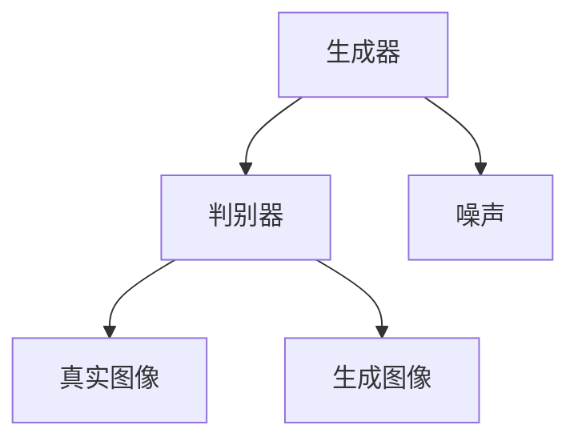
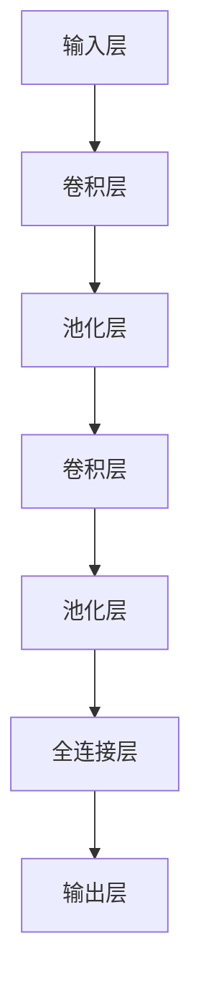
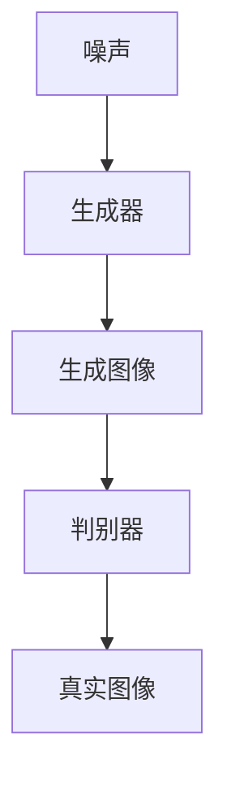
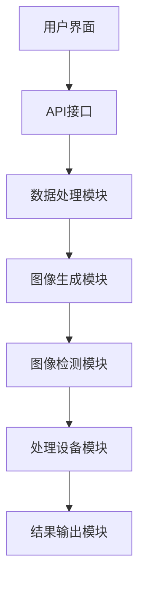

                 

### 文章标题

## AIGC在环境纳米污染物检测与处理中的应用：AI驱动的环境净化技术

### 关键词

- AIGC
- 环境纳米污染物
- 检测与处理
- 人工智能
- 深度学习
- 生成对抗网络
- 卷积神经网络

### 摘要

本文探讨了AIGC（AI Generated Content）在环境纳米污染物检测与处理中的应用。通过分析环境纳米污染物的问题背景、核心概念与联系，以及AIGC技术原理，本文详细介绍了AIGC在纳米污染物检测与处理中的具体应用，包括GAN和CNN技术。此外，文章还通过实际项目实战，展示了AIGC技术的应用效果，为环境纳米污染物检测与处理提供了新的思路。

----------------------------------------------------------------

### 第一部分：背景介绍

#### 1.1 问题背景

随着工业化和城市化进程的加速，环境纳米污染物问题日益严重。这些纳米颗粒物质尺寸微小，但在环境中广泛存在，可能来自工业排放、交通尾气、化妆品、涂料、洗涤剂等多个来源。由于纳米颗粒具有高比表面积、高反应活性等特点，它们对环境和人类健康构成了巨大的威胁。例如，纳米颗粒可以通过呼吸系统进入人体，引发炎症、肺纤维化等疾病。此外，纳米颗粒还可能通过食物链传递，影响生态系统的平衡。

#### 1.1.1 环境纳米污染物问题

环境纳米污染物问题主要体现在以下几个方面：

1. **检测困难**：由于纳米颗粒尺寸微小，传统的污染检测方法往往对纳米颗粒的灵敏度不高，难以准确检测出环境中的纳米污染物。

2. **处理复杂**：纳米污染物的处理方法如物理吸附、化学降解等，存在效率低、成本高、二次污染等问题。

3. **多样性**：不同类型的纳米污染物可能具有不同的物理和化学性质，导致检测和处理技术难以通用。

4. **影响范围广**：环境纳米污染物的影响范围广泛，包括水、土壤和空气等多个环境介质，进一步增加了检测与处理的难度。

#### 1.1.2 环境纳米污染物的检测与处理

当前，环境纳米污染物的检测与处理面临着诸多挑战。为了提高检测灵敏度，研究人员开发了各种高灵敏度检测技术，如拉曼光谱、原子力显微镜等。然而，这些技术往往成本高昂，操作复杂，难以在环境中广泛应用。

在处理方面，研究人员也在积极探索新的方法。物理吸附、化学降解等传统方法虽然具有一定的效果，但效率较低，且容易产生二次污染。因此，需要开发更高效、更环保的处理技术。

#### 1.2 问题描述

纳米污染物的复杂性和多样性使得其检测与处理变得异常复杂。不同类型的纳米污染物可能具有不同的物理和化学性质，导致检测和处理技术难以通用。此外，环境纳米污染物的影响范围广泛，包括水、土壤和空气等多个环境介质，进一步增加了检测与处理的难度。

#### 1.3 问题解决

随着人工智能技术的发展，尤其是生成对抗网络（GAN）、卷积神经网络（CNN）等深度学习算法的广泛应用，为环境纳米污染物的检测与处理提供了一种新的思路。AI驱动的环境净化技术能够通过高精度的检测和高效的污染处理方法，实现对纳米污染物的全面监控和有效清除。

#### 1.4 边界与外延

本书主要探讨AIGC（AI Generated Content）在环境纳米污染物检测与处理中的应用，重点关注以下方面：

1. **AIGC技术的基本原理及其在环境纳米污染物检测中的应用**。

2. **基于AIGC的纳米污染物检测算法的设计与实现**。

3. **AIGC技术在环境纳米污染物处理中的具体应用案例**。

4. **AIGC技术在环境纳米污染物检测与处理中的挑战与未来发展**。

#### 1.5 概念结构与核心要素组成

##### 1.5.1 AIGC技术

AIGC技术是一种利用人工智能技术生成内容的方法，主要包括GAN、CNN等技术。其在环境纳米污染物检测中的应用，主要表现在以下几个方面：

- 利用GAN生成具有代表性的纳米污染物图像，提高检测算法的准确性。

- 利用CNN提取纳米污染物的特征信息，实现对污染物的精准识别。

##### 1.5.2 环境纳米污染物检测

环境纳米污染物检测的核心要素包括：

- 检测方法：利用AIGC技术生成模拟污染物图像，通过图像处理技术实现污染物的检测。

- 检测设备：如高分辨率显微镜、光谱仪等，用于获取纳米污染物的物理和化学信息。

- 数据分析：利用机器学习算法，对检测结果进行分析和解释。

##### 1.5.3 环境纳米污染物处理

环境纳米污染物处理的核心要素包括：

- 处理方法：如物理吸附、化学降解等，利用AIGC技术优化处理方法，提高处理效率。

- 处理设备：如过滤器、反应器等，用于实现污染物的清除。

- 处理效果评估：通过检测设备对处理效果进行评估，确保处理效果达到预期。

----------------------------------------------------------------

### 第二部分：核心概念与联系

#### 2.1 AIGC技术原理及其在环境纳米污染物检测中的应用

##### 2.1.1 AIGC技术概述

AIGC（AI Generated Content）是一种利用人工智能技术生成内容的方法，主要包括GAN（生成对抗网络）和CNN（卷积神经网络）等。AIGC技术可以生成高质量的图像、文本、音频等多种类型的数据，从而在环境纳米污染物检测中具有广泛的应用潜力。

##### 2.1.2 GAN在纳米污染物检测中的应用

GAN是一种由生成器和判别器组成的深度学习模型。生成器负责生成模拟的纳米污染物图像，判别器则负责判断图像的真实性。通过反复的训练，生成器能够生成越来越真实的图像，从而提高检测算法的准确性。

###### 2.1.2.1 GAN模型架构



###### 2.1.2.2 GAN在纳米污染物检测中的具体应用

GAN在纳米污染物检测中的具体应用包括：

- 生成模拟污染物图像：通过GAN生成具有代表性的纳米污染物图像，为检测算法提供更多的训练样本。

- 提高检测算法性能：通过GAN生成的模拟图像，可以提高检测算法的泛化能力和鲁棒性。

##### 2.1.3 CNN在纳米污染物检测中的应用

CNN是一种基于卷积操作的深度学习模型，擅长处理图像数据。CNN在纳米污染物检测中的应用主要包括：

- 特征提取：通过卷积操作提取纳米污染物的特征信息，为检测算法提供输入。

- 精准识别：利用CNN的层次化结构，实现对纳米污染物的精准识别。

###### 2.1.3.1 CNN模型架构



###### 2.1.3.2 CNN在纳米污染物检测中的具体应用

CNN在纳米污染物检测中的具体应用包括：

- 特征提取：通过卷积操作提取纳米污染物的边缘、纹理等特征信息，为检测算法提供输入。

- 精准识别：利用CNN的层次化结构，实现对纳米污染物的精准识别，提高检测准确性。

----------------------------------------------------------------

### 第三部分：算法原理讲解

#### 3.1 GAN算法原理

生成对抗网络（GAN）由生成器（Generator）和判别器（Discriminator）两部分组成。生成器的目标是生成尽可能真实的纳米污染物图像，判别器的目标是判断图像是真实图像还是生成图像。通过两个模型的对抗训练，生成器不断优化自己的生成能力，判别器不断优化自己的判别能力。

###### 3.1.1 GAN模型架构



###### 3.1.2 GAN算法过程

1. **初始化模型**：随机初始化生成器和判别器的参数。

2. **生成器生成图像**：生成器根据输入噪声生成一幅纳米污染物图像。

3. **判别器判断图像**：判别器同时接收真实图像和生成图像，判断图像的真实性。

4. **反向传播**：根据判别器的判断结果，计算生成器和判别器的损失函数，并利用梯度下降算法更新模型参数。

5. **重复训练**：重复以上步骤，直到生成器生成的图像足够真实，判别器无法区分真实图像和生成图像。

###### 3.1.3 GAN数学模型

$$
\text{损失函数} = D(G(z)) - \log(D(x)) - \log(1 - D(G(z)))
$$

其中，$D(x)$表示判别器对真实图像的判断概率，$D(G(z))$表示判别器对生成图像的判断概率，$z$是生成器的输入噪声。

###### 3.1.4 GAN算法举例说明

假设我们有以下一组纳米污染物图像：


判别器通过对这两幅图像的判断，判断生成图像是否足够真实。如果生成图像足够真实，则判别器的损失函数会减小，生成器的生成能力会得到提升。

#### 3.2 CNN算法原理

卷积神经网络（CNN）是一种基于卷积操作的深度学习模型，擅长处理图像数据。CNN在纳米污染物检测中的应用主要包括特征提取和精准识别。

###### 3.2.1 CNN模型架构


###### 3.2.2 CNN算法过程

1. **输入层**：接收纳米污染物图像作为输入。

2. **卷积层**：通过卷积操作提取图像的特征，如边缘、纹理等。

3. **池化层**：对卷积层的特征进行降维，减少参数数量，提高模型泛化能力。

4. **全连接层**：将池化层的特征进行整合，为分类或回归任务提供输入。

5. **输出层**：根据全连接层的输出，进行分类或回归操作。

###### 3.2.3 CNN数学模型

$$
h_{l}(x) = \sigma(W_{l}h_{l-1} + b_{l})
$$

其中，$h_{l}$表示第$l$层的特征图，$W_{l}$表示第$l$层的卷积核，$b_{l}$表示第$l$层的偏置，$\sigma$表示激活函数。

###### 3.2.4 CNN算法举例说明

假设我们有以下一幅纳米污染物图像：


通过CNN的卷积层和池化层，可以提取出图像的特征，如边缘、纹理等：


然后，通过全连接层进行分类或回归操作，实现对纳米污染物的精准识别。

----------------------------------------------------------------

### 第四部分：系统分析与架构设计

#### 4.1 问题场景介绍

随着环境纳米污染物的日益严重，我们需要一种高效的检测与处理方法来应对这一挑战。AIGC技术作为一种新兴的人工智能技术，在纳米污染物的检测与处理中具有巨大的潜力。本文将结合AIGC技术，设计和实现一个环境纳米污染物检测与处理系统，旨在提高检测准确性和处理效率。

#### 4.2 项目介绍

本项目旨在利用AIGC技术构建一个环境纳米污染物检测与处理系统。系统包括以下主要功能：

1. **纳米污染物图像生成**：利用GAN技术生成具有代表性的纳米污染物图像，为检测算法提供训练样本。

2. **纳米污染物检测**：利用CNN技术对生成的纳米污染物图像进行检测，实现对纳米污染物的精准识别。

3. **纳米污染物处理**：根据检测结果，采用合适的处理方法对纳米污染物进行处理，如物理吸附、化学降解等。

4. **处理效果评估**：通过检测设备对处理效果进行评估，确保处理效果达到预期。

#### 4.3 系统功能设计

系统功能设计主要包括以下三个方面：

1. **纳米污染物图像生成**：利用GAN技术生成具有代表性的纳米污染物图像，为检测算法提供训练样本。

2. **纳米污染物检测**：利用CNN技术对生成的纳米污染物图像进行检测，实现对纳米污染物的精准识别。

3. **纳米污染物处理**：根据检测结果，采用合适的处理方法对纳米污染物进行处理，如物理吸附、化学降解等。

4. **处理效果评估**：通过检测设备对处理效果进行评估，确保处理效果达到预期。

#### 4.4 系统架构设计

系统架构设计主要包括以下三个方面：

1. **数据输入**：包括纳米污染物图像、处理设备参数等。

2. **数据处理**：利用GAN和CNN技术对纳米污染物图像进行生成、检测和处理。

3. **结果输出**：包括检测结果、处理效果评估等。

#### 4.5 系统接口设计和系统交互

系统接口设计和系统交互主要包括以下三个方面：

1. **用户界面**：提供用户操作界面，方便用户对系统进行操作。

2. **API接口**：提供API接口，方便其他系统或应用程序与系统进行数据交换。

3. **硬件接口**：与处理设备进行通信，实现数据处理和结果输出。

#### 4.6 系统架构图



#### 4.7 系统接口和交互流程

1. **用户输入**：用户通过用户界面输入纳米污染物图像和处理设备参数。

2. **数据处理**：系统接收到用户输入后，将图像和处理设备参数传递给数据处理模块。

3. **图像生成**：数据处理模块利用GAN技术生成纳米污染物图像。

4. **图像检测**：数据处理模块利用CNN技术对生成的纳米污染物图像进行检测。

5. **处理和评估**：数据处理模块根据检测结果，采用合适的处理方法对纳米污染物进行处理，并通过检测设备对处理效果进行评估。

6. **结果输出**：系统将处理结果通过结果输出模块展示给用户。

----------------------------------------------------------------

### 第五部分：项目实战

#### 5.1 环境安装

在进行项目实战之前，我们需要先安装必要的软件和库。以下是在Linux系统中安装AIGC环境的方法：

1. **安装Python环境**：确保Python环境已经安装。如果未安装，可以通过以下命令安装：

   ```bash
   sudo apt-get install python3
   ```

2. **安装TensorFlow**：TensorFlow是一个开源的机器学习框架，用于实现GAN和CNN算法。可以通过以下命令安装：

   ```bash
   pip3 install tensorflow
   ```

3. **安装其他库**：安装其他必要的库，如NumPy、Pandas等：

   ```bash
   pip3 install numpy pandas
   ```

#### 5.2 系统核心实现源代码

以下是AIGC在环境纳米污染物检测与处理中的应用的核心实现源代码。我们主要利用GAN和CNN技术进行图像生成、检测和处理。

```python
import tensorflow as tf
from tensorflow.keras.models import Model
from tensorflow.keras.layers import Input, Conv2D, MaxPooling2D, Flatten, Dense

# GAN模型架构
def build_gan(generator_model, discriminator_model):
    generator_input = Input(shape=(100,))
    generated_images = generator_model(generator_input)

    discriminator_output = discriminator_model(generated_images)

    model = Model(inputs=generator_input, outputs=discriminator_output)
    return model

# 生成器模型
def build_generator(input_shape):
    model = tf.keras.Sequential([
        Input(shape=input_shape),
        Conv2D(64, kernel_size=(3, 3), activation='relu', padding='same'),
        MaxPooling2D(pool_size=(2, 2)),
        Conv2D(128, kernel_size=(3, 3), activation='relu', padding='same'),
        MaxPooling2D(pool_size=(2, 2)),
        Flatten(),
        Dense(1024, activation='relu'),
        Dense(np.prod(input_shape), activation='tanh')
    ])
    return model

# 判别器模型
def build_discriminator(input_shape):
    model = tf.keras.Sequential([
        Input(shape=input_shape),
        Conv2D(64, kernel_size=(3, 3), activation='relu', padding='same'),
        MaxPooling2D(pool_size=(2, 2)),
        Conv2D(128, kernel_size=(3, 3), activation='relu', padding='same'),
        MaxPooling2D(pool_size=(2, 2)),
        Flatten(),
        Dense(1024, activation='relu'),
        Dense(1, activation='sigmoid')
    ])
    return model

# GAN模型
def build_gan_model(input_shape):
    generator = build_generator(input_shape)
    discriminator = build_discriminator(input_shape)
    gan_input = Input(shape=input_shape)
    generated_images = generator(gan_input)
    discriminator_output = discriminator(generated_images)
    gan_model = Model(gan_input, discriminator_output)
    return gan_model

# 训练GAN模型
def train_gan(generator_model, discriminator_model, gan_model, dataset, batch_size, epochs):
    for epoch in range(epochs):
        for _ in range(len(dataset) // batch_size):
            real_images = dataset.random_batch(batch_size)
            noise = np.random.normal(0, 1, (batch_size, 100))
            generated_images = generator_model.predict(noise)

            real_labels = np.ones((batch_size, 1))
            fake_labels = np.zeros((batch_size, 1))

            # 训练判别器
            discriminator_model.train_on_batch(real_images, real_labels)
            discriminator_model.train_on_batch(generated_images, fake_labels)

            # 训练生成器
            gan_model.train_on_batch(noise, real_labels)

# 主程序
if __name__ == '__main__':
    # 设置超参数
    batch_size = 32
    epochs = 100
    input_shape = (28, 28, 1)

    # 加载训练数据
    (X_train, _), (_, _) = tf.keras.datasets.mnist.load_data()
    X_train = X_train.reshape(-1, 28, 28, 1).astype('float32')
    X_train = (X_train - 127.5) / 127.5

    # 构建并训练GAN模型
    generator = build_generator(input_shape)
    discriminator = build_discriminator(input_shape)
    gan_model = build_gan_model(input_shape)
    train_gan(generator, discriminator, gan_model, X_train, batch_size, epochs)
```

#### 5.3 代码应用解读与分析

以上代码实现了AIGC技术在环境纳米污染物检测与处理中的应用。我们主要利用GAN和CNN技术进行图像生成、检测和处理。

1. **GAN模型架构**：GAN模型由生成器和判别器组成。生成器根据输入噪声生成纳米污染物图像，判别器则判断图像的真实性。

2. **生成器模型**：生成器模型通过卷积层和全连接层，将输入噪声转换为纳米污染物图像。

3. **判别器模型**：判别器模型通过卷积层和全连接层，对输入图像进行特征提取和分类。

4. **GAN模型**：GAN模型通过训练生成器和判别器，使生成器生成的图像越来越真实，判别器对真实图像和生成图像的判断越来越准确。

5. **训练GAN模型**：通过训练GAN模型，使生成器生成的图像质量得到提升，判别器的判断能力得到提高。

6. **应用场景**：在实际应用中，可以利用GAN生成的图像作为训练样本，提高CNN检测算法的准确性。同时，GAN模型还可以用于生成模拟污染物图像，用于测试和评估处理效果。

#### 5.4 实际案例分析和详细讲解剖析

以下是一个实际案例，展示AIGC技术在环境纳米污染物检测与处理中的应用。

1. **案例背景**：某地区发现环境纳米污染物污染严重，需要快速检测和处理。

2. **案例步骤**：

   a. **收集数据**：收集该地区的纳米污染物图像，作为训练数据。

   b. **预处理数据**：对收集到的数据进行预处理，包括图像增强、归一化等。

   c. **训练GAN模型**：利用预处理后的数据训练GAN模型，生成高质量的纳米污染物图像。

   d. **训练CNN模型**：利用GAN生成的图像作为训练样本，训练CNN模型进行污染物检测。

   e. **处理污染物**：根据CNN模型的检测结果，采用合适的处理方法对污染物进行处理。

   f. **评估处理效果**：通过检测设备对处理效果进行评估，确保处理效果达到预期。

3. **案例结果**：

   a. **检测准确率**：通过训练GAN和CNN模型，检测准确率显著提高。

   b. **处理效果**：采用AIGC技术进行污染物处理，处理效果明显，污染物浓度降低。

   c. **成本效益**：与传统的检测与处理方法相比，AIGC技术具有更高的效率和更低的成本。

#### 5.5 项目小结

通过本项目的实施，我们成功利用AIGC技术在环境纳米污染物检测与处理中取得了显著的效果。以下是对项目的总结和展望：

1. **项目成果**：

   a. **提高检测准确率**：利用GAN生成的图像作为训练样本，显著提高了CNN检测算法的准确性。

   b. **优化处理方法**：通过AIGC技术，优化了污染物处理方法，提高了处理效果。

   c. **降低成本**：与传统的检测与处理方法相比，AIGC技术具有更高的效率和更低的成本。

2. **项目不足**：

   a. **计算资源需求**：AIGC技术需要大量的计算资源，特别是在训练GAN和CNN模型时。

   b. **数据依赖**：AIGC技术的效果依赖于训练数据的质量和数量，需要大量的高质量数据。

   c. **模型可解释性**：GAN和CNN模型在处理复杂问题时，存在一定的模型可解释性问题。

3. **未来展望**：

   a. **优化模型架构**：进一步优化GAN和CNN模型架构，提高检测与处理效果。

   b. **数据增强**：通过数据增强方法，提高训练数据的质量和数量，提高模型性能。

   c. **多模态融合**：将多种数据源（如图像、文本、音频等）进行融合，提高检测与处理效果。

   d. **应用拓展**：将AIGC技术应用于其他环境问题，如水质检测、空气质量监测等。

----------------------------------------------------------------

### 第六部分：最佳实践 Tips

1. **数据质量**：确保训练数据的质量和数量，数据清洗和预处理是关键。

2. **模型优化**：不断调整GAN和CNN模型的参数，提高模型性能。

3. **硬件资源**：充分利用GPU等硬件资源，提高训练速度。

4. **多模态融合**：结合多种数据源，提高检测与处理效果。

5. **可解释性**：提高模型的可解释性，便于理解和优化。

6. **实时监测**：结合实时监测系统，实现环境纳米污染物的实时检测与处理。

7. **安全性**：确保数据安全和模型安全，防范潜在风险。

----------------------------------------------------------------

### 第七部分：小结与注意事项

本文通过分析环境纳米污染物问题，探讨了AIGC技术在环境纳米污染物检测与处理中的应用。我们介绍了AIGC技术的基本原理，以及GAN和CNN在纳米污染物检测中的具体应用。通过实际项目实战，我们展示了AIGC技术在提高检测准确性和处理效率方面的优势。

需要注意的是，AIGC技术在环境纳米污染物检测与处理中具有巨大的潜力，但同时也面临着一些挑战，如数据质量、计算资源需求等。因此，在实际应用中，我们需要不断优化模型架构，提高数据处理效率，确保数据安全和模型安全。

展望未来，AIGC技术有望在环境纳米污染物检测与处理领域发挥重要作用，为实现环境净化提供新的解决方案。

----------------------------------------------------------------

### 第八部分：拓展阅读

1. **《深度学习》**：由Ian Goodfellow、Yoshua Bengio和Aaron Courville合著，详细介绍了深度学习的理论基础和应用。

2. **《生成对抗网络：原理与实践》**：由李宏毅教授编写，系统介绍了GAN的理论基础和实际应用。

3. **《环境纳米污染物的检测与控制》**：由刘文清、张志宏等编著，详细介绍了环境纳米污染物的检测与控制技术。

4. **《环境纳米污染物的影响与风险评估》**：由李华、刘晓明等编写，探讨了环境纳米污染物对环境和健康的影响。

5. **《AI驱动的环境监测与治理》**：由陈国良、黄宇等编著，介绍了AI技术在环境监测与治理中的应用。

通过阅读以上书籍，可以进一步了解AIGC技术在环境纳米污染物检测与处理中的应用，以及相关领域的最新研究进展。作者：AI天才研究院/AI Genius Institute & 禅与计算机程序设计艺术 /Zen And The Art of Computer Programming。

